# 17：使用 SymPy 进行自动代码生成 🚀

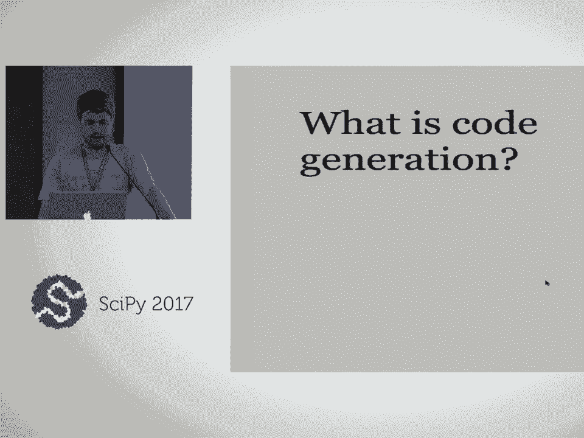

在本课程中，我们将学习如何利用 SymPy 的代码生成功能，将符号数学表达式自动转换为多种编程语言的代码。我们将从基础概念开始，逐步深入到高级应用，包括自定义代码打印器和性能优化技术。

## 概述

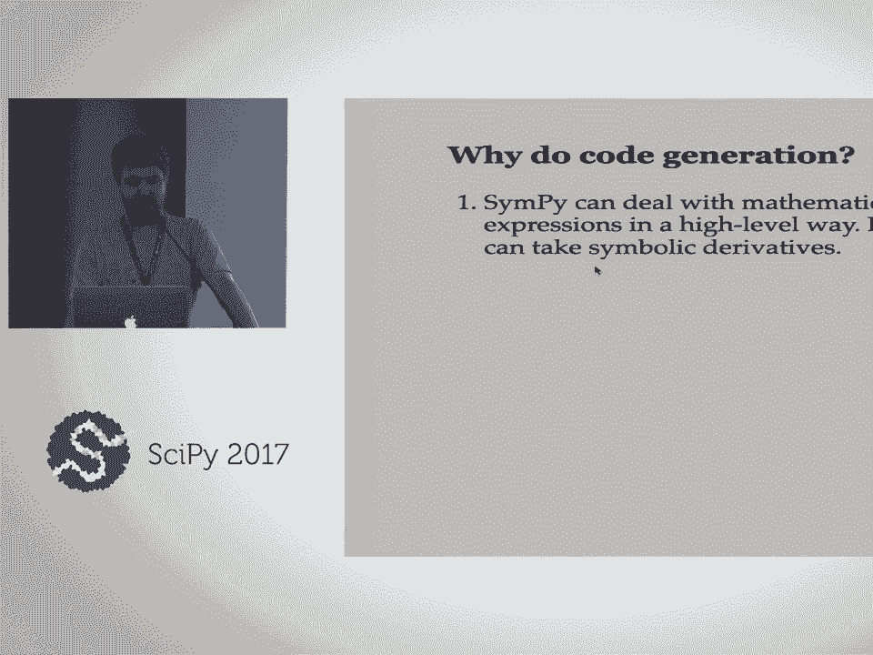

SymPy 是一个强大的符号数学库，它不仅能进行符号计算，还能将复杂的数学表达式自动转换为高效的数值计算代码。本教程将引导你了解 SymPy 的代码生成工作流程，从简单的表达式转换到生成完整的、可编译的函数，并最终集成到科学计算流程中。

---

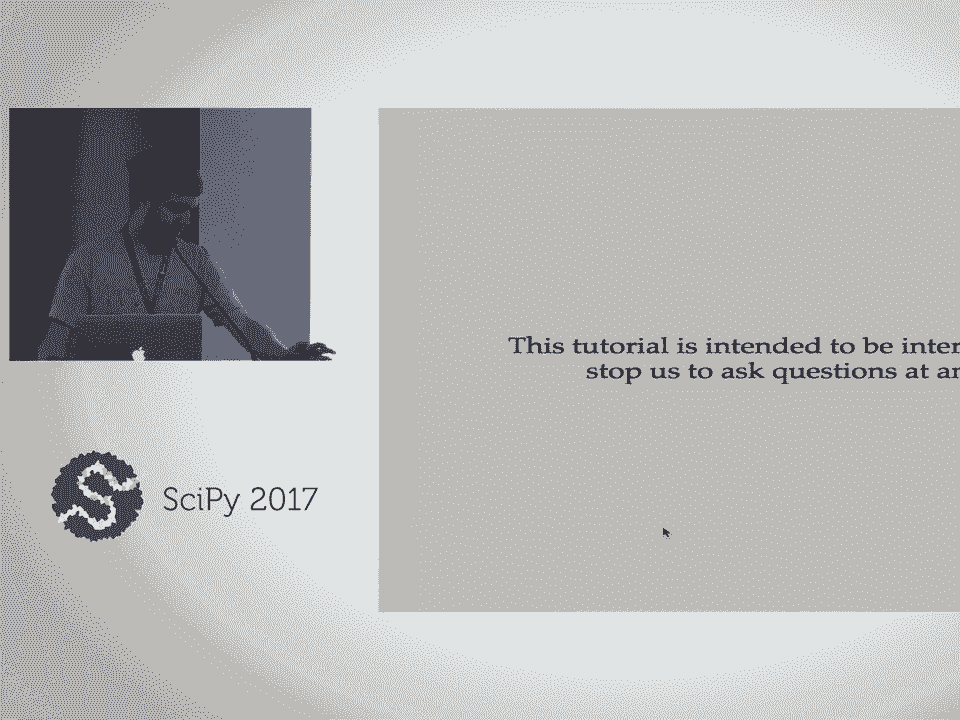

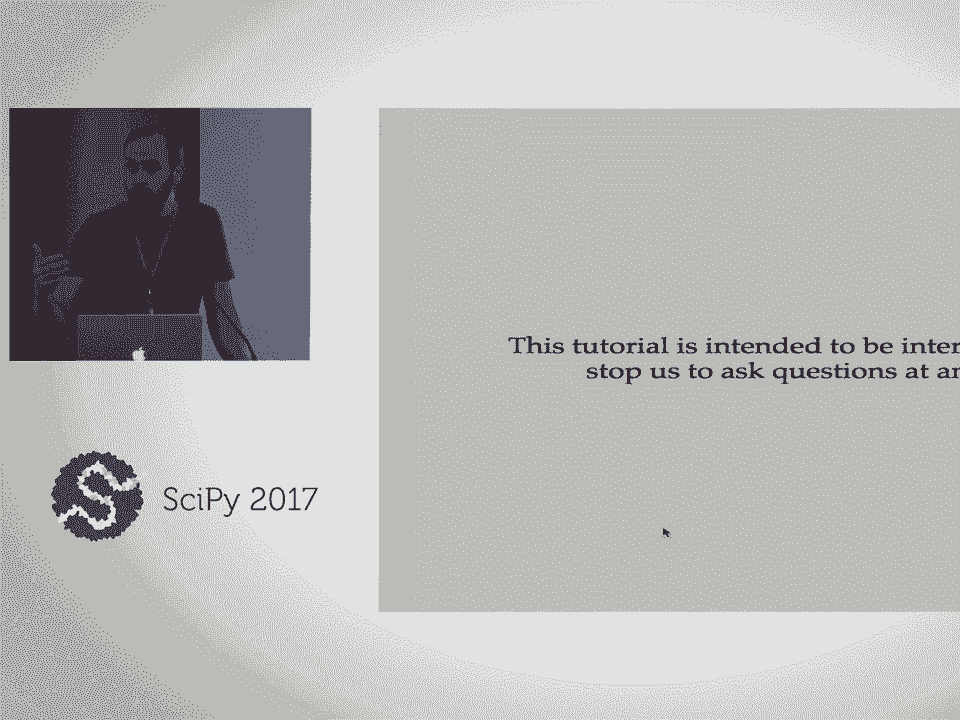

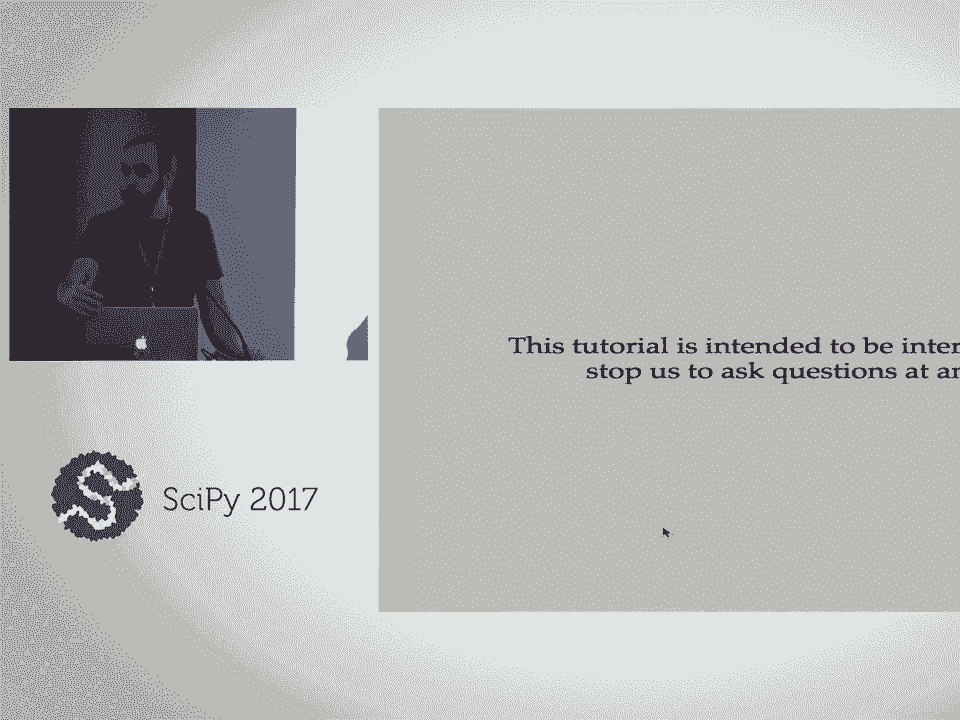

## 1. SymPy 表达式基础回顾 🔄

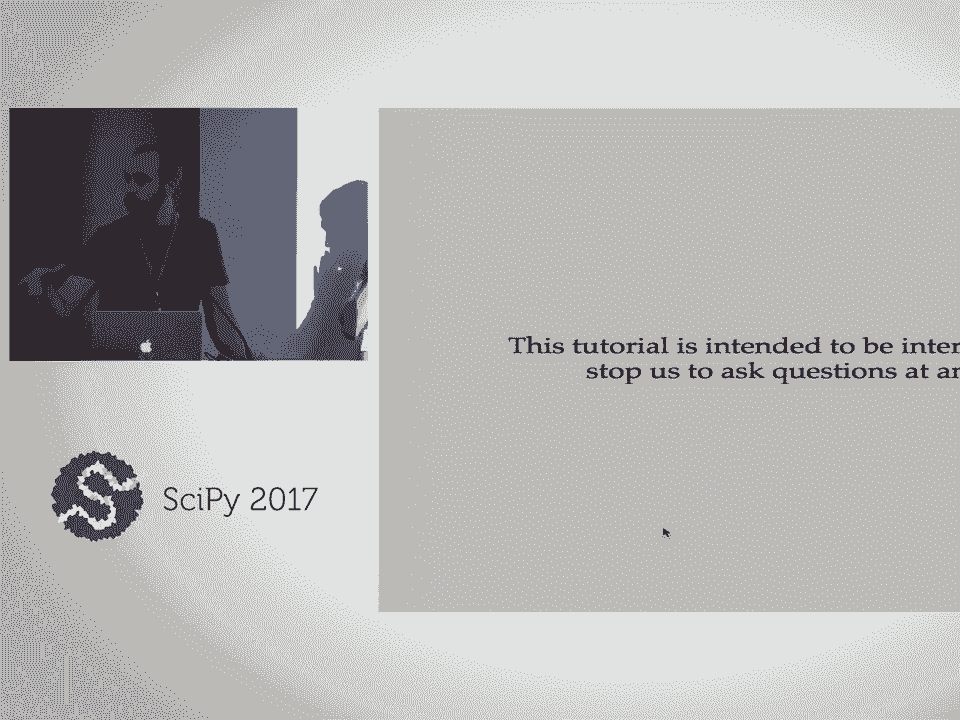

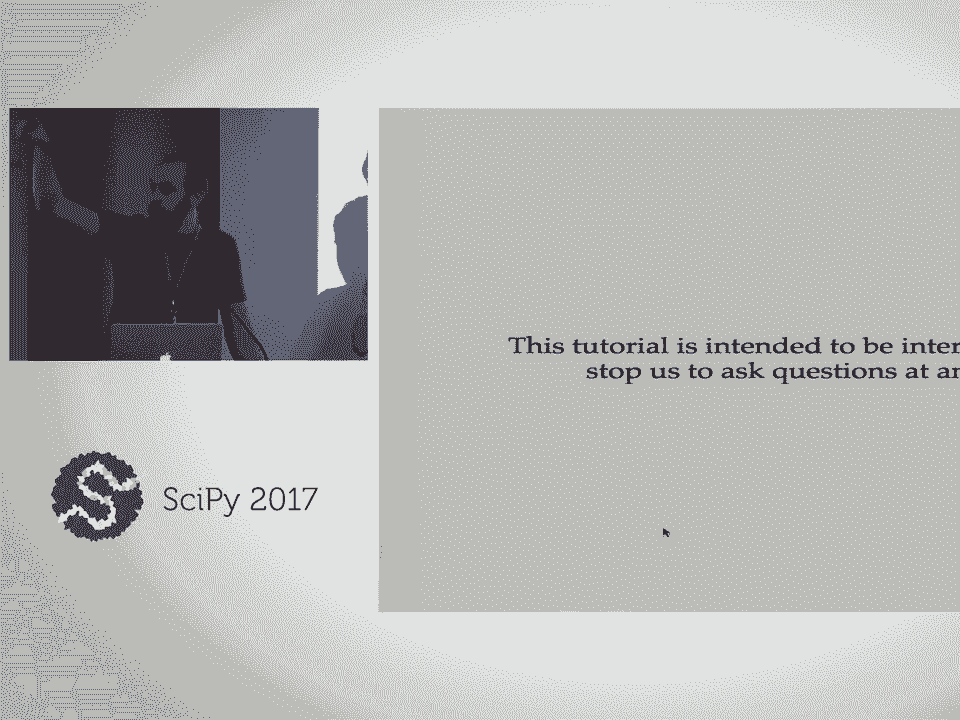

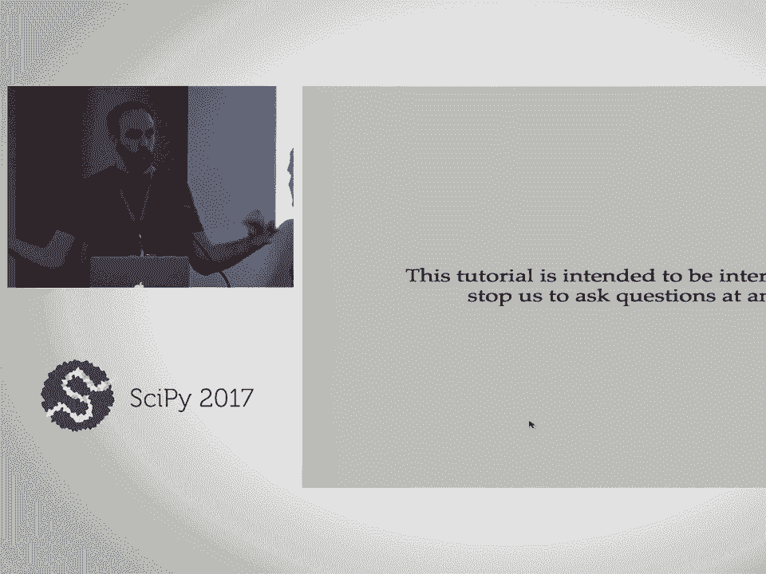


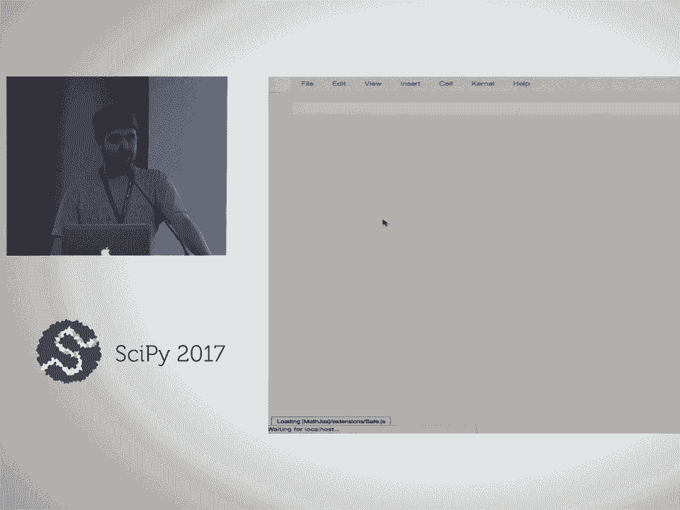

在深入代码生成之前，我们需要确保对 SymPy 的基本操作有清晰的理解。SymPy 的核心是符号表达式，它允许我们以数学形式而非数值形式处理问题。

首先，我们导入 SymPy 并设置漂亮的打印输出，以便更直观地查看表达式。

```python
import sympy as sp
sp.init_printing()
```

### 创建符号

符号是构建表达式的基本单元。我们使用 `symbols` 函数来创建它们。

```python
x, y, z = sp.symbols('x y z')
alpha_1, omega_2 = sp.symbols('alpha_1 omega_2')
```

### 构建表达式

有了符号，我们就可以像书写数学公式一样构建表达式。

```python
expr = sp.sin(x) + sp.cos(y)
expr
```

### 第一个练习：创建正态分布表达式

以下是你的第一个练习。请尝试使用 SymPy 符号重新创建以下正态分布的概率密度函数表达式：

$$
f(x) = \frac{1}{\sqrt{2\pi\sigma^2}} e^{-\frac{(x-\mu)^2}{2\sigma^2}}
$$

**提示**：你需要创建符号 `sigma` 和 `mu`，并使用 `sp.sqrt` 表示平方根，`sp.exp` 表示指数函数。

当你完成时，请贴上蓝色便签。

---

上一节我们回顾了如何创建基本的 SymPy 表达式。本节中，我们将看看在使用 SymPy 时需要注意的几个常见问题。

### 使用 SymPy 时的注意事项

以下是三个初学者常犯的错误，了解它们可以避免很多麻烦。

1.  **整数除法问题**：在 Python 中，`1/2` 的结果是浮点数 `0.5`。但在符号计算中，我们通常希望保持精确的有理数形式。
    ```python
    # 错误做法：得到浮点数
    expr_wrong = x + 1/2
    # 正确做法：得到有理数
    expr_correct1 = x + sp.S(1)/2
    expr_correct2 = x + sp.Rational(1, 2)
    ```

2.  **幂运算符**：在 Python 和 SymPy 中，幂运算符是 `**`，而不是 `^`。
    ```python
    # 错误做法：^ 是异或运算符
    expr_wrong = x^2
    # 正确做法
    expr_correct = x**2
    ```

3.  **表达式不可变性**：所有 SymPy 表达式都是不可变的。任何操作都会返回一个新的表达式，而不会修改原表达式。
    ```python
    expr = x + 1
    new_expr = expr.subs(x, 2)  # 返回新表达式 3
    # expr 仍然是 x + 1
    ```

### 数值计算与任意精度

SymPy 可以进行精确的符号计算，也能转换为高精度的数值。

```python
# 精确的 sqrt(2)
expr_exact = sp.sqrt(2)
# 转换为浮点数
float_val = expr_exact.evalf()
# 获取100位精度
high_precision = expr_exact.evalf(100)
```

**练习**：请计算圆周率 π 的 100 位精度数值。

---

### 未定义函数与微分

在建模动态系统或微分方程时，我们需要使用未定义的函数。

```python
# 创建一个未定义的函数 f
f = sp.Function('f')
# 创建包含 f 的表达式
expr_with_f = f(x) + x**2
```

SymPy 可以轻松计算符号导数。

```python
expr = sp.sin(x+1) * sp.cos(y)
# 对 x 求导
sp.diff(expr, x)
# 对 y 求导
sp.diff(expr, y)
# 对未定义函数求导
sp.diff(f(x), x)
```

**练习**：请使用 SymPy 写出以下波动方程的符号形式：

$$
\frac{\partial^2 u}{\partial t^2} = c^2 \frac{\partial^2 u}{\partial x^2}
$$

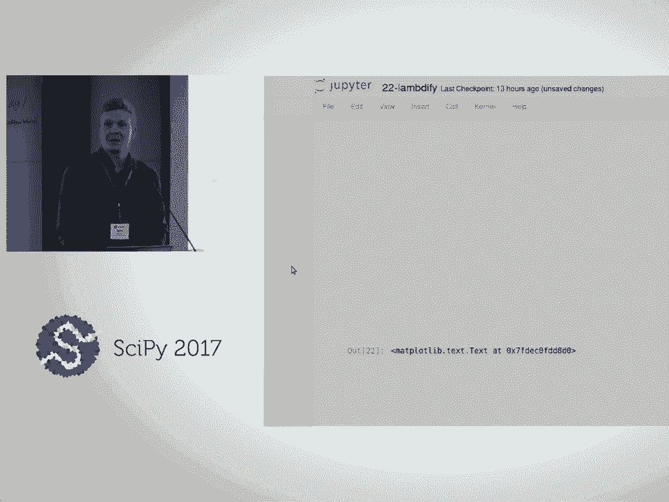

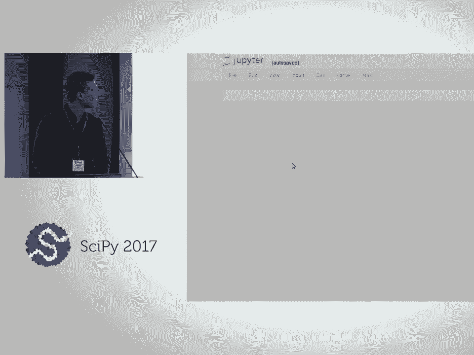

**提示**：`u` 是 `t` 和 `x` 的函数。使用 `sp.Eq` 创建等式。

---

### 矩阵与雅可比矩阵

SymPy 支持符号矩阵运算，这对于多变量系统建模至关重要。

```python
# 创建一个矩阵
M = sp.Matrix([[1, 2], [3, 4]])
# 创建一个列向量
v = sp.Matrix([x, y, z])
# 矩阵乘法
M * v
```

雅可比矩阵计算也非常直接。

```python
# 假设 F 是一个向量值函数
F = sp.Matrix([x*y, y*z, z*x])
# 计算雅可比矩阵
J = F.jacobian([x, y, z])
```

**练习**：
1.  创建矩阵 `M = [[1,0,1], [-1,2,3], [1,2,3]]`。
2.  创建列向量 `v = [x, y, z]`。
3.  计算 `M * v`。
4.  计算结果向量关于 `[x, y, z]` 的雅可比矩阵。你发现了什么？

---

## 2. 代码打印机初探 🖨️

现在我们已经熟悉了 SymPy 表达式，让我们开始探索代码生成的核心工具：代码打印机。代码打印机负责将 SymPy 表达式转换为特定编程语言的代码字符串。

SymPy 支持多种语言，包括 C、C++、Fortran、Julia、JavaScript 等。

```python
expr = sp.Abs(sp.sin(sp.pi * x**2))
# 生成 C 代码
print(sp.ccode(expr))
# 生成 Fortran 代码
print(sp.fcode(expr))
# 生成 Julia 代码
print(sp.julia_code(expr))
# 生成 JavaScript 代码
print(sp.jscode(expr))
```


每个打印机都有可配置的选项，例如指定 C 语言标准。

```python
# 使用 C89 标准
printer_c89 = sp.printing.ccode.C89CodePrinter()
print(printer_c89.doprint(expr))
# 使用 C99 标准
printer_c99 = sp.printing.ccode.C99CodePrinter()
print(printer_c99.doprint(expr))
```

**练习**：请选择一个你感兴趣的编程语言，用不同的数学表达式（包含三角函数、指数、对数等）测试其代码打印机，观察输出有何不同。你遇到了任何错误或意外行为吗？


---

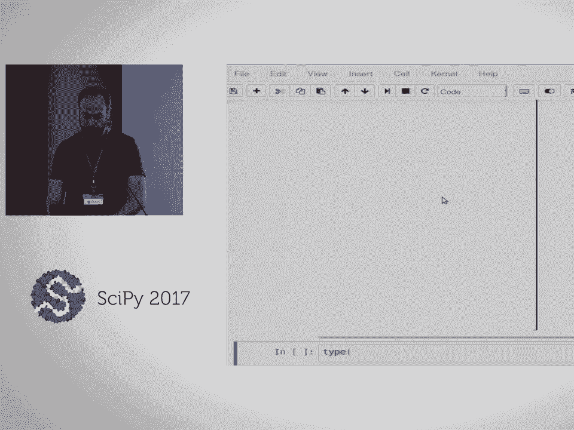

上一节我们看到了如何将单个表达式转换为代码片段。本节中，我们将学习一个更高级、更便捷的函数：`lambdify`，它能直接将表达式转换为可调用的数值函数。

## 3. 简单方式：使用 `lambdify` 进行代码生成 ⚡

`lambdify` 函数是 SymPy 中进行代码生成最直接的方法。它接收一个 SymPy 表达式和一组符号，然后返回一个高效的、用于数值计算的 Python 函数。

### 为什么需要 `lambdify`？

直接使用 `subs()` 和 `evalf()` 进行数值计算虽然可行，但速度很慢，因为它每次都要进行符号替换和任意精度计算。

```python
expr = x**2 + sp.sin(y)
# 慢速方法
slow_val = expr.subs({x: 1.5, y: 0.3}).evalf()
```

`lambdify` 通过将表达式编译为底层代码（默认使用 NumPy）来大幅提升速度。

```python
# 使用 lambdify 创建快速函数
fast_func = sp.lambdify((x, y), expr, ‘numpy’)
# 现在可以快速计算
fast_val = fast_func(1.5, 0.3)
```

### 控制函数签名

有时我们需要函数具有特定的参数结构，例如与 SciPy 的求解器兼容。

```python
# 创建一个函数，其第三个参数是一个包含三个值的元组
args = (x, (y, z, x)) # y, z, x 被打包成一个元组作为第二个参数
special_func = sp.lambdify(args, expr)
result = special_func(1.0, (2.0, 3.0, 4.0)) # 调用方式
```

**练习**：给定函数 $f(x, y) = \sin(x^2 + y^2)$。
1.  使用 `lambdify` 创建一个数值函数。
2.  计算该函数在点 $(0.5, 0.5)$ 处关于 $x$ 和 $y$ 的混合偏导数 $\frac{\partial^2 f}{\partial x \partial y}$ 的数值。
3.  （可选）使用 Matplotlib 绘制该函数在区域 $x, y \in [-2, 2]$ 上的图像。

---

### 应用实例：化学动力学建模 🧪

让我们将 `lambdify` 应用于一个实际问题：模拟化学反应动力学。我们考虑亚硝酰溴（NOBr）的形成与分解反应。

反应方程式为：
$$
2NO + Br_2 \rightleftharpoons 2NOBr
$$

根据质量作用定律，我们可以建立常微分方程组（ODE）来描述各物质浓度的变化。

```python
# 定义符号：浓度 C1=[NO], C2=[Br2], C3=[NOBr]， 速率常数 kf, kb
C1, C2, C3, kf, kb, t = sp.symbols(‘C1 C2 C3 kf kb t’)
# 根据质量作用定律建立 ODE
dC1_dt = -2*kf*C1**2*C2 + 2*kb*C3**2
dC2_dt = -kf*C1**2*C2 + kb*C3**2
dC3_dt = 2*kf*C1**2*C2 - 2*kb*C3**2
```

为了使用 SciPy 的 `odeint` 求解器进行数值积分，我们需要一个函数来计算 ODE 的右侧（RHS）。

```python
# 手动编写 RHS 函数（容易出错）
def rhs_manual(y, t, kf, kb):
    C1, C2, C3 = y
    dC1 = -2*kf*C1**2*C2 + 2*kb*C3**2
    dC2 = -kf*C1**2*C2 + kb*C3**2
    dC3 = 2*kf*C1**2*C2 - 2*kb*C3**2
    return [dC1, dC2, dC3]
```

使用 SymPy 和 `lambdify`，我们可以自动、无误地生成这个函数。

```python
# 状态向量
state_vec = sp.Matrix([C1, C2, C3])
# RHS 向量
rhs_vec = sp.Matrix([dC1_dt, dC2_dt, dC3_dt])
# 使用 lambdify 自动生成函数
# 注意函数签名匹配 odeint 的要求：(y, t, ...args)
rhs_func = sp.lambdify((state_vec, t, kf, kb), rhs_vec)
```

**练习**：使用上面生成的 `rhs_func`，结合 SciPy 的 `odeint`，模拟从初始浓度 `[C1, C2, C3] = [2.0, 1.0, 0.0]` 开始，在 `t=[0, 10]` 时间范围内的反应过程。假设 `kf=1.0`, `kb=0.5`。绘制三种物质浓度随时间的变化曲线。

---

### 进阶：生成解析雅可比矩阵

对于刚性 ODE 问题，向求解器提供解析的雅可比矩阵可以显著提高求解效率和稳定性。SymPy 可以轻松计算雅可比矩阵。

```python
# 计算 RHS 向量关于状态向量的雅可比矩阵
jacobian_mat = rhs_vec.jacobian(state_vec)
# 使用 lambdify 生成雅可比矩阵函数
jacobian_func = sp.lambdify((state_vec, t, kf, kb), jacobian_mat)
```

现在，你可以将 `rhs_func` 和 `jacobian_func` 一起传递给 `odeint`（通过 `Dfun` 参数）。

**练习**：对一个更复杂的化学反应系统（例如 Robertson 问题，一个经典的刚性 ODE）重复上述过程：构建符号 ODE，生成 RHS 函数和雅可比矩阵函数，并使用 `odeint` 进行求解。比较提供和不提供雅可比矩阵时求解器的性能和结果。

---

## 4. 深入方式：自定义打印机与 CSE 🛠️

上一节我们使用了高级函数 `lambdify`。本节中，我们将深入底层，学习如何直接控制代码打印过程，并引入公共子表达式消除（CSE）来优化生成的代码。

### 使用代码打印机类

`lambdify` 背后使用的是代码打印机。我们可以直接实例化并使用它们。

```python
from sympy.printing.ccode import C99CodePrinter
printer = C99CodePrinter()
# 打印一个简单表达式
expr = sp.sin(x)**2 + sp.cos(x)**2
print(printer.doprint(expr))
```

然而，直接打印表达式通常不足以生成有效的 C 代码，因为 C 代码需要赋值语句。我们需要使用**矩阵符号**来指定赋值目标。

```python
# 创建一个矩阵符号作为赋值目标
result = sp.MatrixSymbol(‘result’, 3, 1) # 3x1 的矩阵符号
# 要计算的表达式向量
expr_vec = sp.Matrix([x**2, sp.sin(y), sp.log(z)])
# 打印赋值代码
print(printer.doprint(expr_vec, assign_to=result))
```
输出将是类似 `result[0] = pow(x, 2); result[1] = sin(y); result[2] = log(z);` 的代码。

**练习**：对于之前化学动力学模型的 RHS 向量 `rhs_vec`，使用 `C99CodePrinter` 和矩阵符号，生成将其赋值给一个名为 `dy` 的数组的 C 代码。

---

### 自定义代码打印机

有时默认的打印方式不符合我们的需求。例如，我们可能想改变变量名，或者使用特定库中的函数。这可以通过子类化现有的打印机并重写其 `_print_*` 方法来实现。

所有打印机都有许多以 `_print_` 开头的方法，每个方法负责打印一种特定类型的 SymPy 对象（如 `_print_Symbol`, `_print_Pow`, `_print_Matrix`）。

```python
class MyCustomCPrinter(C99CodePrinter):
    def _print_Symbol(self, expr):
        # 将所有符号 ‘y’ 打印为 ‘state[0]’，‘z’ 打印为 ‘state[1]’ 等。
        # 这里是一个简单示例：将所有符号名转为大写
        return self._print(expr.name.upper())

custom_printer = MyCustomCPrinter()
print(custom_printer.doprint(x + y))
# 输出: X + Y
```

**练习**：在化学动力学 ODE 中，状态变量是 `C1, C2, C3`。创建一个自定义打印机，将它们分别打印为 `state[0], state[1], state[2]`。

**进阶练习**：创建一个自定义打印机，将小整数次幂（如 `x**2`, `x**3`）展开为乘法形式（如 `x*x`, `x*x*x`），而对其他次幂保持使用 `pow` 函数。

---

### 公共子表达式消除

在大型表达式中，相同的子表达式可能会重复计算多次。公共子表达式消除（CSE）是一种优化技术，它识别这些重复部分，计算一次并将结果存储在临时变量中，然后在主表达式中引用这些变量。

这可以减少计算量和代码大小，有时还能提高数值稳定性。

```python
from sympy import cse
# 一个含有公共子表达式的例子
expr1 = sp.sin(x) * sp.log(x)
expr2 = sp.cos(x) * sp.log(x) # log(x) 是公共子表达式
# 应用 CSE
replacements, reduced_exprs = cse([expr1, expr2])
print(“替换（临时变量）:”)
for var, subexpr in replacements:
    print(f” {var} = {subexpr}“)
print(“简化后的表达式:”)
for expr in reduced_exprs:
    print(f” {expr}“)
```

**练习**：对化学动力学模型的 RHS 向量 `rhs_vec` 应用 CSE。观察生成了多少个临时变量。然后，使用自定义打印机，生成包含这些临时变量定义和最终赋值语句的完整 C 代码块。

**终极挑战**：将以上所有内容结合起来：
1.  为化学动力学 ODE 系统计算 RHS 和雅可比矩阵。
2.  对这两个表达式列表一起应用 CSE，找出它们共有的子表达式。
3.  创建一个自定义打印机，生成一个完整的 C 函数。该函数应：
    *   定义所有临时变量。
    *   计算 RHS 向量的值并填入输出数组 `dy`。
    *   计算雅可比矩阵的值并填入输出数组 `jac`（按行展开成一维数组）。
4.  将生成的代码嵌入一个 C 程序模板，编译并运行它，验证结果是否正确。

---

## 5. 集成与自动化：`autowrap` 与外部库 🌉

上一节我们手动处理了代码生成和打印。本节中，我们将介绍 `autowrap` 工具，它能将代码生成、编译和包装成 Python 可调用模块的过程自动化。我们还将学习如何集成外部 C 库。

### 使用 `codegen` 生成 C 文件

`sympy.utilities.codegen` 模块中的 `code