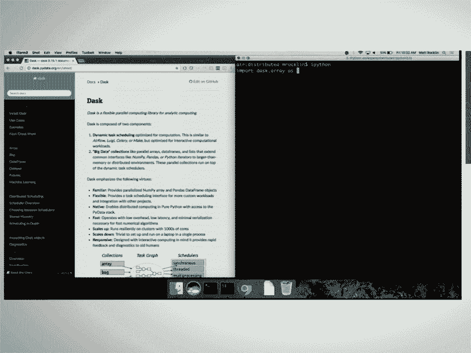
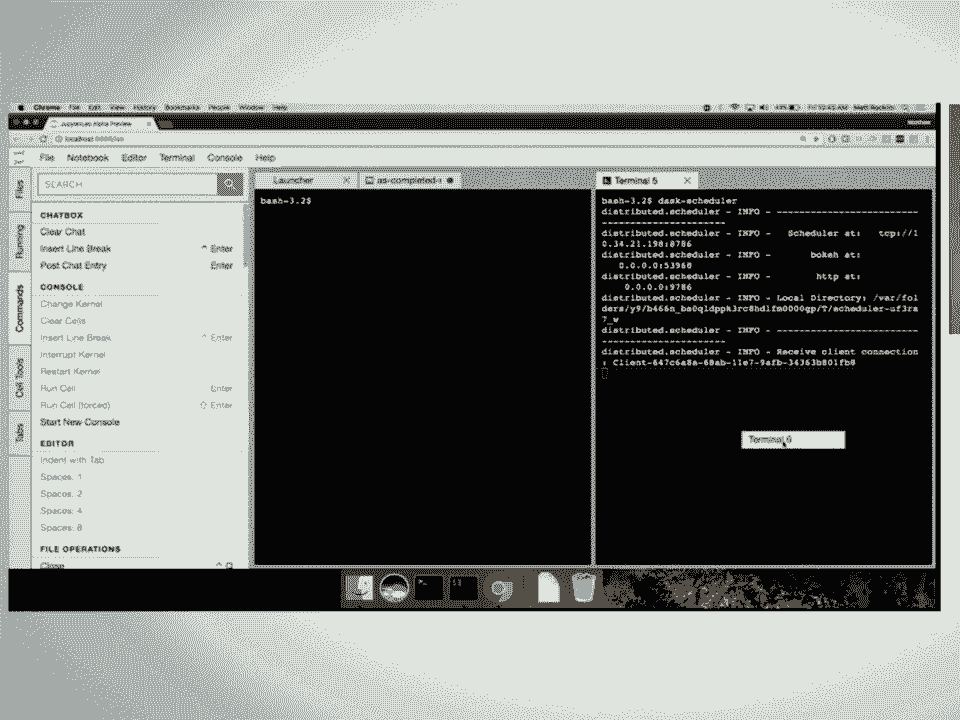

# 19：Dask 高级技巧 🚀

在本课程中，我们将学习 Dask 分布式调度器的高级功能，包括实时任务调度、异步操作、多客户端协作以及如何构建复杂的数据处理管道。我们将通过一个科学计算（同步辐射光束线数据处理）的实例来演示这些概念。

---

## 概述

Dask 不仅适用于大数据处理，其分布式调度器还提供了强大的实时控制和诊断功能。本节课将重点介绍如何利用 `concurrent.futures` 接口、动态计算图、多客户端工作负载以及工作进程协调原语（如队列和共享变量）来构建灵活、高效的并行应用。



---

## 分布式调度器的优势

上一节我们概述了课程内容，本节中我们来看看为何要使用 Dask 的分布式调度器，即使是在单机上。

Dask 的分布式调度器最初为分布式计算设计，但在单机环境下同样高效。它提供了一个中心化的调度器来协调多个工作进程。这些工作进程可以位于不同机器、同一机器的不同进程，甚至是同一进程的不同线程中。

与传统的单机多线程调度器相比，分布式调度器提供了更丰富的功能和诊断信息。

以下是使用分布式客户端的基本方式：
```python
from dask.distributed import Client
client = Client()  # 在本地自动创建调度器和工作进程
```

**核心优势**：
1.  **丰富的诊断信息**：通过 Web 仪表板实时可视化任务执行、数据传输和资源使用情况。
2.  **状态保持**：调度器可以保留中间计算结果，供后续计算重复使用，避免重复计算。
3.  **轻量级**：启动和销毁集群的开销极小（约数十毫秒），易于集成到各种应用中。

---

## 调度器性能对比

了解了分布式调度器的基本优势后，我们来看看在不同场景下如何选择调度器。

对于不同的计算类型，选择合适的调度器至关重要：
*   **Dask Array**：涉及大量数值计算（如线性代数），通常**继续使用多线程调度器**（通过 `scheduler='threads'` 指定）性能更佳，因为它能避免进程间通信开销。
*   **Dask DataFrame / Dask Bag**：进行字符串处理等 Python 密集型操作时，**分布式调度器**（多进程）通常能提供更好的性能，因为它能绕过 Python 的全局解释器锁（GIL）。

**经验法则**：如果你的计算不是纯粹的数值计算（非“Guilt-free”），尝试分布式调度器可能会获得性能提升。

---

## 构建实时处理管道

在比较了调度器性能之后，我们将目光转向一个更复杂的应用场景：构建实时数据处理管道。

我们将以一个同步辐射光束线的数据处理为例。光子击中探测器后生成图像（NumPy 数组），这些图像需要经过一系列复杂处理（如使用 `scikit-image`），最终将原始和处理后的图像存入数据库。

**系统需求**：
1.  **实时性**：科学家需要实时调整参数并看到反馈。
2.  **资源弹性**：数据处理可能超出本地两台工作站的能力，需要能扩展到附近的数据中心集群。
3.  **复杂性**：处理流程涉及多个步骤和自定义计算。

我们将使用 Dask 来构建这个管道系统，但请注意，Dask 本身不是一个图像处理管道系统，而是一个可以包裹在你自己的问题之上的通用工具。

---

## 并发 Futures 接口

要构建实时管道，我们需要一个灵活的任务提交接口。这就是 `concurrent.futures` 接口。

`concurrent.futures` 是 Python 的标准异步执行接口，Dask 对其进行了实现和扩展。它类似于 `dask.delayed`，但允许实时、动态地控制任务。

以下是其基本用法：
```python
from dask.distributed import Client
client = Client()

# 提交任务，立即返回一个 Future 对象
future = client.submit(lambda x: x * 2, 10)
# Future 是一个指向尚未完成结果的引用

print(future.status)  # 查看状态
result = future.result()  # 阻塞并获取结果
```

**关键特性**：
*   **动态依赖**：可以提交依赖于其他 `Future` 结果的新任务。
*   **实时控制**：可以随时取消任务、收集结果、或基于已完成任务的状态提交新任务。
*   **异步收集**：使用 `as_completed()` 方法可以按照任务完成的顺序处理结果，这对于实现“最先完成”或“找到足够好的解就停止”等模式非常有用。

---

## 高级工作模式

掌握了基础的任务提交后，我们可以利用这些特性实现一些高级的工作模式。



利用 `as_completed` 和动态任务提交，可以实现自适应算法。例如，在优化问题中，我们可以：
1.  同时测试多个初始点。
2.  一旦某个点返回了较好的结果，立即在其附近区域提交更多测试任务。
3.  逐渐缩小搜索范围，快速收敛到最优解。

这种模式使得计算能够根据中间结果进行动态引导，提高了搜索效率。

---

## 任务内提交任务与多客户端协作

当管道变得复杂时，一个任务可能需要在执行过程中派生出更多子任务。这引出了任务内提交任务和多客户端协作的概念。

通常，一个客户端控制调度器。但在 Dask 中，工作进程内部也可以创建客户端，从而向集群提交更多任务。这实现了多生产者-多消费者的复杂工作流模式。

在工作进程内部，可以使用以下函数：
*   `get_client()`: 获取一个连接到当前调度器的客户端对象。
*   `get_worker()`: 获取当前工作进程对象，用于操作本地数据。

示例：一个计算斐波那契数列的函数，其中递归调用通过提交新任务实现：
```python
def fib(n):
    if n < 2:
        return n
    else:
        client = get_client()
        a = client.submit(fib, n - 1)
        b = client.submit(fib, n - 2)
        return a.result() + b.result()
```

此外，Dask 还提供了**分布式队列（Queue）**和**分布式变量（Variable）**，供多个客户端之间协调元数据和传递消息。

---

## 光束线实例代码解析

最后，让我们将以上所有概念整合起来，看一个简化的光束线处理管道实例。

假设我们已有以下组件：
*   `get_data_from_detector()`: 模拟从探测器获取图像数据（返回随机数组）。
*   `process_image(img)`: 模拟处理图像的函数。
*   `save_to_database(img)`: 模拟将图像保存到数据库的函数（无返回值）。

我们的目标是：持续从两个光束线获取数据，分别进行处理，并保存结果。

**架构设置**：
1.  在远程启动一个调度器。
2.  在两个光束线工作站（`beam1`, `beam2`）上分别启动工作进程并连接到调度器，通过 `name` 参数标识。
3.  在数据中心启动一组通用的工作进程池。

**管道逻辑**：
```python
# 简化的核心循环逻辑
while True:
    # 从探测器获取数据
    data = get_data_from_detector()
    # 提交处理任务，并指定在对应的光束线机器上运行
    processed_future = client.submit(process_image, data, workers={'beam1'})
    # 提交保存任务，不关心返回值（fire-and-forget）
    save_future = client.submit(save_to_database, processed_future)
    save_future.add_done_callback(lambda f: f.exception())  # 可选：处理异常
    time.sleep(sleep_interval)  # 控制数据获取频率
```
通过调整 `sleep_interval`，可以模拟数据产生速率的变化。当速率加快时，Dask 会自动将溢出的任务分配给数据中心的其他工作进程，实现弹性伸缩。

---

## 总结与未来方向

本节课我们一起学习了 Dask 分布式调度器的高级技巧。

**核心收获**：
1.  分布式调度器提供了强大的诊断、状态保持和新特性，值得在单机复杂任务中尝试。
2.  对于不同计算类型（Array vs DataFrame），应选择合适的调度器以获得最佳性能。
3.  通过 `concurrent.futures` 接口，可以动态构建和修改计算图，实现实时、自适应的算法。
4.  利用任务内提交任务和多客户端协调原语，可以构建复杂的工作流（如多生产者-消费者管道）。
5.  Dask 是一个通用框架，可以灵活地应用于各种领域（如科学仪器数据流处理），而不仅仅是“大数据”。

**鼓励参与**：
Dask 是一个服务于整个 PyData 生态的库。我们鼓励大家：
*   **在自己的项目中使用 Dask**，解决实际问题。
*   **参与贡献**，无论是修复 bug、添加新功能，还是完善文档。
*   探索诸如地理空间数据处理、流式 DataFrame 等正在发展的新方向。

---

**备注**：本教程中的所有代码示例均可在关联的演讲幻灯片和在线资源中找到。Web 诊断仪表板在启动分布式调度器时会自动运行，提供宝贵的运行时洞察。