# 22：软件工匠科学Python课程第一部分 SciPy 2017 教程 🐍

在本课程中，我们将学习Python编程语言的基础知识，特别是如何将其应用于科学计算。课程将从命令行（Shell）的基本操作开始，然后过渡到Python的核心概念，包括变量、数据类型、数据结构、函数以及如何使用NumPy和Matplotlib等强大的库进行数据处理和可视化。

---

## 课前准备与介绍 👋

大家好。我是Maxim Belkin，今天将由我来教授这个教程。


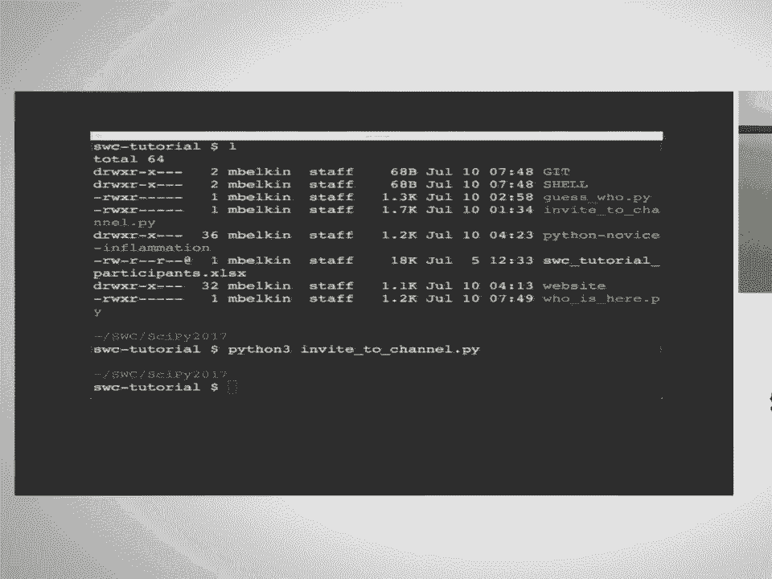

这个教程遵循软件工匠（Software Carpentry）的标准，旨在让大家通过亲手实践来学习。通常，这类研讨会会有很多助教，但今天我们只有一两位助教，Heather Rose会尽力为大家提供帮助。


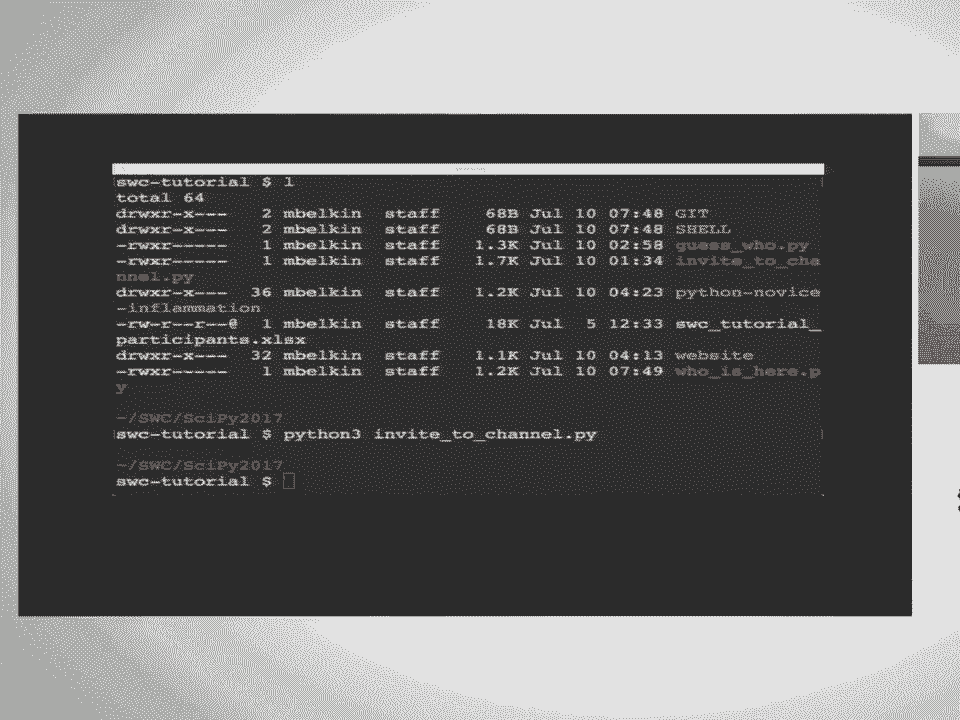


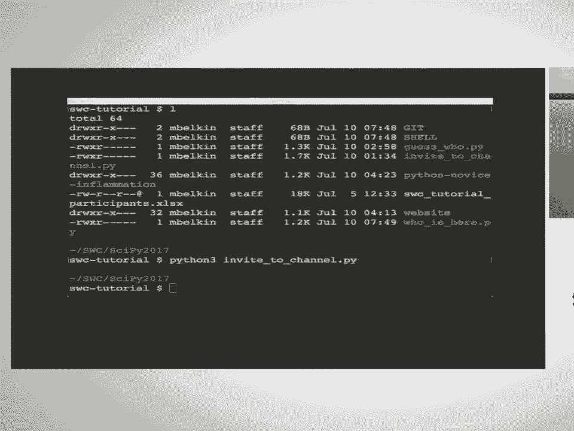

由于我们现场有超过70位学员，而通常软件工匠的标准是每位助教对应10-15位学员，这对我们来说是一个挑战。因此，我希望大家能互相帮助，共同学习。


为了了解大家的基础，我创建了一个Slack频道用于互动和投票。请大家加入，以便我能更好地掌握大家的学习进度和遇到的问题。

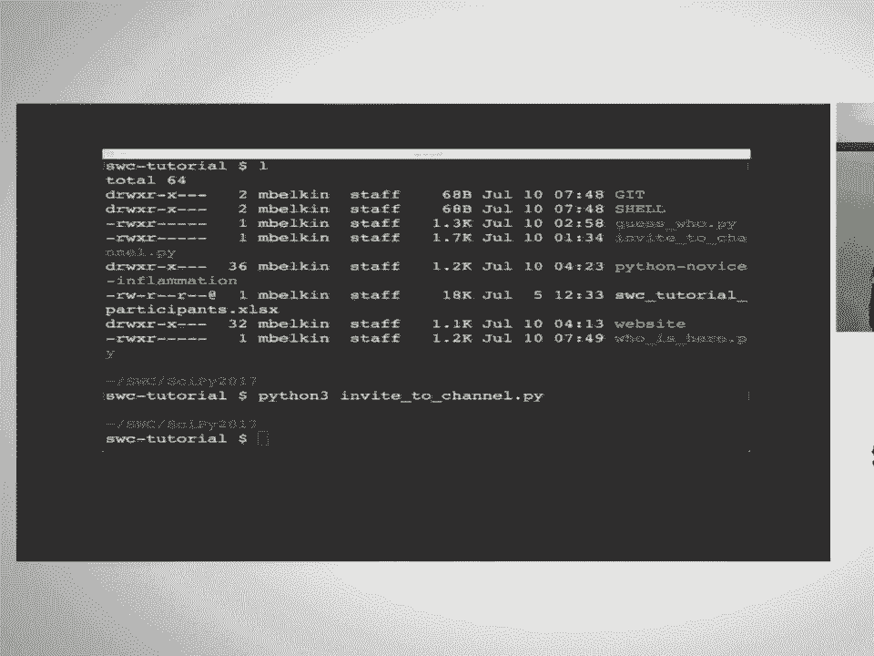


---

## 第一部分：为什么需要Shell？ 💻

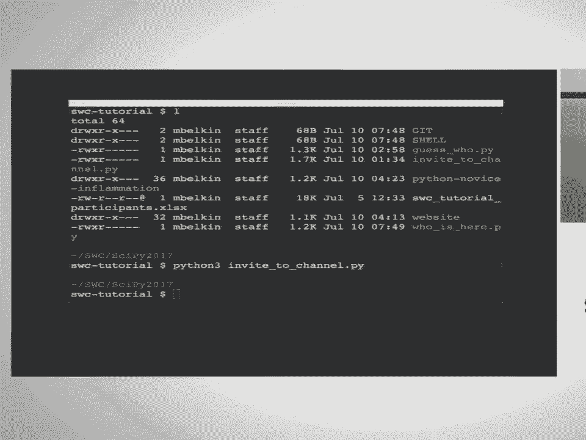

在开始Python学习之前，我们需要掌握一些命令行（Shell）的基础知识。虽然现代操作系统都有图形用户界面（GUI），但在处理大量科学数据文件时，命令行提供了更高效、可扩展的操作方式。


命令行界面（CLI）允许我们通过输入命令来与计算机交互，这与图形用户界面（GUI）形成对比。例如，当你有数百万个数据文件时，在图形界面中滚动查找特定文件会非常困难，而使用命令行工具则可以快速定位和处理。

---

### 基本Shell命令

首先，打开你的终端（在Mac或Linux上）或Git Bash（在Windows上）。你会看到一个命令提示符，通常是`$`符号，表示系统正在等待你输入命令。

你可以通过输入`PS1='$ '`来简化提示符，这只改变显示，不影响系统。

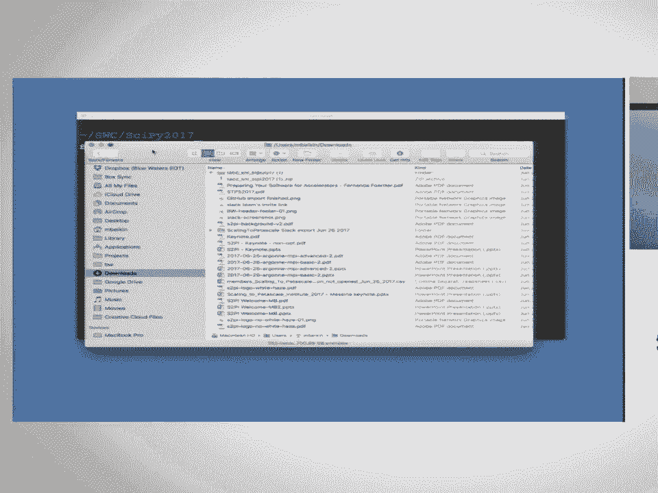

要查看当前所在目录，使用`pwd`命令（Print Working Directory）。

要查看当前目录下的文件和文件夹，使用`ls`命令（List）。

`ls -l`命令可以以详细列表形式显示信息，包括文件权限、所有者、大小和修改日期。

要获取命令的帮助信息，可以使用`--help`选项（例如`ls --help`）或`man`命令（例如`man ls`）。在Mac上，`ls --help`可能无效，需使用`man ls`。按`q`键退出帮助页面。

---

### 下载和处理数据

为了练习，我们需要下载一些示例数据。使用以下命令（Mac用户使用`curl`，Linux用户使用`wget`）：

```bash
curl -O http://software-carpentry.org/v4/shell/data-shell.zip
```

或者直接在浏览器中打开该链接下载。

下载后，使用`unzip`命令解压文件：

```bash
unzip data-shell.zip
```

解压后，使用`cd`命令进入新创建的目录：

```bash
cd data-shell
```

---

### 目录和文件操作

使用`mkdir`命令创建新目录，例如`mkdir thesis`。

使用`cat`命令查看文件内容，例如`cat creatures/basilisk.dat`。

使用`wc`命令统计文件的行数、单词数和字符数，例如`wc -l *.pdb`。

---

### 通配符和重定向

通配符`*`可以匹配多个文件。例如，`ls b*`会列出所有以`b`开头的文件。

使用`>`符号可以将命令的输出重定向到文件，例如`wc -l *.pdb > results.dat`。如果文件已存在，`>`会覆盖它。

使用`>>`符号可以将输出追加到文件末尾，而不覆盖原有内容。

---

### 管道

管道`|`可以将一个命令的输出作为另一个命令的输入。例如，以下命令会统计所有`.pdb`文件的行数，然后排序，最后显示前三行：

```bash
wc -l *.pdb | sort -n | head -n 3
```

---

### 查找文件

使用`find`命令可以搜索文件。例如，在当前目录及其子目录中查找所有扩展名为`.pdb`的文件：

```bash
find . -type f -name "*.pdb"
```

`-type f`表示只查找文件，`-name`后面跟匹配模式。

---

### 删除文件

使用`rm`命令删除文件。为了安全，可以使用`-i`选项进行交互式删除，系统会询问你是否确认：

```bash
rm -i results.dat
```

---

## 第二部分：Python入门 🚀

上一节我们介绍了Shell的基础操作，本节我们将开始学习Python编程语言。Python以其简洁易读的语法和强大的库生态系统而闻名，非常适合科学计算。

首先，我们需要启动Python。在终端中输入`python`或`python3`（如果你安装了Anaconda Python 3）。你应该会看到类似`>>>`的提示符，这表明你已进入Python交互式解释器。

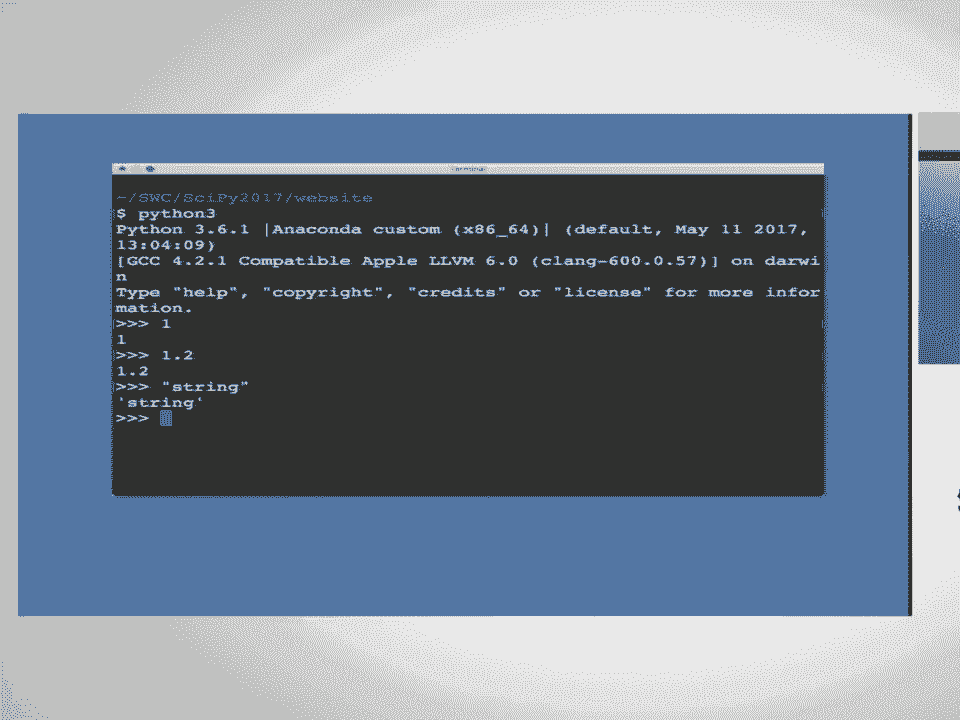

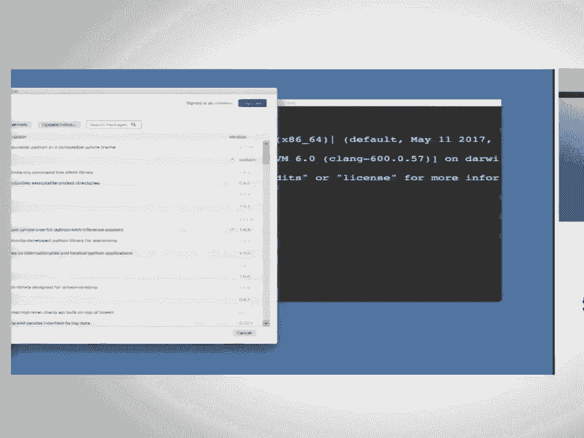


---

### 基本数据类型


Python支持多种基本数据类型：

*   **整数**：例如 `1`
*   **浮点数**：例如 `2.3`
*   **字符串**：用单引号或双引号括起来的文本，例如 `'hello'` 或 `"world"`
*   **布尔值**：`True` 或 `False`
*   **复数**：例如 `1+2j`

你可以使用`type()`函数来查看任何值的类型。

---

### 变量和赋值

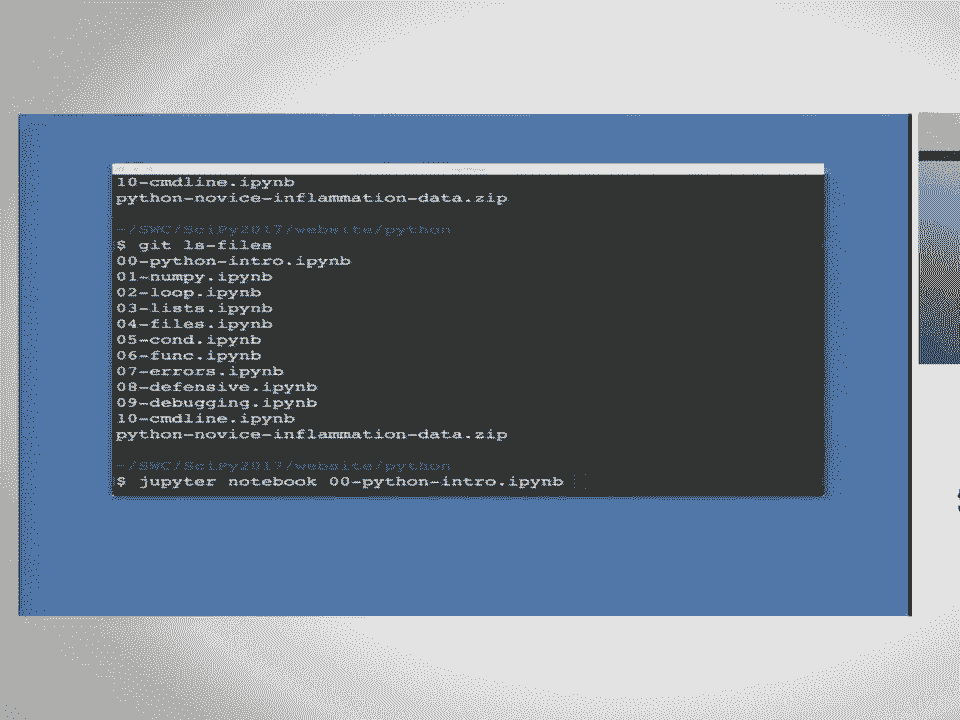


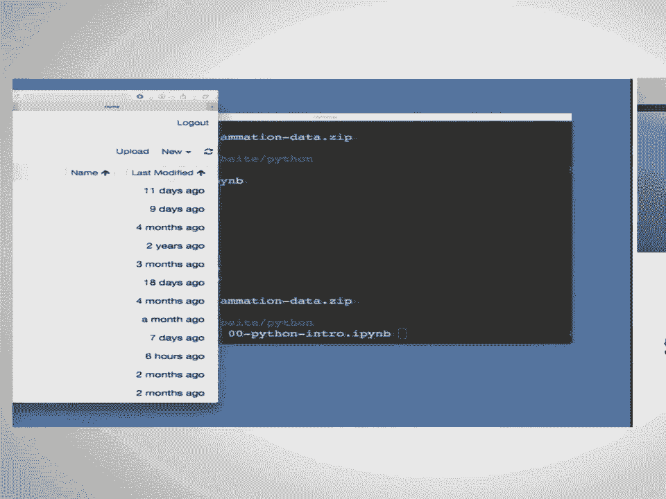

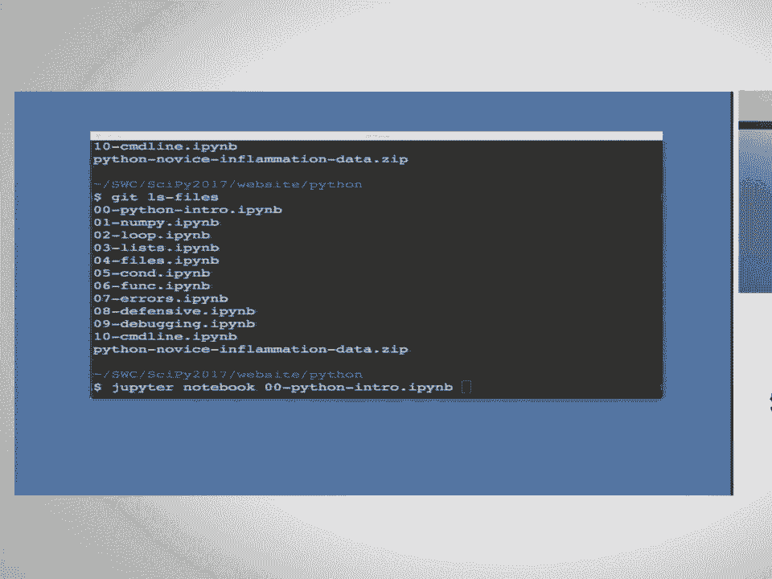

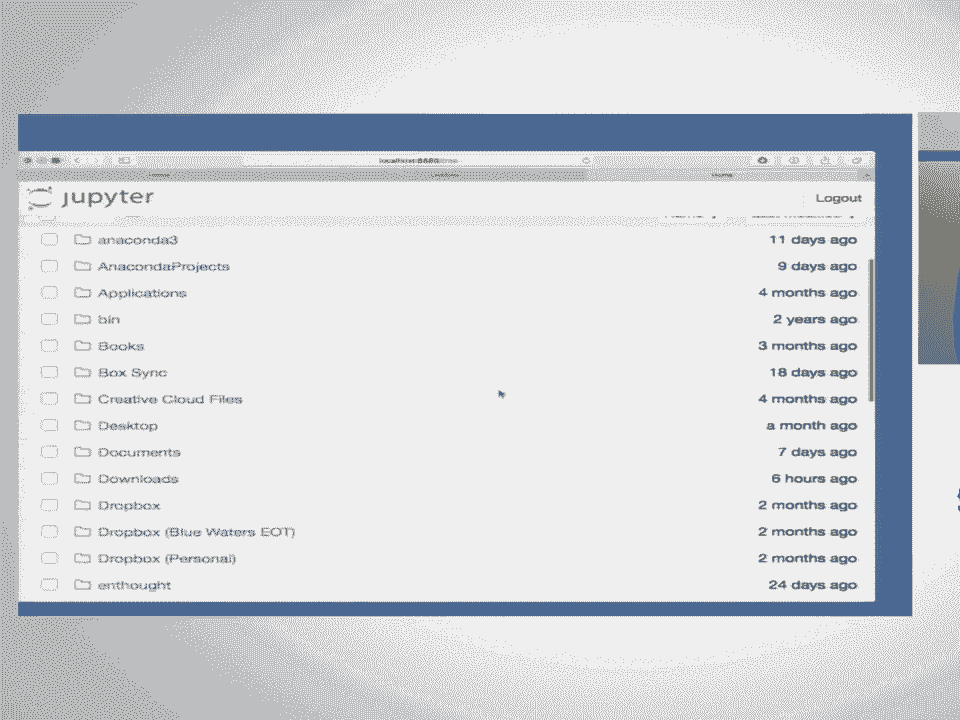

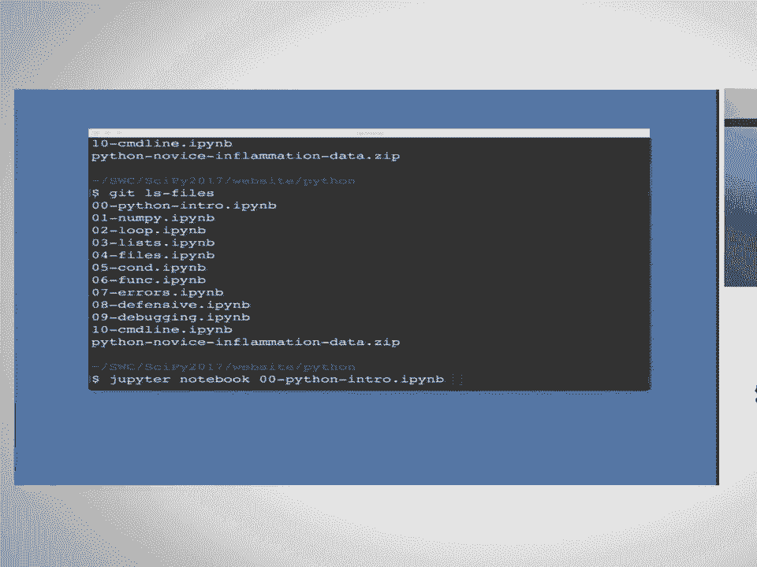

使用等号`=`可以将值赋给变量：

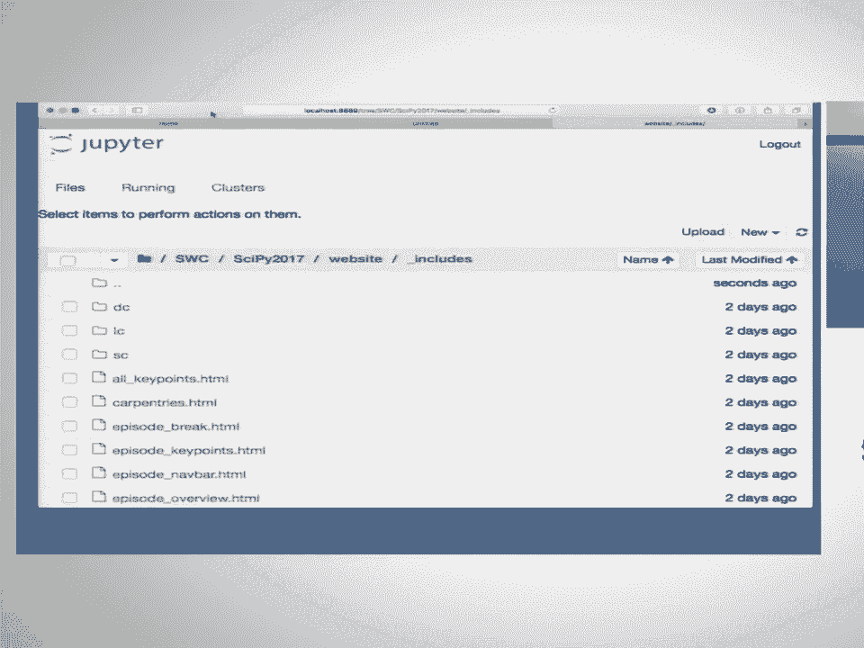

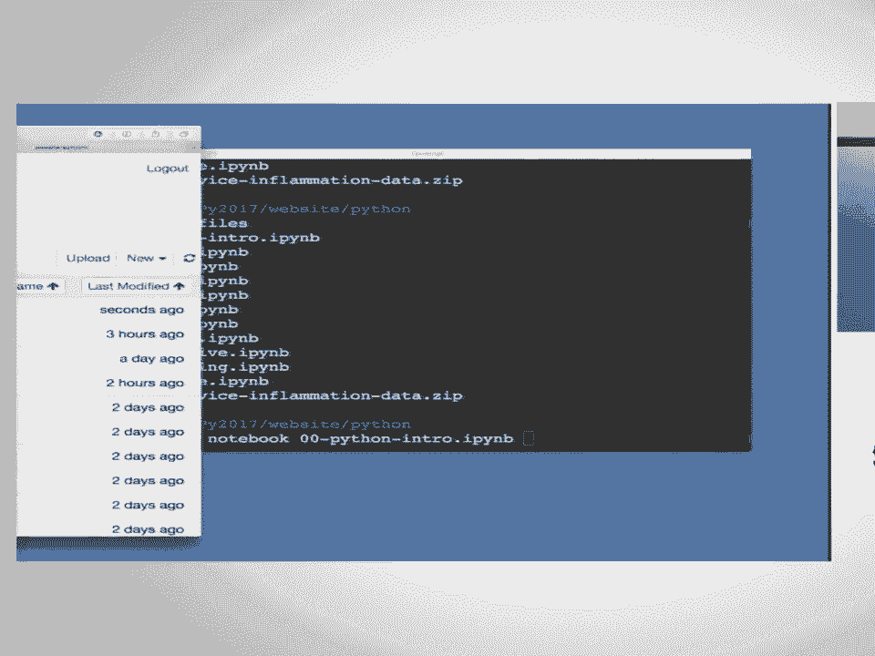

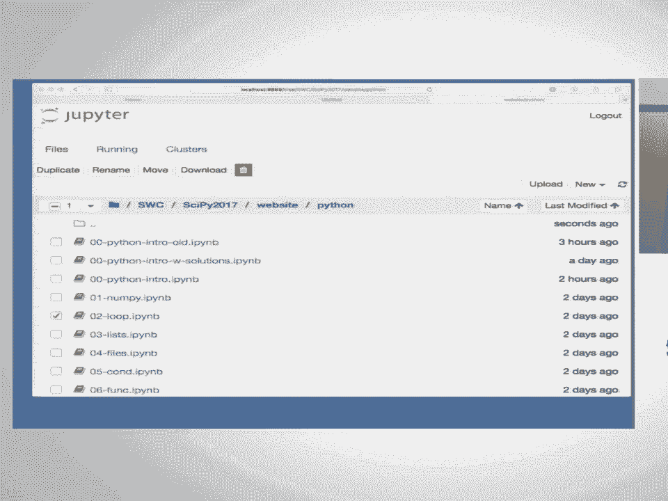

```python
a = 1
b = 2.3
c = 'hello'
```

使用`print()`函数可以输出变量的值：

```python
print(a)
```

---

### 基本运算符

Python支持常见的数学和比较运算符：

*   `+`, `-`, `*`, `/`：加、减、乘、除
*   `**`：幂运算
*   `//`：整数除法
*   `%`：取模
*   `==`, `!=`, `>`, `<`, `>=`, `<=`：比较运算符，返回布尔值

**注意**：在Python 3中，`/`运算符执行浮点除法。要执行整数除法，需使用`//`。

字符串可以使用`+`进行拼接，使用`*`进行重复：

```python
'hello' + 'world'  # 结果是 'helloworld'
'ha' * 3           # 结果是 'hahaha'
```

---

### 列表（Lists）

列表是一种有序的集合，可以包含不同类型的元素。列表用方括号`[]`表示：

```python
fruits = ['apple', 'banana', 'cherry']
```

可以通过索引访问列表元素，索引从0开始：

```python
fruits[0]  # 'apple'
fruits[-1] # 'cherry' （负数索引表示从末尾开始）
```

可以使用切片获取子列表：

```python
fruits[0:2] # ['apple', 'banana'] （包含起始索引，不包含结束索引）
```

列表是可变的，可以使用`append()`方法添加元素，使用`pop()`方法移除元素：

```python
fruits.append('date')
last_fruit = fruits.pop()
```

**重要**：当将一个列表赋值给另一个变量时，两个变量会指向同一个列表对象。修改其中一个会影响另一个。如果需要复制列表，请使用`copy()`方法或`list()`函数。

---

### 元组（Tuples）

元组与列表类似，但它是不可变的（创建后不能修改）。元组用圆括号`()`表示：

```python
coordinates = (10, 20)
```

---

### 字典（Dictionaries）

字典是一种键值对集合。字典用花括号`{}`表示，键和值之间用冒号`:`分隔：

```python
conversions = {'inches': 12, 'feet': 30.48}
```

可以通过键来访问值：

```python
conversions['inches'] # 12
```

可以添加新的键值对：

```python
conversions['yards'] = 0.9144
```

---


### 函数（Functions）

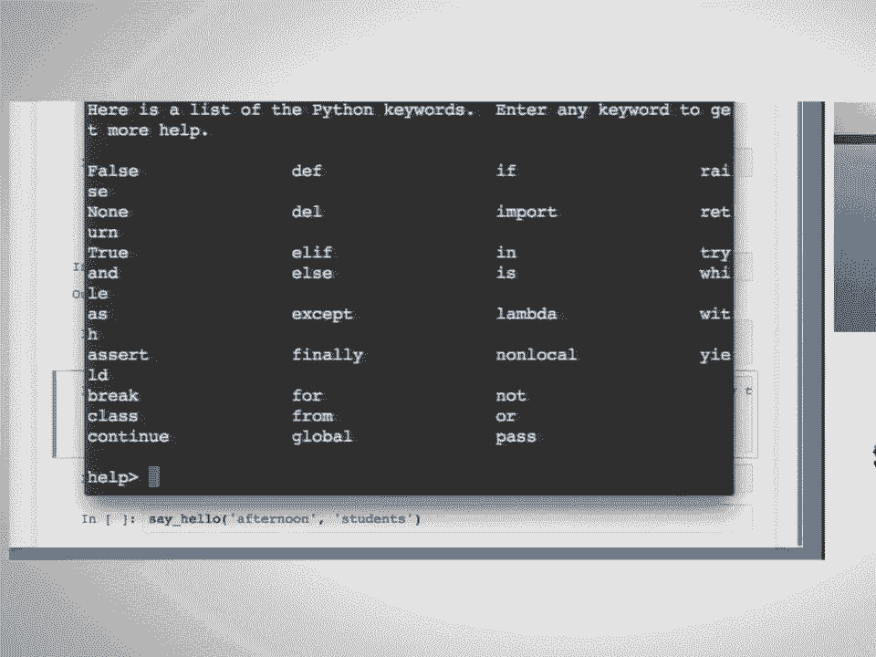

函数是可重用的代码块。使用`def`关键字定义函数：

```python
def multiply(x, y):
    """返回两个数的乘积。"""
    result = x * y
    return result
```


函数可以包含文档字符串（docstring），用于说明函数的功能。可以使用`help()`函数或`?`（在Jupyter中）查看文档字符串。

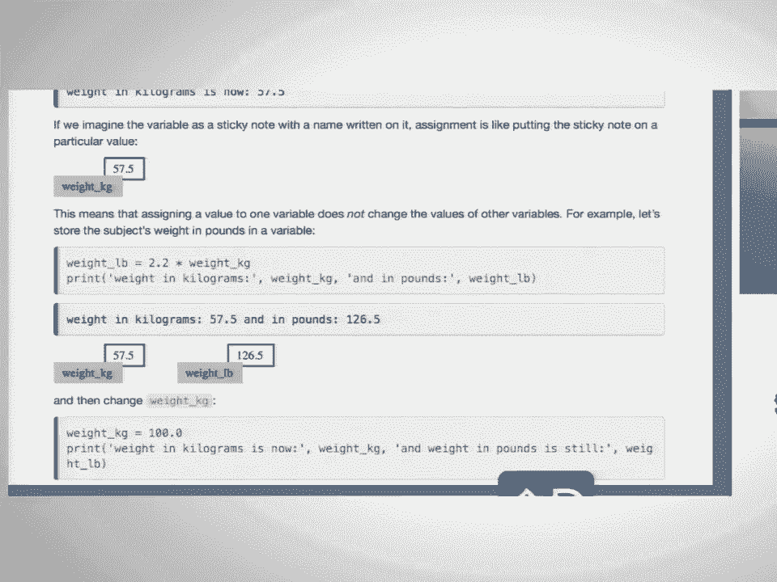

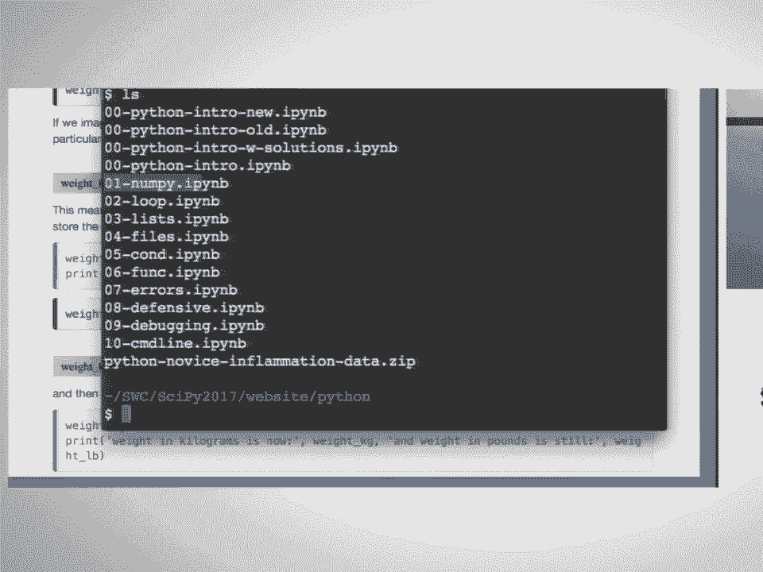


---

## 第三部分：使用NumPy和Matplotlib进行数据分析 📊

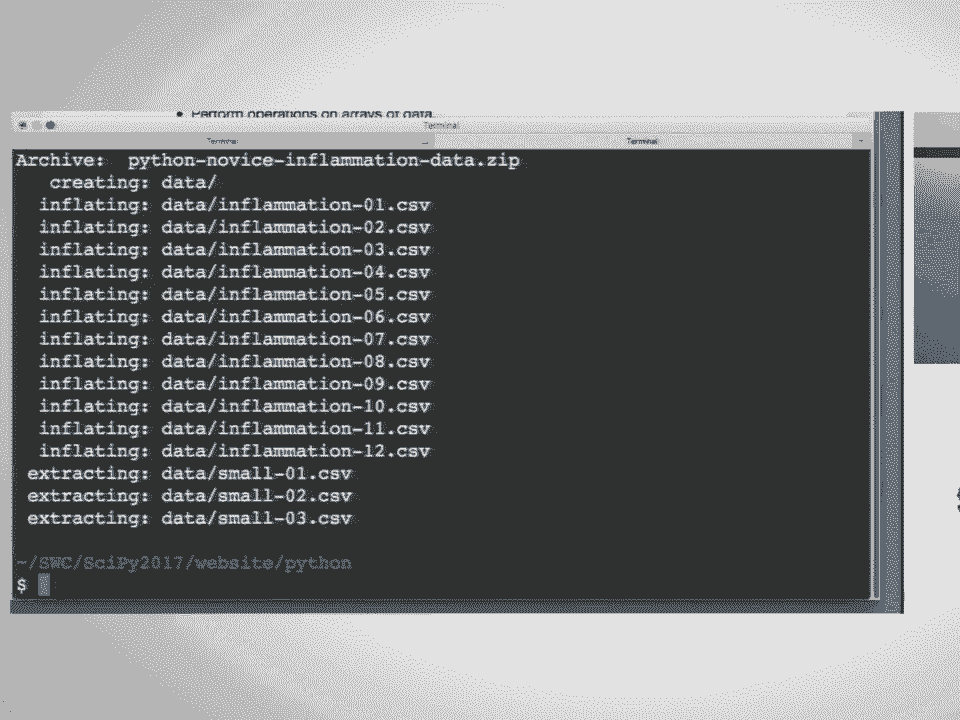

上一节我们学习了Python的核心语法，本节我们将利用NumPy和Matplotlib这两个强大的库来处理和可视化科学数据。

首先，我们需要导入这些库：

```python
import numpy as np
import matplotlib.pyplot as plt
```

---

### 使用NumPy加载数据

NumPy的`loadtxt`函数可以方便地从文本文件（如CSV）加载数据：

```python
data = np.loadtxt(fname='data/inflammation-01.csv', delimiter=',')
```

加载的数据是一个NumPy数组（ndarray）。你可以使用`shape`属性查看数组的维度，使用索引和切片访问数据：

```python
print(data.shape)      # 例如 (60, 40)，表示60行40列
print(data[0, 0])      # 访问第一行第一列的元素
print(data[0:4, 0:10]) # 访问前4行、前10列的数据
```

NumPy数组支持向量化操作，这意味着数学运算会应用到每个元素上，速度非常快：

```python
double_data = data * 2.0
```

你可以沿特定轴（axis）计算统计值，例如平均值、最大值、最小值：

```python
mean_per_patient = data.mean(axis=1) # 沿行（axis=1）计算每位患者的平均值
max_per_day = data.max(axis=0)       # 沿列（axis=0）计算每天的最大值
```

---

### 使用Matplotlib可视化数据

Matplotlib是一个绘图库。在Jupyter Notebook中，我们使用`%matplotlib inline`魔法命令让图表直接显示在笔记本中。

`plt.imshow()`函数可以显示二维数组（如图像或矩阵）：

```python
plt.imshow(data)
plt.show()
```

你可以创建包含多个子图的图形：

```python
fig = plt.figure(figsize=(10.0, 3.0)) # 创建图形，设置大小

# 创建三个并排的子图
axes1 = fig.add_subplot(1, 3, 1)
axes2 = fig.add_subplot(1, 3, 2)
axes3 = fig.add_subplot(1, 3, 3)

# 在每个子图中绘制不同的数据
axes1.set_ylabel('average')
axes1.plot(data.mean(axis=0))

axes2.set_ylabel('max')
axes2.plot(data.max(axis=0))

axes3.set_ylabel('min')
axes3.plot(data.min(axis=0))

fig.tight_layout() # 自动调整子图参数，使之填充整个图像区域
plt.show()
```

通过观察平均值、最大值和最小值随时间（天数）变化的图表，我们可能会发现数据中的异常模式，从而引导进一步的分析。

---

## 总结 🎯

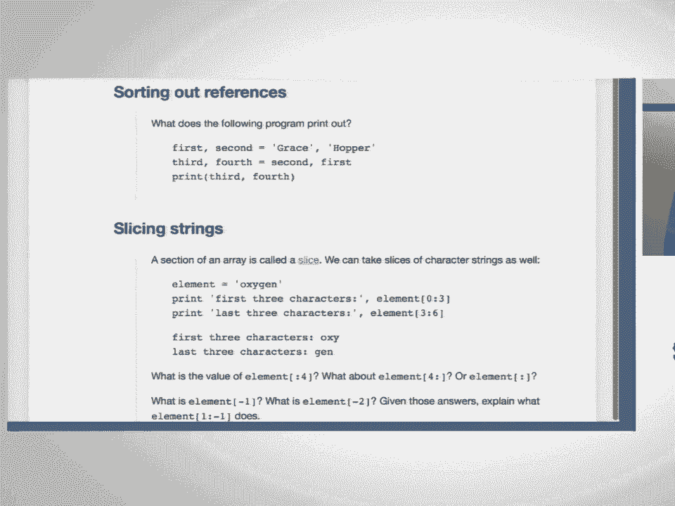

在本课程中，我们一起学习了：


1.  **Shell基础**：包括导航文件系统、操作文件和目录、使用通配符、重定向和管道，这些是高效管理数据文件的必备技能。
2.  **Python核心概念**：包括变量、基本数据类型（整数、浮点数、字符串、布尔值）、数据结构（列表、元组、字典）以及如何定义和调用函数。
3.  **科学计算库**：我们介绍了如何使用NumPy加载和处理数组数据，以及如何使用Matplotlib创建数据可视化图表。

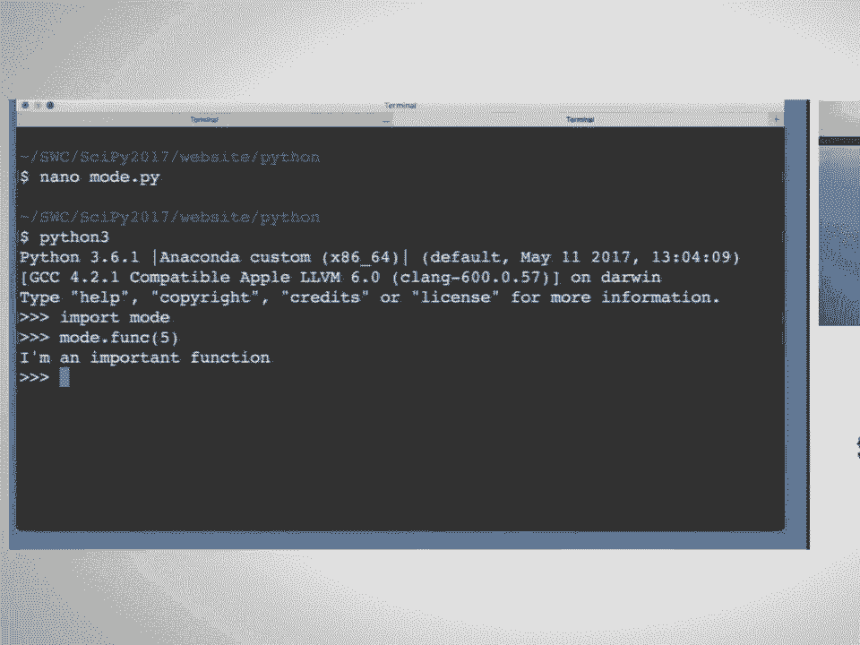

这些工具构成了使用Python进行科学计算的基础。通过将小的、可重用的函数与强大的库相结合，你可以有效地分析数据、自动化任务并清晰地展示你的研究成果。