# 23：使用 Dask 并行化科学 Python 🚀


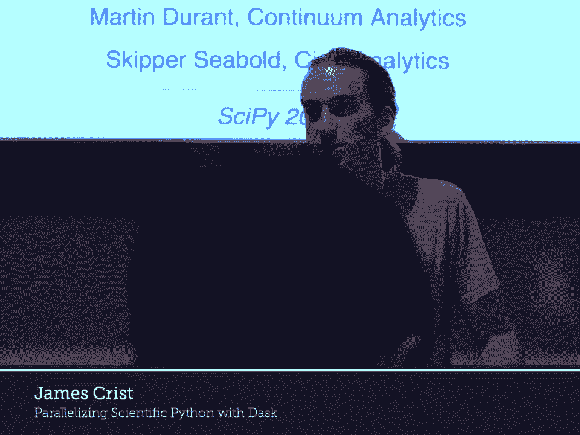

## 概述

在本课程中，我们将学习如何使用 Dask 框架来并行化 Python 科学计算任务。Dask 是一个灵活的并行计算库，它允许我们处理超出单机内存限制的大型数据集，并利用多核或分布式集群进行高效计算。我们将从基础概念开始，逐步探索 Dask 的核心组件，包括 `delayed`、`DataFrame`、`Array` 和 `Bag`，并最终了解如何利用分布式调度器进行大规模计算。

---

## 1. 使用 Dask Delayed 进行并行化

上一节我们介绍了课程概述，本节中我们来看看 Dask 最基础的并行化工具：`delayed`。`delayed` 是一个装饰器或函数，它能使任何函数或操作变得“惰性”（lazy），即不会立即执行，而是构建一个任务图（task graph），稍后统一调度执行。

我们首先定义两个简单的函数，模拟耗时操作：

```python
import time
from dask import delayed

def inc(x):
    time.sleep(1)
    return x + 1

def add(x, y):
    time.sleep(1)
    return x + y
```

如果串行执行这些函数，总耗时将是 3 秒。

```python
# 串行执行
x = inc(1)   # 耗时 1 秒
y = inc(2)   # 耗时 1 秒
z = add(x, y) # 耗时 1 秒
# 总耗时约 3 秒
```

使用 `delayed` 进行并行化：

```python
# 使用 delayed 包装函数，构建任务图
x = delayed(inc)(1)
y = delayed(inc)(2)
z = delayed(add)(x, y)

# 此时尚未执行任何计算，只是构建了图
# 调用 compute() 开始并行执行
result = z.compute() # 总耗时约 2 秒
```

**为什么耗时是 2 秒而不是 3 秒？** 因为 `inc(1)` 和 `inc(2)` 这两个任务之间没有依赖关系，Dask 可以将其调度到不同的工作线程上同时执行。我们可以通过可视化任务图来理解：

```python
z.visualize()
```

任务图将显示两个独立的 `inc` 任务，最后汇聚到一个 `add` 任务。这体现了基本的并行模式。

---

### 练习：并行化一个 for 循环

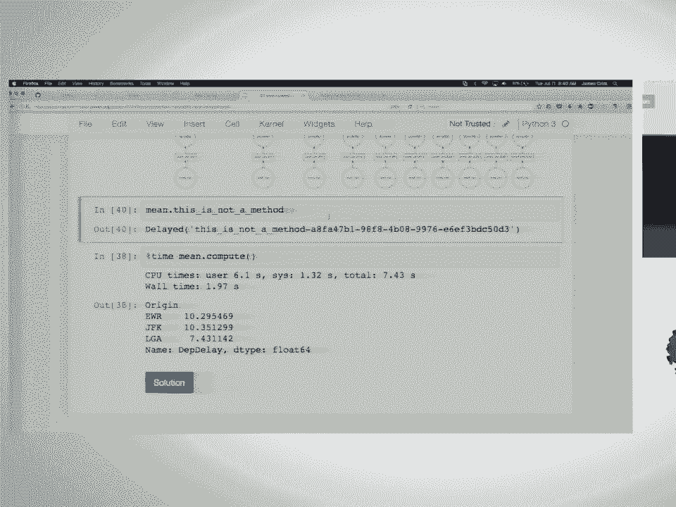


以下是需要并行化的串行代码：

```python
data = [1, 2, 3, 4, 5, 6, 7, 8]
results = []
for x in data:
    results.append(inc(x))
total = sum(results)
```

**任务**：使用 `delayed` 重写以上代码，使其能够并行执行。

**解决方案思路**：
1.  使用 `delayed(inc)` 创建一个惰性版本的函数。
2.  在循环中应用这个惰性函数，得到一系列 `delayed` 对象。
3.  使用 `delayed(sum)` 来惰性地对结果列表求和。
4.  最后调用 `compute()`。

```python
delayed_inc = delayed(inc)
delayed_results = [delayed_inc(x) for x in data]
total = delayed(sum)(delayed_results)
result = total.compute() # 并行执行
```

在这个例子中，8 个 `inc` 任务可以并行执行，因此总耗时接近 1 秒（假设有足够多的 CPU 核心）。

---

### 引入控制流

当代码中包含条件判断时，并行化需要稍加注意。考虑以下函数：

```python
def double(x):
    time.sleep(1)
    return x * 2

def is_even(x):
    return x % 2 == 0
```

串行逻辑如下：

```python
data = [1, 2, 3, 4, 5, 6, 7, 8]
results = []
for x in data:
    if is_even(x):
        results.append(double(x))
    else:
        results.append(inc(x))
total = sum(results)
```

**重要原则**：`delayed` 对象在构建图时，其具体值是未知的，因此不能直接用于 `if` 判断。我们需要在**图构建阶段**就确定执行路径。

**解决方案**：只对实际耗时的计算函数（`double`, `inc`）和最终的聚合函数（`sum`）使用 `delayed`。条件判断 `is_even` 作用于原始数据，应即时执行。

```python
delayed_double = delayed(double)
delayed_inc = delayed(inc)

results = []
for x in data: # x 是原始数据，不是 delayed 对象
    if is_even(x): # 即时判断
        results.append(delayed_double(x))
    else:
        results.append(delayed_inc(x))

total = delayed(sum)(results)
result = total.compute()
```

这样构建的图，会根据每个数据点的奇偶性，选择不同的计算分支，并且所有分支可以并行执行。

---

### 真实案例：并行处理多个 CSV 文件

假设我们有一组 CSV 文件（例如，1990-1999 年纽约的航班数据），需要计算每个机场的平均起飞延误时间。串行处理代码如下：

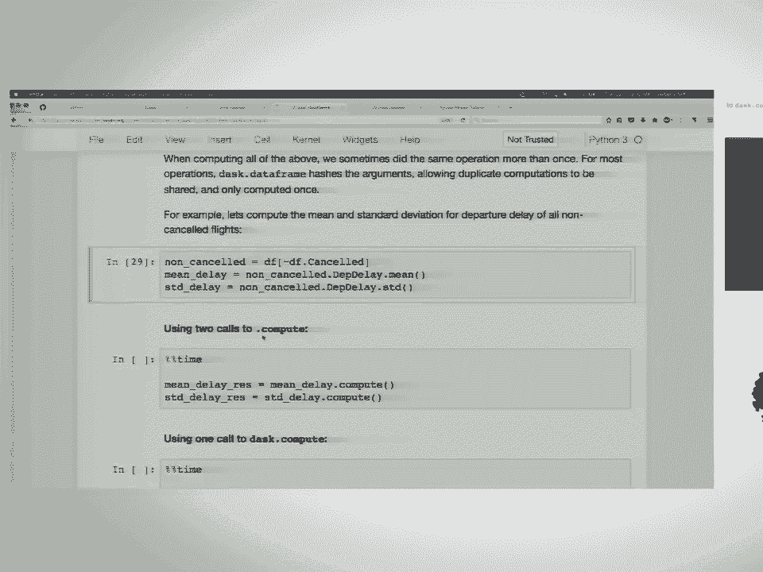

```python
import pandas as pd
import glob

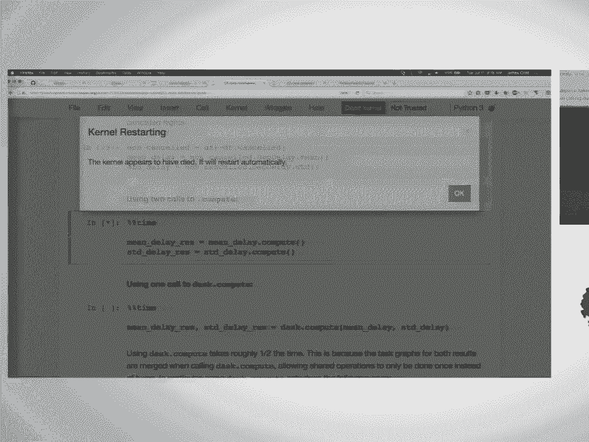

files = glob.glob('nyc_flights/*.csv')
sums = {}
counts = {}

for f in files:
    df = pd.read_csv(f)
    grouped = df.groupby('origin')['dep_delay'].agg(['sum', 'count'])
    for origin in grouped.index:
        sums[origin] = sums.get(origin, 0) + grouped.loc[origin, 'sum']
        counts[origin] = counts.get(origin, 0) + grouped.loc[origin, 'count']

# 计算最终平均值
mean_delay = {origin: sums[origin]/counts[origin] for origin in sums}
```

**使用 `delayed` 并行化**：
我们需要了解两个新知识点：
1.  `delayed` 对象支持大多数运算符和方法调用。例如，如果 `df` 是一个 `delayed` 对象（代表一个未来的 Pandas DataFrame），那么 `df.groupby(...)` 会自动返回一个新的 `delayed` 对象。
2.  `dask.compute` 函数可以同时计算多个 `delayed` 对象，并自动合并共享子任务，避免重复计算。

```python
from dask import compute

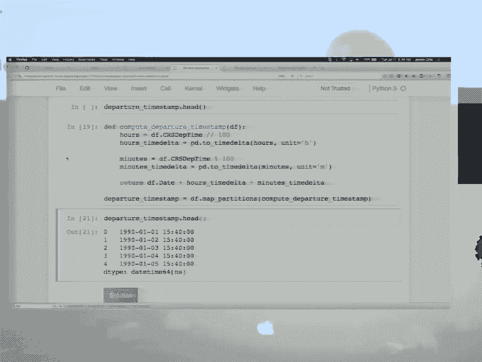

delayed_results = []
for f in files:
    # 延迟读取 CSV
    df = delayed(pd.read_csv)(f)
    # 延迟执行分组聚合
    grouped = df.groupby('origin')['dep_delay'].agg(['sum', 'count'])
    delayed_results.append(grouped)

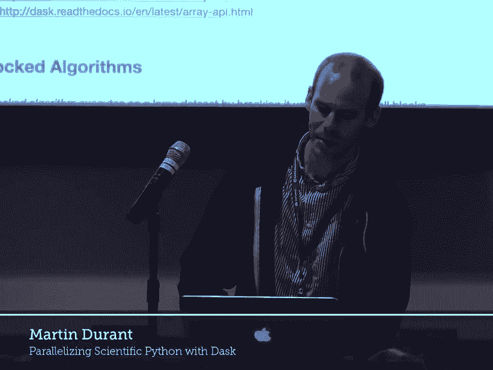

# 同时计算所有中间结果
computed_results = compute(*delayed_results)

# 后续的聚合在本地进行
sums, counts = {}, {}
for grouped in computed_results:
    for origin in grouped.index:
        sums[origin] = sums.get(origin, 0) + grouped.loc[origin, 'sum']
        counts[origin] = counts.get(origin, 0) + grouped.loc[origin, 'count']

mean_delay = {origin: sums[origin]/counts[origin] for origin in sums}
```

**性能考虑**：由于 Python 的全局解释器锁（GIL），Pandas 的某些字符串操作可能无法充分利用多线程。在这个例子中，我们可能只能获得约 2 倍的加速，而不是理想的 8 倍（对应 8 个文件）。对于计算密集型任务，使用进程池或分布式调度器是更好的选择。

---

## 2. 使用 Dask DataFrame 处理表格数据 📊

上一节我们使用 `delayed` 手动构建了并行处理流水线，本节中我们来看看更高级的抽象：Dask DataFrame。它模仿了 Pandas DataFrame 的 API，但能自动对超出内存的数据进行分块并行处理。

### 创建 Dask DataFrame

Dask DataFrame 可以从多个 CSV 文件创建，底层是多个 Pandas DataFrame 的集合。

```python
import dask.dataframe as dd

# 读取所有 CSV 文件，惰性操作
df = dd.read_csv('nyc_flights/*.csv')
```

`read_csv` 会查看第一个文件的一部分来推断数据类型。如果推断错误（例如，后续文件中某列的数据类型与首文件不同），可能会导致后续操作（如 `tail`）失败。解决方法是指定 `dtype` 参数。

```python
dtype = {'tail_num': str, 'arr_time': float, 'cancelled': bool}
df = dd.read_csv('nyc_flights/*.csv', dtype=dtype)
```

### 基本操作

Dask DataFrame 支持许多常见的 Pandas 操作，但它们是惰性的。

```python
# 查看前几行（这是立即执行的少数操作之一）
print(df.head())

# 计算行数（惰性操作）
n_rows = len(df) # 返回一个 delayed 对象
n_rows_computed = n_rows.compute() # 触发实际计算

# 布尔索引
early_flights = df[df['dep_delay'] < 0]
n_early = len(early_flights).compute()
```

### 分组聚合

分组聚合是数据分析中的常见操作，Dask DataFrame 可以高效地并行执行。

```python
# 计算每个机场的平均延误
mean_delay = df.groupby('origin')['dep_delay'].mean().compute()
```

在底层，Dask 会对每个数据块执行分组聚合，然后对中间结果进行合并（reduce），这与我们之前用 `delayed` 手动实现的过程类似，但代码简洁得多。

### 共享中间结果

如果要计算同一数据集的多个统计量（如均值和标准差），分别调用 `compute()` 会导致数据被重复读取和计算。更高效的方式是使用 `dask.compute` 一次性计算所有需要的量。

```python
from dask import compute

mean = df['dep_delay'].mean()
std = df['dep_delay'].std()

# 低效：分别计算
mean_result = mean.compute()
std_result = std.compute()

# 高效：同时计算
mean_result, std_result = compute(mean, std)
```

Dask 会自动优化任务图，共享 `df['dep_delay']` 这个子任务，避免重复工作。

### 设置索引以提高性能

与 Pandas 类似，为 Dask DataFrame 设置索引可以加速基于该列的查询、合并和分组操作。更重要的是，如果数据已经按索引列自然分区（例如，我们的航班数据按年份分区存储），设置索引能让 Dask 知道数据分布，从而避免全表扫描。

```python
# 设置索引。这是一个需要洗牌（shuffle）的昂贵操作，通常只在工作流开始时执行一次。
df = df.set_index('year')
# 设置后，Dask 知道了数据的分区信息（divisions）
print(df.divisions)

# 基于索引的查询会更快，因为它知道只需要读取特定分区
df_1990 = df.loc[1990].compute()
```

---

## 3. 使用 Dask Array 处理数值数据 🔢

上一节我们处理了表格数据，本节中我们来看看用于处理大型多维数值数组的 Dask Array。它提供了与 NumPy 类似的接口，但将数据分块存储，支持大于内存的数据集并行计算。

### 创建 Dask Array

可以从现有的类数组对象（如 HDF5 数据集）创建 Dask Array，并指定分块大小。

```python
import h5py
import dask.array as da

# 假设有一个 HDF5 文件
with h5py.File('random.hdf5', 'r') as f:
    dataset = f['/x']

# 创建 Dask Array，指定分块大小为 (1000, 1000)
x = da.from_array(dataset, chunks=(1000, 1000))
```

也可以直接生成随机数据等。

```python
# 生成一个 20000x20000 的随机数组，分块大小为 (1000, 1000)
big_array = da.random.normal(10, 1, size=(20000, 20000), chunks=(1000, 1000))
```

### 执行计算

Dask Array 支持大多数 NumPy 操作，并且是惰性的。

```python
# 计算全局均值（惰性）
mean_lazy = big_array.mean()
# 触发实际计算
mean_computed = mean_computed.compute()

# 沿特定轴聚合
mean_along_axis0 = big_array.mean(axis=0).compute()
```

### 分块大小的选择

分块大小对性能至关重要：
*   **分块过大**（如 `chunks=(20000, 20000)`）：相当于只有一个块，无法并行，且可能超出单个工作线程的内存。
*   **分块过小**（如 `chunks=(25, 25)`）：会产生海量任务，任务调度开销将远大于计算本身，导致性能急剧下降。
*   **理想分块**：通常使每个块的大小在 MB 到 GB 量级，并且块的数量与 CPU 核心数处于同一数量级。例如，对于 20000x20000 的浮点数组（约 3.2 GB），`chunks=(1000, 1000)` 会产生 400 个约 8 MB 的块，这是一个合理的起点。

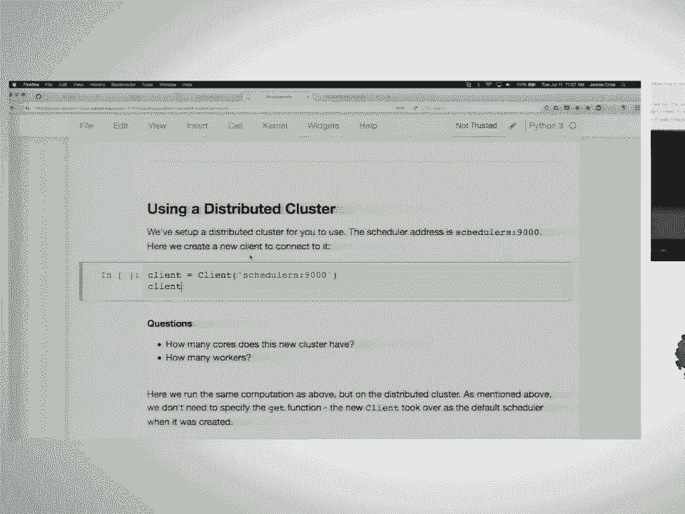

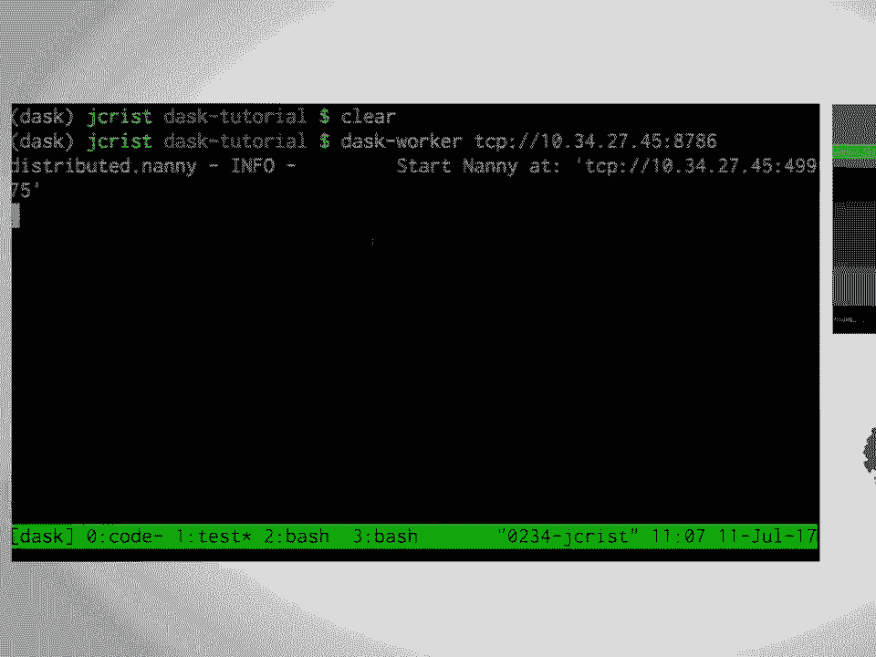

---

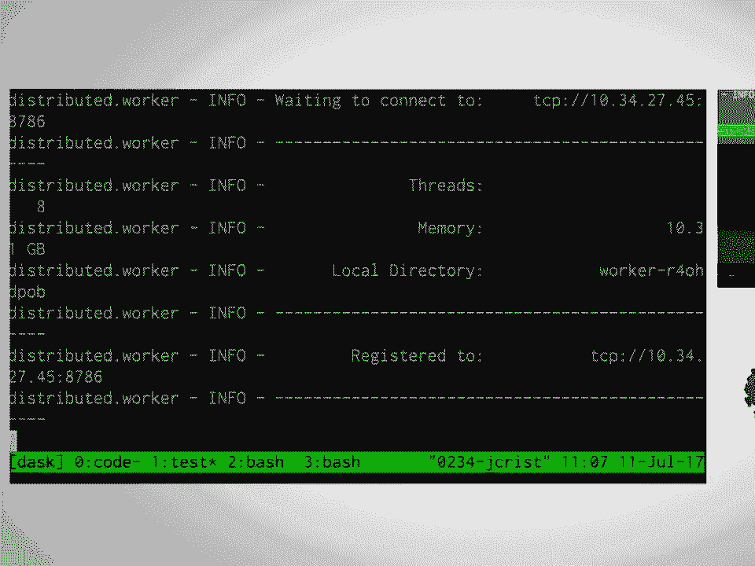

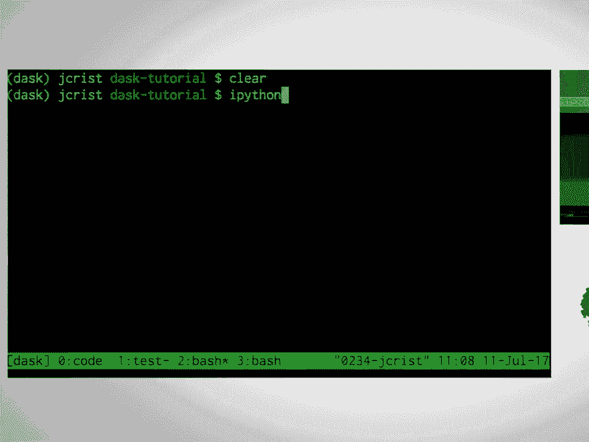

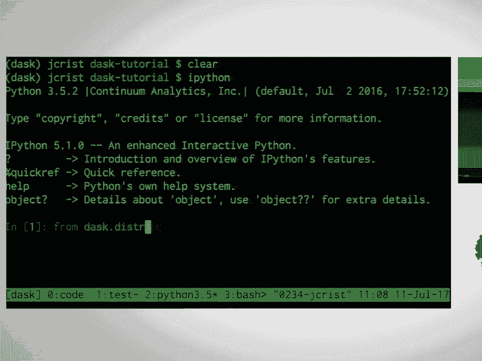

## 4. 使用 Dask Bag 处理非结构化数据 🎒

Dask Bag 适用于处理半结构化或非结构化的 Python 对象序列，例如 JSON 文本行。它提供了函数式编程接口（如 `map`, `filter`, `foldby`）。

### 创建与处理

```python
import dask.bag as db
import json

# 从文本文件创建 Bag（每行一个 JSON 字符串）
lines = db.read_text('accounts.*.json.gz')
# 将每行解析为 Python 字典
js = lines.map(json.loads)

# 使用函数式操作
alice_transactions = js.filter(lambda record: record['name'] == 'Alice')
counts = alice_transactions.map(lambda record: (record['name'], len(record['transactions'])))
result = counts.take(5) # 取前5个结果查看
```

### Bag 的适用场景

Dask Bag 非常适合数据清洗和预处理阶段，尤其是处理嵌套、结构不一致的数据。一旦数据被清理并扁平化，通常可以转换为 Dask DataFrame 以进行更高效的分析。对于分组聚合，`foldby` 操作通常比 `groupby` 在 Bag 上性能更好。

---

## 5. 调度器与分布式计算 🌐

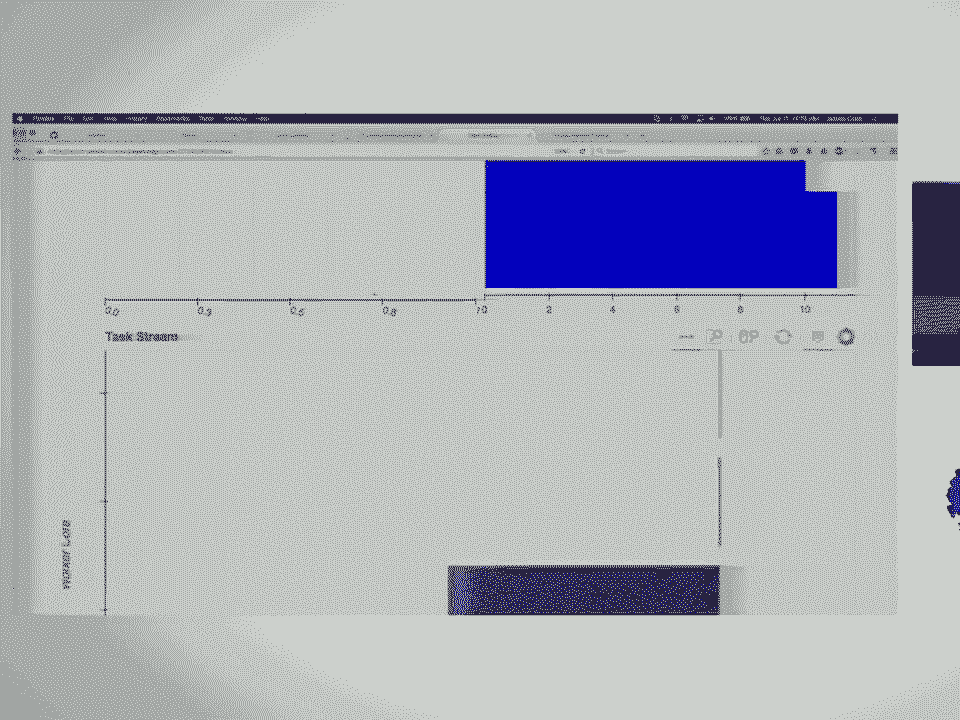

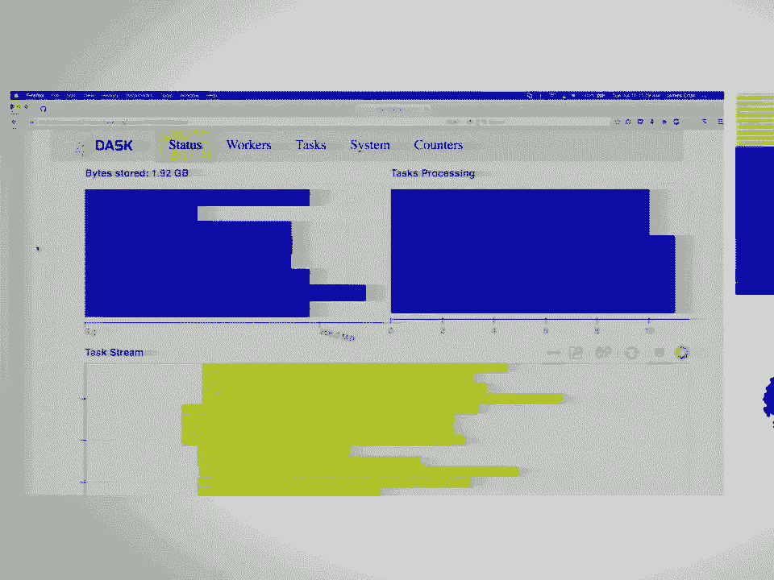

到目前为止，我们的计算默认在单机的线程池或进程池中运行。Dask 的真正威力在于其分布式调度器，它可以将任务分配到多台机器组成的集群上执行。

### 本地调度器

Dask 提供了几种本地调度器，可通过 `dask.set_options` 或 `compute(scheduler=...)` 指定：
*   **`threads`**（默认）：线程池。适用于大部分 NumPy/Pandas 操作（它们会释放 GIL）。
*   **`processes`**：进程池。适用于纯 Python 代码或受 GIL 限制的操作。
*   **`synchronous`**：单线程。用于调试和分析。

### 分布式调度器

分布式调度器（`dask.distributed`）功能最强大，即使只在单机上使用，也能提供比 `processes` 调度器更好的性能和诊断功能。

```python
from dask.distributed import Client

# 在本地启动一个分布式集群（默认使用所有CPU核心）
client = Client()
# 或者连接到已有的集群
# client = Client('tcp://scheduler-address:8786')
```

创建 `Client` 后，它会自动成为全局默认调度器。之后所有的 `compute()` 调用都会将任务提交到这个集群。

### 持久化数据

在分布式环境中，一个关键优势是可以将中间数据集**持久化**到集群各节点的内存中。这样，后续的多次查询可以避免重复的磁盘 I/O，实现交互式分析速度。

```python
# 从远程存储（如S3）读取数据
df = dd.read_csv('s3://bucket/nyc-flights/*.csv')
# 将数据载入集群内存
df = df.persist()
# 后续操作会非常快
result = df.groupby('origin')['dep_delay'].mean().compute()
```

### 诊断仪表板

分布式调度器提供了一个强大的 Web 诊断仪表板，可以实时可视化任务执行、 worker 状态、内存使用等情况，是性能调优和问题排查的利器。启动客户端后，其地址通常会打印出来（例如 `http://localhost:8787/status`）。

---

## 6. 高级分布式 API：Futures

除了高级集合（DataFrame, Array, Bag），分布式客户端还提供了底层的 **Futures** API，它类似于 Python 标准库的 `concurrent.futures`，但运行在集群上。这允许动态地、异步地构建和提交任务。

```python
from dask.distributed import Client
client = Client()

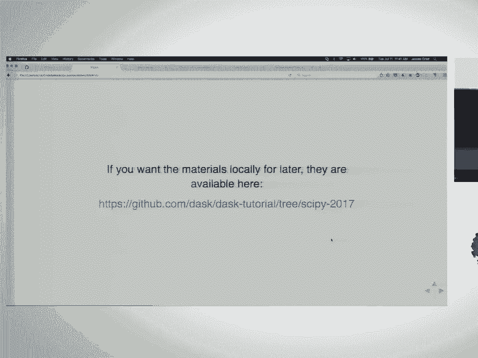

def inc(x):
    time.sleep(1)
    return x + 1


# 提交单个任务，立即返回一个 Future 对象（不阻塞）
future_x = client.submit(inc, 1)
# 可以继续做其他事情...
# 需要结果时，调用 result() （会阻塞直到完成）
print(future_x.result())

# 构建任务依赖
future_a = client.submit(inc, 10)
future_b = client.submit(inc, 20)
# future_c 依赖 future_a 和 future_b 的结果
future_c = client.submit(add, future_a, future_b)
print(future_c.result())
```

Futures API 非常适合实现自定义的迭代算法、异步工作流或需要细粒度任务控制的场景。


---

## 总结


在本课程中，我们一起学习了 Dask 并行计算框架的核心内容：
1.  **Dask Delayed**：用于并行化任意 Python 代码的基础工具，通过构建任务图实现惰性求值和并行调度。
2.  **Dask DataFrame**：为处理大型表格数据提供了类 Pandas 的 API，支持分块、并行操作。
3.  **Dask Array**：为处理大型多维数值数组提供了类 NumPy 的 API。
4.  **Dask Bag**：用于处理半结构化数据序列的函数式工具。
5.  **调度系统**：了解了线程、进程、同步以及功能强大的分布式调度器。
6.  **分布式计算**：学习了如何设置分布式集群、持久化数据以及利用诊断工具。
7.  **Futures API**