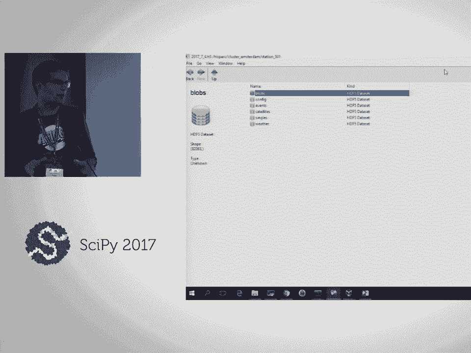

# 24：HDF5 进阶 - h5py 与 PyTables 🗂️

## 概述

在本课程中，我们将学习如何使用 Python 中的两个主要库——**h5py** 和 **PyTables** 来处理 HDF5 文件。HDF5 是一种高性能的数据存储格式，特别适合存储和管理大规模科学数据。我们将从基础概念开始，逐步深入到数据组织、类型、分块、压缩、查询、索引以及与 Pandas 的集成等高级主题。

---

## 1. HDF5 简介与 Python 生态

HDF5 是一个 I/O 库，针对规模和速度进行了优化。更重要的是，它是一个**自文档化的容器**，可以包含数据集、属性和元数据，确保研究数据能够自我描述。

在 Python 中，有两个主要的包支持 HDF5：

*   **h5py**: 提供 Pythonic 的、类似 NumPy 的接口，暴露了 HDF5 库的底层 API。
*   **PyTables**: 提供更高级的 API，主要基于表格数据集，并增加了快速索引、核外计算和高级压缩等特性。

这两个包是互补的，但都依赖于底层的 HDF5 C 库。目前的发展趋势是让 h5py 作为底层绑定，PyTables 构建在其之上，而 Pandas 则可以进一步利用 PyTables 来访问 HDF5。



---

## 2. HDF5 文件结构：组、数据集与属性

上一节我们介绍了 HDF5 的基本概念，本节中我们来看看 HDF5 文件内部的具体结构。一个 HDF5 文件主要包含三种类型的对象：

1.  **数据集**: 数值或其他数据的数组。
2.  **组**: 类似于文件系统中的文件夹，用于组织数据集和其他组。
3.  **属性**: 附加在数据集或组上的小型键值对，用于存储元数据。

每个 HDF5 文件都有一个根组 (`/`)，组和数据集可以形成层次结构，类似于 Unix 文件路径。

### 2.1 使用 h5py 操作结构

以下是使用 h5py 创建组和数据集的示例：

```python
import h5py

# 创建文件并写入数据
with h5py.File('struct_data.h5', 'w') as f:
    # 创建一个组
    grp = f.create_group('my_group')
    # 在组中创建一个数据集
    data = np.arange(10, dtype='i1')
    grp['my_array'] = data

# 读取文件结构
with h5py.File('struct_data.h5', 'r') as f:
    print(list(f.keys()))        # 输出: ['my_group']
    print(list(f['my_group']))   # 输出: ['my_array']
```

### 2.2 使用 PyTables 操作结构

以下是使用 PyTables 实现相同功能的示例：

```python
import tables as tb
import numpy as np

# 创建文件
f = tb.open_file('struct_data_pytables.h5', 'w')
# 创建组
group = f.create_group(f.root, 'a_group')
# 在组中创建数组（数据集）
f.create_array(group, 'my_array', obj=np.arange(10))
# 查看文件结构
print(f)
f.close()
```

---

## 3. 属性：为数据添加元数据

属性是附加在组或数据集上的小型命名数据片段，用于存储描述性信息，如单位、作者、创建日期等。

### 3.1 h5py 中的属性操作

在 h5py 中，可以像访问字典一样访问对象的 `attrs`：

```python
with h5py.File('attrs_demo.h5', 'w') as f:
    grp = f.create_group('experiment')
    grp.attrs['temperature_unit'] = 'Celsius'
    grp.attrs['measurement_date'] = '2023-10-27'
    # 甚至可以存储数组
    grp.attrs['calibration_coefficients'] = np.array([1.02, 0.98, 1.05])
```

### 3.2 PyTables 中的属性操作

PyTables 使用 `get_node_attr` 和 `set_node_attr` 来操作属性。它的一个强大功能是能够**透明地序列化并存储整个 Python 对象**（如字典、类实例），只要其大小不超过 64KB。

```python
f = tb.open_file('attrs_pytables.h5', 'w')
node = f.create_group(f.root, 'my_group')

# 定义一个简单的类
class MyClass:
    def __init__(self, value):
        self.value = value
    def describe(self):
        return f"Value is {self.value}"

# 存储类实例
my_obj = MyClass(42)
f.set_node_attr(node, 'my_object', my_obj)

# 读取类实例
retrieved_obj = f.get_node_attr(node, 'my_object')
print(retrieved_obj.describe())  # 输出: Value is 42
f.close()
```

**注意**: 这种序列化依赖于 Python 的 `pickle` 模块，在 Python 2 和 Python 3 之间可能存在兼容性问题。

---

## 4. 数据集与数据类型

上一节我们学习了如何组织数据和添加元数据，本节中我们来看看如何存储实际的数据集，并理解不同的数据类型。

### 4.1 使用 h5py 存储数据

h5py 的 API 非常 NumPy 化，存储和读取数据非常直观。

```python
import h5py
import numpy as np

with h5py.File('data_types.h5', 'w') as f:
    # 方法1：直接赋值（推荐）
    data = np.arange(10, dtype='i1')
    f['my_data'] = data

    # 方法2：使用 create_dataset（更详细的控制）
    dtype = np.dtype([('x', 'i4'), ('y', 'f8'), ('label', 'S5')])
    structured_data = np.array([(1, 2.5, b'hello'), (3, 4.2, b'world')], dtype=dtype)
    dset = f.create_dataset('my_structured_data', data=structured_data, dtype=dtype)

# 读取数据
with h5py.File('data_types.h5', 'r') as f:
    print(f['my_data'][:])  # 读取整个数据集
    print(f['my_structured_data']['x'][:])  # 读取结构化数组的特定列
```

### 4.2 使用 PyTables 存储数据

PyTables 将数据集分为几种高级对象：`Array`（同质数组）、`CArray`（分块数组）、`EArray`（可扩展数组）和 `Table`（表格，异质数据）。

```python
import tables as tb
import numpy as np

f = tb.open_file('data_types_pytables.h5', 'w')

# 创建同质数组
f.create_array(f.root, 'my_array', obj=np.arange(10, dtype='i1'))

# 创建表格（异质数据）
# 方法1：使用 NumPy dtype
dtype = np.dtype([('momentum', 'f4'), ('charge', 'i1')])
table = f.create_table(f.root, 'my_table', description=dtype)
particle = table.row
for i in range(100):
    particle['momentum'] = np.random.rand()
    particle['charge'] = np.random.choice([-1, 0, 1])
    particle.append()
table.flush()

# 方法2：使用 PyTables 的 IsDescription 类（更清晰）
class Particle(tb.IsDescription):
    momentum = tb.Float32Col()
    charge = tb.Int8Col()
table2 = f.create_table(f.root, 'my_table2', Particle)

f.close()
```

**列访问器**: PyTables 的 `Table.cols` 访问器允许你高效地访问特定列，而无需将整个列读入内存，这对于大型数据集至关重要。

```python
f = tb.open_file('data_types_pytables.h5', 'r')
table = f.root.my_table
# 低效：先读取整个列到内存再切片
# column_data = table.col('momentum')[20:30]
# 高效：直接读取所需切片
column_slice = table.cols.momentum[20:30]
print(column_slice)
f.close()
```

---

## 5. 分块与性能优化

当数据集非常大时，如何高效地读写数据就变得非常重要。HDF5 的**分块**技术是优化性能的关键。

### 5.1 什么是分块？

一个连续存储的数据集在文件中是线性排列的。而一个分块数据集则被分割成固定大小的、多维的“块”。这些块在文件中独立存储，并通过一个 B-树索引来定位。
*   **为什么需要分块？** 为了实现数据集的**可扩展性**（调整大小）和**压缩**。
*   **原子性操作**：读写数据时，总是以整个块为单位。即使你只修改块中的一个值，也需要将整个块读入内存，修改后再写回磁盘。

### 5.2 分块对访问模式的影响

访问模式决定了分块策略的性能：
*   **连续访问**（如按行顺序读写）：适合连续存储或行方向较长的块。
*   **随机访问**（如按列访问或随机点访问）：如果块设计不当（例如列方向太宽），可能导致需要读取大量不相关的块，性能急剧下降。

### 5.3 在 h5py 中设置分块

```python
import h5py
import numpy as np

shape = (10000, 10000)  # 大型二维数组
chunk_shape = (1000, 100)  # 分块形状

with h5py.File('chunked_data.h5', 'w') as f:
    # 创建可分块、可扩展的数据集
    dset = f.create_dataset('big_data',
                            shape=shape,
                            maxshape=(None, 10000),  # 第一个维度可扩展
                            chunks=chunk_shape,
                            dtype='f4')
    # 写入数据（会按块写入）
    dset[:, :] = np.random.randn(*shape)
```

### 5.4 块缓存的重要性

HDF5 库有一个**块缓存**，用于在内存中保留最近访问的块。如果您的访问模式需要频繁用到多个块，但缓存大小不足以容纳它们，就会导致缓存颠簸，性能下降。
*   默认缓存大小通常为 1MB。
*   在 PyTables 中，可以在打开文件时调整 `chunkshape` 和缓存参数（尽管 API 有待改进）。
*   在 h5py 中，调整缓存需要使用底层 API，较为复杂。

**核心建议**：对于大多数应用，使用库自动选择的块大小即可。只有当遇到特定性能瓶颈，并且分析确认与分块策略有关时，才需要手动调整。

---

## 6. 压缩：节省空间与提升速度

压缩可以显著减少存储空间，在某些情况下，由于减少了 I/O 数据量，甚至能提升读写速度。

### 6.1 HDF5 的过滤管道

HDF5 支持在数据写入磁盘前通过一个“过滤管道”进行处理，压缩就是最常用的过滤器。**压缩是在每个块上独立进行的**，因此分块是使用压缩的前提。

### 6.2 在 PyTables 中使用压缩

PyTables 支持多种压缩算法：
*   `zlib`：标准算法，兼容性好。
*   `blosc`：元压缩器，速度极快，支持多线程。它包含多种子算法：
    *   `blosc:blosclz` (默认)
    *   `blosc:lz4` (速度最快)
    *   `blosc:lz4hc` (高压缩比)
    *   `blosc:zstd` (Facebook 算法，速度与压缩比平衡性好)
    *   `blosc:snappy` (Google 算法)

```python
import tables as tb
import numpy as np

# 创建过滤器对象
filters = tb.Filters(complevel=5,  # 压缩级别 0-9
                     complib='blosc:zstd',  # 使用 zstd 算法
                     shuffle=True)  # 启用字节洗牌，通常能提高压缩率

f = tb.open_file('compressed_data.h5', 'w', filters=filters)
# 创建表格时会自动应用压缩
table = f.create_table(f.root, 'my_table', description=MyDescription)
# ... 填充数据
f.close()
```

### 6.3 性能权衡

选择压缩算法时需要在**压缩速度**、**解压速度**、**压缩比**和**CPU占用**之间权衡：
*   **`lz4`**：压缩/解压速度极快，压缩比一般。
*   **`zstd`**：压缩比和速度平衡得很好，是很好的通用选择。
*   **`zlib`**：压缩比较高，但速度较慢。
*   对于**查询密集型**操作，压缩数据有时更快，因为需要从磁盘读取的数据量更少。

---

## 7. 查询与索引

对于表格数据，我们经常需要根据条件查询特定的行。PyTables 为此提供了强大的支持。

### 7.1 查询方法比较

假设我们有一个存储电影评分的大表 `ratings`，我们想查找评分 >= 4 的记录。

```python
import tables as tb

f = tb.open_file('movie_lens.h5', 'r')
table = f.root.ratings

# 方法1：读入内存后用 NumPy 查询（内存消耗大）
data = table[:]
result = data[data['rating'] >= 4]
print(len(result))

# 方法2：使用 PyTables 的 `Table.where()` 迭代器（核内查询，较慢）
count = 0
for row in table.where('rating >= 4'):
    count += 1
print(count)

# 方法3：使用 PyTables 的 `Table.read_where()` (读取所有匹配行到内存)
matches = table.read_where('rating >= 4')
print(len(matches))

# 方法4：使用 `Table.itersequence()` 或条件表达式（更高效）
# 但对于复杂查询，索引才是关键
f.close()
```

### 7.2 创建索引以加速查询

对于经常查询的列，创建索引可以带来巨大的速度提升。

```python
f = tb.open_file('movie_lens_indexed.h5', 'w')
# ... 创建表 my_table ...
table = f.root.my_table

# 在 ‘title’ 列上创建完全排序的索引
table.cols.title.create_index(optlevel=9, _filters=tb.Filters(complevel=5))

f.close()

# 使用索引进行查询
f = tb.open_file('movie_lens_indexed.h5', 'r')
table = f.root.my_table
# 此查询将利用索引，速度极快
result = table.read_where('(title == b"Inception") & (rating > 4)')
f.close()
```

**注意**：创建索引（尤其是完全排序索引）可能很耗时，并且会增加文件大小。它适用于**读多写少**的场景。

---

## 8. 与 Pandas 集成

Pandas 是数据分析的利器，它可以通过 `HDFStore` 类直接使用 PyTables 作为后端存储引擎。

### 8.1 使用 HDFStore 存储 DataFrame

```python
import pandas as pd
import numpy as np

# 创建一个 DataFrame
df = pd.DataFrame({'A': np.random.rand(5),
                   'B': np.random.rand(5),
                   'C': ['foo', 'bar', 'baz', 'qux', 'quux']})

# 方法1：使用 to_hdf (Pandas 0.20.2+)
df.to_hdf('pandas_store.h5', key='my_df', mode='w', format='table')

# 方法2：使用 HDFStore 对象
store = pd.HDFStore('pandas_store2.h5')
store.put('my_df', df, format='table')  # 格式设为 ‘table’ 以便查询
store.append('my_df', another_df)  # 追加数据
store.close()
```

### 8.2 从 HDFStore 中查询

`HDFStore` 支持类似 SQL 的查询语法，并且是**核外操作**的，即使数据大于内存也能处理。

```python
store = pd.HDFStore('large_dataset.h5')
# 执行查询，只将结果读入内存
result = store.select('df', where='A > 0.5 & B < 0.2')
print(result)
store.close()
```

**重要提示**：Pandas 为了存储 DataFrame 的索引和数据类型等元信息，会在 HDF5 文件中添加许多额外属性。如果你计划用纯 h5py 或 PyTables 读取这些文件，可能会感到混乱。如果互操作性很重要，建议直接用 PyTables 创建标准表格。

---

## 9. 并行 HDF5


对于超大规模数据或高性能计算需求，可能需要并行读写 HDF5 文件。

### 9.1 并行 HDF5 简介

并行 HDF5 依赖于 **MPI** 库和编译时启用了并行支持的 HDF5 版本。它允许多个进程同时读写同一个文件。
*   **需求**：需要 MPI 库、并行 HDF5 库、以及支持并行 I/O 的文件系统（如 Lustre, GPFS）。
*   **模式**：
    *   **独立 I/O**：每个进程读写文件的不同部分。
    *   **集体 I/O**：所有进程协同操作（如共同创建数据集），通常用于元数据操作。

### 9.2 使用 h5py 进行并行 I/O (MPI)

```python
from mpi4py import MPI
import h5py
import numpy as np

comm = MPI.COMM_WORLD
rank = comm.Get_rank()
size = comm.Get_size()

# 必须所有进程一起以并行模式打开文件
with h5py.File('parallel_test.h5', 'w', driver='mpio', comm=comm) as f:
    # 集体操作：所有进程共同创建数据集
    dset = f.create_dataset('data', (size, 100), dtype='i4')

    # 独立操作：每个进程写入自己那部分
    dset[rank, :] = rank * np.ones(100)

# 注意：运行此脚本需要使用 mpirun 或 mpie