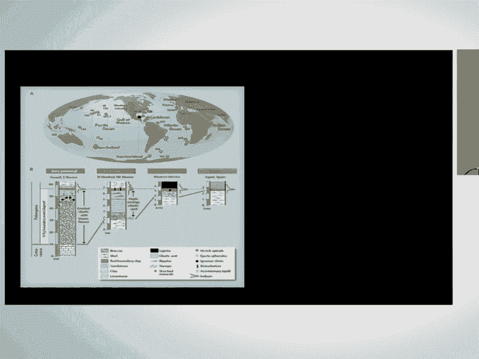
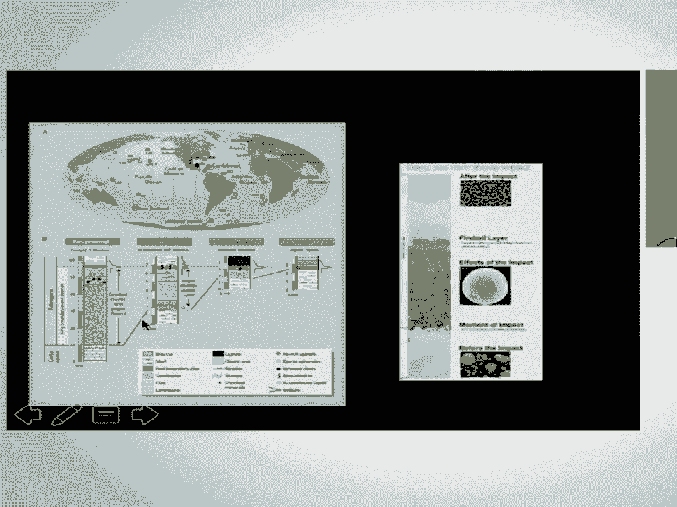
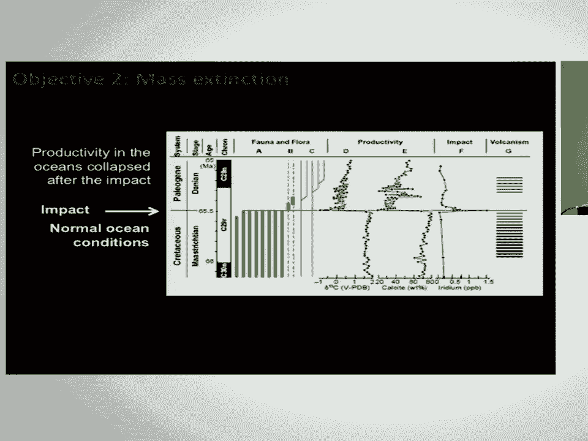
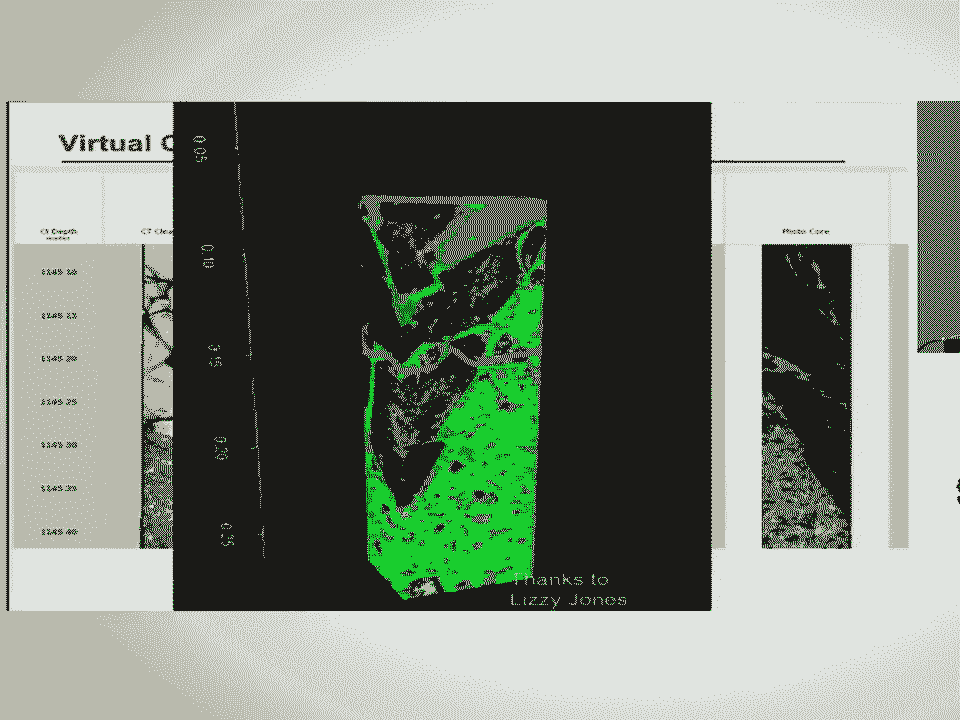
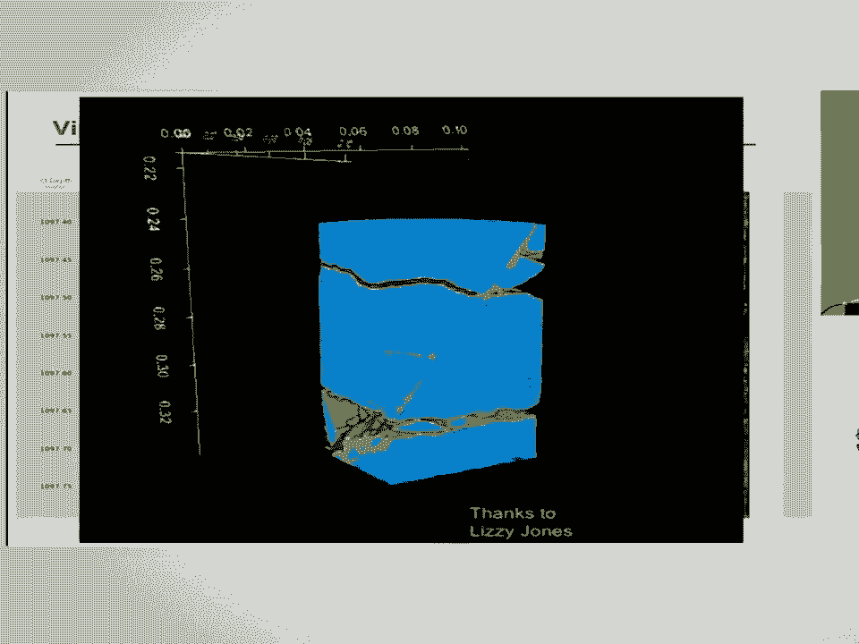
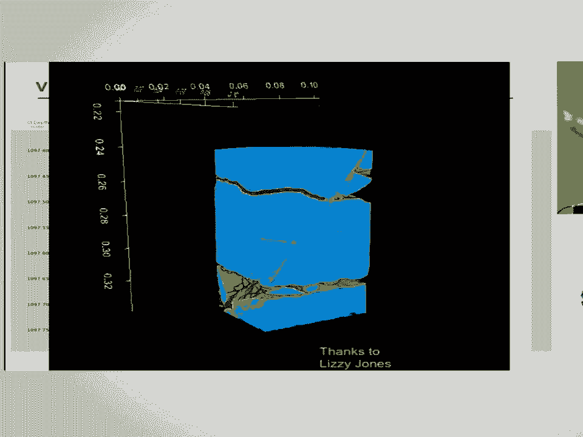

# 25：奇科苏卢布撞击坑钻探研究 🚀🌍

在本节课中，我们将学习关于奇科苏卢布撞击坑的钻探项目。这是一个研究大型撞击坑形成过程、其对地球生命灭绝的影响以及撞击坑内生命可能性的科学探索。我们将跟随科学家的视角，了解项目的目标、方法、关键发现以及这些发现如何帮助我们理解地球和其他行星的历史。

---

首先，我要感谢埃里克、恩索特以及SIPI的邀请，让我来做这次主题演讲。

在这种场合演讲总是很有趣，因为你们可能比我更了解其中的某些部分，反之亦然，我可能在其他方面了解更多。

但我非常乐意回答问题，特别是如果我使用了任何让人困惑的术语。

如果有人没听懂，请随时要求快速澄清。我们可以现场进行定义。

当我面对普通观众演讲时，我尽量去“去术语化”，但正如你们所知，完全“去术语化”是不可能的。

好的，这只是一张艺术家描绘的撞击效果图，它实际上是有比例的。

但展示这类图片总是很有趣。

我必须感谢很多人，我看到我的幻灯片顶部和底部被稍微裁剪了。

这个项目由国际大洋发现计划资助，这是一个由大约30个国家组成的联盟，负责在全球进行科学钻探。

它也得到了国际大陆钻探计划的共同资助，因为我们当时在非常浅的水域，几乎是在陆地上，所以他们从1000万美元中给了我们大约100万美元。

然后恩索特和威瑟福德实验室联合起来，看起来底部的标签消失了，但无论如何，恩索特和威瑟福德实验室联合起来，能够以非常低廉的价格帮助我们进行CT扫描，还捐赠了大量软件和开发人员时间等，使我们能够在计算机平台上直接分析这些岩芯，创建虚拟岩芯。

在这个空间里，我们可以与整个科学团队完全共享数据，让全球的研究人员都能访问这些岩芯，分辨率大约在0.3毫米级别，这确实令人兴奋。

我将向你们展示一些例子，说明这在科学上是如何结出果实的。

好的，闲话少说，这个项目到底是关于什么的？这个项目本质上是一种比较行星学。

我们所说的比较行星学，是指通过研究一颗行星来理解所有行星，或者在这种情况下，研究一颗岩石行星以及发生在岩石行星上的一个过程——即在整个太阳系历史中，撞击体与行星的碰撞——来从根本上理解撞击是如何工作的。

如果你要选择一个撞击坑来研究，选择一个不仅作为改变行星地壳的过程，而且对我们有直接影响的是很好的，而这个撞击坑，你或许可以论证，如果它没有发生，我们可能就不会在这里。

所以，这是一个值得研究的对象。

这就是我们的提案内容，令人惊讶的是，这个提案花了15年才获得资助，但最终我们成功了。

也许你们知道这种长远的愿景，但它确实奏效了。

那么，我到底在谈论什么？我基本上是在谈论这样一个事实：撞击坑形成是重塑除地球外所有其他行星表面的最基本、最主要的过程。

在地球上，我们有水的循环，有板块构造，我们以非常高的速度改变着地球的表面，比如每次飓风过境都会改变地表。

但在其他行星上，最主要的过程是撞击，并且自太阳系诞生以来一直如此。

那么，这些过程从根本上是如何运作的？谢谢。

刚才修复了问题的朋友，太棒了。通过研究地球上保存完好的撞击坑，我们能学到什么？

需要提醒的是，这不仅仅是过去的事情。左边展示的是我们太阳系早期历史的一个阶段，称为晚期重轰炸期，当时太空中有很多物体飞来飞去，所有天体都经常被撞击。

有趣的是，地球上最早的生命出现在37亿年前，正好在这个阶段结束时，所以也许存在某种联系，也许撞击太多，或者也许撞击帮助了生命的起源。

这些都是很好的问题，但撞击在太阳系早期非常重要，包括在地球上。

右边，每一个点都是一个近地天体，这是今天的太阳系。抱歉，我们地球的轨道是这个浅蓝色的圆圈。

所以，我们正穿行在一个充满物体的空间中，因此从灾害的角度来看，思考撞击可能对我们造成的影响也是值得的。

这张图可能已经过时了大约五年，我想我们现在又发现了大约一百万个天体。

那么，关于地球的科学故事是从哪里开始的呢？它真正始于这两个人：沃尔特和路易斯·阿尔瓦雷斯。

沃尔特是伯克利的地质学家，现在已经退休。路易斯·阿尔瓦雷斯是他的父亲，一位获得诺贝尔奖的物理学家。

他们有一个很酷的想法，去意大利古比奥观察一层粘土层，它位于两层石灰岩之间。

我的光标在哪里？在这里，就在这两层石灰岩之间。

这一层来自白垩纪，结束于6600万年前。这一层来自古近纪，开始于6600万年前。

中间有一层有趣的粘土层，他们想知道沉积这层只有几厘米厚的粘土需要多长时间。

为什么不研究一些恒定的东西呢？比如宇宙射线总是从外太空降落。

如果我们简单地测量这层粘土中有多少宇宙射线元素，做一个估算，我们或许就能说出它花了多长时间。

然而，他们恰好选错了层来提出这个问题，因为他们没有找到像十亿分之零点一那样的恒定背景值，而是发现了八十个十亿分比的异常值。

所以，从他们研究的宇宙成因元素铱的角度来看，这个数值高得离谱，这意味着这不可能是背景辐射，而必须是从外太空涌入的物质导致了它的存在。

因此，在1980年诞生了一篇科学论文，指出这一刻可能是一次撞击事件。

当时还没有发现撞击坑，只是在一层地层中发现了铱异常。

但这激发了人们的想象力，出现了科学书籍，比如关于恐龙灭绝的儿童读物《T-Rex and the Crater of Doom》等等。

然后，科学界发生了一个奇妙的巧合。在同一年，下面这位名叫莱昂·史密特的科学家也在研究突尼斯的一层地层，并得出了完全相同的发现。

只是在他的案例中，他把样本送到实验室，实验室回信说：“抱歉，你的样本有问题，被污染了。”

所以，他直到一年后才发表论文，当时他说：“那不是污染，那是信号。”然后他在那之后一年发表了论文。

不幸的是，他没有因此获得应有的荣誉，他本应与阿尔瓦雷斯父子共享荣誉。

快进30年，他去年实际上加入了我们的考察队，这真是太酷了，算是圆满的结局。

好的，我们谈论的是一个由撞击形成的全球边界层，而撞击坑是在那之后十年才被发现的。

我稍后会展示这一点，但重要的是，从这个角度思考这层地层的样子，因为我将在钻探岩芯中展示给你们看。

基本上，如果你在地球的另一侧，它是一层厘米厚的层，其中确实含有像铱这样的撞击证据。

当你靠近撞击点时，情况变得更复杂一些。

当你非常接近撞击点时，情况就非常混乱了，充满了海啸和地震等证据。

每个人都知道这一点，但确切理解形成这些地层的过程是什么，以及随着它向墨西哥湾方向增厚，人们知道撞击坑一定在墨西哥湾的某个地方。

这里有一个很好的例子，来自美国东海岸钻取的岩芯，由国际大洋发现计划的前身——大洋钻探计划完成。

你可以看到一个很好的例子，展示了其中的特征。在撞击之前，海洋表面的生物多样性较低，但存在非常大的生物。

这些基本上是当时生活在海洋中的浮游生物。然后你看到了这个疯狂的边界层，里面有像玻璃球（称为球粒）的东西，有经历过数百万psi压力的冲击矿物，顶部还有火球层，含有铱、尘埃、灰烬等来自撞击的各种令人兴奋的物质。

之后，生命发生了彻底改变，下面95%的生物灭绝了，只有四个物种幸存下来，其中只有两个物种后来繁衍开来，占据了全球海洋。

这是一个巨大的变化。

这是实际的撞击坑，最终通过重力模拟被发现。撞击引起的重力异常使圆形结构显现出来。

作为地球物理学家，我们已经进行了几次成像工作。其中一条测线用白色标出，这是一条地震测线，向下观察地表以下约10公里。

你看到的是所有这些大断层，使白垩纪地层发生位移，落入坑中。你可以在坑中看到这个大凸起。

这个凸起在这里显示为一个发亮的环，这实际上是埋在坑中心的一个山脉环。

这很令人兴奋，因为只有最大的撞击坑才有这些，它们被称为峰环，我们过去不知道它们是如何形成的，直到去年我们进行了钻探。

这是地球上保存最完好的大型撞击坑，另外两个同等大小的撞击坑已有20亿年历史。

我们认为在6600万年前，一个直径约14公里（或10英里宽）的撞击体击中了尤卡坦半岛，当时那里是一片相对较浅的海域，水深几百米。

全球75%的生命灭绝，海洋表面的灭绝比例更高，达到约90%，但河流中可能只有5%，所以变化很大。

地球上所有重量超过约60磅的生物都灭绝了，这很有趣。我们的祖先属于幸存者之列。

快进6600万年，我们有了一个科学团队，可以去研究它，这很好，对吧？

那么，我们的目标是什么？这是一张全波形地震成像图，属于地震成像的高科技领域。

基本上，当人们从空气枪等能量源发出能量时，我们收集所有返回的能量，通过拖在船后的灵敏接收设备接收，然后创建图像，告诉我们岩石的密度（实际上是声波在岩石中的速度，但两者是等效的），并将其叠加在一张制作精良的图像上。

你可以看到我们决定钻探地点的一些真实细节。这就是那个峰环，那个山脉环。

注意它有一个非常平坦光滑的顶部。注意这里有一个浅蓝色的层，它的速度和密度都非常低。那是什么？

然后你可以看到这上面的所有地层。我的光标又丢了，在这里。

你可以看到峰环本身几乎是均质的，你看不到任何密度对比。

但在它上面，你有所有这些地层，这些单独的地层是在随后的6600万年里掩埋撞击坑的石灰岩层。

我们的目标是从大约500米深处开始钻探，向下钻取并采集岩芯，收集覆盖在其上的石灰岩层，以了解生命是如何恢复的。

然后钻入峰环，穿过那个浅蓝色的物质，进入峰环本身，以提出三个非常基本的问题：峰环是如何形成的？撞击过程从根本上如何运作？是什么导致了75%地球生命灭绝的环境变化？撞击对地下（地壳内）的生态系统有什么影响？

我们知道地球表面之下存在着一个巨大的生态系统，据估计它比生活在地表的生态系统大得多，主要是细菌、古菌等有趣的生命形式。它们如何受到这次撞击的影响？

我们提出这个问题的原因与生命起源有关：生命是否可能因为撞击驱动的能量和化学交换而开始，而不是目前流行的理论——生命起源于大洋中脊？这是我们的第三个目标。

好的，我将快速浏览这些目标，然后向你们展示一些结果，以及我们如何实际使用CT成像并与这个社区合作。

首先要看的是月球上峰环型撞击坑的图片。这是月球上的薛定谔盆地。

在左边，你可以看到一个基本平坦的盆地，可能充满了撞击熔岩和碎屑等各种物质。

但在盆地中央，你可以看到这个山脉环。这个东西就是峰环。

关于如何形成这样一个看起来低而平的撞击坑，以及如何形成山脉环，曾经有两种相互竞争的理论。

为了让你了解规模，在地球上，这些山脉高1到2公里。撞击坑最初形成时，边缘可能有撒哈拉到毛里求斯那么高，然后才坍塌。

所以这些不是小山。两种理论是：一切都基本上由熔体驱动，这就是左边的理论，称为撞击熔体坑或嵌套熔体假说，即撞击使物质真正熔化（这里的熔化不一定指温度，也指压力，如果你撞击得足够猛烈，可以使物质熔化，需要60吉帕斯卡或960万psi的压力，但撞击确实有那么多能量）。

这个想法是，有如此多的熔体，以至于它实际上阻碍了任何反弹过程，形成撞击坑的方式基本上是物质从侧面坍塌，山脉环将由从侧面落入的浅层物质构成。

另一种理论是，撞击如此猛烈，以至于地壳中更大范围的物质暂时表现得像一种流体，一种缓慢移动的粘性流体。

在这个世界里，你可以把它想象成向池塘里扔一块石头，撞击时基本上会形成一个洞，然后立即开始向上反弹。

顶部有一些撞击熔体，但基本上不足以阻止这个反弹过程。它可能上升到地球表面以上10公里，然后向后坍塌，使得山脉环实际上由来自深处的物质构成，现在位于地表。

这很重要，因为如果这是它的工作方式，那么行星的地表会随着时间的推移被撞击重塑，它们就像一个巨大的园艺系统，行星表面不断被撞击更新，如果右边的理论是正确的。

那么，到底是哪一种呢？如何测试呢？如果你钻入峰环，在尤卡坦的情况下，如果它是浅层物质，那么它将由石灰岩构成；如果它是深层物质，那么它将由石灰岩以下的物质构成。

先不剧透，我们去看它是由什么构成的。

下一个问题：大灭绝。你知道，像那样的大撞击在当地是糟糕的一天，对整个墨西哥湾也是糟糕的一天。

这里用颜色绘制的是所有沉积物（所有岩石）的厚度图，这些岩石因为撞击而坍塌进入墨西哥湾，这是地球上最大的单一事件沉积层。

估计涉及的能量相当于10级地震，比构造地震产生的能量更大，海啸高达500米以上，飓风级风力，冲击波将1000公里内的一切烧成灰烬，这确实是糟糕的一天。

但它为什么杀死了全球各地的生物？这就是研究问题：为什么地球另一侧的生命会受到影响？

这是我们想要研究的事情之一。这里只是一个例子，底部是白垩纪，描绘了动植物群。

由于这个事件，生物灭绝，新的生物开始出现。如果你测量全球生命生产力，无论是通过方解石（即石灰石）的数量还是碳同位素，一切都在崩溃。

这确实是一件大事，你可以看到它正好与撞击时刻重合。

另外需要澄清的是，当时德干地盾有一次主要的火山喷发，但规模并不比其他火山喷发大，而且它们发生在撞击前后，所以与这次事件没有巧合，与撞击有巧合。

那么，潜在的致死机制是什么？也许是由于从坑中喷射出的快速物质加热了地球表面；也许是由于空气中的碎片导致黑暗；也许是由于释放了像硫这样的物质，导致某种核冬天情景，就像坦博拉火山喷发导致“无夏之年”一样，大型火山可以做到，那么撞击呢？它能持续多久？

也许由于所有碳进入大气导致海洋酸化，这听起来像今天的情况吗？也许只是说说而已，或者我们甚至向海洋中注入了大量金属中毒。

这些都是一些想法。这里只是一个有趣的模型，展示了欧洲被喷射物击中的情况。

压力波穿过大气层，喷射物从奇科苏卢布6000公里外飞来。红色是较小的颗粒，黄色是较大的颗粒。

你会看到小的黄色颗粒实际上会很快落下，而红色的颗粒会卡在大气层中，大约在平流层底部50公里高处。

这足以导致类似右下角艺术家描绘的情景吗？当然，另一个问题是，当这些东西开始落下时，会产生多少热效应？那实际上是在加热东西吗？

有很多证据表明与撞击相关的烟灰和分散的野火，估计从几个小时的烤面包机温度到几个小时的披萨烤箱温度，但足以烧毁大量可燃材料。

如果你体型大，你就有麻烦了，你无法逃脱；如果你体型小，也许你可以躲在海洋里；也许生活在溪流底部的生物会没事。

这些是我们想在微体化石世界中研究的一些想法，通过观察生活在海洋中的浮游生物，我们看到在全球范围内这些生物的巨大差异。

撞击后3万年是我们第一次看到浮游生物世界全新进化的时间。如果你看撞击后300万年，你可以看到完全是不同的生命进化。

所以我们可以从岩芯尺度上观察生命的进化，以浮游生物作为地球上生命的代表。

最后一个目标是研究生命是否喜欢撞击坑，这里指的是生活在地下的生命。

问题是：当你投入那么多能量，进行那么多化学交换，穿过可能因撞击、破裂和移动而增强了孔隙度的地壳时，你是否实际上为生命或特殊生命在地下占据一席之地创造了条件？

我们有证据表明过去发生过这种情况。这是切萨皮克湾撞击坑，我不知道有多少人知道切萨皮克湾下面有一个巨大的撞击坑，宽85公里，发生在3500万年前。

他们钻探了它，击中了一个掉入其中的巨大岩块，在那个岩块中，他们发现了一个自那时以来进化但为撞击坑所独有的生态系统。

所以它是由3500万年前的撞击能量启动的，现在仍然生活在那里，这使它成为一个非常有趣的问题：撞击能否启动地球上的生命？

另外，这里的图片只是为了说明峰环可能是钻探的好地方，因为你可以想象流体向上流入这样一个突出部位。

那么，我们做了什么？我们带着一艘升降船出去，在普罗格雷索（世界上最长的码头，长6公里，水深7米，以便停靠游轮）附近钻探。

我们大约在离岸25公里、水深约20米（60英尺）的地方，将船用支腿升起，钻探了两个月。

这是一张照片。令人惊讶的是，这是你上船的方式，在西班牙语中他们称之为“寡妇制造者”。

你实际上就是抓住它，他们把你吊起来，然后把你放到船上，这很有趣，我喜欢，但其他人并不兴奋。

我们在那里呆了两个月。这些是集装箱，兼作我们的实验室，我们六个人住一个房间，所以海上科学家的生活有时并不奢华。

每个集装箱都有桌子、实验室、显微镜以及测量岩芯物理性质的方法等等。

我们这样做了两个月。岩芯没有在海上劈开，因为没有空间这样做，它们保持完整。

我稍后会展示期间发生了什么，但一旦它们被送回陆地，最终送到了德国不来梅，那里建立了一套完整的实验室来研究岩芯。

整个32人的科学团队加上许多技术帮助人员聚集在一起，我们劈开岩芯，为研究取样，描述它们等等，对这些岩芯进行全套初步测量。

事实上，它们没有在海上劈开，需要大约三个月才能到达不来梅，这创造了一个机会窗口。

通过恩索特的合作，我们能够去用最先进的医用风格CT扫描仪（在这种情况下是双能量CT）扫描这些岩芯，以便也能对这些岩芯进行虚拟分析。

这是一个绝佳的机会，得益于这些物流安排，并且因为威瑟福德给了我们一个难以置信的价格，恩索特为项目捐赠了他们的时间，这真是太棒了。

我将在几分钟后展示一些结果。

当我们从大约500米深处开始钻探时，我们得到了什么？抱歉，开始取芯。我们先钻进了500米，然后开始从500米深处取芯，一直钻到大约1335米，接近一英里。

我们看到了大约115米掩埋撞击坑的石灰岩，然后看到了大约130米那个浅蓝色的物质（我稍后会展示图片，现在称之为撞击角砾岩），然后我们实际上获得了600米的峰环本身（实际上是580米），我将展示这些图片。

向下移动，这些只是石灰岩的图片。结果发现大部分属于始新世，这是过去6600万年中最热的时期，所以人们对气候研究感兴趣。

我将快速跳过这部分。实际上，我们在向下钻探时得到了所谓的黑色页岩。

研究黑色页岩非常重要，因为这是海洋环境恶化的时期：变得非常热，海洋酸化占据主导，海洋分层，许多生物死亡。

所以这是我们未来可能面临的噩梦情景，人们希望通过研究这个事件（称为古新世-始新世极热事件，发生在大约5500万年前）来了解它。

我们确实捕获了这一点，所以这对气候研究很有用。

在那之下，我们进入了石灰岩的末端，遇到了这个有趣的棕色层，我稍后会详细研究。

然后我们进入了那个浅蓝色的物质。