# 26：使用 pomegranate 进行快速灵活的 Python 概率建模 🍈

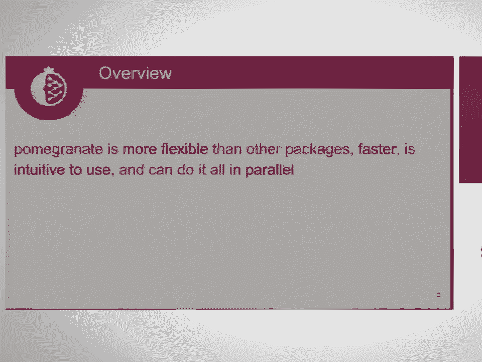

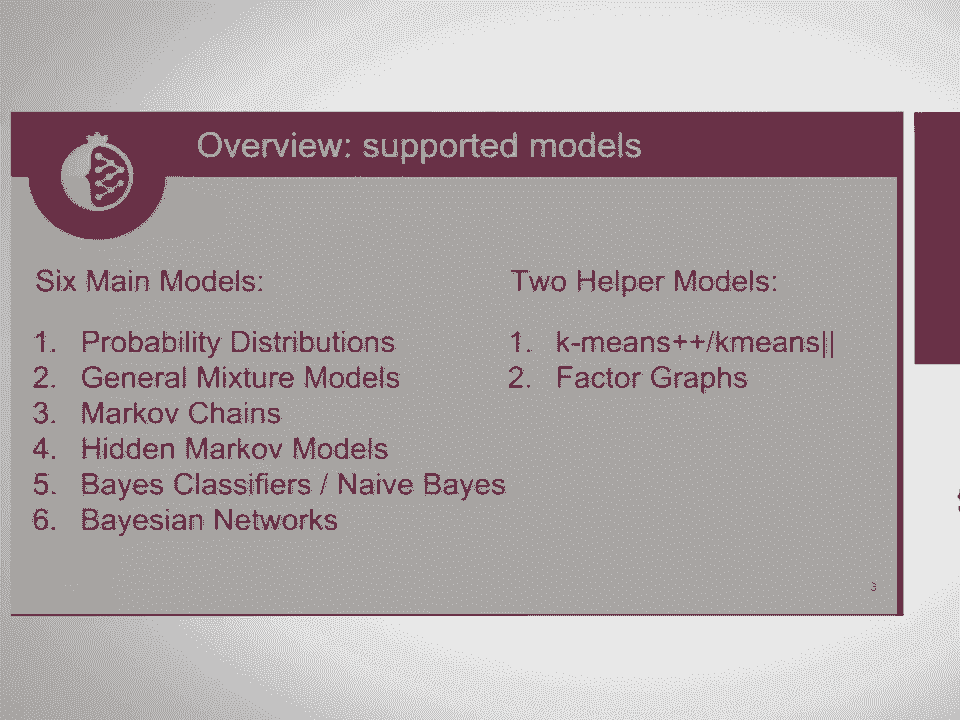

在本节课中，我们将学习一个名为 **pomegranate** 的 Python 库。该库旨在实现快速、灵活的概率建模。我们将了解它的核心设计理念、主要功能、性能优势以及一些实际应用案例。

## 概述与核心设计理念

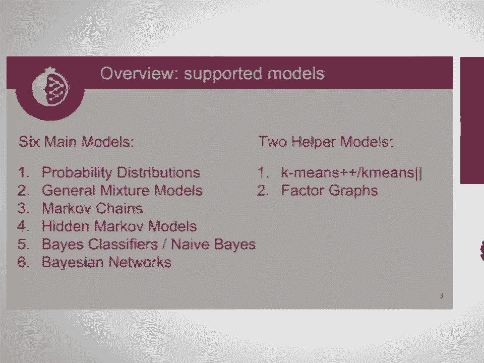

pomegranate 是一个用于概率建模的 Python 库，其设计目标是比现有方案更灵活、更快速、更直观，并能并行处理所有任务。

该库目前涵盖六种主要模型和两种支持模型。主要模型包括：
*   概率分布
*   混合模型
*   马尔可夫链
*   隐马尔可夫模型
*   贝叶斯分类器
*   贝叶斯网络

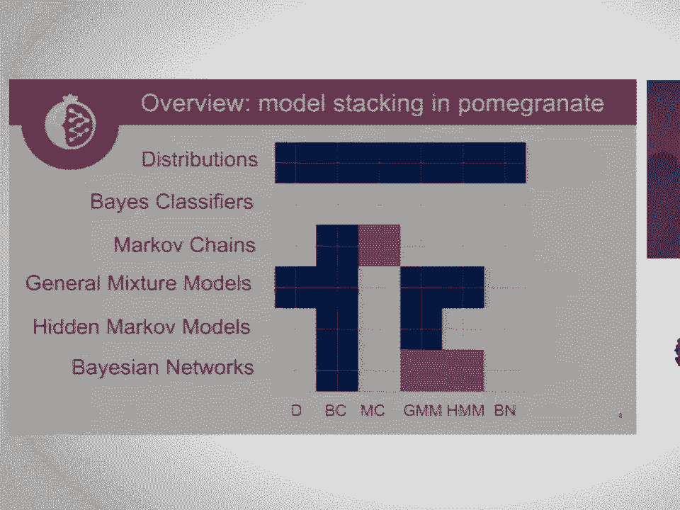

pomegranate 的一个核心原则是，尽管这些模型在形式上不同，但它们本质上都表示**概率分布**。例如，混合模型是一个复杂的分布，隐马尔可夫模型是序列上的分布，而贝叶斯网络则是沿图结构分解的分布。这一核心见解贯穿了整个库的设计。

## 模型的灵活组合 🧩

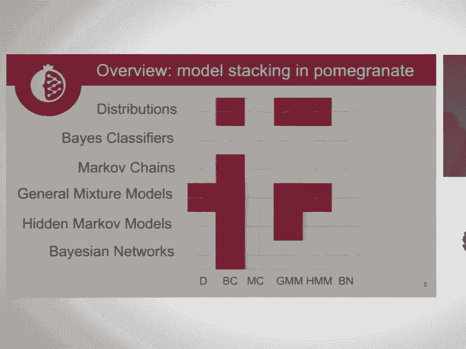

基于“万物皆分布”的理念，pomegranate 允许以其他库不支持的方式灵活地堆叠模型。

以下是模型堆叠的示例矩阵，其中行代表可被嵌入的模型，列代表可容纳其他模型的容器模型：

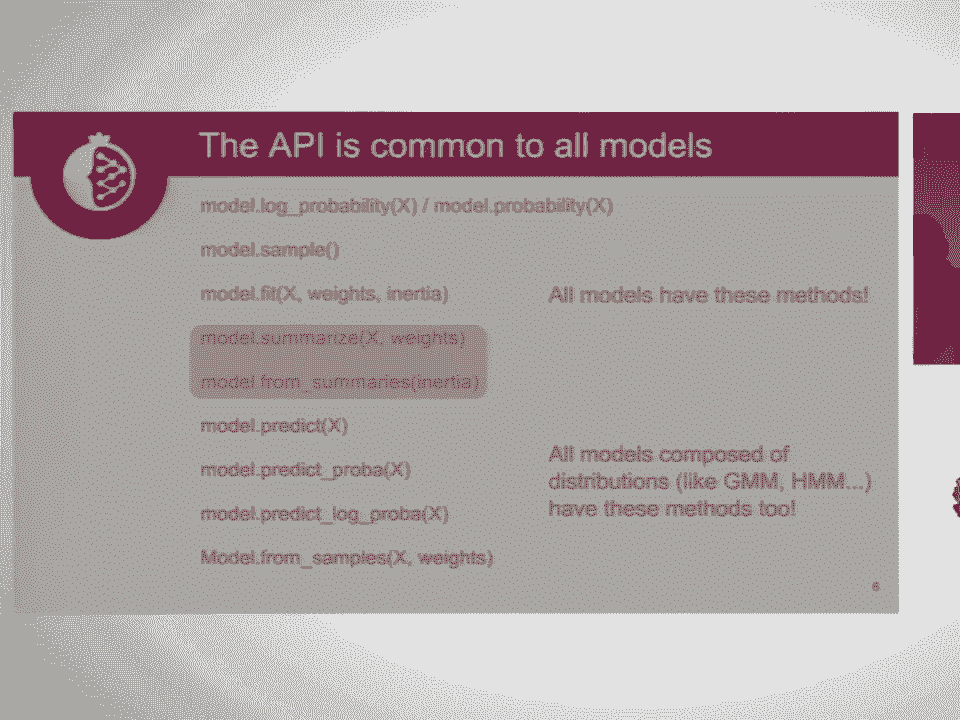

*   **深蓝色**：pomegranate 已支持的方式。
*   **浅蓝色**：计划未来支持的方式。
*   **深红色**：据我所知，其他 Python 包均不支持的方式。

例如，你可以将正态分布放入贝叶斯分类器中，得到高斯朴素贝叶斯。但 pomegranate 的灵活性远不止于此，你还可以：
*   将混合模型作为发射分布放入隐马尔可夫模型，得到 GMM-HMM。
*   将隐马尔可夫模型放入分类器中，创建隐马尔可夫模型贝叶斯分类器。
*   为不同特征使用不同类型的分布（如指数分布、伯努利分布），而不仅仅是高斯或多项式分布。

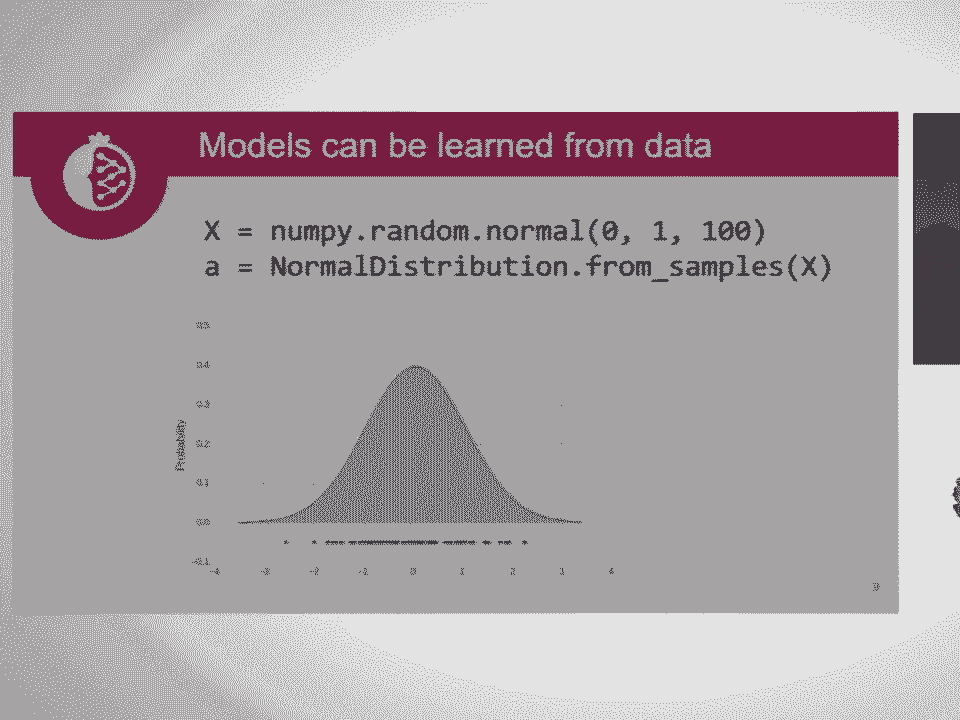

## 统一的 API 接口

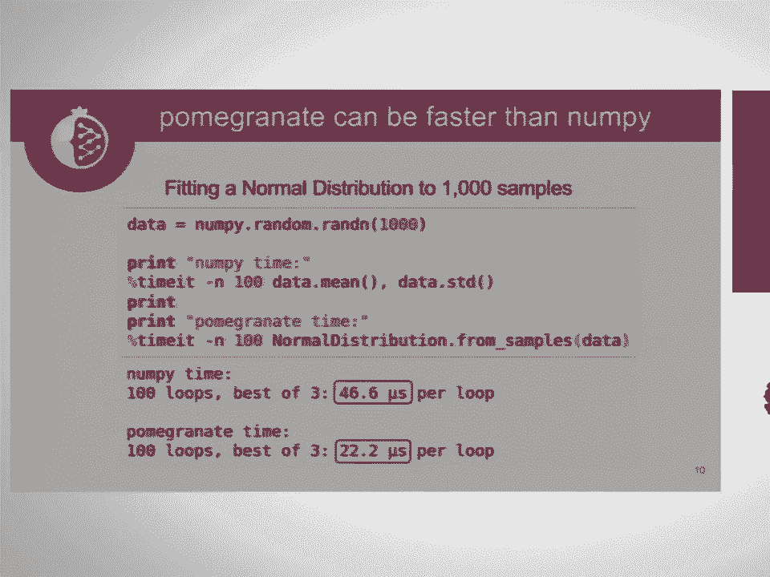

由于所有模型本质上都是概率分布，pomegranate 为它们提供了统一的 API。

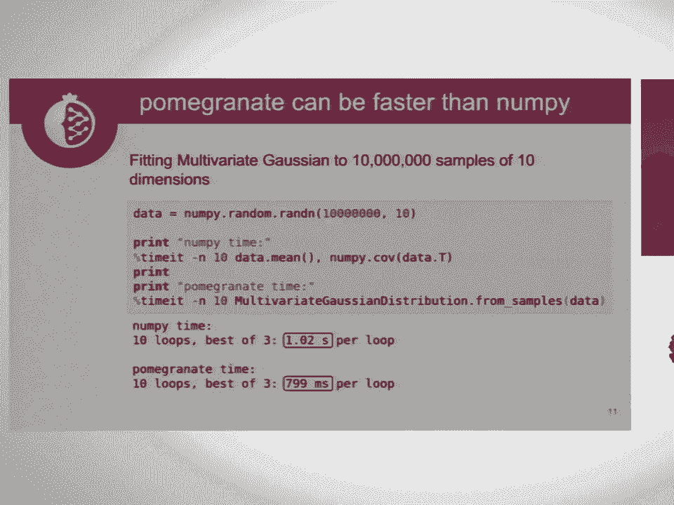

所有模型都支持以下核心方法：
*   `.probability()` / `.log_probability()`：计算（对数）概率。
*   `.sample()`：从生成模型中采样。
*   `.fit()`：像 scikit-learn 一样拟合模型。
*   `.summarize()` / `.from_summaries()`：支持核心外学习 API。
*   `.predict()` / `.predict_proba()` / `.predict_log_proba()`：对于组合模型（除基本分布外的所有模型），提供与 scikit-learn 类似的预测方法。
*   `.from_samples()`：直接从数据推断并创建模型，这是与 scikit-learn 的 `.fit()` 有所区别的初始化方式。

## 支持的概率分布 📊

pomegranate 采用模块化结构，支持多种概率分布，这使得创建复杂模型变得简单。

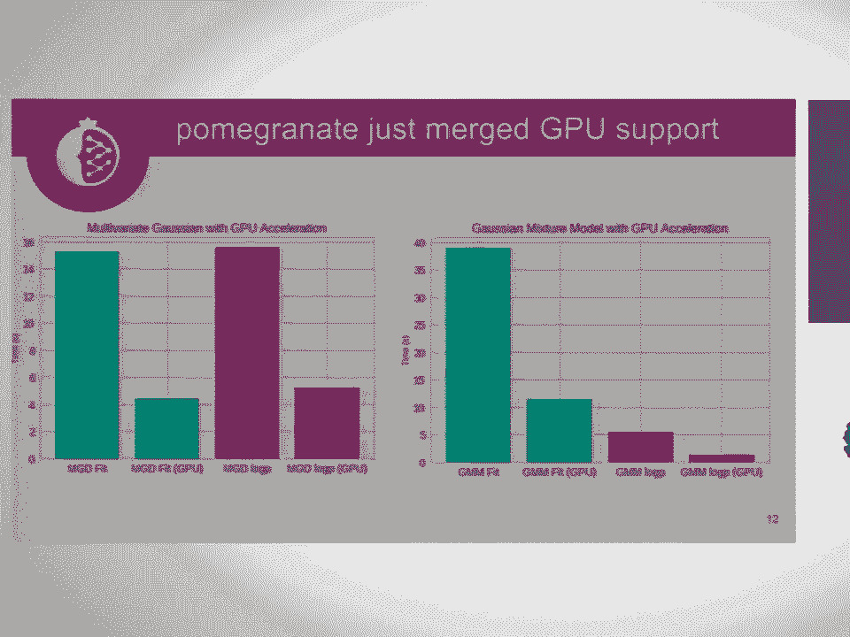

库中包含了广泛的分布类型，最常见的用红色标出，例如：
*   伯努利分布
*   正态分布
*   多元高斯分布

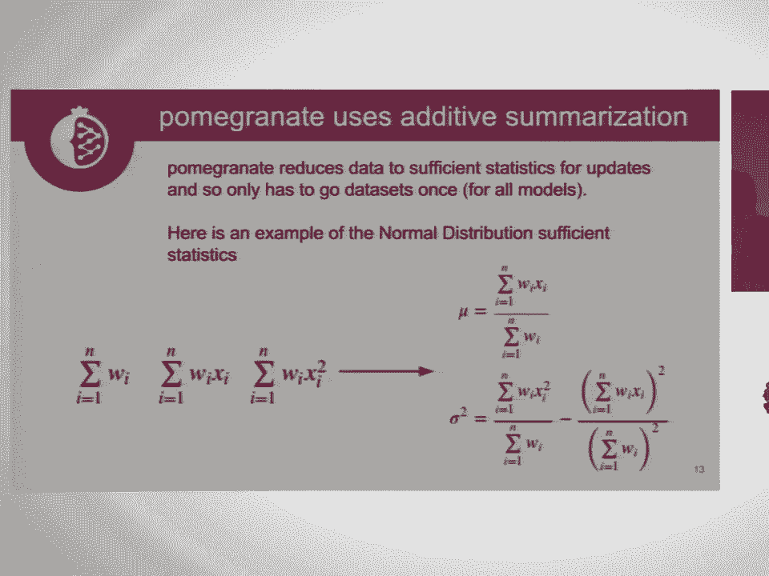

由于其模块化设计，你可以通过“拖放”这些简单模型来创建复杂模型。例如，只需实现一个对数正态分布，你就可以创建对数正态混合模型和对数正态隐马尔可夫模型，而无需更改底层代码。

## 模型初始化与性能优势 ⚡

pomegranate 提供了两种初始化模型的方式。

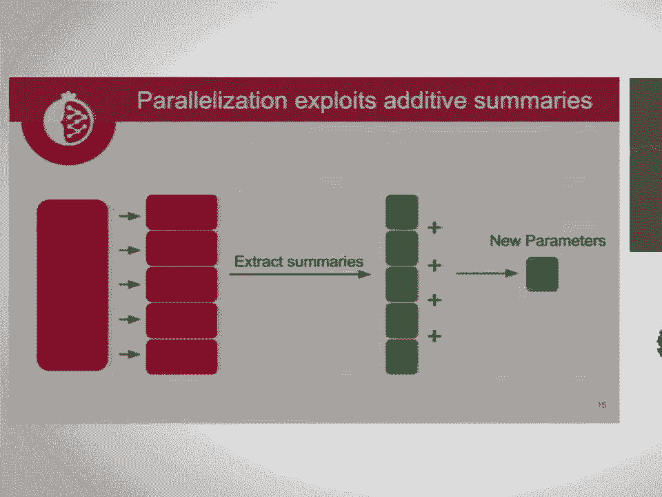

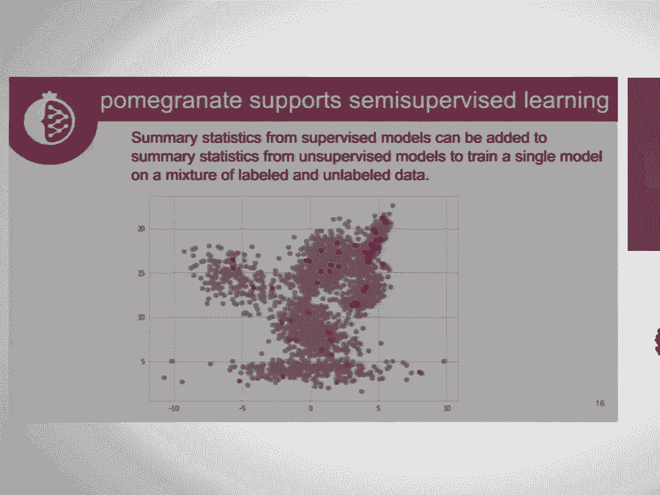

**方式一：已知参数**
如果你已知模型参数，可以直接传入。例如，创建正态分布只需传入 `mu` 和 `sigma`。创建高斯核密度估计（一种非参数分布）也只需传入数据点。

**方式二：从数据推断**
如果你知道模型类型并拥有数据，可以使用 `.from_samples()` 方法直接从数据推断模型，这类似于 scikit-learn 的 `.fit()`。

现在，让我们看看 pomegranate 如何实现其速度优势。

**比 NumPy 更快**
例如，用大约1000个样本拟合一个正态分布，pomegranate 的速度大约是 NumPy 的两倍。这是因为 NumPy 追求通用性，需要分别计算均值和标准差，而 pomegranate 针对特定分布进行了优化，能更高效地一次性计算所需数值。

对于更大的模型，如用1000万条10维数据拟合多元高斯分布，pomegranate 仍比 NumPy 快约20%。

**GPU 加速**
pomegranate 已合并 GPU 支持，为所有模型带来了约4倍的加速。例如，在拟合多元高斯分布和计算样本概率时，都能观察到显著的性能提升。这种加速也延伸到了混合模型。

这种加速得益于 pomegranate 的模块化设计：只需为多元高斯分布添加 GPU 支持，所有依赖它的模型便自动获得了 GPU 支持。该功能后端基于 `cupy` 库，可自动检测并使用 GPU。

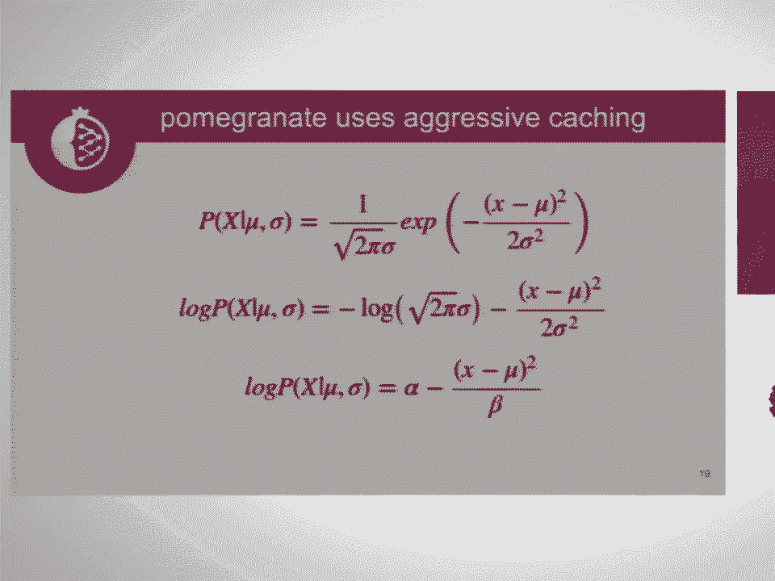

**高效计算与核心外学习**
pomegranate 通过计算**充分统计量**来高效更新参数。例如，对于正态分布，只需计算权重的和、加权点的和以及加权点平方的和，就能精确得出均值和方差。这意味着只需遍历一次数据。

这种可加性更新自然支持**核心外学习**：无需将所有数据载入内存，可以分批加载数据、计算充分统计量并累加，最后更新模型参数。

**并行处理**
可加性更新也使并行化变得简单：将数据分块，分配给不同进程并行计算充分统计量，然后汇总并计算新参数。pomegranate 主要使用多线程（释放了 GIL）而非多进程，避免了内存复制，在数值计算上更高效。

## 半监督学习能力 🎓

pomegranate 天然支持半监督学习，即同时利用大量未标记数据和少量已标记数据。

其原理是：先用已标记数据初始化模型，然后使用期望最大化算法，同时结合已标记数据的监督信号和未标记数据的无监督统计量，共同更新模型。这种方法在理论上合理，并且比 scikit-learn 的标签传播算法快约10倍。

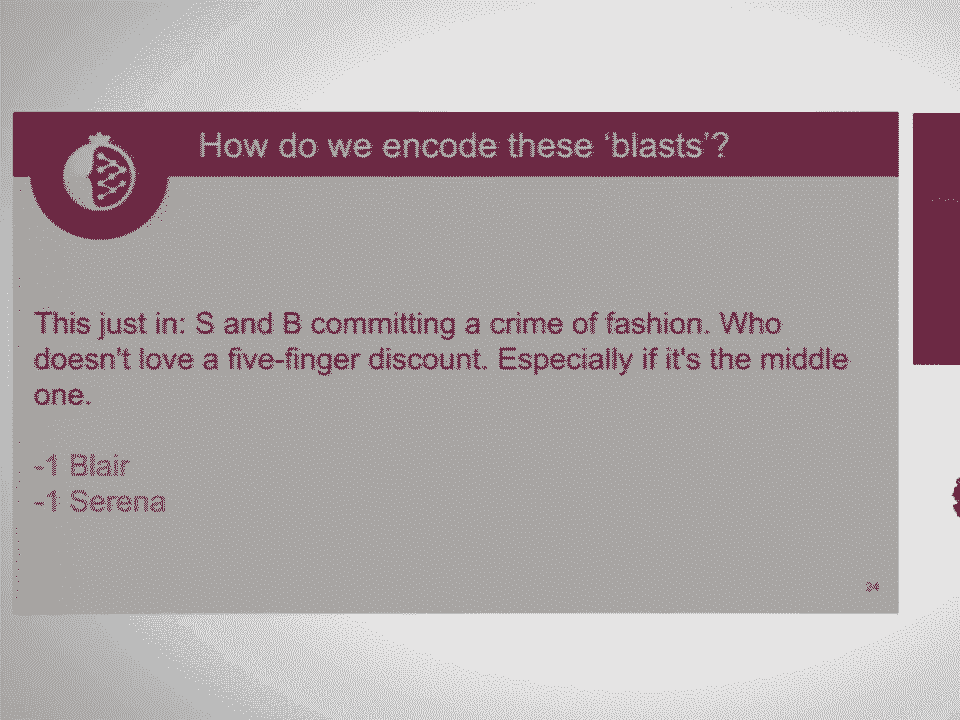

效果上，仅使用已标记数据得到的决策边界可能比较尖锐，而结合未标记数据后，边界会更平滑，类间过渡更自然，通常能减少约一半的错误。

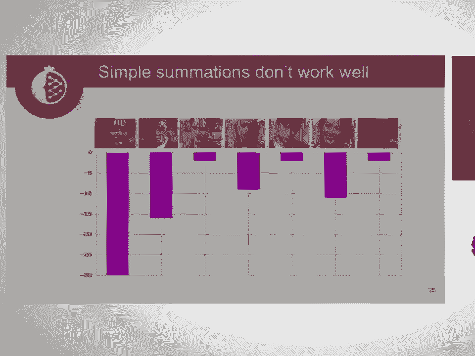

## 比 SciPy 更快的概率计算

在计算大量高维样本（如2000维2000个样本）的多元高斯对数概率时，pomegranate 比原生方法快约2倍。如果已经创建了分布对象，由于**积极的缓存策略**，速度可达 SciPy 的8倍。

缓存原理：在正态分布的对数概率公式中，包含 `log(σ√(2π))` 的项与数据无关。在创建分布对象时，pomegranate 会预先计算并缓存这个值，从而在后续计算每个数据点的概率时，避免了耗时的对数或指数运算，只需进行少量的加法和乘法。

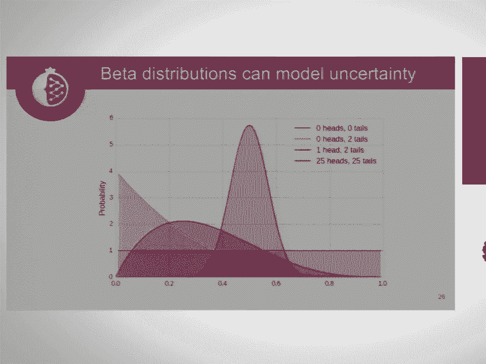

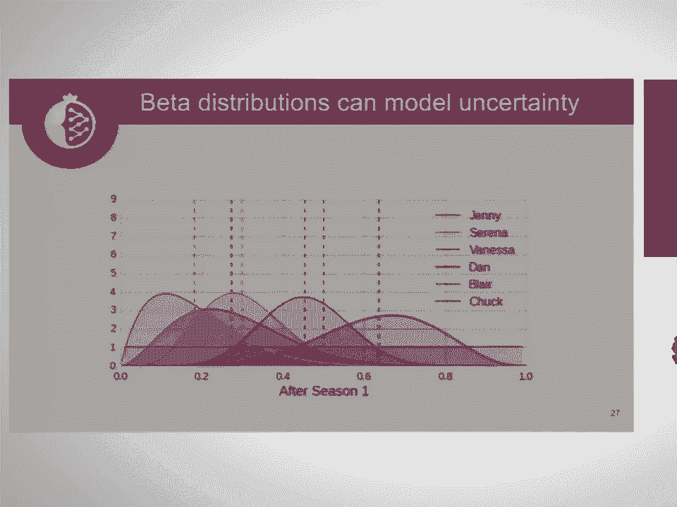

## 实际应用案例：揭秘“绯闻女孩” 🕵️

为了说明概率建模的实用性，我们来看一个有趣的例子：分析美剧《绯闻女孩》中神秘人物“Gossip Girl”的真实身份。

**问题建模**
我们将“Gossip Girl”发送的每条爆料短信编码为一个向量，其中每个角色对应一个分量。如果爆料在当下有利于该角色的议程，则记为+1；如果不利，则记为-1。假设“Gossip Girl”会始终推动自己的议程。

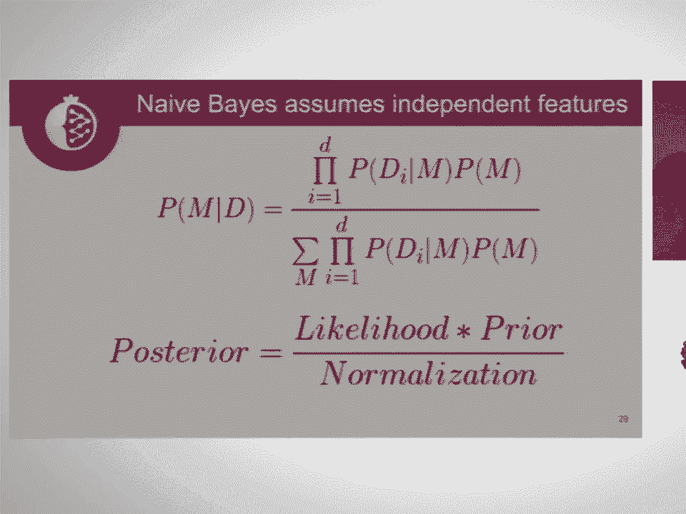

**简单求和的局限**
最初，我们尝试对每个角色在所有爆料中的得分求和，分数最高者嫌疑最大。但结果发现所有角色的总分都是负数，且多人并列，无法得出明确结论。这说明我们需要更精细的概率模型。

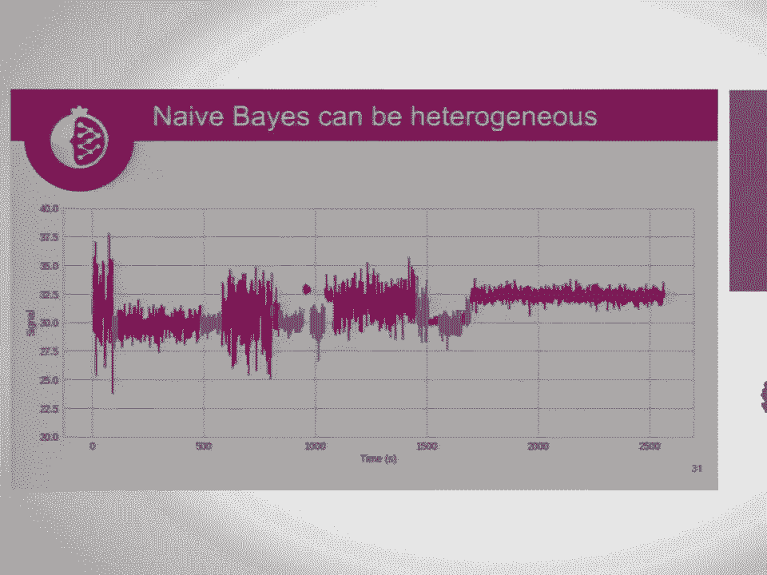

**使用贝塔分布建模**
我们转向**贝塔分布**，它常用于建模介于0和1之间的概率（如事件发生率）。在这个案例中，我们将+1视为“成功”（有利于该角色），-1视为“失败”。

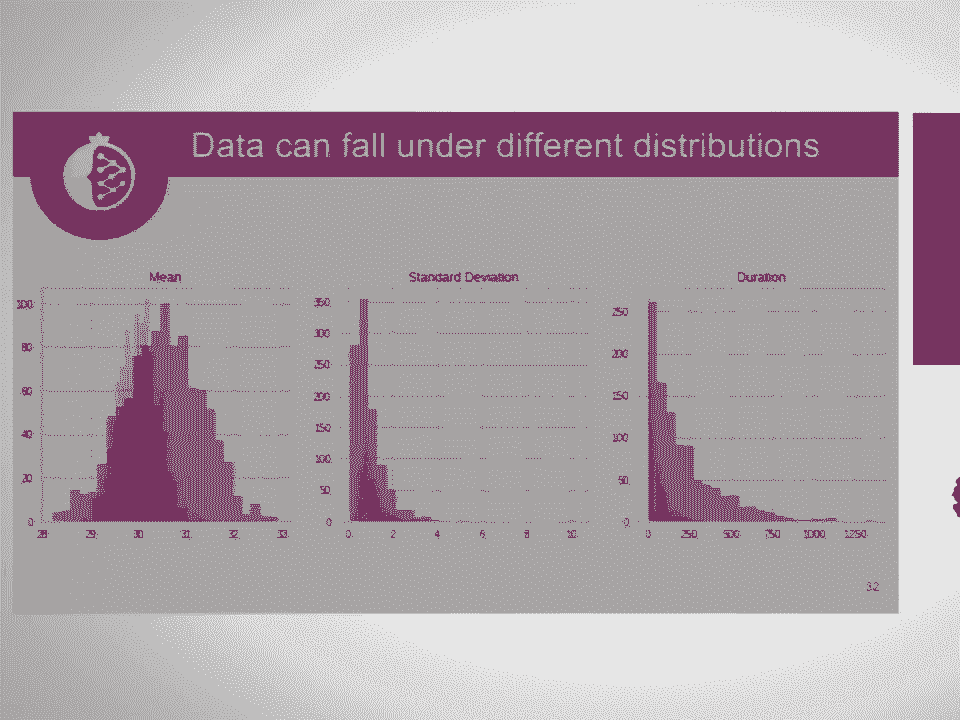

随着剧情推进（数据增多），每个角色对应的贝塔分布会逐渐收敛（方差减小）。第一季结束时，丹（Dan）的分布最偏向正面（最可能是Gossip Girl），而珍妮（Jenny）和塞雷娜（Serena）最不可能。

四季之后，所有角色的分布更加集中。有趣的是，根据这个模型，丹仍然是可能性最高的人选，而这与剧集最终揭晓的真相一致。

这个案例展示了概率建模如何从带有噪声的数据中提取洞察。

## 超越朴素贝叶斯：灵活的分类器

现在，我们回到一个更常见的模型——朴素贝叶斯分类器，来展示 pomegranate 的灵活性。

**朴素贝叶斯的局限**
朴素贝叶斯使用贝叶斯定理计算后验概率，但它假设所有特征相互独立。这通常会导致决策边界呈椭球形。在 scikit-learn 中，你通常只能使用相同类型的分布（如所有特征都是高斯分布）。

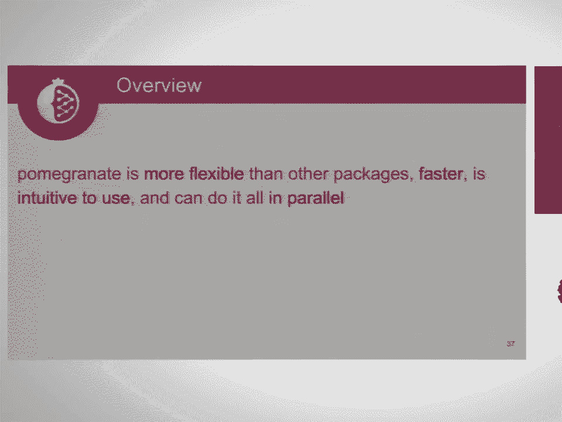

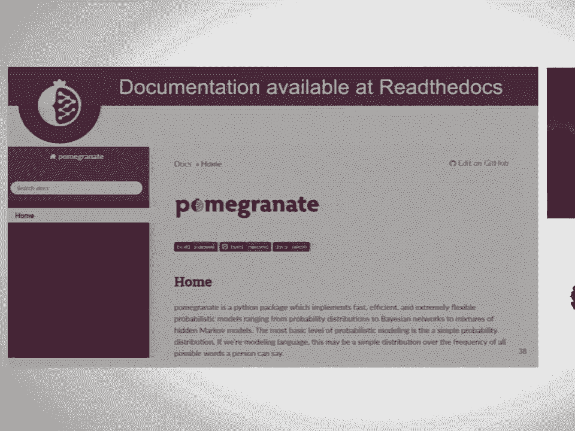

**pomegranate 的灵活性**
假设我们有一段时序信号，想将其片段分类为两类。其特征（如均值、标准差、偏度）可能分别服从不同的分布（如正态分布、对数正态分布、指数分布）。用单一的高斯分布对所有特征建模效果可能不佳。

在 pomegranate 中，你可以轻松地为不同特征指定不同的分布。通过为均值、标准差、偏度分别选用正态、对数正态、指数分布，我们可以在不增加数据、不进行复杂清洗的情况下，获得约4-5%的准确率提升，且计算成本没有增加。

**更一般的贝叶斯分类器**
pomegranate 更进一步，实现了**通用贝叶斯分类器**。它不再要求特征独立，允许使用具有任意协方差矩阵的似然函数。例如，对于特征间存在相关性的数据，使用全协方差矩阵的多元高斯分布作为似然函数，比朴素贝叶斯能减少约一半的错误。

你甚至可以使用**混合模型**作为每个类别的似然函数。对于由多个子成分构成的复杂数据，使用混合模型（如每个类别用两个多元高斯混合）比使用单一多元高斯分布能获得更好的分类边界和性能。

## 总结与资源

回顾开篇，pomegranate 实现了其设计目标：
*   **更灵活**：支持模型自由堆叠、特征独立分布、通用贝叶斯分类器。
*   **更快速**：通过优化算法、GPU加速、缓存和并行处理实现。
*   **直观易用**：统一的 API 和模块化设计。
*   **支持并行与核心外学习**：基于可加的充分统计量。

**资源**
*   **文档与API参考**：可在 Read the Docs 上找到。
*   **教程**：GitHub 仓库的 `tutorials` 文件夹中提供了所有模型的简明教程。

感谢大家的聆听。现在进入问答环节。