# 27：为科学与创新而编程 🧪💻

在本节课中，我们将学习Gaël Varoquaux在SciPy 2017大会上分享的核心观点。他将探讨如何通过编程来推动科学发现与技术创新，并分享构建科学软件库的设计原则与最佳实践。

---

## 演讲开场与背景

SciPy社区对我而言如同一个大家庭，它在许多方面都对我产生了深远的影响，这种影响难以言表。Prebrii提到我曾从事量子物理研究，而正是SciPy促使我发生了巨大的转变。无论是在这里，还是通过互联网与世界各地的朋友远程协作，SciPy都为我带来了大量的朋友。来到这里，我见到了像Prebrii这样的朋友，我希望你们也有同样的感受，因为能与这些人相聚是莫大的快乐。这远不止是工作，意义重大。

非常感谢给我这个机会回到这里，与朋友们相见，这真的非常棒。

现在，进入我的演讲主题。我想分享一些关于我们如何编程，以及我如何尝试为科学和创新而编程的思考，其目标当然是改变世界。

---

## 定义科学与创新

当我说“科学”时，我指的是发现知识或机制的过程。这不仅限于学术界，也存在于工业界。如今，计算在这一过程中处于核心地位。

让我们做个简单的调查。在座有多少人来自学术界？有多少人来自工业界？看起来大约各占一半。我知道我应该问有多少人不喜欢举手，这个点子我是从别人那里“偷”来的。

将科学与计算机结合，这种情况非常普遍，通常被称为“计算科学”。例如，我们听说过它在核物理中的应用。现场有核物理学家吗？太好了。还有计算流体动力学。太棒了，有做计算流体动力学的吗？计算化学家呢？心理学领域的？别害羞。太棒了！你们可能会觉得在计算科学会议上问有没有心理学家有点奇怪，但我并不这么认为。想想市场营销，过去几年对市场营销影响最大的就是数据科学，即通过分析客户数据来更好地理解他们。

因此，计算科学的传统领域正在扩展。美国科学促进会首席执行官最近不得不提醒国会：“科学不是一种政治建构或信仰体系。科学进步依赖于开放性、透明度以及思想和人员的自由流动。”很明显，我们从事科学的方式正成为一个重要议题，因为它已在国会中被讨论。

问题是，这种进步并不总是如预期般顺利。

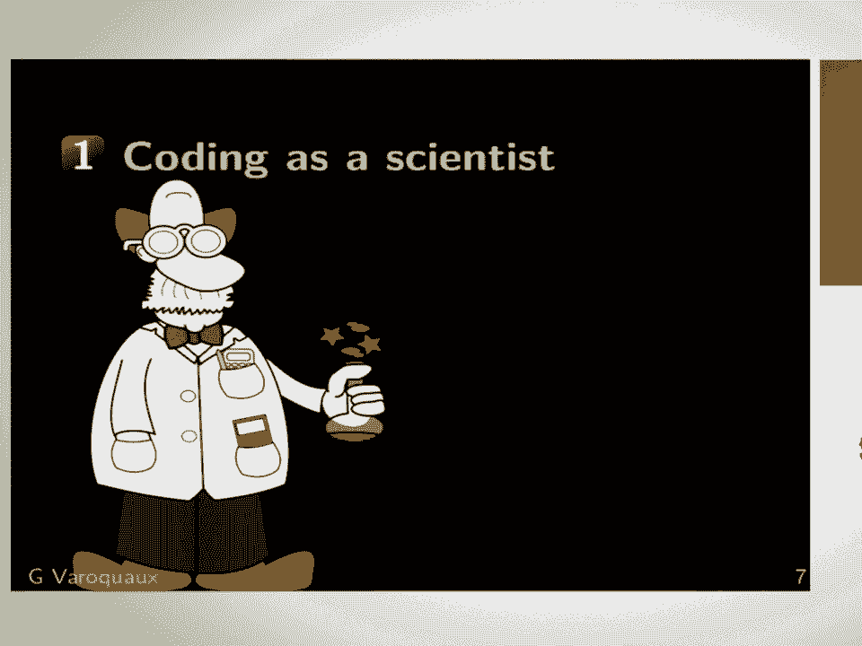

---

## 科学中的信任危机与可重复性

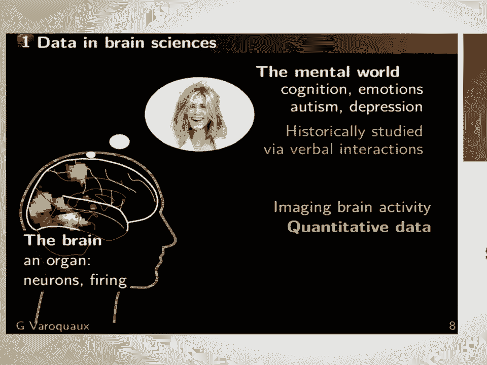

让我举个例子。几年前，《经济学》杂志发表了一篇题为《债务时期的增长》的论文，该论文认为高额债务会阻碍经济增长。这篇论文被用作公共政策的基础，例如将金融危机归咎于公共债务。但如今，这篇论文被认为是错误的。这个结论是通过分析支撑该论文结论的Excel电子表格发现的。

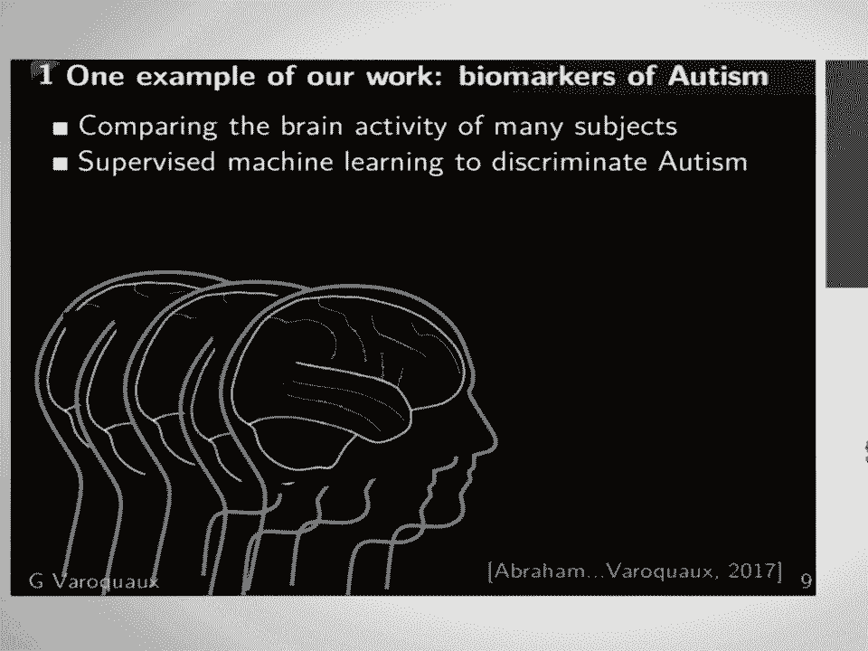

另一个例子是自闭症与疫苗。需要强调的是，**疫苗不会导致自闭症**。没有科学证据表明疫苗会导致自闭症。曾有一项发表在《柳叶刀》上的研究，事后被证明是伪造的。然而，其后果是，在一些教育水平很高的国家，疫苗接种率下降，导致本应在地球上被根除的疾病再次爆发。这可以直接追溯到那个被伪造的、声称疫苗导致自闭症的研究。

我想说明的是，**对科学失去信任的代价是极其高昂的**。我认为我们目前正经历着这种情况。

---

## 创新的多维性

谈到创新，我想说创新是关于将正确的技术用于正确的用途。以电灯泡为例，你知道它实际上是由林赛在1835年发明的吗？但要使其可行，还需要额外的技术进步，比如需要好的真空泵，这花了一些时间。真正的突破发生在它经济上可行时，这意味着电力输送的普及。那时，我们熟知并都归功于他的那家公司才真正让电灯泡普及开来。

另一个有趣的故事是关于Adbox公司。这家总部位于奥斯汀的公司致力于将实体邮件数字化，他们会扫描你收到的邮件。但问题是，美国邮政系统告诉Adbox，美国邮政服务的客户不是公民，而是寄信的人，包括垃圾邮件发送者。因此，Adbox干扰了美国邮政的业务，最终导致其倒闭。

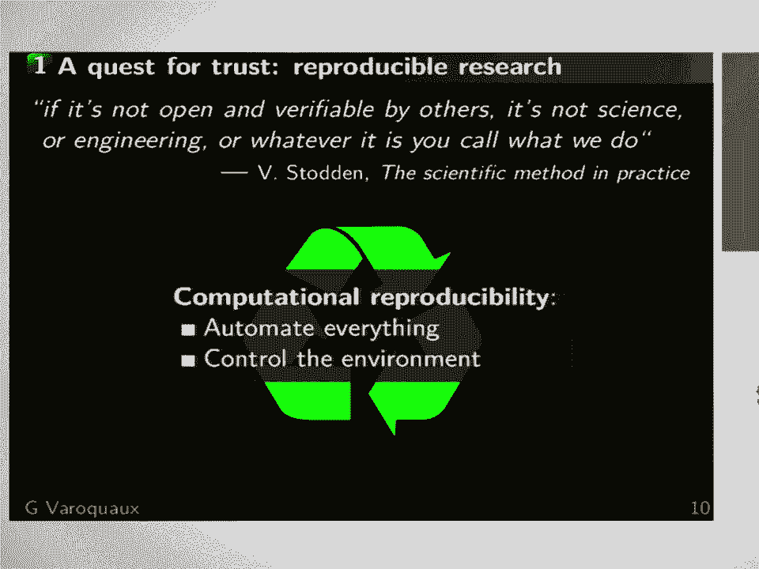

我的观点是，创新和技术远不止技术本身，还涉及经济学和权力平衡。我们作为技术专家倾向于关注技术，但我们需要理解技术是嵌入在更广阔的世界中的。

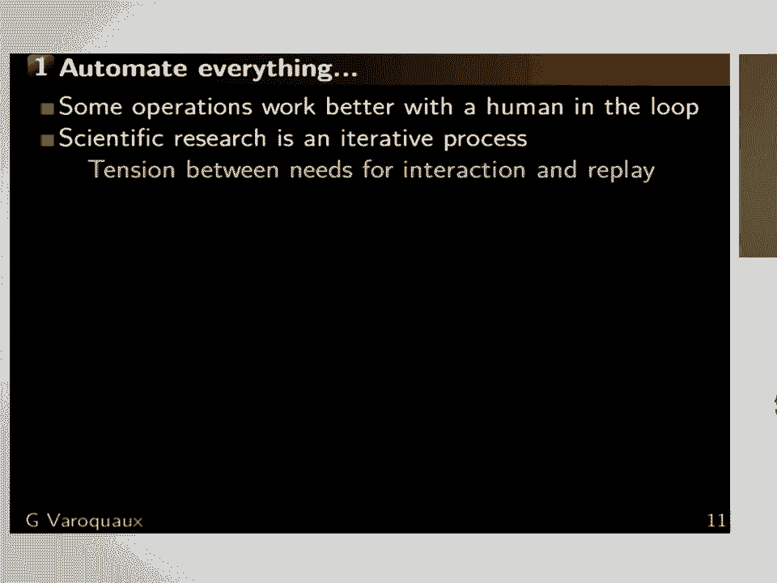

---

## 计算：新时代的电力 ⚡

回到我演讲的标题“为科学与创新而编程”，我想断言：**计算是新时代的电力**。它是当前变革的强大驱动力。借助新的数据源，它能够触及物理学和工程学之外的广阔领域。这就是如今被称为“数据科学”的领域，我认为它正在对社会产生巨大影响。

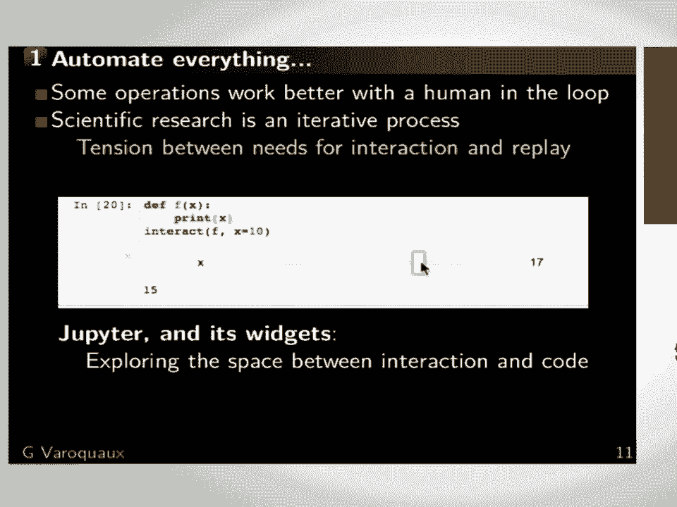

因此，我想首先从科学家的角度看待我对编程的感受，然后从构建软件的人的角度，最后审视我们的生态系统。

---

## 作为科学家的编程实践

过去几年，我一直对数据对脑科学的影响感兴趣。脑科学关注我们的精神世界，例如认知、情感或相应的病理学，如自闭症、抑郁症。历史上，这主要通过言语互动来研究，这基本上是心理学。过去几十年发生的一个变化是，我们现在可以成像大脑功能，获得大脑活动的定量记录。这对心理学和认知科学产生了缓慢但深远的影响。因此，我认为这是一个非常有趣的领域。

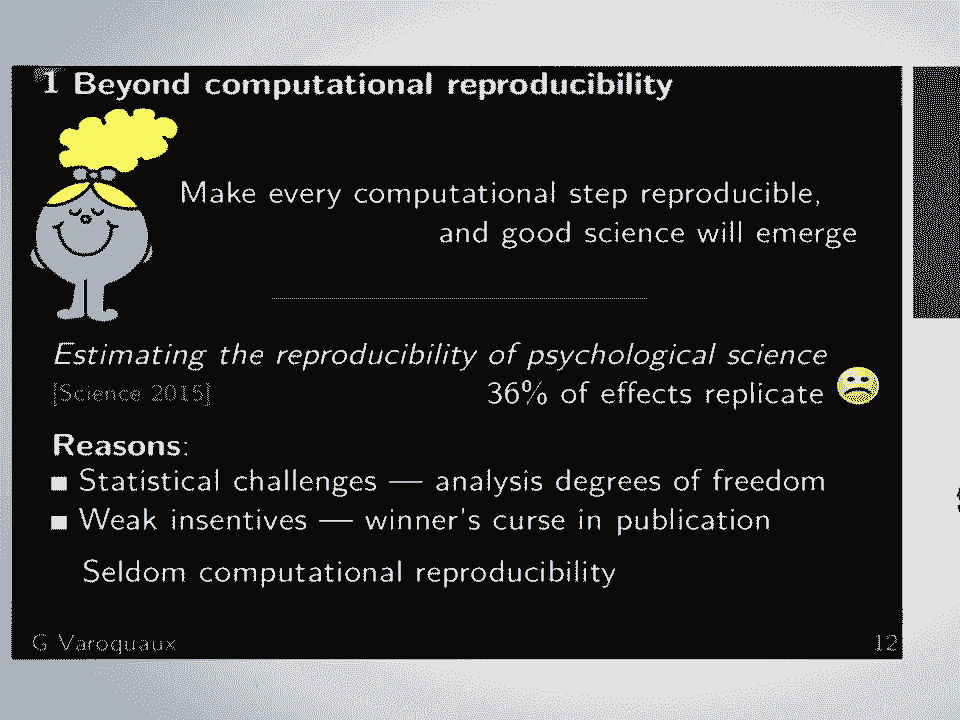

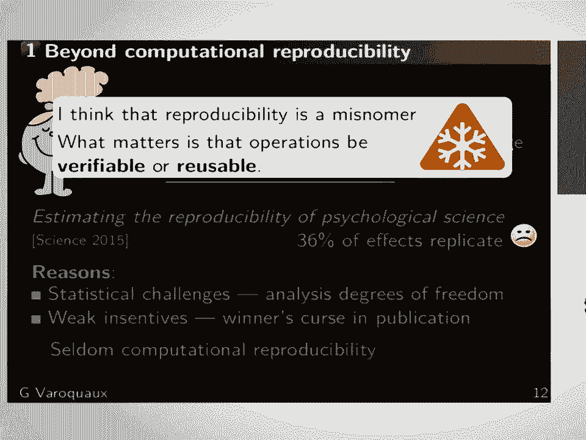

我们一直在研究数据处理能对这些领域做什么，以及如何处理医学图像。

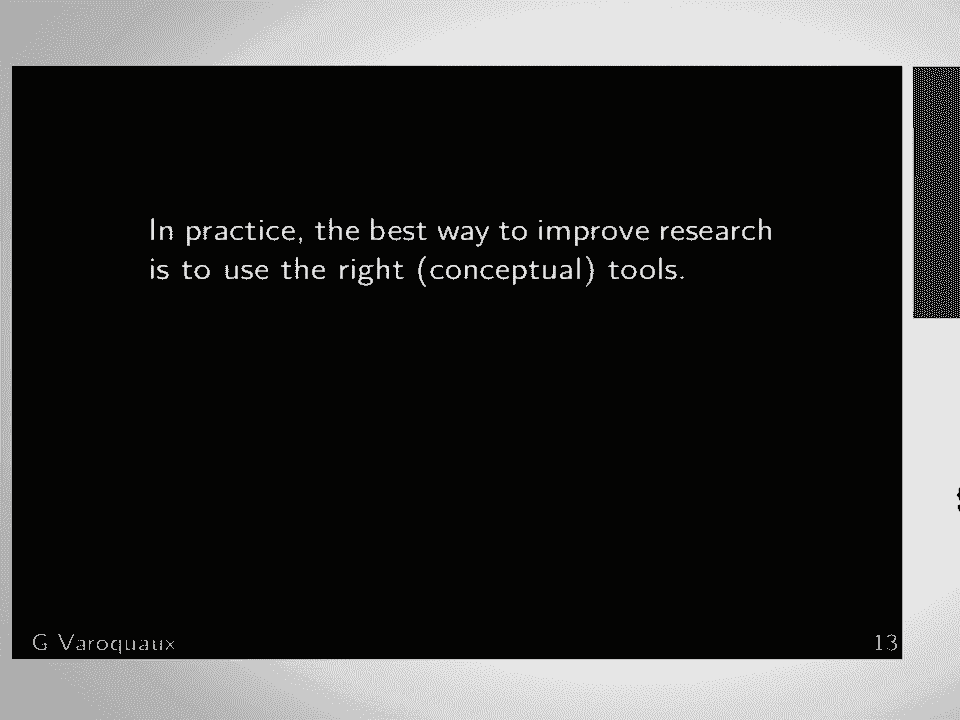

---

### 一个具体的研究案例：自闭症的生物标志物

举个例子，我们一直对自闭症的生物标志物感兴趣。问题是：你能通过观察一个人的大脑，推断出这个人是否可能患有自闭症谱系障碍吗？

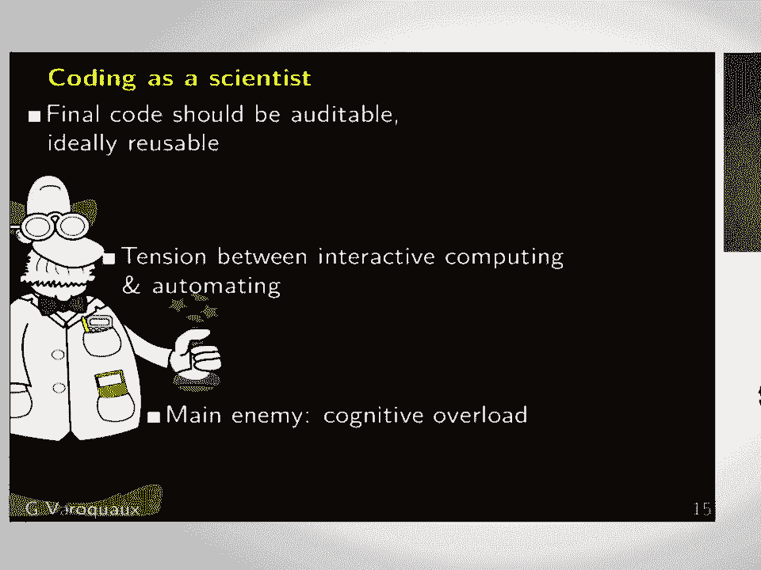

我们的工作方式基本上是：比较许多不同受试者的大脑活动，然后使用**监督机器学习**，让计算机学习如何区分自闭症患者和对照组。

在实践中，为了让你了解这背后的工程工作，我们首先要做的是提取大脑网络。我们不知道这是什么，但对计算而言真正重要的是，我们正在进行**无监督特征学习**，并将一个相当复杂的模型（比逻辑回归复杂得多）拟合到1TB的数据上。因此，这里存在一些计算挑战。

完成这一步后，我们将研究如何参数化每个受试者的大脑连接性。这时我就可以假装自己是个数学家，谈论信息几何和李代数之类的东西。如果你感兴趣，我们可以线下讨论。然后，我们在此基础上进行监督学习。我们直接使用 **`scikit-learn`** 并应用它，因为这对我们来说就是监督学习。

---

### 科学实践中的挑战与局限

这种方法有效，但我们对心理学或精神病学的影响存在很大的局限性。首先，从设计上，我们无法超越定义自闭症或对照组的临床医生，因为是他们给了我们定义。所以，我们无法比他们做得更好。但问题是，精神病学家对他们目前的定义并不满意。

脑部疾病是由症状定义的，这是一个不令人满意的状况。你希望根据组织损伤或机制来定义病理学。然而，他们还不准备接受我们黑箱算法的定义。我们可以告诉他们：“我能预测某人是否是自闭症患者或对照组。”但他们不会接受。也许他们是对的，也许他们不应该信任黑箱算法，因为它有很多活动部件。

因此，我们在这个领域长期面临的挑战是：**我们能否让从业者将这些工具变成他们自己的？** 如果我们能做到这一点，我认为我们将对精神病学产生深远影响。如果我们做不到，这个问题就悬而未决。

正如我所说，科学面临着对信任的追求。这通常被称为“可重复科学”。Victoria Stodden说过：“如果它不开放且无法被他人验证，那就不是科学或工程。”因此，该领域和计算科学领域的人们一直在大量讨论计算可重复性。其理念是，如果你自动化一切并控制环境，事情应该是可重复的，对吧？

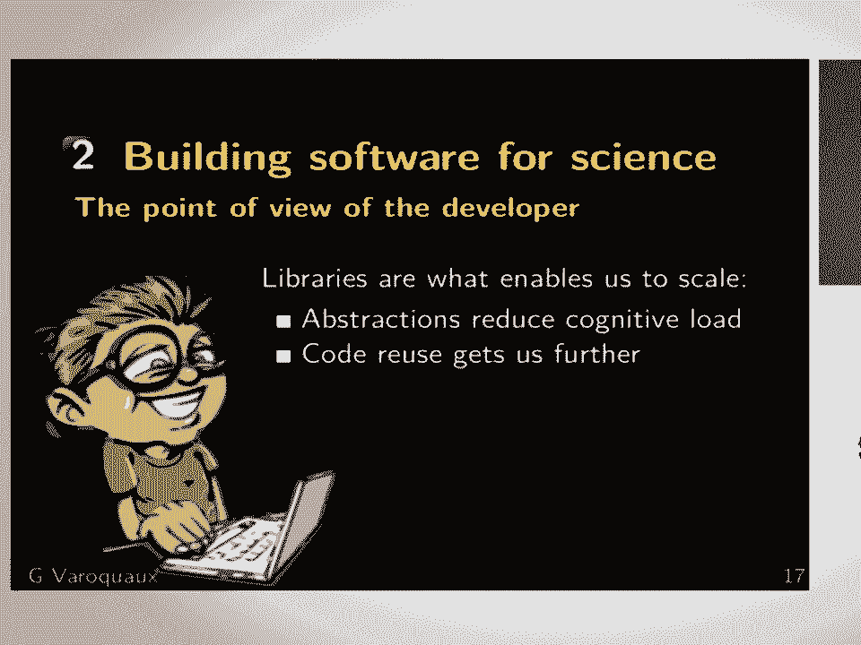

---

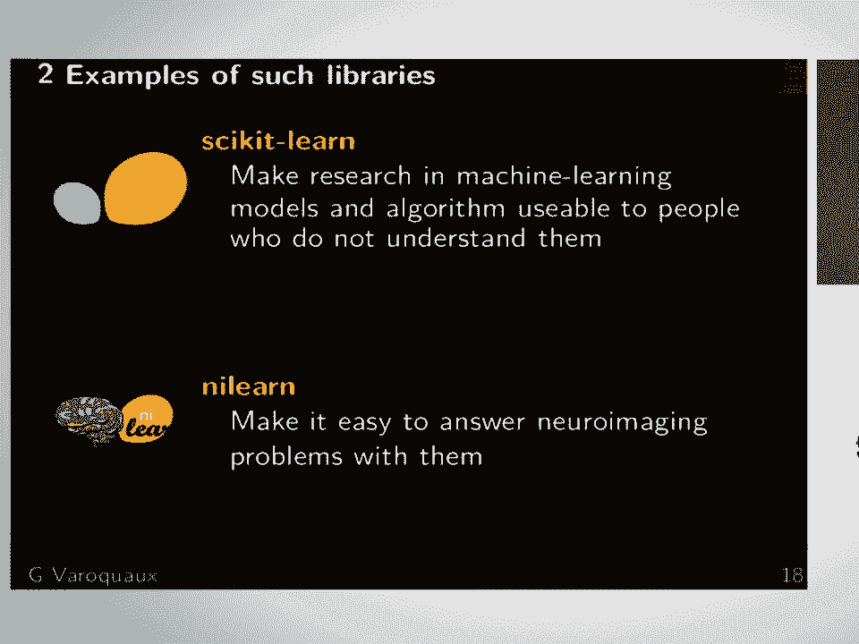

### 自动化与交互的张力

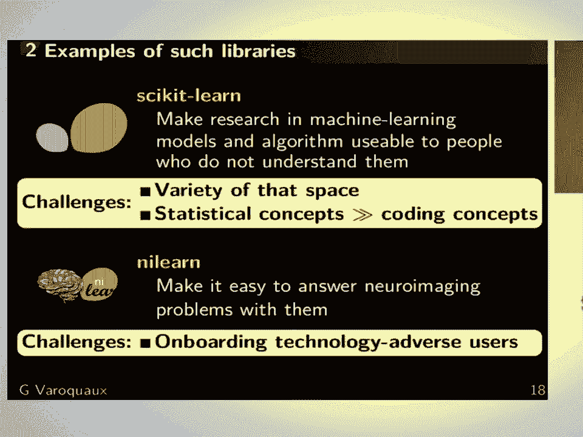

那么，让我们自动化一切。正如我的老板曾经说过的：“你知道，这只是编程的一个简单问题。”当然，这更具挑战性。原因在于，有些操作在有“人在回路”时效果更好，比如标记数据、获得对数据的洞察。科学本身就有人参与。另一个相关的挑战是，科学研究是一个迭代过程。

因此，我们面临着对快速、简单交互的渴望与对自动化和重放的需求之间的张力。我认为这个社区的每个人都感受到了这一点。

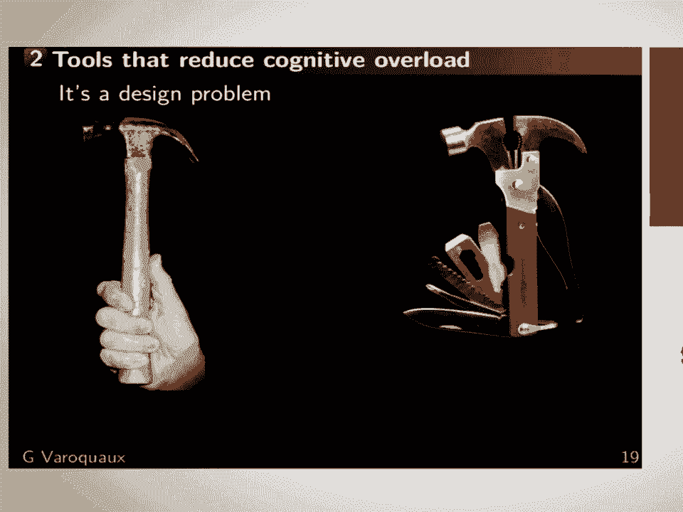

很久以前，当我和Prabhu在Mayavi上研究3D数据可视化时，我认为我们解决这个问题的方式是：Mayavi的代码库在其内部对象模型和它暴露的对话框之间建立了紧密的联系。所以，代码看起来像对话框，而不是可视化。我们认为这很好，但还不够。后来，Prabhu添加了一个很棒的功能：记录模式。你可以点击记录按钮，然后在可视化上更改东西，相应的代码行就会弹出。这是一种方法，试图记录人们正在做的事情。

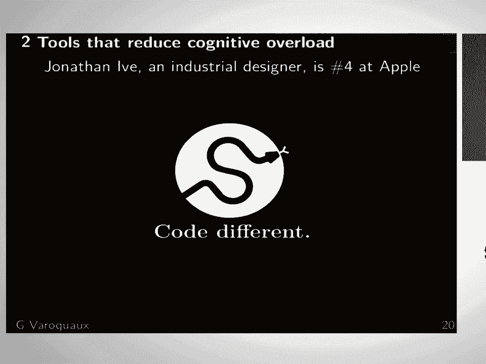

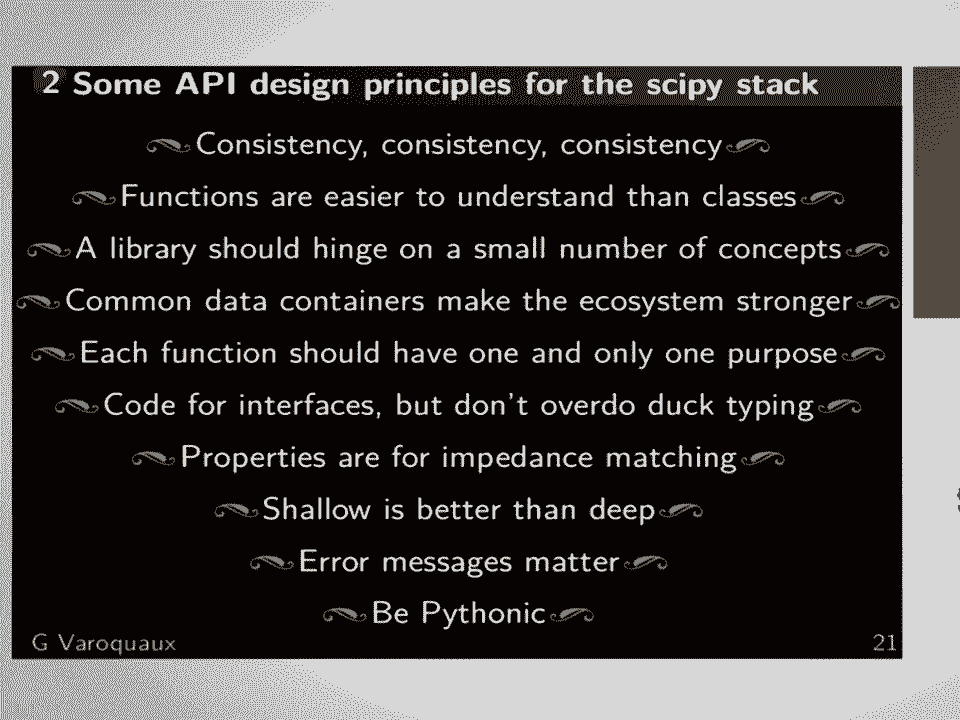

另一个有趣的发展是围绕Jupyter笔记本发生的，在代码和交互之间的空间中，混合小部件和代码的想法。我认为这里将会有大量的实验，我不确定最终会产出什么，但也许这将有助于调和交互需求与自动化需求。

---

### 可重复性的局限与更广阔的目标

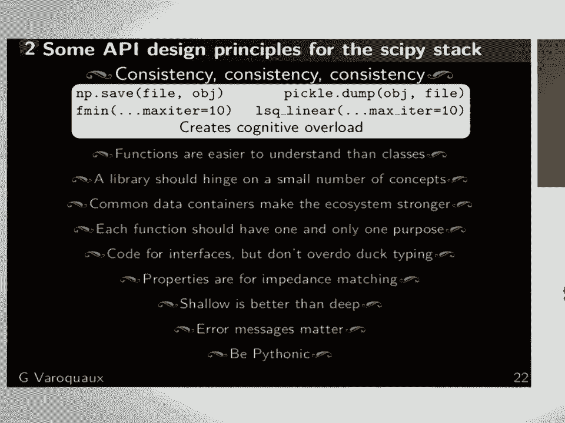

如果我们让每一个计算步骤都可重复，好的科学就会出现，对吗？最近有一项研究评估了心理科学的可重复性。这项研究的标题发表在《科学》杂志上，他们发现只有36%的已发表效应是可重复的。只有36%。如果你看看问题所在，首要问题是统计挑战。分析数据的方法有很多种。如果你用所有可能的方式分析数据，然后选择你最喜欢的结论，你将无法控制你的错误率。这是基本的统计学知识。当你认为自己是对的时候，很容易忘记这一点。我总是认为我是对的。所以我会分析数据，并在某个时刻确认我是对的。

再加上学术界存在相当薄弱的激励。你必须发表才能生存。即使是最诚实的人也会被此愚弄，我也曾被愚弄过。最终的问题是：在已发表的文献中，你拥有的错误阳性（错误发现）比你想象的要多，这只是因为存在选择偏差。这是“赢家诅咒”的一个实例。如果你看看这里的问题，很少是计算可重复性问题。我们喜欢挑出少数计算可重复性问题的案例，但科学的问题不仅仅是计算问题。我想这并不令你惊讶。

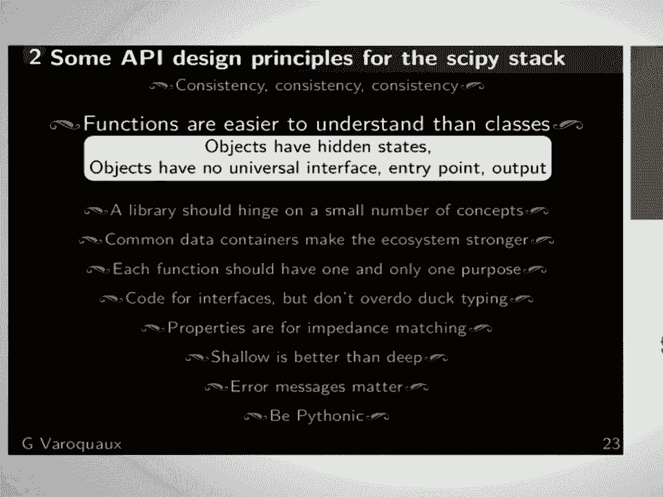

因此，我认为“可重复性”是一个用词不当，或者可能只是一个太狭隘的概念。对于计算科学而言，重要的是操作是**可验证的**，以建立信任，并且理想情况下是**可重用的**。

---

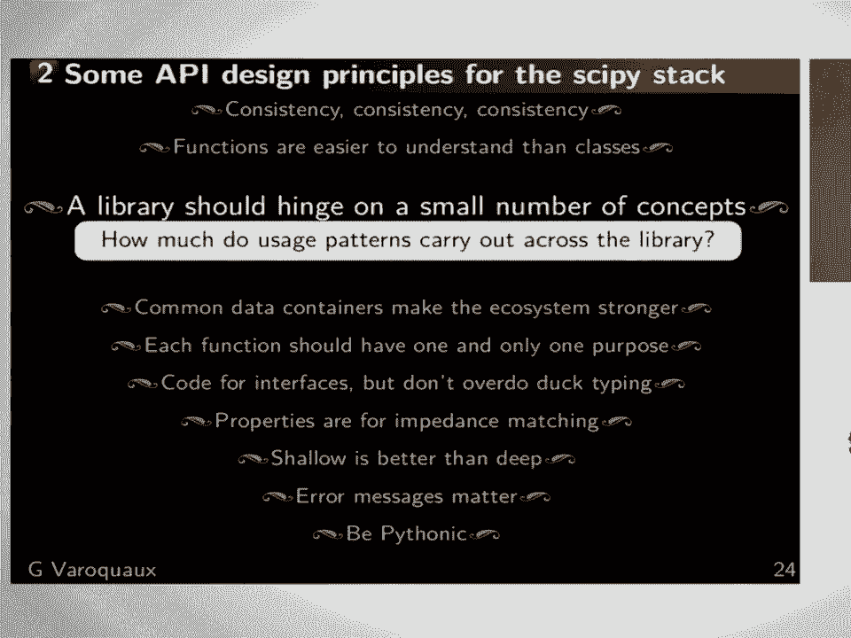

### 提升科学研究的核心：正确的工具

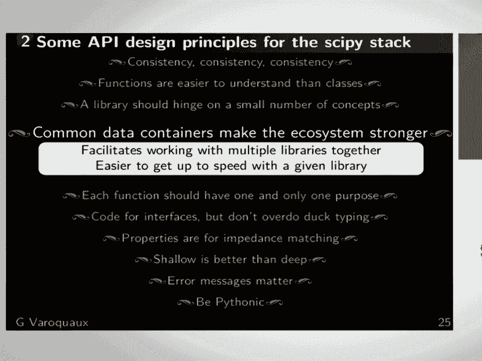

话虽如此，如果我们想改进研究，改进科学，最好的方法是使用正确的工具，无论是正确的软件工具还是正确的概念工具，并让人们使用正确的工具。顺便说一句，这是一个难题。

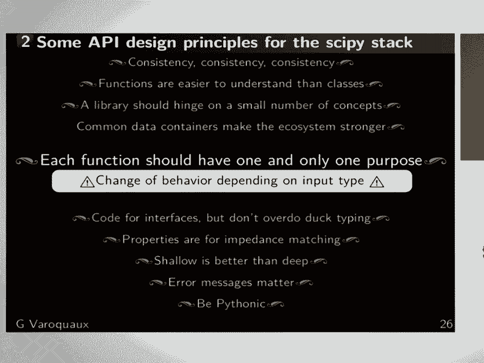

原因在于，研究环境从社会学和技术角度来看都非常复杂。人们面临的实际障碍是**认知负荷**，因为研究人员需要结合来自许多不同领域的概念。如果在此基础上，他们还需要结合所有不同的工具，比如shell脚本、MATLAB、Python、Stan、BUGS，你可能不了解所有这些工具，我也不了解。所以，如果你身处这个领域，试图结合所有这些复杂的工具和相应的复杂理论概念，那么你正确完成的机会很小，找到适合工作的正确工具的机会就更小了。

---

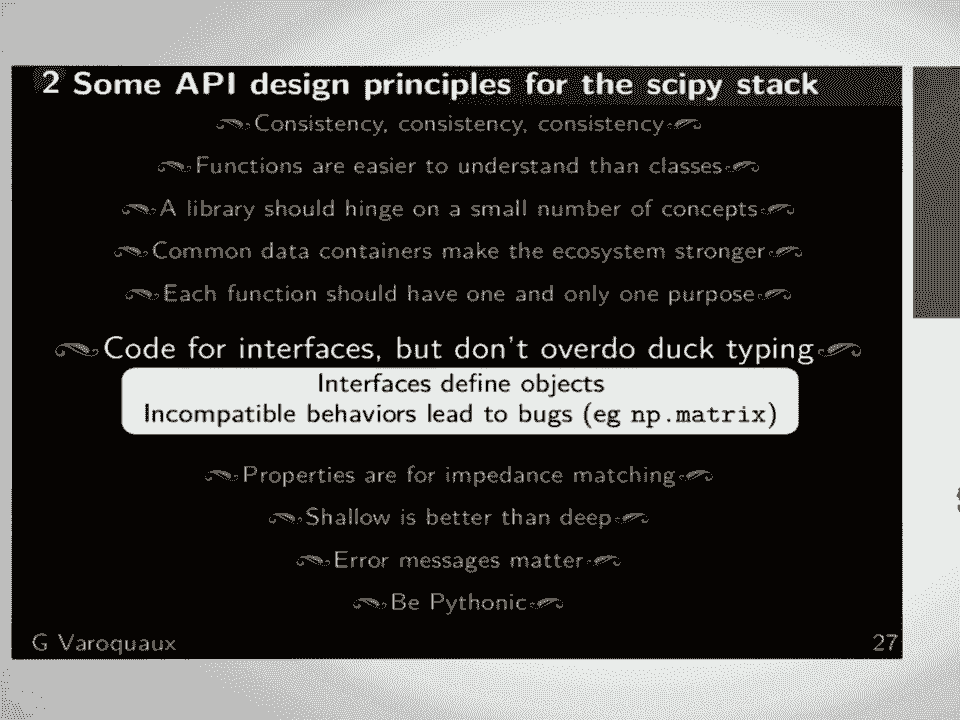

### 小结：科学家视角下的编程

总结一下，作为科学家进行编程，我认为最终的代码应该以某种方式**可审计**（这很难），并且理想情况下**可重用**（这也很难）。很明显，交互式计算与自动化之间存在张力，我认为主要的敌人是**认知超载**。

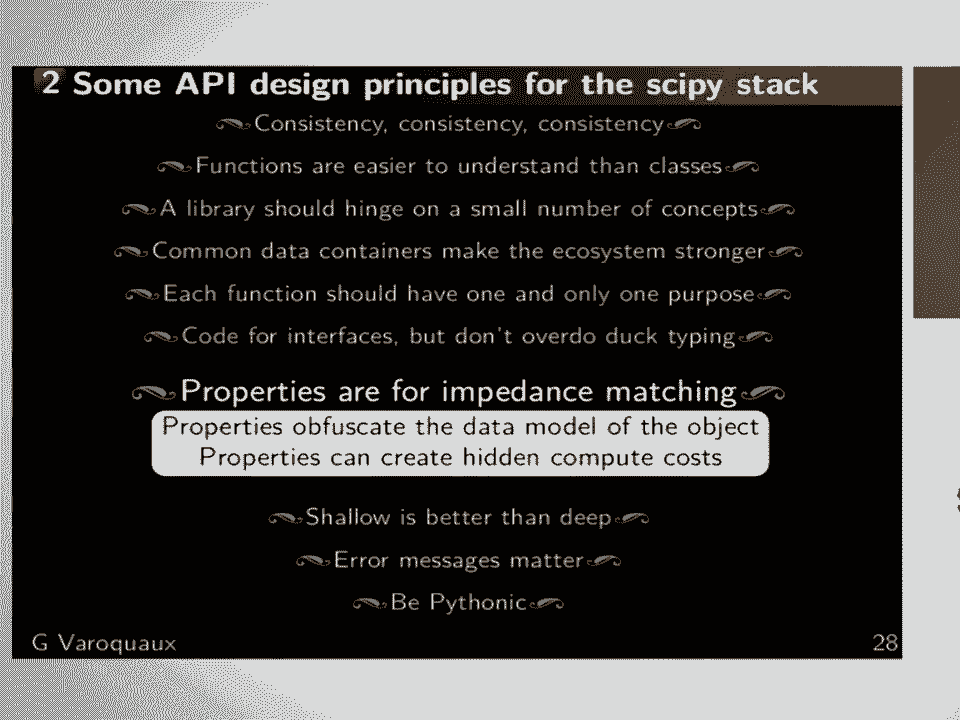

这与工业界有很大不同吗？我并不这么认为。硅谷有一种态度：“嘿，如果它有效，你并不真的需要知道它是如何工作的。重要的是它解决了问题。”这在一定程度上是对的，但并非适用于所有应用领域。而且这也正在损害硅谷，因为对硅谷的怨恨越来越多。我不想过多讨论这个，但也许选择定律与此有关。

工业界有而学术界没有的一点是，当遇到问题时，一些行业可以投入更多资金来解决。所以他们可以掩盖一些问题，但问题仍然存在。

---

## 科学家的迭代工作流程

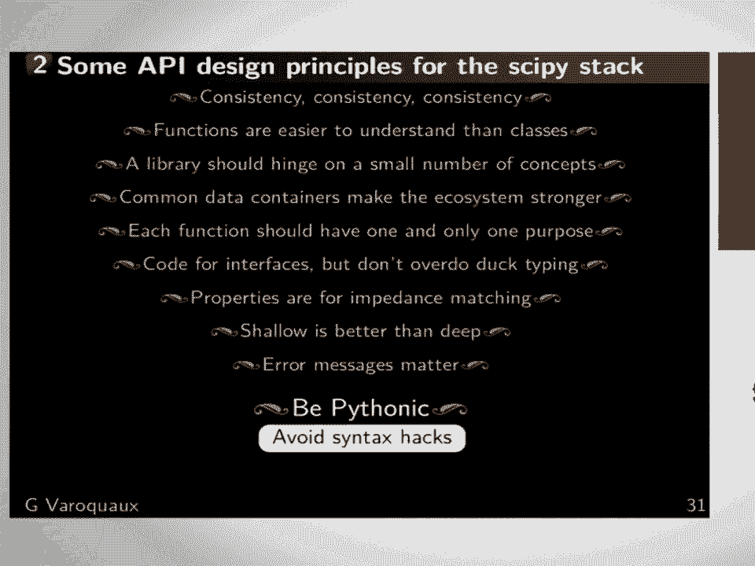

为了让你了解我作为使用代码的科学家是如何思考工作的，我有一个非常迭代的工作方式。以下是我依次应用的步骤列表：

以下是科学家迭代工作流程的关键步骤：

1.  **使用好的编辑器和代码检查工具**：为什么很少人这么做？如果你在一个要运行24小时的脚本中打错字，而错误发生在保存结果时，你就损失了24小时的计算时间。在编辑器中添加代码检查工具成本极低，所以我认为你应该这么做。
2.  **遵循编码规范**：你需要养成习惯，但我尽量不再用单个字母（如x和y）命名变量。如果你用scikit-learn，你可能注意到我们用了很多x和y，这是历史原因。抱歉。
3.  **使用版本控制**：成本相当低。你应该看看我科学代码仓库的提交信息，我想99%都叫“iter”。但这比没有版本控制好。
4.  **进行代码审查**：如果你想扩大规模，在实验室层面构建好的工具或好的科学，那么阅读彼此的代码非常重要。代码审查，这是众所周知的。
5.  **进行单元测试**：再进一步，单元测试。因为确实，正如Spring所说，未经测试的东西要么今天坏，要么明天坏。这是事实。
6.  **打包分享**：如果你想更进一步分享你的结果，那么你可以制作一个包含依赖控制和编译等内容的包。

这里的成本是递增的。**避免过早的软件工程**非常重要。正如Katie在昨天的演讲中提到的，我不认为一切都应该被重复。我想衡量我的愚蠢想法与好想法的比例，但我不认为这是个好比例。你不想重复我的愚蠢想法。所以这是在过度工程和工程不足之间的权衡。

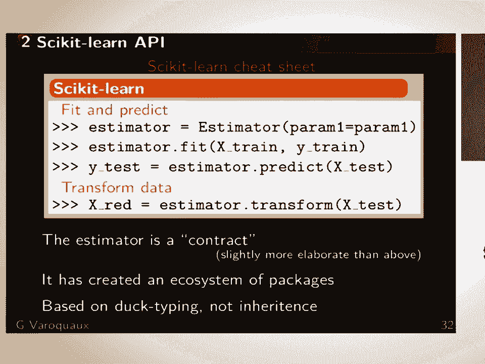

---

## 从探索到巩固：Python的优势

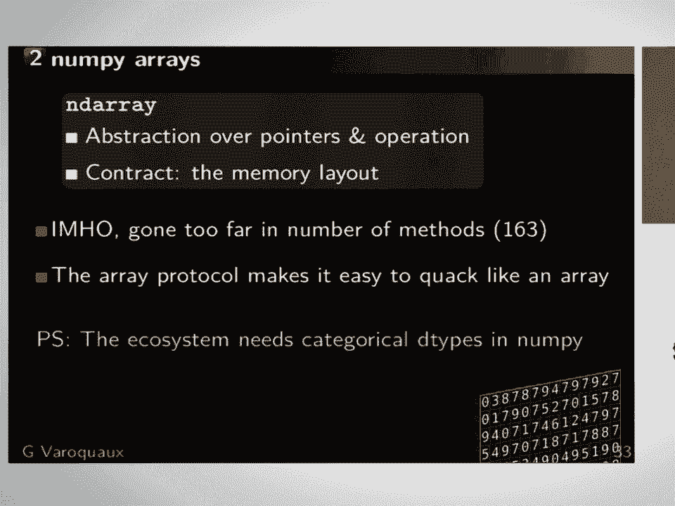

第四个目标是产生洞察，或者如果你致力于创新，则是进入新的领域。实验对于产生洞察和开发新想法的概念验证非常有用。随着这些想法变得清晰，你需要进行巩固。好消息是Python在这方面非常出色。Python允许你编写非常混乱的代码，也可以编写非常清晰和健壮的代码。重要的是你需要逐步推进。

我说“逐步”是因为我需要数年时间才能知道我的想法是好是坏。真的需要。所以我基本上做的是让事情越来越稳固。随着它们变得稳固，我更好地理解它们。随着我更好地理解，我知道我是想抛弃它们，还是把它们变成一个包。

当一切顺利，这些想法最终变得稳固时——这大约只占我们尝试事情的百分之一——那么我认为我们需要分享它们。我们需要让它们可重用，并把它们变成一个库。

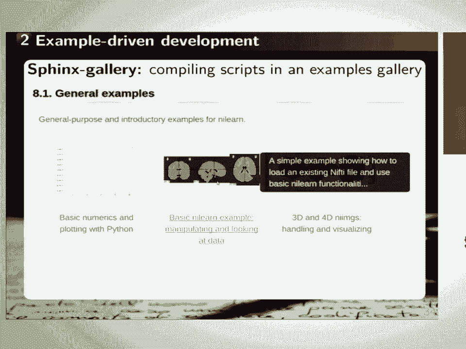

---

## 构建科学软件库 🛠️

这时，我就戴上了我的另一顶帽子：软件开发者的帽子，我关心的是为科学构建软件。

库非常重要，因为它们使我们能够扩展。首先，**抽象降低了认知负荷**，这至关重要；其次，它们**实现了代码重用**。所以我可以使用你写的、而我不够聪明去理解的算法，这至关重要。

我参与过的库的例子包括 **`scikit-learn`**。我们的目标是让机器学习研究对不理解模型和算法的人可用。我认为我们部分成功了。另一个我参与过的、较小的库是 **`Nilearn`**，我们的目标是让人们易于理解如何用机器学习解决新的成像问题或脑成像问题。

`scikit-learn`面临的挑战是机器学习模型的空间巨大且极其多样化。另一个挑战是编码概念是简单的，而统计和机器学习概念是困难的。在`Nilearn`中，我们面临一个非常具体且有趣的挑战：我的目标是让技术接受度低的用户能够上手。这对我来说是一个强烈的目标，因为我认为如果我想对脑科学产生影响，我们需要实现这个目标。这非常重要。

---

## 软件库的设计原则

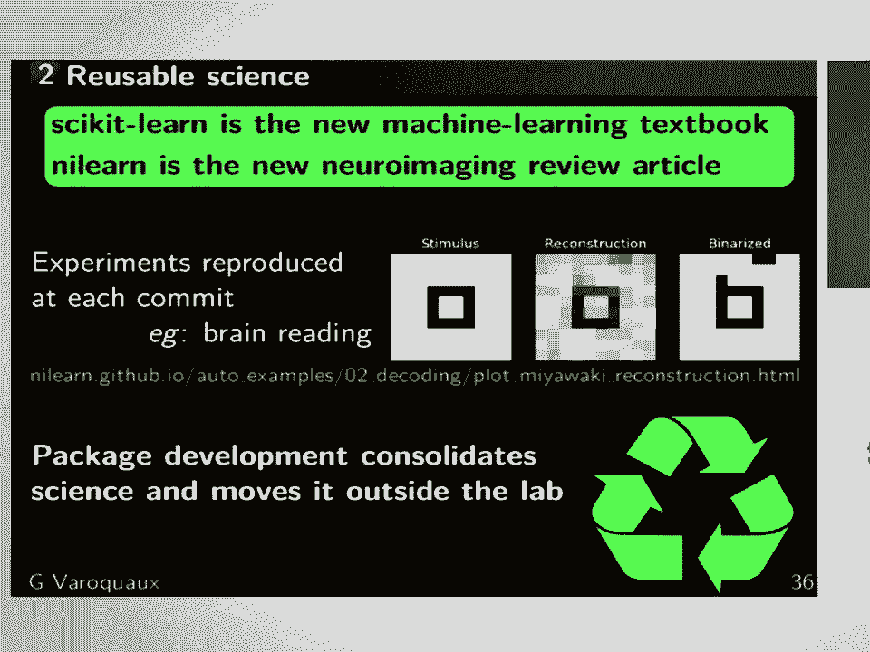

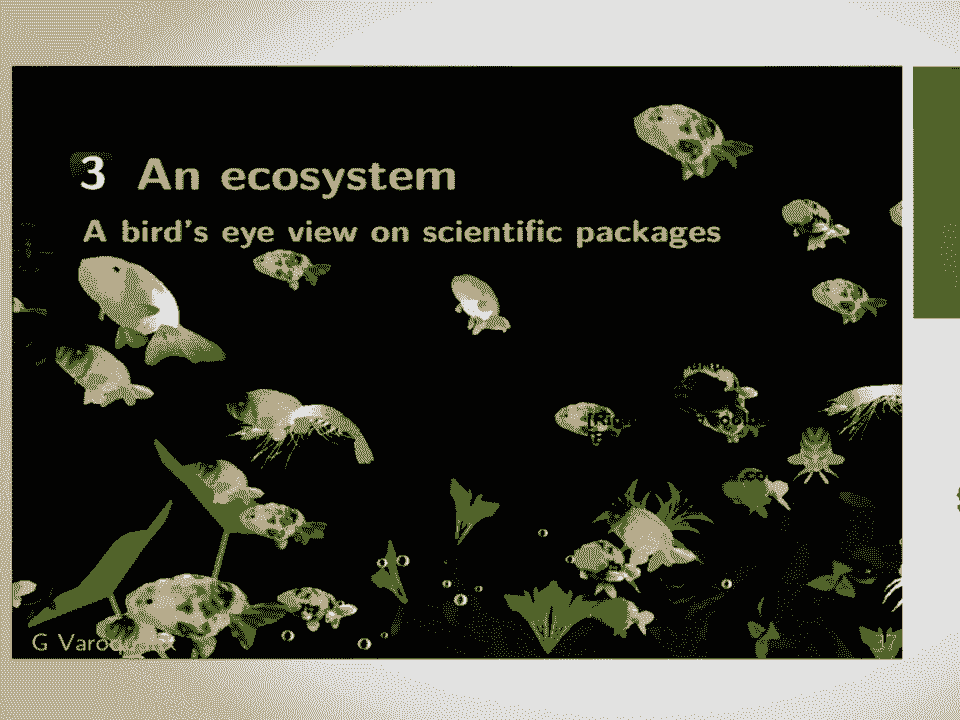

因此，我们需要设计能够**降低认知开销**的工具。这确实是一个设计问题。我所说的“设计”是指工业设计，即设计汽车、自行车、叉子。有一个叫做“工业设计”的专业领域，这些人基本上坐下来关心日常工具的外观。

你有没有意识到苹果公司的第四号人物乔纳森·艾夫就是一个工业设计师？他在去苹果之前设计微波炉或椅子。所以苹果非常清楚地理解了工业设计的重要性，你在使用产品时能感受到。我认为实际上SciPy社区也很好地理解了这一点。所以我想说，SciPy的代码与众不同。

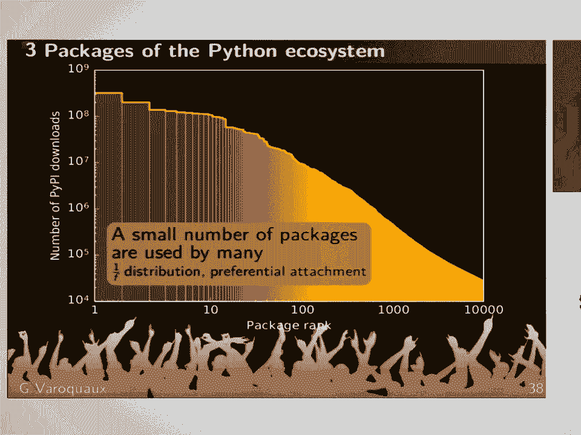

设计是一个难题，一个非常难的难题。因此，我想为SciPy技术栈提出一些设计原则。这是我在尝试玩“Python之禅”的把戏，所以很可能会失败。但无论如何，我要试一试。

---

### 设计原则详解

以下是我总结的为科学软件库设计的一些关键原则：

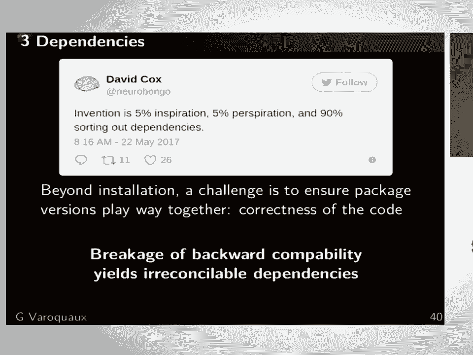

1.  **一致性**：我学到的第一件事，实际上是和Prabhu一起学到的，就是一致性、一致性、一致性。我记得有一个拉取请求，我写了一个两个单词的参数，中间没有下划线。Prabhu说：“这与我们的编码指南不一致。”我当时想，这家伙太注重细节了。但这真的很重要。我举例子不是为了抨击其他库。当我遇到问题时，不是为了抨击库。我在scikit-learn中提不出这些问题，因为我们已经解决了它们并全部移除了。但如果你看SciPy，例如，一些SciPy优化函数使用`maxiter`（没有下划线），而另一些使用`max_iter`（有一个下划线）。我基本上需要把这个记在脑子里，或者每次都要查。我的记忆力很差，所以这行不通。这就是认知超载的一个例子。

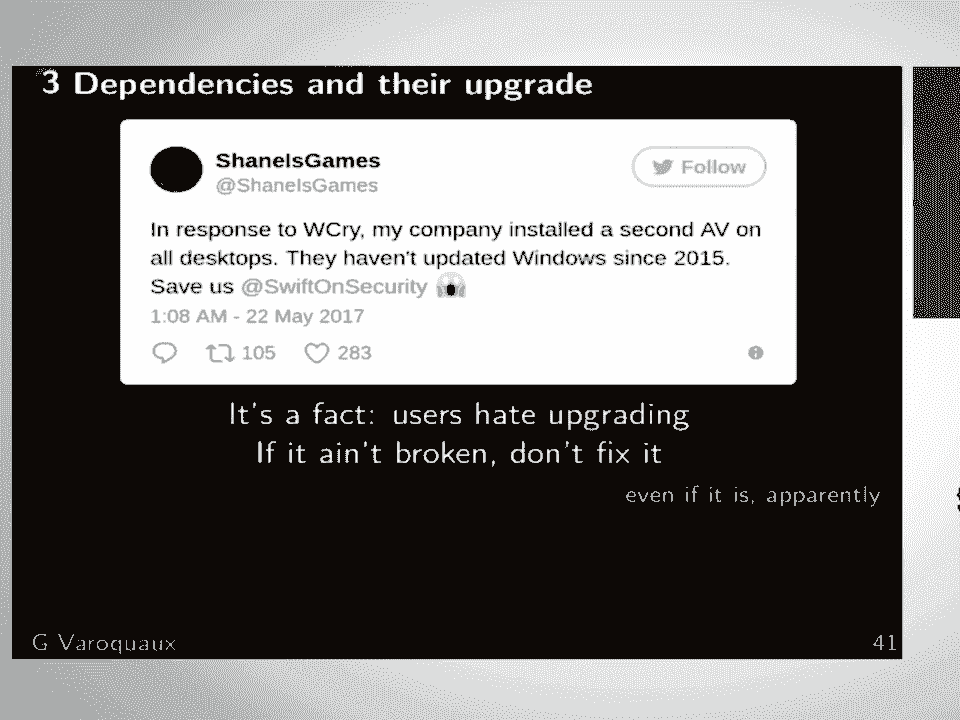

2.  **函数优于类**：对我来说非常重要的一点是，函数比类更容易理解。对象有隐藏状态。在某些情况下这非常有用。如果你在做图形用户界面工具包，你从设计上就有隐藏状态。但这种隐藏状态是用户需要记在心里的。另一件事是对象没有通用接口。它们没有清晰的入口点和清晰的输出。所以函数实际上比对象可重用得多。如果我对一个软件工程人员说这个，那个人会立即告诉我，我不知道如何进行面向对象编程，因为任何知道如何正确进行面向对象编程的人都知道对象比函数更可重用。所以我声称我知道，因为我和Prabhura Mshandran一起工作过。所以我确实知道如何进行面向对象编程。问题是，如果你试图跨越库的边界，对象很难穿越，因为对象带有它们自己的一套约定和概念。

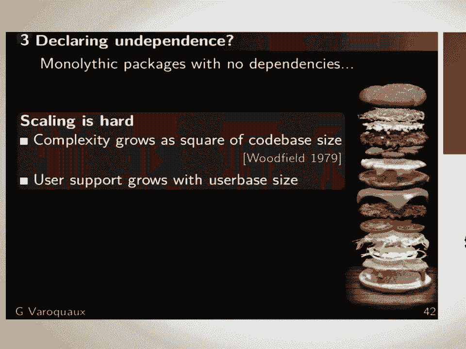

3.  **围绕少量核心概念构建**：相应地，一个库应该只依赖于少数几个概念。我的意思是，如果你理解了如何使用库的一端，你能将这种理解转移到库的另一端吗？这是一个困难的设计问题。我不认为如果我开始一个新库，第一次就能做对。我需要迭代。问题是我需要找出哪些是领域概念，那些少数几个非常有用的、通用的领域概念，我需要依赖它们并围绕它们展开。

4.  **使用通用的数据容器**：我想强调，**通用的数据容器**使生态系统更强大。所以，如果一个函数接受一个`Earth-factory`模型对象作为输入，而你试图使用这个东西，你根本不知道`Earth-factory`模型是什么。也许它不过是一个字典，映射着地球数据。如果它被写成“这是一个字典，输入是这个，输出是那个”，或者一个pandas DataFrame之类的，但如果一个库定义了自己的数据容器，切换到使用这个库的成本就很高。

5.  **单一职责原则**：每个函数应该**只有一个且仅有一个目的**。最危险的事情是当行为根据输入类型而改变时。对我来说，最明显的例子是`git checkout`。根据传给`git checkout`的是分支名还是文件名，它的行为截然不同，这造成了非常令人惊讶的行为。

6.  **为接口编程**：为接口编程非常重要。我的意思是，你编码时期望对象暴露一组属性和方法，这定义了它们的接口，这就是你在库内或其他库之间传递和使用对象的方式。话虽如此，**不要过度使用鸭子类型**也很重要。一个很好的例子是NumPy矩阵。如果你编写一个函数，期望得到数组，并且该函数对数组进行乘法运算，而有人向这个函数传入一个矩阵，它可能以某种定义“工作”。基本上你会得到错误的答案。所以我认为这是一个很好的例子，说明在拥有接口但背后行为不同这方面走得太远了。

7.  **谨慎使用属性**：我认为