# 28：SciSheets - 结合编程能力与电子表格的简洁性 📊➡️🐍

在本节课中，我们将学习一个名为 SciSheets 的创新项目。该项目旨在为电子表格用户提供编程的强大功能，同时保持电子表格的直观和易用性。我们将探讨传统电子表格的局限性、SciSheets 的核心特性，以及它如何通过使用 Python 作为公式语言来解决表达性、复用性和性能等问题。

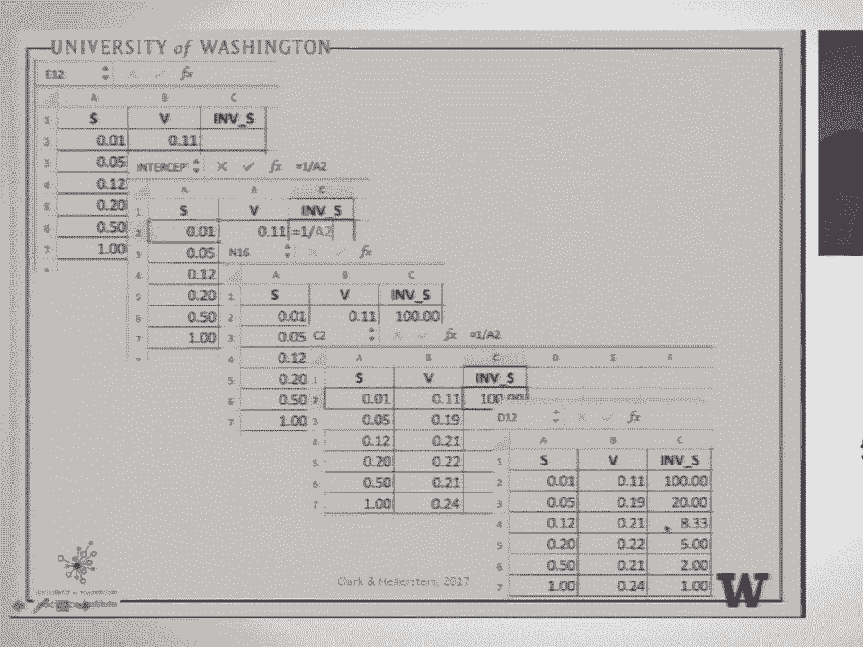

## 传统电子表格的现状与挑战

上一节我们介绍了课程的主题。本节中，我们来看看传统电子表格的运作方式及其面临的挑战。

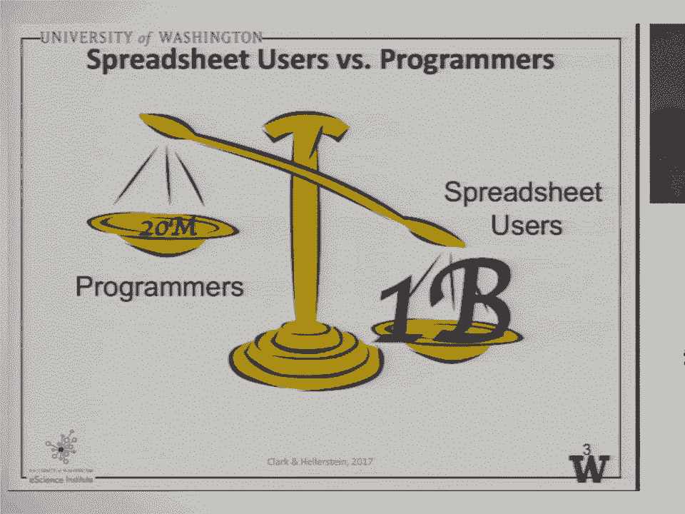

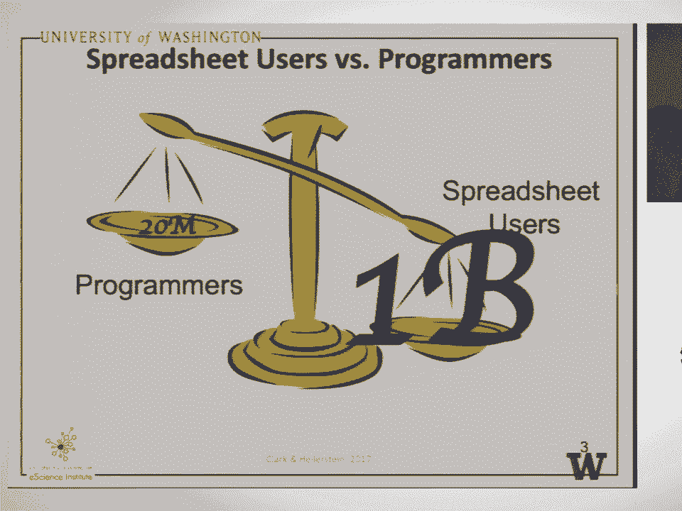

电子表格非常普遍，通常包含带列标题的数据行。当需要输入公式时，用户会使用类似 Excel 的坐标系统，例如 `A2` 代表 A 列第 2 行。一个典型的公式可能是 `=B2/A2`，其优点是可以立即看到计算结果。

若要进行迭代计算，用户通常会使用复制和粘贴功能。然而，查看这些公式背后的实际代码时，会发现它类似于汇编语言，可读性较差。

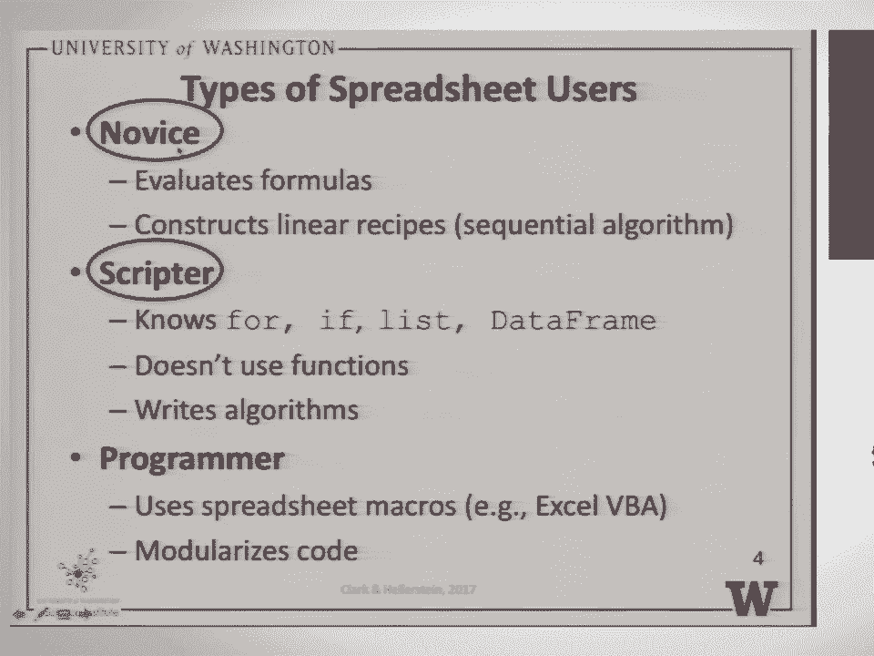

以下是传统电子表格如此流行的几个原因：
*   **专注于计算而非编程**：用户无需担心数据依赖关系，系统会自动处理。
*   **无需流程控制**：迭代通过复制粘贴完成，无需编写 `for` 循环。
*   **简化数据结构**：避免了编程中处理复杂数据结构的麻烦。

编程的历史悠久，而电子表格相对较新。据统计，全球约有 2000 万专业程序员，但使用公式的电子表格用户却高达 10 亿。这表明电子表格是全球更流行的计算环境。

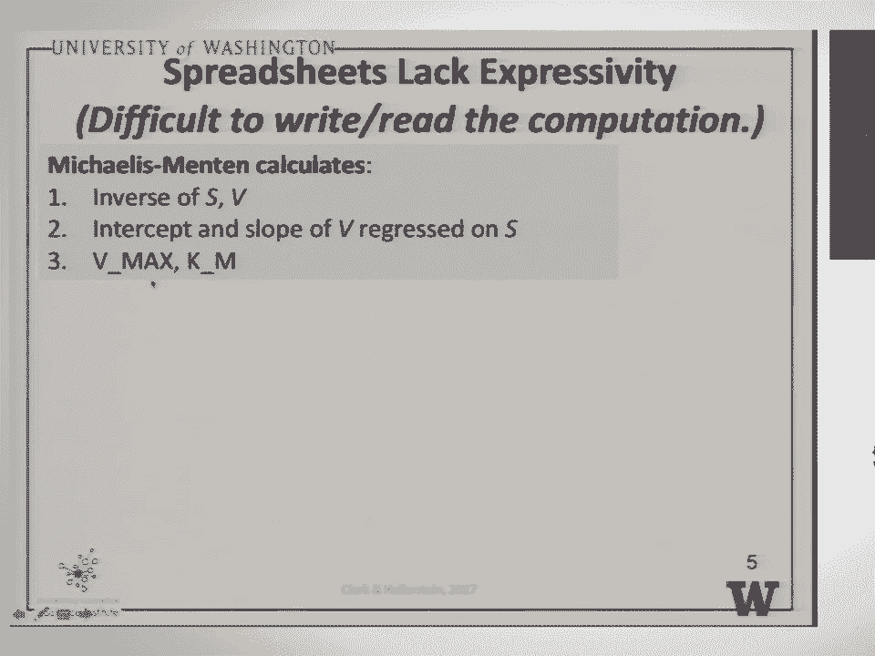

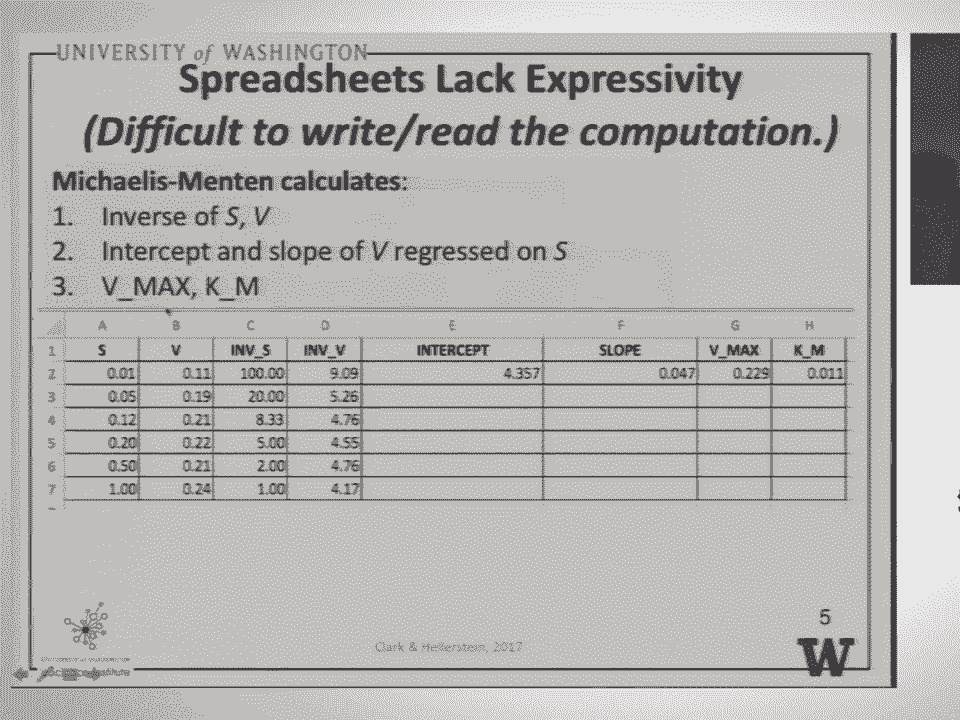

## SciSheets 的目标用户与设计理念

上一节我们了解了电子表格的普及性。本节中，我们来分析 SciSheets 所针对的不同用户群体及其需求。

在规划功能时，我们将用户分为三类：
1.  **计算新手**：他们希望评估公式，会使用计算器，但电子表格更好用。他们构建的是线性的计算“食谱”。
2.  **脚本编写者**：他们可以在 MATLAB 或 R 控制台中交互式工作，了解 `for` 循环和 `if` 语句，但可能不保存文件，或保存为一个大文件。他们通常不习惯使用函数。
3.  **程序员**：他们可以使用宏语言，如 Visual Basic 或 Google Sheets 中的 App Script。

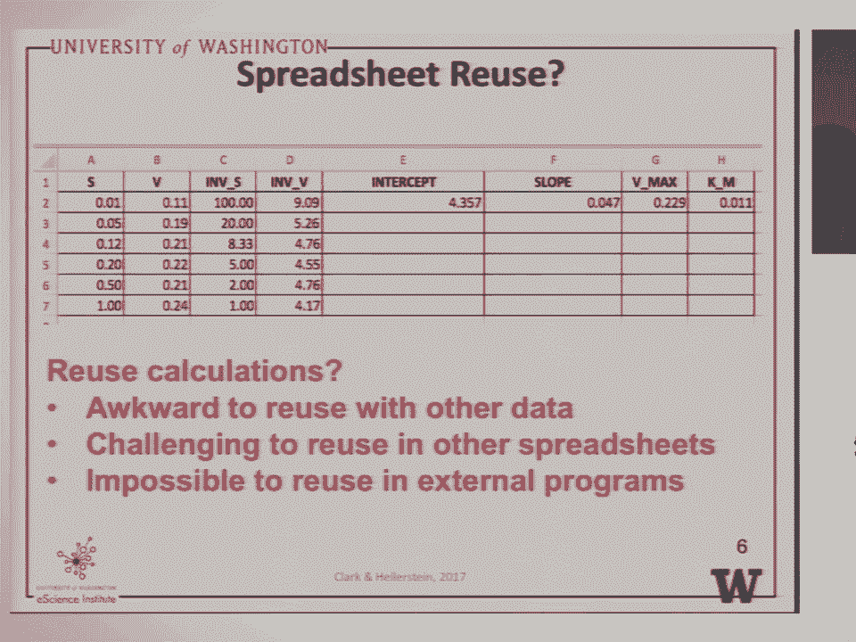

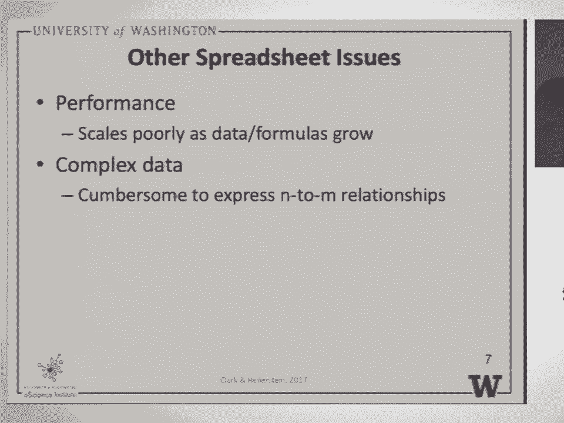

SciSheets 主要关注前两类用户。其设计目标是：让使用 SciSheets 进行传统电子表格操作同样简单，同时提供更多功能以解决诸多问题；并且帮助用户从新手进阶为脚本编写者或程序员。

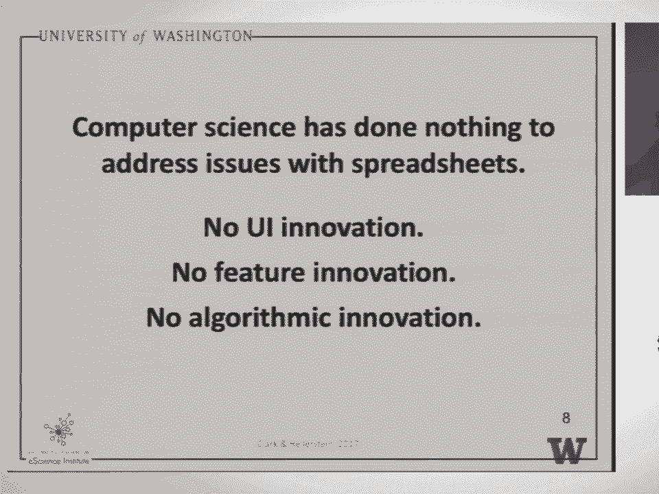

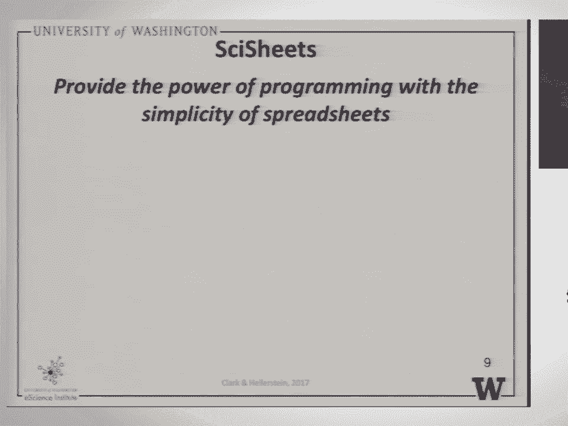

## 传统电子表格的核心问题

上一节我们明确了目标用户。本节中，我们来深入探讨 SciSheets 旨在解决的传统电子表格的几个核心问题。

第一个问题是**表达性**，即算法或计算的编写与阅读能力。例如，生物化学中常见的米氏方程参数计算，涉及一系列步骤。在 Excel 中实现时，虽然能看到 `1/S`、`1/V` 等列，但底层的公式网格非常难以解读。用户只能从列的位置推断计算步骤，这很危险，因为电子表格中的数据依赖关系并非由位置隐式决定。

第二个关键问题是**复用性**，这是软件的基础。用户投入时间创建的计算，希望能在其他场景中复用。例如，将单个数据集的计算扩展到多个数据集。传统做法是向列中添加值、插入或删除行，这非常笨拙。此外，很难将一个电子表格的计算嵌入到另一个计算中，或者让使用 Python 的软件工程师直接复用电子表格中的计算逻辑。

除了表达性和复用性，还存在性能和复杂数据处理等问题。但更重要的是，计算机科学领域长期以来忽视了为进行计算的广大用户群体提供创新工具。

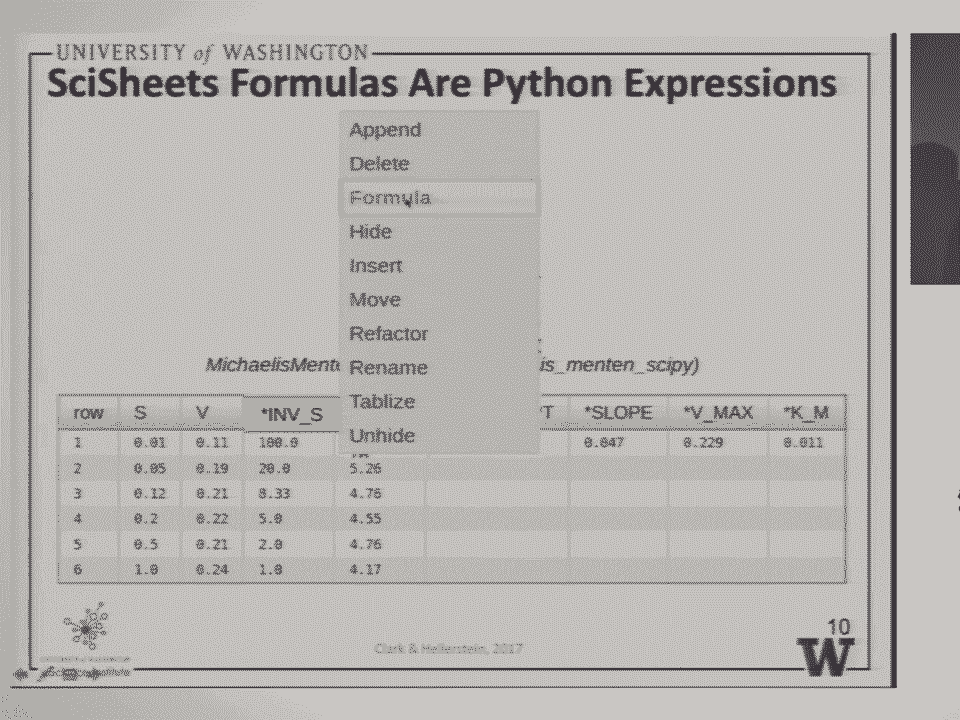

## SciSheets 的解决方案与核心特性

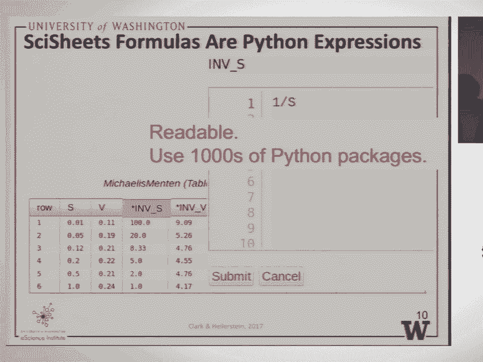

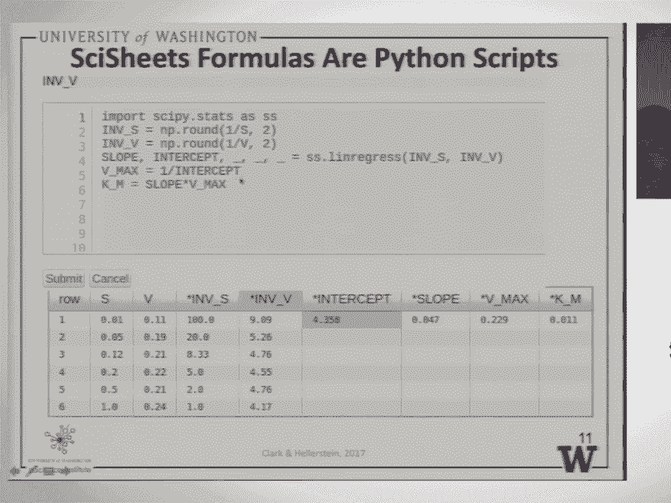

上一节我们指出了传统电子表格的痛点。本节中，我们来看看 SciSheets 如何通过一系列特性来解决这些问题。

SciSheets 的标语是“**编程的能力，电子表格的简洁**”。它专注于以下几个核心特性来应对表达性、复用性、性能和复杂数据等挑战：

1.  **使用 Python 作为公式语言**：取代晦涩的电子表格公式，允许使用任何 Python 表达式或语句，包括 `import` 和 `eval`。
2.  **将电子表格导出为 Python 函数**：可以将整个电子表格计算逻辑导出为一个 Python 模块中的函数。这带来了双重好处：程序员可以直接使用（因为它是 Python），并且在其他计算中可以方便地复用。
3.  **支持复杂数据结构**：通过允许**子表**（即列本身也可以是表）来提供更丰富的数据结构，例如用于表达多对多关系。

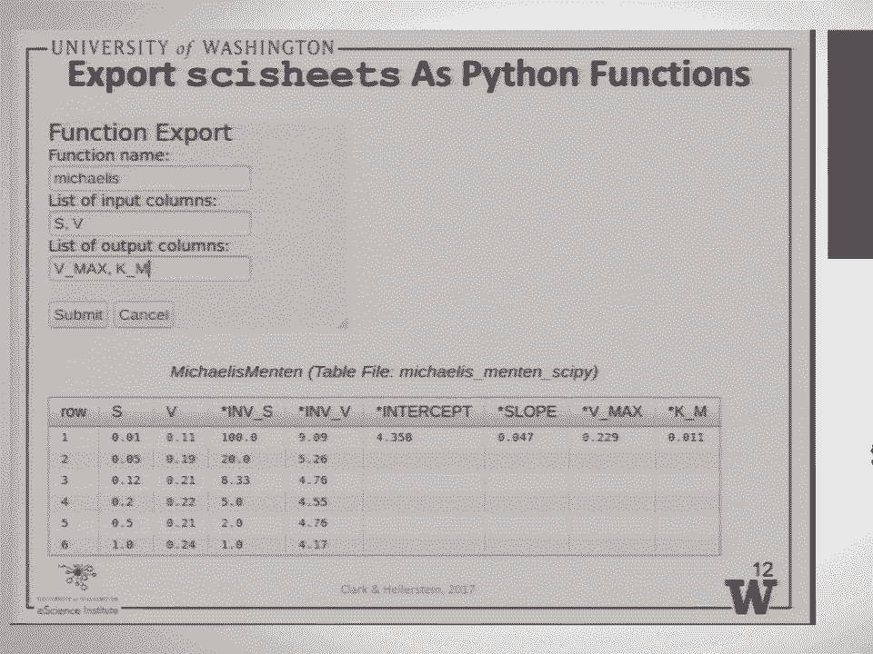

## 特性详解：Python 公式与代码生成

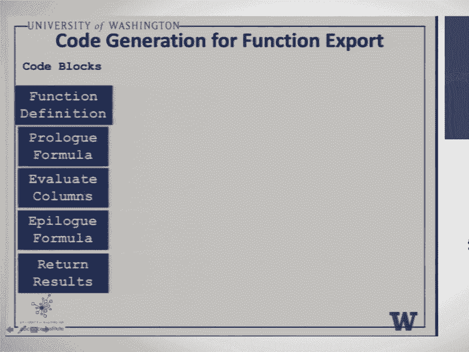

上一节我们概述了 SciSheets 的核心特性。本节中，我们将详细探讨前两个特性：Python 公式和导出功能。

SciSheets 的界面类似传统电子表格，标有星号的单元格表示背后有公式。公式仅允许在列中定义，这限制了结构的随意性，但带来了巨大优势：用户能清楚地知道代码在哪里。

当用户点击一个公式列时，会看到弹出的公式编辑器。其中的公式看起来就像 Python 表达式，列名在公式中作为 Python 变量使用。实际上，这些变量是 **NumPy 数组**。这使得用户能够以自然的方式进行向量化操作，并利用所有 NumPy 功能和各种 Python 包，极大地丰富了计算能力。

公式不仅可以是一个简单表达式，还可以是完整的脚本。例如，一个计算 `1/V` 的脚本，除了计算该列的值，还可以为其他列（如 `slope` 和 `intercept`）赋值，并导入 `SciPy` 包进行线性回归。这在一个地方集中体现了完整的计算“食谱”，大大提高了可读性和表达性。

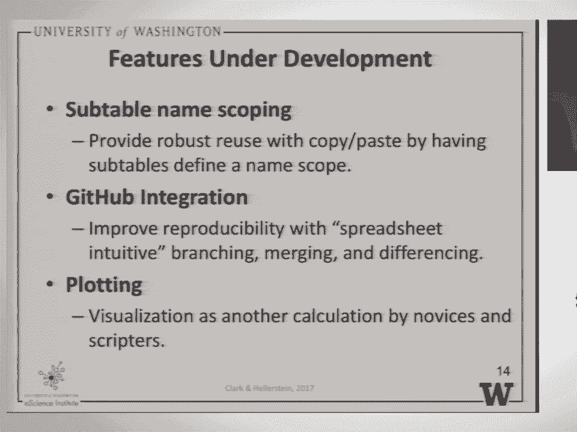

接下来是导出功能。用户可以将一个电子表格（例如，输入为 `S` 和 `V`，输出为 `Vmax` 和 `Km`）导出为一个 Python 函数。通过点击表头并指定函数名、输入和输出，系统会在后台生成包含该函数的模块，甚至同时生成一个测试模块，因为系统已经拥有测试所需的输入输出用例。

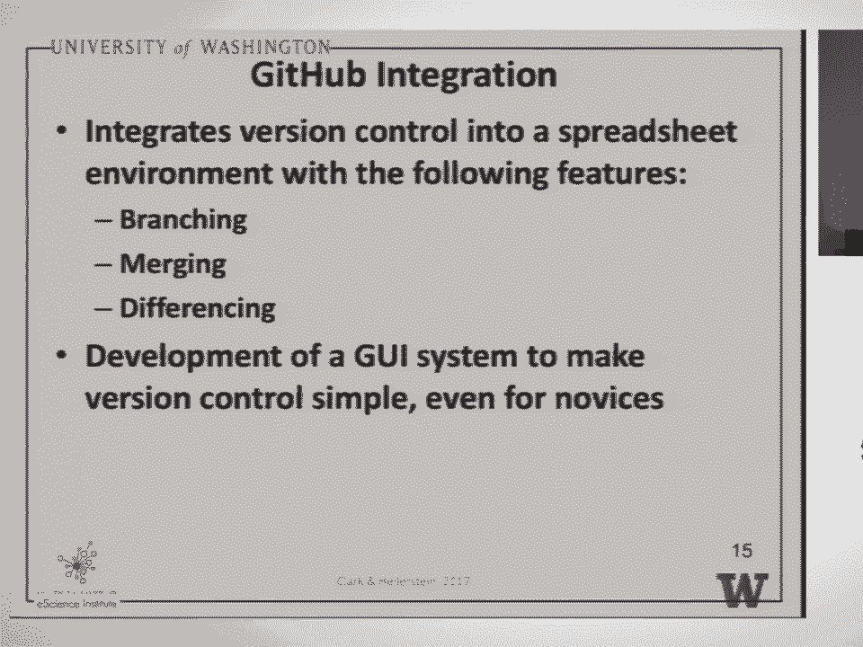

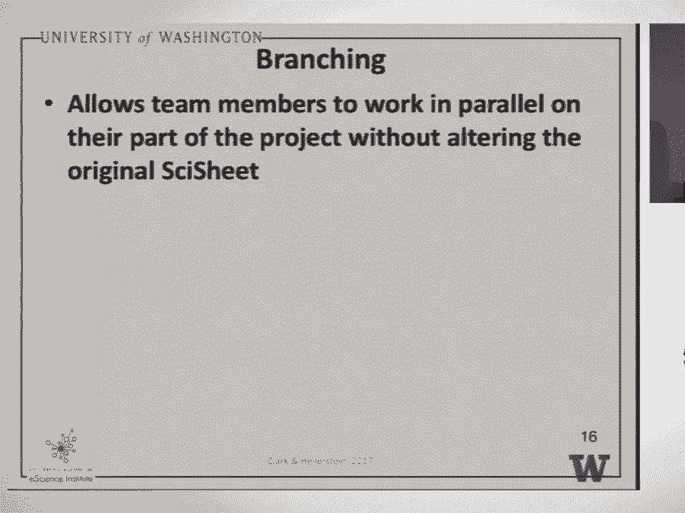

代码生成的一个关键挑战是确定数据依赖关系的顺序。由于公式中可能使用 `eval`，无法通过解析树预先确定依赖关系。SciSheets 的解决方案是采用迭代求值：遍历所有包含公式的列，尝试对每列的代码进行求值。如果因依赖变量未赋值而失败，则记录异常并继续。在最坏情况下，每轮迭代只能成功求值一列，但经过最多 N 轮（N 为公式列数）后，所有列都能被成功求值。如果某轮迭代中所有列的值都不再变化，则表明计算已完成。

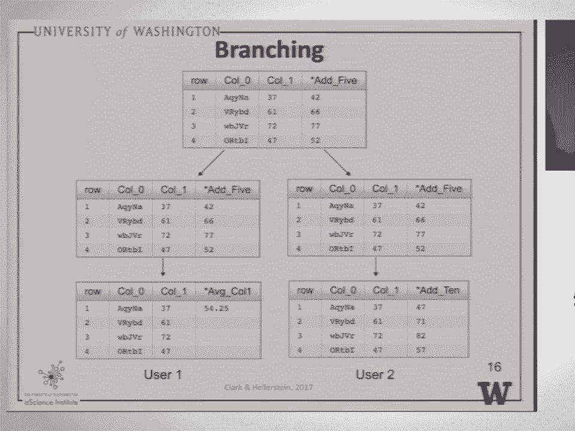

## 未来发展方向

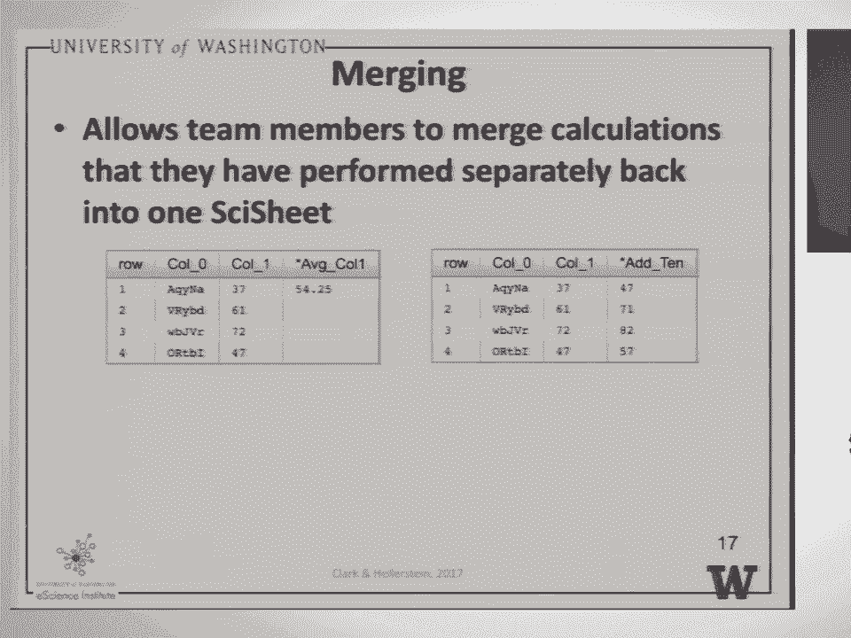

上一节我们深入了解了 SciSheets 的现有核心功能。本节中，我们来看看项目正在规划或开发中的一些未来特性。

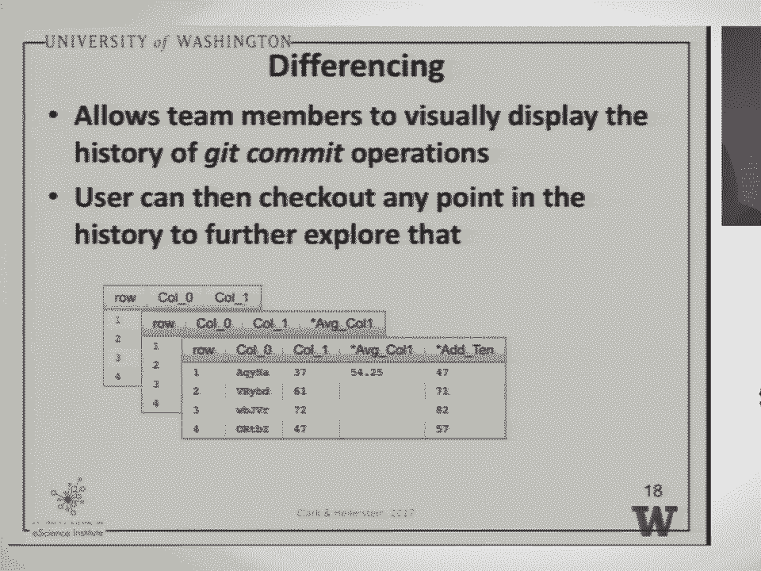

首先，是**子表命名作用域**。这将允许用户更新一个子表中的公式时，其他同名子表中的对应公式自动同步更新，从而消除大量的复制粘贴操作。

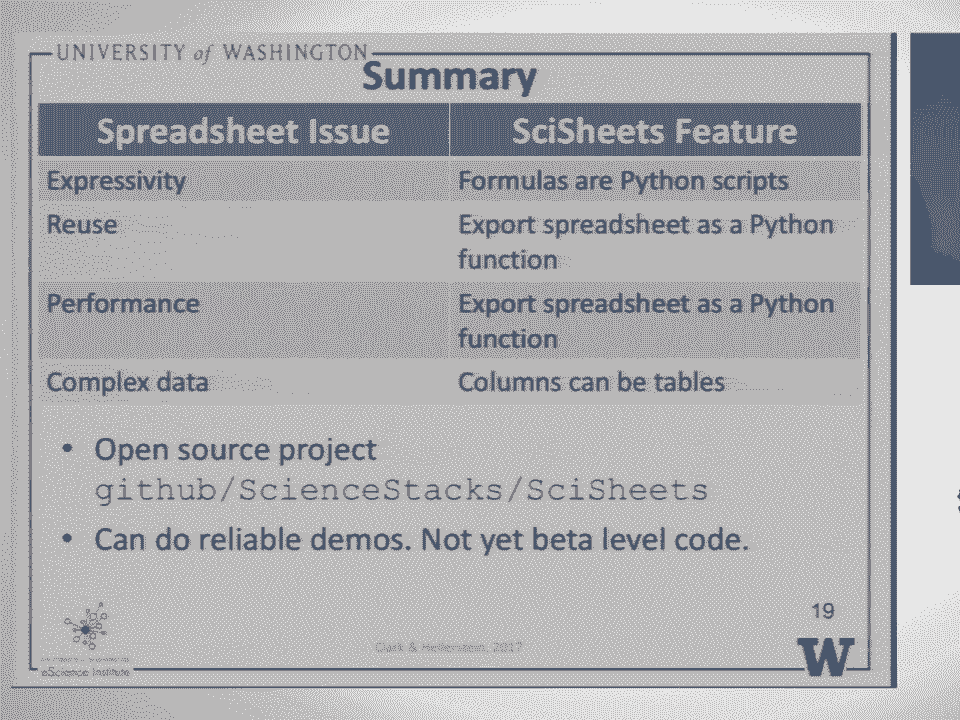

其次，是开发一种**直观的电子表格版本控制方法**。目标是让不熟悉编程的用户也能在不知不觉中使用版本控制功能。

第三，是为 SciSheets **添加可视化功能**。目前可以处理数值列，但无法直接可视化数据。计划整合 Python 中丰富的可视化工具箱。

关于版本控制，一个重要的方向是**与 GitHub 集成**，并使其对电子表格用户直观易懂。这主要涉及三个基本操作：分支、合并和差异比较。

*   **分支**：允许多个用户基于初始数据并行工作或进行探索性修改，而不会破坏原始表格的列和公式。
*   **合并**：将分支合并回主分支。当出现合并冲突（例如，不同用户对同一计算结果的列命名不同）时，系统可以让用户交互式地选择他们想要的列或名称。
*   **历史与检出**：在电子表格界面中可视化 Git 提交历史。例如，新添加的列可以高亮为绿色（GitHub 用于表示新增的颜色），被删除的列可以显示为红色，使用户能直观地看到更改。

## 总结与项目现状

在本节课中，我们一起学习了 SciSheets 项目，它旨在弥合电子表格的易用性与编程的强大功能之间的鸿沟。

我们回顾了传统电子表格在表达性和复用性上的局限，探讨了 SciSheets 如何通过引入 **Python 作为公式语言**、支持将计算导出为**可复用的 Python 函数**、以及采用**基于子表的复杂数据结构**来解决这些问题。我们还展望了其在版本控制和可视化方面的未来发展方向。

目前，SciSheets 是一个基于 Web 的系统，使用 Django 和 Python 作为后端，浏览器作为前端。项目代码已在 GitHub 上开源，正处于积极开发阶段，正在评估部署选项（如集成到 Jupyter 环境中），并热忱欢迎更多的反馈和贡献者加入。