# 29：Spyder 插件生态系统 🚀

在本节课中，我们将学习 Spyder 集成开发环境的插件生态系统。我们将介绍四个由社区开发的第三方插件，它们为 Spyder 增添了新颖且强大的功能，包括集成 Jupyter Notebook、编写动态报告、运行系统终端以及执行单元测试。

## Spyder 简介

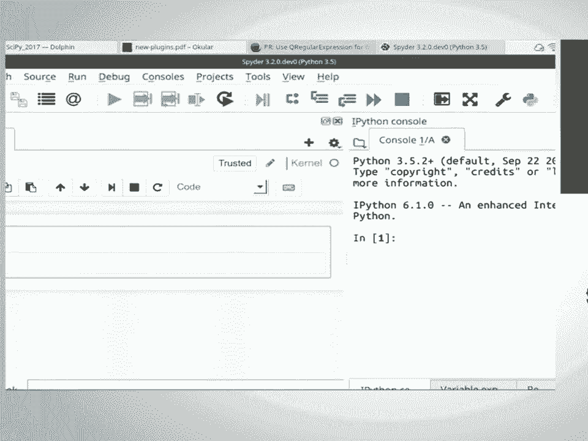

在深入了解插件之前，我们先简要回顾一下 Spyder 是什么。Spyder 是一个桌面应用程序，其界面设计类似于 MATLAB。它主要包含以下几个核心组件：

*   **编辑器**：用于在左侧编写代码。
*   **控制台**：用于在右侧运行代码。
*   **变量资源管理器**：用于查看和管理工作空间中的变量。
*   **帮助文档查看器**：用于查看代码对象的文档。

例如，在控制台中执行 `a = 10`，变量 `a` 就会出现在变量资源管理器中。变量资源管理器不仅支持数字，还支持列表、字典、元组、NumPy 数组和 Pandas DataFrame 等对象。要获取帮助，例如查看 `numpy.sin` 的文档，只需在编辑器或控制台中选中该对象并按 `Ctrl+I`，文档就会以网页形式呈现。

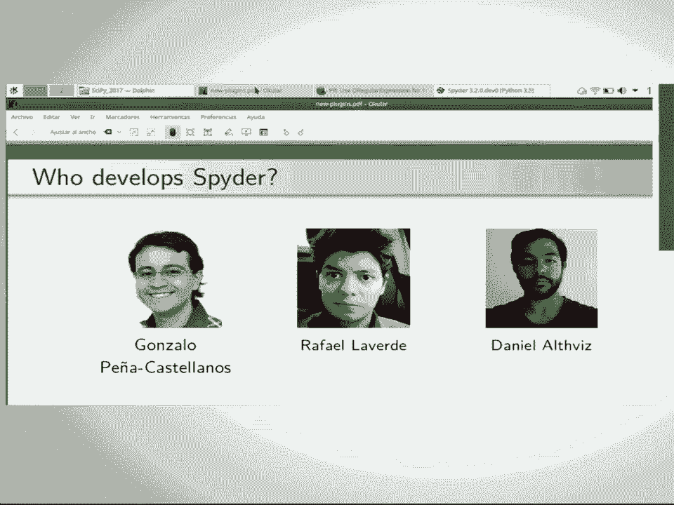

## 插件一：Spyder Notebook 📓

上一节我们介绍了 Spyder 的基础功能，本节中我们来看看第一个插件——Spyder Notebook。这个插件将 Jupyter Notebook 无缝集成到 Spyder 中，提供了类似桌面的体验，并在此基础上增加了一些新功能。

以下是使用 Spyder Notebook 的主要优势：

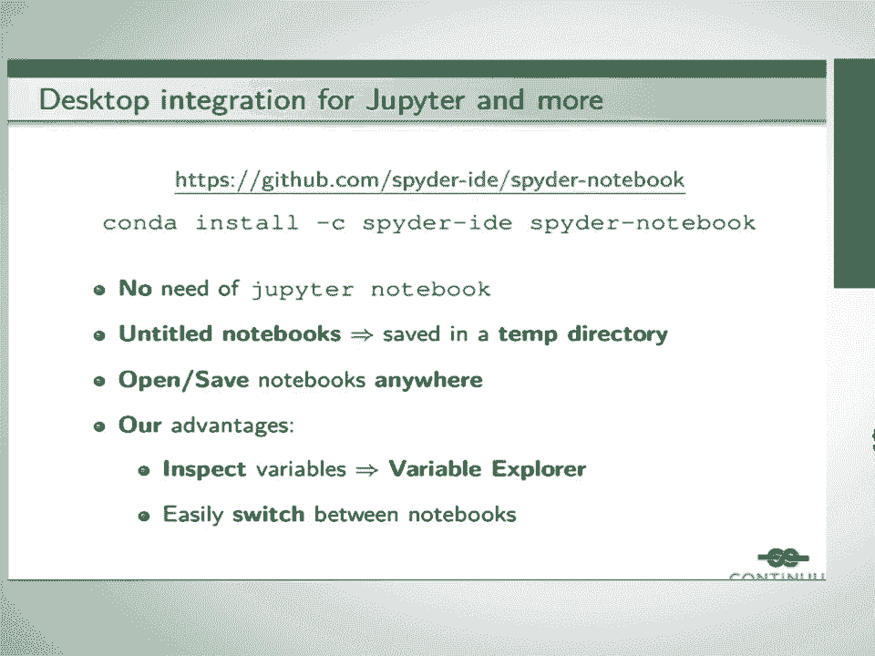

*   **无需指定目录**：无需在特定目录下启动 Jupyter Notebook 服务器。
*   **临时存储**：未命名的笔记本会保存在临时目录，避免污染文件系统。
*   **灵活存取**：可以在文件系统的任何位置打开和保存笔记本。
*   **变量检查**：笔记本中的变量会显示在 Spyder 的变量资源管理器中。
*   **便捷切换**：可以使用 Spyder 的文件切换功能轻松在不同笔记本间跳转。

安装该插件后，Spyder 界面左侧会出现一个名为“Notebook”的标签页。打开后，会加载一个未命名的笔记本供你开始编写代码。例如，输入 `1 + 1` 并执行，结果会显示为 `2`。当你尝试关闭一个有内容的未命名笔记本时，Spyder 会提示你保存，你可以选择任意位置进行保存。

你可以同时打开多个笔记本，所有未命名的笔记本都保存在临时目录。如果这些笔记本没有内容，关闭时 Spyder 会自动关闭并终止其关联的内核。插件还提供了一个菜单，可以快速访问最近打开的笔记本。

最有趣的功能之一是，你可以打开一个连接到当前笔记本的控制台。这个控制台与笔记本共享同一个内核。例如，在笔记本中运行代码创建一个名为 `data` 的 DataFrame 后，你可以在变量资源管理器中查看和探索这个 DataFrame 的所有列和数据。这为不喜欢在网页浏览器中使用 Notebook 的用户提供了一个更丰富、更集成的交互界面。

## 插件二：Spyder Reports 📄

接下来，我们介绍第二个插件——Spyder Reports。这个插件允许你使用 Markdown 编写动态报告。

动态报告通常包含文本、代码、图形和数学公式。一些用户，特别是来自 R 社区的用户，习惯使用 R Markdown 等工具，当他们转向 Python 时，会怀念类似的功能。Spyder Reports 正是为了满足这一需求。

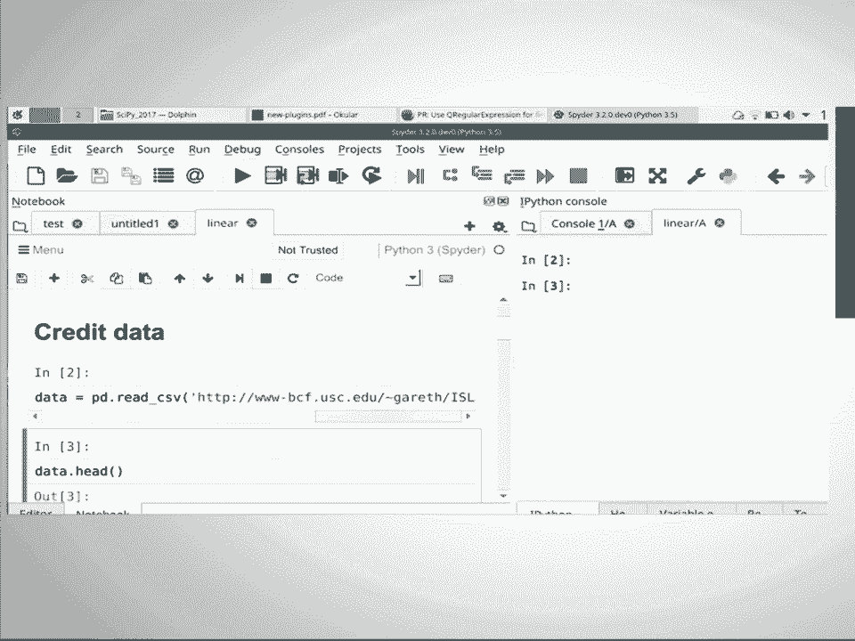

使用 Markdown 编写报告有以下优势：

*   **易于版本控制**：Markdown 文件是纯文本文件，便于使用 Git 等工具进行版本管理。
*   **线性执行**：报告在渲染时按线性顺序执行代码，避免了像在 Jupyter Notebook 中可能因单元格执行顺序混乱而导致的变量状态问题。

该插件基于 `pweave` 库，它能渲染 Markdown 文件，并将输出生成为 HTML 文件在 Spyder 中展示。需要注意的是，此插件仅支持 Python 3，因为 `pweave` 库仅兼容 Python 3。

使用方式很简单：在 Spyder 编辑器中编写一个包含特殊语法（如 `pweave` 项目定义的 Noweb 语法）的 Markdown 文件，然后通过“运行”菜单中的“渲染 HTML”选项，即可在 Spyder 中查看渲染后的报告。

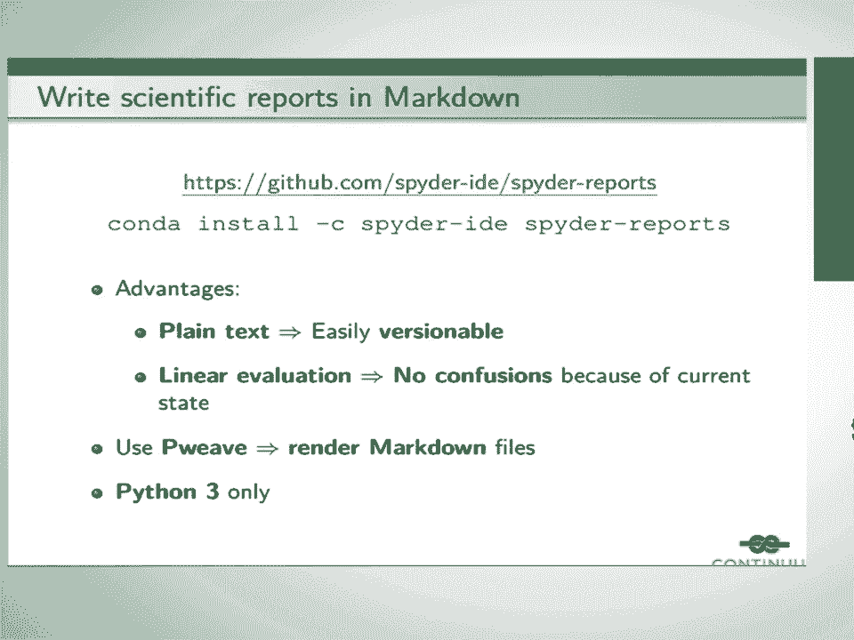

## 插件三：Spyder Terminal 💻

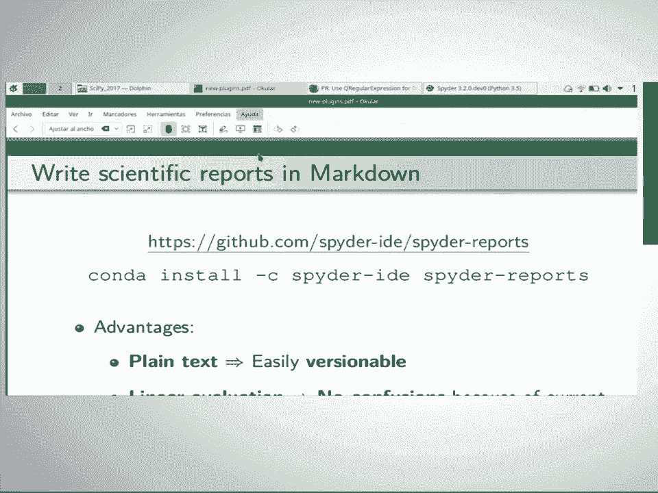

现在，我们来看第三个插件——Spyder Terminal。这个插件允许你在 Spyder 内部运行命令行应用程序。

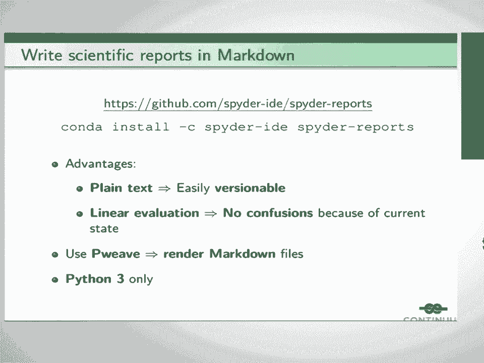

并非所有的命令行工具都适合在 Spyder 的 IPython 控制台中运行。例如，`git`、`htop`、`conda`、`pip` 等命令需要在系统终端中才能正常工作。为了避免用户为了执行这些命令而频繁切换出 Spyder，我们开发了这个插件。

该插件的工作原理是：使用 Tornado 启动一个服务，该服务运行 `xterm.js`（一个 JavaScript 终端模拟器库）。这与 Jupyter Notebook 嵌入系统终端的方式类似。但我们的插件有一个重要改进：它通过一个名为 `pywinpty` 的 Python 封装库，成功地在 Windows 系统上实现了这一功能，而 Jupyter 的终端仅支持 Unix 类操作系统。

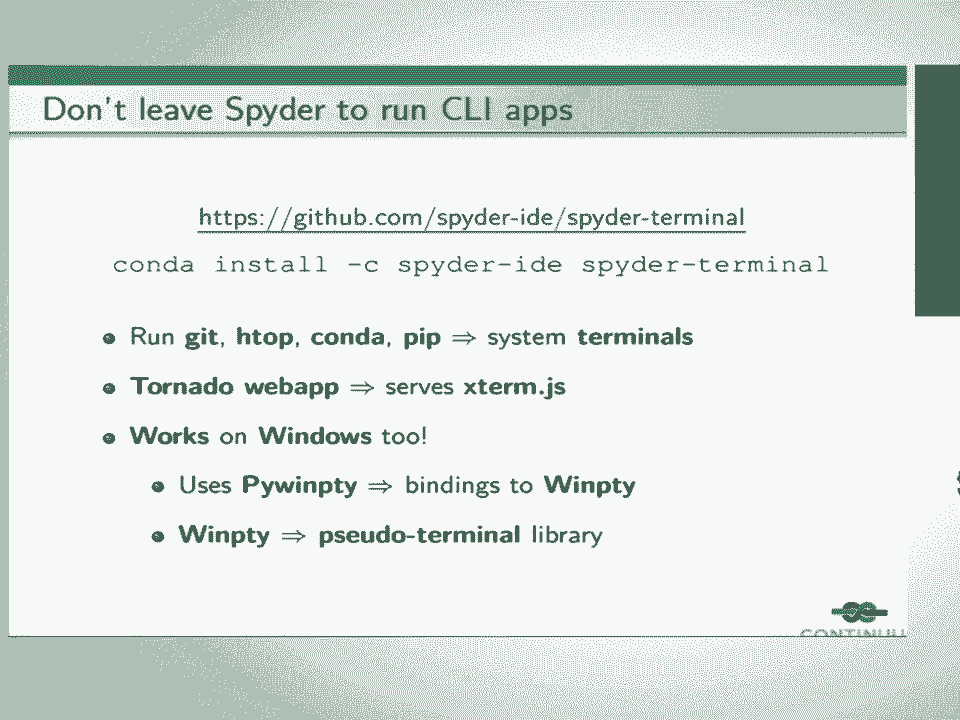

在插件中，你可以像在普通终端里一样运行命令，例如 `htop` 或 `git status`。这为用户，尤其是 Windows 用户，提供了极大的便利，使他们无需离开 Spyder 就能完成各种命令行操作。

## 插件四：Spyder Unit Test ✅

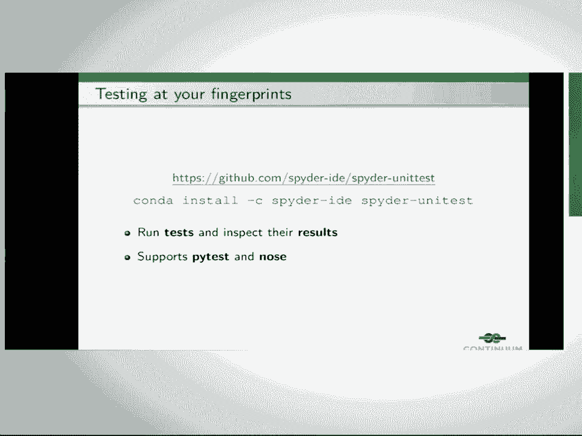

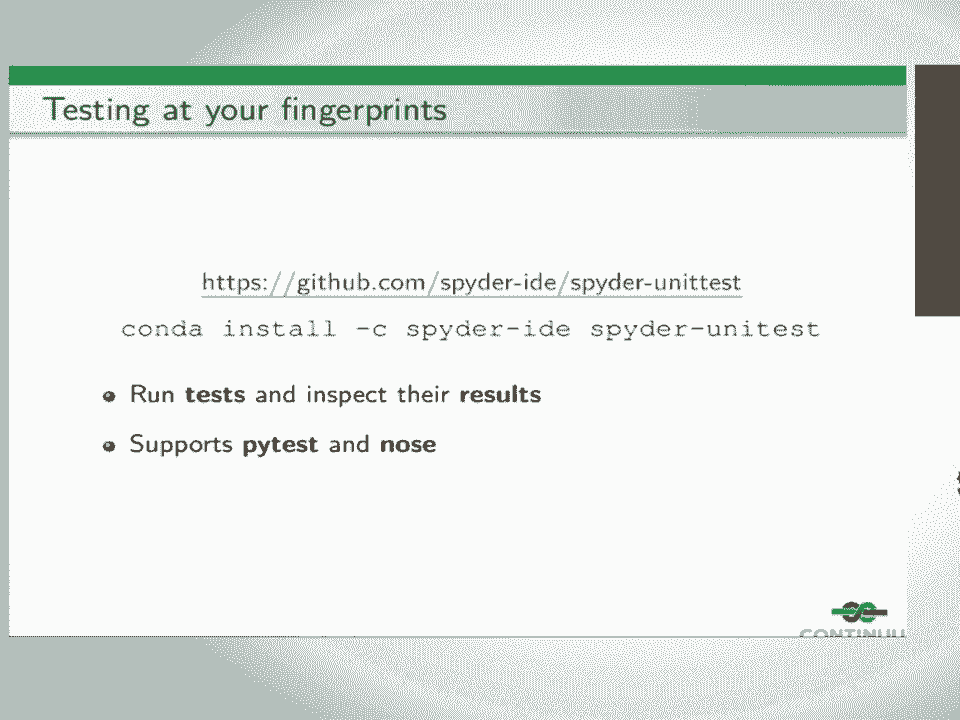

最后，我们介绍第四个插件——Spyder Unit Test。顾名思义，这个插件允许你在 Spyder 内部运行和检查单元测试结果。

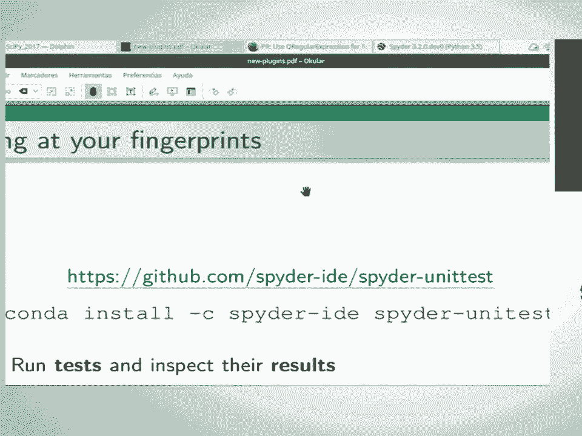

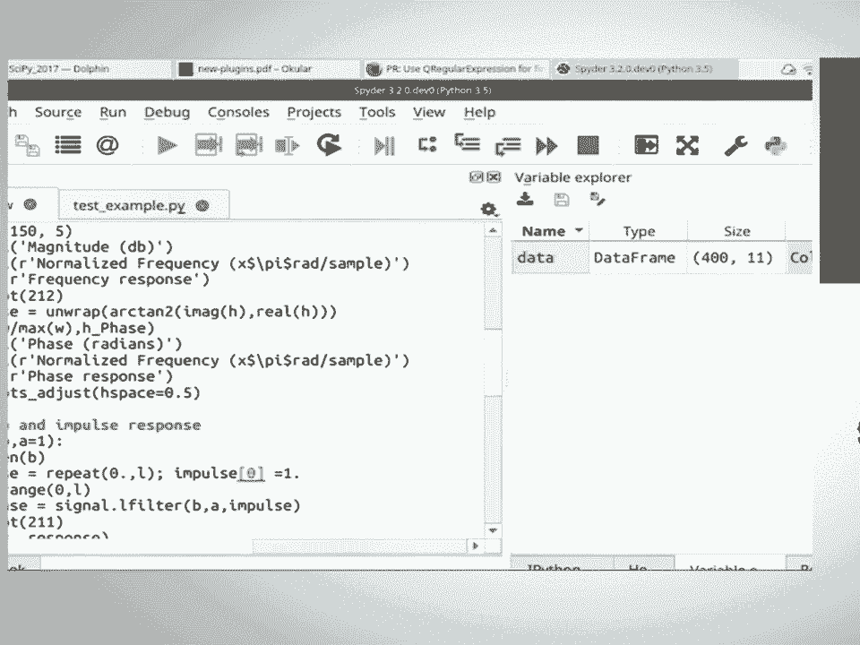

它支持两种流行的 Python 测试框架：`pytest` 和 `unittest`。要配置此插件，你需要点击“配置”按钮，选择你想要使用的测试框架以及测试文件所在的目录。

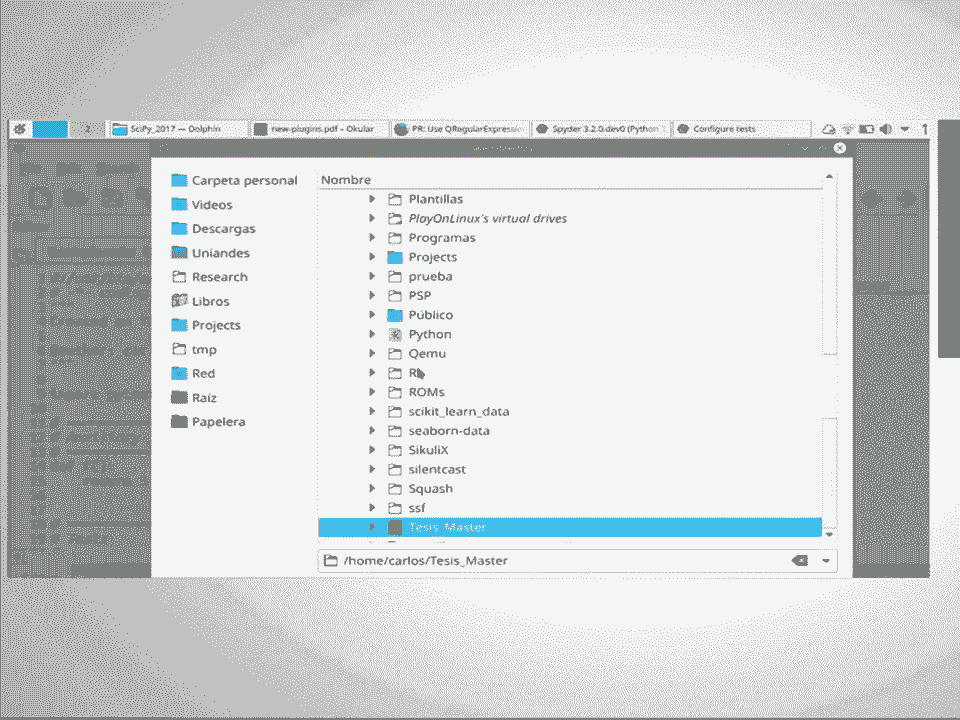

配置完成后，你可以直接运行测试，结果将在 Spyder 界面中显示。绿色行表示测试通过，并会显示测试名称和耗时。如果测试失败，则会显示失败的位置和具体的错误信息。这个插件旨在鼓励开发者在 IDE 内进行测试，减少切换到外部终端执行测试的需要。

## 总结与展望

本节课中我们一起学习了 Spyder 的四个核心插件：Spyder Notebook、Spyder Reports、Spyder Terminal 和 Spyder Unit Test。它们分别扩展了 Spyder 在交互式计算、动态报告生成、命令行操作和代码测试方面的能力。

这些插件目前仍处于早期开发阶段，计划在近期发布。它们的诞生离不开 Travis Oliphant 和 Continuum Analytics 对 Spyder 团队的支持。

最后，关于一个常见问题：目前 Spyder Notebook 主要使用为 Spyder 定制的特殊内核来实现与变量资源管理器等功能的数据交换。因此，虽然技术上可能支持连接外部服务器上的 Notebook，但将无法使用与 Spyder 深度集成的这些特有功能。