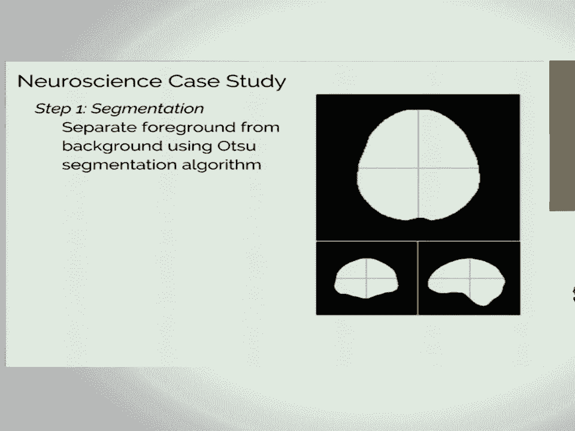

# 30：大规模科学分析 - 五个系统的比较 🧪🔬

在本节课中，我们将学习一篇关于在科学计算背景下，比较五种不同分布式系统处理大规模图像分析的研究。我们将探讨每个系统的特点、优势与挑战，并总结出对科学实践者有用的关键经验。

## 概述

本次分享基于一项跨学科合作研究，旨在探索在科学计算场景下，各种分布式系统的实际应用能力。研究重点关注图像分析工作流的扩展性，并使用了神经影像学和天文学两个案例进行测试。


## 系统介绍与评估

上一节我们介绍了研究的背景和目标，本节中我们来看看具体评估了哪五个系统，以及它们各自的特点。

以下是所评估的五个系统及其选择原因：

1.  **SciDB**：专为处理密集、基于维度的数组数据而设计的数据库架构。
2.  **Spark**：一个非常流行且支持良好的系统，拥有优秀的Python接口。
3.  **Myria**：由研究团队开发，用于领域科学计算的“无共享”数据库管理系统。
4.  **Dask**：Python社区当前应对可扩展科学计算的方案。
5.  **TensorFlow**：一个广泛讨论的系统，尽管并非为此类任务设计，但作为有趣的对比点被纳入研究。



研究团队获取了由领域专家提供的Python参考实现工作流，然后由计算机科学背景的成员尝试在以上五个系统中复现这两个案例研究。

## 各系统详细分析

在了解了评估的系统列表后，我们逐一深入分析每个系统的实现方式、优点和面临的挑战。

### SciDB

SciDB内置了对密集数组的理解，理论上能高效处理图像数据。用户可以通过Python包装器以类似NumPy的语法进行操作。

**核心操作示例（伪代码）**：
```python
# 连接数据库并创建分布式数组对象
array = scidb.connect().create_array(data)
# 执行类似NumPy的操作，如在第三维计算均值
result = array.mean(axis=2)
```

**优势**：
*   原生支持数组数据模型。
*   支持通过流接口使用用户定义函数。

**挑战**：
*   缺乏执行卷积等基本数组操作的原语，需通过UDF实现，但数据库无法优化其内部逻辑。
*   所有数据在节点间以TSV格式传递，序列化/反序列化开销巨大。

### Spark

Spark提供了一个功能性的Python API，允许直接插入Python UDF，并在集群中分布式执行。

**优势**：
*   拥有庞大用户社区，问题容易找到解决方案。
*   弹性分布式数据集格式便于使用任意Python对象作为键。
*   函数式编程风格易于使用。

**挑战**：
*   数据缓存和中间结果的决策需要手动调整以实现高效。
*   对工作流进行超初始实现的调优较为困难，缺乏自动调优机制。

### Myria

Myria基于SQL，提供了一种混合声明式-命令式的数据库语言，专为与科学家合作而设计。

**优势**：
*   数据通过灵活的Blob格式传递（可包含NumPy数组），避免了序列化开销。
*   可直接利用现有科学工作流的参考实现。
*   语言支持显式循环，比传统SQL更灵活。

**挑战**：
*   为获得高效率，通常需要用Myria语言重新实现整个工作流，翻译过程复杂。
*   系统调优需要深入了解其内部机制。

### Dask

Dask是一个纯Python系统，其设计考虑了Python用户的使用习惯。

**优势**：
*   部署和安装非常简单。
*   可以处理Python能处理的任何数据格式。
*   通过`delayed`语法轻松集成任意UDF。

**挑战**：
*   用户需要手动在计算图中插入评估屏障以获取中间结果。
*   需要手动进行数据分区。
*   在`futures`和`delayed`等选择上存在决策困难。
*   任务失败时可能难以调试，有时需要重启整个作业。


### TensorFlow

TensorFlow并非为此类通用科学计算流水线设计，本研究旨在探索其边界。

**挑战**：
*   不支持Python UDF，所有操作都需用TensorFlow语言重新实现，且其功能不完整。
*   所有数据需通过主节点加载，然后分发给工作节点，造成巨大网络开销。
*   计算图有2GB的大小限制。
*   内置操作集有限，例如无法对张量进行逐元素赋值，这对掩码和过滤等操作是必需的。

**结论**：TensorFlow不适合用于扩展任意的科学计算流水线。

## 性能基准与关键发现

在分析了每个系统的特点后，我们来看看它们的性能表现和从中得出的核心结论。

对于神经科学用例的端到端基准测试发现：
*   **Dask、Myria和Spark** 性能相当。
*   **SciDB和TensorFlow** 则慢得多。

性能相似的原因在于，Dask、Myria和Spark本质上都在做同样的事情：传递Python函数并将其应用于以各自方式存储的数据。而SciDB和TensorFlow速度慢的主要原因是**节点间数据传递的效率低下**：SciDB需要反复进行TSV序列化，TensorFlow则需要通过主节点广播所有数据。

**关键启示**：开发分布式系统时，应确保工作节点能自行摄取数据，而非通过网络接收数据。

## 对科学实践者的核心建议

基于以上评估，以下是针对希望在领域科学中进行大规模分析的研究者的关键建议。

1.  **用户定义函数支持至关重要**：没有一个系统能提供足够全面的原语来完全用其原生语言实现复杂科学流水线。因此，支持Python UDF（TensorFlow除外）是必须的，这允许你分发成熟的、经过测试的库函数（如scikit-learn, scikit-image）。
2.  **灵活的数据格式是效率关键**：SciDB和TensorFlow的数据处理瓶颈凸显了这一点。高效的系统应能无缝处理科学领域常用的数据格式。
3.  **自动调优是未来方向**：理想的系统不应要求用户具备其内部决策的百科全书式知识。目前所有系统在这方面都有欠缺，需要大量手动调整。
4.  **简化的安装流程能降低使用门槛**：复杂的安装过程会阻碍工具的应用。
5.  **庞大的用户社区提供有力支持**：在遇到问题时，能够从Stack Overflow等社区找到答案非常重要。

## 总结与展望

本节课中，我们一起学习了五种分布式系统（SciDB, Spark, Myria, Dask, TensorFlow）在处理大规模科学图像分析工作流时的表现。研究发现，目前没有一种工具在所有方面表现突出，但Dask、Spark和Myria在支持Python UDF和灵活数据格式方面更具实用性。

这项研究的意义在于，它向数据库研究社区指明了真实用户（而不仅仅是运行基准测试的研究生）所面临的实际问题。通过揭示这些挑战，希望能推动未来开发出更贴合科学家数据类型和 workflow 的可扩展计算系统。与华盛顿大学的数据库团队合作，正是为了朝这个方向努力，期待未来能有关于可扩展科学计算的更好解决方案。

> **论文与资源**：研究预印本已发布，相关代码也计划在夏季晚些时候公开。