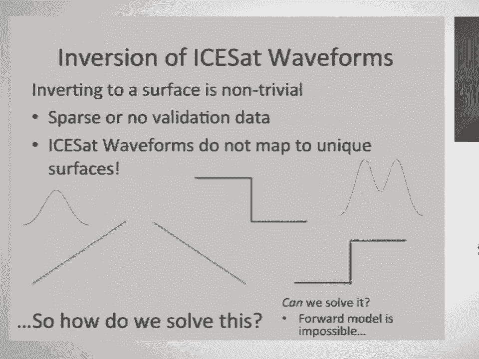
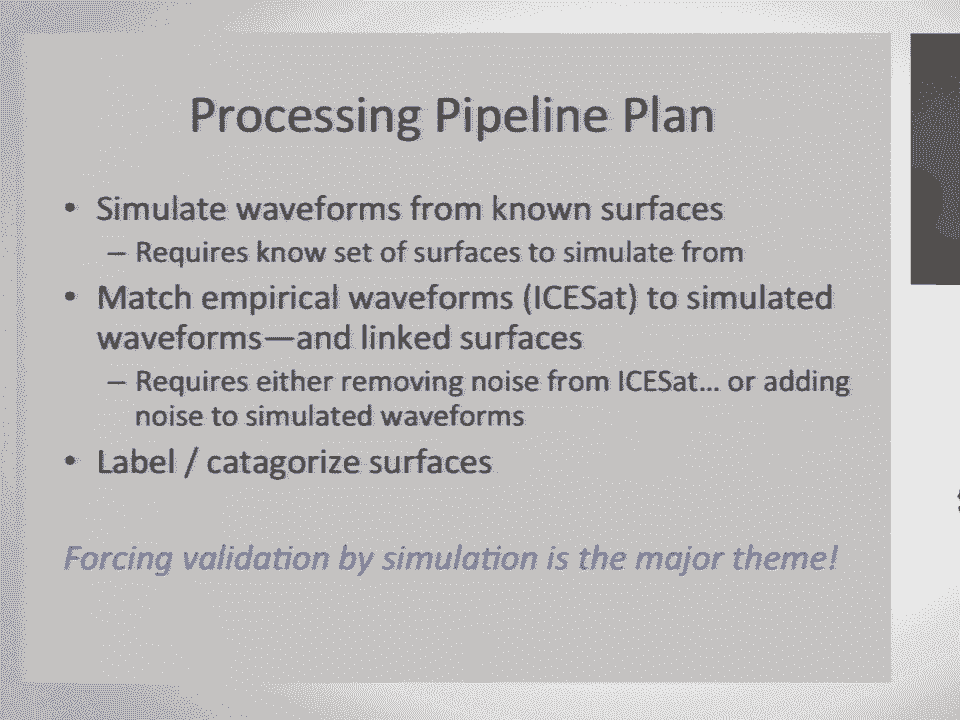
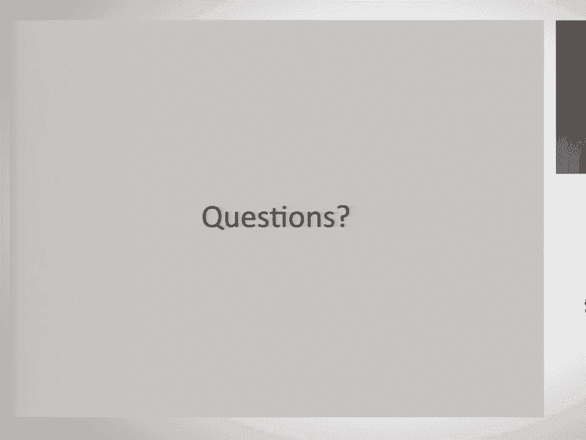

# 31：深度学习与地理空间数据 🧊🛰️

## 概述

在本节课中，我们将学习如何利用深度学习技术处理和分析地理空间数据，特别是针对冰川学中的冰裂隙识别问题。我们将跟随 Shane Grigsby 的研究，了解从原始激光测高数据到最终地表类型分类的完整流程，并探讨其中的挑战与解决方案。

---

## 科学背景与问题定义

我的名字是 Shane Grigsby。从我的标题幻灯片可以看出，我是一名冰川学家。我的主要工作是通过遥感技术从太空观测冰川融化。

我获得了一项 NASA 的资助，项目标题是“利用历史 ICESat 和机载激光测高数据评估格陵兰冰裂隙的范围与特征，为 ICESat-2 评估变化建立基线”。简而言之，我的研究目标是确定冰裂隙的位置，并观察它们是否在变化或移动。

这是一张冰裂隙的图片，以及计划于 2018 年发射的 ICESat-2 卫星的艺术构想图。我们关注冰裂隙，是因为它们是融水从格陵兰冰盖流入海洋的主要通道。当冰面上出现裂缝，融水流入其中，它会向下渗透，直至冰盖底部。到达底部后，融水会像冰块下的水一样，将冰盖托起，加速冰体向海洋移动，并冲刷冰川底部。

此外，学界还在争论冰裂隙是否会随着径流缓慢向上延伸。如果冰盖前缘加速移动，应力缺失会向上游传播，导致冰架上出现新的冰裂隙，从而形成正反馈循环。这个问题之所以重要，是因为全球正在变暖。2012 年，格陵兰冰盖曾出现罕见的全面融化现象，这引起了科学界的广泛关注。

为了追踪冰裂隙是否向上延伸，我们需要一个历史基线来评估其变化。因此，我需要从 2004 年的 ICESat-1 任务数据开始，绘制冰裂隙分布图。

---

## 数据挑战：ICESat-1 激光测高数据

ICESat-1 卫星于 2003 年发射，2009年结束任务。它使用激光测高仪进行测量，激光光斑直径约为 70 米，并记录反射能量的时间谱。

以下是不同地表反射波形的示意图：
*   **平坦表面**：产生**高斯分布**波形。
*   **倾斜表面**：产生**更宽的高斯分布**波形。
*   **不连续表面（如冰裂隙）**：产生**双峰分布**波形。

处理这些数据最大的挑战是缺乏验证数据。我们没有与这些激光光斑同时期的光学影像。这意味着，我们只能通过分析这些“锯齿状”的波形曲线，来推断地表的类型（是冰裂隙、山脊还是凹地）。

这听起来简单，实则不然。我最初花了几个月时间来判断这是否可行。核心难题在于，这是一个从二维地表到一维时间序列的“多对一”映射问题，从第一性原理出发进行反演在数学上是不可能的。例如，一个向左倾斜的坡面和一个向右倾斜的坡面，可能产生完全相同的波形。许多不同类型的地表都可能产生相同的信号。科学家们将这类问题称为“非平凡问题”。

---

## 解决方案思路：从模拟到匹配

既然无法直接反演，我们换个思路：如果我能模拟出已知地表会产生什么样的波形，那么我是否可以将实测波形与模拟波形进行匹配，从而推断出可能的地表类型呢？

我的处理流程计划如下：
1.  **模拟波形**：从已知地表模拟生成波形。
2.  **匹配波形**：将 ICESat 的实测波形与模拟波形进行匹配。
3.  **关联地表**：通过数据库查找，将匹配的波形与其对应的地表关联起来。
4.  **标记分类**：对地表进行标记和分类。

这本质上是通过模拟来“制造”我自己的验证数据。

---

## 数据准备：源数据与预处理

我的源数据来自 NASA 的“冰桥行动”飞行任务。这些任务产生了高质量的光学影像和激光雷达点云数据，经过处理后生成了高精度的数字高程模型。

以下是预处理步骤：

**1. 数据分块与归一化**
原始数据是重叠的、像素大小略有不同的图块。我使用 GDAL 库进行双线性插值，将所有图块重采样为统一的 **0.5米** 分辨率。然后，使用 `gdal_translate` 将它们切割成 **100米 x 100米** 的小图块（即 200x200 像素）。我选择这个尺寸是为了让图块略大于激光光斑的70米直径，以提供一些边界缓冲。

**2. 处理重叠与去重**
数据块之间的重叠被我视为一个“特性”而非“缺陷”，因为它能提供同一特征（如冰裂隙）在不同位置和视角下的视图。为了去除可能存在的重复图块，我对数据数组进行哈希计算，并将输出文件名设为哈希值，这样重复的文件会被自动覆盖。这样做的一个额外好处是实现了数据集的自动随机打乱。

**3. 波形模拟**
我从“冰桥行动”数据中获得了约25万个图块。对于每个图块，我将其高程值转换为光飞行时间，然后与一个高斯函数（模拟 ICESat 传感器的响应）进行卷积，最终生成模拟波形。

然而，这些模拟波形是“完美”的，没有考虑大气衰减、云层、光电噪声等因素。而真实的 ICESat 波形存在噪声、幅度变化和时间偏移。

---

## 可行性验证与噪声处理

为了验证方法的可行性，我进行了初步测试。我使用局部敏感哈希算法，将波形视为高维空间中的点，进行最近邻查找。测试表明，对于一个未知的输入波形，我们确实能从模拟波形库中找到与之相似、且地表类型也相似的匹配项。

为了让模拟波形更接近真实情况，我需要为其添加噪声。我从真实的 ICESat 波形中提取了噪声、幅度缩放和时间偏移的分布。然后，我构建了一个一维卷积神经网络（CNN）自编码器。在训练时，每一批数据我都会为模拟波形随机添加不同组合的噪声、缩放和偏移。自编码器的目标是学会去除这些干扰，恢复出“干净”的波形。

通过这种方法，我可以将25万个模拟波形扩展成数十亿个带有不同扰动的变体，极大地增加了数据的多样性和真实性。

---

## 从匹配到分类：无监督学习

上述方法能为我提供与每个实测波形最匹配的多个模拟地表图块。但我仍然需要一种自动化的方式，将这些图块分类（例如，分为“冰裂隙”和“非冰裂隙”）。

我不想依赖人工标记（太枯燥且主观），因此选择了无监督学习方法。我使用了**自组织映射**（一种竞争型单层神经网络），它能将相似的输入图块在二维映射图上聚集在一起。

然而，第一次尝试效果不佳。网络更多地匹配了图块的**方向**和**整体坡度**等特征，而不是我关心的**地表形态**（如是否有裂隙）。

---

## 关键改进：图块归一化与降维

为了解决这个问题，我回头对输入图块进行了严格的归一化处理：

1.  **圆形掩膜**：应用圆形掩膜，聚焦于激光光斑中心区域。
2.  **去趋势化**：使用主成分分析对图块进行旋转，消除主要的倾斜趋势（注意，这里不降维，只是旋转坐标轴）。
3.  **降维**：使用**离散余弦变换**对图块进行压缩。我移除了75%的数据，因为我的传感器只能探测到大于15厘米的变化，毫米级的细节误差是可以接受的。

经过这些步骤，我将输入向量的长度从 40,000 大幅减少到约 5,000。这不仅使自组织映射的训练时间从 **10天** 缩短到 **4小时**，更重要的是，归一化后的图块更能反映地表形态的本质特征，使得匹配和聚类结果更加鲁棒和准确。

---

## 结果与下一步计划

经过改进，自组织映射能够很好地将冰裂隙图块聚类在一起。例如，一个冰裂隙图块的最接近匹配项中，大部分都是其他冰裂隙图块。

**下一步计划包括：**
1.  **扩大规模**：将当前在小数据集（1万个图块）上验证的方法，应用到完整的25万个图块数据集上。
2.  **聚类输出**：对自组织映射的输出节点进行聚类，我计划使用 OPTICS 算法。这样我只需要标记几百个聚类，而不是几十万个单独的图块。
3.  **概率输出**：最终，对于每个 ICESat 激光点，我将得到一个属于“冰裂隙”类别的概率（例如，82%）。通过将多年数据栅格化，我可以生成冰裂隙概率分布图，并通过时间序列对比来追踪其变化。

---

## 经验总结与要点回顾

本节课中，我们一起学习了利用深度学习处理地理空间数据解决科学问题的完整流程。回顾整个过程，有几点关键经验：

*   **数据预处理至关重要**：在机器学习中，调整输入数据往往比调整模型参数更能提升效果。
*   **图块尺寸宜大不宜小**：确保你的数据图块尺寸大于核心特征区域，以便后续进行裁剪和归一化。
*   **尽可能去趋势和归一化**：消除不相关的变异（如整体坡度、方向），能让模型更专注于你关心的特征。
*   **利用模拟扩展数据**：当真实标注数据稀缺时，通过物理模拟添加可控噪声来生成大量训练数据是一个有效策略。
*   **无监督学习提供出路**：在缺乏标签的情况下，自组织映射等无监督方法可以帮助发现数据中的自然类别。

通过结合地理空间数据处理、物理模拟和深度学习，我们能够从具有挑战性的遥感数据中提取出有价值的信息，以应对诸如冰川变化监测等重要科学问题。

---
**课程总结**：本节课我们深入探讨了如何利用 ICESat-1 激光测高数据，通过模拟波形、深度学习匹配以及无监督聚类的方法，来解决格陵兰冰裂隙识别这一非平凡的科学问题。核心在于通过巧妙的数据工程和模型设计，克服了数据反演的不确定性和标注数据缺失的挑战。