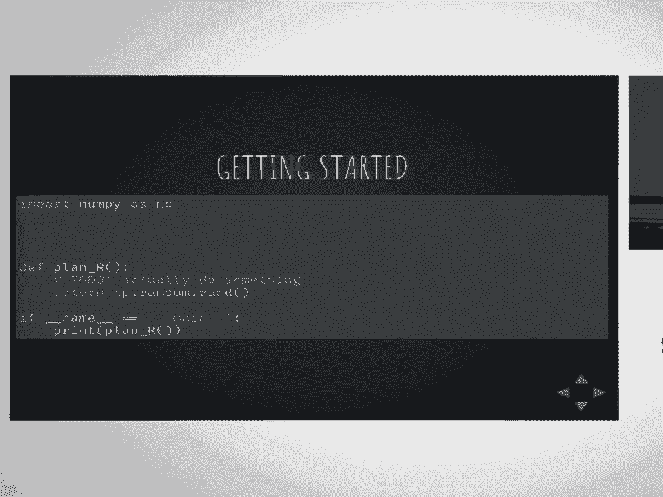
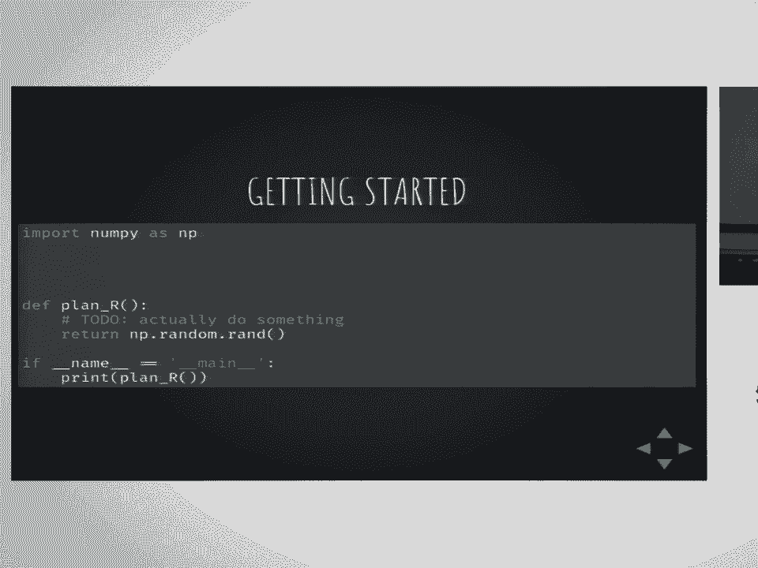

# 32：Sacred 🧪 - 如何停止担忧并爱上科研

在本课程中，我们将学习一个名为 **Sacred** 的开源框架。它旨在为计算实验提供基础架构，帮助研究人员摆脱日常实验中的琐碎烦恼，使科研工作更加流畅、可复现和有条理。

---

## 概述：一个科研同事的烦恼故事

为了理解 Sacred 旨在解决的问题，让我们想象一位同事的科研经历。

这位同事有一个很棒的项目想法。他建立了一个私有 GitHub 仓库，从配置文件加载参数，并将输出和结果记录在编号的目录中。初步结果看起来很有希望。

然而，他很快发现频繁编辑配置文件很繁琐。于是他构建了一个命令行界面。接着，他发现配置参数之间存在依赖关系（例如，`alpha` 参数通常希望设为 `1 / sqrt(层数)`），因此他为配置过程添加了后处理逻辑。

当导师要求他在几周内提交论文时，问题开始显现。他需要运行系统性的实验，但结果文件分散在众多目录中，难以筛选和分组。时间紧迫，他只能手动复制文件并用 Jupyter Notebook 进行分析。

在尝试改进方法时，他将配置过程改为使用全局变量。但重新运行旧配置后，结果反而更差了。由于 Git 提交不频繁，他不得不手动回退代码以定位问题。

随后，竞争压力迫使他使用新数据集并在多台服务器上运行实验。旧的目录编号方案导致文件被覆盖。他修复了存储方式，但新数据集上的结果不理想。

接着，他进行参数调优，编写脚本生成配置文件并分发运行。不幸的是，一个配置文件中的拼写错误导致大量实验时间被浪费。截止日期临近，他在恐慌中删除了旧文件并重新运行所有实验。

最终，在调试时他发现，由于使用了全局配置，一个关键的 `metrics` 参数在运行中被意外覆盖，导致所有结果都无效。

这个过程远非理想。在截止日期压力下，即使是最佳习惯也可能崩溃，让位于混乱和绝望。那么，我们能做些什么呢？

---

## 引入 Sacred：无忧计算实验框架

**Sacred** 是一个旨在为计算实验提供无忧基础架构的小型开源框架。其哲学是让计算实验变得有趣且可复现（在中期研究阶段），具有最少的样板代码和最大的便利性，并保持模块化和可扩展性。

在 Sacred 中，核心抽象是 **实验（Experiment）**。`Experiment` 类负责收集配置、要运行的函数以及观察者（Observers）。你可以从命令行或 Python 内部启动实验运行（Run）。

运行过程中，Sacred 会定期触发事件给观察者，以收集所有必要信息。主要有四种事件类型：
*   **开始事件**：包含配置、检测到的源代码、依赖项、主机和元信息。
*   **心跳事件**：定期更新捕获的标准输出和自定义实时信息。
*   **完成/失败事件**：包含结果或堆栈跟踪。
*   **工件和资源事件**：用于添加特定文件，这些文件将与运行记录一起存储。

---

## 快速上手：三行代码创建 Sacred 实验

假设你的项目有一个可作为入口点的函数，代码如下：

```python
def my_main():
    # 你的研究代码
    print("Running experiment...")

if __name__ == '__main__':
    my_main()
```

将其转换为 Sacred 项目只需添加三行代码：

```python
from sacred import Experiment  # 1. 导入 Experiment
ex = Experiment()             # 2. 实例化实验

@ex.main                      # 3. 装饰主函数
def my_main():
    # 你的研究代码
    print("Running experiment...")






if __name__ == '__main__':
    ex.run_command_line()     # 改为使用 Sacred 的命令行运行器
```


实际上，如果你使用 `@ex.automain` 装饰器，可以省略最后的 `if` 块。添加这三行后，你就拥有了一个 Sacred 项目，可以从命令行执行，例如：
```bash
python my_experiment.py help
```

即使只做这些，也已获益匪浅。你立即获得了一个强大的命令行界面，并可以添加文件存储观察者，自动保存配置、输出、依赖项和源代码副本。此外，Sacred 会自动为实验添加一个随机种子（`seed`），并通过设置种子（如 `python my_experiment.py with seed=1`）使实验具备基本的可复现性，因为它会自动为 NumPy、random 和 TensorFlow（如果已安装）设置随机数生成器。

---

## 配置系统：强大而灵活

现在，让我们深入了解 Sacred 强大的配置系统。定义配置有多种方式，最优雅的一种是使用 `@ex.config` 装饰器：

```python
@ex.config
def my_config():
    # 此函数内的局部变量将成为配置项
    num_layers = 7
    optimizer = "adam"
    # 配置项之间可以有依赖关系
    alpha = 1.0 / (num_layers ** 0.5)  # 公式：alpha = 1 / sqrt(num_layers)
    # 根据其他配置项进行条件设置
    if optimizer == "adam":
        learning_rate = 0.001
    else:
        learning_rate = 0.01
```

添加此函数后，打印配置将显示所有条目。你可以从命令行轻松覆盖任何配置：
```bash
python my_experiment.py with num_layers=5 optimizer="sgd"
```
Sacred 会自动解析依赖关系（例如 `alpha` 会随之调整）。如果你拼写错了配置项名称，Sacred 会给出错误提示。

---

## 访问配置：通过注入而非全局变量

定义了配置后，如何在代码中访问它们？Sacred 采用了 **配置注入（Configuration Injection）** 的概念。你只需在需要使用配置的函数参数中声明它们：

```python
@ex.capture
def train_model(num_layers, learning_rate, dataset="default"):
    # 可以直接使用 num_layers 和 learning_rate
    print(f"Training with {num_layers} layers and LR={learning_rate} on {dataset}")
    # ... 训练逻辑 ...

@ex.main
def my_main():
    train_model()  # 无需传递参数，Sacred 会自动注入配置值
    train_model(dataset="special")  # 你也可以覆盖部分参数
```

配置注入的优先级是：显式传递的参数 > 配置值 > 函数默认值。这避免了在代码中到处传递配置的混乱，也消除了全局变量，提高了函数可重用性。

---

## 记录与存储：使用观察者和数据库

为了存储和分析结果，我们需要观察者。推荐使用 **MongoDB 观察者**，它是一个无模式数据库，非常适合存储结构可能变化的实验配置和结果。

你可以从命令行或脚本中添加它：
```bash
python my_experiment.py -m my_database
```
或者在代码中：
```python
from sacred.observers import MongoObserver
ex.observers.append(MongoObserver(url='localhost:27017', db_name='my_database'))
```

所有实验的运行信息（配置、结果、标准输出、源代码等）都会存入 MongoDB。之后，你可以用几行 Python 代码轻松查询和分析：
```python
from pymongo import MongoClient
client = MongoClient()
db = client.my_database.runs
# 查询所有 num_layers 为 7 的实验
runs = db.find({'config.num_layers': 7})
# 轻松转换为 Pandas DataFrame 进行分析和绘图
```

---

## 扩展工作流：参数调优与监控

当需要大规模运行实验（例如应对“俄罗斯实验室”的竞争）时，Sacred 的核心与两个扩展工具能提供帮助：

1.  **LabWatch**：一个超参数优化接口（目前处于早期阶段）。它通过 MongoDB 协调优化过程，支持多种优化器。你定义一个搜索空间，LabWatch 会建议可能带来更好结果的参数组合。

2.  **Sacredboard**：一个基于 Web 的仪表板，用于实时监控实验进展。它连接到 MongoDB，可以显示正在运行、已完成或中断的实验，查看详细配置，如果使用了特定的指标 API，还能实时显示收敛曲线。

这些工具共同构成了一个强大的工作流，帮助你从混乱走向高效、有序的科研状态。

---

## 总结与展望

本节课我们一起学习了 **Sacred** 框架。我们看到，琐碎的后勤问题可能累积成灾难，而拥有一个合适的基础架构工具至关重要。

Sacred 旨在填补这一空白，它通过以下方式支持计算实验工作流：
*   **极简集成**：几行代码即可将现有项目转换为 Sacred 实验。
*   **强大配置**：支持灵活、可互依赖的配置定义和注入。
*   **全面记录**：通过观察者自动捕获实验的方方面面。
*   **便捷分析**：与数据库（如 MongoDB）集成，便于查询和结果分析。
*   **生态扩展**：通过 LabWatch 和 Sacredboard 等工具支持超参数优化和实验监控。

Sacred 并非唯一此类工具（类似的有 Sumatra、Reprozip 等），但其在 Python 计算实验的便捷性和配置系统方面具有独特优势。我们希望 Sacred 能逐渐成为计算实验的默认工作流基础。

未来，Sacred 将继续发展，添加更多功能。记住，良好的工具习惯能让你更专注于科学本身，而非周围的混乱。