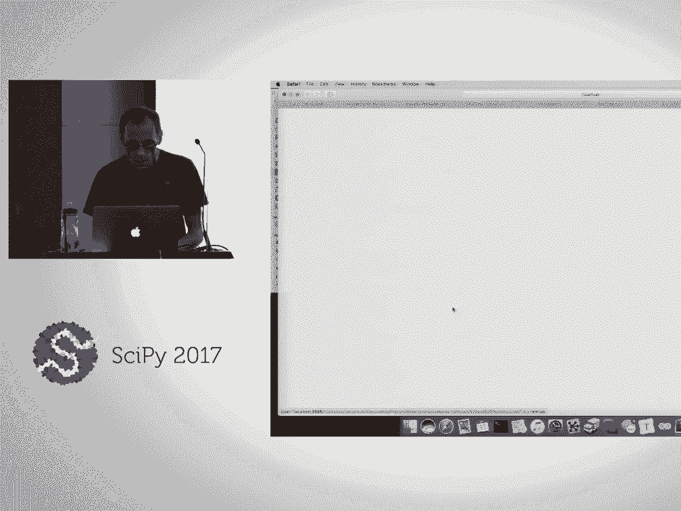
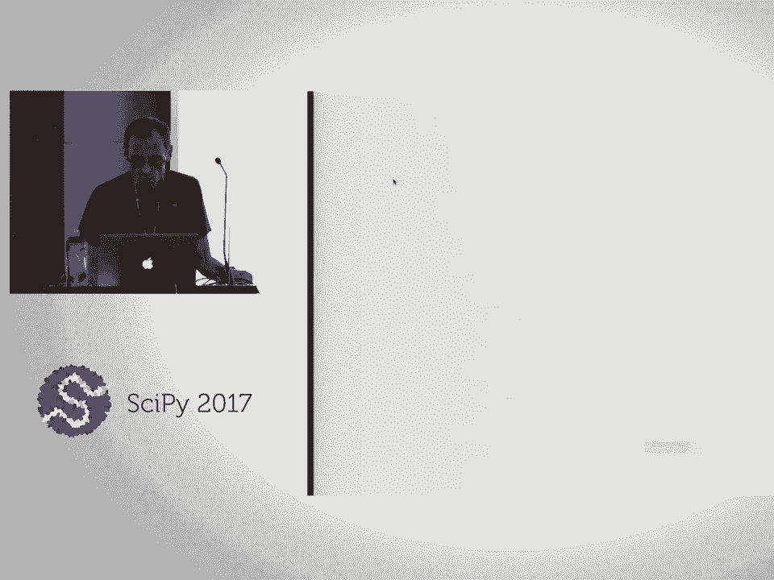
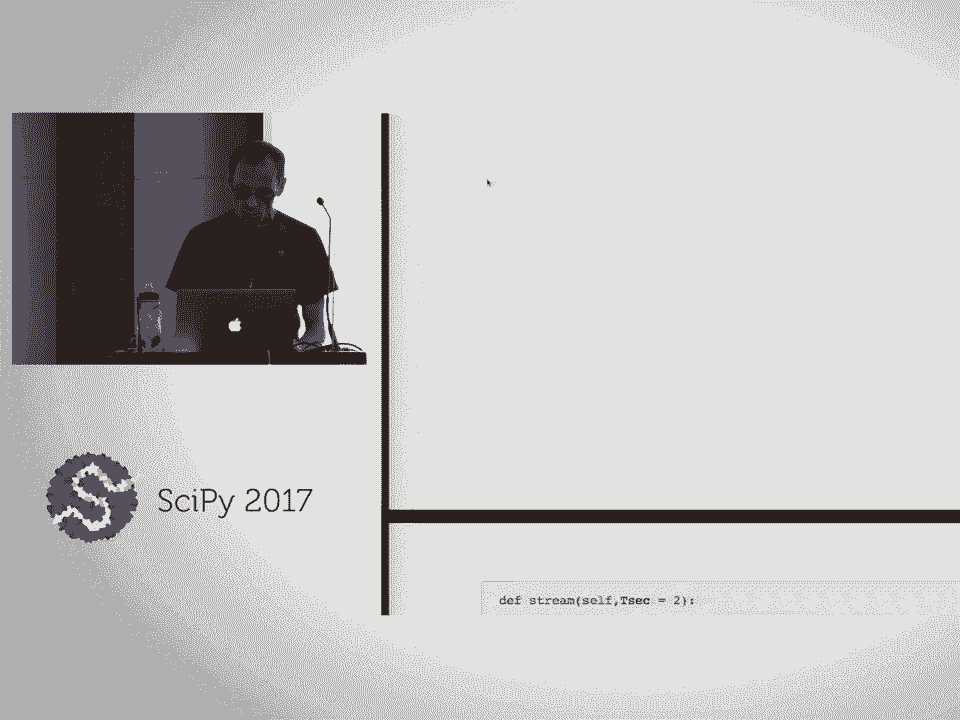
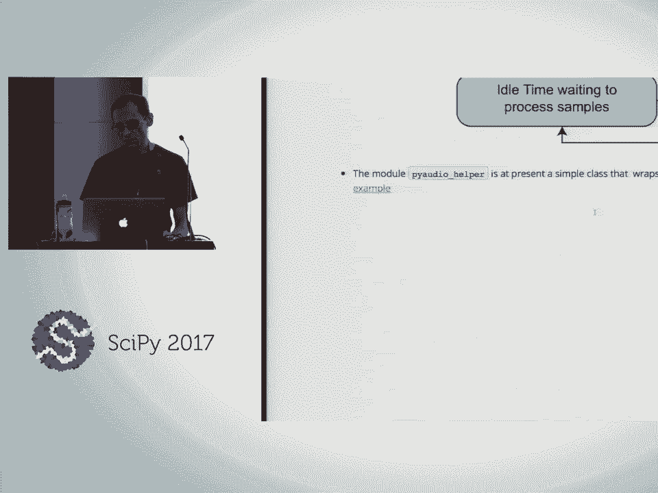
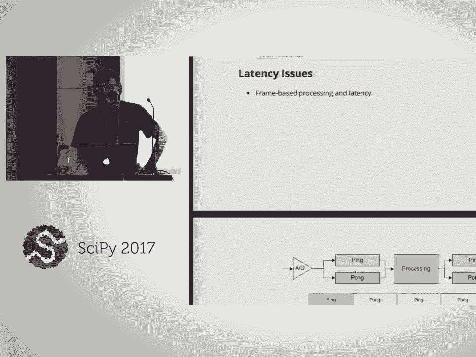
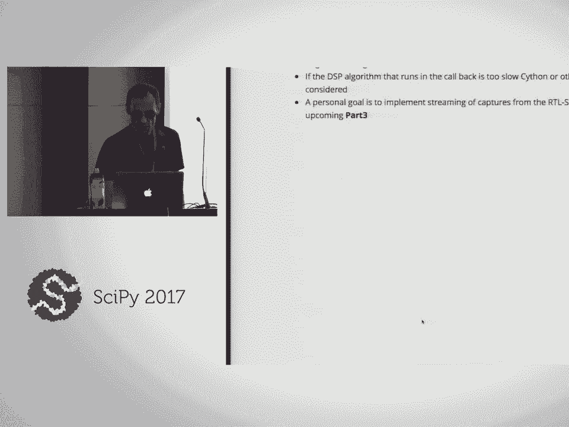
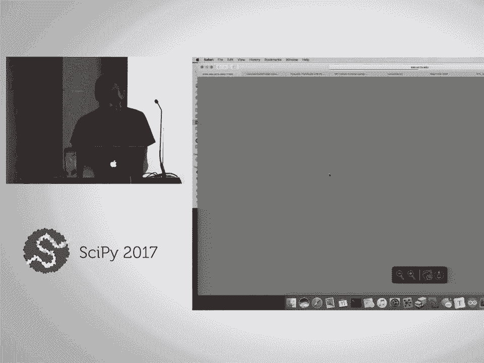
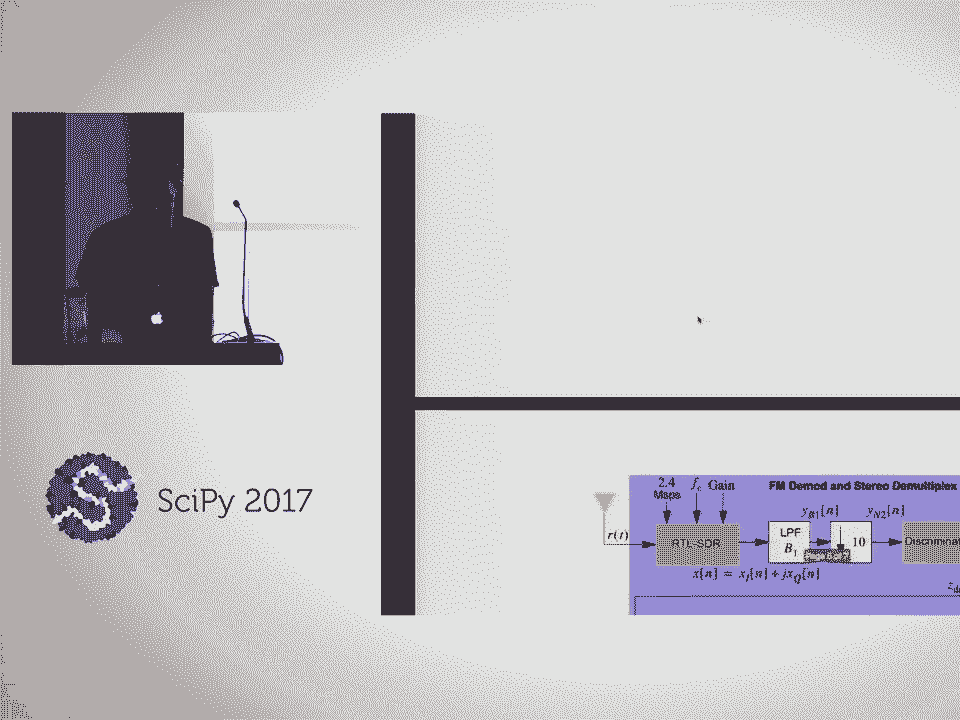

# 33：使用scikit-dsp-comm进行信号处理与通信实践 🎛️📡

在本课程中，我们将学习如何使用Python的`scikit-dsp-comm`包进行信号处理和通信的实践操作。课程内容涵盖从基础信号概念到实际音频处理和软件定义无线电应用的完整流程。

## 概述

本教程旨在提供一个信号处理与通信的实践入门。我们将从基础概念开始，逐步深入到实际应用，包括音频处理、滤波器设计和软件定义无线电接收。课程内容设计简单直白，适合初学者理解。

## 第一部分：信号与系统基础 📈

首先，我们需要理解信号与系统的基本概念。信号可以是自然产生的，如心跳或风速，也可以是人为制造的，如通信信号。系统则是对这些信号进行操作和处理的部分。

### 连续时间与离散时间信号

连续时间信号在时间上是连续的，而离散时间信号则是通过采样得到的序列。在计算机中，我们主要处理离散时间信号。

**连续时间余弦波公式**：
```
x(t) = A * cos(2πf₀t + φ)
```

**离散时间余弦波公式**：
```
x[n] = A * cos(2πf₀n/fs + φ)
```
其中，`A`是振幅，`f₀`是频率，`φ`是相位，`fs`是采样率。

### 采样与混叠

采样是将连续时间信号转换为离散时间信号的过程。如果采样率不足，会导致混叠现象，即高频信号被错误地表示为低频信号。为了避免混叠，采样率必须大于信号最高频率的两倍。

### 基本脉冲信号

在信号处理中，脉冲信号是构建更复杂波形的基础。常见的脉冲信号包括矩形脉冲和三角脉冲。

**矩形脉冲函数**：
```python
def rect_pulse(t, tau):
    return 1 if abs(t) <= tau/2 else 0
```

**三角脉冲函数**：
```python
def tri_pulse(t, tau):
    return max(0, 1 - abs(t)/tau)
```

### 频域分析

频域分析是将信号从时间域转换到频率域的过程。通过傅里叶变换，我们可以分析信号的频率成分。

**傅里叶变换公式**：
```
X(f) = ∫ x(t) * e^(-j2πft) dt
```



在离散时间中，我们使用快速傅里叶变换（FFT）进行计算。

## 第二部分：系统与滤波器设计 🔧

系统对信号进行操作，例如滤波可以去除噪声。滤波器是信号处理中的核心组件，分为有限脉冲响应（FIR）滤波器和无限脉冲响应（IIR）滤波器。

### 差分方程

离散时间系统通常用差分方程描述。一个通用的差分方程形式如下：

**差分方程公式**：
```
y[n] = Σ b[k] * x[n-k] - Σ a[k] * y[n-k]
```
其中，`x[n]`是输入信号，`y[n]`是输出信号，`b[k]`和`a[k]`是系数。



### 滤波器设计

使用`scikit-dsp-comm`包可以方便地设计滤波器。例如，设计一个FIR带通滤波器：

```python
from sk_dsp_comm import fir_design_helper
b = fir_design_helper.bandpass(f_pass1, f_pass2, fs, ripple_db, atten_db)
```

### 滤波器频率响应

滤波器的频率响应描述了滤波器对不同频率信号的增益。通过零极点图可以直观地理解滤波器的特性。

## 第三部分：音频处理实践 🎵

音频处理是信号处理的重要应用之一。我们将使用`pyaudio`进行实时音频处理。

### 实时音频流处理

`pyaudio`允许我们通过回调函数处理音频流。回调函数在每次音频帧到达时被调用，我们可以在其中进行信号处理。

**示例回调函数**：
```python
def callback(in_data, frame_count, time_info, status):
    # 处理输入数据
    processed_data = process_audio(in_data)
    return processed_data, pyaudio.paContinue
```

### 音频特效：镶边效果



镶边效果是一种音频特效，通过混合原始信号和经过时变延迟的信号实现。这可以产生类似多普勒效应的声音效果。



**时变延迟实现**：
```python
def time_varying_delay(signal, delay_function):
    # 根据延迟函数处理信号
    return delayed_signal
```

## 第四部分：通信系统与软件定义无线电 📻



通信系统涉及信号的调制、传输和解调。软件定义无线电（SDR）允许我们通过软件实现无线电功能。





### 调频（FM）解调

调频是一种常见的模拟调制方式。解调过程涉及从接收信号中提取原始信息。

**FM解调公式**：
```
m(t) = dφ(t)/dt
```
其中，`φ(t)`是接收信号的相位。

### RTL-SDR接收器

RTL-SDR是一种低成本的软件定义无线电设备。我们可以使用它接收和解析FM广播信号。

**RTL-SDR捕获信号**：
```python
from rtlsdr import RtlSdr
sdr = RtlSdr()
sdr.sample_rate = 2.4e6
samples = sdr.read_samples(5 * sdr.sample_rate)
```

### 立体声FM解调

立体声FM广播包含左声道和右声道信息，以及一个19 kHz的导频信号。解调过程需要提取这些成分并重建立体声音频。

## 第五部分：数字通信与频移键控（FSK） 🔢



数字通信使用离散符号传输信息。频移键控是一种简单的数字调制方式，通过改变载波频率表示二进制数据。

### FSK调制与解调

FSK调制将二进制数据映射到不同的频率。解调过程涉及检测接收信号的频率并还原原始数据。

**FSK解调示例**：
```python
def fsk_demodulator(signal, f1, f2, fs):
    # 检测信号频率并解码为二进制数据
    return binary_data
```

### 位同步

在数字通信中，位同步是确保接收端正确采样数据的关键步骤。通过匹配滤波器和时钟恢复算法可以实现位同步。

## 总结

在本课程中，我们一起学习了信号处理与通信的基础知识，包括信号与系统概念、滤波器设计、音频处理以及软件定义无线电的应用。通过实践操作，我们掌握了使用`scikit-dsp-comm`包进行信号处理和通信系统仿真的基本技能。希望这些内容能为你的进一步学习和应用提供坚实的基础。