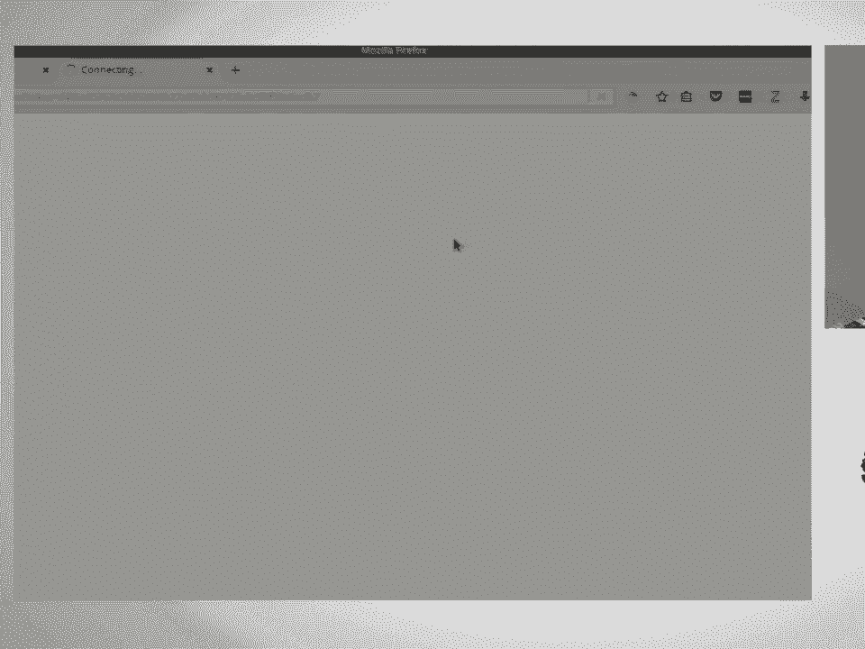
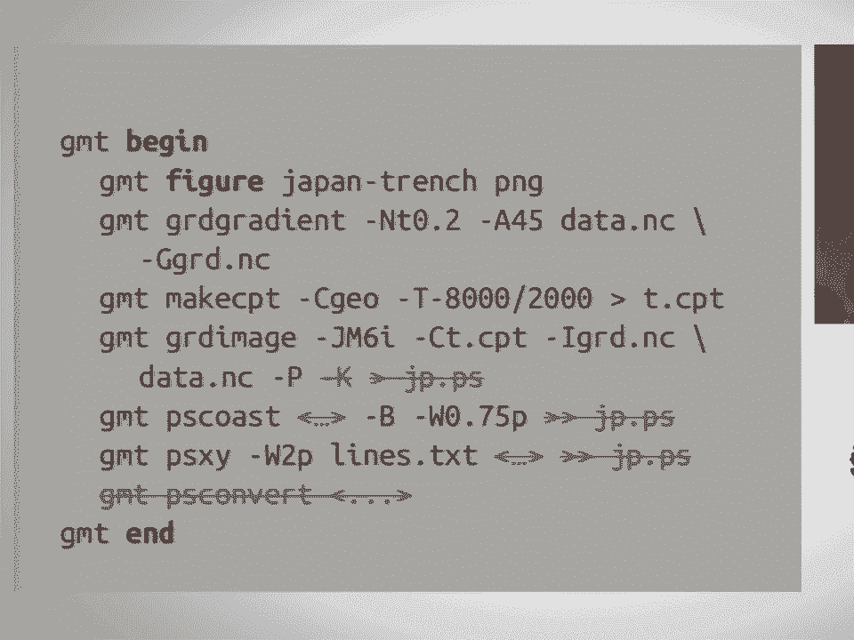
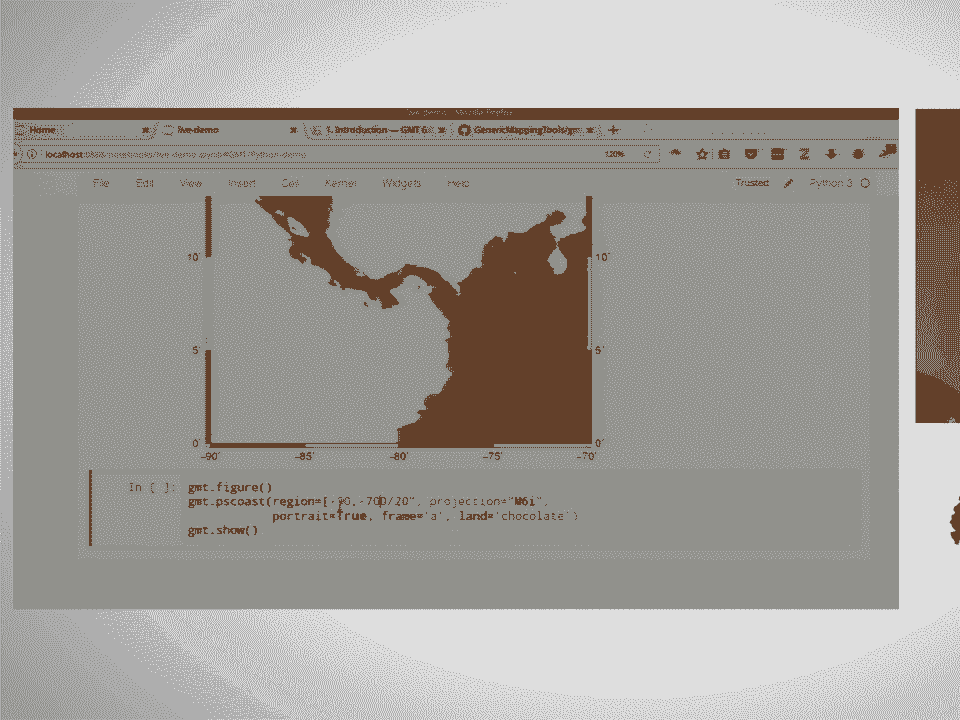
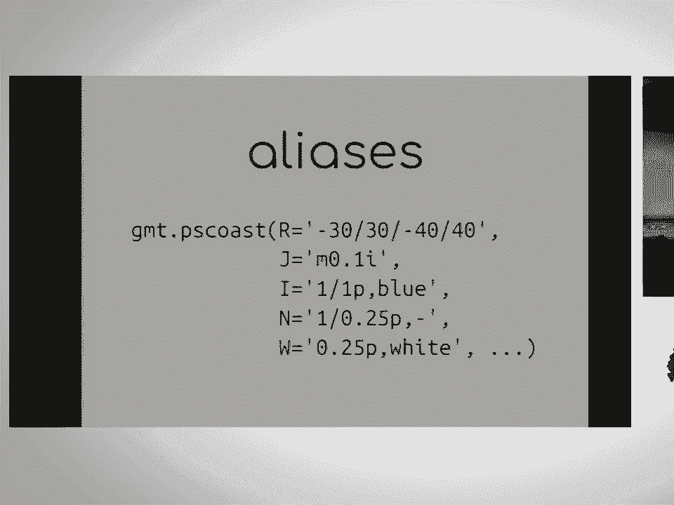

# 34：将通用制图工具引入 Python 🗺️




在本课程中，我们将学习如何通过一个名为 `gmt` 的 Python 库，将强大的通用制图工具（GMT）的功能引入 Python 环境。我们将了解该项目的背景、设计目标、核心实现方式，并学习如何使用它来创建地图。

---

## 概述

通用制图工具（GMT）是一个用于处理空间数据和制作高质量地图的命令行程序集合。它功能强大，但传统的命令行使用方式对于 Python 用户来说不够友好。本课程介绍的 `gmt` Python 库，旨在通过一个现代、Pythonic 的接口，让用户能够直接在 Python 脚本或 Jupyter Notebook 中使用 GMT 的全部功能。

上一节我们介绍了课程的整体目标，本节中我们来看看 GMT 是什么以及为什么需要 Python 包装器。

## GMT 简介

GMT 是一个 C 语言编写的命令行程序集合，主要用于处理空间数据。这些数据包括地震震中、海底地形等。GMT 可以进行球面数学计算，例如计算大圆距离和旋转，但它最著名的是能够制作非常精美和专业的地图。

GMT 项目历史悠久，首个版本发布于 1988 年，因此非常成熟和稳定。其制图细节处理得极为出色，这是其图形质量高的原因。在 GMT 5 版本中，项目引入了 C API，其命令行程序即基于此 API 构建。引入 C API 的目的就是为了方便在其他语言（如 MATLAB、Julia）上构建包装器。

## 项目动机与现有方案

在开始构建新的 Python 包装器之前，作者回顾了现有的几个 Python GMT 包装器。

以下是当时存在的几个 Python GMT 包装器：
*   **GMT Pi**：开发最为活跃，但自 2014 年起已停止更新。
*   **pi-gmt**（小写）：使用系统调用来运行命令行程序。
*   **PiGMT**（大写）：通过手写 Python C 扩展来连接 C API。

这些方案大多没有利用专为包装器设计的 C API，或者实现和分发过程非常复杂。因此，需要一个全新的、官方的解决方案。

## 项目目标

基于对现状的分析，新的官方 Python 包装器设定了明确的目标。

本项目的核心目标如下：
1.  **使用 C API**：直接通过 C API 进行包装，避免系统调用、进程管理和重定向。
2.  **提供 Pythonic 接口**：库的使用体验应像原生 Python 库，而不是在 Python 中编写命令行程序。
3.  **与 SciPy 技术栈集成**：能够方便地与 NumPy 数组、通过 xarray 或 netCDF4 库加载的 NetCDF 网格等数据进行交互。
4.  **面向现代与未来**：支持 Python 3.5+，并依赖即将发布的 GMT 6 版本，利用其新特性。

## GMT 6 的现代模式




新包装器将充分利用 GMT 6 中引入的“现代执行模式”，这极大地简化了工作流程。

为了理解现代模式的优势，我们将其与经典模式进行对比。在经典 GMT 模式中，用户需要编写类似 Shell 的脚本，手动管理 PostScript 代码的重定向和文件拼接，并使用 `psconvert` 进行格式转换，过程繁琐且容易出错。

现代模式通过引入新命令改变了这一流程。以下是现代模式脚本的关键组成部分：
```bash
gmt begin figure_name png  # 开始一个会话，并指定输出文件名和格式
gmt grdgradient ...
gmt makecpt ...
gmt grdimage ...
gmt pscoast ...
gmt psxy ...
gmt end  # 结束会话，自动完成转换和输出
```
现代模式的主要改进包括：
*   **自动会话管理**：`gmt begin` 和 `gmt end` 管理整个绘图会话。
*   **自动文件处理**：用户无需关心 PostScript 重定向和 `psconvert` 调用，GMT 会在后台自动处理。
*   **更清晰的逻辑**：移除了容易出错的 `-K`, `-O` 等参数。

这种模式使得从 Python 调用 GMT 变得像使用 Matplotlib 一样直观：你执行绘图命令，然后在需要时显示或保存图形。

## Python 包装器设计与演示

现在，让我们进入核心部分，看看如何将 GMT 的现代模式封装成 Python 库。

首先，需要导入库并初始化一个现代模式会话：
```python
import gmt
```
导入 `gmt` 库会自动调用 `gmt begin`，在临时目录中创建一个 GMT 会话。当 Python 会话结束时，它会自动清理。

接着，可以创建一个新图形并设置其名称（输出格式由后续的 `show` 或 `savefig` 决定）：
```python
fig = gmt.Figure()
```
然后，可以调用 GMT 模块对应的函数。所有 GMT 模块都作为 `gmt` 库的函数暴露出来。例如，绘制海岸线的命令 `pscoast` 对应函数 `gmt.pscoast`。参数可以通过 GMT 传统的单字母选项传入：
```python
gmt.pscoast(R="-30/30/-40/40", J="M6i", B="", G="chocolate")
```
但为了更符合 Python 风格，包装器提供了长格式的别名参数，使代码更易读：
```python
gmt.pscoast(region="-30/30/-40/40", projection="M6i", frame=True, land="chocolate")
```
参数也支持 Python 原生类型转换，例如区域（region）可以用列表指定：
```python
gmt.pscoast(region=[-30, 30, -40, 40], ...)
```
执行绘图命令后，图形并不会立即显示。需要调用 `show()` 方法在 Notebook 中显示，或调用 `savefig()` 方法保存为文件：
```python
fig.show()
# 或
fig.savefig("my_map.png")
```

## 如何参与贡献



这个项目需要社区的帮助才能快速发展。目前有超过 60 个 GMT 模块需要包装，工作量巨大。





以下是几种参与贡献的方式：
*   **包装模块**：任务包括从 GMT 手册复制文档到函数文档字符串、定义参数别名、编写测试等。
*   **构建 Conda 包**：目前 GMT 的 Conda 包仅支持 Linux。需要熟悉 macOS 和 Windows 平台 Conda 包构建的开发者帮助。
*   **提供反馈**：项目处于早期阶段，非常欢迎社区就 API 设计、功能特性等提出建议。


## 总结


在本节课中，我们一起学习了将 GMT 引入 Python 的官方项目。我们了解了 GMT 的基本情况、现有包装器的不足，以及新项目的目标和设计原则。我们重点探讨了 GMT 6 的现代模式如何简化绘图流程，并演示了如何使用新的 `gmt` Python 库以更 Pythonic 的方式创建地图。最后，我们看到了这个开源项目需要社区的支持，并介绍了参与贡献的途径。通过这个库，地球科学和地理空间领域的 Python 用户将能更轻松地利用 GMT 强大的制图能力。