# 1：Binder 2.0 - 下一代可复现科学环境 🚀

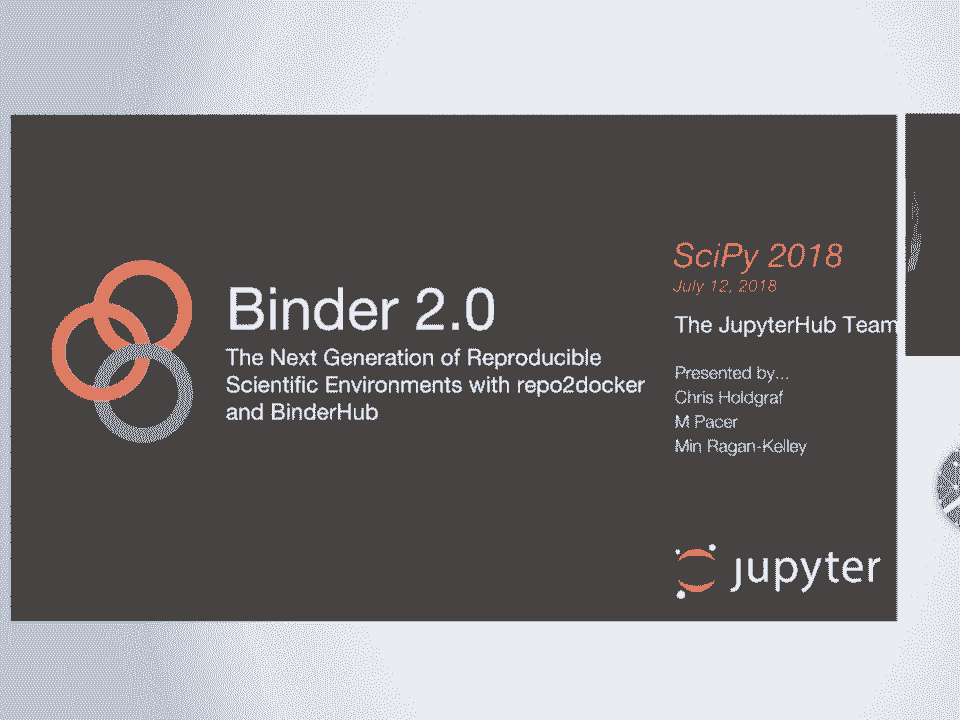

在本节课中，我们将学习 Binder 2.0 项目。Binder 是一个将代码仓库（如 GitHub 仓库）转换为可交互计算环境的工具，旨在促进科学研究的可复现性。我们将了解它的核心组件、工作原理以及它如何帮助科学家和研究者。

---

## 概述

Binder 项目致力于解决科学计算中的可复现性问题。它通过结合多种开源工具，允许用户仅通过一个链接，就能在浏览器中启动一个包含所有依赖项和数据的完整、可交互的计算环境。本节课将详细介绍 Binder 的架构、核心组件以及其背后的设计理念。

---

## 技术可复现性与实践可复现性

在深入 Binder 之前，我们需要区分两个概念：**技术可复现性**和**实践可复现性**。

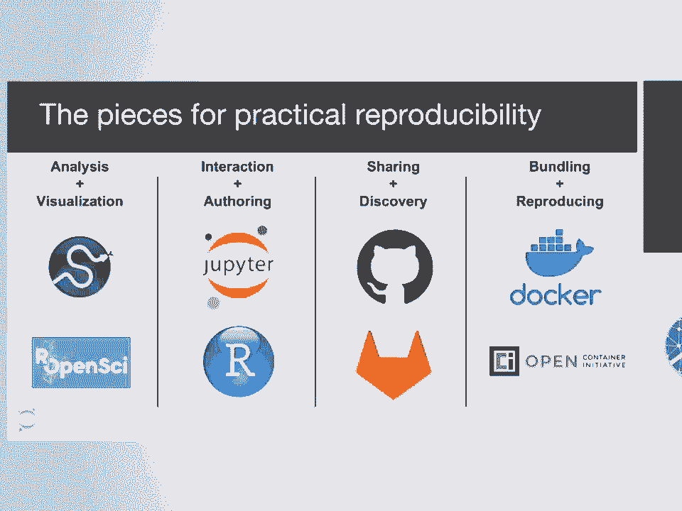

*   **技术可复现性**意味着理论上，只要找到正确的配置（如 Docker 文件），就能复现结果。但这通常需要深厚的计算机科学背景。
*   **实践可复现性**意味着即使没有计算机科学背景，也能复现他人的工作。Binder 的目标正是实现后者，让复现工作对广大科学家而言变得简单易行。

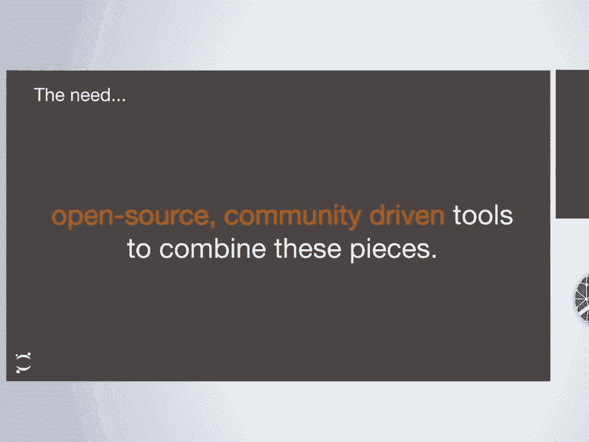

为了实现实践可复现性，需要将多种工具无缝整合。这正是 Binder 所做的。

---

## Binder 是什么？

Binder 主要由三个核心部分组成：

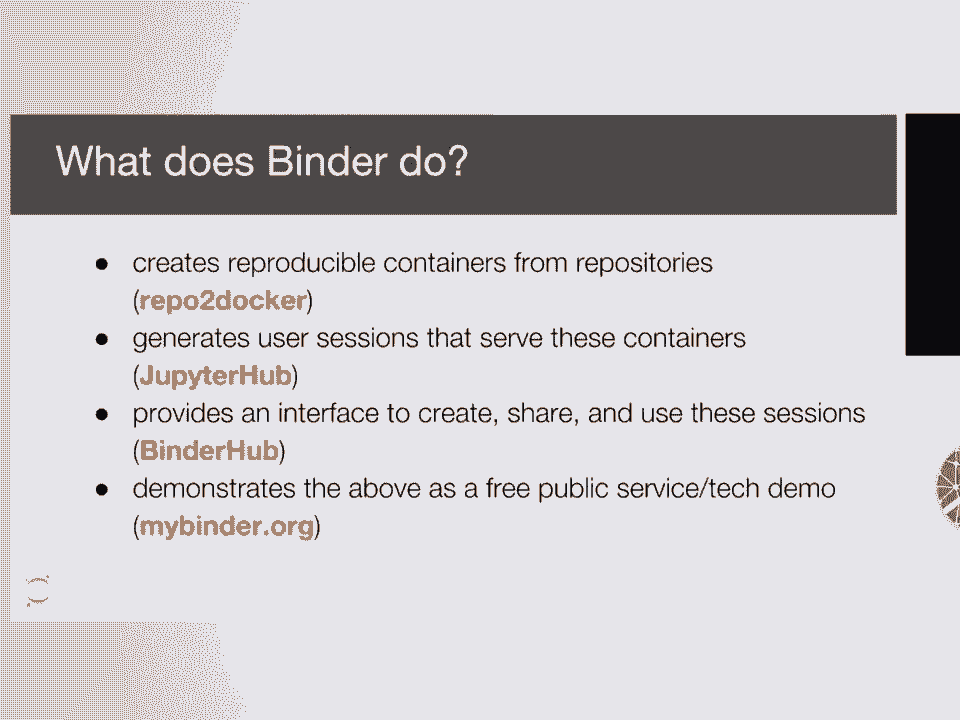

1.  **Repo2Docker**：一个将 Git 代码仓库自动构建为 Docker 镜像的工具。
2.  **JupyterHub**：一个多用户服务器，用于为每个用户生成和管理独立的 Jupyter 笔记本会话。
3.  **BinderHub**：一个协调整个流程（从构建镜像到启动用户会话）并提供用户界面的服务。

此外，`mybinder.org` 是一个由 Binder 团队运营的公共免费服务，作为该技术的示范。

---

## 用户视角下的 Binder

从用户角度看，Binder 的使用非常简单。例如，当 LIGO 团队发布其引力波探测论文时，他们同时提供了一个指向其 GitHub 仓库的 Binder 链接。

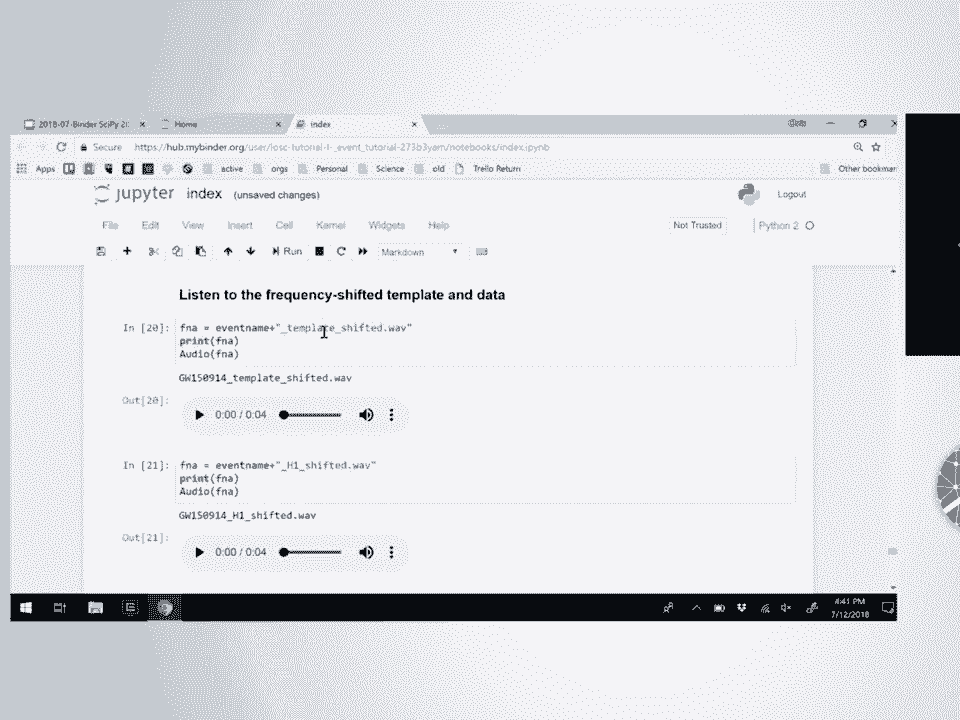

用户点击该链接后，会看到一个“正在加载 Binder”的页面。此时，Binder 正在后台根据仓库中的配置文件构建 Docker 镜像，并在 JupyterHub 上为用户启动一个会话。完成后，用户会直接进入一个包含所有代码、数据和环境的可交互 Jupyter 笔记本中。

仓库中通常包含定义环境的文件，例如：
*   `requirements.txt`：列出 Python 包依赖。
*   `runtime.txt`：指定所需的语言运行时版本（如 Python 2.7）。

在打开的笔记本中，所有代码都可以立即运行，生成论文中的图表，甚至允许用户与结果进行交互（如播放探测到的声音），这远胜于静态的 PDF 文件。

---

## Binder 的内部工作原理

上一节我们看到了 Binder 的用户界面，本节我们来深入了解其后台运作机制。

### Repo2Docker：从仓库到镜像

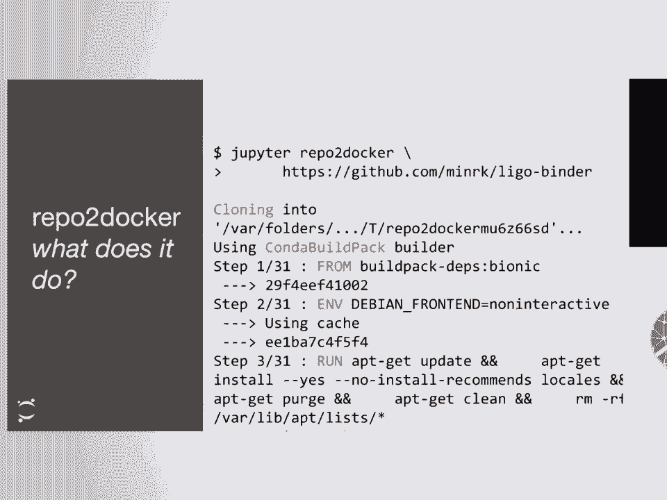

Repo2Docker 是 Binder 的核心，它是一个独立的项目。其理念是自动化人类为发布可复现环境所采取的步骤。

以下是运行 `jupyter-repo2docker` 命令后的主要步骤：

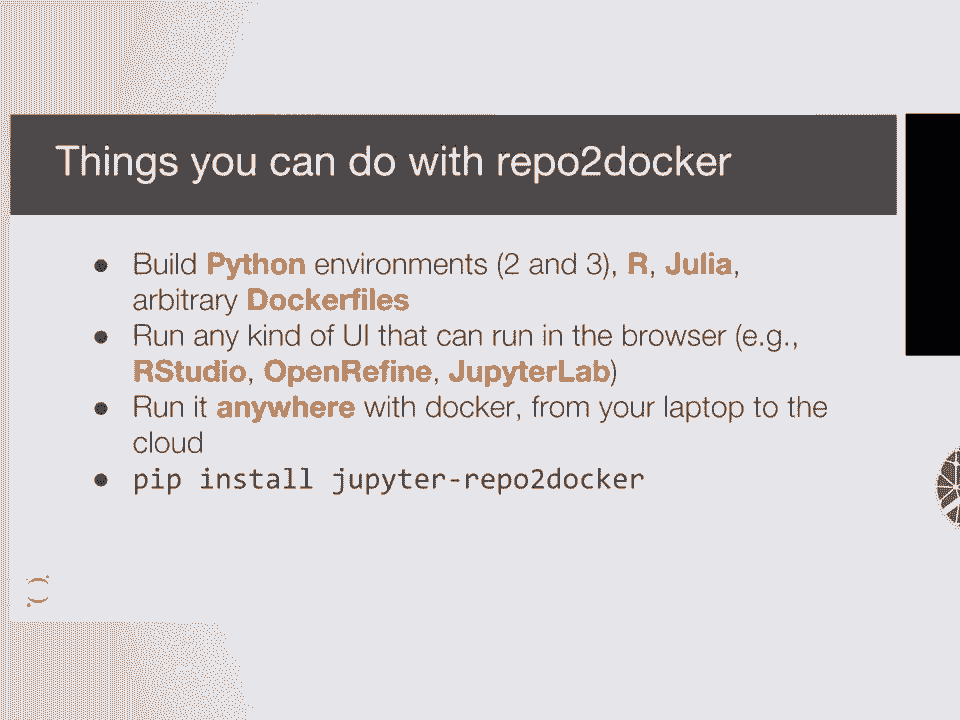

1.  **克隆仓库**：首先，工具会克隆指定的 Git 仓库。
2.  **检测环境**：分析仓库中的文件（如 `requirements.txt`, `environment.yml`, `install.R`），以确定需要安装哪些软件来运行代码。
3.  **生成 Dockerfile**：根据检测结果，创建一个用于构建环境的 Dockerfile 脚本。该脚本会：
    *   设置基础运行时环境（如 Conda、Julia、R）。
    *   将仓库内容添加到镜像中。
    *   运行特定的安装命令（如 `pip install -r requirements.txt`）。
4.  **构建与推送镜像**：使用 Dockerfile 构建 Docker 镜像，并可选择将其推送到镜像仓库以便分享。

Repo2Docker 支持多种环境：
*   **代码示例**：`jupyter-repo2docker https://github.com/your/repo`
*   **支持的语言/环境**：Python (Conda/Pip)、R、Julia，也支持自定义的 Dockerfile。
*   **可运行的应用**：不仅是 Jupyter 笔记本，任何带有 Web 界面的应用（如 RStudio, OpenRefine）都可以通过它来构建和运行。

### JupyterHub：多用户服务器管理

JupyterHub 是一个为多用户启动和管理独立 Jupyter 笔记本服务器的工具。其关键在于可插拔的**验证器**和**生成器**。

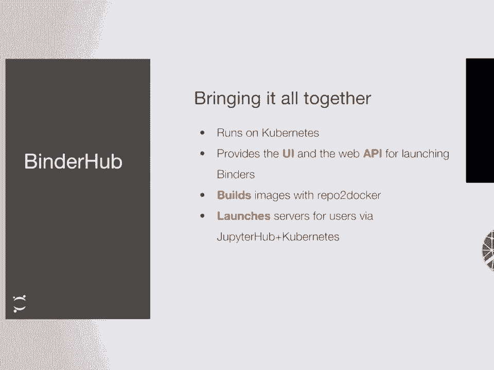

*   **生成器** 定义了如何为用户启动服务器。Binder 主要使用 **Kubernetes** 生成器，它可以在任何云提供商上运行，具有良好的可扩展性，这对于维持大型服务的运行和迁移至关重要。
*   社区已经提供了在 Kubernetes 上部署 JupyterHub 的成熟方案（如 `kubespawner` 和 `Zero to JupyterHub` 指南），这为 Binder 的可持续性提供了支持。

### BinderHub：流程协调与用户界面

BinderHub 负责提供用户访问的网页界面（即 `mybinder.org` 上的加载页面和表单）。它的主要职责是协调整个流程：

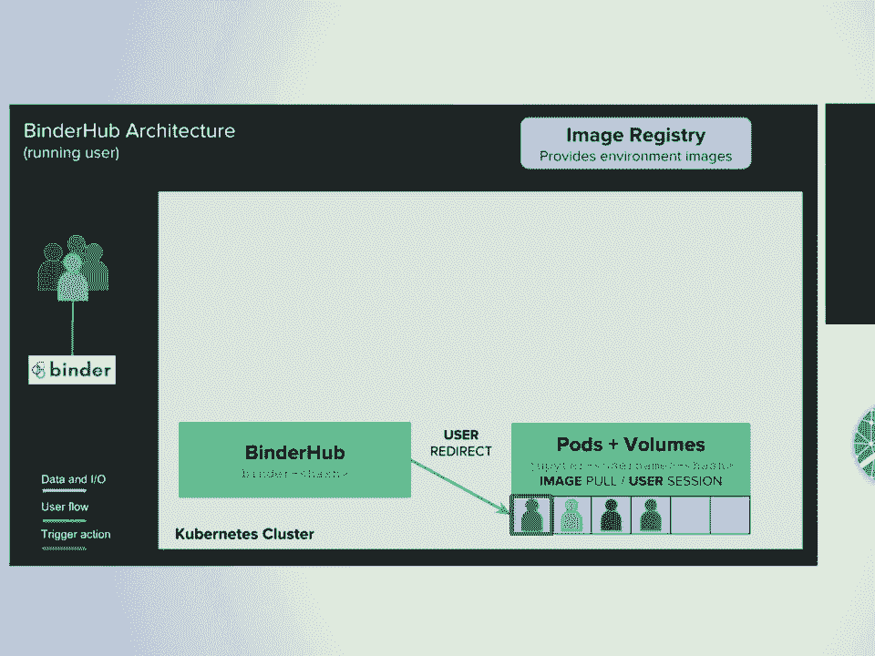

1.  接收用户请求（指定仓库和版本）。
2.  询问 Repo2Docker 构建对应镜像（如果尚未构建）。
3.  将构建好的镜像推送到镜像仓库。
4.  请求 JupyterHub 为该镜像启动一个用户服务器。
5.  将用户重定向到运行中的服务器。

整个交互流程可以概括为：
`用户浏览器 -> BinderHub -> Repo2Docker / JupyterHub -> Kubernetes -> 用户会话`

---

## MyBinder.org：公共示范服务

Binder 的目标是能够在任何地方部署。`MyBinder.org` 是 Binder 团队运营的一个公共免费服务，既服务于科学社区，也作为 BinderHub 技术的示范。

该服务表现出极高的受欢迎度，用户遍布全球几乎每个国家，这体现了其在提升计算分析可及性方面的价值。

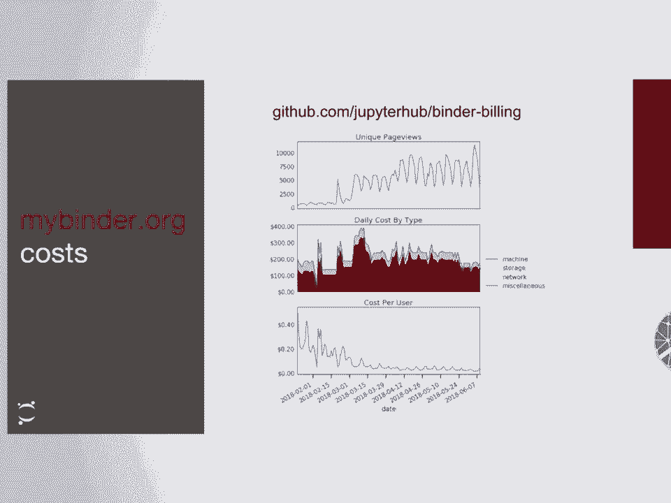

为了保持透明和开放，`MyBinder.org`：
*   **公开监控数据**：在 `grafana.mybinder.org` 上实时展示服务状态、用户数量、热门仓库等信息。
*   **关注可持续性**：团队致力于探索可持续的计算服务模式。通过优化和利用 Kubernetes 的弹性伸缩，目前 `MyBinder.org` 的运营成本已降至约 **每用户每天 1-2 美分**。团队也公开每月的云服务账单。

---

## 未来展望

Binder 团队对未来发展充满期待，主要集中在两个方向：

1.  **促进项目可持续性与广泛部署**：
    *   鼓励在共享计算设施（如国家级超算中心）上部署 BinderHub，供多机构使用。
    *   探索 **BinderHub 联邦** 模式，让多个 Binder 实例共存并相互感知，用户可以根据资源需求或机构认证选择不同的节点启动环境（例如 `binder.berkeley.edu`）。

2.  **扩展技术能力与社区**：
    *   **支持更复杂的科学工作流**：探索如何连接大型数据集或高性能计算资源。
    *   **完善可复现性规范**：制定指南，帮助用户评估和提升其仓库的可复现性等级。未来计划允许用户**固定 Repo2Docker 的版本**，以确保构建环境的一致性。
    *   **持续壮大社区**：吸引更多部署者、维护者和实践者加入，共同推动可复现科学和交互式教育的发展。

---

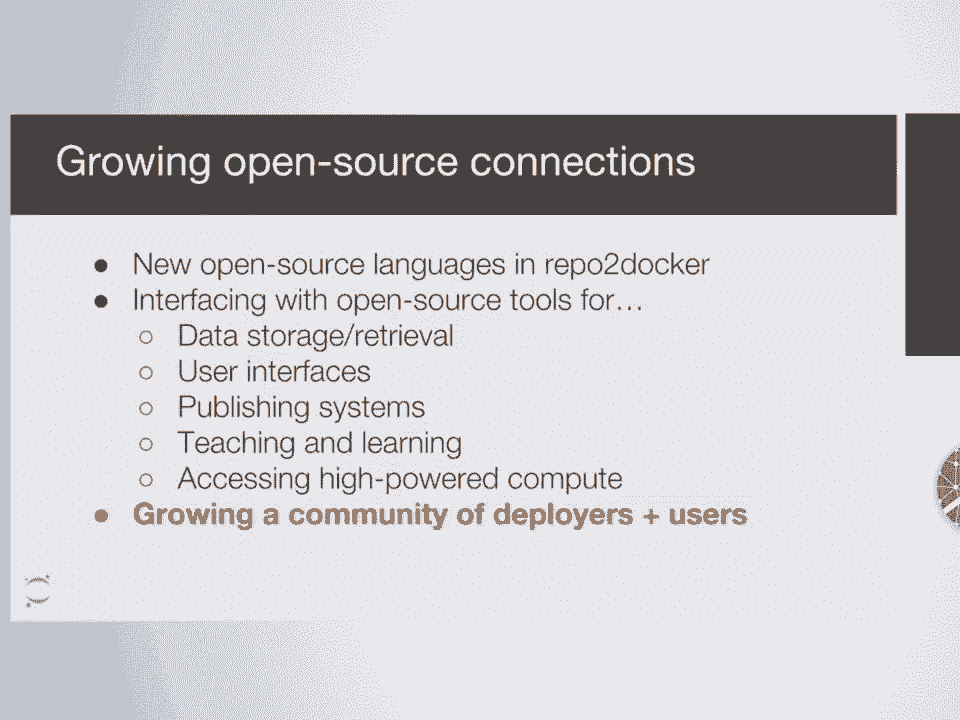

## 总结

本节课我们一起学习了 Binder 2.0，一个旨在实现**实践可复现性**的强大工具。我们了解了它的三个核心组件：**Repo2Docker**（自动构建环境）、**JupyterHub**（管理用户会话）和**BinderHub**（协调流程）。通过 `mybinder.org` 这个实例，我们看到了它如何降低科学计算的门槛，让全球用户都能轻松访问和交互式地复现研究成果。Binder 不仅是技术栈的整合，更代表着一种推动科学更加开放、协作和可复现的社区努力。

---

## 如何参与？

如果你对 Binder 感兴趣，可以通过以下方式参与：
*   **幻灯片链接**：[bit.ly/scipy-2018-binder](https://bit.ly/scipy-2018-binder)
*   **交流社区**：
    *   JupyterHub Gitter 聊天室
    *   Binder 项目 Gitter 聊天室
*   **邮件列表**：Jupyter 生态系统的相关邮件列表。
*   **部署指南**：参考 `Zero to Jupyter Hub` 等指南，学习如何在 Kubernetes 上部署你自己的 JupyterHub 或 BinderHub。

---

## 问答精选

*   **问**：如何防止用户滥用免费服务（如挖矿）？
    *   **答**：通过防火墙规则、网络策略限制可用端口，并屏蔽已知的恶意行为（如加密货币挖矿）。机构在自建部署时还可以增加身份认证门槛。

*   **问**：Binder 构建的环境能保证 20 年后还能运行吗？
    *   **答**：完全保证长期复现性是一个尚未解决的全局性挑战。Binder 以代码仓库作为“配方”，其可复现程度取决于用户遵循的最佳实践（如固定所有软件包版本）。团队正在努力允许用户固定 Repo2Docker 的版本，以确保构建过程的一致性。最终，环境的长期有效性还依赖于底层系统（如 Ubuntu LTS 镜像）的维护周期。