# 2：Jupyter 交互式可视化与仪表盘构建 🎨


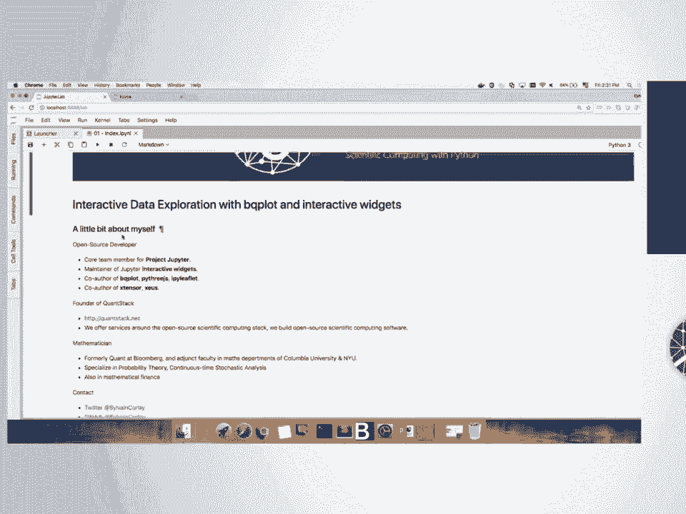

在本节课中，我们将学习如何利用 Jupyter 生态中的一系列工具，特别是 `bqplot` 和 `ipywidgets`，来创建无缝的交互式数据可视化和仪表盘。我们将从核心概念讲起，逐步深入到具体库的应用和高级功能。

---

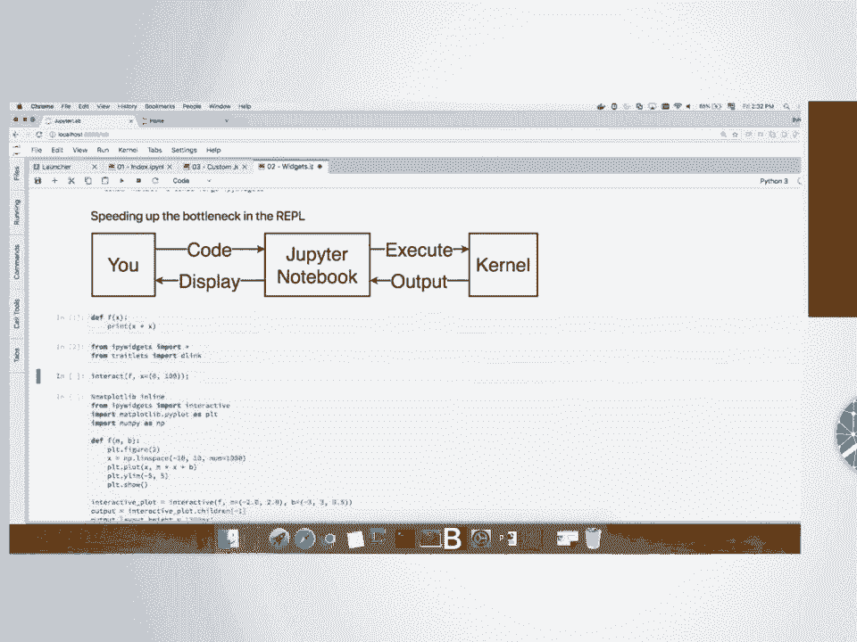

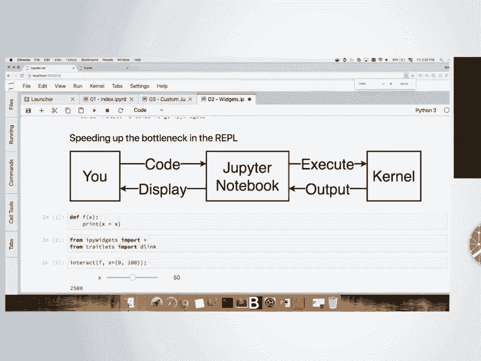

## 概述

Jupyter 笔记本不仅是数据分析的工具，也是构建交互式应用和可视化界面的强大平台。这一切的核心是 **Jupyter Widgets** 框架，它允许前端（浏览器）与后端（Python 内核）进行双向通信。

上一节我们介绍了课程的整体目标，本节中我们来看看 Jupyter Widgets 的基本概念。

### Jupyter Widgets 简介

Jupyter Widgets 的初始目标是复现 Sage 和 Mathematica 中的 **Interact** 功能。Interact 利用 Python 的内省特性：你传入一个函数，它会根据参数的默认值推断类型，并自动生成一个简单的图形界面（GUI），让你能够与该函数交互，并查看不同参数值下的结果。

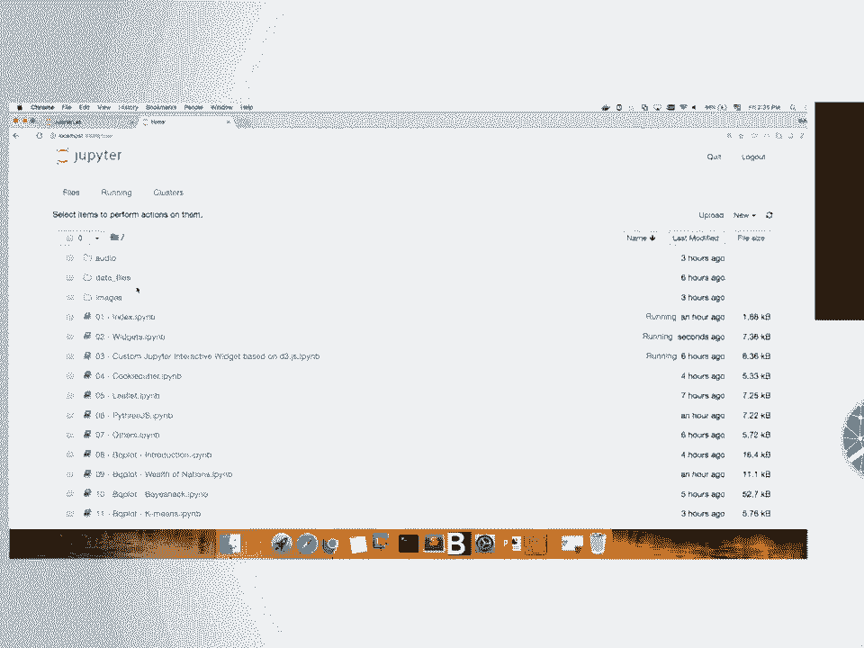

为了构建更复杂的应用，我们开发了功能更强大的 **Jupyter 交互式小部件**。它们是一种特殊对象，当在 Jupyter 笔记本中显示时，会呈现一个可交互的图形组件。其核心思想是**双向通信**：前端的状态变化会同步到后端，反之亦然。

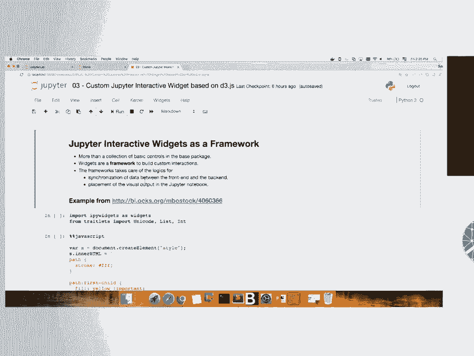

以下是一个简单的交互示例，它创建了一个滑块，其值变化会触发函数重新计算并更新输出：

```python
import ipywidgets as widgets
from IPython.display import display

def f(x):
    return x * x

slider = widgets.IntSlider(value=5, min=0, max=10)
output = widgets.interactive(f, x=slider)
display(output)
```

更重要的是，`ipywidgets` 不仅仅是一组控件（如复选框、颜色选择器），它还是一个**框架**，可用于构建自定义的可视化组件。

---

## 基于 Widgets 的可视化库

理解了基础框架后，我们可以利用它来集成各种强大的 JavaScript 可视化库到 Jupyter 环境中。

以下是几个基于 `ipywidgets` 构建的流行可视化库：

*   **ipyleaflet**：连接 Jupyter 与 Leaflet.js 库，用于创建交互式地图。支持平移、缩放、切换图层以及添加 GeoJSON 数据。
*   **pythreejs**：连接 Jupyter 与 three.js 库，用于创建基于 WebGL 的快速 3D 可视化。它是一个通用的场景描述包，功能非常灵活。
*   **ipympl (Jupyter Matplotlib)**：将 Matplotlib 的交互功能带入 Jupyter 笔记本，允许在 JupyterLab 中使用交互式 Matplotlib 图形。
*   **ipyvolume**：用于 3D 体积和符号数据可视化的库（本课程下一节将详细介绍）。
*   **nglview**：用于蛋白质和分子可视化的库。

---

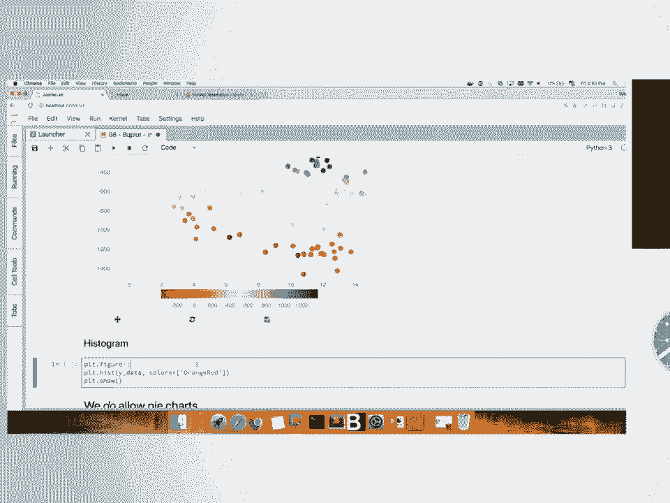

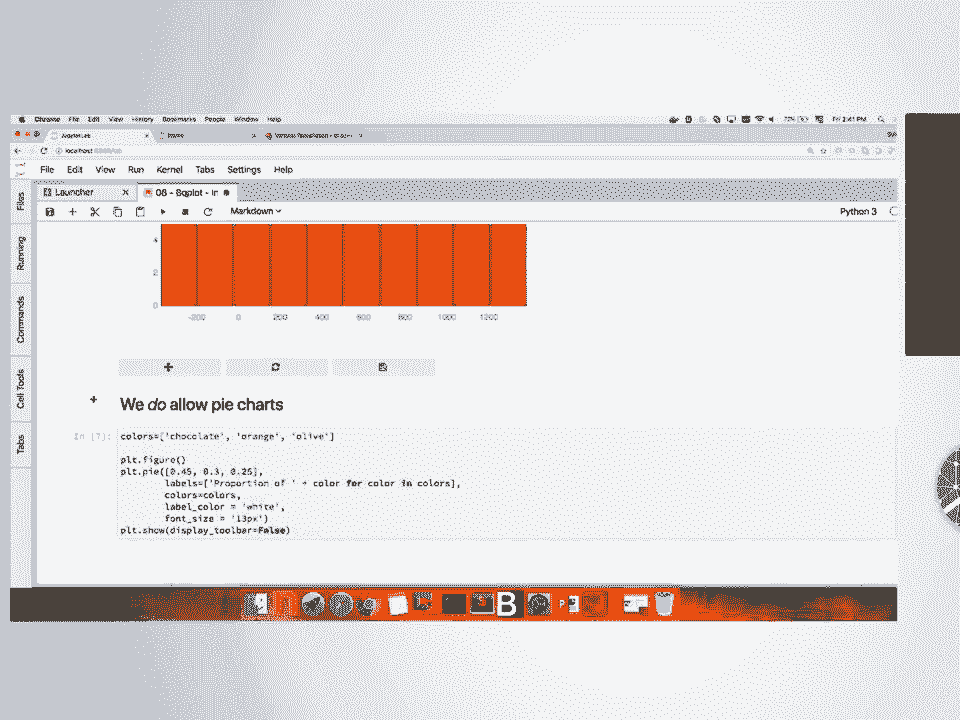

## 核心库：bqplot 📊

现在，让我们聚焦于本节课的核心库：**bqplot**。

bqplot 是一个基于 Jupyter Widgets 的交互式绘图库。它有两个关键特点：
1.  实现了 **Wilkinson 图形语法** 的抽象概念。
2.  提供了类似 **ggplot2** 的高级 API，用于快速创建常见图表。

### bqplot 的特性

所有 bqplot 图表都是完全交互式的，支持平移和缩放。

以下是 bqplot 支持的一些图表类型示例：
*   **折线图与散点图**
*   **直方图**
*   **地图**
*   **饼图**
*   **热力图**

### 图形语法与组件化

bqplot 的强大之处在于其组件化架构。图形语法中的核心概念，如**比例尺（Scales）**、**坐标轴（Axes）** 和**标记（Marks）**，都被实现为独立的、可互操作的 widget。

这意味着你可以像搭积木一样自定义图表。例如，创建一个共享 Y 轴比例尺但拥有不同 X 轴比例尺的复合图表：

```python
import bqplot as bq
import numpy as np

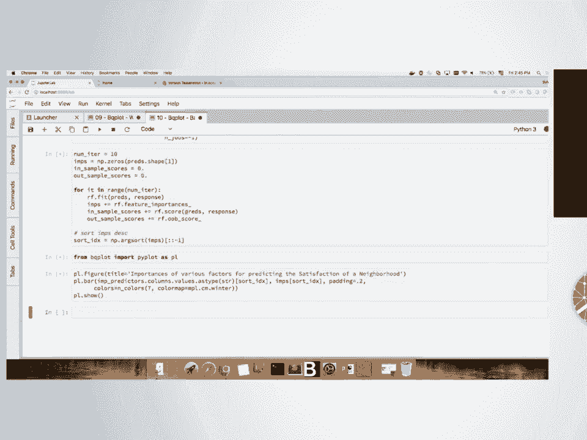

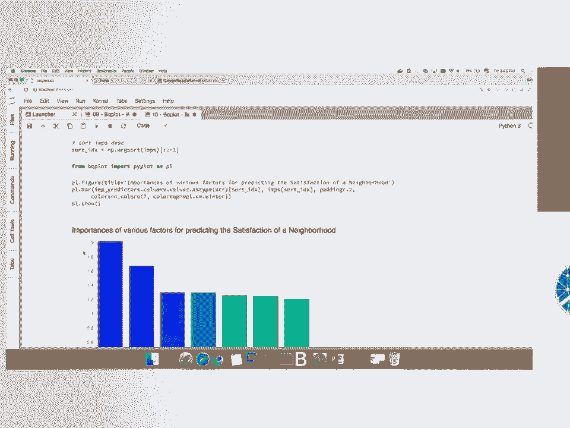

# 创建比例尺
x_scale1 = bq.LinearScale()
x_scale2 = bq.LogScale() # 不同的X轴比例尺
y_scale = bq.LinearScale() # 共享的Y轴比例尺

# 创建坐标轴
ax_x1 = bq.Axis(scale=x_scale1, label='线性X轴')
ax_x2 = bq.Axis(scale=x_scale2, label='对数X轴', side='top')
ax_y = bq.Axis(scale=y_scale, orientation='vertical', label='共享Y轴')

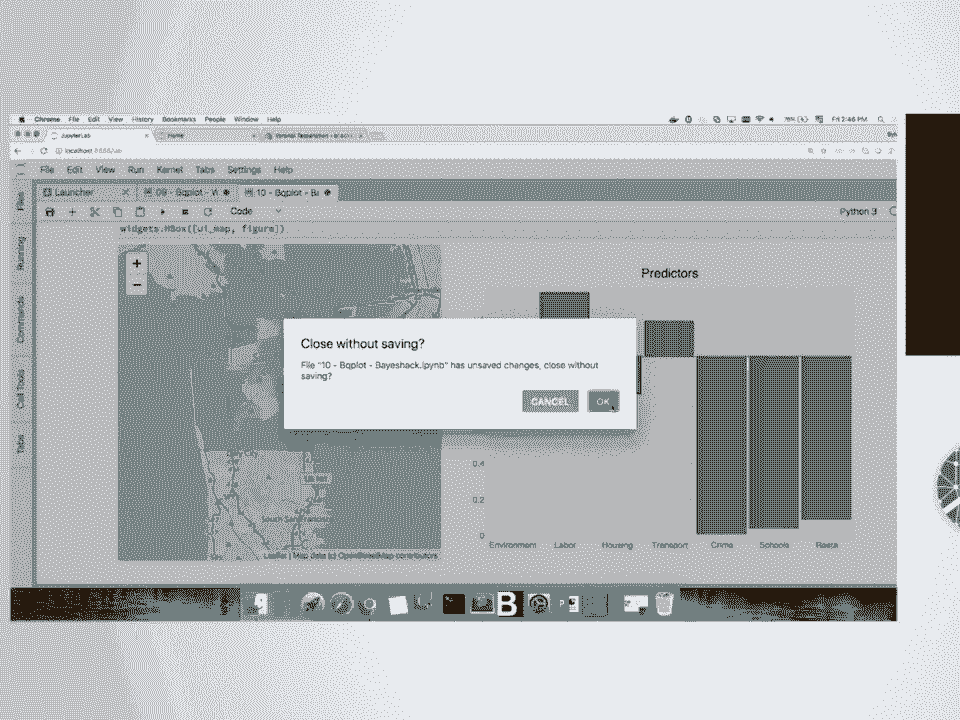

# 创建标记（数据）
line1 = bq.Lines(x=np.arange(10), y=np.random.randn(10), scales={'x': x_scale1, 'y': y_scale})
line2 = bq.Lines(x=np.arange(1, 100), y=np.random.randn(99)*100, scales={'x': x_scale2, 'y': y_scale})

# 组合成图形
fig = bq.Figure(marks=[line1, line2], axes=[ax_x1, ax_x2, ax_y])
fig
```

当你修改任何一个组件（如线条颜色、比例尺范围）的属性时，图表会立即更新。这种响应式设计使得探索性数据分析和应用构建非常高效。

### 高级交互：选择与绘图

bqplot 图表本身可以作为输入控件。例如，你可以添加**区间选择器**，当用户拖动选择器时，图表上被选中的数据点会高亮，并且选择器的值会同步到 Python 后端。


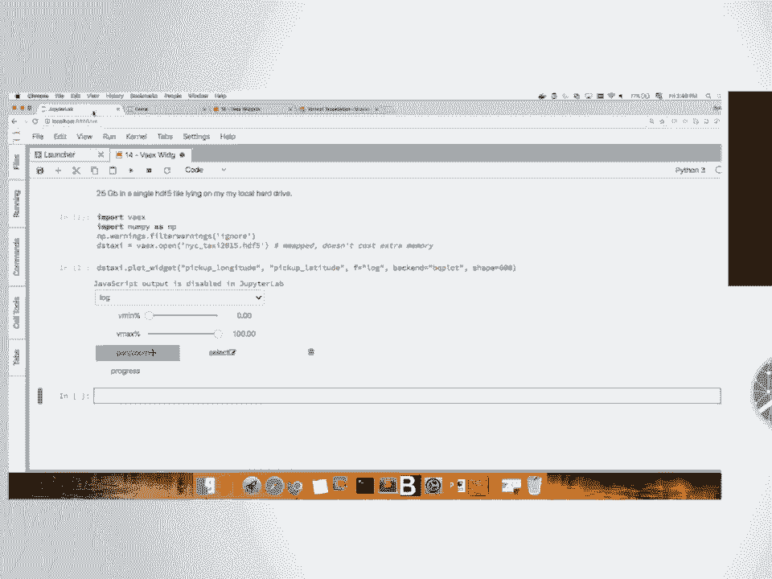

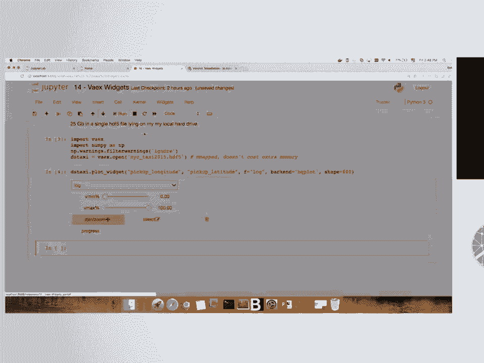

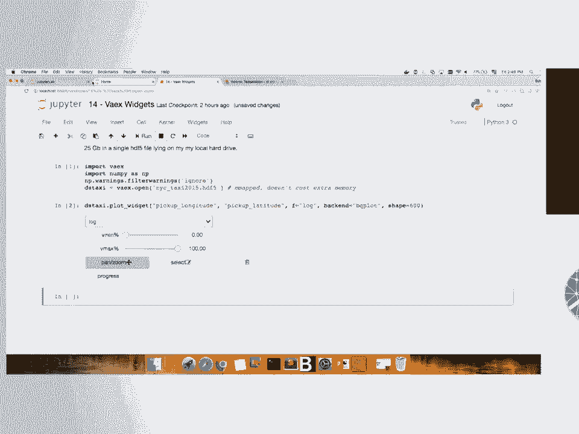

另一个有趣的交互是**在图表上绘图**。你可以定义一个依赖于函数形状的分析，然后直接在笔记本中绘制该函数，分析结果会随之实时更新。

---

## 处理大规模数据

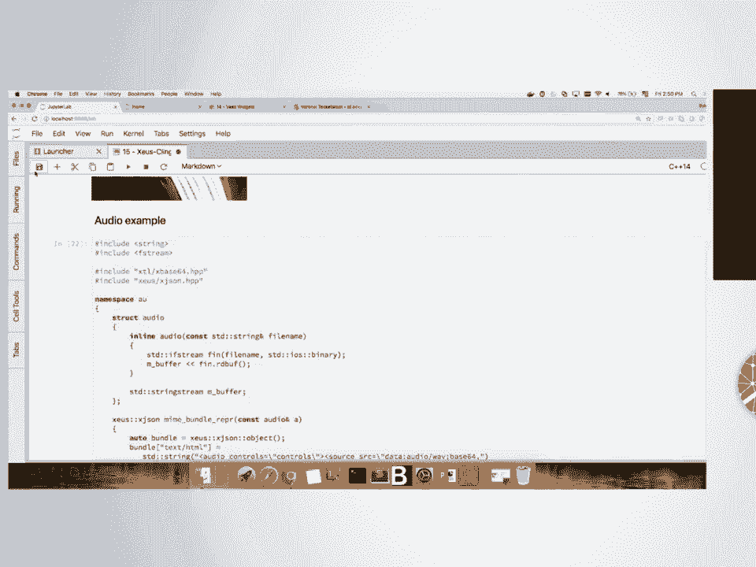


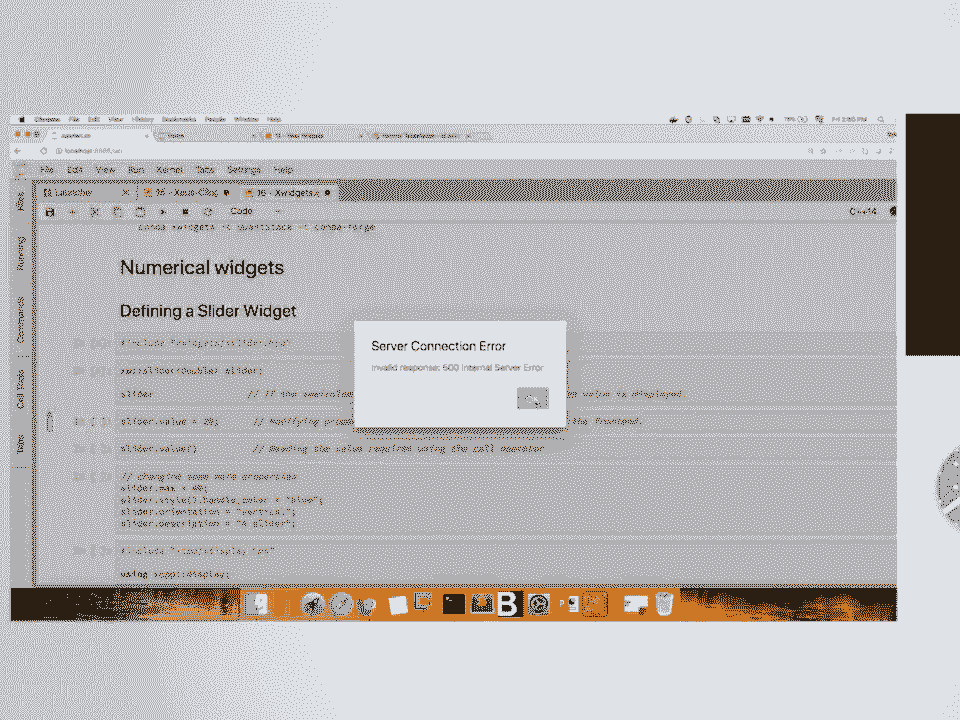

长期以来，基于 SVG 的 bqplot 在处理超大数据集时存在性能瓶颈。这个问题正在被解决。

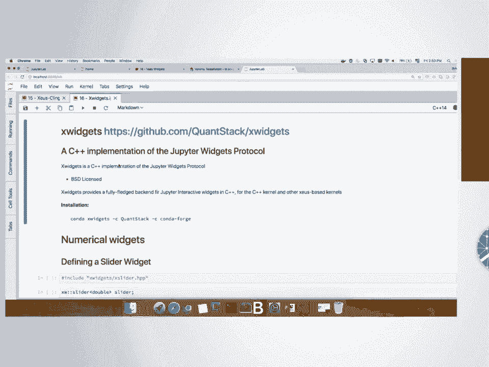

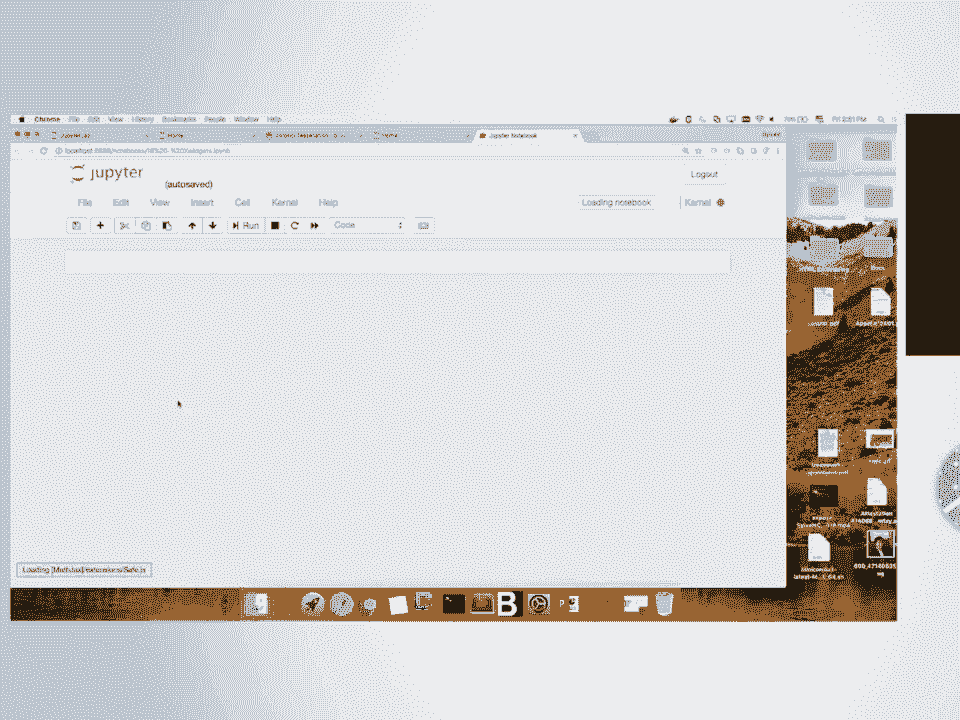

新版本引入了 **Mega Marks** 概念，支持渲染包含数十万甚至上百万个数据点的散点图。这得益于 widgets 基础设施开始支持二进制序列化格式，大幅提升了数据传输效率。

对于亿级甚至更大规模的数据，可以采用 **Vega** 等数据抽稀引擎，在渲染前对数据进行聚合或采样，以保持交互的流畅性。

---

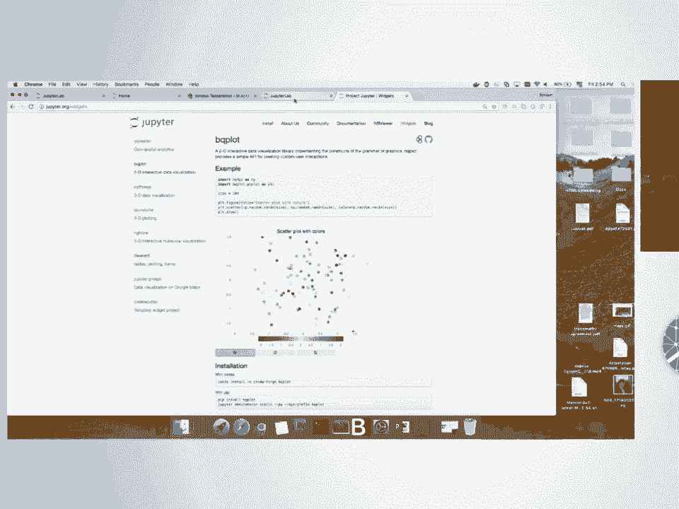

## 未来展望与 Zeus 项目

在课程的最后，我们简要展望了 Jupyter Widgets 生态的未来，特别是 **Zeus** 项目。

Zeus 是 Jupyter 协议的 **C++ 实现**。它本身不是一个内核，而是一个用于更轻松构建内核的工具。基于 Zeus，团队创建了 **C++ 内核**（使用 CERN 的 Cling 解释器），使得可以在 Jupyter 中交互式地运行 C++ 代码。

更重要的是，Zeus 带来了 **xwidgets** 后端，允许用 C++ 创建 widget。这意味着像 bqplot、ipyleaflet 这样的可视化库，其核心逻辑可以用 C++ 编写一次，然后为 Python、Julia 等多种数据科学语言提供绑定，避免重复实现，并有望提升性能。

---

## 总结

本节课中我们一起学习了：
1.  **Jupyter Widgets** 的核心概念及其双向通信机制。
2.  基于此框架构建的一系列交互式可视化库，如 `ipyleaflet`、`pythreejs` 和 `ipympl`。
3.  核心库 **bqplot**，它是一个实现了图形语法的交互式绘图系统，支持通过组件化方式构建和自定义图表，并具备丰富的交互功能。
4.  bqplot 在处理**大规模数据**方面的最新进展。
5.  对未来生态的展望，特别是 **Zeus 项目** 如何通过 C++ 实现促进多语言支持和性能提升。

通过结合这些工具，你可以在 Jupyter 笔记本中创建出功能丰富、响应迅速的交互式数据可视化和完整的仪表盘应用。