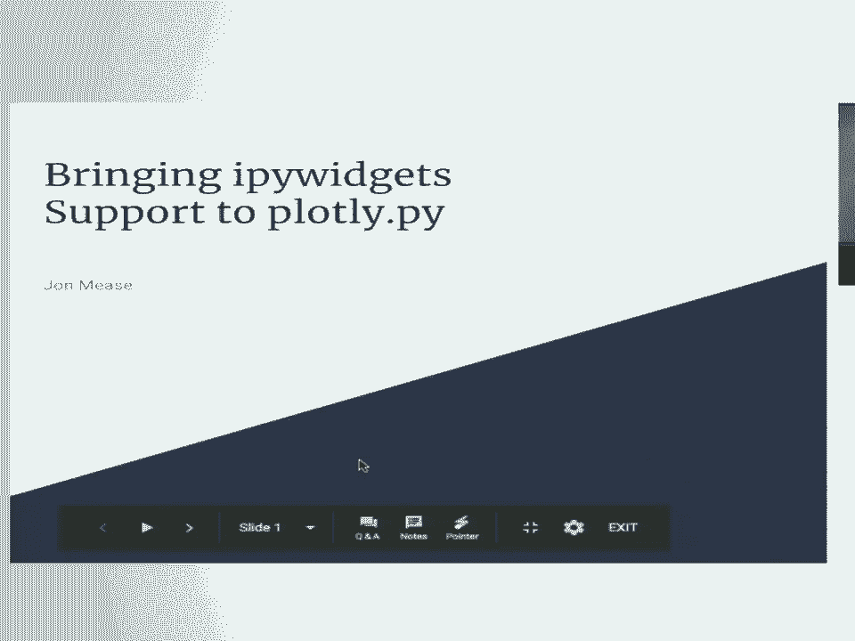
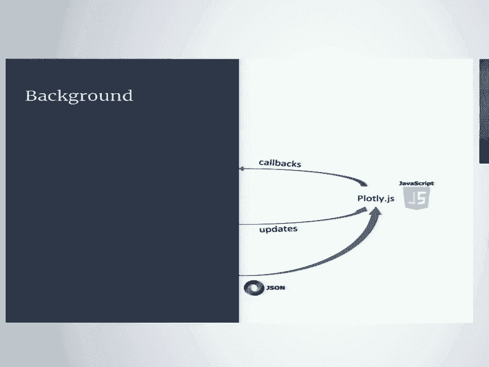
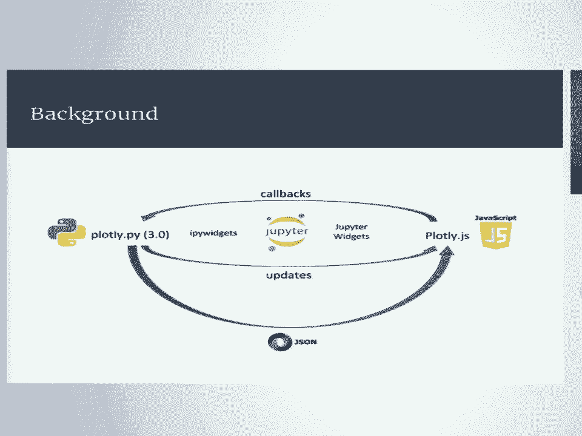
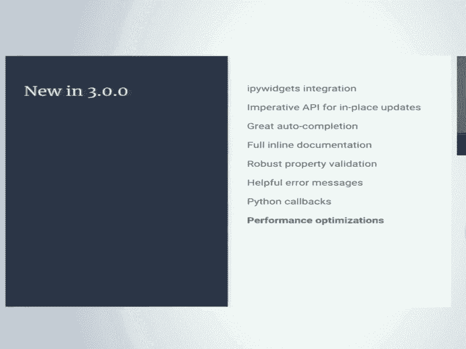
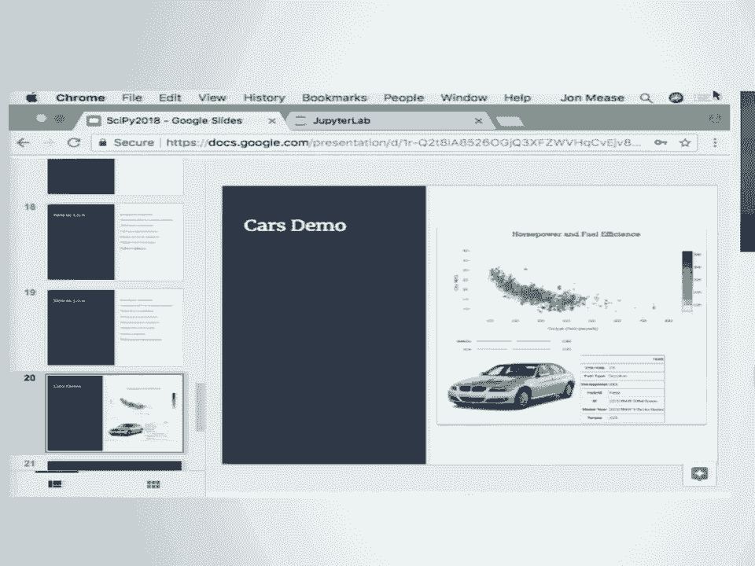
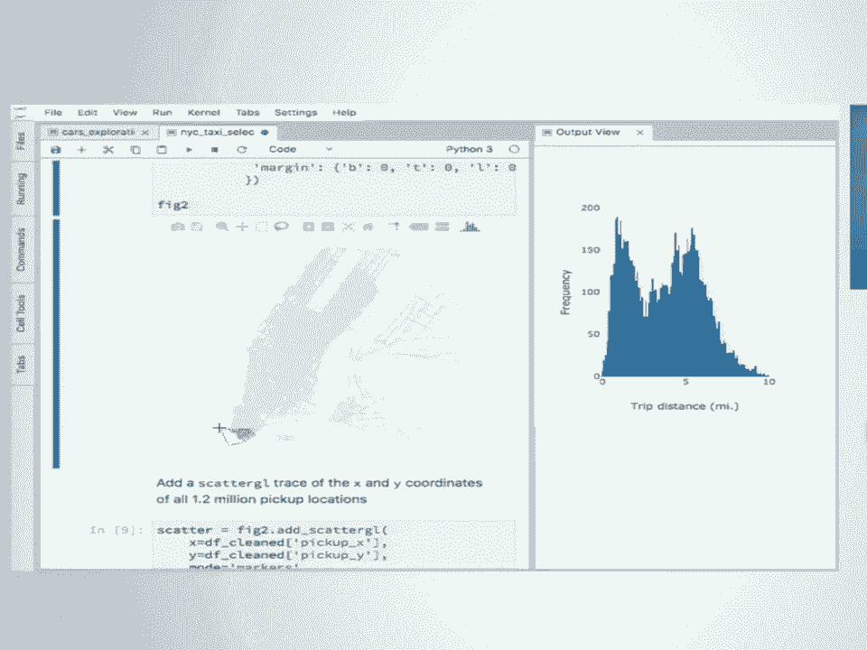
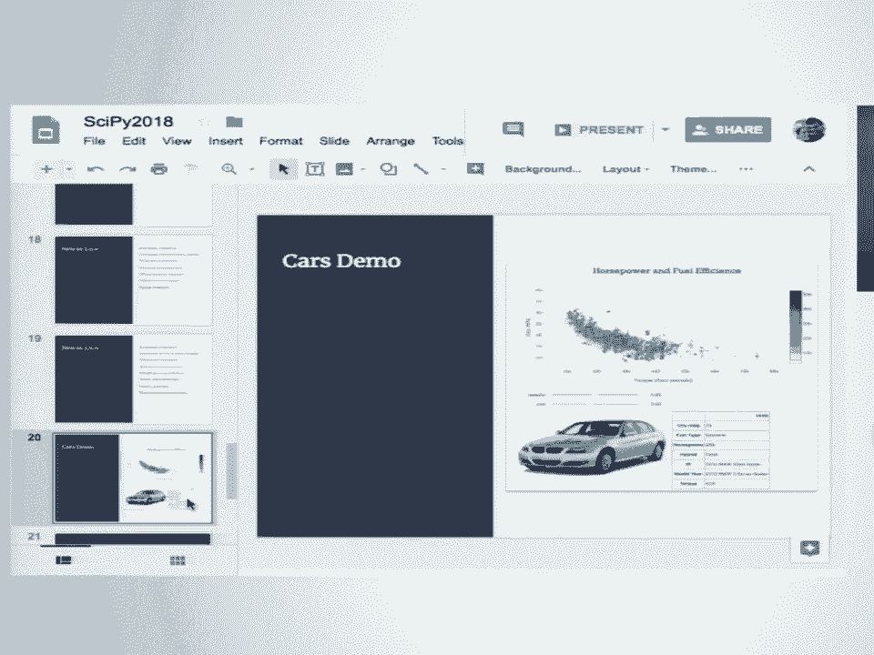
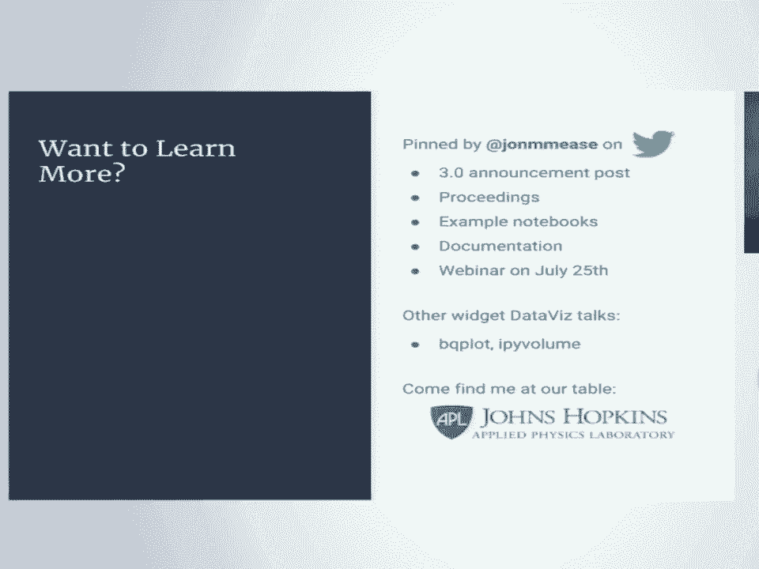

# 3：为 plotly.py 添加 ipywidgets 支持 📊




在本节课中，我们将学习如何通过将 plotly.py 与 ipywidgets 框架集成，来创建高度交互式的数据可视化。这种集成使得我们能够在 Jupyter Notebook 中动态更新图表，并实现 Python 与 JavaScript 之间的双向通信。


---

## 🧑‍💻 演讲者介绍

我是 John Mease。我在米勒斯维尔大学完成了物理学和数学的本科学习，随后在约翰斯·霍普金斯大学完成了计算机科学的研究生工作。目前，我在约翰斯·霍普金斯大学应用物理实验室担任数据科学家和软件开发员。我的一个主要兴趣是将 Python 开源数据科学生态系统中的优秀工具应用于我们最具挑战性的工程和分析问题。为此，我成为了几个开源项目的贡献者，包括 pandas、dask，以及现在的 plotly。



---

## 🏗️ 背景知识

上一节我们介绍了演讲者的背景，本节中我们来看看本次演讲所涉及的核心技术背景。



**Plotly.js** 是一个基于 D3 和 WebGL 的 JavaScript 数据可视化库。它支持非常广泛的可视化类型，涵盖统计、科学、金融、地理和三维用例。该库最初由 Plotly Technologies 公司开发，作为其商业可视化产品的核心组件，但在 2015 年根据 MIT 许可证开源，此后一直在 GitHub 上积极开发。

需要明确的是，今天展示的所有内容都基于开源技术，完全免费、自包含，不需要账户，可以离线使用。Plotly.py 与 Plotly Cloud 服务的集成完全是可选的。

Plotly.js 是一个声明式可视化库。这意味着每个可视化都由一个 JSON 规范完全定义。此外，该库提供了一个非常强大的 API，用于就地更新现有可视化，并注册回调函数以响应用户交互事件，如点击、悬停、选择等。

---





## 🔄 Plotly.py 与 ipywidgets 的集成

上一节我们了解了 Plotly.js，本节中我们来看看其 Python 接口 plotly.py 是如何与 ipywidgets 框架结合的。

**Plotly.py** 是用于构建这些声明式可视化规范的 Python 库。在版本 3 之前，这是一个单向、一次性的过程。你会使用 plotly.py 构建规范，然后将其传递给 plotly.js 来显示图表。这要么发生在 notebook 的输出单元格中，要么发生在独立的 HTML 文件中。创建可视化后，无法更新其显示，也无法将 JavaScript 端的事件信息带回 Python 运行时。

这就是 **ipywidgets 框架** 发挥作用的地方。该框架为支持后端 Python 内核与前端 Jupyter notebook 环境之间的属性双向同步提供了强大的构建模块。

我所做的是为 Plotly.js 创建了一个新的 Python ipywidget，然后在 Plotly 团队的帮助下，将其集成到 plotly.py 的 3.0 版本中。

关于技术实现细节，本次演讲就讲到这里。如果你对实现过程感兴趣，请查阅我的论文，其中详细介绍了消息传递、架构等内容。

以下是版本 3 中一些新特性的快速总结：
*   **一流的 ipywidgets 支持**：这是基石，使得在 notebook 中显示图表并就地更新成为可能。
*   **新的命令式属性分配 API**：用于实现上述更新。
*   **出色的自动补全和内联文档**：覆盖整个 Graph Objects API。
*   **更强大的属性验证**：验证失败时会提供非常有帮助的错误信息。
*   **Python 回调支持**：得益于 ipywidgets 集成，现在可以从 JavaScript 前端获取信息回 Python 内核，从而支持用户定义的 Python 函数来响应点击、悬停和选择等事件。
*   **性能优化**：该版本利用了 widgets 协议中的一些优化，大大提高了处理大型数组时的性能。

---

## 🚀 实战演示：探索性数据分析工作流

在介绍了核心概念后，现在让我们通过一个真实的探索性数据分析工作流，来看看这些功能的具体表现。

我们将分析一个包含约 5000 辆汽车的燃油效率、马力、扭矩、燃料类型等信息的汽车数据集。为了使分析更有趣，我还通过简单的网络爬虫抓取了每辆车描述对应的首个谷歌图片搜索结果。

首先，我们使用新的 `FigureWidget` 类创建第一个图表，这是一个扭矩与每加仑英里数的散点图。

```python
# 示例：创建 FigureWidget 散点图
import plotly.graph_objs as go
figure_widget = go.FigureWidget(data=[go.Scattergl(x=torque_data, y=mpg_data)])
figure_widget
```

创建图表后，我们可以使用新的命令式属性分配 API 来动态修改它，例如添加标题和轴标签。这些更改会立即反映在图表上，无需重新构建。

```python
# 示例：动态更新图表属性
figure_widget.layout.title = '扭矩 vs. 燃油效率'
figure_widget.layout.xaxis.title = '扭矩'
figure_widget.layout.yaxis.title = '英里/加仑 (MPG)'
```

利用 JupyterLab 的“为输出创建新视图”功能，我们可以将图表拖到侧边面板，方便一边编写代码一边观察图表变化。

为了处理数据点重叠的问题，我们可以通过调整散点图的属性（如不透明度和点大小）来优化显示。

```python
# 示例：调整散点图标记属性
scatter_trace = figure_widget.data[0]
scatter_trace.marker.opacity = 0.2
scatter_trace.marker.size = 4
```

当需要反复调整某个参数（如不透明度）时，就是使用 ipywidgets 交互式控件的好时机。我们可以快速创建一个控制面板来动态调整这些参数。

```python
# 示例：创建交互式控件调整参数
import ipywidgets as widgets
from IPython.display import display

@widgets.interact(opacity=(0.0, 1.0, 0.05), size=(1, 10))
def update_scatter(opacity=0.2, size=4):
    scatter_trace.marker.opacity = opacity
    scatter_trace.marker.size = size

# 显示控件
display(update_scatter)
```

为了更深入地理解数据，我们可以添加一个 2D 等高线直方图来显示数据密度分布，并与原始散点图叠加。

更强大的功能是**自定义悬停信息**和**Python回调**。我们可以设置当鼠标悬停在某个数据点上时，不仅显示基本坐标，还能在一个独立的 HTML 表格中展示该数据点对应的所有行数据，甚至显示对应的汽车图片。

```python
# 示例：使用 on_hover 回调更新外部组件
import pandas as pd
from IPython.display import HTML

# 创建用于显示信息的 HTML 组件
html_widget = widgets.HTML()
display(html_widget)

# 定义悬停回调函数
def hover_callback(trace, points, state):
    index = points.point_inds[0]
    row_df = original_dataframe.iloc[[index]]  # 获取对应行
    html_table = row_df.to_html(classes='table table-striped')
    html_widget.value = html_table

# 将回调函数绑定到散点图 trace
scatter_trace.on_hover(hover_callback)
```

通过 ipywidgets 的布局容器，我们可以轻松地将图表、控制面板、信息表格和图片组合成一个交互式的分析仪表板。

---

## ⚡ 处理大规模数据

上面的例子处理了中等规模的数据，接下来我们看看这个框架如何处理大规模数据集。

我们使用纽约市出租车数据集的一个子集（约 120 万次行程）进行演示。首先，我们创建一个直方图来显示行程距离的分布。

```python
# 示例：为大规模数据创建直方图
large_figure = go.FigureWidget()
large_figure.add_histogram(x=trip_distances)
large_figure
```

即使有 120 万个数据点，直方图的渲染和后续的属性更新（如修改标题）也非常迅速。这是因为框架只同步发生变化的属性，而不是每次都重建整个图表。

接着，我们创建一个包含 120 万个点的散点图来显示上车地点。使用 `Scattergl`（WebGL 加速）可以流畅地渲染和交互。

```python
# 示例：大规模散点图
large_figure.add_scattergl(x=pickup_lons, y=pickup_lats,
                           mode='markers',
                           marker=dict(size=4, opacity=0.1))
```

最令人印象深刻的是**交互性能**。我们可以流畅地缩放和平移这张包含百万级点数的地图。此外，我们还可以利用 `on_selection` 回调机制：当用户在地图上用套索工具选择一部分区域时，可以触发一个 Python 函数，并更新另一个直方图，显示被选中行程的距离分布，从而实现复杂的联动分析。

```python
# 示例：使用 on_selection 回调实现图表联动
def selection_callback(trace, points, selection):
    # points 包含被选中的数据点索引
    selected_distances = trip_distances[points.point_inds]
    # 更新另一个直方图组件的数据
    histogram_widget.data[0].x = selected_distances

scatter_trace.on_selection(selection_callback)
```

---





## 📝 总结与资源

本节课中我们一起学习了如何利用 plotly.py 与 ipywidgets 的深度集成，在 Jupyter 环境中创建高度交互式和动态的数据可视化。



核心要点包括：
1.  **双向同步**：`FigureWidget` 实现了 Python 与图表视图之间的状态自动同步。
2.  **命令式 API**：允许在创建图表后动态修改任何属性。
3.  **强大的回调**：通过 `on_hover`、`on_selection` 等将前端交互事件绑定到 Python 函数。
4.  **卓越性能**：即使处理百万级数据点，也能保持流畅的渲染和交互。
5.  **提升工作流**：将可视化变为可操作的分析工具，而非静态图片，极大地加快了数据探索和洞察的速度。

**如果你想了解更多：**
*   演讲者 Twitter (`@johnmease`) 上提供了公告帖子、论文、示例 Notebook 和文档的链接。
*   可以关注关于 `bqplot` 和 `ipyvolume` 的演讲，它们是数据可视化作为 widget 这一领域的先驱。
*   Plotly 社区论坛和开发者支持计划可以提供帮助。

---

## ❓ 问答环节

**问：** 现在是否更容易基于点击或按钮事件来更新图表中的数据？
**答：** 是的。就像演示中通过属性分配为散点图添加新数据一样，你可以轻松地根据交互来替换或更新整个数据集。

**问：** 如何将包含这些交互式 widget 的 Notebook 分享给非 Python 用户（例如导出为 HTML）？
**答：** 对于完全独立的 HTML 文件，可以使用 plotly.py 现有的方法（如 `plotly.offline.plot`）导出。对于 widget 视图本身的导出，需要进一步咨询 ipywidgets 团队，但 plotly 本身也支持传统的导出方式。

**问：** 哪个功能对你的工作流改善最大？
**答：** 能够获取悬停和选择信息并传回 Python 端，这一功能是激励我开始这项工作的关键。

**问：** 在哪里可以找到演示中使用的示例 Notebook？
**答：** 可以在演讲者的 GitHub 主页 (`johnmease`) 上找到名为 “ipywigets-example-notebooks” 的仓库。


**问：** Plotly 公司对此功能的支持程度如何？何时会有官方文档？
**答：** 此功能已得到 Plotly 公司的支持并集成到核心库中。关于文档，确保现有文档兼容新版本是第一步，后续会尽快添加新功能的文档。用户可以通过社区论坛和开发者支持计划获取帮助。