# 4：科学发现中的数据可视化 🎨

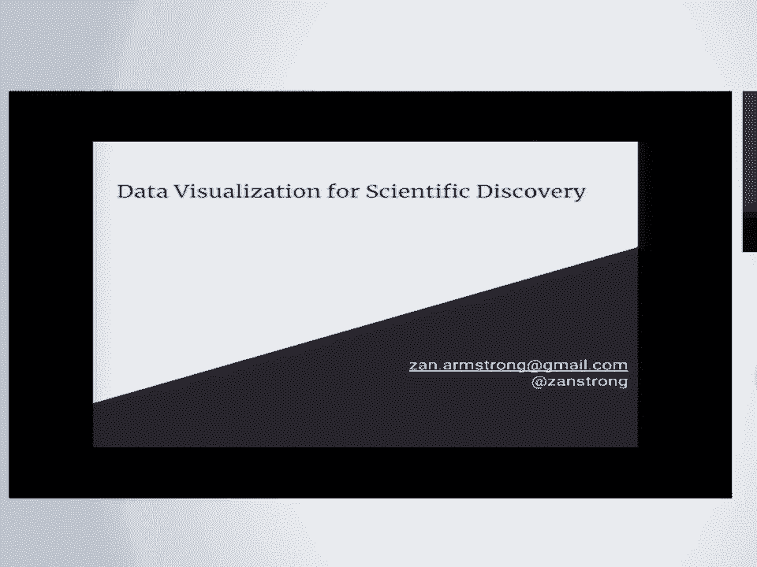

在本节课中，我们将学习如何通过数据可视化来促进科学发现。我们将探讨三个核心原则：创建小型多图、有意识地使用颜色，以及为你的时间、精力和注意力优化图表。我们将摒弃“好”与“坏”的简单二分法，转而关注如何根据具体目标、上下文和约束条件来设计有效的可视化。

---

## 可视化没有绝对的好坏，一切取决于你的目标、背景和约束

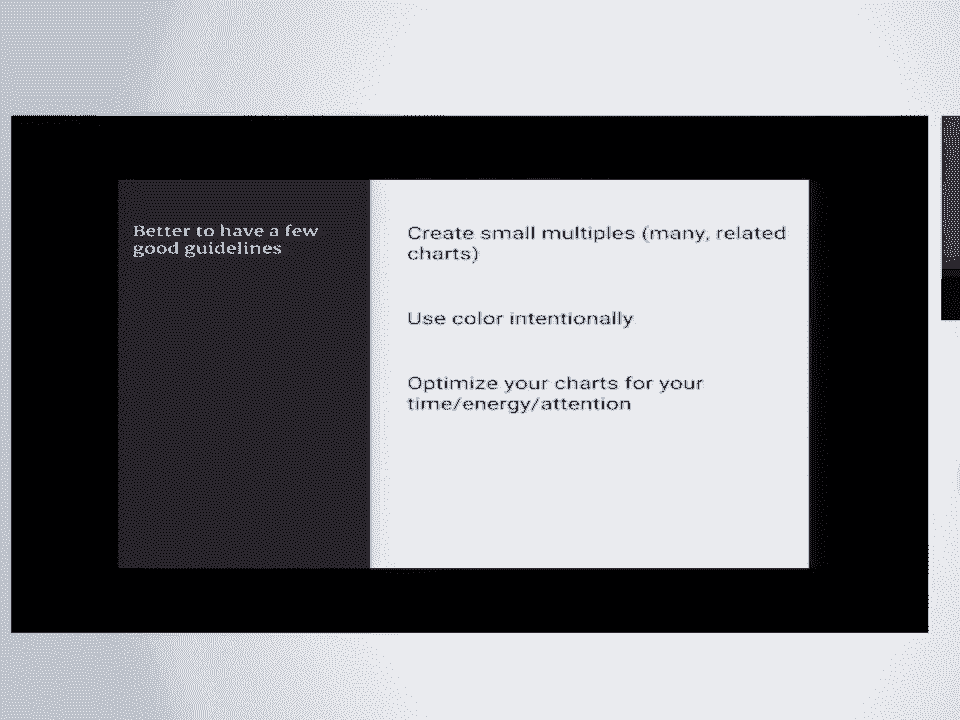

上一节我们提到了数据可视化的常见“规则”，但本节中我们来看看为什么这些规则并非绝对真理。

可视化是否“好”，取决于你的目标、背景和约束条件。这就像食物一样：一块巧克力棒是好是坏？如果你在家喝茶，它可能不健康；但如果你在巴塔哥尼亚进行为期一周的徒步旅行，它提供的额外糖分可能至关重要。

对于可视化也是如此。例如，这两张图表都基于同一组关于婴儿出生时间的数据。哪一张更好？这取决于：可视化的目的是什么？制作时间有多少？受众是谁？是用于沟通还是用于探索发现？

即使在科学发现领域，这两张图表也展示了同一组来自加州海岸传感器的风速和风向数据。哪一张更好？右边的图表可能更直观，因为它体现了风向的循环性和风速的长度感，但数据重叠严重，难以深入观察和比较。因此，答案依然是：视情况而定。

我们通常将可视化分为两大类：**沟通** 和 **科学分析与发现**。在分析与发现中，又可分为探索模式（尝试各种可能性）和流水线模式（处理新批次数据）。这两种模式提出了不同的问题：
*   **沟通**：能否吸引受众？是否忠于数据且不具误导性？信息是否传达清楚？
*   **分析与发现**：需要多少时间和精力？如果数据中有重要信息，你是否能注意到？提出任何问题有多困难？这个工具会经常使用吗？学习曲线是否可以接受？

其中，“如果数据中有重要信息，你是否能注意到？”这一点在科学中至关重要。你不想错过任何发现的“金块”。为了确保看到真正重要的东西，我们甚至可以接受偶尔将不重要的东西误判为重要，因为后续还会有更多分析。你的时间和精力是最宝贵的资源。

因此，总结来说，可视化没有绝对的好坏，它完全取决于你的目标、背景和约束。这也适用于工程、机器学习和统计学领域。正如统计学中没有“最佳”算法一样，可视化中也没有“最佳”图表，只有最适合你当前任务的图表。

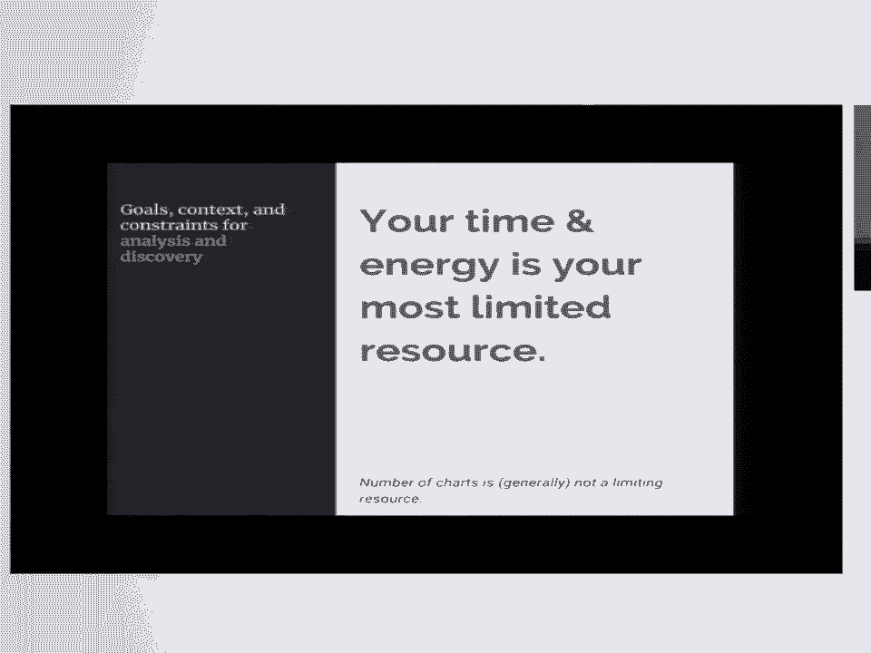

---

## 原则一：创建小型多图 📊

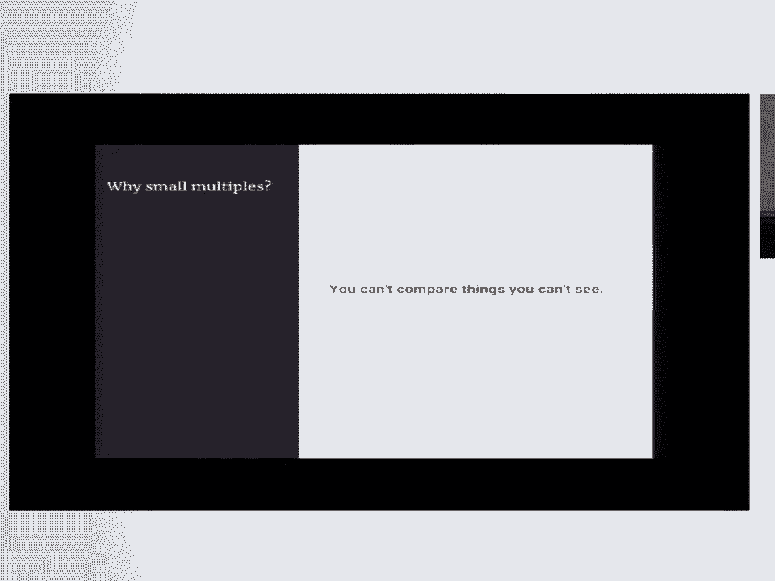

上一节我们讨论了可视化的评判标准，本节中我们来看看第一个核心原则：创建小型多图。

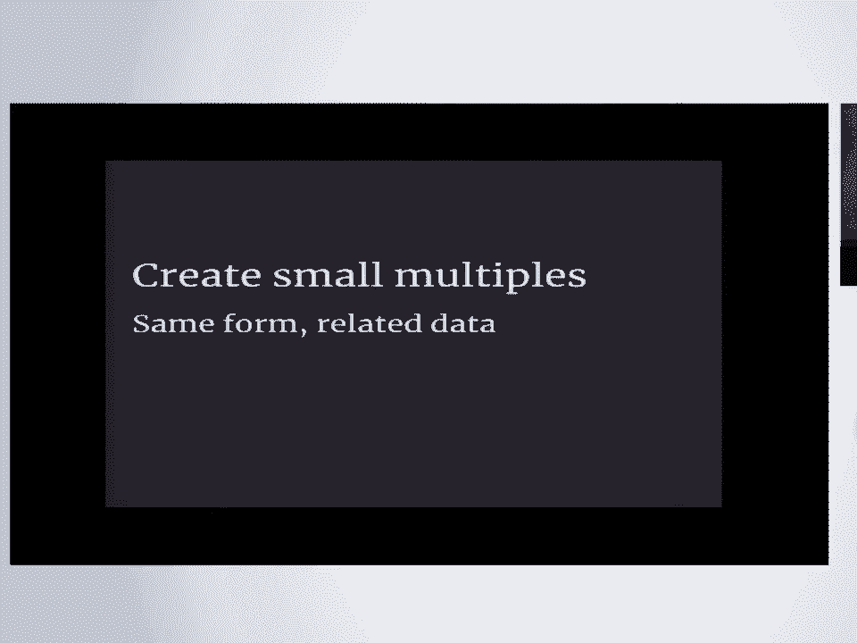

小型多图是指**许多彼此相似、可以同时查看的小型图表**。例如，这是德克萨斯州三个城市的风向（30度角）和风速热图。

为什么要使用小型多图？因为你无法比较你看不到的东西。

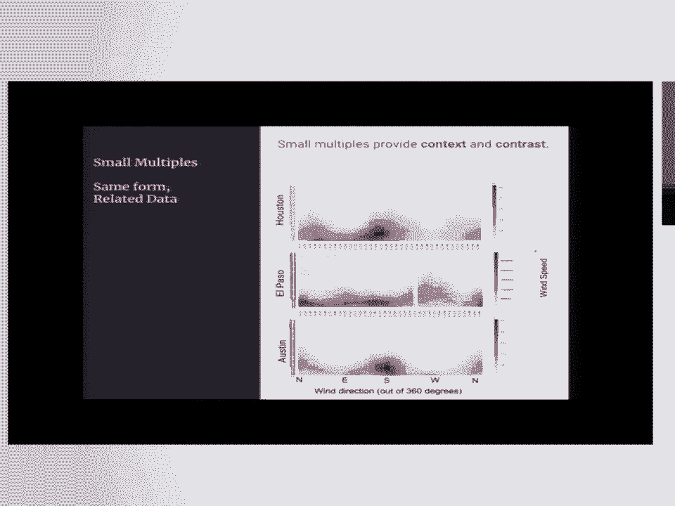

以下是关于小型多图的两种思考方式：

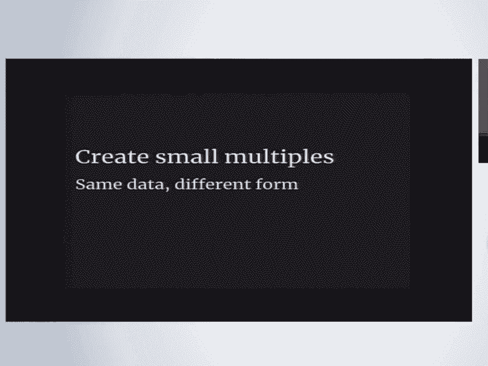

### 1. 相同形式，相关数据

假设我们研究德克萨斯州风向与风速的关系，并拥有该州几个机场的数据。我们可以制作一张包含所有数据的图表，但通过分别查看这三个城市的图表，我们能学到更多。我们可以开始发现共同点和差异点，从而对德克萨斯州整体有更丰富的了解。这种多图方式实际上比单张图表更容易解读。

### 2. 相同数据，不同形式

我们还可以创建数据完全相同但图表形式不同的小型多图。例如，研究奥斯汀市风向与温度的关系。我们可能会先制作一张散点图，但由于数据点过多（三年内每15分钟一个数据点），存在严重的重叠问题。这时，我们可以尝试不同的透明度设置（如完全不透明、10%透明、1%透明），同时查看这三种版本。每种图表都能提供互补的信息，在分析阶段，同时查看它们可能比只选一个“最佳”图表更有价值。

对于直方图也可以采用类似方法。例如，同时查看奥斯汀、休斯顿和埃尔帕索三个城市使用不同带宽（5度和1度）绘制的温度直方图，可以帮助我们更稳健地观察数据分布。

**以下是创建小型多图的资源：**
*   Matplotlib: `subplots`
*   Seaborn: `FacetGrid`
*   Altair: `trellis`
*   Plotly: （演讲者未具体说明，但Plotly也支持类似功能）

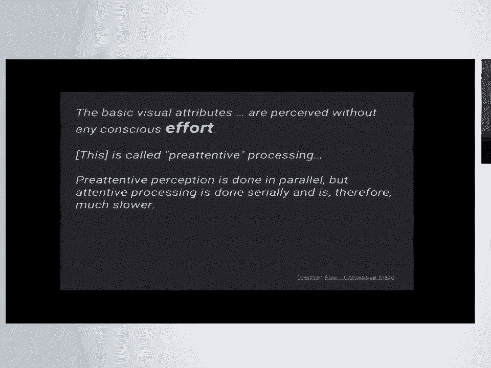

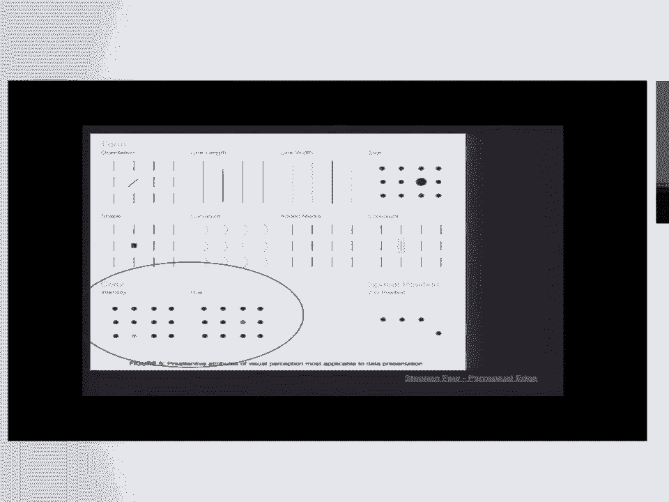

---

## 原则二：有意识地使用颜色 🎨

上一节我们介绍了小型多图，本节中我们来看看如何有意识地使用颜色来优化可视化效果。

我们处理信息的方式分为两种：**前注意处理** 和 **注意处理**。前注意处理是并行、无意识的，速度极快；而注意处理是串行、有意识的，速度较慢。我们希望通过前注意处理让重要信息“跳”出来，从而节省我们的时间和精力。

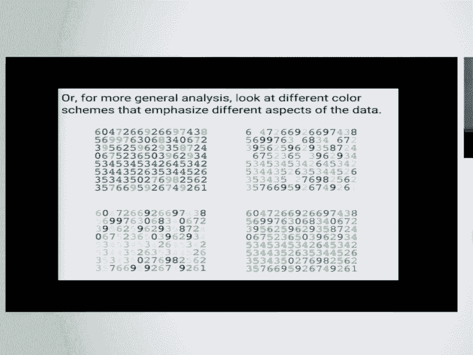

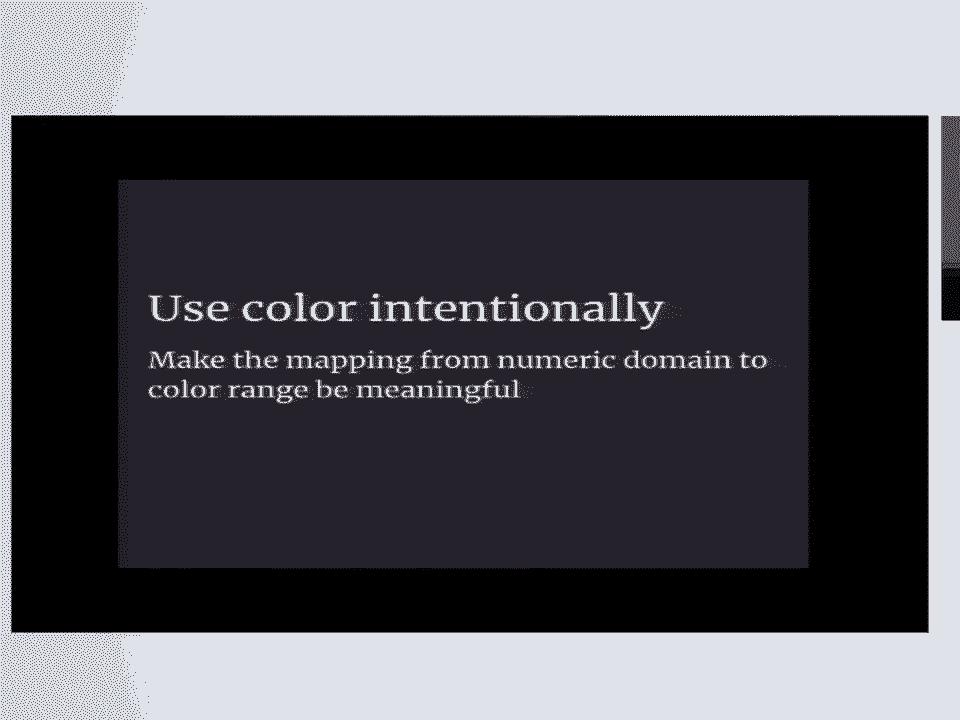

许多标准可视化形式都基于前注意属性，例如条形图利用了**长度**这一属性。而今天我们要重点讨论与颜色相关的前注意属性：**强度** 和 **色调**。

让我们通过一个例子来理解。请看这组数字，你能发现任何有趣的模式吗？或者更具体地问：**有多少个数字7？**

*   **默认状态**：答案并不明显。
*   **典型分类着色**：如果为每个类别分配不同颜色，虽然容易区分类别，但无助于快速数出7的个数。
*   **顺序色标**：使用渐变色标，可能开始注意到一些模式，但仍难以回答具体问题。
*   **Viridis色标**：很流行，但你可能只注意到数字9。
*   **发散色标**：用于突出极端值，可能发现有趣之处，但仍未回答我们的问题。
*   **针对性高亮**：**只将数字7高亮显示**。现在，我们既能快速数出7的个数，也能看到它们在数据集中的位置。

我们也可以将高亮与小型多图结合。现在我们可以同时查看10张图表，每张图表高亮显示数据的不同方面，从而将注意力集中在特定的分析点上。

或者，对于更一般的分析，我们可以查看**强调数据不同方面的不同配色方案**，这有助于我们在每张图中注意到不同的事情。

### 将理论应用于实际数据

让我们将这一原则应用到实际数据中：**有意识地使用颜色**。具体方法是，让从数值域到颜色范围的映射，根据不同的“有意义”的定义而变得有意义。

我们以美国各县的失业率数据（约2009年经济衰退期间）为例。这类地理热图在科学中也很常见。

*   **默认映射**：颜色范围从最小值到最大值。可能只有少数极端值（黄色和绿色）比较显眼。
*   **调整颜色范围**：一种直接的方法是调整最小值和最大值，以更好地匹配数据密度。例如，将所有高于15%的失业率设为黄色，低于2%的设为紫色，中间部分则获得更多的感知区分度。对比之下，调整后的图表能让我们提出更多问题。
*   **翻转配色方向**：使用相同的Viridis色标，但方向从最小到最大改为从最大到最小。仅仅改变方向，我们注意到的重点就会不同。
*   **尝试不同配色方案**：例如使用Spectral色标。你可能会注意到相同或不同的事物。（注意：此色标对色盲/色弱人群不友好。）
*   **使用发散色标**：与中位数比较可能更有意义。将白色置于中位数，一端紫色，另一端深橙色，可以突出高于或低于中位数的县。
*   **基于经济学理论设定中点**：例如，将中点设为经济学家认为的健康经济失业率5.5%。这样，图表显示了许多地区正处于困难时期。
*   **设置硬性阈值**：例如，高亮显示失业率高于10%的地区。

**不同的颜色映射会向数据提出不同的问题。正确的颜色映射取决于你想向数据提出什么问题。**

我的主要目标是：**要有意识地进行选择**。最后提醒一点：许多色标在定量均匀性上受到批评。如果你的数据中定量信息最为重要，或许不应该主要依赖颜色来映射，因为颜色传达定量信息的效果并不好。这时，可以尝试依赖**位置**而非颜色的图表（如散点图）。如果空间组织很重要（如地图），结合交互工具（如Altair, Plotly）可以获得两全其美的效果。

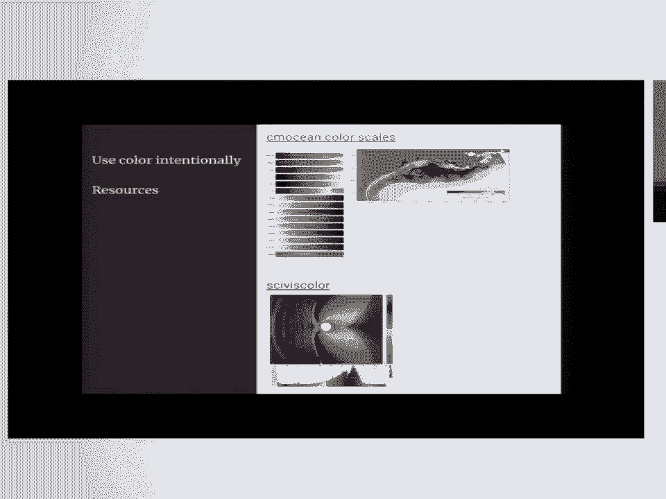

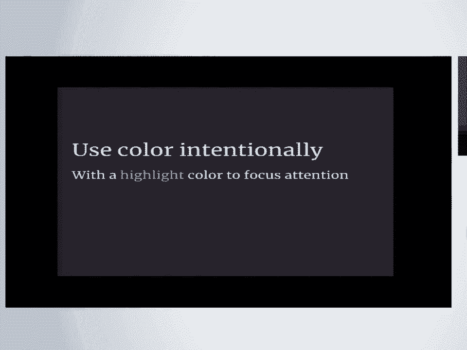

**以下是相关资源：**
*   CM Ocean Color
*   ColorBrewer
*   SiViz Color

### 使用高亮色聚焦注意力

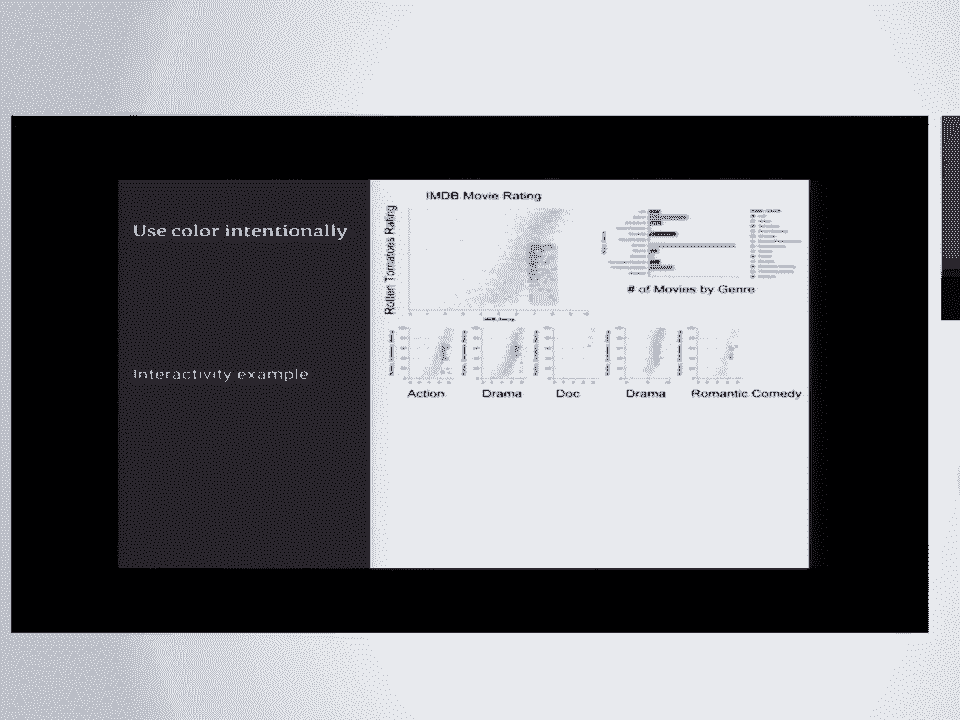

我们也可以使用高亮色来聚焦注意力。例如，在分析电影数据的散点图中，所有数据点都出现在每个子图上，但我们高亮显示不同类型的电影（如戏剧、恐怖片），就能轻松看出不同类型电影的分布差异。

结合交互性和高亮是更强大的组合，既能节省空间，又能获取细节。我们还可以将此与小型多图结合，例如，在直方图更新时进行高亮，每个底部子图只显示特定类型的电影，从而观察高亮区域与整体密度的关系。散点图在科学中非常重要，因此这项技术价值巨大。

---

## 原则三：为你的时间、精力和注意力优化图表 ⚙️

上一节我们探讨了颜色的使用，本节中我们来看看最后一个原则：优化你的图表，以节省时间、精力和注意力。

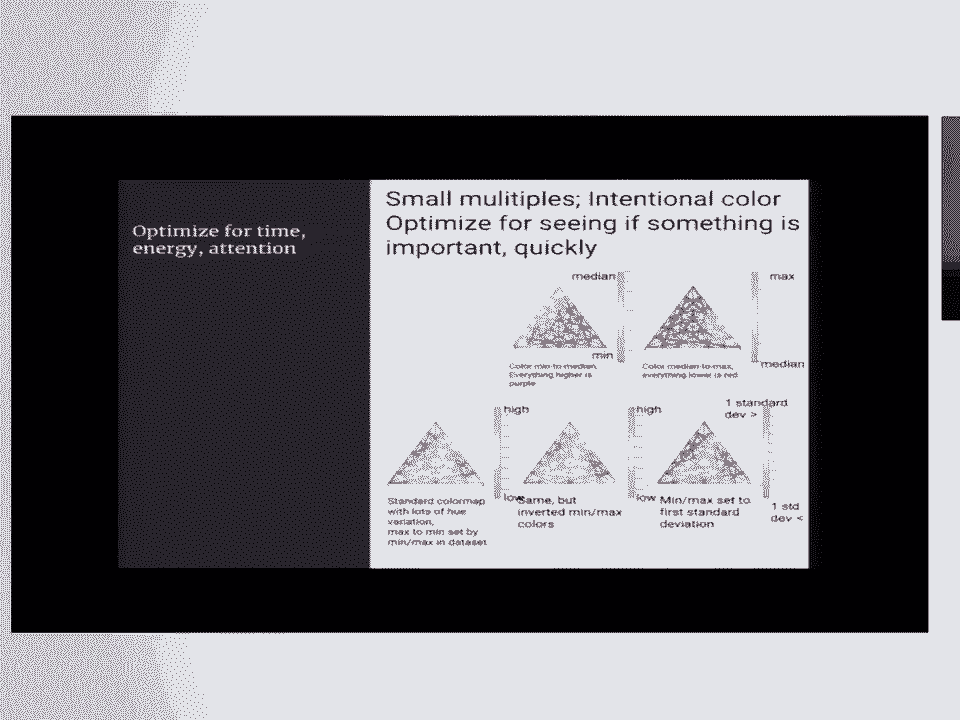

这一部分将非常简短，但至关重要，因为我们经常需要运行数据处理流水线，定期处理类似类型的数据。这是一个绝佳的投资机会：**一旦做出好的可视化设计选择，就可以反复受益**。

我们通常想知道：数据正常吗？是否损坏？传感器工作了吗？显微镜正常吗？细胞都死了吗？这里有什么有趣的东西吗？是否有值得深入挖掘的发现？

在这种情况下，我们应该：**创建许多图表，其中大部分是“枯燥”的，但重要的东西必须显而易见**。“大部分枯燥”是好事，如果图表显示一切正常，意味着你的数据没有损坏，这很棒。

### 案例研究

这是一个与Google加速科学团队和加州理工学院的合作项目。我们需要结合A、B、C三种不同事物，寻找感兴趣的区域（局部最小值、最大值、斜率变化）。最初我们使用了一张热图，但存在一些问题：最大值比最小值更吸引眼球；中间色阶难以看到有趣信息；极端值（尤其是不可靠的最大值）会完全冲淡整个色阶。

于是，我们转向了小型多图。现在，我们同时查看五个三角形图表，并有意地使用颜色（也为色觉障碍者提供了备用色图）。我们优化了图表，以便快速发现重要信息。每个图表都有不同的映射方式：从高到低、从低到高、仅在第一标准差内、从中位数到最小值、从最大值到中位数。

---

## 总结 📝

本节课中，我们一起学习了科学发现中数据可视化的核心思想。

1.  **可视化没有绝对的好坏**：一切取决于你的目标、背景和约束条件。
2.  **创建小型多图**：同时查看多个相关图表，以进行比较和发现。
3.  **有意识地使用颜色**：根据你想提出的问题，选择能突出重要信息的颜色映射。
4.  **为你的时间、精力和注意力优化图表**：特别是在重复性的数据流水线中，投资于好的可视化设计可以长期获益。

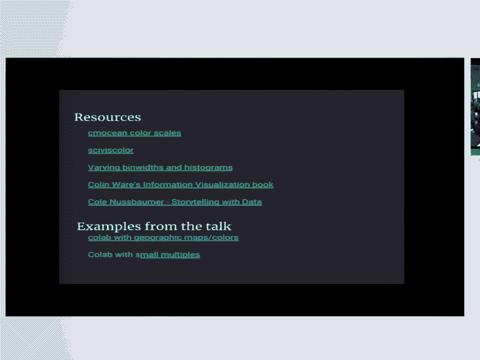

如果你是工具开发者，请让这些实践变得更加容易。感谢大家！