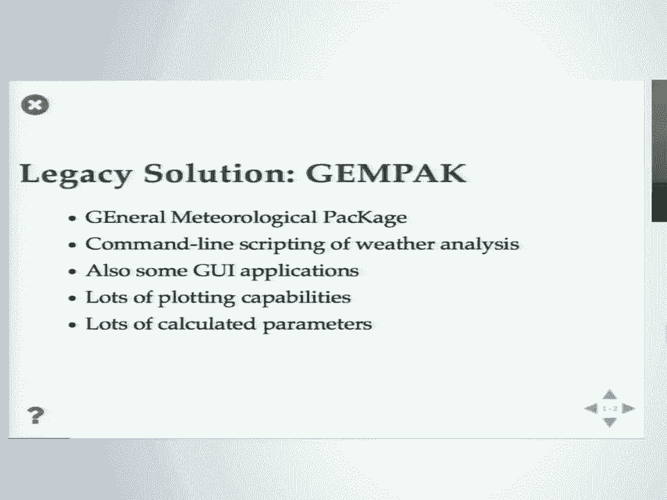
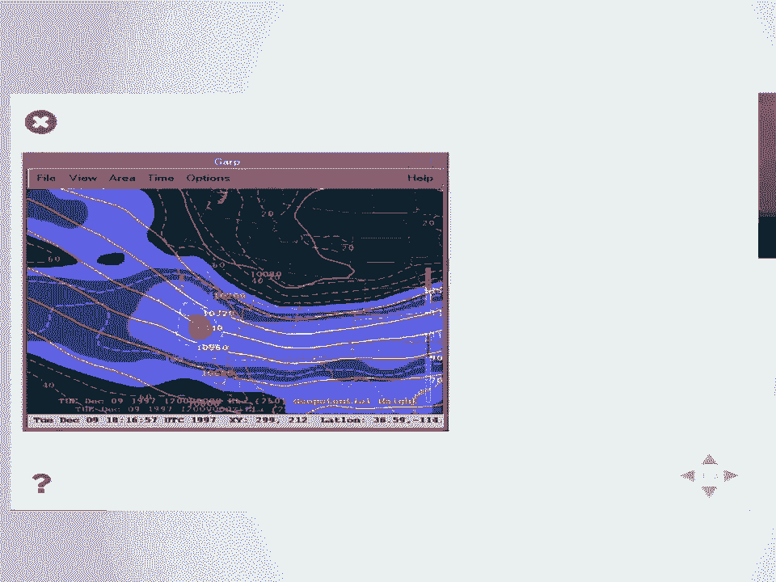
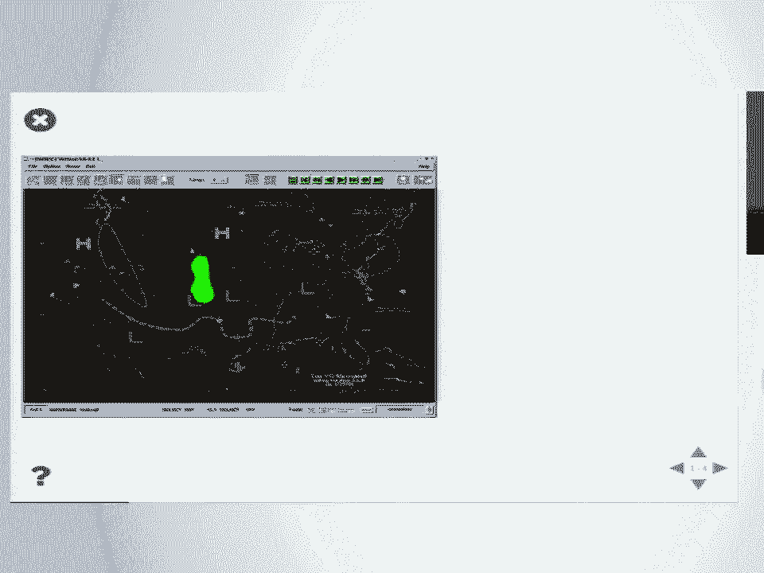
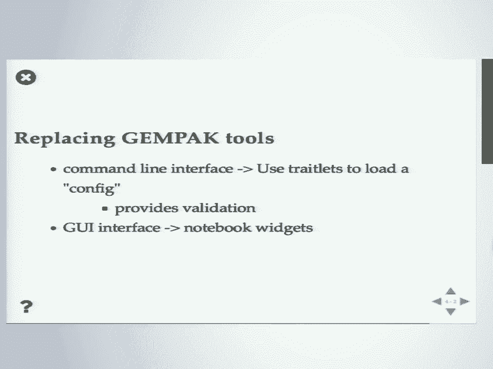
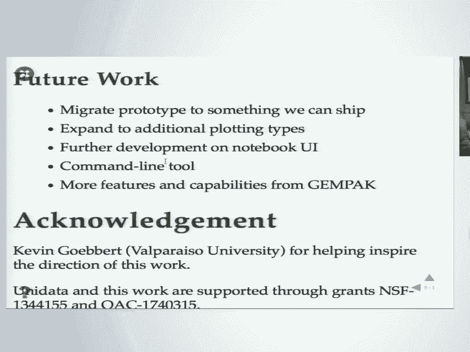
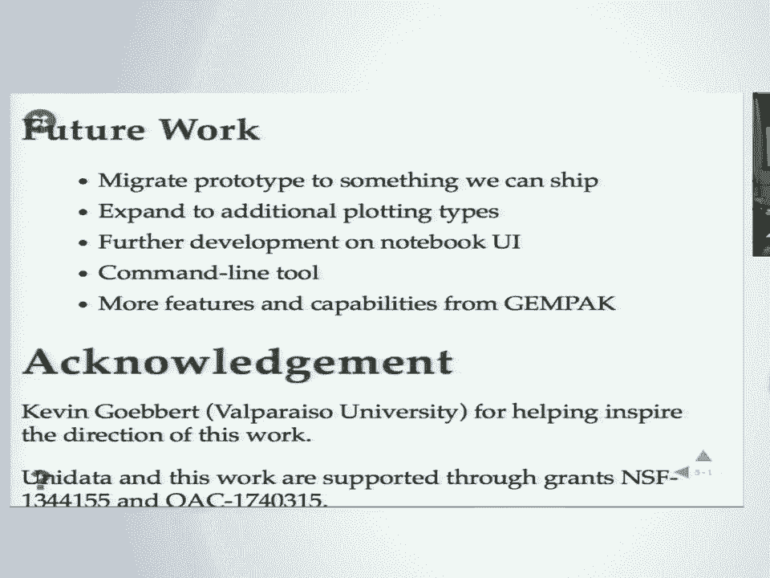

# 5：MetPy 声明式绘图接口开发 🗺️

在本课程中，我们将学习 MetPy 项目如何开发一个声明式绘图接口，旨在替代传统的气象绘图工具 GEMPAK。我们将探讨其设计动机、核心实现思路以及未来的发展方向。

## 概述：气象绘图的需求与挑战



气象学家每天需要制作大量的天气图。这是气象学工作的核心内容。因此，高效、易用的绘图工具对该领域至关重要。



上一节我们介绍了气象绘图的背景，本节中我们来看看传统的解决方案及其面临的挑战。



## 传统方案：GEMPAK 工具

GEMPAK 是“通用气象软件包”的缩写。从其名称可以感受到它诞生的计算时代背景：20 世纪 80 年代。

*   **工作方式**：它是一个命令行脚本工具，类似于 GMT。用户通过管道和脚本将多个独立工具组合起来，以生成分析图形。
*   **功能特点**：它包含许多气象专用分析绘图功能，并具有强大的计算参数能力，其核心功能之一是“网格诊断”。
*   **图形界面**：它也包含一些图形用户界面应用程序。

以下是 GEMPAK 生成图形的示例：


*（GEMPAK 图形界面应用 `gempak` 的输出示例）*


*（GEMPAK 中 `nmap` 工具的图形输出示例）*


*（通过脚本生成的静态图像示例）*

## GEMPAK 的局限性

如今已是 2018 年，GEMPAK 因其年代久远而显得力不从心。

*   **技术栈陈旧**：其 GUI 基于 Motif，在许多现代平台上已难以运行。
*   **数据格式不灵活**：将 NetCDF 等格式的数据导入 GEMPAK 非常困难，通常需要大量预处理。
*   **缺乏官方支持**：美国国家气象局等机构已转向新的工具包，不再继续开发 GEMPAK，其维护工作转由社区承担，面临挑战。

## 现代方案：MetPy 项目

MetPy 是一个用于气象分析的 Python 工具包。它支持文件格式、绘图和计算等功能。其使命是优雅地替代 GEMPAK，为从传统应用迁移到 Python 提供一个良好的平台。

逻辑上，我们只需用 Python 替换 GEMPAK 即可。然而，实际操作中遇到了问题。

### 脚本方式对比

以下是两种工具脚本方式的对比：

**GEMPAK 脚本分析**
GEMPAK 使用 Shell 脚本作为脚本语言，并通过设置大量变量、使用输入重定向来“编程”。它是一种**声明式**风格：用户设置变量，告诉工具“想要什么”，而非一步步“如何做”。

一个典型的 GEMPAK 脚本片段如下：
```bash
# 设置环境变量和日期
source env_file
DATE=$(date +%Y%m%d)
# 调用网格等值线例程，并通过输入重定向传递参数
grid_contour << EOF
map = 1
gdfile = data.grd
glevel = 500
gvcord = pres
...
EOF
# 注意：结尾需要两个空行
```
这是 80 年代和 90 年代最先进的天气分析脚本。

**Python 脚本分析**
Python 显然是更优秀的脚本分析解决方案。然而，当我们尝试用 Python 实现类似功能时，代码变得冗长。

一个功能相近的 Python 脚本可能包含 **43 行代码**、**30 多个不同的函数和方法调用**。这与 GEMPAK 简洁的脚本形成了鲜明对比。

Python 栈非常强大且通用，但正是这种灵活性和强大功能，导致即使完成最基本的任务也需要冗长的代码。这对于向刚接触编程的气象学新生教学来说，是一个巨大的障碍。




## 核心理念：让 Python 更像 GEMPAK

那么，如何让 Python 变得更像 GEMPAK 一样易用呢？让我们回到 GEMPAK 的配置方式：设置变量，然后运行。

我们可以尝试在 Python 中模拟这种风格。首先进行简单的转换，例如使用 `datetime` 模块和 f-string 格式化日期。但这只是开始，使用全局变量并非好方法。

更好的思路是使用简单的类。例如：
```python
# 创建一个地图对象并设置属性
m = MapPlot()
m.area = ‘us’
m.projection = ‘lcc’
...
# 创建一个等值线分析对象并设置属性
cntr = ContourPlot()
cntr.data = dataset
cntr.field = ‘temperature’
cntr.levels = 20
...
```
这看起来很像 GEMPAK 的方式，而远非之前那个 43 行的“怪物”。这是一种理论上的构想，但我们可以将其实现。

### 实际代码演示

通过实际编写代码，我们可以用寥寥数行实现复杂的天气图绘制。例如，从远程服务器下载数据，并使用声明式接口绘图：
```python
# 使用 openDAP 和 xarray 下载数据
ds = xr.open_dataset(...)
# 创建并配置绘图对象
plot = MapPlot()
plot.add_contour(ds, field=‘temperature’)
plot.add_image(satellite_data)
plot.show()
```
运行后，我们可以得到一张精美的天气图。在此基础上，我们可以轻松添加更多数据源（如卫星图像），组合成更复杂的分析图，而所需努力并不多。

## 技术栈与实现原理

我们是如何实现这一点的呢？其底层技术栈如下：

*   **Matplotlib/Cartopy**：核心绘图和地理投影库。
*   **MetPy**：提供气象学特定功能。
*   **Xarray**：处理多维数组数据，并通过自定义访问器解释 CF 元数据，从而自动设置投影和维度，对用户隐藏了复杂性。
*   **Traitlets**：一个属性框架（源自 IPython/Jupyter），提供属性验证和变更通知功能，是实现声明式接口和 GUI 集成的关键。

虽然对于简单的绘图来说，事件通知等功能可能有些“杀鸡用牛刀”，但为了全面替代 GEMPAK（包括其简化的命令行界面和未来可能的 GUI），这些功能是必要的。我们不想让用户去记忆需要从哪些模块导入哪些函数。

## 交互式扩展：Jupyter 与 GUI



声明式接口的一个强大之处在于它能轻松与交互式工具集成。以下是在 Jupyter Lab 环境中的演示：


我们可以使用 `ipywidgets` 创建基本的 UI 元素（如滑块、下拉菜单），并将这些 UI 元素与我们之前在脚本中设置的属性链接起来。


这样，我们就得到了一个可交互的界面。例如，我们可以动态更改等值线的数量或颜色。这为教学和探索性分析提供了极大的便利。学生可以从相同的脚本式分析轻松过渡到交互式设置，而我们也可以基于同一框架开发更复杂的 UI 工具。

## 总结与未来工作

本节课中我们一起学习了 MetPy 声明式绘图接口的开发动机和实现路径。

**核心成果**：
1.  基于 Matplotlib/Cartopy 和 Xarray 实现了一个声明式绘图接口的雏形。
2.  Xarray 的 CF 元数据支持自动处理了繁琐的投影设置。
3.  Traitlets 框架使得属性管理和与 `ipywidgets` 的集成变得异常简单，仅用几行代码就能创建出 GUI。

**未来工作方向**：
1.  **代码迁移与完善**：将原型代码整理并集成到可发布的 MetPy 版本中。
2.  **增加绘图类型**：目前支持图像和等值线，未来需要添加 `pcolormesh`、风羽图等对气象分析重要的类型。
3.  **增强 Notebook UI**：探索在 Notebook 中自动暴露哪些属性，如何更好地集成交互功能。
4.  **开发命令行工具**：实现类似 GEMPAK 的配置文件风格，用户只需编写一个设置变量的 Python 文件，由驱动程序读取并绘图。
5.  **实现“便捷功能”**：例如，像 GEMPAK 一样，用户指定“纽约”，程序就能自动绘制纽约地区的地图，而不是手动设置边界框。

**设计哲学**：该接口旨在成为一座桥梁。它故意在初始阶段限制可定制的属性范围，提供类似 GEMPAK 的简易入口。但当用户需要更多功能时，可以直接获取底层的 Matplotlib 轴对象，使用传统的命令式 API 进行扩展，从而实现从基础到高级的无缝过渡。

## 问答环节摘要

*   **与 MetPy 项目的整合**：该声明式接口将作为 MetPy 绘图功能的一部分存在，而不是一个独立项目。
*   **从交互式界面回退到声明式脚本**：这是一个有价值的想法，即将在 GUI 中调整后的状态序列化回声明式脚本。目前代码尚未支持，但这是未来的考虑方向。
*   **支持更多绘图类型**：`pcolormesh` 等类型已被列入计划。
*   **为处理步骤也提供声明式接口**：初期聚焦绘图。对于计算步骤，未来可能探索基于已有数据自动推导并执行所需计算的“图求解器”方案，但这属于中长期目标。
*   **创建 Jupyter Lab 的 MIME 渲染器**：这是一个有趣的 idea，允许用户在文件浏览器中双击配置文件直接打开渲染好的图形，值得未来探索。



通过本节课的学习，我们看到了如何利用现代 Python 生态构建既强大又易用的专业工具，以促进科学计算在特定领域的普及和应用迁移。