# 9：物理与贝叶斯深度学习的交汇点 🔬➡️🤖

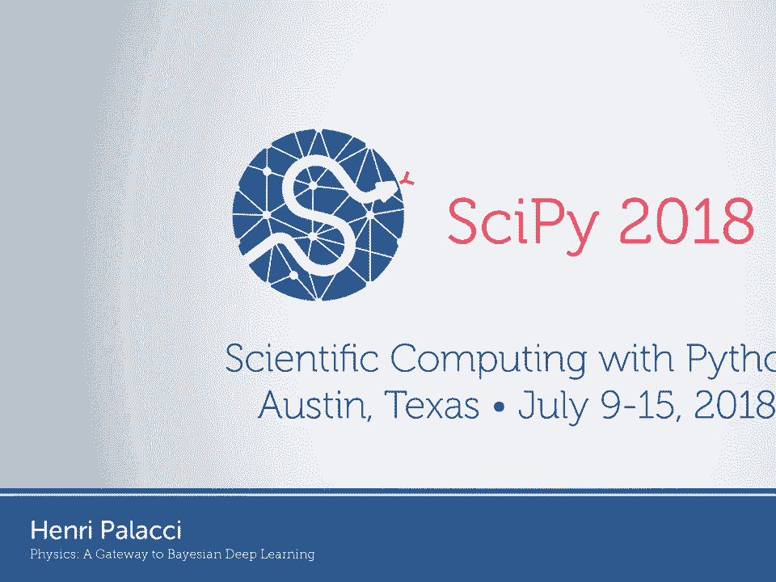

在本节课中，我们将探讨物理学（特别是统计力学）与机器学习（尤其是深度学习）之间深刻的联系。我们将看到，统计力学中的核心概念如何为解决深度学习中的一些关键挑战（如模型不确定性、过拟合和异常数据检测）提供优雅的框架。

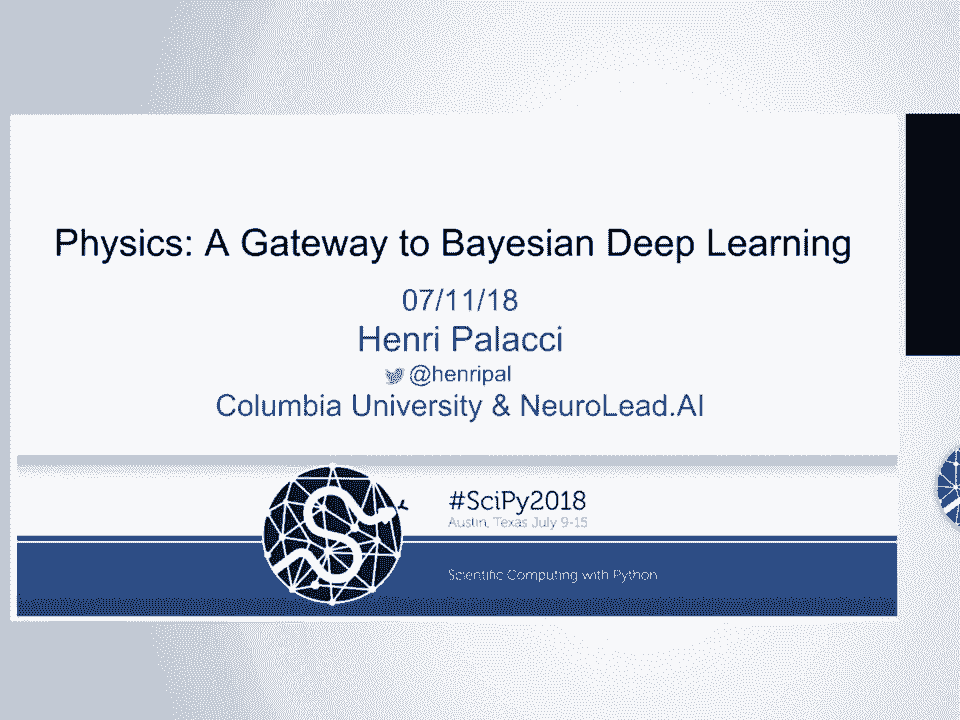

---

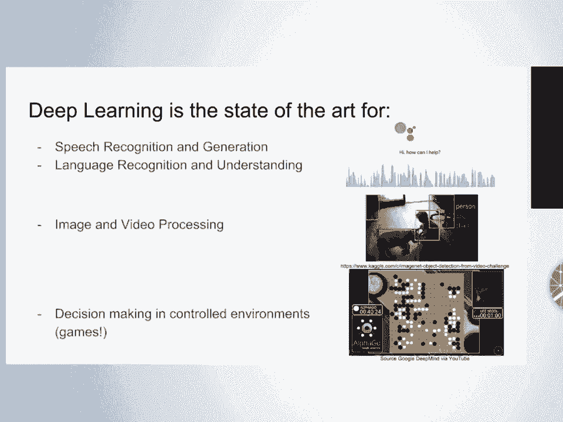

## 深度学习概述

上一节我们介绍了课程主题，本节中我们来看看深度学习的现状与挑战。

深度学习是当前语音识别与生成、语言理解、图像视频处理以及游戏等受控环境中决策制定的前沿技术。

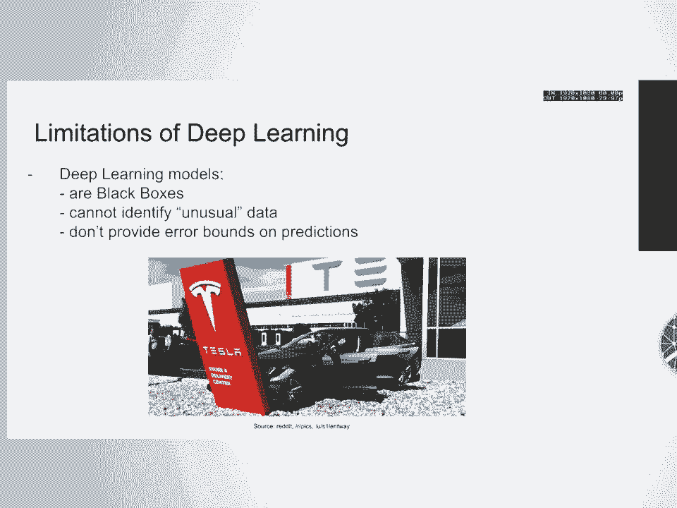

深度学习虽然强大，但也存在严重的局限性。深度学习算法是“黑箱”，完全不可解释。它们无法识别异常数据。这意味着，如果你在一个特定训练数据集上训练了算法，然后将其部署到现实世界，当遇到与训练数据完全不同的数据点时，算法仍会进行预测，而不会提示数据异常。

更重要的是，对于像我这样有统计学背景的人来说，深度学习缺乏误差界限的概念。预测结果就是结果，无法绘制误差条，这在更严肃的应用（如医疗保健、自动驾驶）中可能带来严重问题。

另一个理论上的谜团是，我们并不完全理解深度学习为何效果如此之好。在传统的偏差-方差权衡曲线中，随着模型复杂度增加，验证误差最终会因过拟合而上升。但深度学习模型极其复杂，参数维度有时甚至高于数据集本身，却仍能表现出隐式的正则化效果，保持较低的验证误差。

一个标准的分类问题，例如判断图像是狗还是拖把，可以形式化如下：

*   **数据**：`x1, x2, ..., xm`（图像）
*   **标签**：`y1, y2, ..., ym`（例如“狗”或“拖把”）
*   **模型**：一个参数化函数 `f(xi; w)`，其中 `w` 代表权重或参数。
*   **目标**：学习权重 `w`，使模型在训练数据上的损失函数 `L(w)` 最小化。

以下是实现此目标的核心算法——随机梯度下降（SGD）的权重更新公式：

```python
w_new = w_old - λ * ∇L(w_old)
```

其中 `λ` 是学习率。这种方法会找到一个最优权重点 `w_min`。

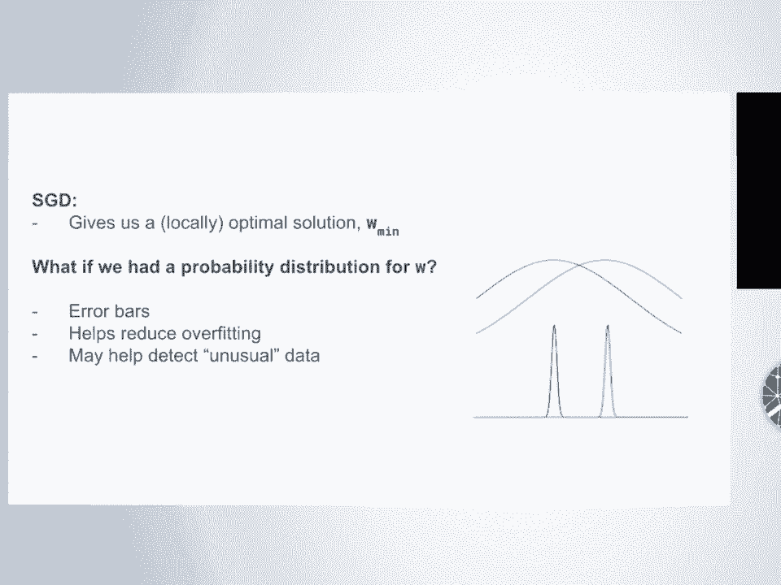

---

## 转向贝叶斯视角

上一节我们介绍了传统的点估计方法，本节中我们来看看如何通过贝叶斯方法引入不确定性。

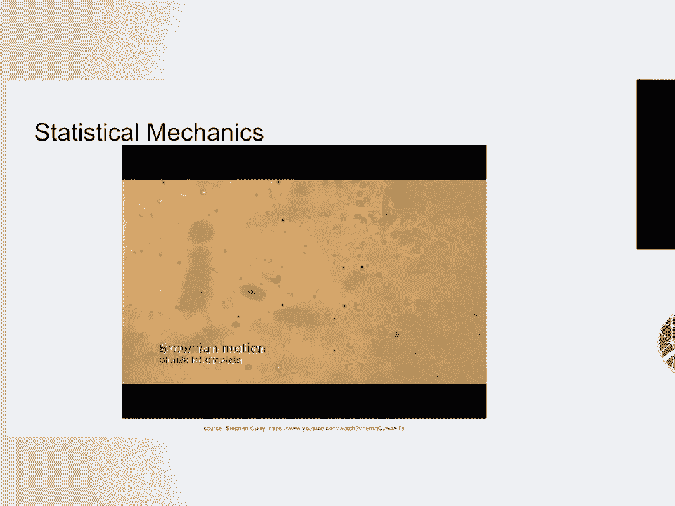

对于像我这样的贝叶斯主义者，关键的一步是从寻找神经网络的最佳参数“点”，转向寻找参数的“分布”。我们不再只得到一个 `w_min`，而是寻求一个在给定训练数据下，权重 `w` 的概率分布 `P(w|Data)`。

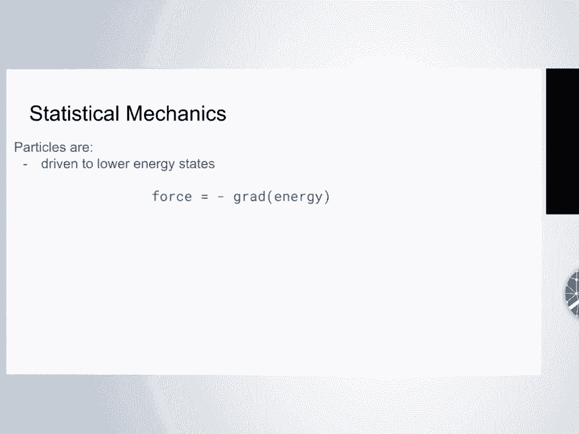

如果有了权重 `w` 的概率分布，我们就能获得误差条，因为我们可以对不同概率的多个模型进行平均。这有助于减少过拟合，因为我们不太可能陷入很深的局部极小值。同时，它可能帮助检测异常数据，因为我们现在有了量化不确定性的方法。

这就是贝叶斯深度学习的核心思想。

---

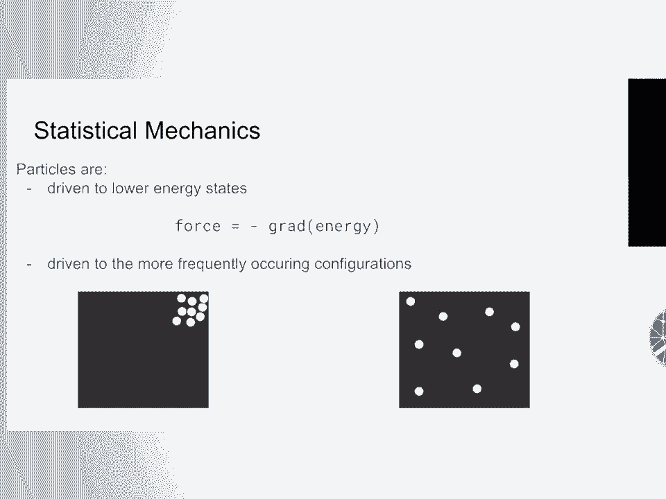

## 统计力学简介


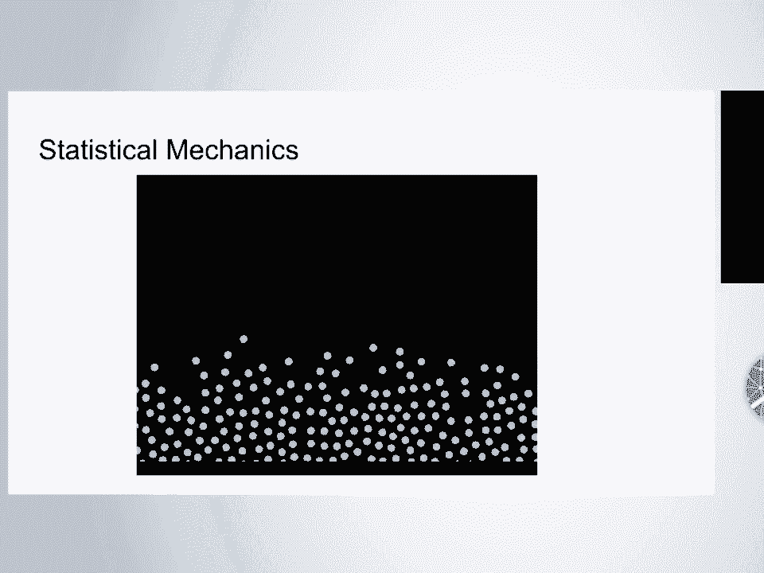

现在，让我们完全转换视角，谈谈统计力学。

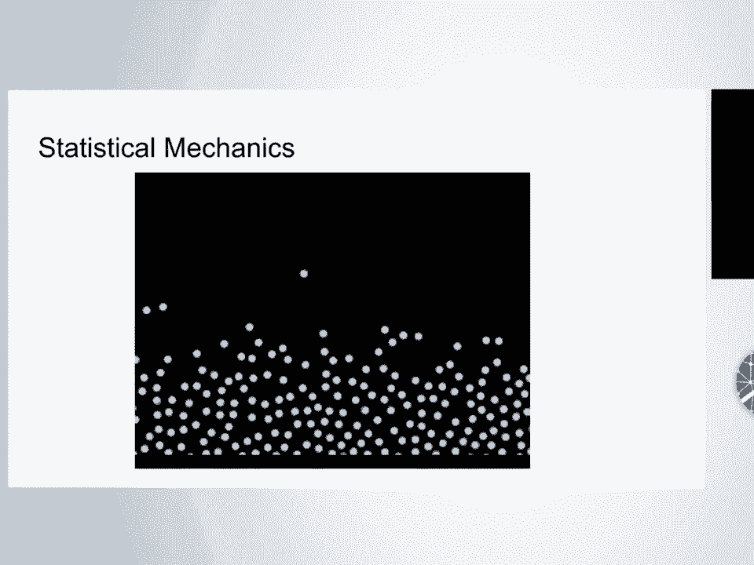

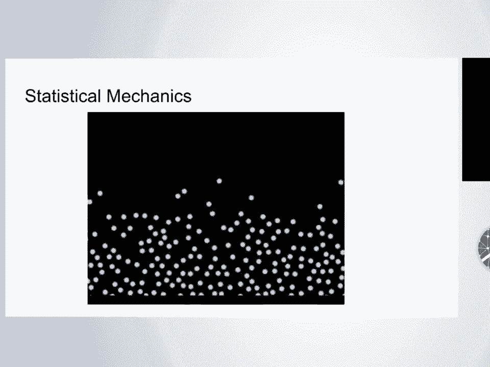


统计力学是物理学的主要支柱之一，研究具有随机性的微观系统。例如，观察水中的脂肪颗粒，它们并非静止，而是进行着无规则的布朗运动。这种随机运动对于理解细胞如何工作至关重要，因为细胞内部就像充满随机运动蛋白质的水环境。

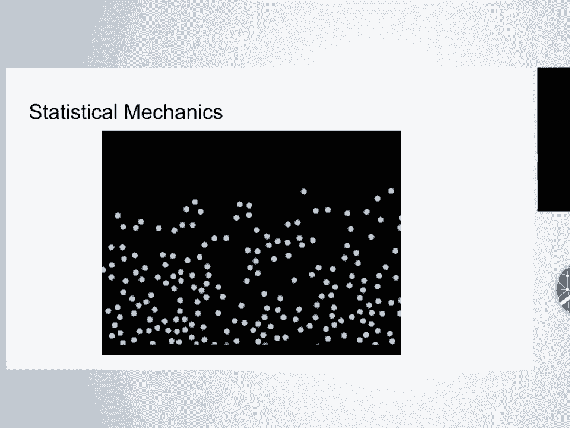

以下是统计力学中驱动系统演化的两个基本力：

1.  **能量最小化力**：粒子受外力驱动趋向更低能量状态。这可以类比为将弹珠放入碗中，它会滚动直至到达碗底（能量最低点）。力是能量梯度的负值：`F = -∇E`。
2.  **组合力（熵增力）**：系统倾向于出现频率更高的构型。例如，房间中的空气分子均匀分布的状态，远比全部挤在角落的状态更可能发生，因为前者对应的可能微观状态数更多。

没有什么神秘之处，这只是计数的结果。这种可能微观状态数的对数，你们可能听过一个更神秘的名字——**熵**。熵就是构型数量的对数。

这两个力之间存在一个“旋钮”来调节平衡，它与你加热锅底火焰的大小有关。这个调节两个力之间平衡的旋钮就是**温度**。

因此，系统的总趋势是最小化一个称为“自由能”的量：`能量 - 温度 × 熵`。如果温度为零，能量项主导，粒子紧密聚集。如果升高温度，熵项开始主导，导致水蒸发并占据整个厨房。

通过一些数学推导，在给定温度 `T` 下，系统处于某个构型 `W` 的概率由**玻尔兹曼分布**给出：

`P(W) ∝ exp(-E(W) / T)`

熟悉机器学习的同学可能会认出，这与softmax函数形式相似。能量最低的构型概率最高，而分布的宽度由温度 `T` 控制。

在物理学中，模拟这种分布的一种方法是使用**朗之万动力学**。以下是其更新规则：

`θ(t+dt) = θ(t) - ∇E(θ(t)) * dt + √(2T * dt) * η`

其中 `η` 是高斯噪声。每一步，你都在梯度下降的方向上移动，并添加一个与温度相关的噪声项。模拟粒子运动时，使用朗之万动力学就能得到这种概率分布。

---

## 物理与机器学习的交汇

上一节我们介绍了统计力学的核心，本节中我们来看看它与机器学习的惊人对应关系。

现在，从机器学习/深度学习的角度进行类比就变得非常明显了：

*   **物理系统的状态** `θ` ⇔ **机器学习模型的参数** `w`
*   **物理系统的能量** `E(θ)` ⇔ **机器学习模型的损失** `L(w)`
*   **弛豫到平衡态**（从随机初始状态到能量最低）⇔ **损失最小化**

还记得我们的随机梯度下降更新公式吗？
`w_new = w_old - λ * ∇L(w_old)`

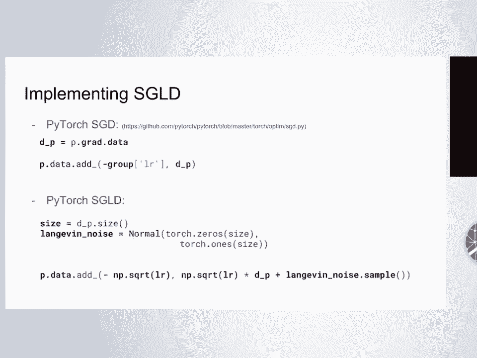

我们可以直接对其应用朗之万动力学：
`w_new = w_old - λ * ∇L(w_old) + √(2λ * T) * η`

这正是在SGD更新后添加一个适当缩放的高斯噪声项。这就是Welling和Teh在2011年提出的方法。通过每一步添加噪声，可以防止优化过程坍缩到一个单一的最小值，从而获得一个分布（多个可能的好解），而不是一个点估计。

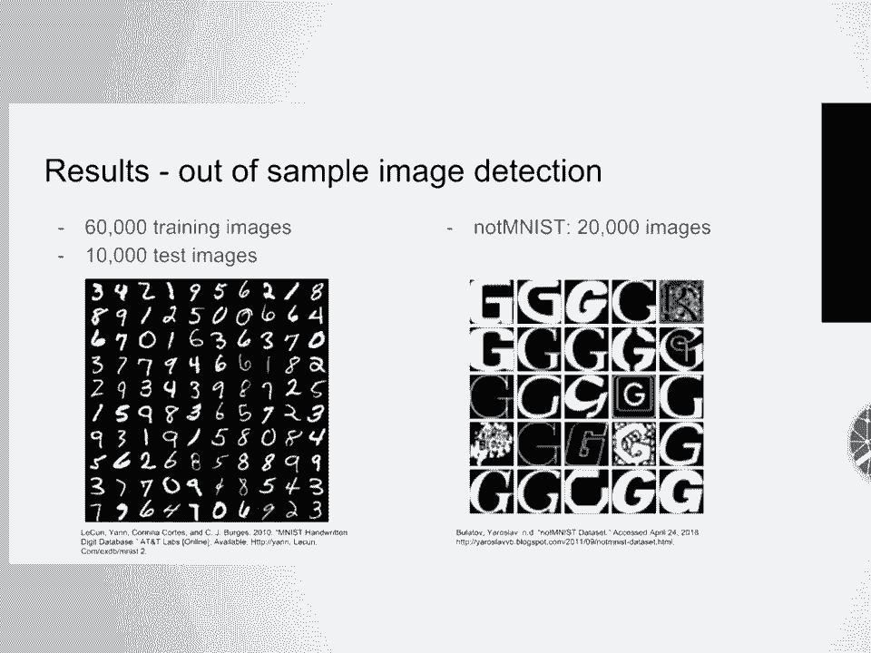

在2011年，实现这个想法可能需要数月的C++编程。但得益于科学Python社区（如PyTorch），测试这些想法变得难以置信的简单。在PyTorch的SGD优化器源码基础上，只需添加约一行半代码来引入和缩放噪声，就能实现随机梯度朗之万动力学（SGLD）。这种能够修改前沿代码以实现自己想法的能力，是当前科研中的一项“超能力”。

---

## 实际应用：异常数据检测

理论联系实际，本节中我们通过一个实验看看SGLD的效果。

我使用著名的MNIST数据集（6万张训练图，1万张测试图）训练了一个卷积神经网络。我关注的问题是“异常数据”：如果用这个训练好的网络去处理完全不像数字的数据会怎样？

我使用了Yaroslav Bulatov创建的NotMNIST数据集，它包含字母A-J的图像，格式与MNIST类似。我将预训练的CNN模型在NotMNIST数据上运行，观察其预测置信度的分布。

以下是关键发现：

*   **标准SGD（蓝色分布）**：当输入NotMNIST字母图像时，模型仍然会给出很高的预测置信度（大部分高于80%），它无法表示“我不认识这个”。
*   **SGLD（黄色分布）**：通过SGLD获得多个模型并平均它们的预测，预测置信度分布发生了显著变化，中心下移到10%左右。这表明模型对其预测变得非常不确定。

这是一个强有力的结果，展示了贝叶斯神经网络（通过SGLD近似）在“样本外”图像检测中量化不确定性的能力。当然，这并非在所有数据集上都完美奏效，但在此例中效果显著。

---

## 总结与拓展

本节课中，我们一起探索了物理学与贝叶斯深度学习之间迷人的联系。

我们首先指出了深度学习在可解释性、异常检测和缺乏不确定性度量方面的局限性。接着，我们引入了贝叶斯方法，将点估计转换为参数分布，以解决这些问题。

然后，我们切换到统计力学视角，学习了系统在能量最小化与熵最大化之间的平衡，以及用温度和玻尔兹曼分布描述系统状态。

最关键的一步，我们发现了物理与机器学习之间的深刻类比：系统状态对应模型参数，能量对应损失，平衡过程对应优化。这自然引出了将朗之万动力学噪声注入SGD的想法，从而得到参数的近似后验分布，即随机梯度朗之万动力学（SGLD）。

最后，我们通过NotMNIST实验看到，SGLD能有效降低模型对异常数据的预测置信度，展示了其在不确定性量化方面的实用价值。

这个将统计力学与机器学习交叉的领域极其丰富。对于机器学习研究者，值得关注信息热力学、统计力学与信息论之间的联系，该领域目前正取得惊人进展。

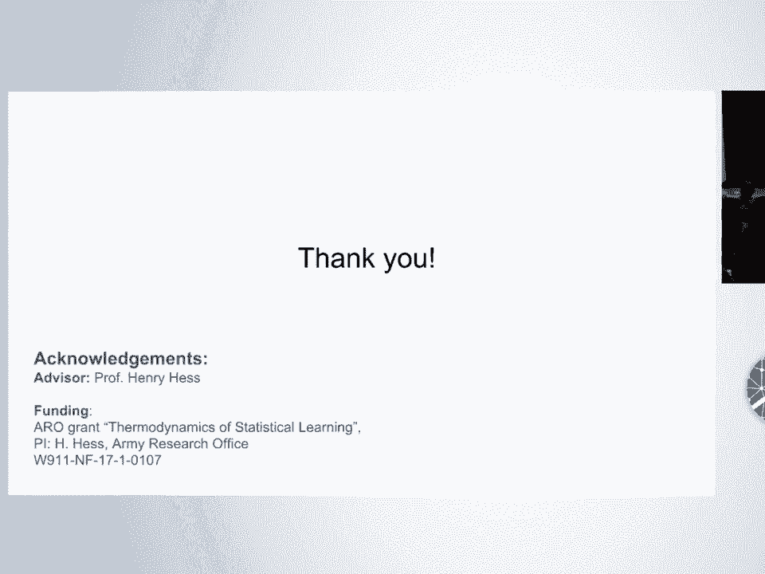

> 注：本教程内容基于SciPy 2018会议演讲“Physics - A Gateway to Bayesian Deep Learning”。演讲者分享了其博士期间的部分研究，展示了如何利用物理原理启发并改进深度学习算法。