# 11：Recipe2Vec - 如何用Word2Vec发现相关食谱 🍳

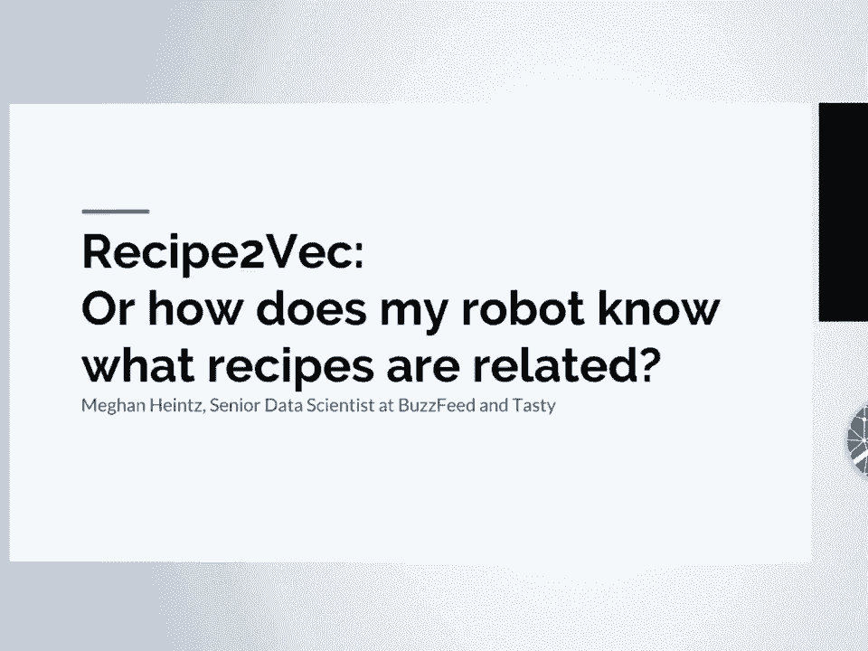

## 概述

在本节课中，我们将学习BuzzFeed数据科学家Megan Heinz分享的一个案例研究：如何利用Word2Vec技术，为Tasty烹饪品牌创建一个面向消费者的数据产品——“相关食谱”推荐模块。我们将了解从原始文本数据到生产级推荐系统的完整流程。

## 背景与问题

Tasty是BuzzFeed旗下的烹饪品牌，以其90秒的俯拍快进烹饪视频而闻名。最初，他们通过适应Facebook的算法偏好获得了巨大成功，但也带来了两个问题：一是用户依赖外部平台，二是用户实际烹饪这些食谱的体验很差。

为了解决这些问题，Tasty决定建立自己的网站和iOS应用，以更好地控制用户体验。其中一个核心功能就是“相关食谱”推荐模块。

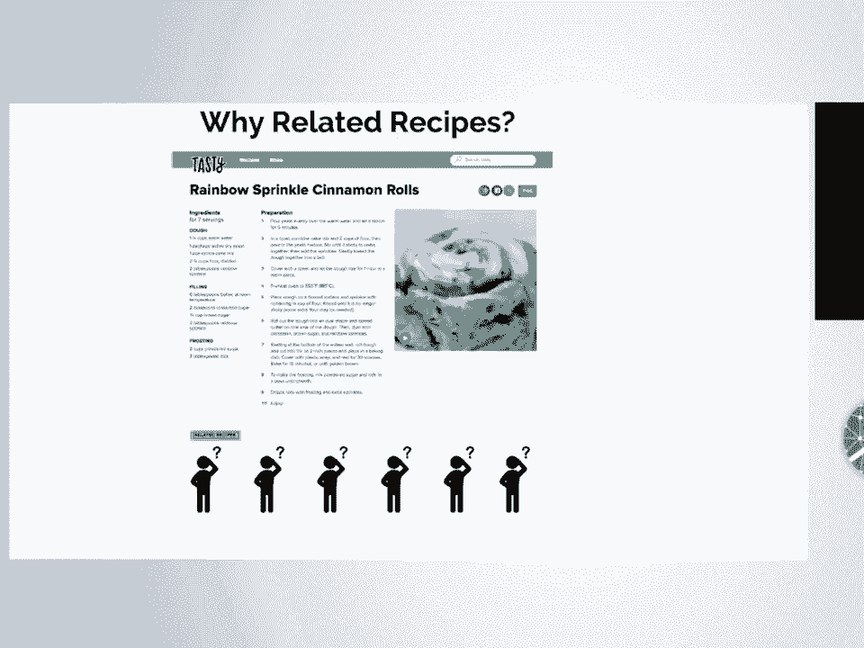

上一节我们介绍了项目背景，本节中我们来看看为什么需要数据科学方法来解决这个问题。

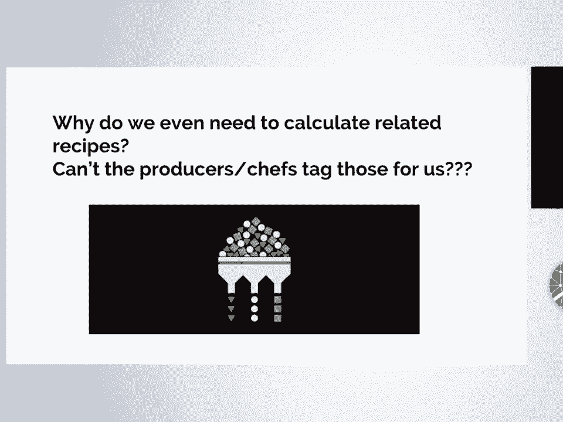

## 为什么需要算法推荐？

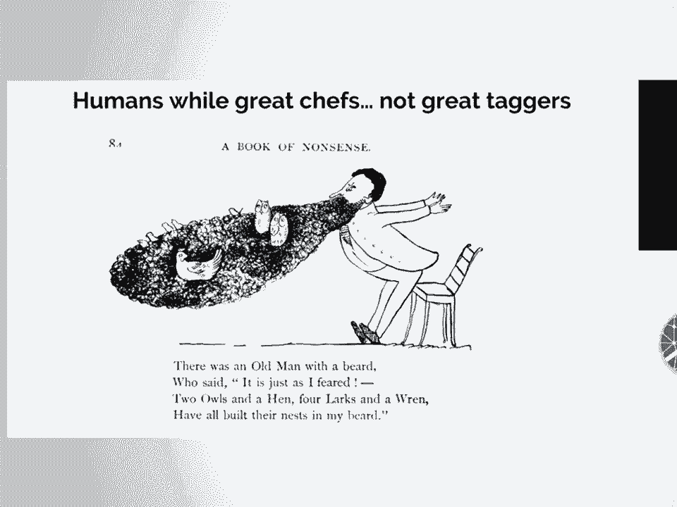

我们最初尝试让视频制作人和厨师手动为食谱打标签（例如“晚餐”、“早餐”、“甜点”），但结果非常混乱。

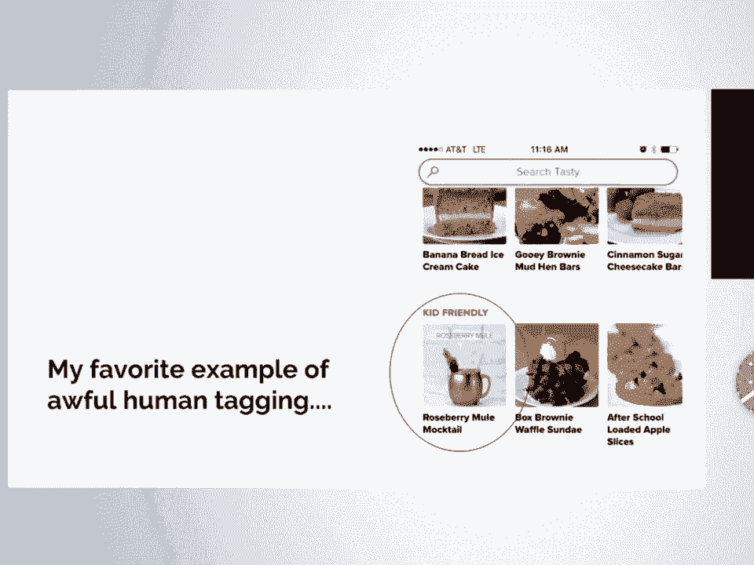

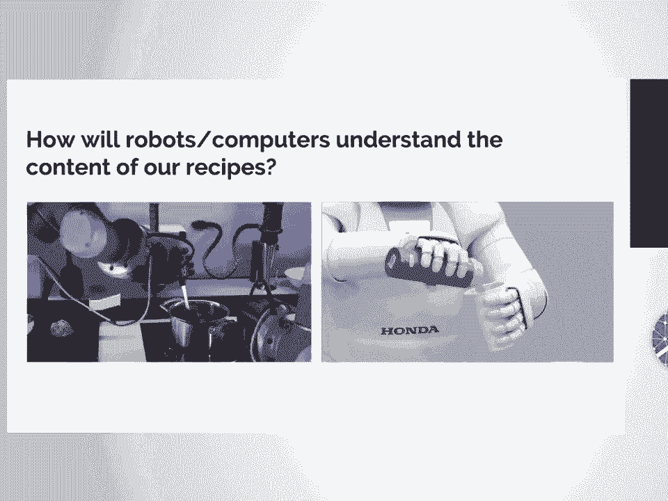

以下是人工标签系统存在问题的几个例子：
*   **标签不准确**：例如，将“无酒精鸡尾酒”标签用于儿童饮品推荐是不合适的。
*   **标签混乱**：例如，将“照烧鸡肉丸”（一种派对小吃）错误地标记为“早餐”。

因此，我们无法依赖人工标签，必须寻找程序化的解决方案。

## 传统方法的局限性

我们首先考虑使用食谱的**配料列表**作为分类变量。以下是两种常见方法及其问题：

**虚拟编码**
*   **方法**：使用`pandas.get_dummies`，将每种配料转换为一个二进制维度（0或1表示是否存在）。
*   **问题**：为每种配料增加一个维度，导致**维度灾难**。数据变得极其稀疏，难以找到有效解。

**标签编码**
*   **方法**：将配料名称等类别转换为数字列表。
*   **问题**：隐含了数字间的顺序关系，这在物理世界中不存在（例如，“苹果=2”和“酸奶=3000”没有意义）。

这两种方法还有一个共同问题：无法处理语义相似的配料（如“2%希腊酸奶”和“希腊酸奶”），它们会被编码成完全不同的特征。

因此，我们决定放弃传统方法，转向词嵌入技术。

## 词嵌入简介

词嵌入将文本语料库中的单词转换为向量表示。例如，“茄子”这个词可能被表示为一个由许多小浮点数组成的列表。

其核心思想是：当把这些向量绘制在高维空间中时，语义相似的词在空间上会更接近。例如，“海豚”和“鼠海豚”靠近，而“巴黎”和“相机”则相距较远。

词嵌入方法都基于一个共同理念：**一个词的含义由其上下文决定**。

以下是几种主要的词嵌入方法：
*   **TF-IDF**：通过比较词在文档中和整个语料库中的频率来衡量其重要性。
*   **词-词共现矩阵**：例如斯坦福大学开发的**GloVe**，它是一个具有加权最小二乘目标的对数双线性模型。
*   **神经网络方法**：最著名的是谷歌开发的**Word2Vec**，它本质上是一个两层神经网络。我们最终选择了这种方法。

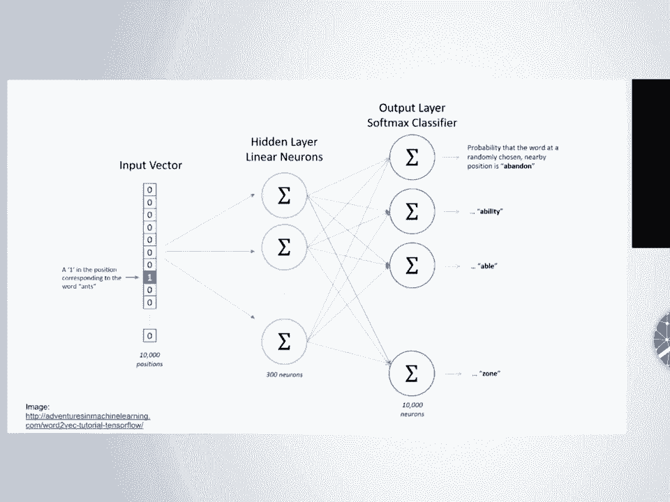

## Word2Vec 的工作原理

Word2Vec有两种实现方式：**Skip-gram**和**连续词袋**。本节课我们重点讨论Skip-gram模型。

以下是Skip-gram模型的实现步骤：

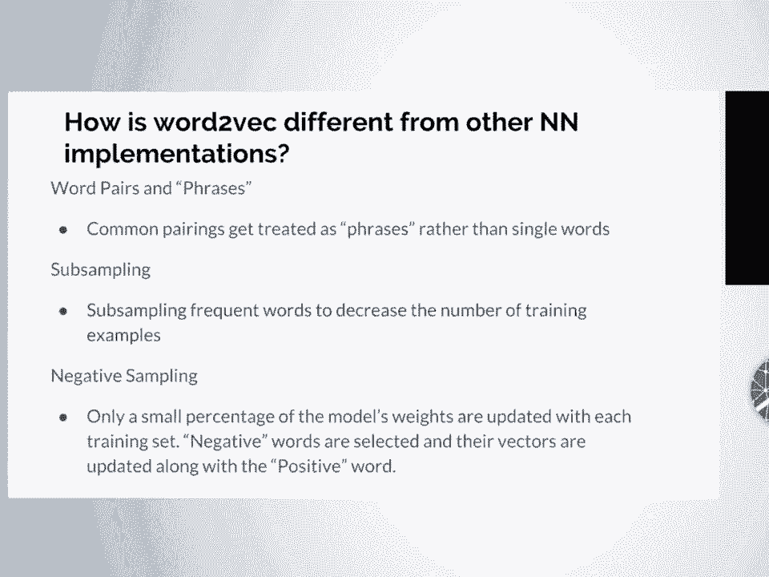

1.  **构建训练样本**：以句子“加入糖、香草和盐，然后搅拌至非常顺滑”为例。我们将其分解为**目标词**和**上下文词**。设定一个窗口大小（例如1个词），那么“糖”的上下文词就是“加入”和“香草”。以此类推，为每个词对创建训练样本。

2.  **初始化**：为每个单词初始化一个由随机小值组成的向量。

3.  **训练模型**：使用**Softmax回归分类器**（逻辑回归的推广），尝试从目标词预测其上下文词。在连续词袋模型中，则是从上下文词预测目标词。这两种方式都是为模型生成更多训练样本的技巧。

4.  **优化更新**：首次预测结果会很差，因为向量是随机的。但这没关系，我们会通过**随机梯度下降**（一种爬山法）和**反向传播**（更新神经网络权重）来更新词向量，朝着最大化目标函数的方向迈出一小步。

5.  **迭代**：重复步骤3和4，直到达到停止标准（如最大迭代次数或向量变化很小）。

从神经网络角度看，输入是词向量，隐藏层是线性神经元（通过反向传播更新），输出层是Softmax分类器，给出每个词的概率。

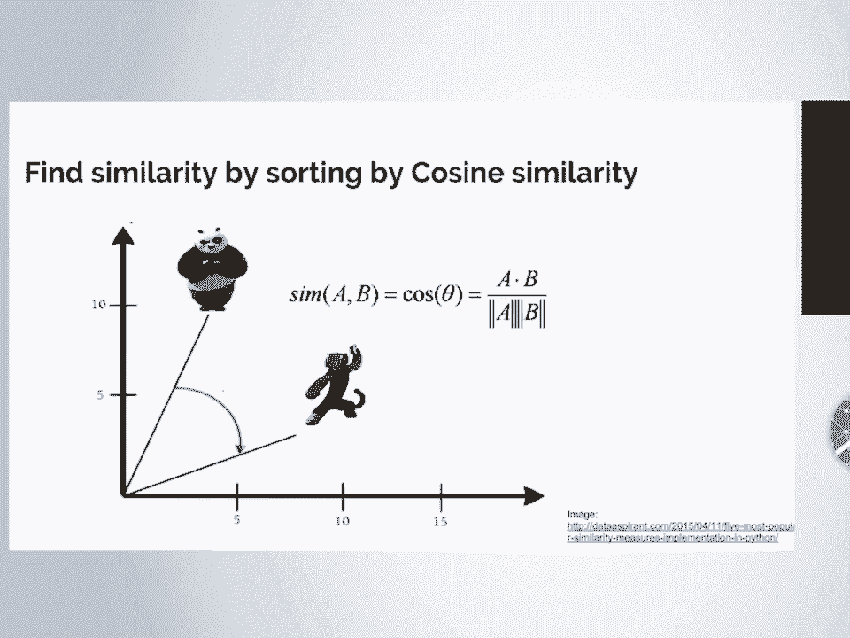

## Word2Vec 的关键优化

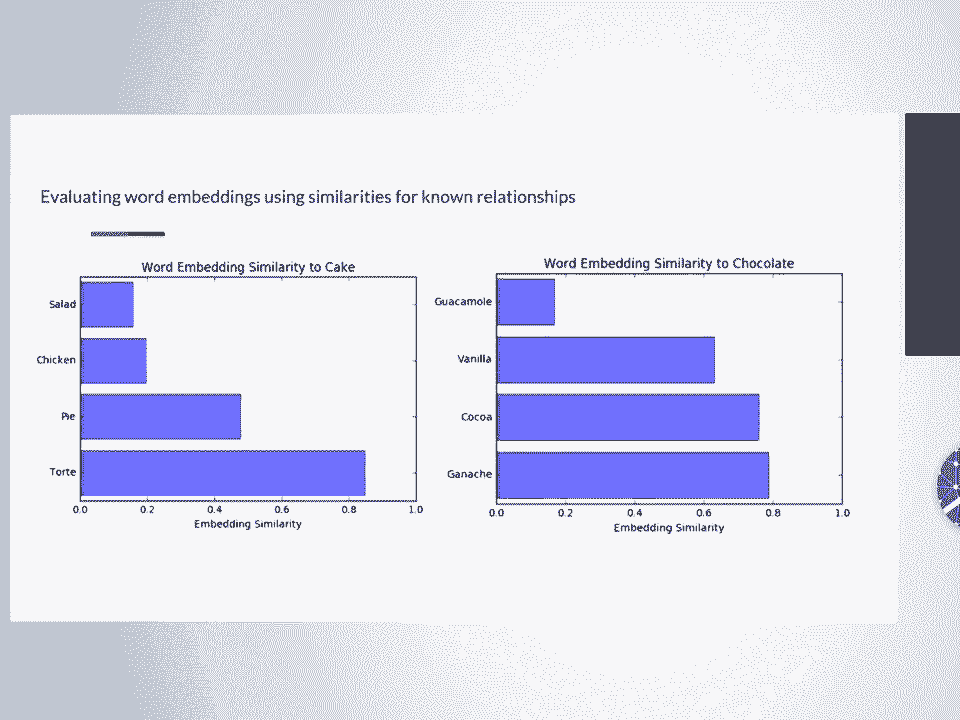

Word2Vec相较于其他神经网络实现，主要有三项优化：

**词对与短语**
*   将经常一起出现的词对（如“波士顿环球报”）视为一个单独的实体，而不是“波士顿”和“环球报”两个独立的向量。这对我们很重要，因为组合词的含义与分开时完全不同。

**子采样**
*   降低高频词在训练样本中的出现频率，因为不断重新计算“the”这类词的向量帮助不大。

**负采样**
*   在更新时，不再更新所有非预测词的向量，而是**随机选择少量非预测词**进行更新，同时更新正确预测词（正样本）的向量。这大大减少了计算量。

## 评估词嵌入模型

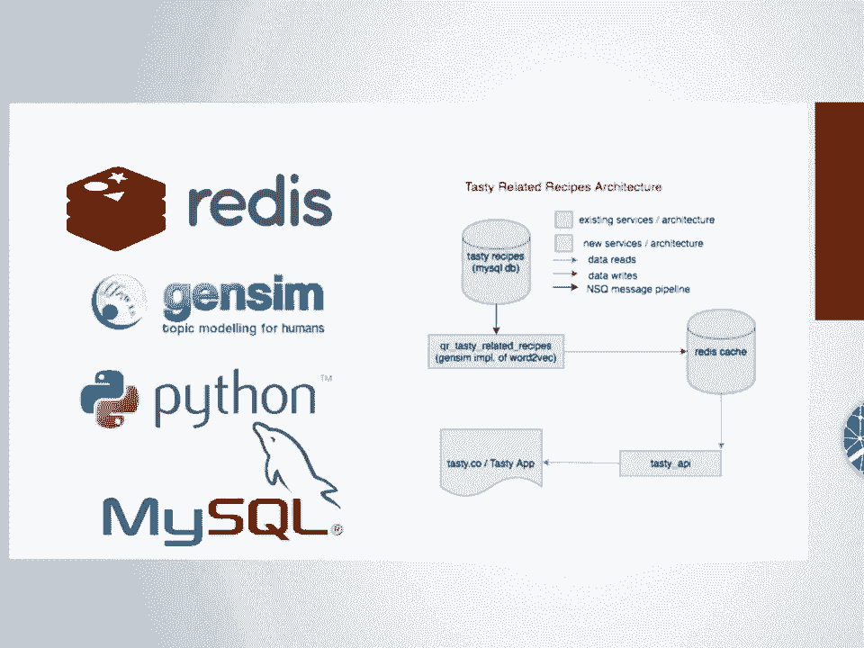

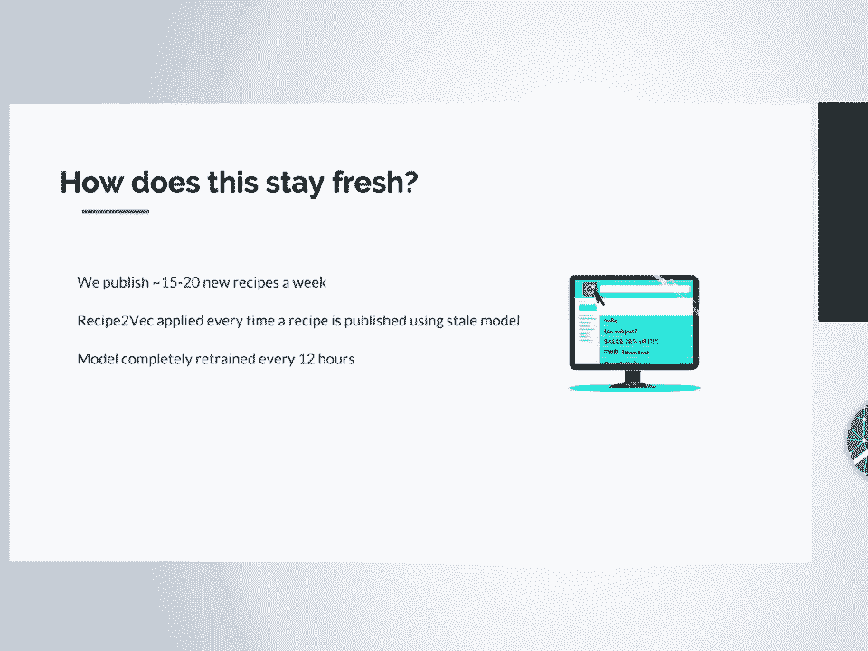

训练得到的词嵌入向量可能有70、100或200维，我们无法直接观察。因此，需要使用降维技术进行可视化评估。

以下是两种主要的降维方法：
*   **矩阵分解法**：如**主成分分析**。
*   **邻域图法**：如 **t-SNE**。

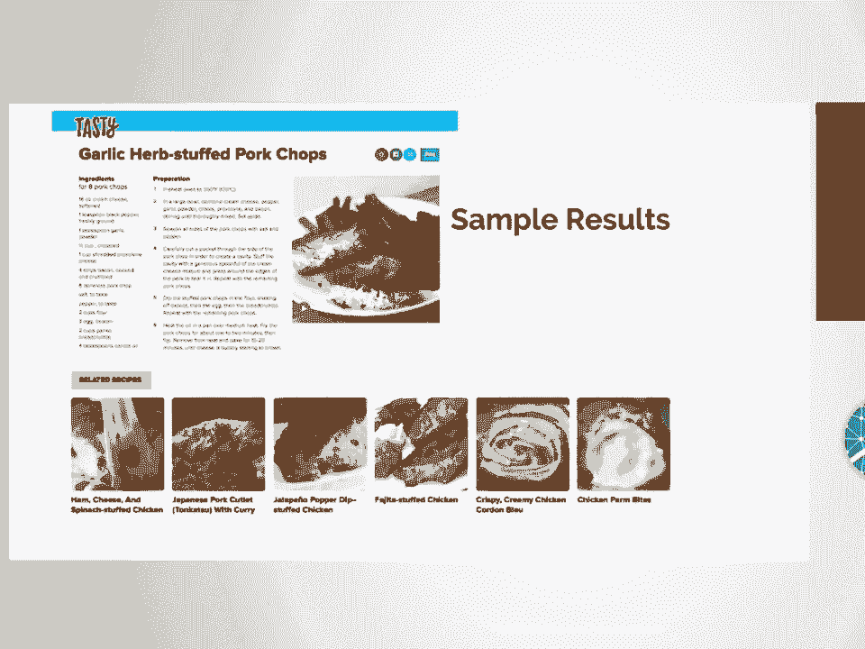

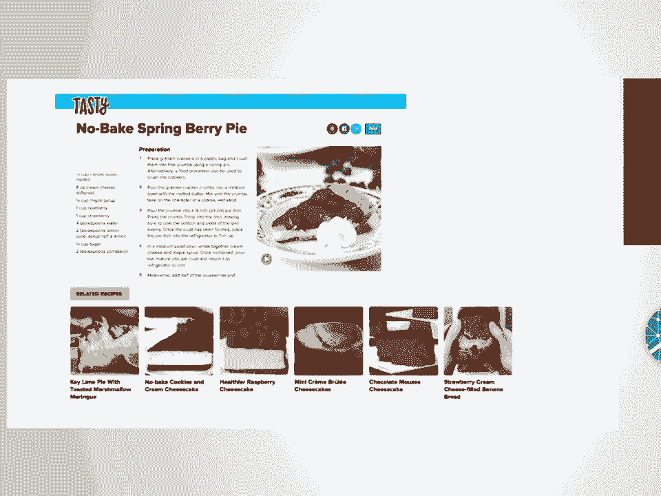

我们选择使用**t-SNE**，因为它被证明在可视化方面表现更好，并解决了“拥挤问题”（即所有观测点都聚集在图形中心的问题）。但需要注意，t-SNE的超参数（如**困惑度**）对结果影响很大，且每次运行结果可能略有不同。此外，不应过度解读图中簇的大小和距离。

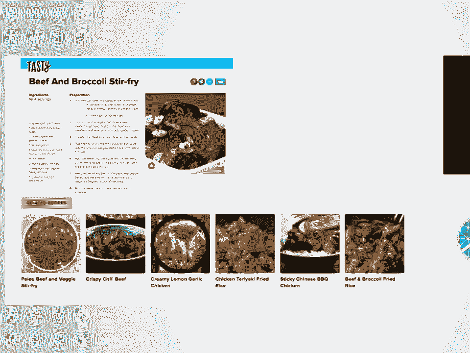

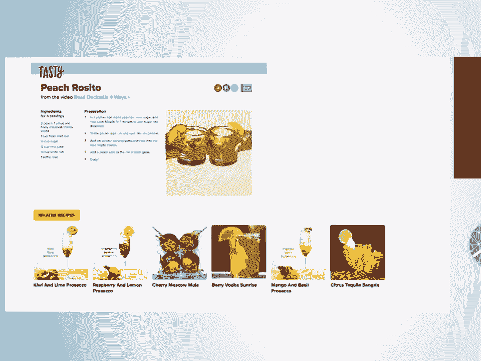

我们在食谱的准备步骤上训练了Word2Vec模型，并查看了数据集中前100种常见配料的词嵌入向量。通过t-SNE可视化，可以看到：
*   意大利面（如“意大利面”、“宽面”）聚集在蓝色区域。
*   酒类（如“波旁酒”、“杜松子酒”、“威士忌”）聚集在紫色区域。
*   咖啡类（如“浓缩咖啡”、“咖啡”）聚集在红色区域。
*   香草类（如“鼠尾草”、“迷迭香”、“百里香”）聚集在绿色区域。

这表明模型正在从食物空间中学习到有趣且有用的信息。

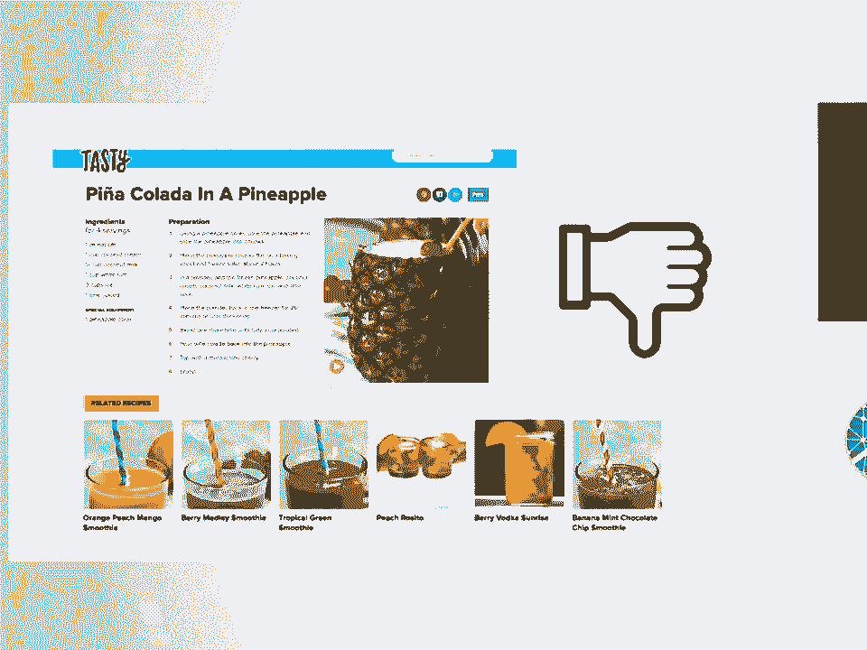

除了可视化，我们还通过计算向量间的**余弦相似度**来评估。虽然食物空间没有像“国家-首都”那样明确的强关系，但我们知道“沙拉”与“蛋糕”的相似度应远低于“玉米饼”与“鳄梨酱”的相似度。

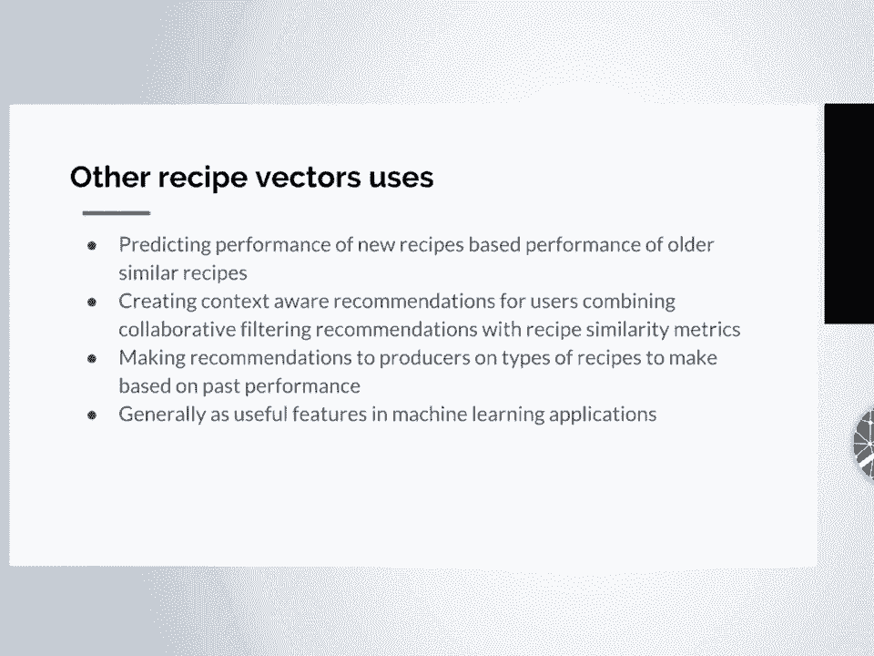

## 从词向量到食谱向量

我们的目标不是寻找相关的配料，而是寻找相关的食谱。词向量的一个优点是具有**可加性**，组合后的向量仍能保留大部分语义。经典的例子是：`king - man + woman ≈ queen`。

我们运用同样的概念，将食谱所有准备步骤中的词向量相加，得到该食谱的**食谱向量**。

然后，我们再次使用t-SNE来评估食谱向量的分布。尽管人工标签不可靠，但我们仍用其作为参考（蓝色=健康，黄色=舒适食品，绿色=甜点，紫色=酒精饮料）。从图中可以看到：
*   甜点（绿色）分布在底部。
*   舒适食品和健康食品（蓝色和黄色）混合在顶部（因为Tasty的食谱都不算太健康）。
*   蛋奶酒食谱聚集在一起，备餐食谱也彼此靠近，重复的食谱（如“龟纹布朗尼”）也聚在一起。

我们对食谱向量的表现感到满意，接下来将其投入生产。

## 生产化部署流程

我们将模型部署到生产环境的流程如下：

1.  **数据源**：从MySQL数据库获取结构化的食谱数据。
2.  **模型训练**：使用**Gensim库**的Word2Vec实现，读取食谱的准备步骤，训练模型。
3.  **生成食谱向量**：为每个食谱创建其向量表示。
4.  **计算相似度**：使用**余弦相似度**为每个食谱找出前20个最相似的食谱。
5.  **存储与调用**：将结果存储在**Redis**键值数据库中。Tasty API从Redis中检索数据，并提供给网站和App。

我们每周发布约15-20个新食谱。每次创建新食谱时，会将其应用到现有模型上。同时，每12小时会完整地重新训练一次模型。

## 实际效果与案例

以下是在我们网站上看到的一些实际推荐案例：

*   **奶酪夹心肉食谱**：成功找到了所有类似的“奶酪夹心肉”食谱。虽然这并非人人喜爱的晚餐，但我们的粉丝很喜欢。如果依赖旧标签，其中约一半可能被误标为“健康”。
*   **草莓派食谱**：推荐了各种蛋白酥、芝士蛋糕类的水果甜点。这比之前可能只显示“甜点”标签要准确得多。
*   **西兰花炒饭食谱**：推荐了各种类似的工作日晚餐，包含米饭和肉类。
*   **酒精饮料**：所有酒精饮料都被正确地分组在一起。

当然，系统也存在一些有趣的“怪癖”：
*   **准备步骤相似，用途不同**：例如，“椰林飘香”鸡尾酒食谱在准备步骤上与“思慕雪”非常相似，但从用户意图看，它更接近“草莓伏特加日出”等鸡尾酒。
*   **冷汤与思慕雪**：“西班牙冷汤”食谱也与思慕雪食谱相似，因为它们都是将蔬菜或水果搅拌而成。

总体而言，这种方法远优于单纯依赖人工标签。

## 未来应用方向

除了相关食谱推荐，我们还在探索或已经应用Word2Vec技术的其他方向：
*   **预测新食谱表现**：基于相似旧食谱的表现来预测新食谱的受欢迎程度。
*   **上下文感知推荐**：将**协同过滤**与食谱相似度指标结合，创建更智能的推荐。
*   **内容创作建议**：为食谱创作者提供关于应该制作何种类型食谱的建议。
*   **机器学习特征**：将词向量作为其他机器学习应用的有用特征。

## 总结

在本节课中，我们一起学习了如何利用Word2Vec技术解决食谱推荐的实际业务问题。我们从人工标签的不可靠性出发，探讨了传统编码方法的局限性，进而深入介绍了词嵌入和Word2Vec的原理及其关键优化。我们学习了如何评估词嵌入模型，并通过向量相加得到食谱向量，最终构建并部署了一个生产级的“相关食谱”推荐系统。这个案例展示了如何将前沿的NLP技术转化为提升用户体验和业务价值的产品功能。