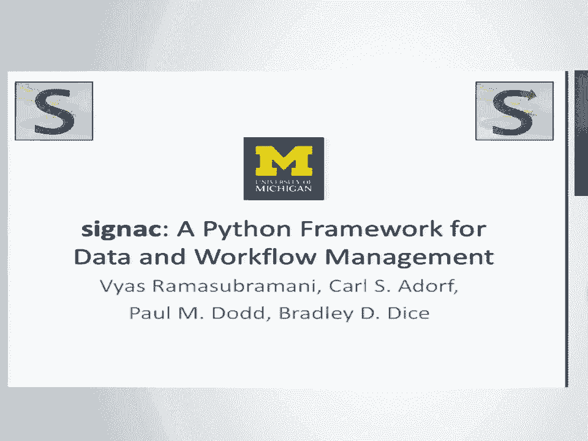
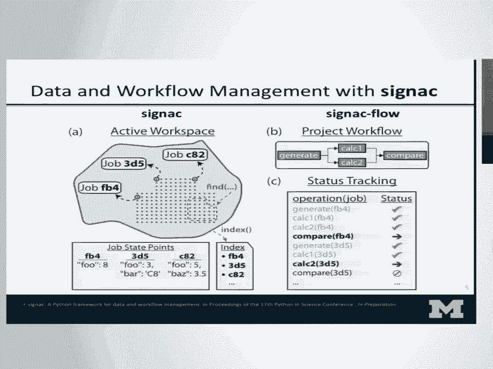
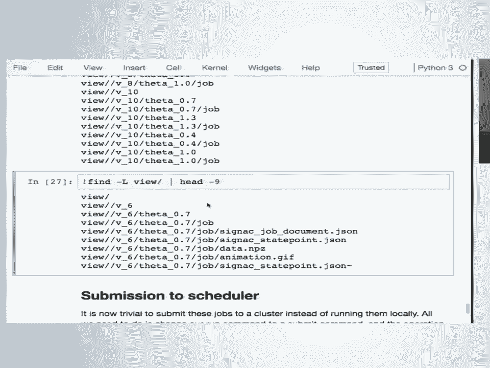
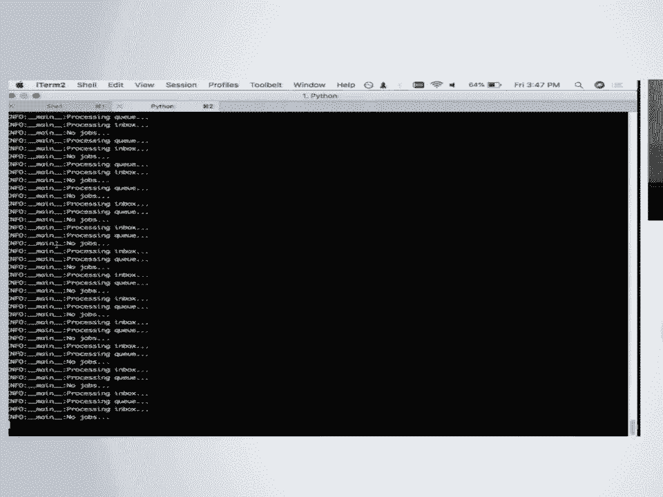
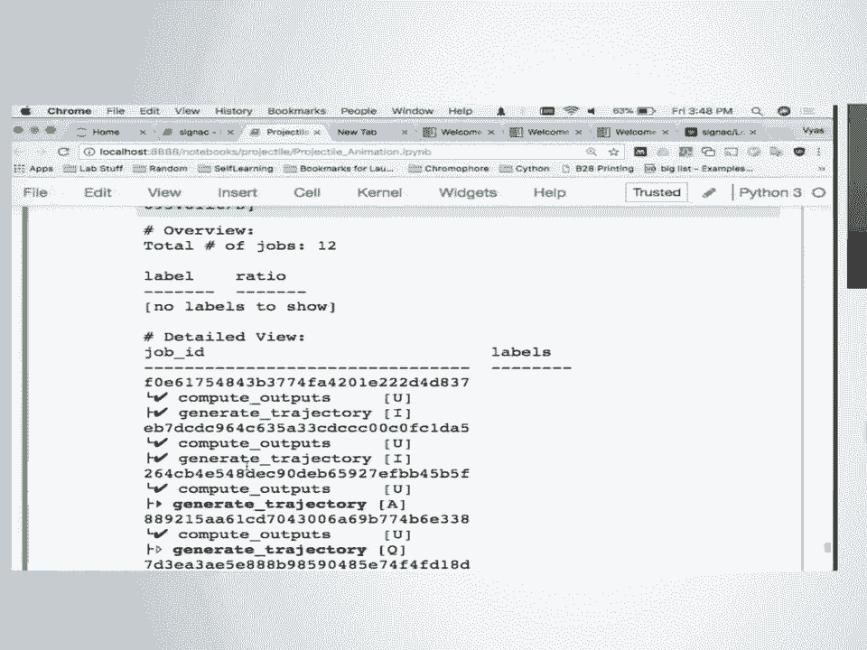
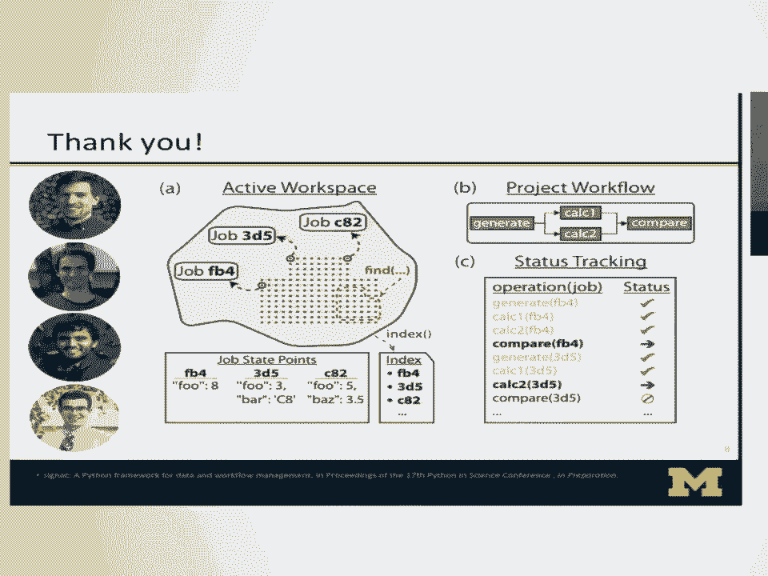

# 12：使用 signac 进行数据与工作流管理 🗂️

在本节课中，我们将学习一个名为 **signac** 的 Python 框架。这个框架旨在通过改进数据和项目管理，来提升科学研究的可重复性。我们将了解它如何帮助研究者系统地组织复杂的计算实验数据，并自动化相关的工作流程。

---

## 背景与动机

上一节我们介绍了课程的目标。本节中，我们来看看开发 signac 的背景和动机。

我们的团队来自材料科学研究领域。日常工作涉及分子动力学和蒙特卡洛模拟，就像下图所示。

模拟的具体细节目前无需深究。关键在于，我们关心大量不同的计算量，这些数据通常被输出到各种文件中，我们需要一种有效的方式来存储它们。

随着研究进程的推进和系统的完善，我们经常需要调整感兴趣的参数。所有这些都会在一个项目的生命周期中不断演变。

我们意识到，系统性地处理这个问题非常重要，因为这种情况非常普遍。任何进行参数扫描的人都会遇到类似问题。例如，使用机器学习方法进行超参数优化时，就需要用大量不同参数进行测试。

我们希望避免的情况是：生成一堆数据后，几个月再回来看时，已经不确定当时用了哪些参数，数据之间如何关联，梳理数据变得非常困难。因此，我们需要确保参数与数据的关联紧密，并且能够轻松地定期组织和访问所有数据。

关键的一点是，随着项目的演进和参数空间的变化，我们希望所使用的系统能够自然地随之演进。无论是在参数空间很小的时候，还是在后期拥有庞大参数空间和海量数据点时，都应该同样易于管理。

为了让这个概念更具体，我们可以看一个简单的例子。

假设你正在进行某种计算实验，有一个二维参数空间。你有一个二元系统，正在测量两种物质的浓度并据此进行计算。你建立了某种工作流程。

最初，这个流程会输出文件。你决定只跟踪其中一种物质的浓度，并像这样存储：`concentration_a=0.1_concentration_b=0.9`。

但你已经对如何存储数据做出了一些隐含的假设。例如，你可能认为将参数名与参数值分开更有意义。你的存储层级可能是：`concentration_a/0.1/concentration_b/0.9`。

或者，你可能觉得这样字符串太长，想缩短它。于是决定 `conca_0.1_conc_b_0.9` 就足够了。又或者，你觉得小数点后的零没必要，如果只是分数的话。现在的问题是，你可能会得到一些隐藏文件夹。你也可以尝试去掉它们，甚至用百分比代替小数。

现在你简化了存储，但也丢失了一些信息。它不像开始时那样易于解读。同时，当你的数据空间需要调整时，可能会遇到困难。

例如，你可能发现，在某个浓度以下，系统实际上还稍微依赖于温度。于是你在某些数据点中引入了温度参数。但现在你的数据空间看起来有点异构了。如果想通过编程来解析，有些地方有温度参数，有些地方没有，这可能会带来问题。你可能需要回过头来使其更统一。

这种问题可能出现在更复杂的数据空间中。突然之间，如果你决定在这个案例中只有两个温度，但有三个感兴趣的浓度，你可能需要重新组织你的数据空间。随着参数增加到数十个、数据点达到数千个，事情会变得越来越复杂。

这种麻烦正是我们希望帮你处理的。它会变得越来越复杂，你可以轻易想象这种情况会不断延伸。

我们希望处理的另一个方面是，例如，这里我将系统扩展到了三维参数空间，现在有三个浓度。你可能会想到，在三元系统中，一切都会变慢，你必须在高性能计算集群上运行。因此，你需要先在本地系统上测试，然后移植到某个 HPC 集群，编写作业脚本，确保所有数据都能传输过去。

为了解决所有这些问题，让你更容易处理而无需过多思考，我们开发了 **signac**。我们以一位点彩派画家保罗·西涅克的名字为其命名。选择点彩派作为我们的模型，是因为这种绘画风格用点而非笔触来创作。我们认为这是对数据空间和数据科学的一个很好的类比。

---

## signac 核心概念

上一节我们了解了数据管理的痛点。本节中，我们来看看 signac 是如何解决这些问题的。

在上图的灰色区域中，是我们的数据空间。在 signac 中，我们称这个数据空间为 **工作空间**，它由一个个独立的数据点组成，我们称之为 **作业**。

signac 的关键在于，每个作业都需要与一组唯一的键值映射相关联，我们称之为 **状态点**。这通常就是你的一组参数。在我们之前的例子中，这可能是你关注的浓度或温度。通过这种方式，你可以将所有的数据、所有的文件映射到一组参数上。

只要有了这种紧密的映射，我们就可以对数据进行哈希运算，为每个作业生成一个唯一的 ID。这就是我们组织数据空间的方式。你可以看到上图中的哈希值，它们为每个作业提供了唯一 ID。一旦有了这个，你就可以用它来在文件系统上创建一个数据库。

如果你有一组键值映射，你可以立即对其进行哈希运算，并搜索特定的数据点，或者用它来分组数据。基于此，你就有了一个完全无服务器且无模式的数据库，可以存储任何你想要的东西，并且它可以随需增长或收缩。

我们展示的另一部分是构建在此之上的工作流。如何自动化地对这个数据空间进行操作？为此，我们开发了一个额外的包：**signac-flow**。它本质上允许你建立一系列操作，或者任何形式的有向操作图，其中操作以特定方式相互依赖。

通常，你希望这些操作是基于每个作业的。有时在分析时会聚合数据点，但更多时候，典型的操作是基于每个作业进行的，这也是我这里展示的模型，尽管它并非强制性的。

一旦你设置了这样的结构，基本上你需要告诉 flow 何时运行一个任务，以及完成后何时运行下一个。我们稍后会看到更具体的例子。

重要的是，一旦你编码了这些信息，你可以在右下角看到，flow 可以开始为你跟踪进度。它知道对于特定的作业，你在工作流中进展到了哪一步，接下来需要运行什么，什么还没完成。通过这样做，它让你基本上拥有了一个“播放”按钮。你只需点击运行，它就会为你运行整个流程。因此，如果你把这个完整的包交给别人，一切都能立即轻松复现。

---

## 实战演示：模拟火箭发射轨迹 🚀

到目前为止，这些概念听起来可能有点抽象。既然是 SciPy 大会，我将花点时间演示一下这具体是如何操作的。

如果有人感兴趣，我这里有 GitHub 仓库地址，欢迎查看。

在这个演示中，我做了一些非常简单的事情。不必太担心这里的数学，基本上只是使用简单的牛顿物理学来计算你能把某个东西发射多远。我碰巧在楼下的桌子上找到了一个这个，我的例子是关于火箭的，所以让我们发射它。

假设你有一个小小的玩具火箭，你想让它飞起来。你知道它以每小时 6 英里的速度飞行，你想找出在什么发射角度下它能飞得最远。所以你的简单实验就是尝试一堆角度，看看哪个角度让它飞得最远。

在我们引入 signac 之前，先看看假设这是一个无法解析求解的复杂计算，你可能会如何找出最优值。最简单的方法就是尝试一堆不同的值，然后通过数值方法逼近。

这里我定义了几个简单的函数，明确告诉你每个函数在做什么。有了这些函数后，你可以循环遍历一组角度，看看会发生什么。你总是可以自己尝试，改变它，做一堆不同的事情，看看在哪里能找到接近最优解的值。

signac 的目标是让持久化所有这些数据变得容易。你希望存储它们，而且很可能你存储的是文件而不仅仅是数字，所以你希望持久化到文件系统。

使用 signac 做到这一点非常简单。我之前提到了**工作空间**的概念。在 signac 中，数据、所有相关文件、甚至用于生成数据的脚本，都存在于一个称为**项目**的目录中。

因此，我在这里做的第一件事是通过一个简单的 Python 调用初始化这个项目，然后我创建一个**作业**，也就是我们所说的一个数据点。到目前为止，我写的与 signac 相关的独特代码基本上只有三行：创建项目、创建作业。完成后，我只是将数据存储到那个作业中。

乍一看，你得到了一个存储数据的 Python 对象，但真正的关键在于，现在所有这些数据都被持久化在文件系统上。如果我们查看文件系统，现在有一个工作空间目录。里面是这个……（字号够大吗？我可以放大一点。）现在如果我查看这些目录内部，你会看到一个工作空间目录。里面有一个对应于我们哈希值的子目录，所以我们现在把数据存储在那里了。参数值以及我们想要存储的信息，都被存储到了这些 signac 状态点和作业文档 JSON 文件中。

现在，除了存储这些对象，你还可以在此上下文中存储任何类型的文件。你可以将作业用作上下文管理器，自动将任何内容存储到这个空间，从而让你能立即将生成的任何文件与此关联。

假设你已经完成了这个计算，但你意识到你不仅对它能飞多远感兴趣，实际上你对完整的轨迹感兴趣。你想看到的不仅仅是它落在哪里，还有它到达那里的路径。

如果你想这样做，在没有 signac 或没有太多 signac 的情况下，你可能会这样做。这只是用 matplotlib 生成轨迹动画，并不复杂，最终你会得到类似这样的东西。

但整个重点是在一堆角度上进行优化。为了运行一堆不同的情况，我们需要扩展我们的数据空间。在 signac 中做到这一点非常简单，就是我们已经在做的事情，只需要在一个循环中对一堆不同的数据值进行操作。

让我们先这样做。关键在于，既然我们已经存储了一切，它基本上就在一个数据库里了，所以我们可以立即通过某种接口访问所有这些。这里我展示的是最简单的一种，即迭代我们拥有的每一个数据点，看看其中哪个飞得最远。

在这里你可以看到，`for job in project` 能获取你拥有的每一个数据点，但还有更高级的方法来实际搜索，我们稍后会看到。

---

## 扩展参数空间与自动化工作流

现在我们触及了我们感兴趣的核心内容。拥有初始数据点是一回事，但当参数空间变化时，你希望以某种方式推进它。

例如，假设有人来找你说：“我开发了一种新的火箭燃料，现在速度不是每小时 6 英里，而是 8 英里或 10 英里。” 那么，当你想做这个改变时，看看会发生什么。

在 signac 中，这几乎就像用一些新参数重新标记你所有的作业一样简单。你可以像我在这里展示的那样添加参数，但也可以同样轻松地删除它们，或以任何你喜欢的方式进行操作。这些参数可以嵌套，所以只要可序列化，你几乎可以包含任意信息。

现在我们可以将数据空间扩展到二维参数空间，其中包含一堆内容，并开始尝试编码我们感兴趣的计算工作流。

到目前为止，我们有两个计算：我们关注物体飞行的距离，以及它飞行的轨迹。

在这个代码单元中，你会注意到我正在写一个文件。这里的大部分内容你不需要担心，它基本上与我们之前看过的轨迹计算逻辑相同。与 signac 相关的重要内容从这里开始。

你会看到我们定义了两个不同的函数：`compute_outputs` 和 `generate_trajectory`。关键是 `@Project.operation` 这个装饰器，它基本上告诉 signac-flow 我们希望将这些函数作为工作流的一部分进行跟踪。它们会立即被添加到图中，图的边（即顶点之间的依赖关系）也随之设定。

所以，告诉系统何时可以运行某任务、何时完成的条件，是作为前置和后置条件添加的。这就是这些装饰器的作用。在这个案例中，我基本上是在说，在前一个任务完成后运行下一个，并且当某些文件生成时，任务才算完成。

这些函数的内容可以是任何你想要的。在这个案例中，基本上就是我们已经在做的事情：最初的计算，然后创建动画。

一旦我们写出这个文件，我们现在就可以用它做很多事情。我们可能想看到的第一件事是：我们已经完成了多少工作，还有多少工作要做。

这里我使用了一点 bash，但用的是命令行界面。我只是检查第一个操作还有多少任务需要运行。之前我们已经计算了其中一些量，所以现在你可以看到还剩多少。

有多种方式与此交互。这里你可能尝试运行一个任务，它会继续并打印出它在做什么。我让它在这里详细输出，所以你可以看到它在这里运行了一个操作。

但我们真正想要的是那个“播放”按钮，即告诉它做很多事情的能力。例如，我们可以告诉它运行为某个特定操作所有未完成的任务。任何你还没有计算距离的作业，让它去计算所有那些距离。在这个案例中它超级快，因为只是几行数学计算。但你也可以轻易地让它做更复杂的事情。

如果我们现在查看工作流的状态，你会看到对于几乎所有作业，我们已经完成了计算，但还没有生成轨迹。我们还没有存储这个动画。

所以，如果我们想完成这个，我们可以告诉它去完成我们工作流中每个部分的每一项任务。在这个案例中，就只是一个操作。所以，只需一个简单的 `run` 调用，它现在就会尝试完成所有剩余的工作。在这个案例中，就是那个操作，它会循环遍历每一个作业并执行。

在这个案例中，我们有一个相当简单的线性两步工作流。但我们所做的好处在是，你现在已经建立了一个系统，可以拥有任意复杂的工作流。它会以完成任务所需的速度向你展示进度。

如果我们在此之后查看，并让它告诉我还有什么要做（这是一个稍微不同的视图，我过滤掉了已完成的任务），你会看到它几乎是空的，因为它已经为我们完成了所有事情。

---

## 数据查询与动态视图

至此，我们已经介绍了基础知识：如何持久化数据，以及如何通过这个系统自动化工作流。但如果要点是拥有一个数据库，你真的需要能够从中提取数据。我之前给了你一个非常快速的例子，说明你可能如何做到。

现在我们可以更详细地看一下。因为这是一个无模式数据库，原则上你不需要定义任何像表结构那样的东西。但查看数据空间中的所有参数值可能很有趣，你可以轻松地获取它们。

利用这些，我在这里所做的就是为我们完成的这些动画创建一个绘图网格。现在你可以看到，这只是一些简单的 HTML。但关键在于，在这里我实际上已经循环遍历，并为我们关心的每一个参数组合找到了我们想要的文件。你能够直接从文件系统中获取它。

在这个阶段，你可能会说，好吧，这是一个不错的编程接口。但如果我只是想用命令行与数据交互，比如 `cd` 进入文件，可能有点困难。通常，如果你设置了像之前那样的文件夹结构，你会确切地知道要 `cd` 进入哪个文件夹，在哪里取出你关心的文件。

为了恢复类似的功能，我们有了**视图**的概念，它基本上给你另一个文件夹结构，复制了你最初拥有的样子。进入这个视图，你可以看到，现在它为数据空间中存在的每一种参数组合都有一个文件夹。

显然，你可能会说，现在你只是回去做了你最初试图避免做的事情。但关键在于，这些视图是**动态的**。你的数据仍然存储在我们之前展示的那种哈希工作空间类型的设置中。但关键是，这个视图可以在任何时候动态生成，并且会根据任何时间点存在的文件集进行更新。

你会注意到，在每个层级的底部，这里有一个小作业目录，这基本上是一个指回你工作空间的符号链接。所以，如果我们告诉 `find` 命令跟随我们的链接，我们会看到它指向存储在其他地方的数据。

---

## 集群调度集成

我承诺的最后一件事是，我们将能够用某种调度器来运行这些作业。让我简要展示一下你可能如何做到这一点。

显然，在我的电脑上我不运行 SLURM 或 PBS，但我可以运行一个 signac 提供的非常简单的调度器。你可以看到这里有一个随附的简单调度器，仅用于测试目的。我们快速看一下它现在是什么样子。

我将删除我之前创建的一些动画，为了确保它生效，我们可以快速运行这个。现在你会看到有五个作业缺少这个目录文件。

现在我可以做的是，不是用 `run all`，而是将那个命令改为 `submit`。现在它正在将这些作业提交到一个集群，在这个案例中集群就在这里。你会看到现在我有一些作业在排队。如果我们开始在这里检查状态，我们会慢慢看到这个状态被更新。

在这个案例中，你会看到它实际上正在运行这个操作。这里有一个图例指示每一部分代表什么。现在它正在为一个作业运行，我们可以持续更新它，慢慢地我们会看到随着时间的推移，所有这些操作都完成了，最终所有任务都结束了。

好处在于，这是一个测试案例，但如果你想提交到任何内部集群，你可以立即将所有内容复制到那里，只需更改你的命令，它就会立即为你写出作业脚本并提交。

我向你展示的所有作业跟踪功能也立即扩展到那里。你将能够登录集群、提交任务，然后查看进度，并设置序列，使得当集群上的一个作业完成时，下一个作业就会运行。所以你不再需要手动管理这些了。

好的，说到这里，我想我的时间有点不够了。所以我将开始致谢。

这项工作主要由美国国家科学基金会资助，感谢他们。这是我们小组的照片。如你所见，这是一个相当大的小组，他们中的许多人在反馈和信息方面提供了很多帮助，告诉我们如何让这个工具更好，我们从他们那里得到了很多帮助。

最后，当然还有我的共同开发者，底部的 Simon、Paul 和 Bradley。感谢他们所有人以及我们共同付出的辛勤工作。

到此结束，我将回答任何问题。

[掌声]
有什么问题吗？

**提问者1**：很有趣。你提交到集群。如果你提交到多个集群，并且在所有这些集群和本地机器上运行，你如何在它们之间同步这个哈希表？

**回答**：是的，这是我们一直在收到的一个功能请求。目前，我们典型的操作模式不是在同一件事上提交到多个地方。所以我们没有那个功能。实际上，我通常处理这个问题的方式是：工作空间目录只是一个目录，所以你可以随意重新指向它。通常，如果我有这个需求，我实际上会划分我的数据空间，让一些数据在一个集群上，一些在另一个上。这样，我将在某个集群上运行部分任务，在另一个上运行其他部分。但目前没有跨多个集群跟踪作业的方法。

**提问者1**：数据总是驻留在其他集群上，还是你可以把它聚合到其他地方？

**回答**：数据就驻留在集群本身，直接存在于文件系统上。通常，如果你想在集群上执行，我们所做的就是将整个文件夹复制过去，然后所有东西就都在那里了。

**提问者1**：但是当你复制回本地主机时，如何处理？复制回来。很多时候，你在集群上只能使用一定量的文件系统空间，必须把数据拿回来。是的。那么你如何取回数据，signac 如何处理这个？

**回答**：哦，明白了。我们开发了一个名为 `signac sync` 的工具，它也内置在其中。它本质上……不完全是 `rsync`，但以 `rsync` 为模型。基本上，你可以来回同步所有文件。所有的状态信息都包含在我向你展示的其中一个 JSON 文件中。所以一旦你同步回来，你拥有的所有东西就都在那里了，它也会把文件复制回来。它会智能地进行差异比较等操作，以确定应该复制什么，需要什么。

**提问者2**：首先有个问题，它的可扩展性如何？你展示了能够使用两种不同的调度器。对于其他人来说，