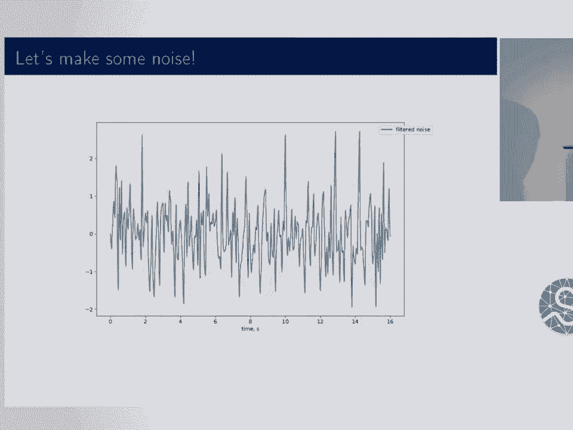

# 13：SimuPy - Python 动态系统建模与仿真框架 🚀

在本节课中，我们将学习一个名为 SimuPy 的 Python 框架，它专门用于建模和仿真动态系统。我们将从动态系统的基本概念开始，逐步了解如何使用 SimuPy 构建模块图、进行仿真，并探索其高级功能。

## 概述

动态系统通常由一个带有输出函数的微分方程，或仅由一个输出函数来定义。它们是我们对几乎所有事物进行建模的基础。对于一个特定系统，可以有一个状态（可能由 R^N 空间中的一个点表示）、一个输入（可能由 R^M 空间中的一个点表示），以及可能的状态方程和输出方程。需要指出的是，在本动态系统模型中，不允许有状态的系统存在前馈，这意味着有状态系统的输出方程中不包含输入 U，这使得后续的积分运算更为简便。

## 从物理模型到模块图

如果你有一个系统的动态模型，可以将它们组合成模块图。模块图是一种从简单模型构建复杂系统的概念性工具。我们将讨论的模块图是诸如电路图甚至受力分析图等特定领域图的一般形式。其关键特性之一是允许你在不同的抽象层次上工作，这对于分析和学习问题非常有用。模块图的核心在于它包含不同的模型以及可能子系统之间的不同连接。

上一节我们介绍了模块图的概念，本节中我们来看看如何将具体的物理问题转化为模块图。

例如，这是一个运算放大器的电路图。它非常具体，如果你了解细节，它能告诉你很多信息。但有时你并不关心细节，因此希望将其抽象化，变成更像这样的形式。虽然细节丢失了，但你获得了相同的概念流程，甚至更容易看清概念流程。这样你就不必再应用基尔霍夫电流定律等复杂规则了。

我最喜欢的一种运算放大器模块图需要稍作解析。这是一个用运算放大器实现的模块图。其中包含几个运算放大器，它们是你可以组合起来创建模块图的不同模型。这实际上来自 1985 年的一门控制系统课程视频。在那个计算机仿真尚未普及的时代，仿真全部通过模拟电子设备完成，我认为这非常了不起。所以，教授用的不是 Matplotlib，而是一个小示波器。

## Simulink 与 SimuPy 的动机

谈到模块图，就不能不提 Simulink。Simulink 是基于 MATLAB 的专有模块图仿真软件包，应用极其广泛。随着科学计算 Python 的兴起，人们开始寻找 Simulink 的替代品。这正是我开发 SimuPy 的动机。我并不认为它是一个完全的替代品，但它确实满足了我从 Simulink 中需要的许多功能。

## 入门示例：单摆系统

为了向大家介绍 SimuPy，我将以一个简单的下垂单摆为例。这是一个受力分析图，我用 X 表示摆角，即单摆的角位置。它有长度、质量，并且受到重力作用。分析它的方法有很多，但我们可以将其转化为模块图。

这里我有一个代表惯性的模块。这是一个有状态的系统，状态是位置和速度，输入是作用在关节上的力。它有两个输出，我让它同时输出位置和速度。我们将其连接到一个重力模型中，这是一个与位置相关的力，即 `m * g * sin(x)`。

现在，我们想将其放入 SimuPy 中。以下是一系列导入语句和几个辅助绘图函数。但这是我们定义符号动态系统的方式。我们也将使用函数来定义动态系统。

如果你从 SimuPy 声明符号，有动态符号（基本上是信号、状态变量或传递的力等），可以有常量参数。然后，你可以指定状态方程。我写了一个符号版本的 `np.r_`，这只是创建一个表达式数组。所以，`x_dot = v` 和 `v_dot = u / (m * L^2)`。状态是 x 和 v，输入是 u。你可以定义参数。

对于重力模型，情况类似。重力没有状态，所以只有输出方程、输入和常量参数。

然后我们把它们组合起来。声明一个模块图，传入两个系统，连接它们。重力只有一个输出，惯性有一个输入（作用在关节上的力）。惯性确实有两个输出，所以当我们连接时，必须告诉重力模型，单摆的位置是惯性模块的第 0 个输出（即位置），而不是速度。

接着，我们可以执行 `block_diagram.simulate(time)`，并将结果直接传入绘图函数。得到的结果看起来不太理想。但我记得，如果一个单摆悬挂在那里，它只会静止不动。所以这没问题。

我们可以改变初始条件。如果将其设置为 60 度，然后重新仿真，只需通过设置初始条件参数并传入两个状态的数值数组，就能看到期望的振荡。

## 利用模块图进行系统分析

现在，我们将开始利用模块图方法进行系统分析的实际优势。惯性系统在状态和输入上是线性的，这使得很多事情变得非常简单。但重力项不是线性的，因为它包含 `sin(x)`。一个常见的线性化方法是用 `x` 来近似 `sin(x)`。

模块图的优点在于，我们可以轻松地在不同输入模型之间切换，而不会丢失正在发生的各个部分的跟踪。我们可以用 SimuPy 轻松地表示这一点。

我可以创建一个线性化的重力系统，即 `-g * x / L`（我假设 m=1）。我可以将其添加到模块图中，然后连接它。当我连接到一个输入时，它会清除其他输入。

我还可以遍历不同的初始角度。在这里的循环中，每次迭代我连接一个重力模型进行仿真，然后连接另一个模型进行仿真。这正是我们绘制图形时想做的，现在可以用代码轻松实现。

以下是输出结果。这是你在本科控制课程中可能会看到的内容。如果初始条件很小，线性化重力模型相当好，在开始出现轻微偏差之前能维持好几个振荡周期。但在大振幅下，线性和非线性模型会更快地分道扬镳。另一个你会看到的现象是，线性模型的周期是恒定的，与振幅无关。从一个如此简单的例子中看到所有这些特性，非常有趣。

## 添加粘性阻尼

现在我们可以引入粘性阻尼。我将保留非线性重力并添加阻尼。创建粘性阻尼系统很容易。但惯性只有一个输入（力），所以我们需要一个“帮手”。

幸运的是，我知道谁能帮助我们。我可以使用线性时不变系统创建一个求和系统。这是一个辅助函数，可以轻松地使用矩阵（NumPy 矩阵）创建系统。通过创建一个 1x5 的增益矩阵，结果就是对五个可能的输入求和。

目前，SimuPy 无法解析流程顺序。所以，如果我将求和器添加到模块图中，它将永远看不到其他系统的输出。因此，我需要以能正确解析的顺序创建一个新的模块图：惯性、求和器、重力、粘性阻尼。

然后，我可以进行所有类似的连接：将速度连接到粘性阻尼（因为力取决于速度），将求和器连接到惯性（所有力的总和作用于惯性），将重力项连接到求和器，并将位置反馈给重力。

我还可以遍历不同的阻尼系数值，通过一个迭代器并绘制结果。即使在 Simulink 中，根据编程经验，要足够自如地采用这种编程方法也可能有些繁琐。而直接在 Python 中，操作这些参数的正确做法是显而易见的。

## 引入噪声输入

这很有趣。让我们添加另一个输入：制造一些噪声。由于我使用的是 SciPy 的积分器（它对系统的导数进行采样），如果需要一个噪声模型在相同条件下给出相同的结果，我需要采样。

为此，我将从零均值高斯分布中抽取 N 个样本，将其分布在时间上，并采用零阶保持作为第一步。以下代码实现了这一点。我使用了一个离散插值函数（只是一个最近邻插值函数）来完成。

绘制出来，这就是我在这次运行中得到的噪声。现在我想通过一个低通滤波器来过滤它。作为一个控制领域而非信号领域的人，对我来说最简单的方法是将其通过一个低阶低通滤波器系统，并在我的模块图中进行仿真。

以下是我正在做的：我从我的插值函数创建一个系统，连接到滤波器，仿真滤波器，然后使用连续插值函数获取连续的轨迹，从而得到一个噪声函数和系统。这就是我将用于带噪声仿真的、略微平滑的噪声轨迹。

然后，我只需将该平滑噪声的插值函数添加到我的模块图中，并将其连接到求和器。如果我将初始条件设为零，就可以看到单摆仿佛在风中悬挂时的行为。它会振荡一点，最多达到 4 度。

但这还不够刺激。我们可以做一个更刺激的输入，比如在单摆的固有频率处施加正弦波。去掉白噪声，加入正弦波。我可以创建一个 lambda 函数来输出正弦波，从中创建系统，然后查看其输出。虽然叠加在噪声图上的正弦波没有显示出来，但我使其输入系统的功率大致相同，这是输出结果。令人兴奋的是，共振系统确实产生了更大的振幅，正如你所期望的那样，即使功率大致相同。实际上，噪声的功率还稍大一些，但由于它不是共振的，所以不会像正弦波那样将系统激发到更高的振幅。

## 事件处理

一个我在单摆例子中不太知道如何加入的功能是事件。为了在存在不连续性的情况下获得微分方程的良好解，你需要一个事件处理器。我已将其添加到积分循环中。

这是一个弹跳球的例子，实际上是 Simulink 用于其事件系统的示例，效果很好。以下是相关代码。我有一个辅助函数，可以更轻松地编写某些类的不连续系统。这是一个非常相似的模型，基本上是双重积分器。

我所做的是在位置变量 x 为零处创建一个边界。每当它越过边界时，我将位置更改为绝对值（应该是一个很小的数，因为它会找到碰撞发生的位置并进行插值，以获得该碰撞发生位置的相当精确的近似值，所以应该非常接近零）。然后有一个反弹乘数 μ，它会翻转符号并减少能量。

这是一个更难的问题，所以我确实需要更改一些积分器选项。但你可以仿真它，这就是我之前展示的图形。你还可以分析计算碰撞应该发生的时间，结果与点完全吻合，这很棒。

## 总结与展望

以上只是对 SimuPy 的简要介绍。我希望大家喜欢它。我非常希望人们能尝试使用它，并帮助我构建它。过去四年我一直独自进行这项工作。

一些总结性发言：我希望 API 能够真正服务于系统和基于模型的分析方法。因此，即使是函数名也匹配更严格的命名规范等。我还想指出，我并不打算将其打造成一个功能齐全的仿真器。拥有一些事件处理功能确实很有用，尤其是在控制系统中，你需要饱和块等。但我不想成为 Mujoco 那样的工具。

另一个有趣的事情是线性分析是有效的。在我的测试和一些示例中，我比较了手动分析并创建单一系统的情况，与包含系统和控制器的模块图进行了比较，它们完全匹配。你还可以对线性时不变系统执行诸如使用 Z 变换获取离散时间系统等操作。

文档和测试覆盖率相当不错。但我一直在开发几个新功能：我刚刚改变了离散时间系统的处理方式，现在它们基本上有一个内部时钟，并由事件系统处理。我还希望让你能够从模块图创建系统，以便获得那些非常有用的不同抽象层次。

是的，它相当稳定。但我在 PyPI 上有一个略显仓促的 1.0 版本。以上就是全部内容。

在本节课中，我们一起学习了 SimuPy 框架的基本概念、如何将物理系统转化为模块图、进行线性和非线性仿真、添加阻尼和噪声输入，以及处理不连续性事件。SimuPy 为在 Python 中进行动态系统建模和仿真提供了一个强大而灵活的工具。