# 14：Yaksh - 通过实践促进学习 🧑‍🏫

在本节课中，我们将学习一个名为 **Yaksh** 的开源教学工具。它由印度FOSSEE项目团队开发，旨在通过自动化的编程练习和即时反馈，帮助教师评估学生，并帮助学生通过“动手做”来更好地学习编程。

---

## FOSSEE项目简介

在深入了解Yaksh之前，我们先简要介绍一下其背后的组织——FOSSEE。FOSSEE代表“教育用自由开源软件”，是一个由印度政府资助的项目，自2009年启动。该项目的目标是推广自由开源软件在教育领域的应用，鼓励人们使用免费、易用的替代方案，而不是购买昂贵的商业软件许可。这对于资金有限的印度尤为重要。

FOSSEE维护着一个庞大的资源库，其中包含约500本教科书的纯Python解答示例，这些都以Jupyter Notebook的形式提供。这是一个由印度本科生多年众包贡献的宝贵资源。

---

## 编程教育的挑战与Yaksh的诞生

上一节我们介绍了FOSSEE的背景，本节中我们来看看Yaksh要解决的核心问题。一项调查显示，印度只有**5%**的计算机科学和工程专业毕业生能够编写逻辑正确的程序。这是一个严峻的问题。

编程不仅仅是理解语法，更需要通过大量实践来掌握。然而，传统的教学方式难以提供即时反馈，教师也难以规模化地评估大量学生的编程作业。这正是Yaksh诞生的初衷。

Yaksh最初是一个为2011年一个涉及千名教师的在线培训课程而开发的Django应用程序，用于自动评分。如今，它已发展成为一个功能全面的课程环境，核心专注于**评估**和**练习**。

---

## Yaksh是什么？🛠️

Yaksh是一个开源的、基于BSD许可证的Django应用程序。它支持多种编程语言，包括**Python**、**C**、**C++**、**Java**、**Bash**和**SQL**。

以下是Yaksh支持的主要题型：
*   **编程题**：支持标准输入输出测试，在Python中还可以进行基于测试用例的函数和类测试。
*   **选择题**
*   **填空题**
*   **代码排序题**：让学生排列代码块以理解控制流。
*   **作业文件上传**：可线下评分或编写脚本在线自动评分。

---

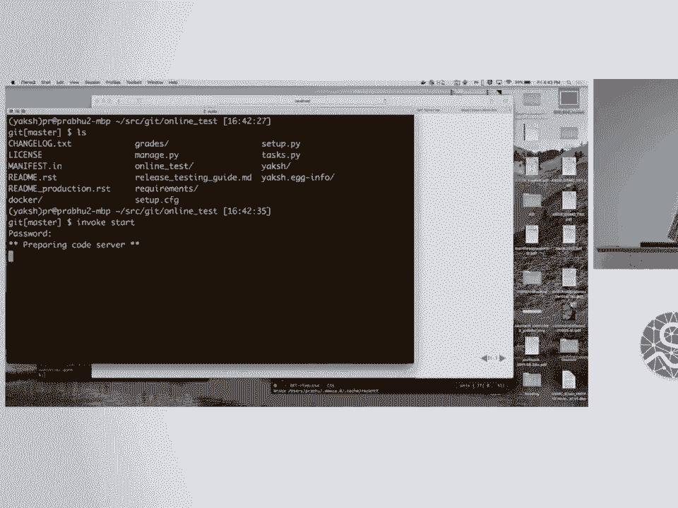

## 为什么使用Yaksh？✨

Yaksh的核心优势在于其**即时反馈**机制。在编程练习中，学生可以多次提交代码，系统会立即运行测试并告知结果。这鼓励学生大胆尝试和调试，而不用担心失败。

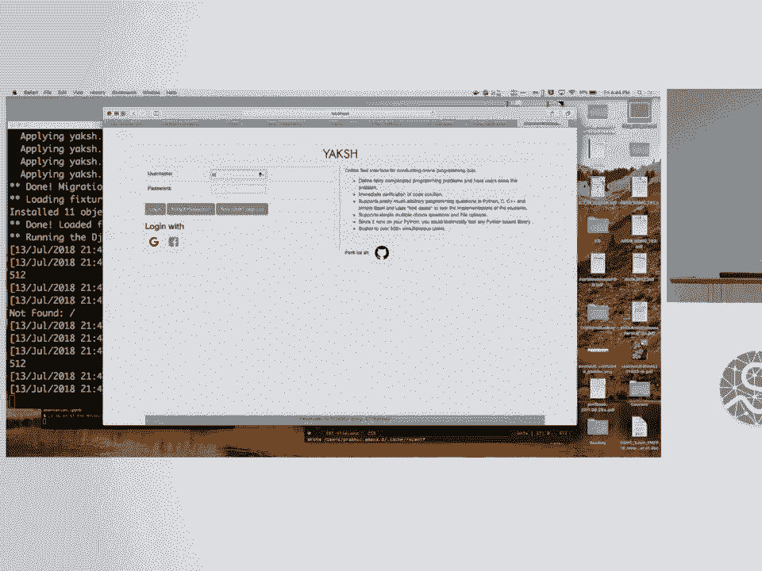

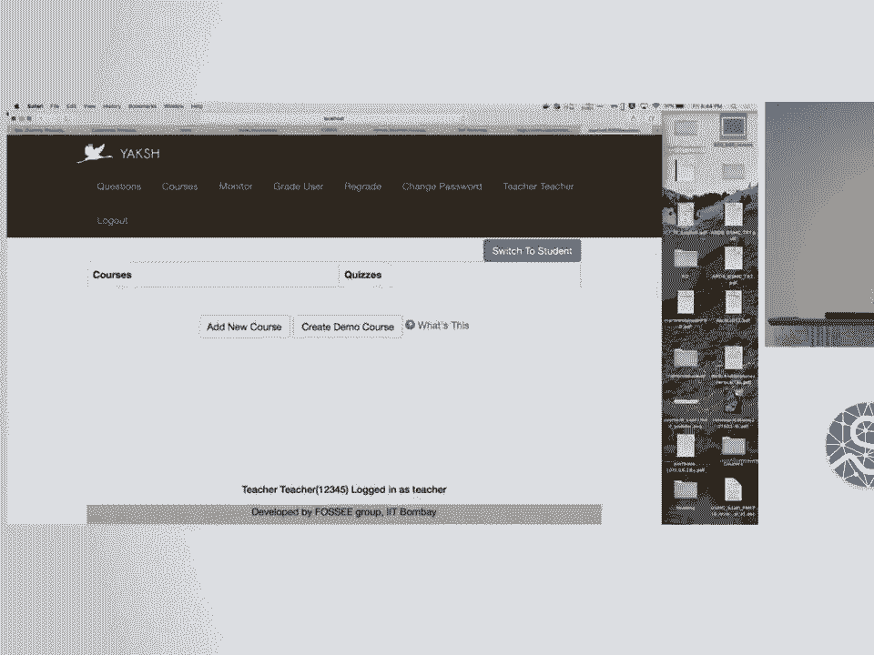

对于教师而言，Yaksh提供了强大的监控功能。教师可以实时查看全班学生的答题进度、成绩以及每次提交的尝试记录。这有助于教师快速识别学生普遍存在的难点，从而调整教学策略。

此外，Yaksh易于部署，能够良好地扩展以支持大量用户。

---

## 安装与快速启动 🚀

Yaksh的安装过程相对简单，团队提供了Docker容器来安全地运行和评估学生代码。

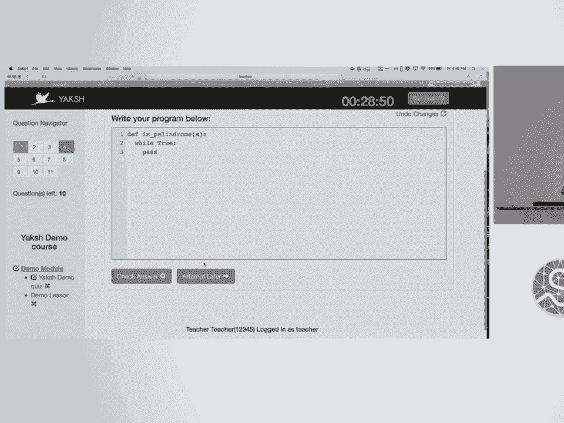

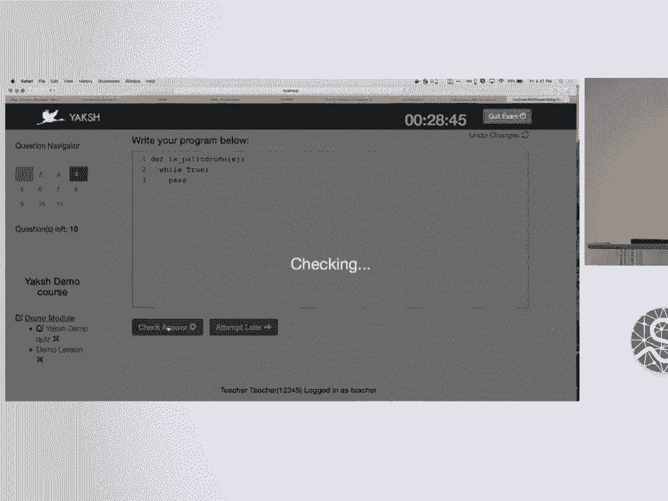

以下是快速在本地启动演示实例的步骤：
1.  克隆代码仓库：`git clone <repository-url>`
2.  进入目录并安装依赖：`pip install -r requirements.txt`
3.  使用内置的`invoke`脚本启动服务：
    *   `invoke start`：启动负责代码评估的“代码服务器”。
    *   `invoke serve`：启动Django开发服务器。
4.  在浏览器中访问 `http://localhost:8000/exam` 即可进入演示界面。

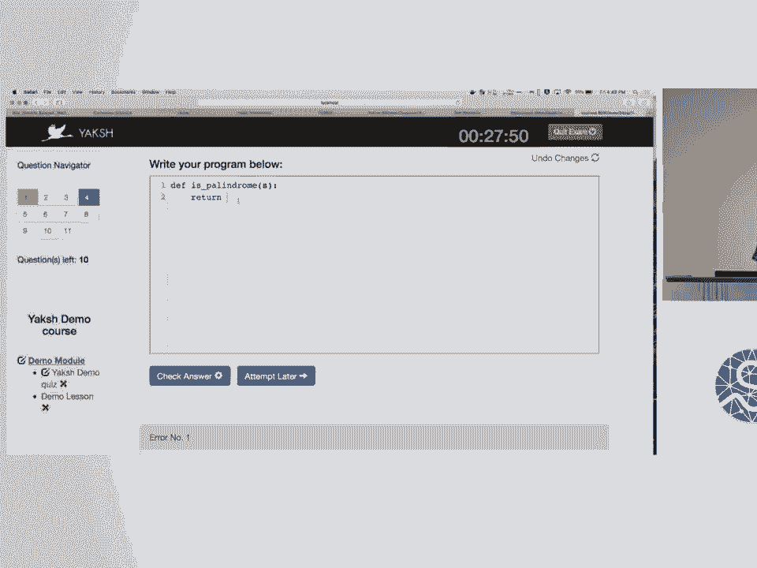

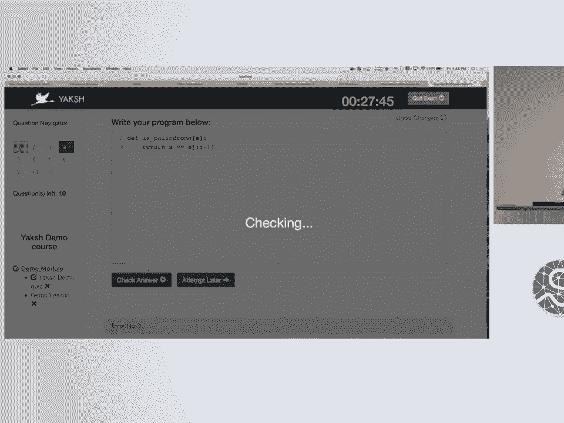

默认提供教师(`teacher`)和学生(`demo`)账号，方便快速体验。

---

## 功能演示：学生与教师视角 👨‍🎓👩‍🏫

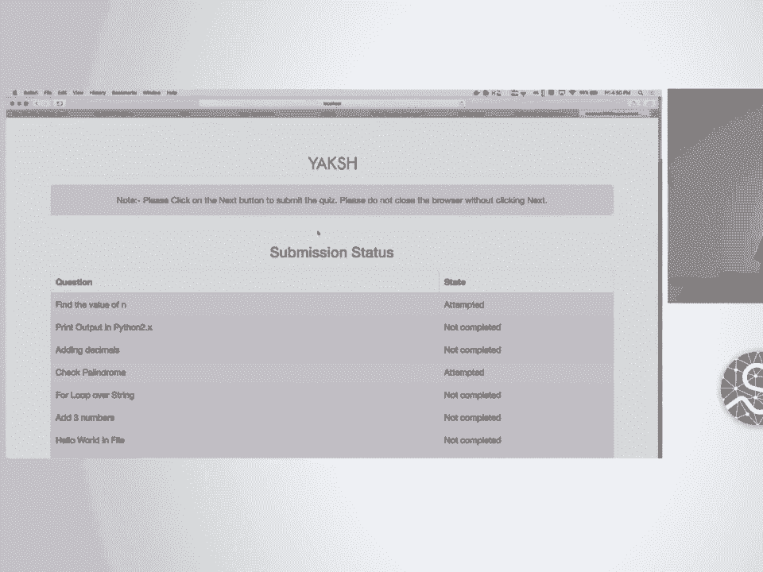

### 学生体验
学生登录后，可以加入课程、参与测验或学习课程模块。在编程题中，学生编写代码并提交，系统会返回测试结果。如果代码有误（例如包含无限循环），系统会给出超时提示。学生可以反复修改提交，直到通过所有测试。

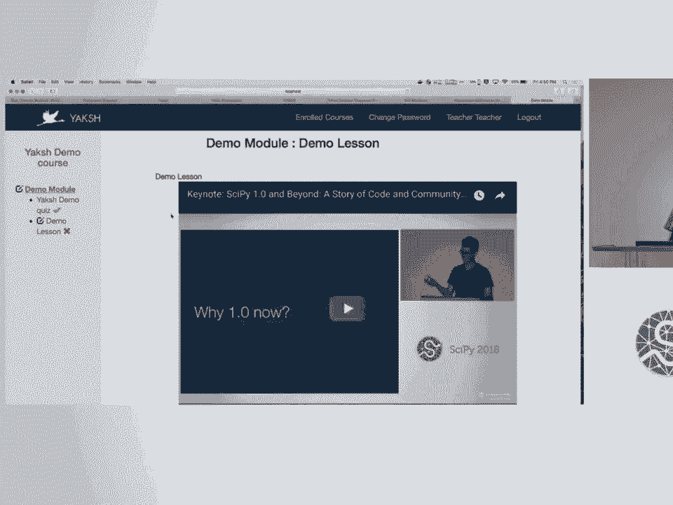

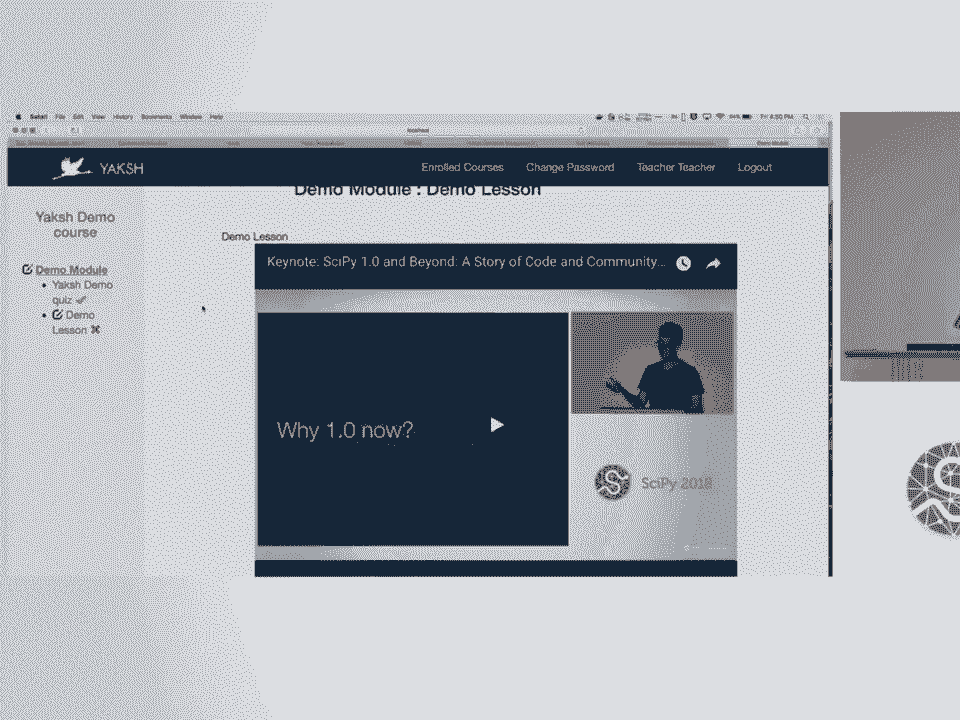

### 教师体验
教师拥有管理界面，可以创建课程、设计题目、组织测验。最强大的功能之一是**实时监控**。在测验进行中，教师可以实时看到哪些学生已提交、他们的当前得分以及答案概况。这使教师能够及时介入并提供帮助。

---

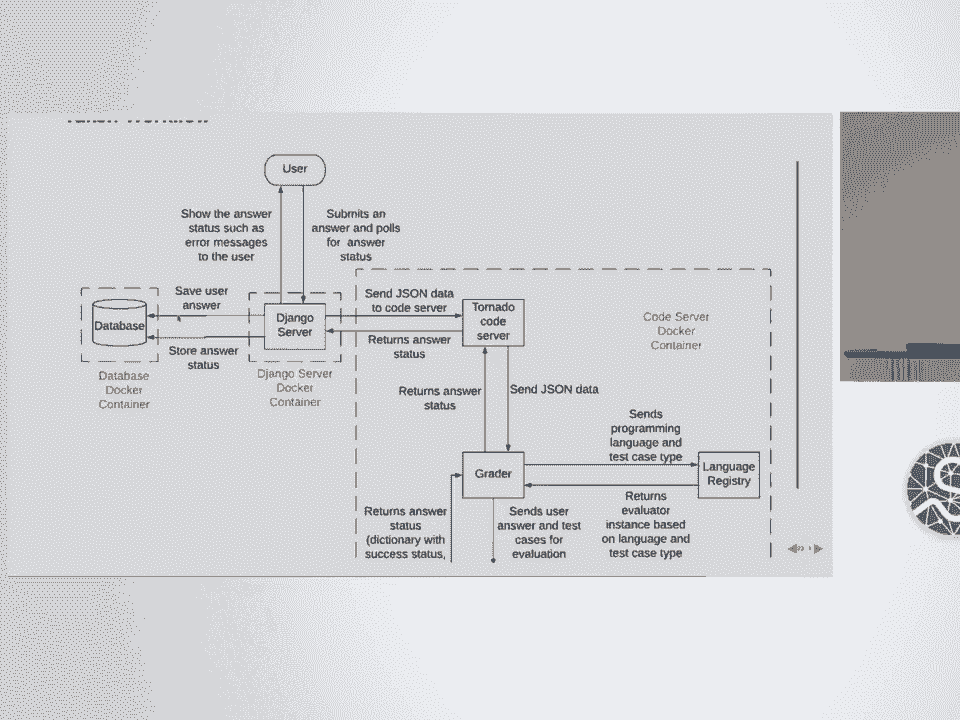

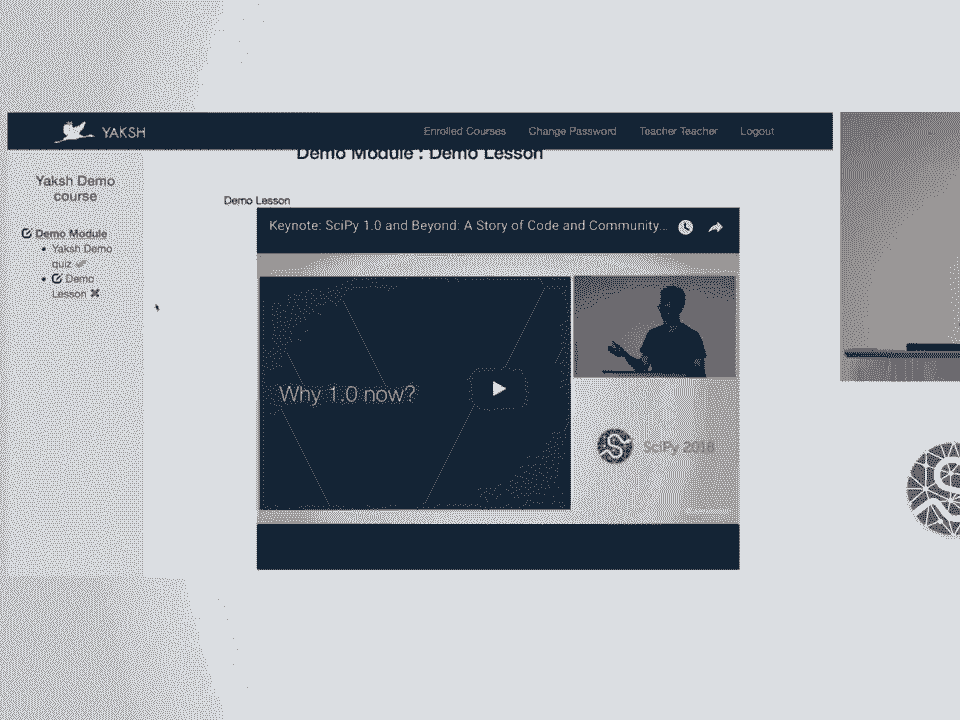

## 系统架构与安全 🔒

Yaksh采用异步架构以保证性能和可扩展性。其工作流程简述如下：
1.  学生通过浏览器提交答案到Django服务器。
2.  Django服务器将任务发送给运行在Docker容器内的Tornado代码服务器。
3.  代码服务器调用“评分器”在安全的环境中执行代码。
4.  结果异步返回，并通过JavaScript更新前端界面。

使用Docker容器进行代码评估是关键的安全措施，它能有效隔离可能具有破坏性的学生代码，保护主机系统。

---

## 应用现状与未来规划 📈

Yaksh已在FOSSEE的多个工作坊和印度理工学院的课程中得到广泛应用。在过去一年中，它已服务了约**6000名用户**，拥有超过**13000名活跃用户**，用户性别比例均衡，且主要集中在18-24岁年龄段。

团队未来的计划包括：
*   提供更稳定的Web API和详细的数据分析报告。
*   增强聊天支持功能，便于在线教学互动。
*   开发**离线支持**功能，以适应印度部分地区网络条件不佳的实际情况。
*   改进用户界面和体验。

---

## 总结

本节课中我们一起学习了**Yaksh**——一个强大的开源编程教学与评估平台。我们了解了它产生的背景、核心功能、安装方法以及其如何通过提供即时反馈和实时监控来解决编程教育中的痛点。无论你是教师寻找一种高效的作业评估工具，还是学生希望有一个可以练习和获得反馈的环境，Yaksh都提供了一个值得尝试的解决方案。该项目完全开源，鼓励大家使用、反馈并贡献代码。

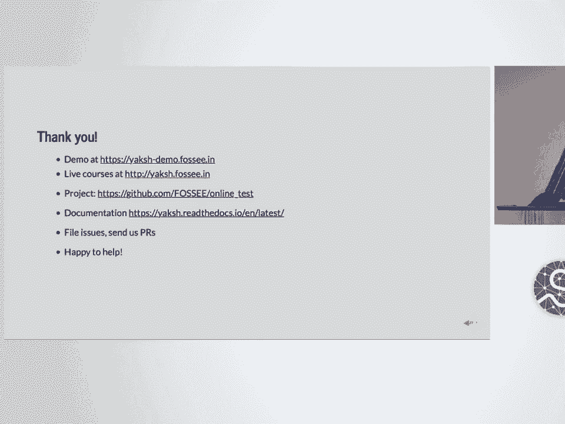

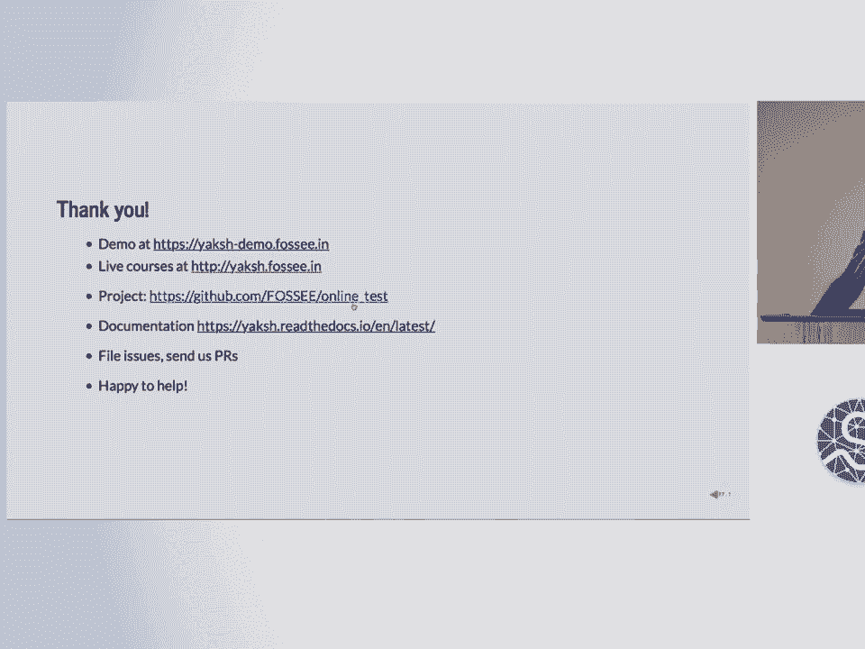

**相关链接**：
*   项目仓库与演示：请访问FOSSEE相关页面获取最新信息。
*   论文与更多资料：可在SciPy 2018会议论文集站点查找。