# 15：如何从新闻网页中自动提取发布日期 📰

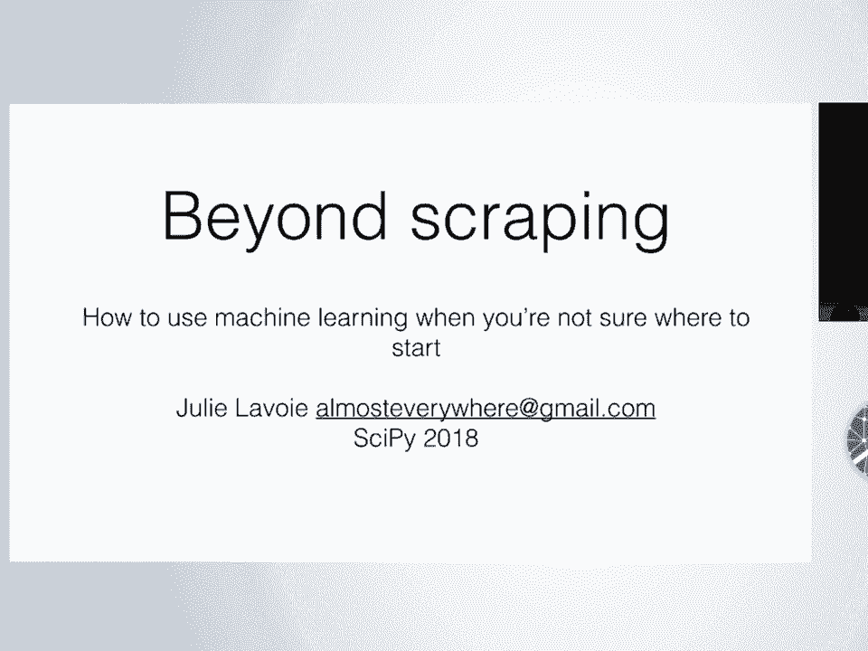

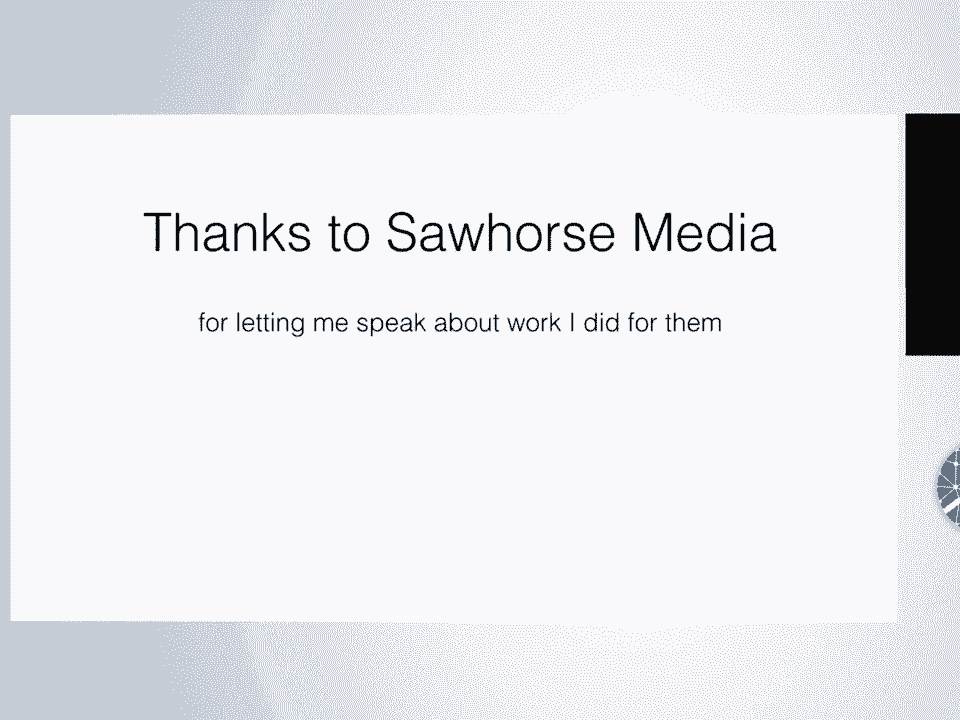

在本节课中，我们将学习如何应用机器学习来解决一个实际问题：从海量、结构各异的新闻网页中自动提取发布日期。我们将从人类识别日期的直觉出发，逐步构建一个可投入生产的机器学习解决方案。

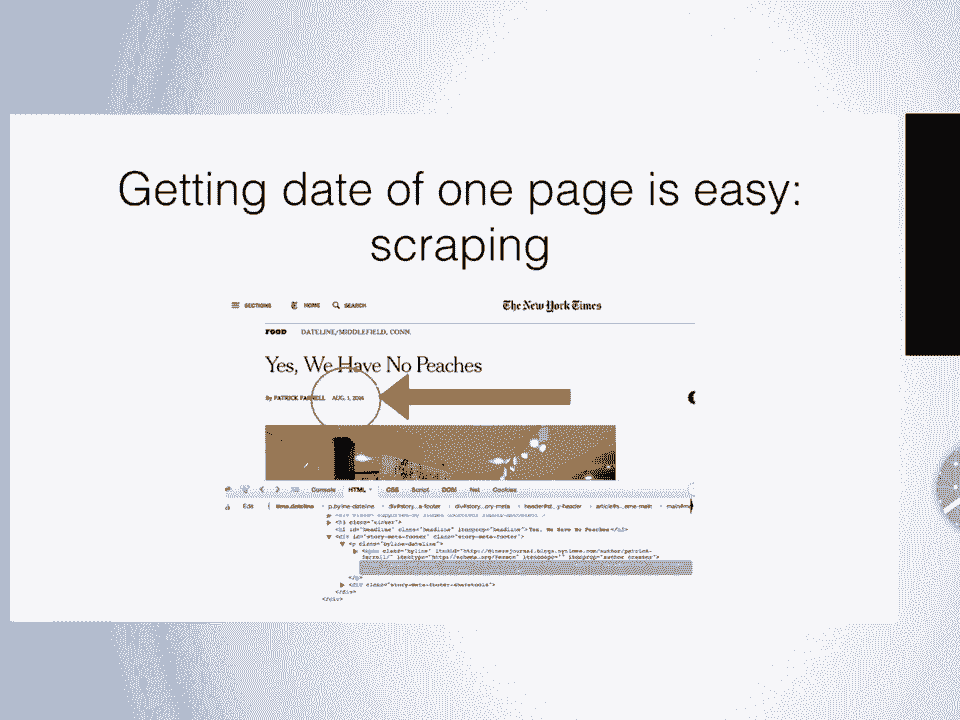


---

## 问题引入：从简单到复杂


上一节我们介绍了课程目标，本节中我们来看看问题的演变过程。

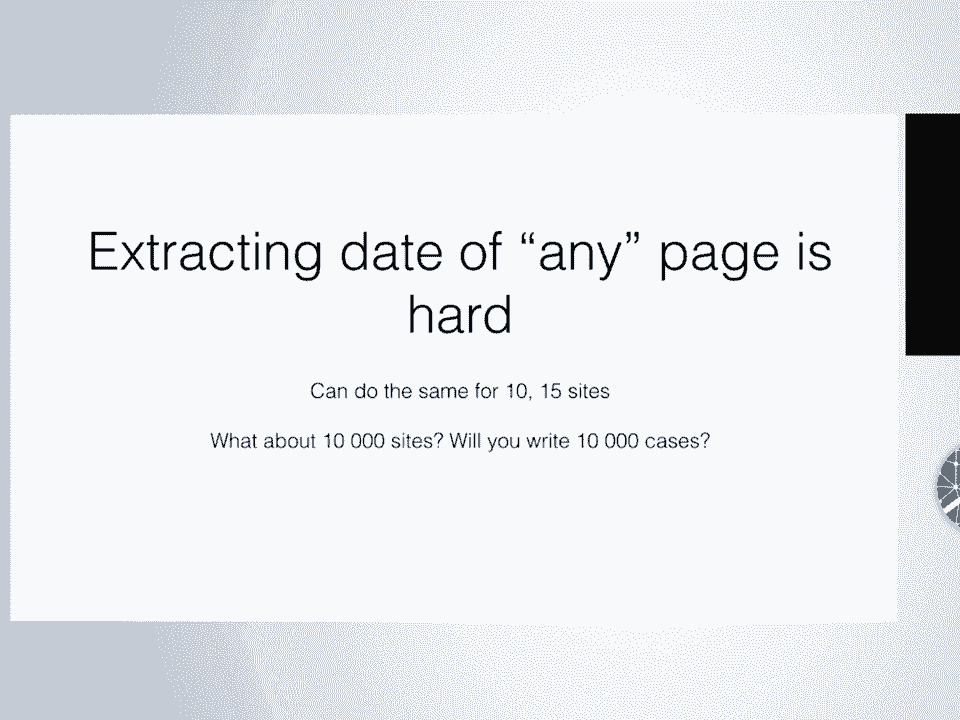

获取单个网页的发布日期非常简单。如果你做过网页抓取，只需使用开发者工具定位日期所在的DOM元素，然后用Beautiful Soup等库提取即可。例如《纽约时报》的页面，日期通常存在于特定的标签中。

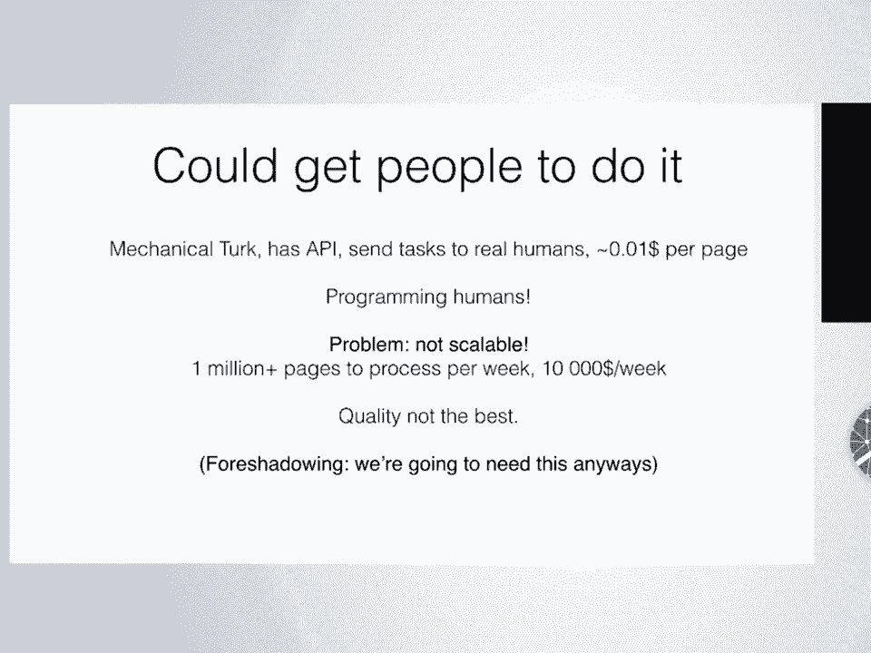

由于网站通常使用模板，一旦你从一个页面提取出日期规则，通常就能应用到该站点的所有页面。

提取第二个网站（如Gizmodo）的日期也很直接。你可以编写一个程序，包含两个分支：如果是《纽约时报》则执行A逻辑，如果是Gizmodo则执行B逻辑。

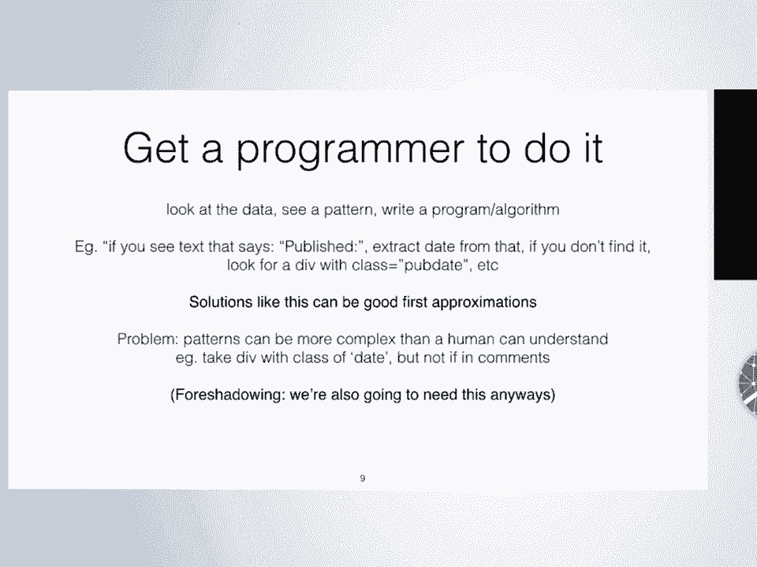

但是，当需要处理10个、100个，甚至10,000个不同的网站时，为每个网站编写独立的分支逻辑就不再可行。问题性质发生了根本变化。

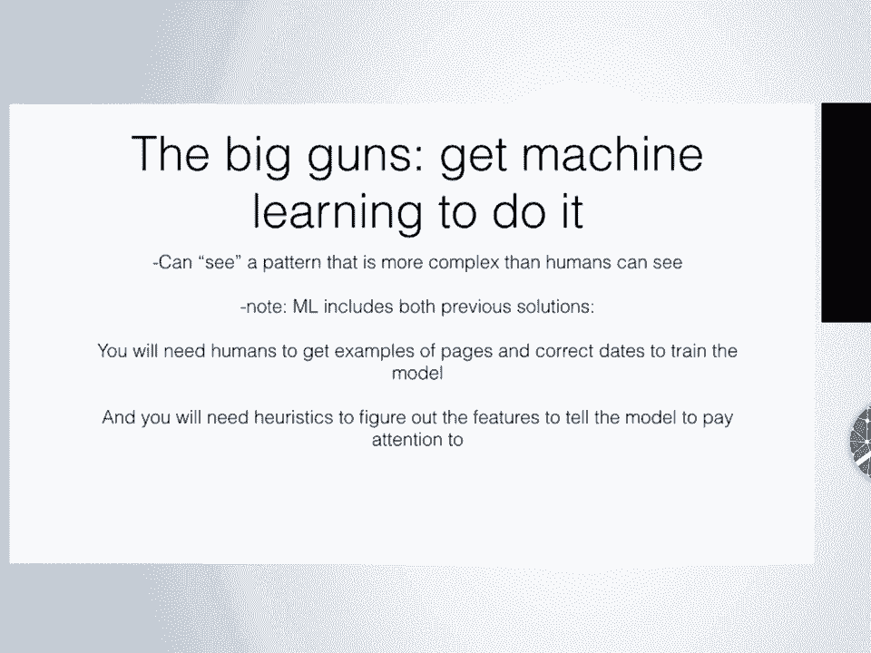

---

## 探索解决方案

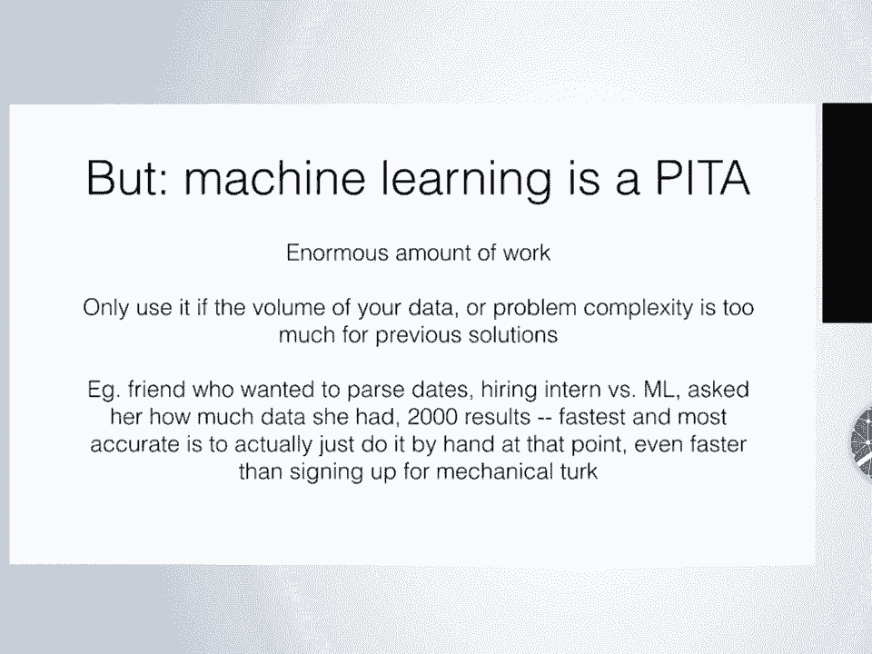

上一节我们看到了问题的复杂性，本节中我们来看看有哪些可能的解决路径。

以下是几种可能的方案：

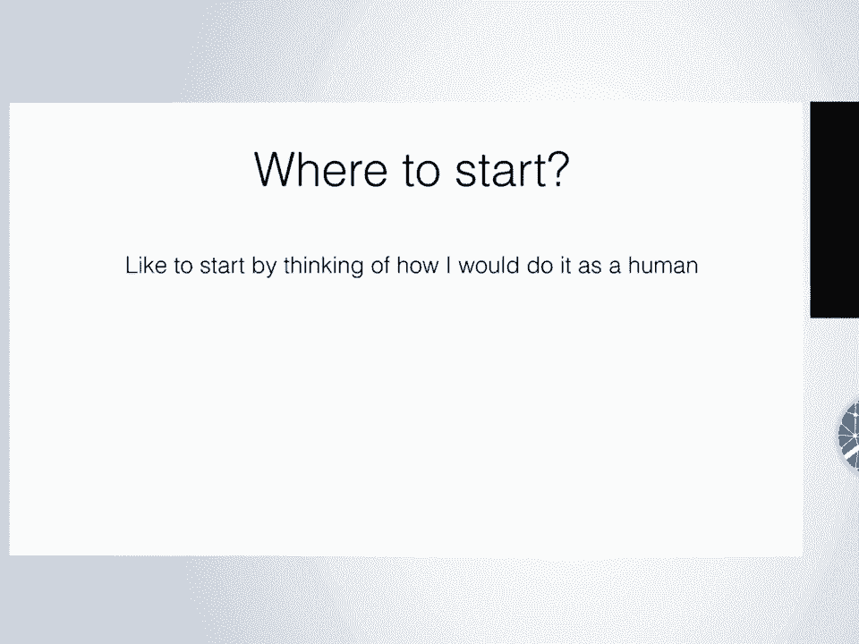

1.  **人工众包（如Amazon Mechanical Turk）**：通过API将任务分发给真人处理，每页成本约1美分。虽然有趣，但无法规模化（例如每周处理百万页面成本过高），且质量难以保证。
2.  **程序员编写启发式规则**：观察日期出现的模式（如包含“published”文本，或具有`publication-date`类的`<div>`标签），并编写程序。这种方法适用于近似解，但复杂的模式会迅速超出人类的理解和编码能力。
3.  **机器学习**：机器学习能够发现比人类更复杂的模式。它实际上融合了前两种方案：需要人工标注数据来训练模型（监督学习），也需要启发式规则来帮助模型识别重要特征。但机器学习工作量巨大，应仅在数据量或问题复杂度超出前两种方案能力时使用。

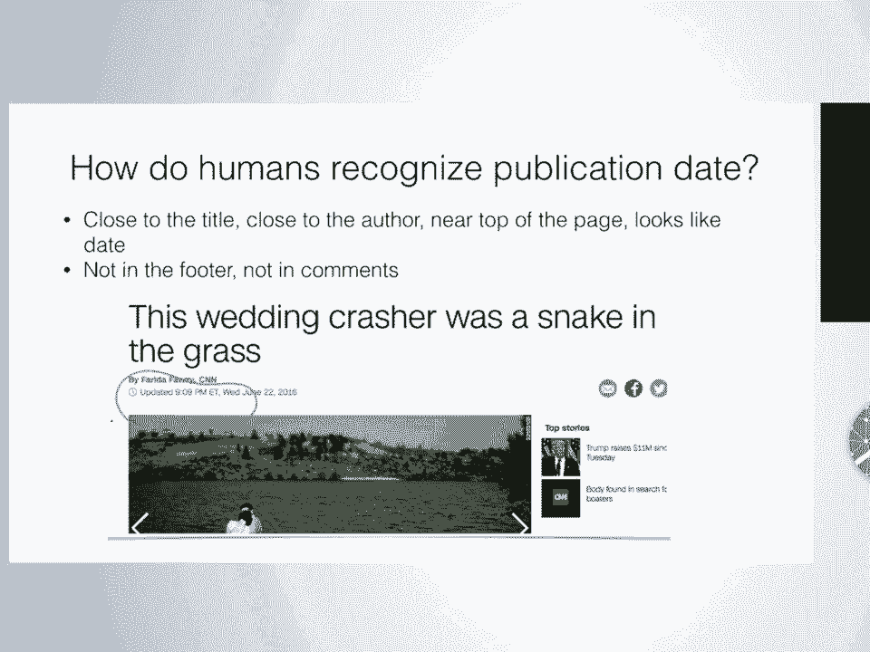

**核心决策公式**：`是否使用机器学习 ≈ 数据量 × 问题复杂度 > 阈值`

---

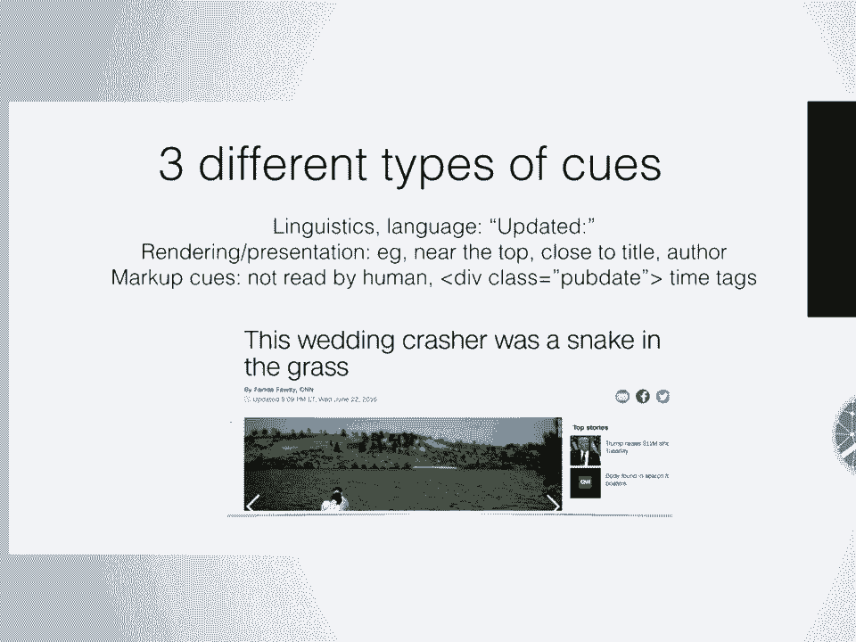

## 人类如何识别发布日期？🧠

在让计算机学习之前，我们先思考人类是如何完成这个任务的。

观察CNN的页面，我们如何知道发布日期？
*   它通常靠近标题（标题字体很大）。
*   它靠近作者信息。
*   它位于页面顶部。
*   它看起来像日期（包含日期词汇、数字等）。
*   它不会出现在页脚或评论区。

我们可以将这些线索归纳为三类：
1.  **语言线索**：如“updated”、“published”、“on”等词汇。
2.  **呈现/视觉线索**：靠近顶部、靠近标题、靠近作者。这是平面设计中的视觉语言（例如，更大的内容更重要，靠近的内容相关联）。
3.  **标记线索**：开发者关注的HTML标记，如具有`pub-date`类的`<div>`、`<time>`标签等。

这些线索非常强大，即使在不认识的语言中，我们也能大致定位日期。例如，在日语或泰语新闻页面中，我们也能通过标题位置、社交分享按钮和数字格式，猜测出发布日期的大致区域。

---


## 将问题转化为机器学习任务

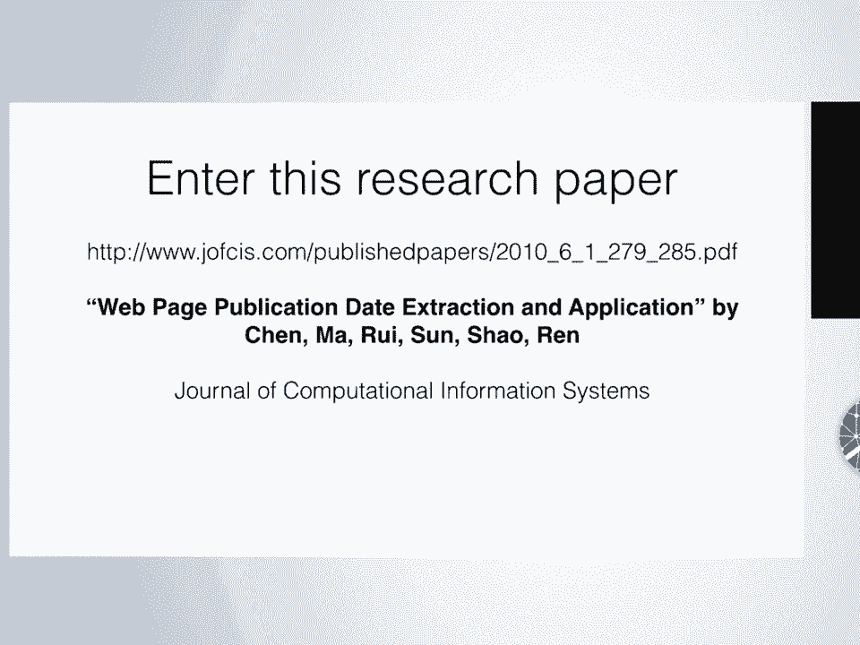

上一节我们分析了人类的识别方式，本节中我们来看看如何将其“翻译”成机器学习能解决的问题。

设置问题是机器学习中最难的部分之一。本教程参考了一篇研究论文，将问题构建为一个**监督学习**下的**分类问题**。

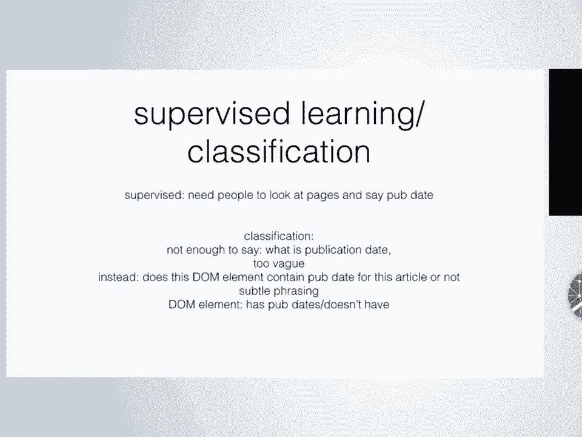

*   **监督学习**：需要人工标注大量网页及其正确发布日期作为训练数据。
*   **分类问题**：我们不直接问“这个页面的发布日期是什么？”，而是问“**这个DOM元素是否包含了本页的发布日期？**” 我们对页面中的所有DOM元素进行分类和打标签。

**核心任务定义**：`分类器(特征向量) -> {是， 否}`

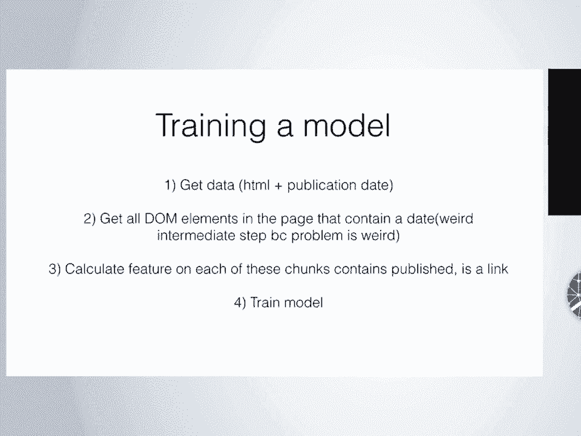

整个流程分为两大部分：**训练模型**和**在生产中使用模型**。


---

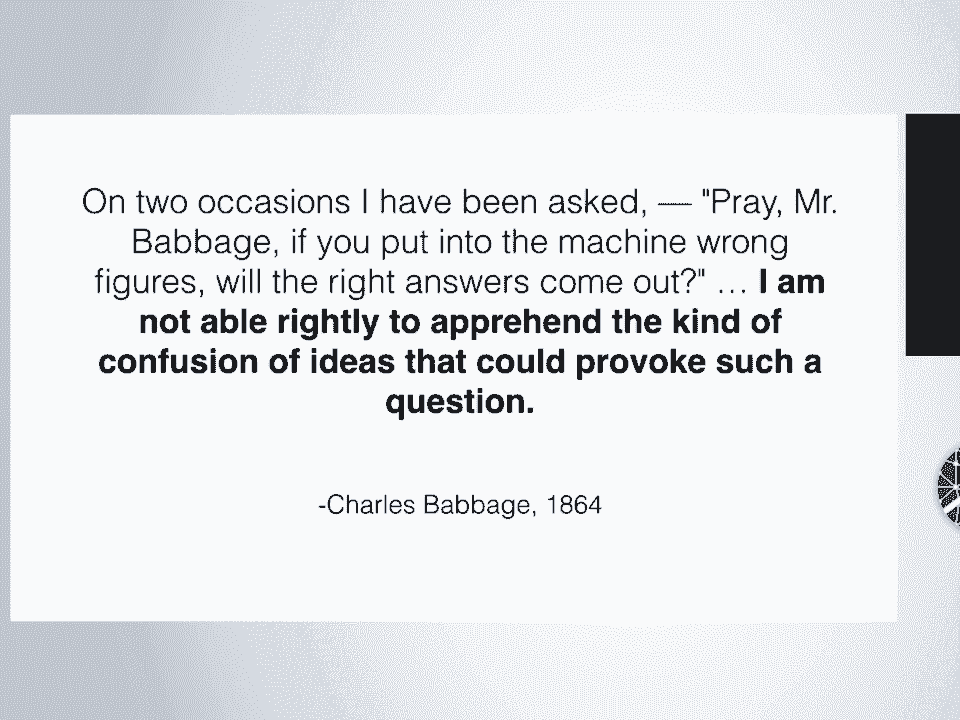

## 第一步：获取与准备数据 🐋

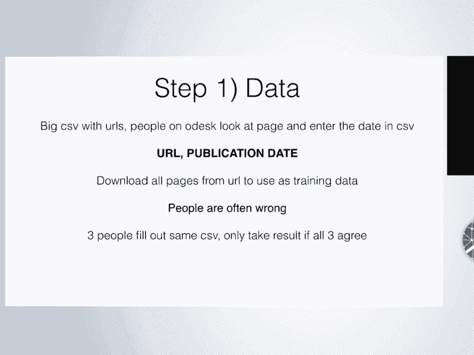

任何机器学习项目都始于数据。我们需要大量准确、有用的数据。

数据通常以CSV文件形式提供，包含URL和人工标注的发布日期。为确保质量，通常会让多人标注同一批数据，只采纳他们一致同意的结果。

在实践中，数据准备会遇到诸多挑战：
*   **页面失效**：标注后页面被删除或无法访问。
*   **动态内容**：页面使用React等框架，需浏览器渲染才能看到日期，直接`requests`下载得到的是空页面。
*   **编码问题**：UTF-8编码错误是常见痛点。
*   **标注错误**：标注人员拼写错误、理解偏差或无心之失。

**核心要点**：垃圾进，垃圾出。数据质量直接决定模型上限。

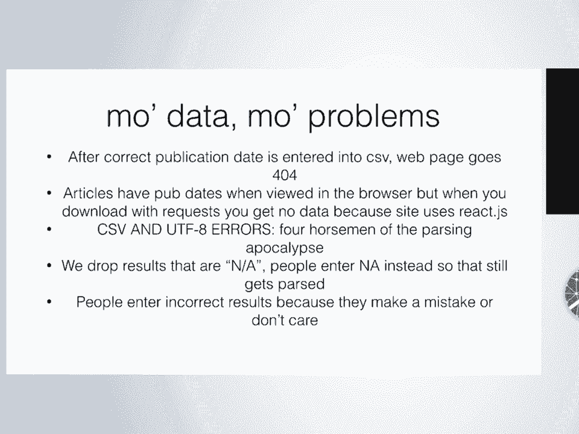

---

## 第二步：特征选择

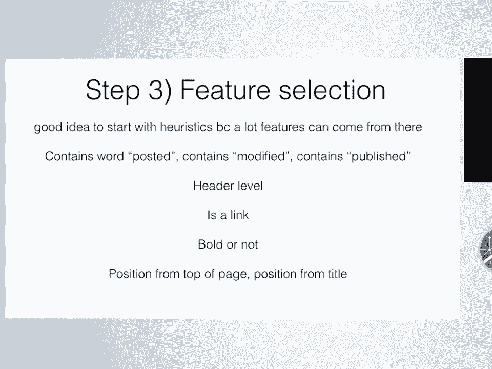

特征选择常被认为是机器学习的核心难点。本案例中，论文直接提供了特征列表，这提供了巨大帮助。这些特征灵感也来源于之前的启发式规则。

以下是本问题使用的一些特征示例：
*   **文本特征**：是否包含“posted”、“modified”、“published”等词。
*   **标记特征**：元素的标题级别（H1, H2等）、是否为链接、是否为粗体。
*   **位置特征**：距离页面顶部的像素距离、距离标题的像素距离。

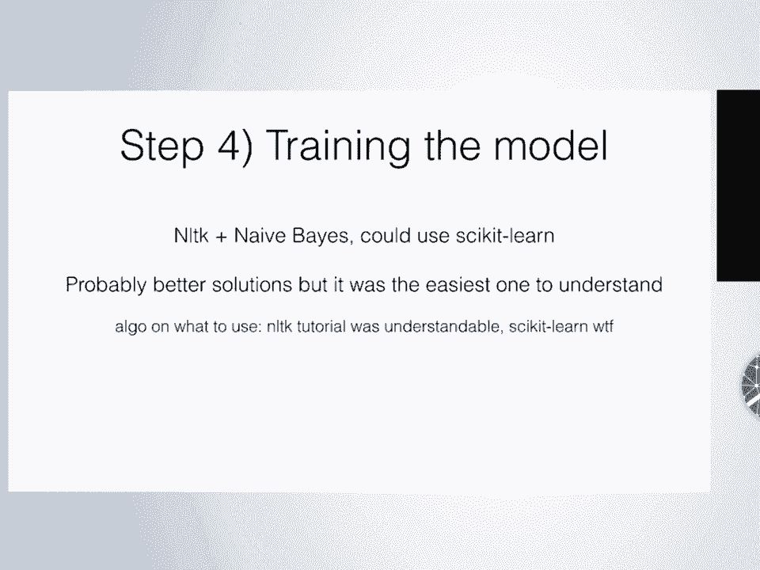


**特征向量示例（伪代码）**：
```python
features = {
    ‘contains_published‘: True,
    ‘is_link‘: False,
    ‘distance_from_top‘: 150,
    ‘tag_name‘: ‘span‘,
    ‘font_weight‘: ‘bold‘,
    # ... 更多特征
}
```

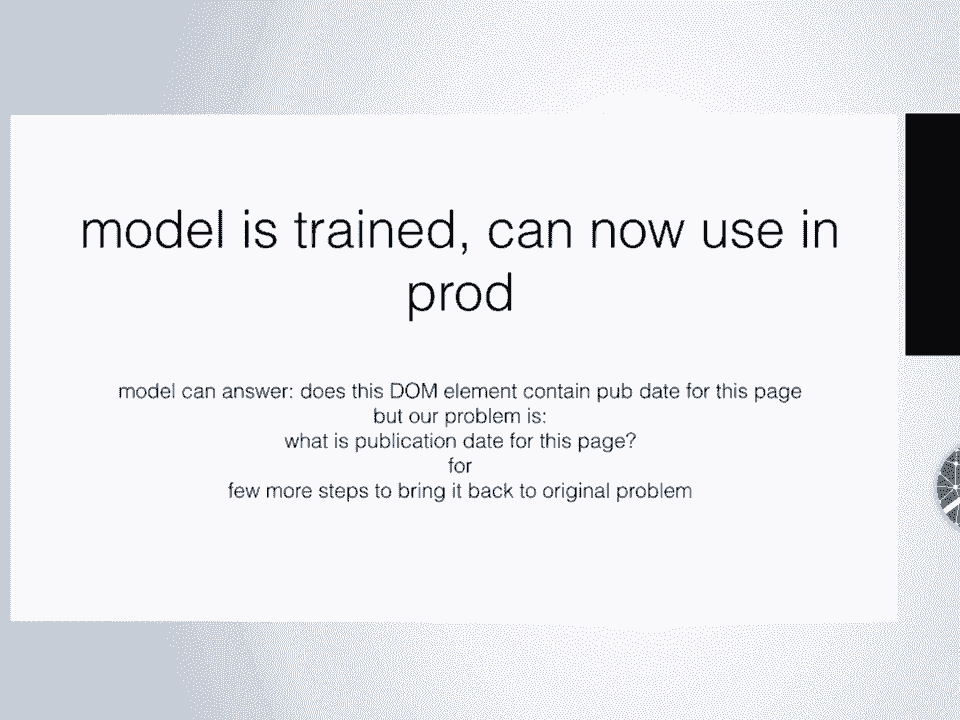

---

## 第三步：训练模型

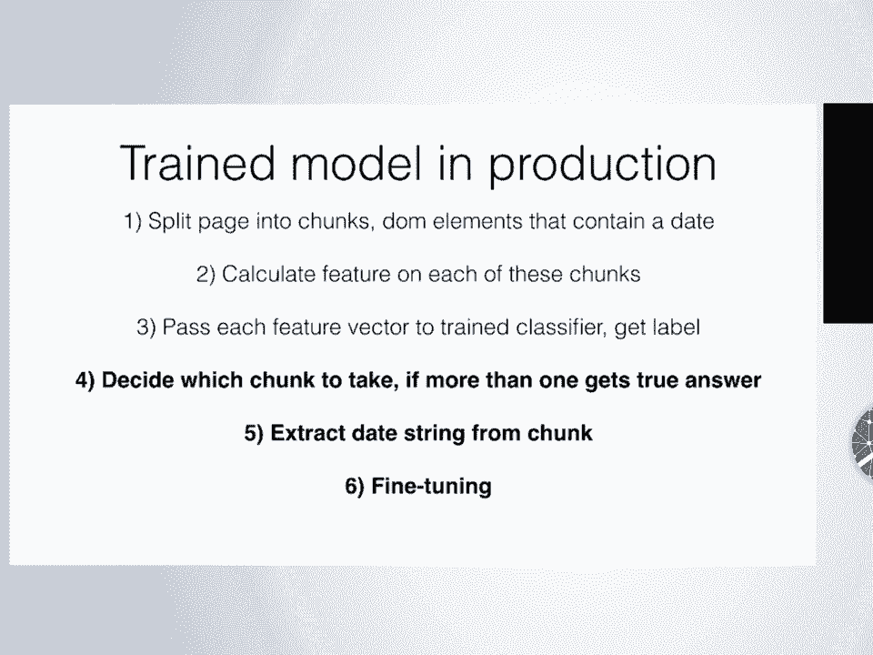

对于文本分类任务，一个经典且简单的起点是使用**朴素贝叶斯分类器**。本案例使用了NLTK库来实现。


**核心代码逻辑**：
```python
from nltk.classify import NaiveBayesClassifier
# 准备训练数据：列表 of (特征字典, 标签)
training_data = [(features1, ‘yes‘), (features2, ‘no‘), ...]
classifier = NaiveBayesClassifier.train(training_data)
```


选择NLTK而非scikit-learn的原因是，对于初学者，NLTK的教程和API在文本任务上更直观易懂。尽管论文使用了可能更强大的SVM，但朴素贝叶斯作为第一个项目已能取得不错效果。

---

## 第四步：生产环境部署与应用

模型训练好后，我们需要将其集成到生产流程中，解决原始问题：“这个页面的发布日期是什么？”

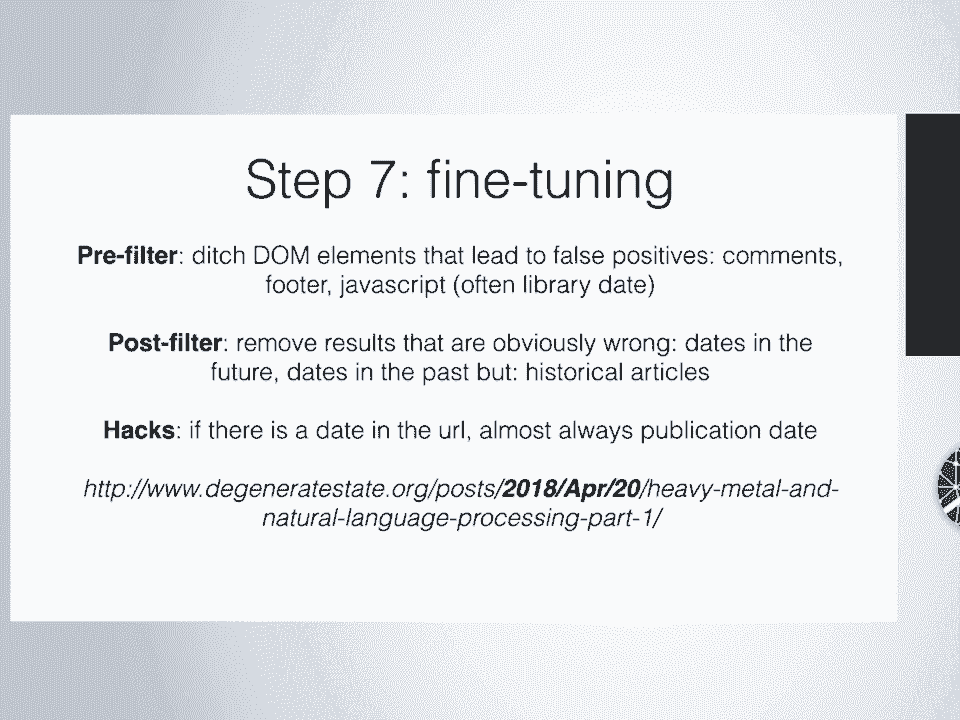

以下是生产环境处理一个新页面的步骤：
1.  **解析页面**：下载HTML。
2.  **提取候选元素**：找到所有包含日期（如数字格式）的DOM元素。
3.  **计算特征**：为每个候选元素计算特征向量。
4.  **模型预测**：将特征向量输入训练好的分类器，得到“是/否”标签。
5.  **结果后处理**：
    *   **歧义消除**：如果多个元素被标为“是”，则选择第一个（通常最靠近顶部）。
    *   **日期提取**：从选中的DOM元素中，使用正则表达式提取纯文本日期字符串。
    *   **精细调优**：
        *   **预过滤**：直接忽略评论区、页脚、JavaScript代码块，减少误报。
        *   **后过滤**：过滤掉未来日期或过于久远的历史日期（如1600年以前）。
        *   **实用技巧**：如果URL本身包含日期，直接采用，这是一个能显著提升整体准确率的“技巧”。

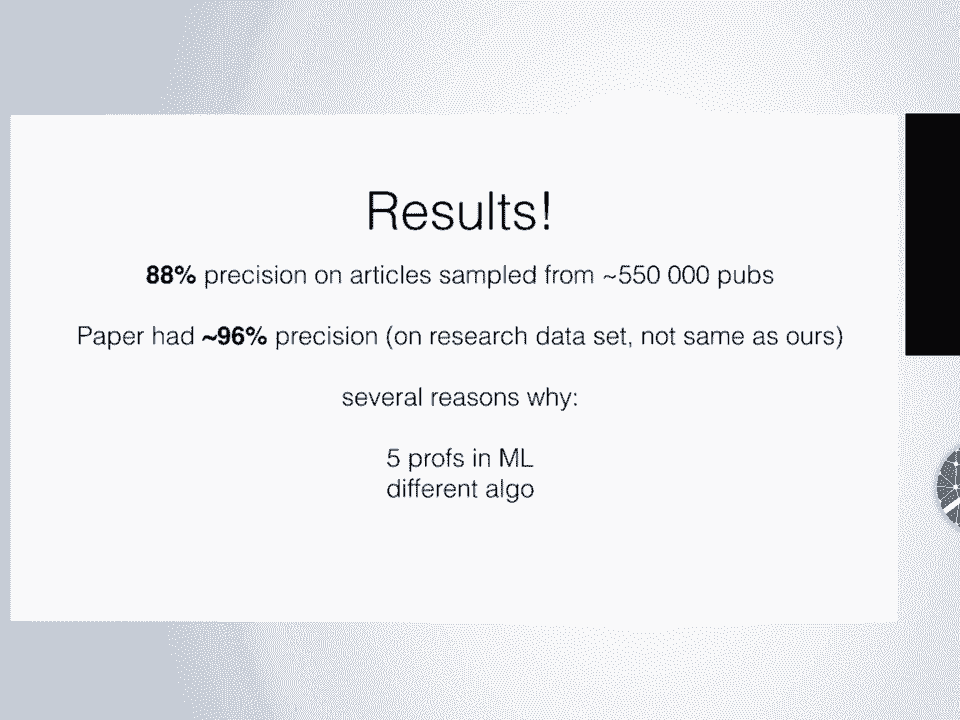

---

## 结果与反思

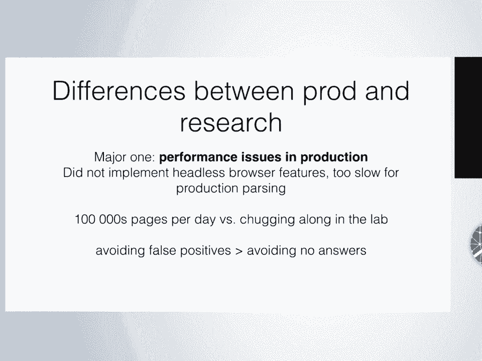

通过上述方法，该解决方案在约50万个不同出版物的文章样本上，达到了约**88%的准确率**。作为对比，原研究论文在其数据集上达到了96%的准确率。

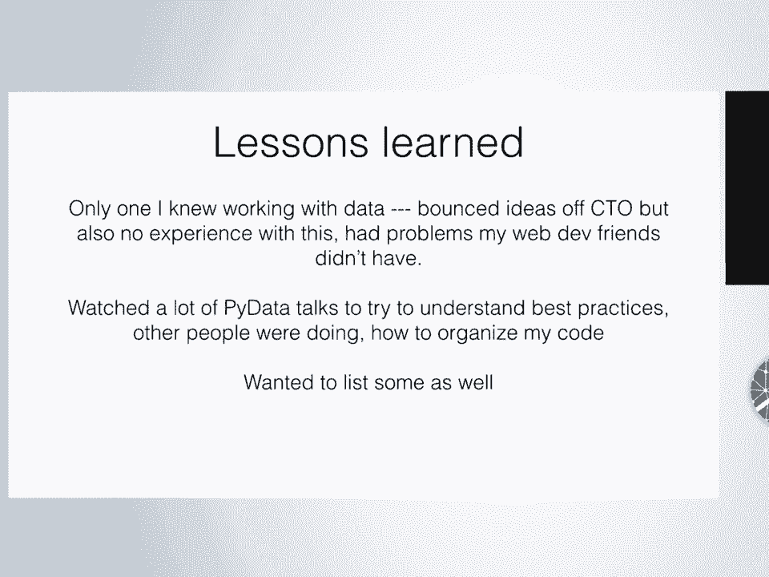

差异原因包括：
*   **算法差异**：论文使用了SVM。
*   **生产约束**：未实现某些计算成本高的特征（如精确像素距离），以保障解析性能。
*   **目标差异**：更倾向于避免误报（拿不准就返回空），而非不惜一切代价获取日期。

---

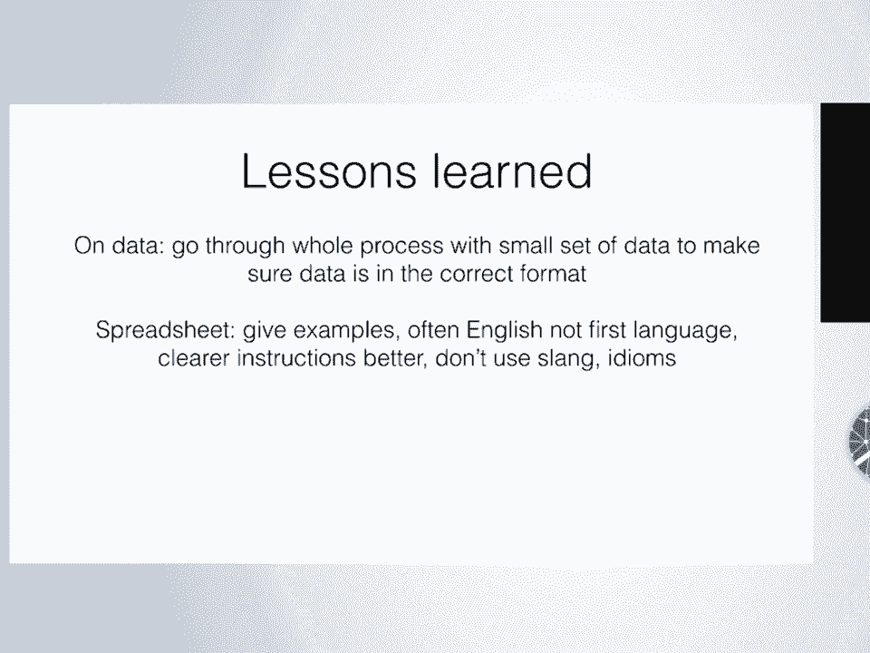

## 经验总结与建议

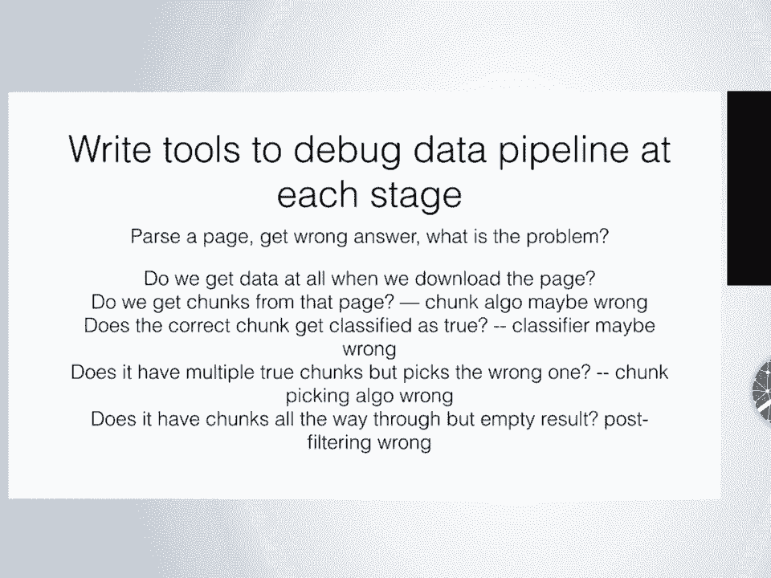

本节课中我们一起学习了如何构建一个端到端的机器学习应用。以下是给初学者的关键建议：

1.  **从小规模验证流程开始**：在搭建完整数据管道前，先用小数据集走通全流程，确保各环节数据格式正确。
2.  **提供清晰的数据标注指南**：对于众包任务，提供已完成的示例，使用简单直白的语言，避免俚语和歧义。
3.  **构建数据流水线检查工具**：在数据处理的每个阶段（获取、清洗、特征提取、训练）都加入检查点，便于快速定位错误。
4.  **转变思维模式**：从追求**算法绝对正确**（所有边缘情况都必须处理）转向**统计最优**（追求在大多数情况下的正确率）。接受系统会在少数案例上出错，但力求整体效果最好。

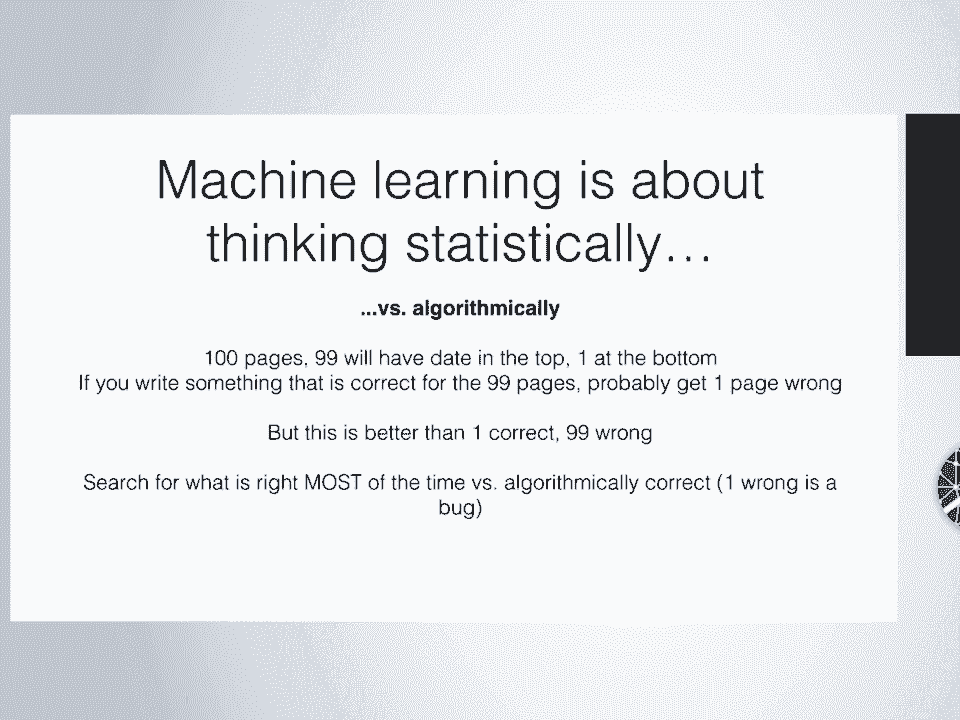

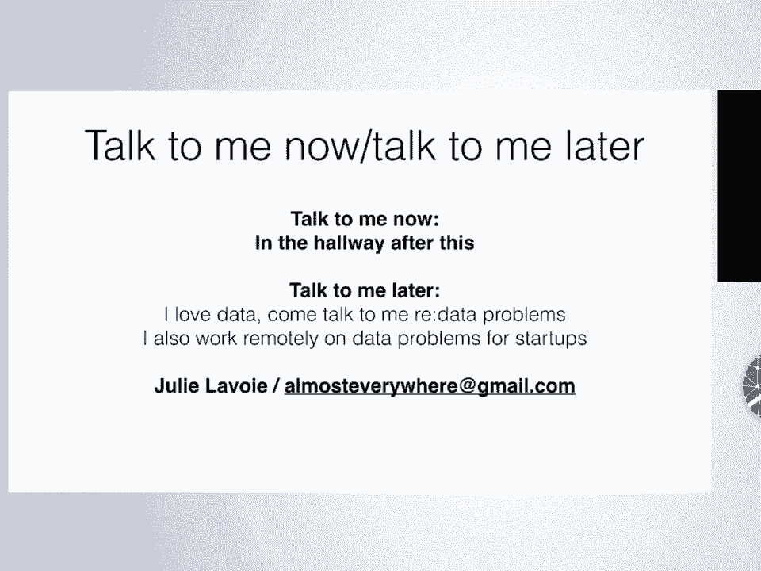

**最终总结**：机器学习项目是迭代的、工程性的。它结合了数据准备、特征工程、模型选择和大量的调试优化。从人类直觉出发，通过合理的任务构建和持续的迭代改进，即使初学者也能构建出解决实际问题的有效系统。