# 16：使用 NOAA 开放数据与 Jupyter Notebook 构建天气应用 🌤️


在本节课中，我们将学习如何利用一系列国际数据标准和网络服务，通过 Python 和 Jupyter Notebook 高效地获取、处理并可视化气象与海洋数据。我们将构建一个能够自动获取数据并生成交互式图表的简易应用。

---

## 概述：数据标准与网络服务

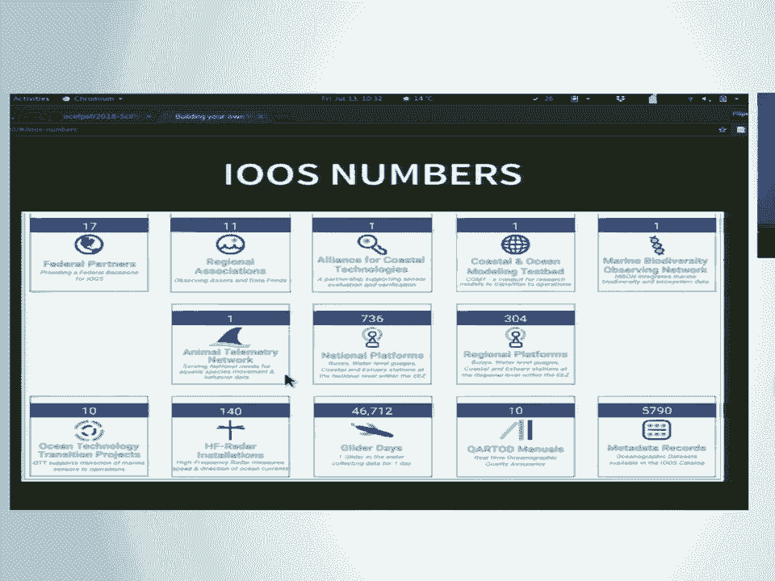

上一节我们介绍了课程目标，本节中我们来看看支撑整个应用的数据基础。为了高效地共享和使用科学数据，社区采用了一系列国际标准。


这些标准由开放地理空间联盟和 ISO 等组织制定。其核心目标是避免定制化解决方案，并尽可能在数据提供方层面实现标准化。


数据流动模型很简单：
1.  人们运行数值模型或收集观测数据。
2.  数据提供方应用这些标准。
3.  数据通过网络服务发布。
4.  最终用户可以直接使用数据。

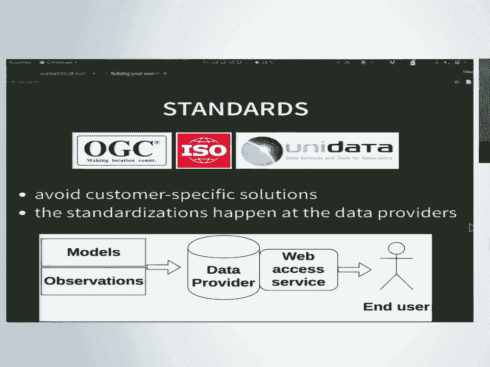

---

## 核心网络服务介绍

以下是几种关键的网络服务类型，每种服务于不同的数据类型。

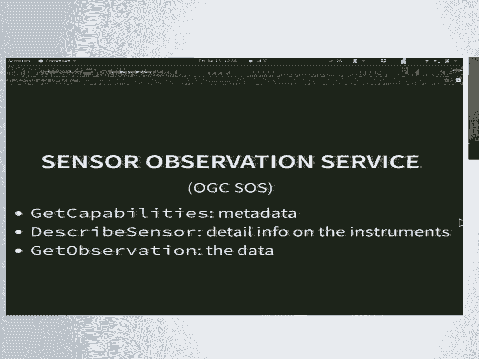

### 1. 传感器观测服务


传感器观测服务用于处理浮标、站点等时间序列数据。它遵循 OGC 标准，主要操作包括：
*   `GetCapabilities`：获取元数据。
*   `DescribeSensor`：描述仪器。
*   `GetObservation`：获取数据。

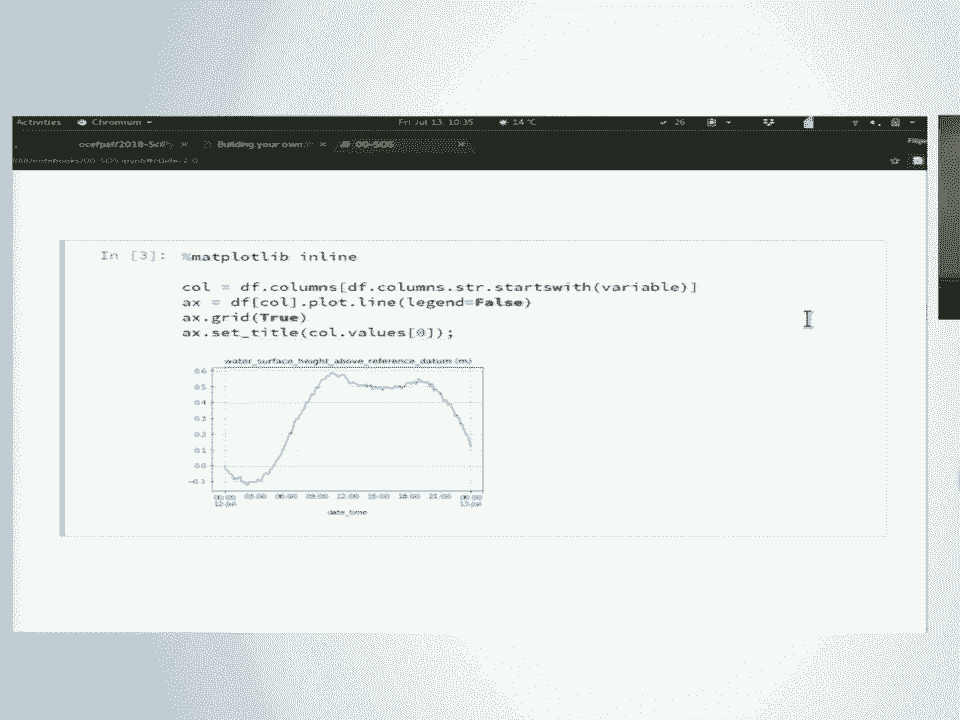

一个典型的 SOS 服务 URL 结构如下：
```
http://server.com/sos?service=SOS&request=GetObservation&offering=STATION_ID
```

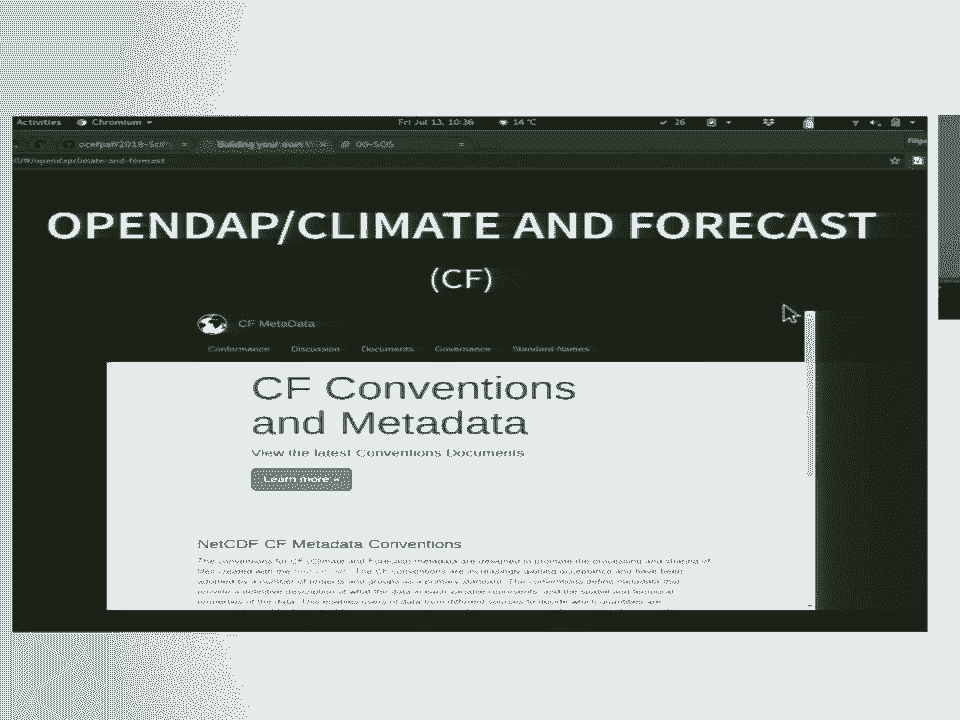

我们可以用 Python 轻松访问。例如，使用 `pandas` 读取 CSV 格式的数据：


```python
import pandas as pd
url = "http://sos.example.com?request=GetObservation&offering=station_123&responseFormat=text/csv"
data = pd.read_csv(url)
```
通过这种方式，我们可以快速获取并绘制某个站点的时序数据，例如潮汐的日周期变化。

---


### 2. 网络地图服务


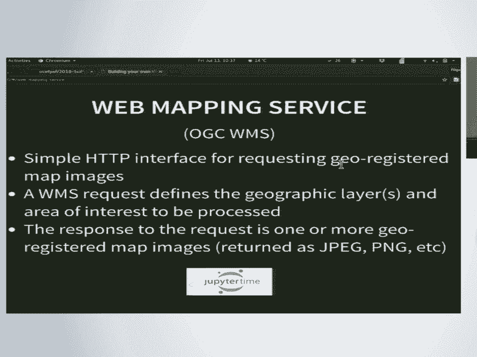

网络地图服务用于提供地理配准的图像数据，如卫星云图。它同样遵循 OGC 标准。


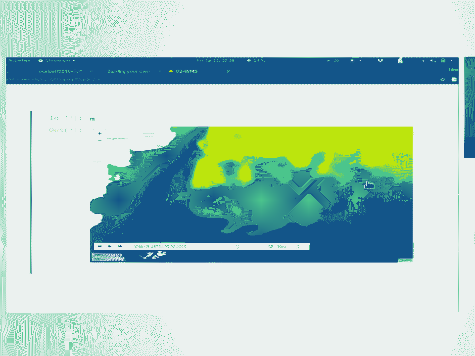

一个典型的 WMS 请求 URL 包含图层、时间、边界框和样式等信息：
```
http://mapserver.com/wms?LAYERS=sst&TIME=2023-01-01/2023-01-02&BBOX=-180,-90,180,90
```

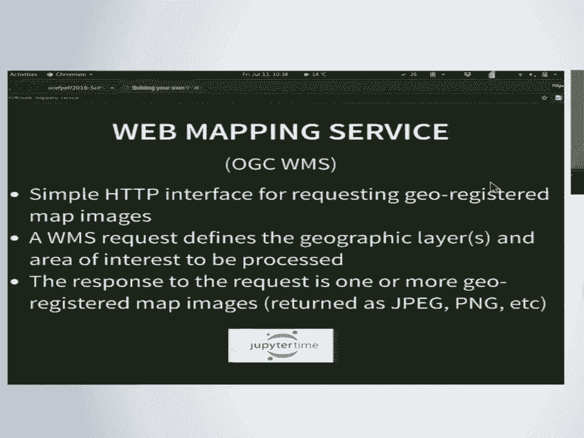

使用此服务，我们可以轻松获取指定时间和区域的底图，并与其他数据（如台风路径）叠加，创建丰富的可视化效果。

---

### 3. ERDDAP 数据服务

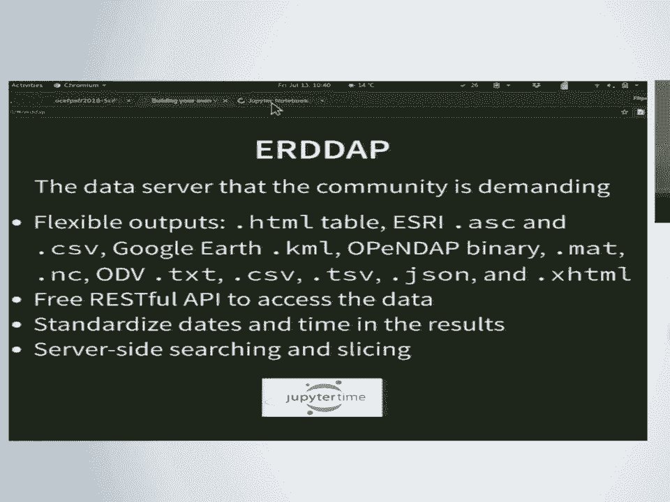

ERDDAP 是一种功能强大且灵活的数据服务，社区正逐渐向其汇聚。它支持多种输出格式。

ERDDAP 的核心优势在于其 RESTful API 和服务器端的数据切片功能。这意味着用户无需下载整个数据集，只需请求特定时空范围的数据即可。

访问 ERDDAP 数据本质上是一个构建 URL 的过程。例如，请求特定区域和时间的海水温度数据：

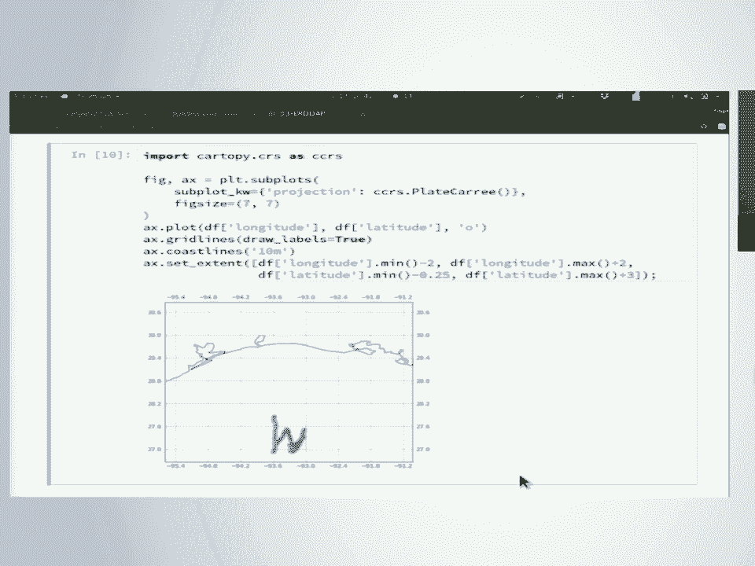

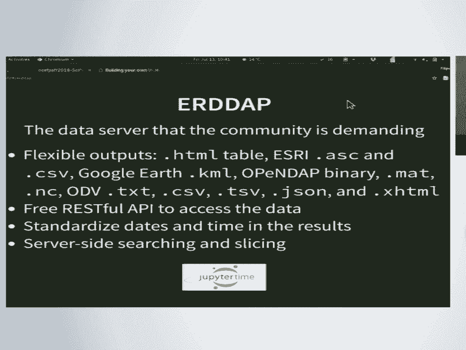

```python
base_url = "http://erddap.example.com/erddap/tabledap/"
dataset_id = "cwwcNDBCMet"
constraints = "time>=2023-01-01T00:00:00Z&latitude>=20&latitude<=30&longitude>=-90&longitude<=-80"
variables = "time,latitude,longitude,sea_water_temperature"
data_url = f"{base_url}{dataset_id}.csv?{variables}&{constraints}"
df = pd.read_csv(data_url)
```
ERDDAP 还提供了便捷方法，如 `to_pandas`，可以更直接地将数据转换为 DataFrame。


---

## 统一入口：数据目录

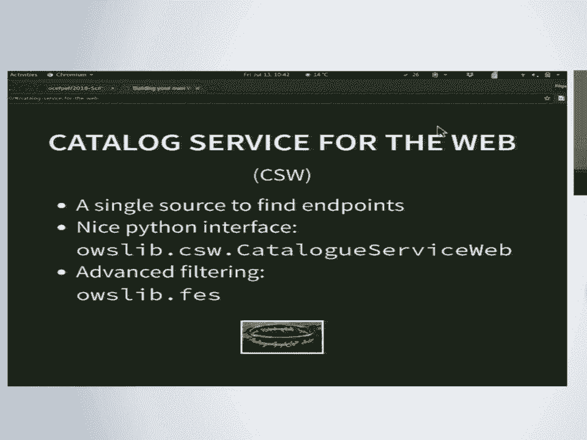


之前我们分别介绍了不同的服务，但每个服务都需要特定的端点地址。如何管理这些分散的端点呢？答案是通过数据目录。

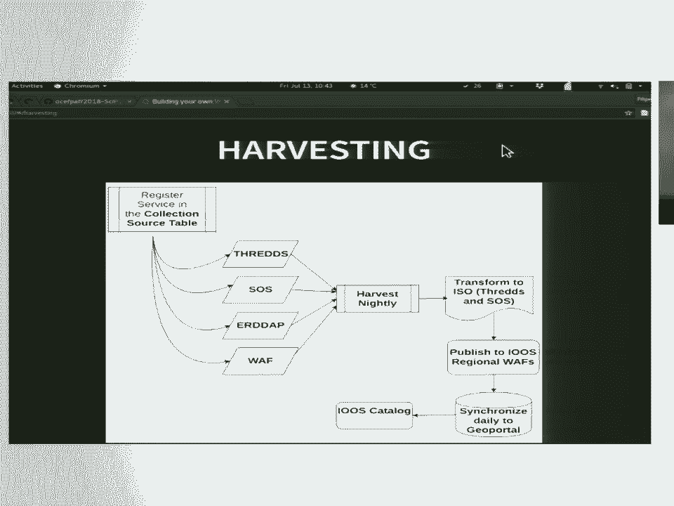

我们使用 **pygeoapi** 目录作为统一入口。它将所有服务的端点注册到一个地方，用户无需记住每个服务的具体地址。


目录本身也遵循国际标准，它将各种端点转换为符合 ISO 标准的元数据记录。

查询目录时，我们可以使用复杂的过滤器。例如，查找墨西哥湾特定时间段内所有与温度相关的数据，并排除某些数据集：

```python
from owslib.csw import CatalogueServiceWeb

csw = CatalogueServiceWeb('http://catalog.example.com/csw')
filter_dict = {
    'bbox': (-98, 18, -80, 31), # 边界框
    'anytext': 'temperature',
    'time': '2023-01-01/2023-12-31',
    'not': 'CDIP' # 排除包含 CDIP 的数据
}
# ... 构建并执行查询
```
通过目录，我们能自动发现所有相关的数据源，而无需硬编码任何端点信息。

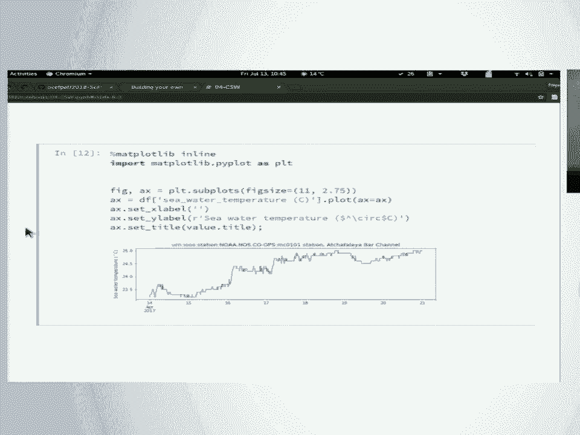

---


## 实战：构建一个台风数据应用 🌀

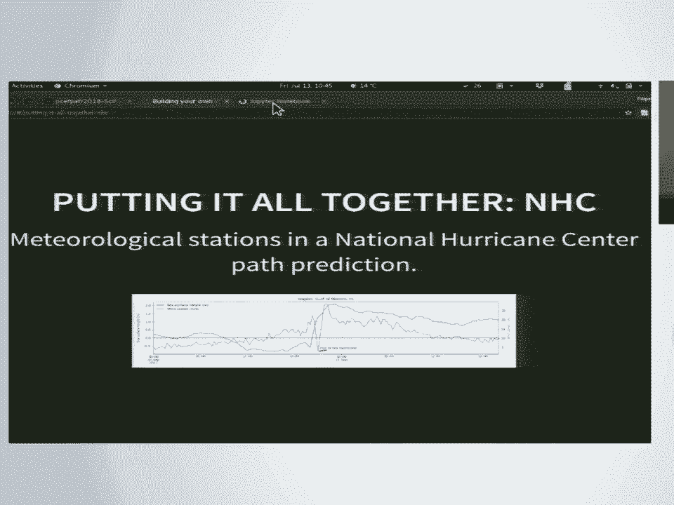

现在，让我们将以上所有部分结合起来，构建一个实际的应用。这个应用仅需一个台风编号，就能自动获取并可视化相关数据。

应用工作流程如下：
1.  用户输入美国国家飓风中心指定的台风编号。
2.  应用自动下载该台风的轨迹形状文件。
3.  根据台风的路径和时间范围，查询数据目录，发现该区域内所有可用的观测站和模型数据。
4.  获取数据，并自动生成包含台风路径、观测站位置和海洋状态（如海表温度）的综合地图。

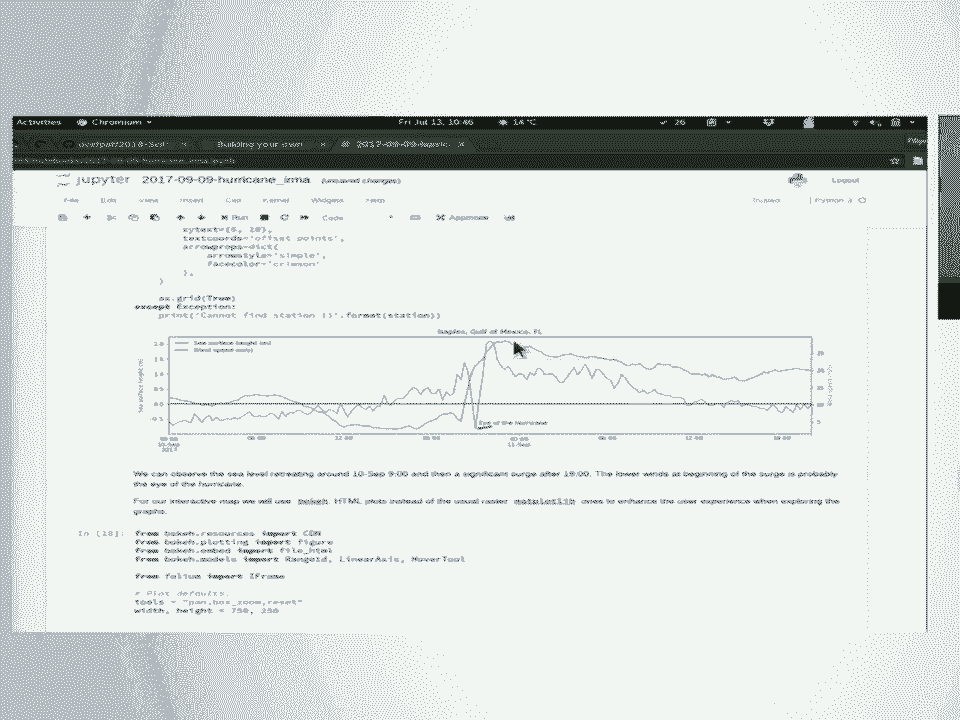

以下是关键步骤的简化说明：
```python
# 1. 用户输入
hurricane_id = 'AL152023'


# 2. & 3. 根据 hurricane_id 获取路径，并查询目录（内部逻辑）
# 4. 获取数据并绘图
# （此处省略具体的目录查询、数据获取和绘图代码，它们由后台自动完成）
```
整个过程对用户完全透明，他们只需更改一个参数即可分析不同的台风事件。

---

## 进阶：创建交互式应用界面


我们可以利用 Jupyter Widgets 和 Binder，将 Notebook 变成一个交互式应用界面。


例如，创建一个下拉菜单选择观测站，一个按钮选择变量，然后动态更新图表。对于不了解背后技术的用户来说，这就像一个专业的仪表盘应用。

```python
import ipywidgets as widgets
from IPython.display import display

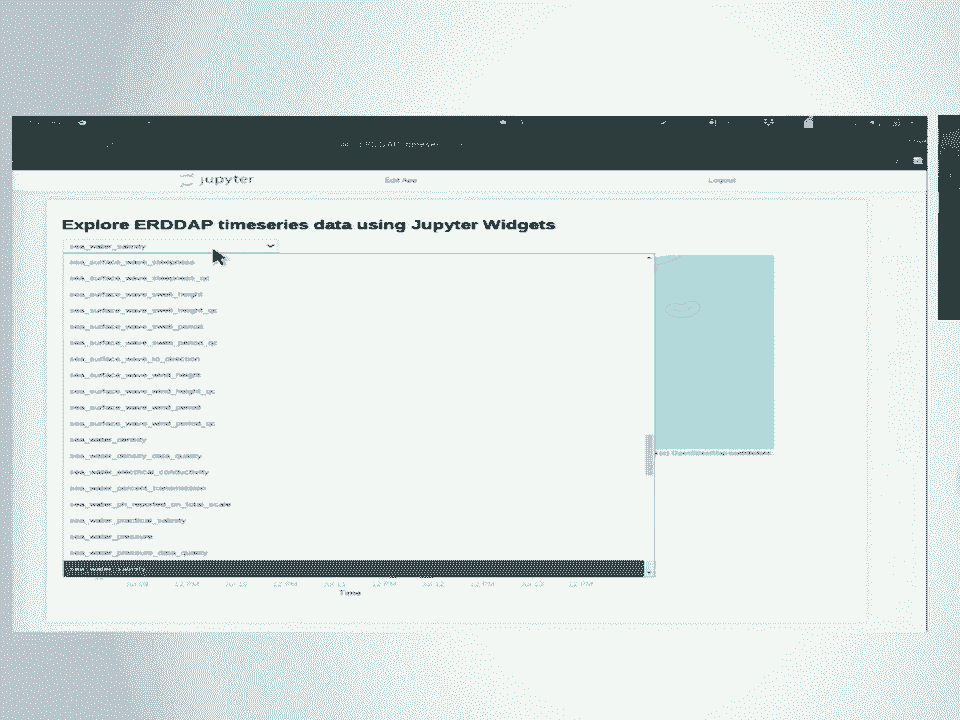

station_dropdown = widgets.Dropdown(options=['Station_A', 'Station_B', 'Station_C'], description='Station:')
variable_dropdown = widgets.Dropdown(options=['Temperature', 'Salinity', 'Wave Height'], description='Variable:')
plot_button = widgets.Button(description='Plot')

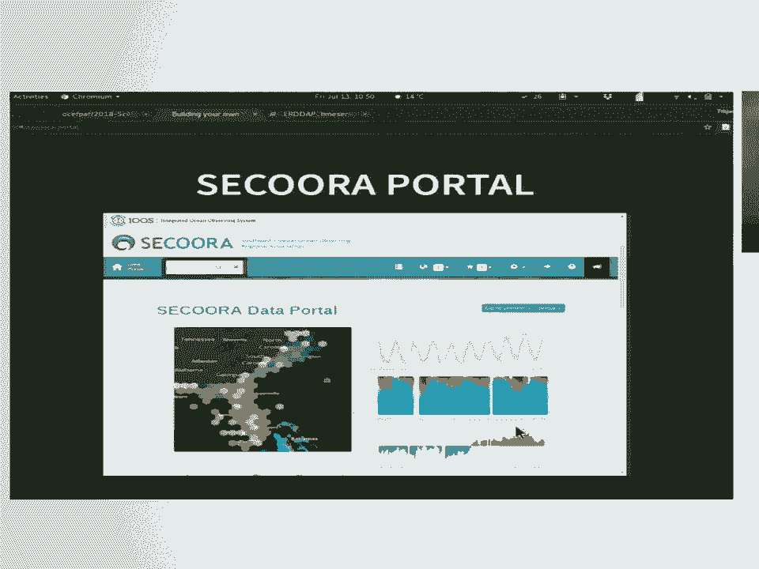

def on_plot_button_clicked(b):
    # 根据下拉菜单的选择，重新获取数据并绘图
    update_plot(station_dropdown.value, variable_dropdown.value)

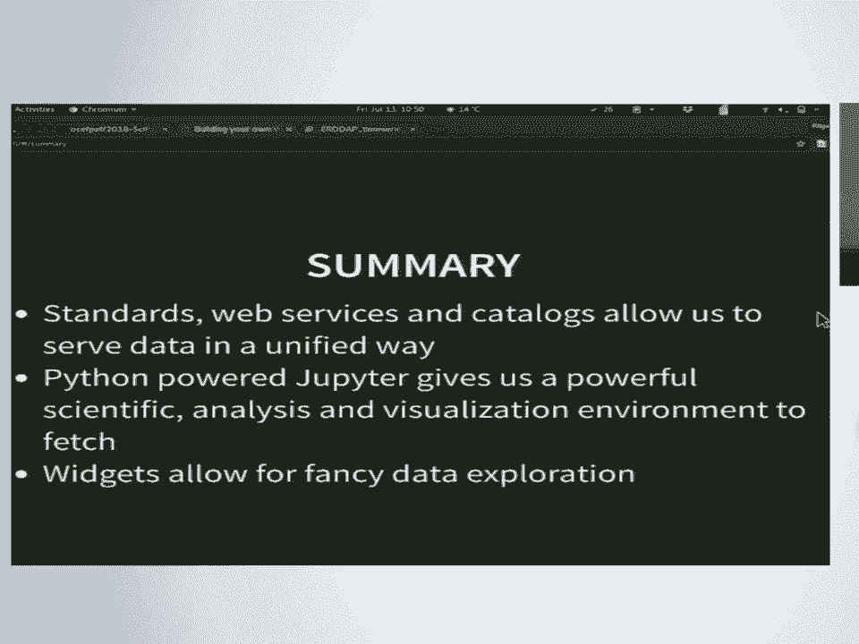

plot_button.on_click(on_plot_button_clicked)
display(station_dropdown, variable_dropdown, plot_button)
```
这种模式非常强大，可以快速原型化一个数据探索工具，甚至可以集成到更专业的 Web 应用中。

---

## 总结

本节课中我们一起学习了如何利用现代数据标准和网络服务构建数据应用。

*   **数据标准**是基石，它们确保了数据的互操作性和可访问性。
*   **网络服务**提供了获取数据的直接通道。
*   **数据目录**是统一入口，帮助我们管理和发现分散的数据源。
*   **Python 与 Jupyter** 是强大的工具，将数据获取、分析和可视化无缝衔接。
*   **交互式组件**能将 Notebook 转化为用户友好的应用界面。


通过结合这些工具和理念，我们可以快速构建出从简单分析到复杂仪表盘的各种数据应用，让数据探索和分享变得更加高效和直观。