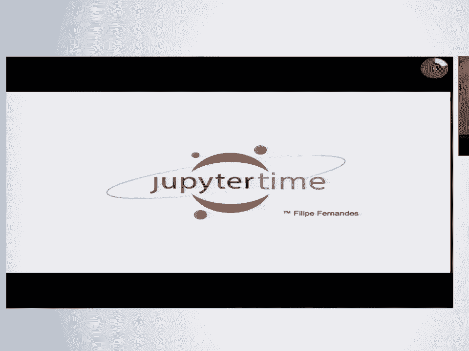
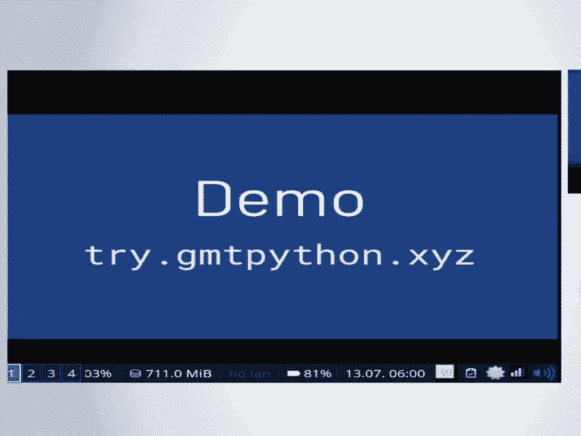
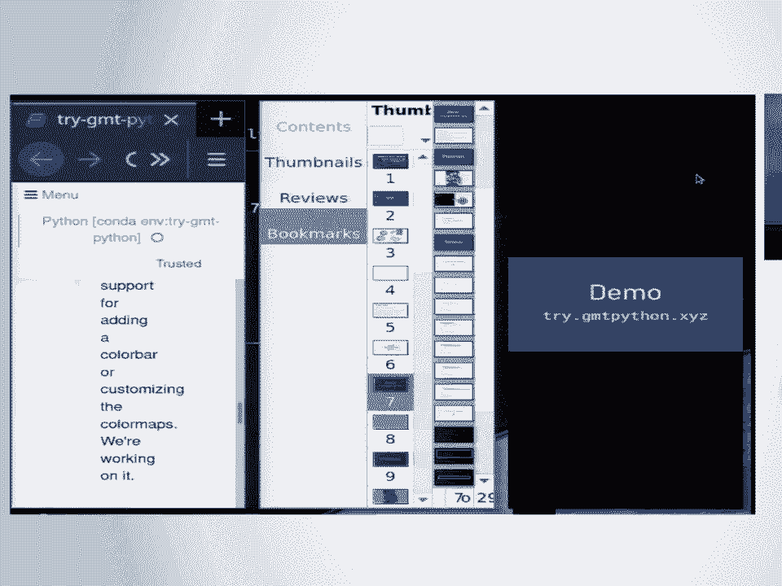
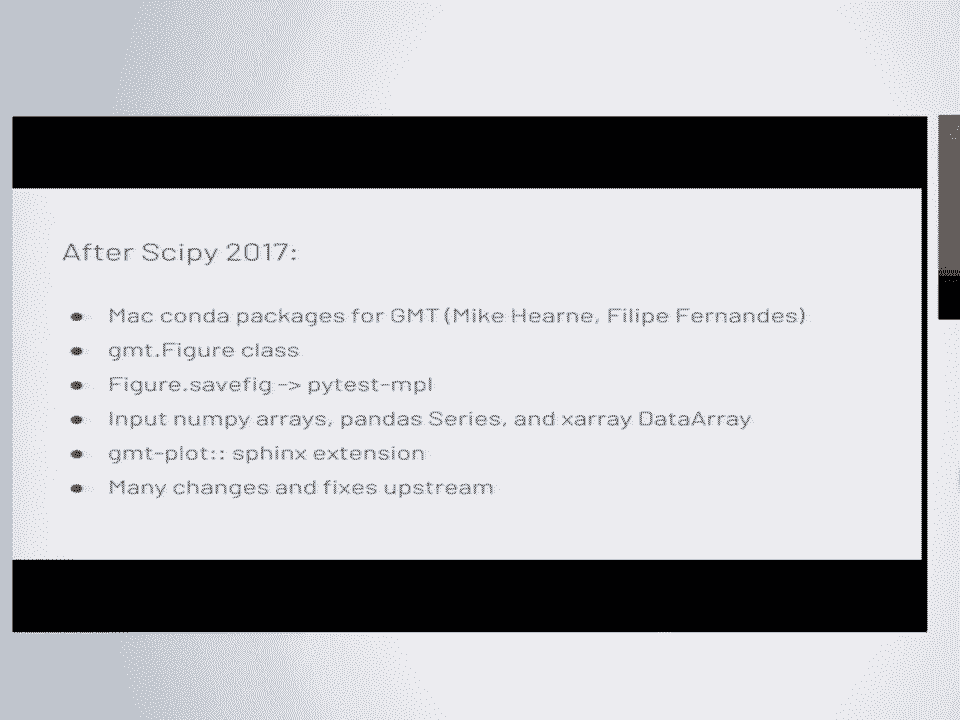
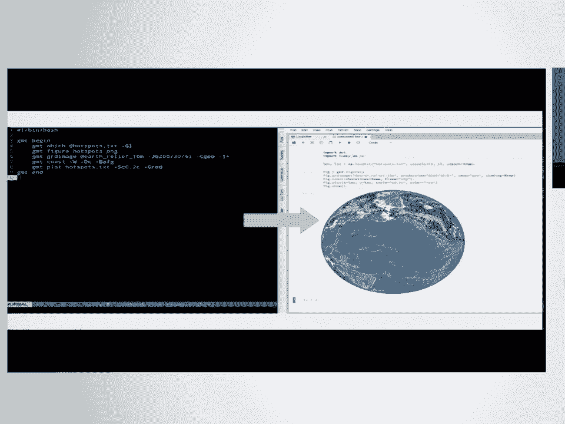
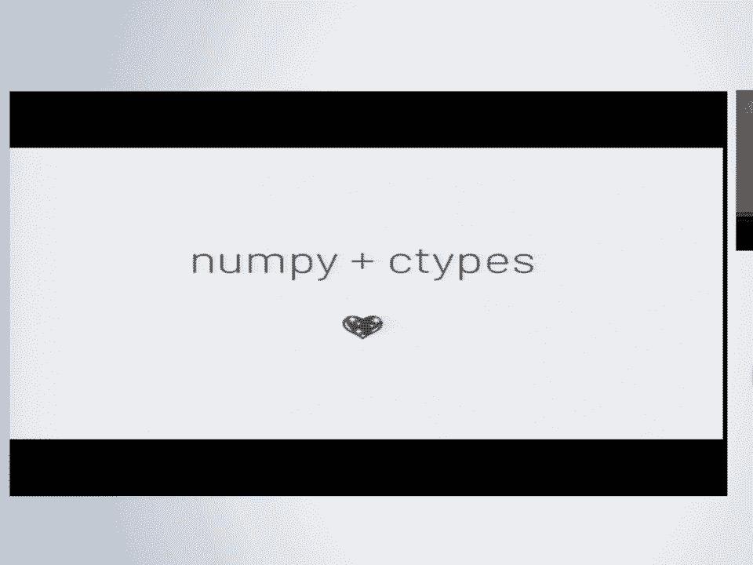
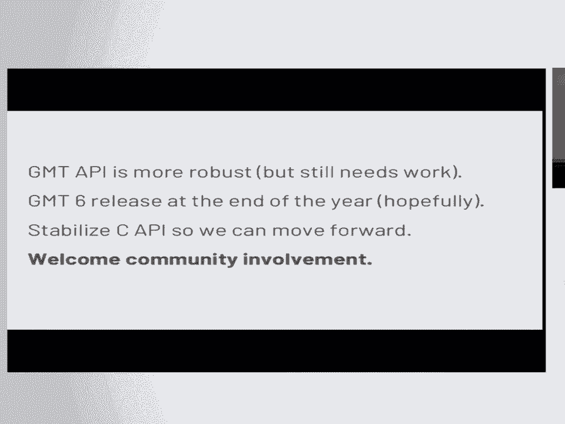
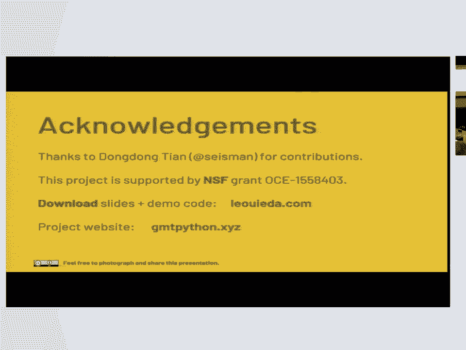

# 17：为通用制图工具构建面向对象的Python接口 🗺️


在本课程中，我们将学习如何为通用制图工具构建一个面向对象的Python接口。我们将了解GMT的基本概念、项目目标、实现过程中的挑战与成功经验，以及未来的发展方向。

## GMT概述

通用制图工具（GMT）已存在近30年，广泛应用于地球科学领域，用于制作地图、绘制数据以及处理测深、重力和磁力等数据。它在气象学和地层学中也有应用。GMT能生成高质量的图形，其性能卓越，对图形细节处理非常精细。

自大约六年前的5.0版本起，GMT成为一个单一的命令行程序，包含众多模块。每个模块功能不同，并拥有大量配置选项。所有这些功能都由一个C语言API支持，这正是我们试图在Python生态系统中利用的部分。

## 项目目标



本项目的首要目标是让新用户更容易接触和使用GMT。对于新手来说，学习这个项目通常非常困难，因此我们希望通过Python接口使其更易于使用。



这意味着要编写一个看起来像Python代码的包装器，而不是像C语言风格的代码。同时，我们还需要与SciPy技术栈集成，以便用户能够使用NumPy、pandas或Xarray加载数据，并将其传递给绘图库。

此外，我们希望提供更全面的文档，包括示例库和教程，其中包含可以复制粘贴的示例。这还包括在软件中内置一些示例数据。

## 演示与实践

现在，让我们通过一个演示来实际操作。你可以访问 `try.gmtpython.xyz`，该链接将引导你到Binder，我们可以一起测试Binder服务。

首先，我们需要导入GMT库。这是创建图形的第一步。

```python
import gmt
```

创建图形时，首先实例化GMT图形类。这个类将负责处理图形中的所有内容，然后导出和显示图形。

```python
fig = gmt.Figure()
```

我们可以制作一张墨卡托投影地图，宽度为6英寸，用巧克力色填充陆地，并自动添加图框。

```python
fig.coast(region=[-90, -30, -60, 30], projection="M6i", land="chocolate", frame="a")
```

运行 `fig.show()` 将在笔记本中显示图形。这一切都是通过C语言类型在后台运行GMT实现的。

```python
fig.show()
```

如果你想保存图形，我们实现了一个 `savefig` 函数，试图模仿matplotlib的 `savefig`。



```python
fig.savefig("central_america.png")
```

你还可以将图形导出为PDF、KML、GeoTIFF等GMT支持的其他格式。

## 使用示例数据

GMT现在包含示例数据集，这些数据集会自动下载到缓存目录中。我们通过数据集模块中的特殊函数提供对这些数据集的访问。



例如，调用以下函数将返回一个pandas DataFrame，其中包含地震目录的纬度、经度、深度和震级信息。


```python
quakes = gmt.datasets.load_earthquakes()
```


现在我们可以绘制这些数据。假设我们想制作一张全球摩尔威德投影地图。

```python
fig = gmt.Figure()
fig.coast(region="g", projection="W0/6i", land="gray", water="white")
fig.plot(x=quakes.longitude, y=quakes.latitude, style="c0.1i", color="yellow")
fig.show()
```



我们还可以根据地震的震级调整点的大小，或者根据深度为地震点着色，甚至可以设置颜色映射。


```python
fig.plot(x=quakes.longitude, y=quakes.latitude, style="cc", sizes=0.02*2**quakes.magnitude, cmap="magma", color=quakes.depth)
fig.show()
```


## 处理网格数据

我们还可以将网格数据传递给GMT。我们采用xarray DataArray对象作为默认的网格表示形式。

GMT现在还附带不同分辨率的地形起伏数据，从60角分到1角秒的SRTM数据。最近，我们还开始提供与测深数据混合的SRTM数据。

加载数据后，我们得到一个xarray DataArray，可以将其传递给 `grdimage` 方法进行绘制。

```python
grid = gmt.datasets.load_earth_relief(resolution="30m")
fig = gmt.Figure()
fig.grdimage(grid=grid, projection="M6i", cmap="geo")
fig.show()
```

如果你不想先加载数据集再传递，可以使用特殊的GMT文件名。任何以 `@` 开头的内容都将从远程服务器下载。

```python
fig.grdimage(grid="@earth_relief_30m", projection="M6i", cmap="geo", shading=True)
fig.show()
```



GMT现在还能自动进行山体阴影处理。只需设置 `shading=True`，它就会根据输入网格自动生成山体阴影。

## 交互式可视化

我们还在尝试使这些地图具有一定的交互性。目前，我们正在试验NASA的Web WorldWind库，它基本上是一个浏览器中的Google Earth。你可以获得一个交互式地球仪上的地形网格，然后进行缩放。


## 项目进展与挑战

自去年SciPy会议以来，我们根据收到的反馈进行了许多更改。例如，有人建议我们使用图形类而不是函数，这非常好，因为它允许我们使用pytest-mpl进行测试，而无需任何修改。

我们还要感谢Mike Herney和Philip Fernandez帮助我们在Conda Forge上制作GMT的Mac版本。现在，我们还可以导入NumPy数组、pandas Series和Xarray DataArray，从中加载内存，并直接将内存块传递给GMT。

最近，我还调整了out air Sphinx扩展，以制作GMT绘图Sphinx扩展，这样你就可以自动为Sphinx网站生成绘图。我们在GMT本身进行了许多上游更改，以使所有这些工作正常进行。

## 面临的挑战

许多挑战源于我现在正在使用API中以前从未接触过的部分，并尝试了一些在命令行中未真正使用的不同配置。



从某种意义上说，我不得不深入了解GMT API C源代码。实际上，如果你能读懂C语言，这段代码的可读性相当好。代码库虽然庞大，但并非难以理解。

部分不一致性是因为我们试图适应传统的命令行界面。尽管存在API，但API是围绕命令行构建的，而我们正试图在像Jupyter笔记本这样的高度交互式媒介中使用它。命令行界面使用的许多范式在交互式操作中并不适用。

另一个问题是在Conda上保持GMT安装的活跃性。对于Conda Forge上的大多数C语言库来说，这可能是一个常见问题，因为依赖关系有些棘手，许多用户在混合使用Conda Forge和默认依赖关系时遇到了麻烦。

## 成功经验

首先，上下文管理器非常棒。我以前从未真正使用过它们，但任何时候你需要构建某些东西然后进行清理操作，上下文管理器都是最佳选择。

在API中，我们通过会话类来实现这一点，它是一个上下文管理器，负责所有设置和清理操作。当你离开`with`块时，它会自动执行清理。

另一个成功是NumPy和C语言类型配合得非常好。我原本以为使用C语言类型会带来很多痛苦，但事实证明它实际上非常好，很多东西都可以直接使用。

例如，我们试图获取GMT打印到STDERR的错误消息，并将其包含在Python异常的追溯信息中。在GMT中，一种方法是给它一个函数指针，用于打印消息。在Python中，你可以编写一个Python函数，给它一个装饰器，然后将其传递给C语言类型函数，它就能正常工作。

## 未来工作

我们仍在解决GMT API中的许多问题，并且实际上预测到未来会遇到一些麻烦，因此我们正在尝试提前适应。

我们仍在试验Python API，尚未最终确定。我们正在寻找更好的方法，使其更加用户友好和直观。部分工作包括用更长的形式名称替换传统GMT的命令行参数，并试验哪些名称更好，如何使它们与现有的Python工具更兼容。

我们还需要改进当前的文档。许多C语言API包装代码已经确定，但文档记录不完善，GMT绘图Sphinx扩展将对此有很大帮助。

我们还在研究使用Sphinx Gallery来制作我们的图库。我们看到有一个开放的问题，要求他们为Sphinx Gallery捕获IPython的丰富显示，这对我们来说将直接适用，因为我们正在使用IPython的丰富显示机制在笔记本中插入绘图。

我们还需要帮助设置Conda Forge的Windows构建。我几乎从未使用过Windows，目前对如何操作一无所知。

由于所有这些原因，我们正在对GMT API进行压力测试，并将其带到以前未曾涉足的领域，从而使其更加健壮。未来，如果有人想用Julia或其他语言包装GMT，我怀疑他们会因为所有这些工作而变得容易得多。

我们预计GMT 6版本将在年底发布，该版本将稳定API，并包含我们为使其更加用户友好而对命令行所做的所有更改。

## 总结



在本课程中，我们一起学习了如何为通用制图工具构建一个面向对象的Python接口。我们了解了GMT的基本概念、项目目标、演示与实践、处理网格数据、交互式可视化、项目进展与挑战、成功经验以及未来工作方向。通过这个项目，我们希望能够使GMT更加易于使用，并为Python生态系统带来更多价值。