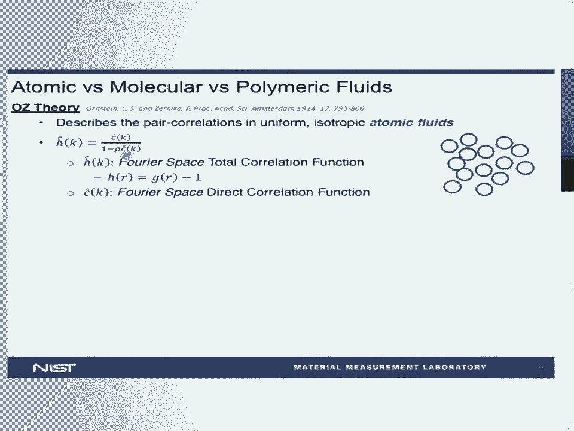
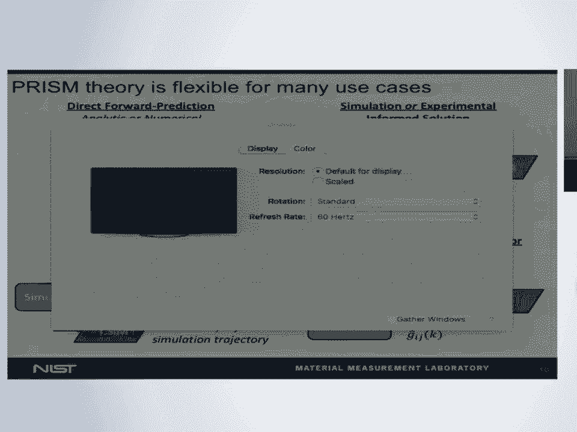
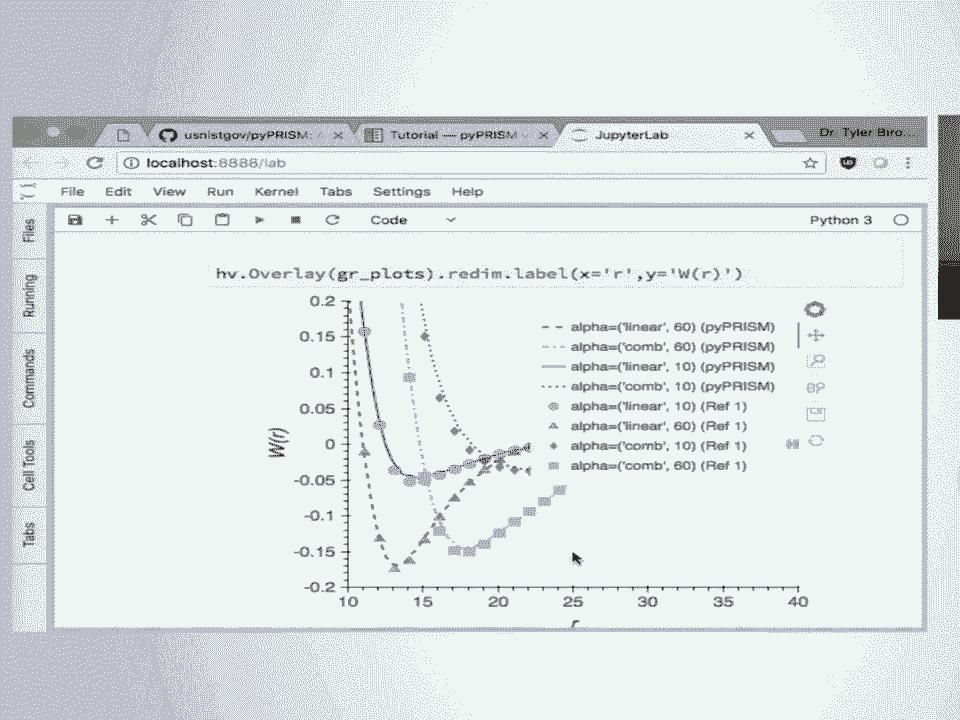

# 18：pyPRISM 的设计与实现 🧪

在本节课中，我们将学习聚合物液体状态理论（PRISM）及其开源计算工具 pyPRISM。我们将了解 PRISM 理论的基本概念、它能解决的问题，以及如何使用 pyPRISM 工具进行快速计算。

---

## 概述：什么是液体状态理论？ 🤔

液体状态理论有多种形式，它们主要处理所谓的**空间关联函数**。这些函数描述了系统中粒子在空间中的相互关系。

例如，考虑一个聚合物纳米复合材料的粗粒度示意图。我们可以研究聚合物链中单体之间的关联函数。在纳米复合材料基体中，存在一个空间关联函数，它与在给定距离上找到两个单体的概率相关。

此外，还有另一种称为**直接关联函数**的关联函数。作为一个说明性例子，我们还可以考虑**分子内关联函数**。这种关联函数描述的不是不同分子之间的关联，而是同一分子内单体之间的关联。

正是这种分子内关联的分离，构成了 PRISM 理论的基础，使我们能够进行后续展示的计算。如果你有小角 X 射线或中子散射的经验，这听起来很像**形状因子**和**结构因子**，因为它们本质上是相同的东西。我们将讨论如何使用 PRISM 理论来预测 X 射线和中子散射实验。

---

## PRISM 理论的历史与发展 📜



在深入 PRISM 理论之前，我们先简要回顾一下其历史发展。

一百多年前，Ornstein-Zernike 理论描述了均匀各向同性原子流体中的对关联，如下图所示。在傅里叶空间中，我们有一个相对简单的代数表达式，描述了总关联函数（描述不同分子上单体之间的关联）与直接关联函数（描述不考虑多体效应时分子之间的关联）之间的关系。


然而，这个形式主义仅限于由球形分子表示的各向同性有序的原子流体。

1973年，Chandler 和 Loudon 将 OZ 理论扩展为 RISM 理论，以处理所谓的**分子流体**，如 O₂ 和 N₂，后来甚至扩展到乙腈等小分子。他们通过引入第三种关联函数——描述分子内关联的 **ω 函数**——来实现这一点。形式主义变得稍微复杂，但在傅里叶空间中仍然是代数形式，相对直接。

最终，Schweizer 和 Curro 将 RISM 理论扩展为我们现在所称的 **PRISM 理论**。这允许我们将相同的数学形式主义应用于高分子系统。现在，我们可以描述具有成千上万个单体的分子的关联，并预测这些大分子系统的热力学和结构性质。

---

## PRISM 理论能预测什么？ 🔮

PRISM 理论可以预测多种性质。

首先，它可以预测**结构因子**。如果你从事小角 X 射线或中子散射，这会立即引起你的兴趣，因为它可以预测你实验中测量的内容。


其次，它可以预测热力学性质，例如系统中各组分之间的**平均力势**、**第二维里系数**、**χ 参数**、**双节线转变温度**、**状态方程**等等。




PRISM 理论不是只提供单一信息的理论，它为一整套热力学性质的计算打开了大门，你可以为你的系统快速计算这些性质。

下图展示了两个例子：预测聚电解质系统的结构因子，以及预测具有聚合物接枝改性填料的纳米复合材料的 χ 参数。


---

## PRISM 理论适用于哪些系统？ 🧬

PRISM 理论适用于广泛的系统。

我们可以研究**胶束溶液**。在这里，PRISM 被用来模拟蠕虫状胶束系统的小角中子散射数据，并且拟合得相当好。在某些情况下，这是唯一能从这些昂贵实验中提取信息的方法。

我们也可以研究**纳米复合材料**或**纳米粒子溶液**。在这里，我们不是在构建模型时考虑数据，而是将描述输入 PRISM 形式主义，得到我们认为结构因子应该是什么样子的预测。尽管实验测量数据与 PRISM 预测之间存在一些偏差，但总体而言，定性拟合是相当好的。

此外，PRISM 还可以应用于**聚电解质系统**（例如模拟烟草花叶病毒颗粒的结构因子）、各种不同序列的**共聚物系统**，甚至更复杂的系统。


PRISM 在其用例中非常灵活。除了预测系统性质，它还可以与实验或模拟耦合以扩展其适用性。例如，可以将 PRISM 作为散射数据的**逆模型**，利用已有的在稀溶液中有效的模型，通过 PRISM 引入分子间相互作用，极大地扩展其适用性。

最近，PRISM 还被开发成一种**粗粒化引擎**，允许从详细的原子模拟模型中快速构建基于液体状态理论的粗粒化模型，从而在更长的长度和时间尺度上进行模拟。

---

## 为什么 PRISM 理论未被广泛使用？ 🚧

PRISM 理论可以计算许多热力学性质，可以表征许多类液体聚合物材料的材料结构，适用于广泛的聚合物系统，并能很好地与实验、模拟和理论结合。

如果之前没听说过 PRISM，这可能不是你的错，因为 PRISM 在整个社区中的使用严重不足。主要原因之一是**缺乏开源工具**，没有便捷的途径来接触 PRISM 理论。在没有工具的情况下，你需要花费大量时间学习理论，才能决定它是否对你有用。

---

## 介绍 pyPRISM：降低使用门槛的工具 🛠️

这个工具叫做 **pyPRISM**，它是一个用于 PRISM 理论的计算工具。其主要目标是降低接触这一强大理论的门槛。pyPRISM 具有广泛的应用潜力，我们希望给人们机会，让他们自己判断这个工具是否能增强他们的研究，帮助他们更快地获得更好的答案。

pyPRISM 的相关资源如下：
*   **GitHub 仓库**：`github.com/usnistgov/pyprism`
*   **文档**：`pyprism.readthedocs.io`
*   **交互式教程**：通过 Binder 实例提供
*   **综述文章**：详细介绍了 PRISM 理论的形式主义
*   **SciPy 会议论文**：详细介绍了代码方面

pyPRISM 非常注重**教学**。我们认识到，在开发科学工具时，除了教授 API，还需要考虑用户是否了解或将要用到的理论。因此，我们投入了大量精力，不仅提供学习 pyPRISM 的材料，还引导用户以正确的方式应用和使用该理论。

为此，我们开发了一系列 Jupyter Notebook，旨在持续增长和更新。这些笔记本涵盖了以下内容：
*   **基础知识**：解释如何使用 Jupyter Notebook、Python 和 NumPy。
*   **PRISM 理论与 pyPRISM 使用**：详细介绍 PRISM 理论以及如何使用 pyPRISM。
*   **案例研究**：针对特定系统（如纳米复合材料）的详细案例研究，展示如何应用。
*   **高级主题**：针对高级用户，介绍 pyPRISM 的类结构、设计选择以及如何进行更高级的 PRISM 计算。

---

## pyPRISM 快速上手演示 💻

在演示中，我们首先在 `nb00_introduction` 笔记本中讨论了哪些系统可以用 pyPRISM 研究，以及使用 PRISM 理论相对于其他分子模拟或理论方法的优势（例如，计算速度快至秒级、无有限尺寸效应、无需担心平衡问题、大多无需不可压缩性假设）。同时，也明确了 pyPRISM 的**不适用场景**：宏观相分离系统、非各向同性相、具有强方向有序性的系统，以及对动力学性质感兴趣的情况（因为它是平衡态理论，预测平衡静态性质）。

在 `nb04_theory_and_pyprism` 笔记本中，我们开始介绍 pyPRISM 的使用。我们假设用户没有 Python 基础，因此从导入必要的库开始。

以下是一个简单的硬球流体计算示例的核心代码：

```python
# 导入必要的库
import pyprism as pyr
import numpy as np
import matplotlib.pyplot as plt

# 1. 创建系统
system = pyr.System(Temperature=1.0, NTypes=1)

# 2. 定义求解域（网格）
system.setSpace(grid=0.005, length=32768)

# 3. 定义相互作用势（硬球势）
system.setPotential(type_i=‘A‘, type_j=‘A‘, potential=‘hard-sphere‘, sigma=1.0)

# 4. 定义密度
system.setDensity(‘A‘, density=0.8)

# 5. 定义分子结构（对于原子流体，分子内关联函数是 delta 函数）
system.domain.Molecules[‘A‘].setOmega(np.ones(system.domain.NGrid))

# 6. 定义闭合近似
system.setClosure(‘PercusYevick‘)

# 7. 求解 PRISM 方程
system.solve()
```

求解完成后（大约只需一秒），我们可以绘制结果，例如**对关联函数**。pyPRISM 使用 Bokeh 和 HoloViews 库，用户可以交互式地探索绘图和数据。



计算完成后，求解得到的关联函数存储在内存对象中，因此无需重新计算即可进行其他计算。例如，我们可以接着计算**结构因子**或**第二维里系数**。

整个计算过程，如果去掉解释，大约只需要 12 行代码。通过这 12 行代码，我们指定了这个相对简单系统的所有必要细节并完成了求解。

pyPRISM 也适用于非平凡的系统。例如，一个研究聚合物接枝纳米粒子的复杂系统，其中聚合物具有复杂的梳状结构。使用 pyPRISM，可以快速求解系统的性质，并计算不同架构下接枝纳米粒子之间的平均力势。教程中会覆盖文献中提取的数据，使用户在调整参数或自己编写代码时，能立即判断其预测是否与经过验证的文献结果一致。

---

## 总结与资源 📚

本节课我们一起学习了 PRISM 聚合物液体状态理论的基本概念及其开源实现 pyPRISM。我们了解到 PRISM 理论通过关联函数描述系统，能够快速预测多种热力学和结构性质，适用于广泛的类液体聚合物系统。pyPRISM 工具极大地降低了使用该理论的门槛，通过简洁的代码和丰富的教程，使用户能够快速上手并应用于自己的研究。

所有教程 Notebook 都可以在线获取。如果你有任何问题或想使用 pyPRISM，欢迎通过邮件联系开发者。他们期待用户的使用反馈和建议，并对这个工具的未来充满期待。

**核心公式提醒**：PRISM 理论的核心方程在傅里叶空间中是一个代数关系，它关联了总关联函数 **h(k)**、直接关联函数 **c(k)** 和分子内关联函数 **ω(k)**。对于多组分系统，其矩阵形式可表示为：
`[I - ω(k) * c(k)] * h(k) = ω(k) * c(k)`
其中 **I** 是单位矩阵。这个方程需要与一个**闭合关系**（如 Percus-Yevick 或 Hypernetted Chain）联立求解。

---

## 问答环节精华摘录 💬

*   **问**：对于聚合物化学新手，你说的分子间“关联”是指分子间作用力吗？
    *   **答**：主要是指**空间关联**。关联函数与在给定距离找到两个位点的概率相关。同一分子内和不同分子间的单体，其概率是不同的。我们追踪的是关联，它是这些概率的比值。

*   **问**：教程中能否考虑从约化单位转换到真实单位（如纳米）？
    *   **答**：在 pyPRISM 文档的 API 部分，有一个 `unit_converter` 包可以做到这一点。它允许你定义能量尺度和长度尺度，并自动转换回你喜欢的真实单位。

*   **问**：势函数从哪里获取？目前只有 Lennard-Jones 势吗？
    *   **答**：目前主要使用粗粒化世界中经典的势函数，如 Lennard-Jones、硬球势等。但只要你的势能可以表示为两体对函数，就可以与 pyPRISM 一起使用。原则上可以使用来自任何力场的列表势。

*   **问**：如果输入一个反应性势或 Stillinger-Weber 势（不满足理论有效性条件）会怎样？
    *   **答**：这更多是数学上的问题。最终，我们需要势函数在求解网格上的一维向量表示。如果无法给出径向距离的函数，就需要仔细思考如何在 PRISM 框架中输入。因为 pyPRISM 与大多数分子模拟方法不同，它不处理坐标轨迹，只处理关联函数。

*   **问**：PRISM 能给出自由能吗？
    *   **答**：平均力势就是一条自由能曲线，是将两个粒子从无穷远带到某距离的自由能。但对于广义的自由能（如粒子数的函数），目前 pyPRISM 难以直接获取。不过，通过求解得到的热力学关联函数，可以计算很多性质，如化学势等。

*   **问**：PRISM 适用于非平衡态或非均匀系统吗？
    *   **答**：基础 PRISM 理论是为平衡态巨正则系综推导的，不适用于非平衡态。对于非均匀系统，基础形式也不适用。但 PRISM 可以与其他理论耦合。例如，人们可以先用 DFT 或 SCFT 计算全局系统的相分离，然后使用 PRISM 理论计算各个单独相的结构。PRISM 可以处理单个相域，但不能处理相域之间的界面和相互作用。

*   **问**：是否了解积分方程粗粒化理论？pyPRISM 包含吗？
    *   **答**：是的，IECG 正是积分方程粗粒化。目前 pyPRISM 还没有专门的功能来实现它，但未来希望朝这个方向努力。pyPRISM 本身发布才大约两个月，非常新，但开发者对开发这个方向很感兴趣。

---


本节课到此结束。希望本教程能帮助你理解 PRISM 理论和 pyPRISM 工具，并激发你在自己研究中的应用探索。