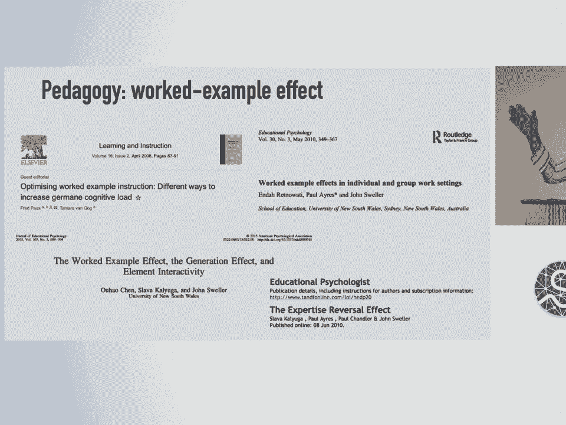
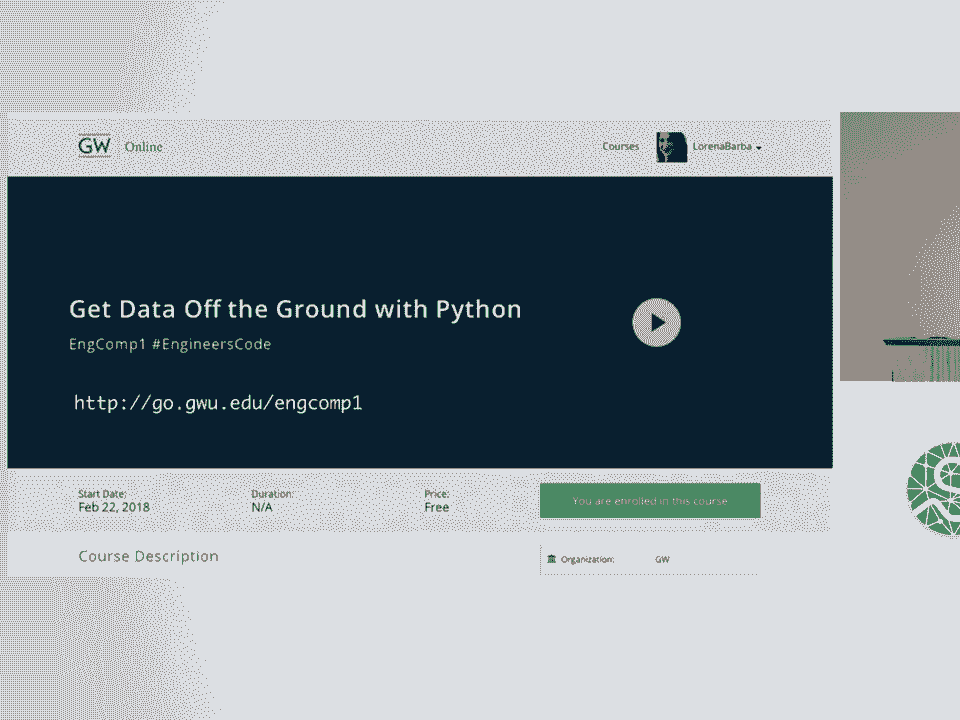
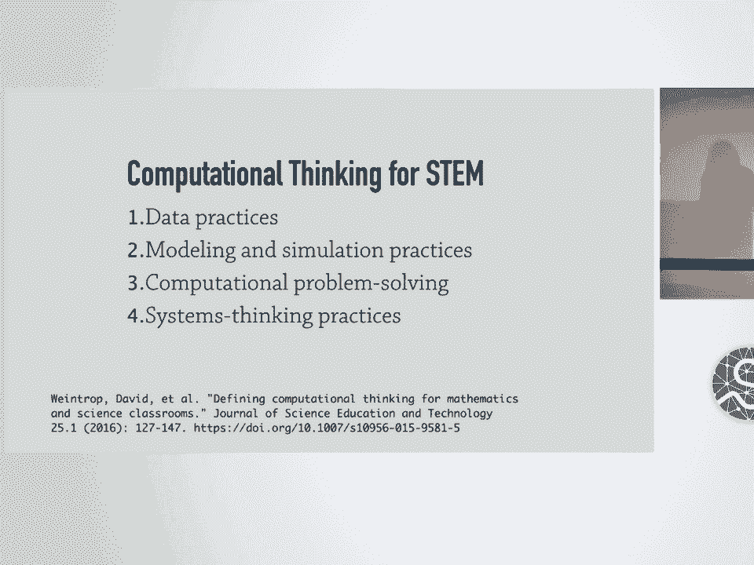

# 20：工程师代码 - 可复用、开放的教育模块 🧑‍💻

在本节课中，我们将学习如何为工程学教育创建可复用、开放的交互式教学模块。我们将探讨其核心设计原则、实践方法，并了解如何将这些模块整合到正式的课堂教学中。

## 概述

本次演讲旨在分享一个项目，该项目致力于开发可复用的开放教学材料，以促进工程学教育中计算思维的整合。项目灵感来源于开源软件开发模式，希望教育者能协作开发高质量的教学内容，避免重复劳动。

## 设计原则与核心概念

上一节我们介绍了项目的总体目标，本节中我们来看看指导该项目开发的具体设计原则和核心概念。

以下是该项目的六个关键设计原则：

1.  **可计算内容**：指通过计算机引擎（如Python）在学习平台中实现强大交互性的教育内容。我们选择使用 **Jupyter Notebook** 作为实现平台。
2.  **开放教学法**：在我们的教学实践中，反映开源软件的精神与实践。
3.  **模块化**：创建可堆叠的模块，打破标准课程格式，使其他教师更容易采用和组合。
4.  **利用工作样例效应**：认知科学研究表明，对于初学者面对复杂主题时，提供带有充分脚手架的工作样例，比自由形式的问题解决更有效。这有助于学生将有限的短期记忆集中在学习步骤上。
5.  **使用现场编码构建课堂主动学习**：现场编码能有效吸引学生参与，保持课堂互动。
6.  **引导学生记录自己的工作**：除了提供工作样例，还应让学生有机会使用Jupyter笔记本等工具记录自己的学习过程，使他们也成为开放材料的创造者。

## 工程学教育的背景与变革

了解了设计原则后，我们需要理解这些原则所应用的背景。工程学教育本身经历过重大变革。

工程学教育在过去与现在截然不同。大约100年前，工程学院强调实践技能。1920年后，一批受过欧洲教育的教授（如Timoshenko, von Kármán）带来了更侧重于工程科学和理论内容的观点。在1945年至1965年间，工程学教育完成了从实践培训到理论科学教育的转变。

既然工程学教育过去可以被转变，那么今天，随着计算技术渗透到生活和工业的各个方面，我们也可以重新思考如何教授工程师。这与之前演讲中提到的理念完全一致。

## 计算思维与可计算内容

上一节我们回顾了工程教育的演变，本节我们聚焦于本次项目的核心理念：计算思维。

我们的灵感来源于计算思维和计算学习的概念。这一概念由人工智能先驱Seymour Papert首次提出。他对于利用计算机帮助人们以不同方式思考、使学习更有效感兴趣。

在我看来，实现这一理念的“杀手级应用”是 **Jupyter**。它已成为一种新型的开放教育资源。人们现在用Jupyter Notebook编写课程、模块甚至整本书，并在线发布。

我的关注点是如何将所有这些整合到正式课堂中。我认为，每一门工程学课程，无论教授什么内容，如果使用计算，都可以使学习更有效。

**可计算内容**是指在学习平台中具有强大交互性的教育材料。我们创建的第一个学习模块叫做 **CFD Python**。这是一套基于实践模块的笔记本，内容包含文本、图形、方程和可执行的Python代码。

## 项目实践：工程计算课程

理论需要实践来检验。接下来，我们看看这些原则如何在一个具体的课程中落地。

在乔治华盛顿大学，我教授了一门名为“工程计算”的新课程，面向大学二年级的工程专业学生。这些学生基本上没有任何编程背景。

课程目标是：为工程师奠定计算思维的基础，并培养他们的信心。我们的座右铭不仅是“学习编程”，更是“**用编程来学习**”。

课程围绕一系列Jupyter笔记本展开。每个课程模块包含大约五节课，每节课就是一个Jupyter笔记本。这些课程非常详细，包含笔记和逐步讲解的工作样例。

以下是三个模块的快速概述：

*   **模块一：打好数据基础**：假设零编码经验。前三节课专注于Python编程基础，几乎不涉及数学。只在最后一课中，通过一个简单的线性回归例子（使用地球温度随时间变化的真实数据）引入数学。
*   **模块二：用统计起飞**：仍然不涉及微积分，重点是使用计算方法进行基础统计学和动手数据分析。使用真实数据（如罐装啤酒的苦度或酒精含量数据、口红中的铅含量数据）并引入pandas库。
*   **模块三：用系统应对变化**：介绍如何求解常微分方程。这是课程中首次涉及基于微积分的应用。此时学生已经对使用Python和Jupyter相当熟悉。例如，在一个课程中，学生从分析一个下落小球的视频开始，通过鼠标点击获取像素坐标，最终计算出重力加速度并过渡到求解微分方程。

## 课程开发与课堂教学最佳实践

我们介绍了课程模块的内容，那么如何有效地开发和实施这些课程呢？以下是我们在实践中总结的最佳实践。

**如何开发课程？**

以下是我们的课程开发步骤：

1.  将内容分解为小步骤。
2.  以逻辑方式将这些小步骤组合成块。
3.  添加叙述和上下文。
4.  链接到文档、文章等外部资源供学生探索。
5.  穿插简单的练习。
6.  为更高级的学生添加挑战性任务。
7.  最后，将所有内容在线发布。

**在课堂上：**

采用现场编码演示，让学生跟随操作。同时，始终鼓励学生创建自己的笔记本来完成作业和记录笔记。

如果只给学生工作样例而不让他们动手操作，他们只会按`Shift+Enter`快速浏览，这是不够的。在课堂上，我从一个空白的笔记本开始，让学生也打开空白笔记本，然后我们逐行讲解示例，他们必须自己输入。过程中会出现错误（如忘记冒号、缩进错误），或者我会在现场编码时故意犯错，这些都能帮助学生学会解决问题，更积极地参与到编码示例中。

我还会安排几名学习助理在教室里走动，回答问题。

## 主动学习与工作样例效应的证据

我们强调了现场编码和主动学习的重要性，这种重要性有坚实的科研证据支持。

一项综合了225项关于主动学习研究的元分析发现，与接受主动学习的学生相比，仅接受课堂直接讲授的学生，其课程不及格的可能性要高出55%。

该研究有一句令人印象深刻的评论：如果将这些实验作为医学干预的随机对照试验来分析，可能会因为疗效显著而提前终止，因为对照组（传统讲授）实际上受到了损害。

此外，关于**工作样例效应**的教学法也有大量研究证据支持。我们可以在设计课程时充分利用这一效应。

## 总结与邀请

本节课中，我们一起学习了“工程师代码”项目的核心内容。

我们探讨了为工程教育创建可复用、开放教学模块的设计原则，包括可计算内容、开放教学法和模块化等。我们回顾了工程教育的历史变革，并强调了在当前时代整合计算思维的必要性。通过具体的课程模块实例，我们展示了如何将这些原则付诸实践，并分享了课堂现场编码和基于研究的教学方法（如工作样例效应和主动学习）的重要性。

最后，我邀请大家共同思考：我们如何才能围绕在工程或科学课堂中使用Jupyter和Python进行教学，凝聚成一个社区？希望我们能像开源软件开发一样，在开放教育材料开发上开展协作。

---
**附：问答环节摘要**

*   **问**：如何平衡使用预制模块和让学生从空白笔记本开始？
    *   **答**：将预制笔记本视为交互式教科书。在课堂上，我从空白笔记本开始进行现场编码，让学生逐行跟随输入。这能迫使他们专注并处理错误。之后，可以指引他们参考官方笔记本进行练习或课后复习。
*   **问**：这种互动教学模式有班级人数限制吗？
    *   **答**：我的班级有50名学生，通过我自己和两名学习助理的协助可以管理。更小的班级规模（如20人）效果更好，但50人在有辅助的情况下是可行的。
*   **问**：当学生遇到复杂的错误跟踪信息时不知所措，有何建议？
    *   **答**：需要仔细培训学习助理，让他们学会提问而非直接给出答案。例如，问学生“你认为这是什么原因？”或“错误信息说了什么？”，引导他们自己思考和排查问题。