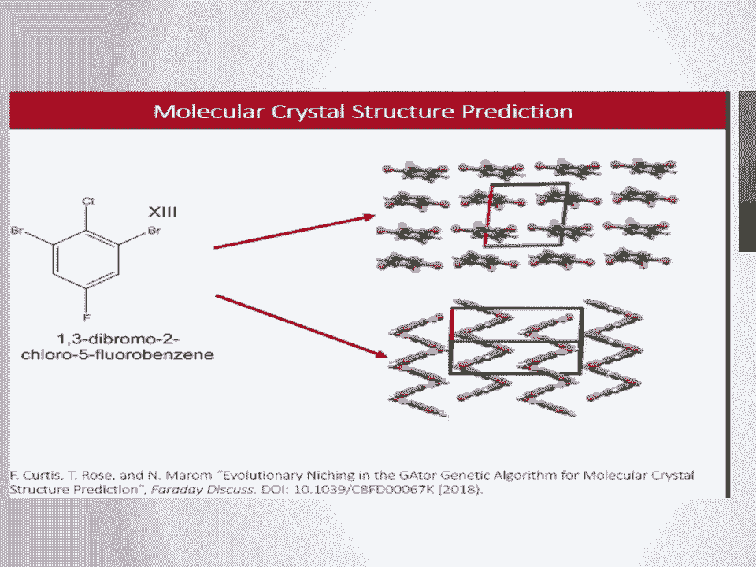
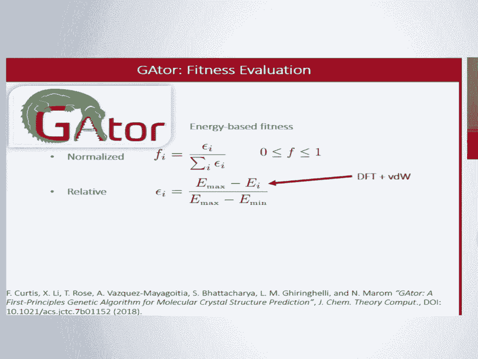
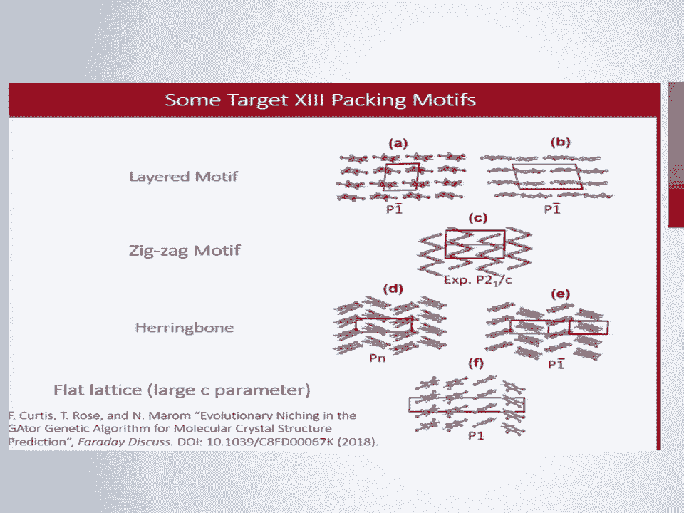
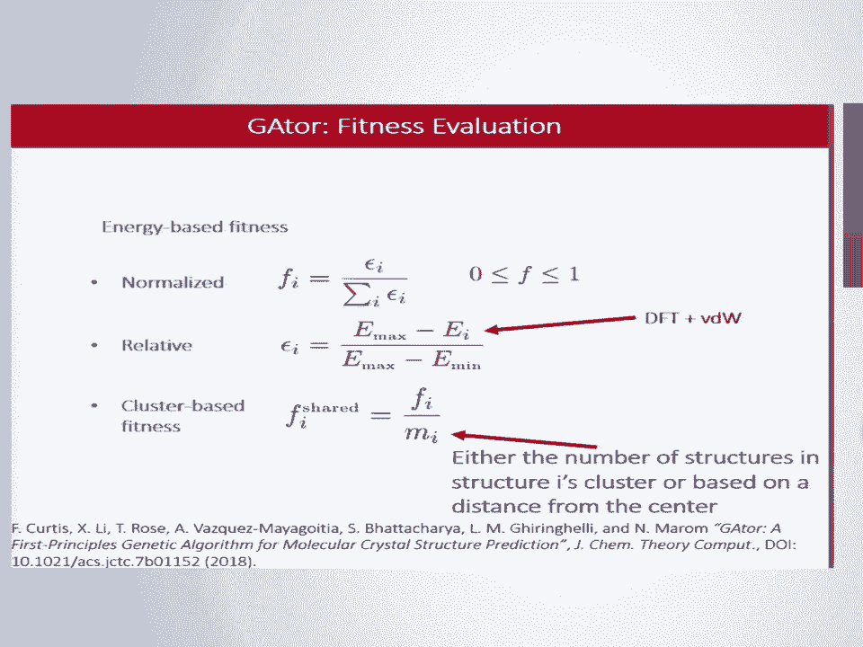
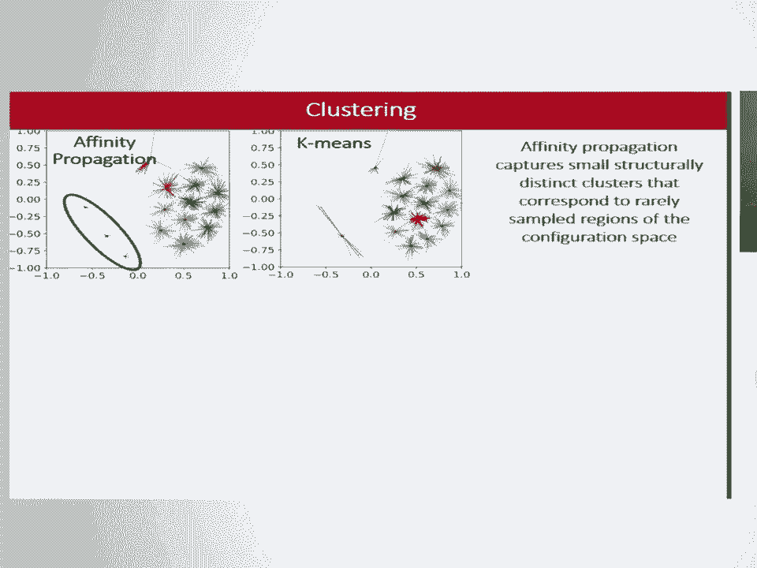
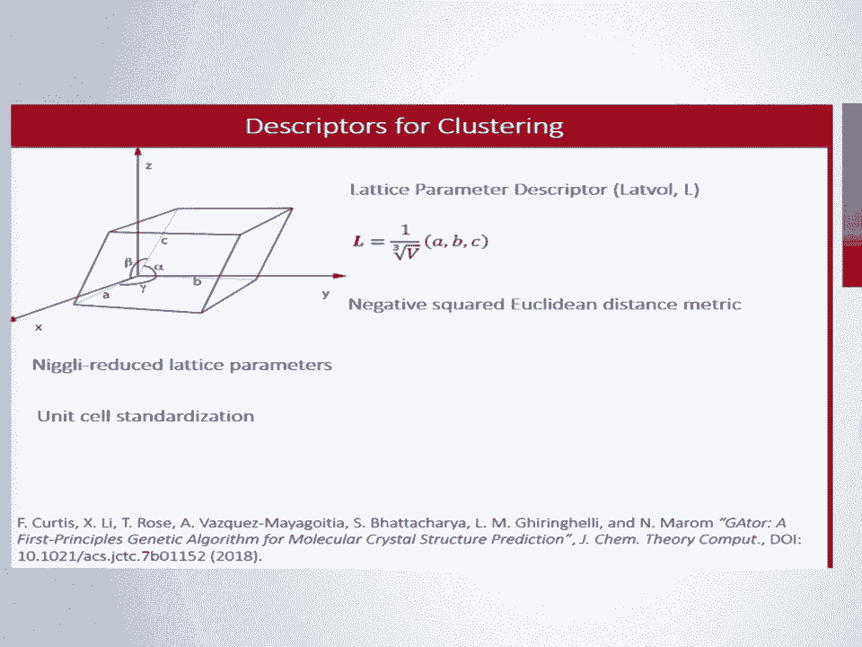
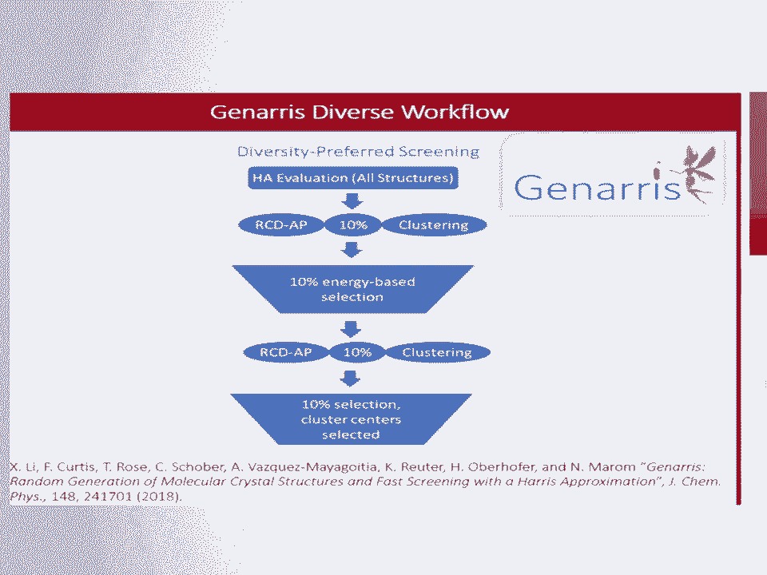

# 21：分子晶体结构预测中的进化小生境技术 🧬

在本节课中，我们将学习一种名为“进化小生境”的技术，它被应用于我们为分子晶体结构预测开发的GAtor遗传算法中。我们将探讨如何利用聚类和基于描述符的适应度函数，来平衡搜索过程中的探索与利用，从而更有效地发现潜在的晶体多晶型。

## 什么是分子晶体结构预测？🔍

分子晶体结构预测的目标是，从一个分子的二维结构式出发，预测该分子在形成固体时可能存在的晶体结构。我们研究的对象是来自剑桥晶体学数据中心盲测的目标分子13。

分子晶体广泛应用于有机电子学、制药、颜料、染料、炸药等领域。一个熟悉的例子是阿司匹林晶体。

下图展示了各种晶体构型的自由能稳定性与密度的关系图。图中的点代表不同的构型，红色形状表示潜在的晶体结构。

我们注意到，右侧的分子晶体图与左侧的离子晶体图不同。对于分子晶体，存在许多能量非常接近的结构。这是因为它们是通过弱的范德华力结合在一起的，而不像离子晶体那样通常只有一个全局能量最低点。

分子晶体能够以不同状态固化的能力被称为“多晶型现象”。这无疑增加了分子晶体结构预测的挑战性，再结合较长的计算时间，就迫切需要增强的搜索算法。

## GAtor遗传算法简介 🧬

为此，我们开发了GAtor，一个专门为分子晶体结构定制的遗传算法。遗传算法的核心思想类似于达尔文进化论：最适应的结构将传递它们的“基因”。

定义适应度的标准方法通常只基于能量。这些能量是通过密度泛函理论的轻量级设置，并加上范德华修正（使用FHI-aims代码）计算得到的。因此，这里的适应度是相对于种群中当前最大和最小能量值的归一化相对能量。

适应度公式为：
`fitness_i = (E_max - E_i) / (E_max - E_min)`
其中，`i` 代表第 `i` 个结构，`E_i` 是其能量。

## 仅基于能量的适应度函数有何问题？⚠️

仅基于能量的适应度函数可能会带来一些问题。首先，晶体结构可以以多种“堆积模式”排列，我们希望利用这一点来辅助搜索。

一些常见的堆积模式包括：层状、锯齿形、人字形、扁平晶格、梯田状等。

另一个问题是，势能表面通常存在大量局部极小值。我们不确定哪些局部极小值可能对应可行的多晶型。如果仅基于能量进行搜索，我们可能会容易受到“遗传漂变”现象的影响，这本质上等同于陷入局部极小值。

因此，我们需要在“探索”和“利用”之间取得平衡，这对于任何全局优化搜索都是如此。

## 解决方案：引入基于聚类的适应度函数 💡

我们开发的一种解决方案是引入基于聚类的适应度函数。其原理很简单，可以用结构所属集群的某个属性来调整其适应度。

例如，适应度可以除以结构 `i` 所在集群中的结构数量，或者除以该结构到其集群中心的距离。

## 聚类算法与描述符 📊

我们可以使用几种聚类算法。这里我们采用无监督机器学习，具体是**亲和传播** 和 **K均值** 聚类。下图是它们的原理示意。

两者的关键区别在于：K均值需要预先指定聚类数量，这可能导致算法强行将一些点归入不合适的集群；而亲和传播能够自主确定哪些结构属于哪个集群。

上图展示了K均值和亲和传播如何对同一组410个晶体结构（在晶格参数空间ABC中）进行聚类。每个点代表一个晶体结构。可以看到K均值倾向于将远处的点也拉入集群，而亲和传播通常在这方面表现更好。

亲和传播（以及许多机器学习应用）需要**描述符**和**距离度量**。接下来，我将介绍我们使用的几种描述符。

**1. 晶格参数描述符**
该描述符基于晶胞。我们使用尼格里约化并标准化的晶格参数 `a, b, c`，将它们除以体积的立方根，形成一个特征向量。这样做是因为同一个结构可能有多种空间群表示。

**2. 径向分布函数描述符**
径向分布函数描述了在距离 `x` 类型原子一定距离处，`y` 类型原子的密度变化。其公式为：
`g_xy(r) = (1/(n_x * ρ_y * V)) * Σ_i Σ_j δ(r - r_ij)`
其中，`n_x` 是扩展晶胞中 `x` 类型原子的数量，`i` 和 `j` 遍历 `x` 和 `y` 类型的原子，`V` 是平滑常数。

通过对一组半径向量应用此函数，可以得到一个特征向量（例如溴-溴对的RDF向量）。还可以为其他原子对组合计算并连接这些向量，得到一个更通用的描述符。当特定原子间接触（如氢键或卤键）对稳定性有重要影响时，可以使用此类描述符。

**3. 相对坐标描述符**
这是我们开发的一种描述符。其基本思想是：为每个分子定义分子轴。以一个参考分子为基础，计算其质心到所有邻近分子的位置向量 `r_vec_k`。然后，计算该向量与参考分子各轴的**点积**，得到 `p`（衡量位置相似性）。同时，计算参考分子轴与邻近分子轴的**点积**，得到 `q`（衡量取向相似性）。将 `p` 和 `q` 组合起来，就得到RCD向量 `r`。

要计算两个结构（1和2）之间的距离，可以构建一个距离矩阵 `D`，其元素通过归一化的 `p` 和 `q` 的差值的L2范数平方来计算，并用参数 `c` 来缩放位置差异与取向差异的相对重要性。最后，对 `D` 矩阵中最小的 `m` 个元素求和，作为两个结构之间的距离。

## 初始结构生成与筛选流程 🔄

我们使用自写的 `generous` 包来生成初始结构。该流程利用物理约束（如体积范围、晶格参数范围）和空间群对称操作，首先生成大量（例如5000个）随机但物理上可行的晶体结构。

然后，我们使用**哈里斯近似**（一种快速近似方法，假设非相互作用的片段密度）来估算这5000个结构的能量。

接着，我们使用RCD特征向量和亲和传播聚类来确定集群。我们从所有集群中均匀采样，选择能量最低的10%的结构（例如从5000个中选500个），以促进多样性。

最后，再次对这500个结构进行亲和传播聚类，并选择各集群的中心作为最终的50个初始结构。使用自洽DFT对这些结构进行弛豫，得到最终的初始种群。

## 进化小生境算法的性能评估 📈

使用上述描述符，我们运行了GAtor算法。下图展示了在遗传算法迭代过程中（每次迭代向种群添加一个新结构），结构的平均相对能量变化。

*   `R` 代表随机初始种群。
*   `D` 代表多样化初始种群（即上述筛选流程得到的种群）。
*   “控制组”运行完全不使用基于聚类的适应度或亲和传播。

结果表明，采用聚类运行的种群，其平均能量随时间推移更高。这符合更高程度“探索”的预期。但这样做是有益的，因为它们更有可能找到全局能量最低的结构；而控制组（红色和棕色曲线）通常会陷入平台期，无法跳出局部极小值。

另一种可视化方式是在晶格参数空间中观察结构的分布。左列是随机初始种群的结果，右列是多样化初始种群的结果。

我们发现，不使用基于聚类适应度的控制组运行过度“利用”，在空间底部形成了非常密集的搜索区域，而实际包含全局最小值（用绿色X表示）的区域却没有被有效搜索。相比之下，采用小生境技术的运行则能有效搜索这些区域。

径向分布函数和相对坐标描述符的表现相似。晶格参数描述符也能有效搜索具有扁平晶格堆积模式（对应小的 `a` 参数）的区域。

## 聚类结果的可视化与分析 📊

为了可视化高维聚类结果，我们使用了配对直方图。蓝色直方图显示了在算法运行结束时，通过亲和传播确定的各集群中的结构数量。红色直方图是亲和传播对控制组运行结果的聚类预测，用于对比。

橙色点和线代表了各集群能量的平均值和标准差。绿色箭头指示了全局最小值所在的集群。

分析表明，进化小生境技术抑制了对某些区域的过度采样或采样不足。例如，控制组在顶部区域过度采样，而在左侧底部和中部顶部等区域则采样不足。相比之下，蓝色直方图（小生境运行）的分布更加均匀，因此能够找到全局最小值。

灰色直方图显示了初始种群结构最终落入的集群。可以看出，控制组运行更难突破初始种群的偏差，而小生境运行则能够突破。

平均而言，RCD描述符对应的能量标准差更高，这可能是因为它与晶胞体积的相关性较弱。而锯齿形和人字形等堆积模式更可能与层状晶胞相关，但晶格参数描述符形成的集群较少，可能无法捕捉更细微的堆积模式。这里存在一个权衡：是捕捉非常细微的模式，还是准确定义什么是“模式”本身。

## 发现多晶型与结论 ✅

分子晶体结构预测的目标是发现所有潜在的多晶型，而不仅仅是全局最小值。因此，我们评估了各种运行方案发现能量排名前10的结构的能力。

下表（示意）列出了这些结构的能量排名、相对能量 `ΔE`、体积、晶格参数、每个晶胞的分子数 `Z`、空间群以及生成该结构的运行方案。

| 排名 | ΔE (meV/atom) | 体积 (ų) | 晶格参数 | Z | 空间群 | 发现者 |
| :--- | :--- | :--- | :--- | :--- | :--- | :--- |
| 1 | 0.0 | ... | ... | ... | ... | 仅小生境 |
| 2 | 1.2 | ... | ... | ... | ... | 控制组 & 小生境 |
| ... | ... | ... | ... | ... | ... | ... |

从表中我们可以看出：
*   全局最小值具有锯齿形堆积模式，并且**仅**被小生境运行发现。
*   排名第6和第8的结构具有人字形堆积模式，也**仅**被小生境运行生成。
*   前十名结构中有七个至少被一个控制组运行发现，但它们大多具有层状堆积模式。
*   前十名结构中有九个至少被一个小生境运行发现。

因此，进化小生境可以成为生成可能被其他方法忽略的新颖结构的可行工具。

## 总结 📝

本节课我们一起学习了分子晶体结构预测中的进化小生境技术。

1.  **问题背景**：分子晶体的势能面存在许多能量接近的局部极小值，其中一些可能是可行的多晶型。
2.  **核心挑战**：需要在搜索中平衡“探索”与“利用”，以对抗遗传漂变。
3.  **解决方案**：通过进化小生境技术实现平衡。这包括：
    *   基于特定描述符（晶格参数、径向分布函数、相对坐标）和距离度量进行聚类。
    *   使用基于聚类的适应度函数来调整选择压力。
4.  **技术优势**：小生境技术利用了分子倾向于以多种模式堆积的特性，能够发现全局能量最低点以及其他对于标准能量适应度函数难以找到的堆积模式。
5.  **最终价值**：进化与小生境技术相结合，可以作为生成可能被忽视的新颖晶体结构的有效工具。

总而言之，通过将机器学习的聚类思想融入遗传算法，我们显著提升了对复杂分子晶体构型空间的搜索能力，为预测和发现新的功能材料提供了有力手段。