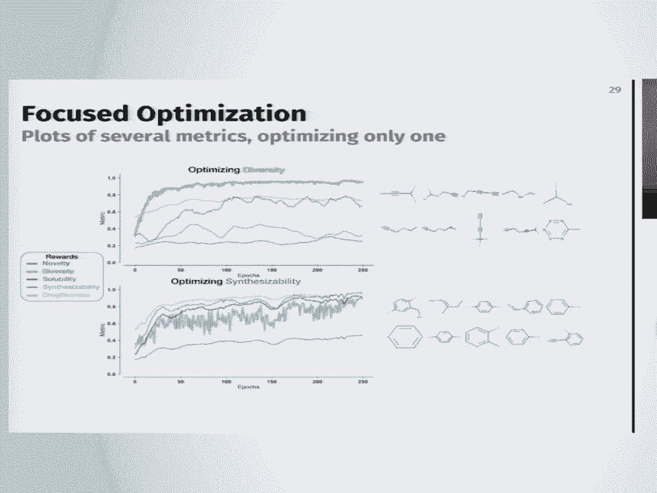
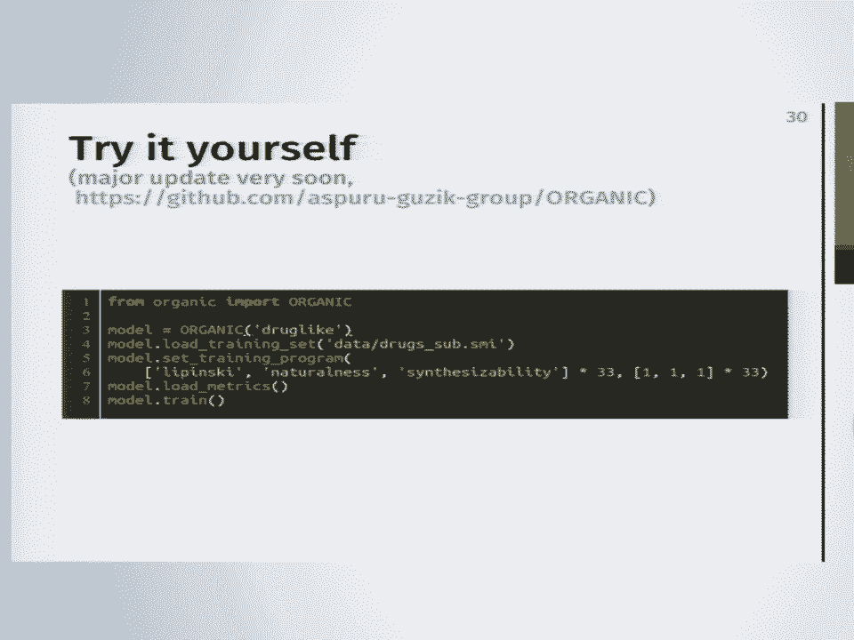
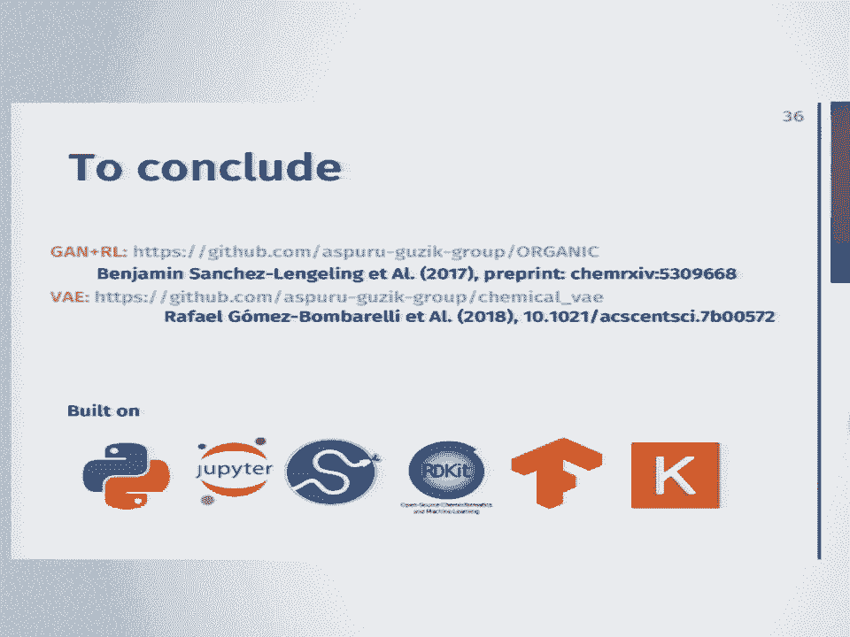
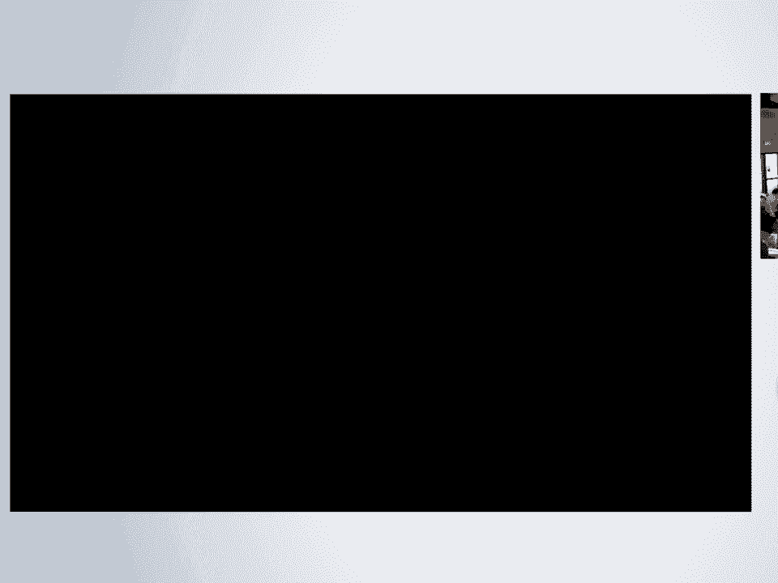
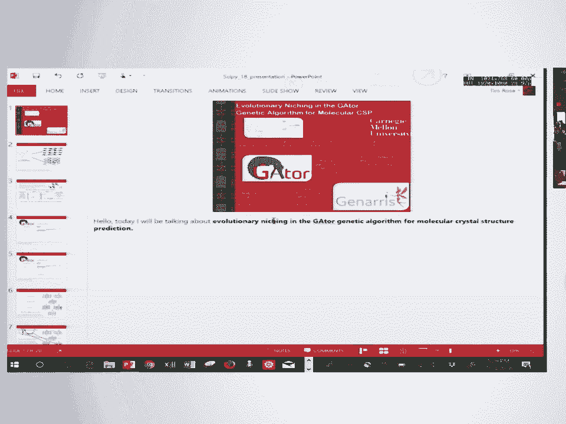

# 22：使用深度生成模型探索分子空间 🧪

在本课程中，我们将学习如何利用深度生成模型来探索广阔的分子空间，并实现逆向分子设计。我们将重点介绍两种核心模型：生成对抗网络和变分自编码器，并解释它们如何帮助我们从海量的可能性中寻找具有特定性质的分子。

## 概述：分子空间与逆向设计

分子空间极其庞大，据估计可能存在10^23到10^80种可能的分子，我们无法一一枚举。传统的“正向”方法是给定一个分子，通过实验或模拟来测量其性质。而“逆向设计”则恰恰相反：我们从一个期望的性质出发，去寻找能实现该性质的分子。这是一个复杂的优化问题，因为性质空间的地形通常是未知且复杂的。

## 分子表示：SMILES字符串

要将分子输入机器学习算法，首先需要将其数字化。分子表示是一个开放性问题，有多种方式。本课程中，我们使用一种简单的文本表示法：**SMILES字符串**。SMILES将分子的连接图（基于共价键规则）编码为一串字符。

例如，阿司匹林的SMILES字符串为：`CC(=O)Oc1ccccc1C(=O)O`。字符串的每个部分对应分子图的一部分。SMILES有其语法规则，但并非所有字符串都对应有效的真实分子。

## 生成模型 vs. 判别模型

在机器学习中，我们通常接触的是**判别模型**，用于分类（如判断分子是否有毒）或回归（预测性质）。其核心是找到一个决策边界或拟合线。

**生成模型**则试图对分子的概率分布进行建模。其核心思想是，我们可以从学到的分布中采样，从而生成全新的分子。生成模型通常更复杂，因为它需要学习整个数据分布，而不仅仅是区分它们。

## 第一部分：生成对抗网络与强化学习 🎭

上一节我们区分了生成与判别模型，本节中我们来看看如何结合两者来“创造”分子。生成对抗网络的核心思想是让两个神经网络相互博弈。

### GAN的基本原理：警察与小偷游戏

想象一个“警察”和一个“伪造者”（小偷）的游戏：
*   **判别器（警察）**：它的目标是区分真实数据（如已知分子）和伪造数据。它只能看到真实数据作为参考。
*   **生成器（伪造者）**：它的目标是生成足以骗过判别器的伪造数据。

游戏开始时，生成器可能生成非常糟糕的分子。但随着训练进行，判别器努力变得更好以识别假货，生成器也努力变得更好以制造更逼真的假货。理想情况下，两者共同进步，最终生成器能产生与真实数据分布高度相似的样本。

在数学上，这通常被表述为一个极小极大博弈问题：
`min_G max_D V(D, G) = E_{x~p_data(x)}[log D(x)] + E_{z~p_z(z)}[log(1 - D(G(z)))]`
其中，`G`是生成器，`D`是判别器，`z`是随机噪声输入。

### 结合强化学习优化特定性质

我们可能不只想生成“像药物”的分子，还想优化其特定性质（如溶解度、合成难度）。这些性质可能来自模拟或实验，不易直接融入GAN的损失函数。这时可以引入**强化学习**。

我们使用**策略梯度**方法。当模型生成一个不完整的SMILES字符串时，我们无法给出奖励，因为分子尚未完成。解决方法之一是进行蒙特卡洛树搜索：对多种可能的完成路径进行随机探索，然后根据最终分子的性质给予奖励或惩罚。模型从而学习到鼓励生成具有良好性质分子的行为梯度。

### 实践与应用

以下是使用该框架进行多目标优化的简化代码示例：

```python
# 伪代码示例
from deepchem.models import GAN
import rewards # 用户定义的性质计算函数

# 定义生成器和判别器
generator = RNNGenerator(...)
discriminator = RNNDiscriminator(...)



# 创建GAN模型
gan = GAN(generator, discriminator, ...)



# 定义优化目标（奖励函数）
reward_functions = [rewards.lipinski, rewards.synthesizability, rewards.QED]

# 训练循环
for epoch in range(num_epochs):
    # 1. GAN对抗训练
    gan.train_gan(batch_of_real_smiles)
    # 2. 策略梯度强化学习，使用奖励函数引导生成
    gan.apply_reinforcement(reward_functions)
```

通过这种方式，我们可以从初始的分子数据分布出发，得到一个新的、性质向目标方向偏移的分子分布。例如，优化熔点可能得到带有芳香环和长链的有机分子；优化多样性可能得到结构奇特但不稳定的分子；而优化可合成性则可能得到更保守、实用的类药物分子。

## 第二部分：变分自编码器 🔄

上一节我们介绍了通过对抗博弈生成分子的方法，本节我们看看另一种强大的生成模型——变分自编码器，它通过学习分子的连续潜在空间来实现生成和优化。

### VAE的核心思想：编码与解码

变分自编码器旨在为数据找到一个可逆的向量表示（潜在空间）。
*   **编码器**：将输入分子（如SMILES字符串）映射到一个潜在向量 `z`，`z` 通常服从标准正态分布。
*   **解码器**：将潜在向量 `z` 解码，试图重建原始分子。



这两个网络同时训练，目标是最小化重建误差，并让潜在空间的分布接近标准正态分布（通过KL散度正则化）。其损失函数通常为：
`Loss = Reconstruction_Loss + β * KL_Divergence(q(z|x) || p(z))`
其中，`q(z|x)`是编码器给出的分布，`p(z)`是标准正态分布。

### 潜在空间的几何与性质导航

由于分子被表示为连续空间中的点（向量），我们可以进行几何操作：
1.  **最近邻搜索**：对于布洛芬分子，在潜在空间中微小半径内找到的分子与其结构相似；半径越大，找到的分子越随机。
2.  **插值**：在两个已知分子（如两种FDA批准药物）的潜在向量间进行线性插值，可以得到一系列结构平滑过渡的中间分子。

更重要的是，我们可以将分子性质（如logP，代表溶解性）作为训练目标之一。这样，潜在空间就会被性质“塑造”。在潜在空间中，性质值可能呈现梯度方向。例如，logP值可能沿某个特定方向递增。

### 在潜在空间中进行优化

一旦潜在空间被性质塑造，优化就变成了在向量空间中的导航问题。我们可以从某个分子点出发，沿着性质改善的方向（梯度方向）移动，解码后即可得到性质更优的新分子。

例如，从一个“类药性”和“可合成性”都很差的分子出发，在潜在空间中沿优化方向移动，最终可以得到一个在这些指标上表现更好的分子结构。但需要注意的是，这些指标（如QED, SAS）是针对类药物分子设计的，应用于其他领域时需要重新评估其适用性。

## 总结与未来方向

本节课中我们一起学习了两种用于探索分子空间的深度生成模型：生成对抗网络和变分自编码器。GAN通过对抗博弈学习生成逼真分子，并结合强化学习优化特定性质；VAE则通过学习一个连续、结构化的潜在空间，实现分子的平滑插值和基于梯度的性质优化。





这些工作建立在开源软件（Python, RDKit）和活跃的社区之上。未来的发展方向包括：改进分子表示（如直接使用图结构而非SMILES）、整合更强大的网络架构（如注意力机制、Transformer）、以及纳入三维几何信息等。这些工具并非魔术，其成功最终取决于数据的质量、性质评估模型的准确性，以及人类的创造性使用。它们更像是强大的“分子搜索引擎”或灵感生成器，辅助科学家在浩瀚的分子宇宙中发现新大陆。