# 24：Parsl - 在Python中实现可扩展的交互式计算 🚀

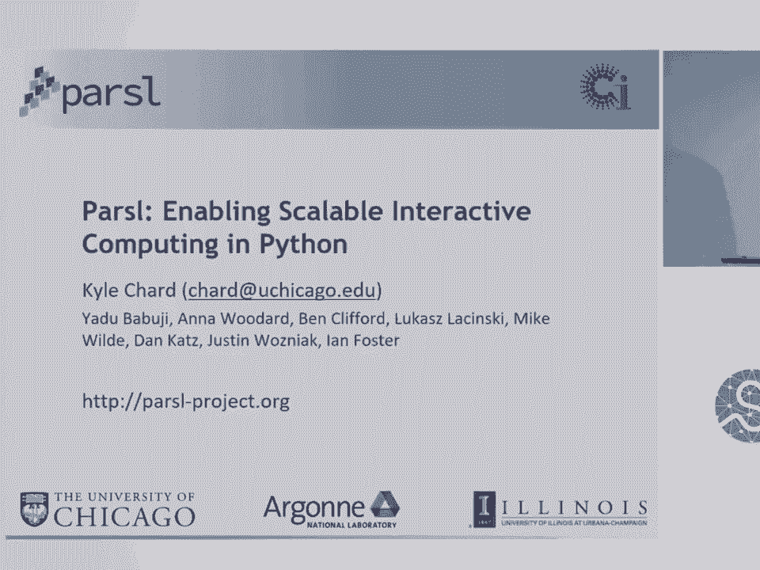

在本节课中，我们将学习Parsl，一个用于在Python中构建和执行并行数据流工作流的库。我们将了解它的核心概念、工作原理以及如何用它来简化跨不同计算环境（从个人电脑到超级计算机）的复杂计算任务。

---

## 概述

Parsl（并行脚本库）是一个基于Python的库，旨在支持开发基于数据流的工作流。它允许用户通过简单的装饰器标记函数，使其能够在满足数据依赖关系的前提下并行执行。Parsl的核心目标是让并行编程变得直观，同时保持与Python生态系统的紧密集成。

---

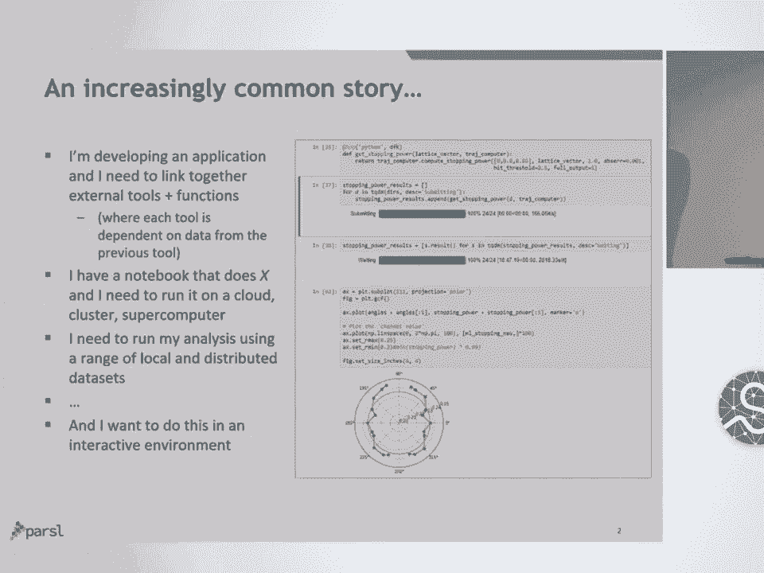

## 研究背景与需求

上一节我们介绍了Parsl的基本概念。在深入其技术细节之前，让我们先了解一下催生Parsl的研究背景和实际需求。

在我们的工作中，我们接触到来自生物医学、材料科学、社会科学和考古学等不同领域的研究人员。我们注意到他们对网络基础设施和分布式计算环境的需求存在一些共同点：

*   **应用集成需求**：开发者需要构建能够无缝链接多个外部工具（如基因组分析、材料属性计算）的应用程序，并使用Python等语言将这些步骤粘合在一起。他们通常需要的是数据流类型的概念，即一个应用的执行依赖于前一个应用产生的数据。
*   **笔记本扩展需求**：许多用户拥有在本地笔记本电脑上运行良好的Jupyter Notebook，但希望将其扩展到超级计算机上运行，这通常非常困难。
*   **大数据处理需求**：用户需要在本地用小型数据集测试应用程序后，能够无缝地处理位于远程计算中心（如NERSC）的TB甚至PB级大型数据集。
*   **交互式计算需求**：用户希望以交互方式进行分析，而不是编写脚本后提交到超级计算机排队等待，他们希望实时地与数据和计算过程进行交互。

---

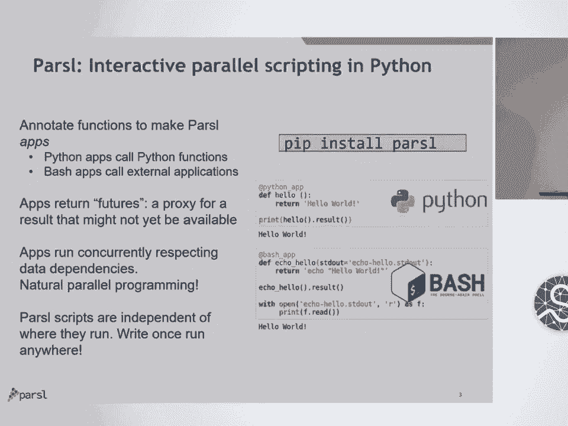

## 什么是Parsl？

上一节我们了解了用户的需求，本节中我们来看看Parsl是如何设计来满足这些需求的。

Parsl是一个纯Python库，它通过两个主要构件来支持数据流工作流的开发：

1.  **Python App**：任何普通的Python函数，通过装饰器标记后即可并行运行。
2.  **Bash App**：使用Bash来调用外部应用程序、脚本或二进制文件。

这些App返回的是 **Future对象**。Future是结果的代理，代表一个将在未来某个时刻可用的值。Parsl允许这些App并发执行。用户只需用普通的Python代码（如循环）将这些App串联起来，Parsl便会自动处理依赖关系，将任务分发到计算资源上并行执行，无需用户处理底层的任务编排细节。

Parsl的一个关键优势是 **执行位置无关性**。同一个Parsl脚本可以在你的笔记本电脑上使用线程运行，也可以扩展到集群上使用Pilot作业模型运行，甚至可以借助团队开发的极端规模调度框架在更大规模的系统上运行。

---

## 工作流的应用场景

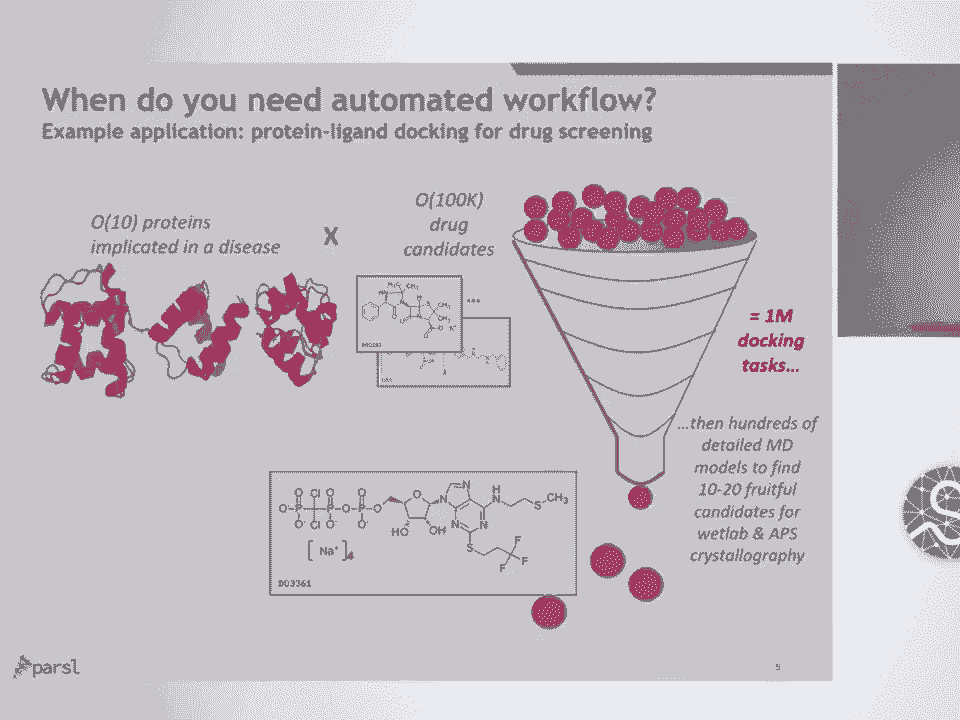

Parsl的设计理念源于对现代科学工作流多样性的认识。工作流不再局限于传统的高性能计算（HPC）或高吞吐量计算（HTC）模式。

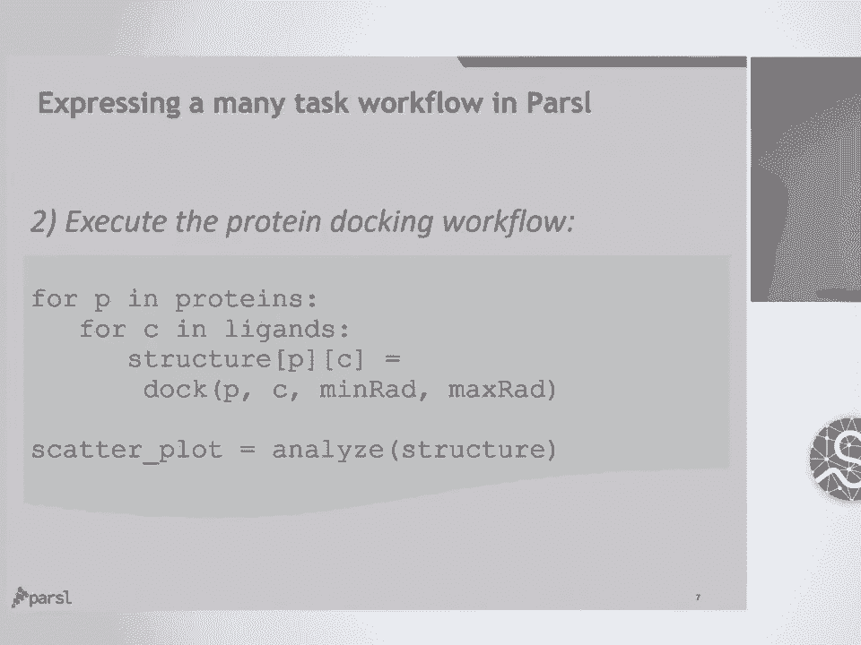

以下是Parsl适用的几个典型场景：

*   **在线计算**：例如，从大型科学仪器（如光源）快速获取数据，并进行实时分析以指导实验、进行质量控制或初步分析，为研究人员提供即时反馈。
*   **机器学习工作流**：涵盖数据预处理、参数扫描、超参数调优等步骤。在预测阶段，通常涉及高度并行的预测任务，例如对N×M的材料矩阵运行预测模型。
*   **交互式计算**：这正是Parsl的核心应用场景之一。它允许用户在Jupyter Notebook等交互环境中迭代分析，并将计算任务动态地分发到更大的计算资源上。例如，一个学生教育项目让学生在学校部署探测器收集数据，并在Notebook中结合本地数据和在线发布的数据进行分析。

---

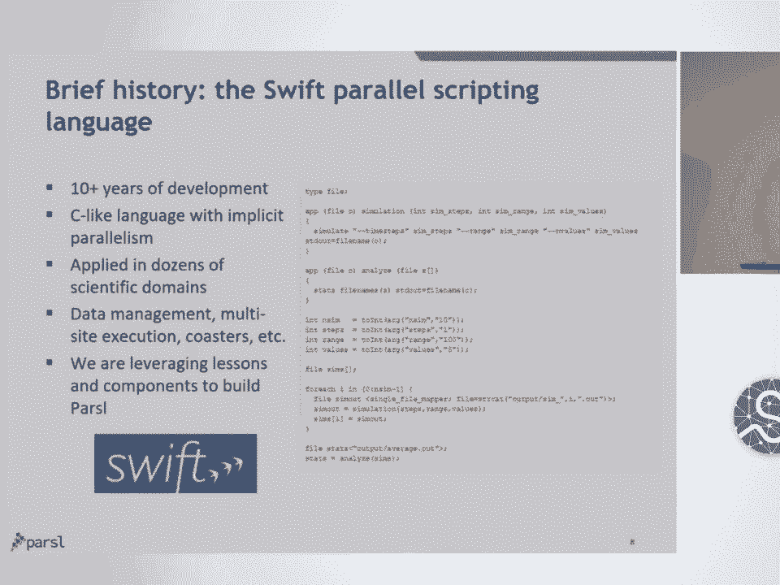

## 一个简单的Parsl脚本示例

了解了Parsl的应用场景后，让我们通过一个具体例子来看看Parsl脚本长什么样。

一个常见的“令人尴尬的并行”问题是蛋白质-药物分子对接。假设我们有一些与疾病相关的蛋白质和大量潜在的候选药物分子，我们需要分析所有候选分子与所有蛋白质的相互作用，以找出最有潜力的进行后续生物实验。

以下是如何用Parsl实现：

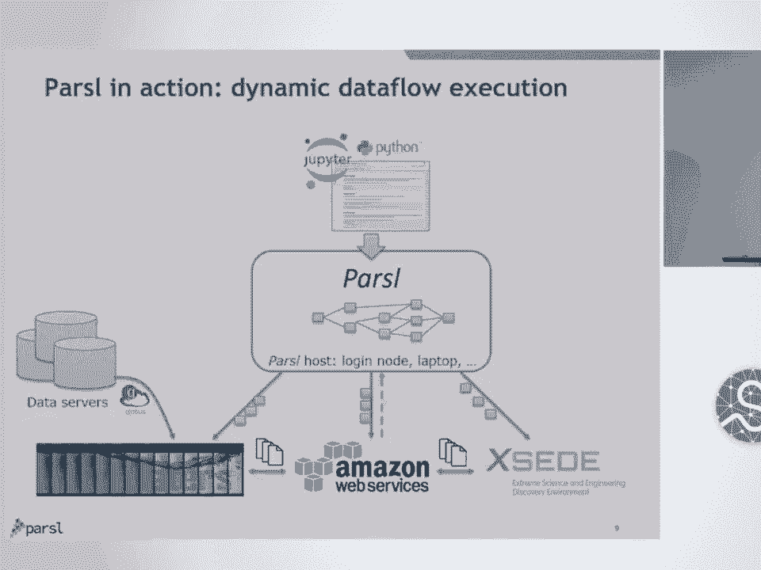

```python
# 定义一个Bash App来封装外部对接程序
@bash_app
def docking(protein, ligand, stdout='docking.out'):
    return f'run_docking_tool {protein} {ligand}'

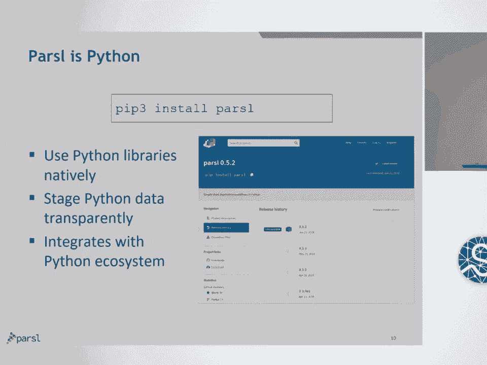

# 假设 proteins 和 ligands 是两个列表
futures = []
for protein in proteins:
    for ligand in ligands:
        # 提交对接任务，每个任务返回一个Future
        future = docking(protein, ligand)
        futures.append(future)

# 等待所有任务完成并获取结果（如果需要）
# results = [future.result() for future in futures]
```

在这个例子中，`docking` 函数被装饰为一个Bash App。我们通过两层循环遍历所有蛋白质和配体的组合，每个组合都会异步提交一个对接计算任务。Parsl会自动管理这些任务的依赖（本例中无依赖）和调度。

---

## Parsl的设计演进

Parsl并非凭空产生，它源于团队在并行工作流领域超过十年的经验。

早期，团队开发了一种名为 **SWIFT** 的隐式并行脚本语言。它使用一种类C的领域特定语言（DSL）来表达工作流，所有变量赋值和应用调用都是隐式并行的，并由系统在幕后处理数据管理和依赖关系。

Parsl 的核心理念是将 SWIFT 的能力更贴近用户。它没有要求用户学习一门新的类C语言，而是允许用户用 **Python** 以最小的改动来表达工作流，使得并行编程更加自然和易于接受。

---

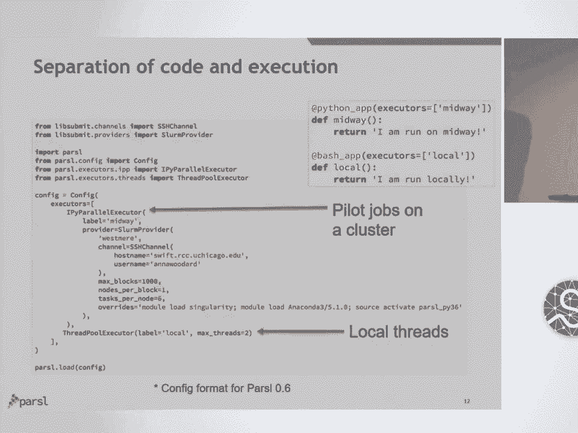

## Parsl的工作原理

与许多需要预先定义完整任务图的工作流系统不同，Parsl采用了一种 **动态图模型**。

其工作流程如下：
1.  用户在一个Python脚本（可能在Jupyter中）中定义Apps并调用它们。
2.  Parsl运行时开始动态构建一个执行图（DAG）。每个App作为一个节点加入图中，其依赖关系由前驱App产生的数据（Future）决定。
3.  一旦某个App的所有依赖都满足（或本无依赖），它就会被立即推送到配置好的执行资源（如本地线程、远程集群、云资源）上执行。
4.  任务执行完成后，结果返回，并触发依赖于此结果的下游任务开始执行。
5.  整个过程可以涉及跨域的数据传输，Parsl会透明地处理数据从存储资源到计算资源的转移。

这种动态性使得工作流可以根据中间结果生成新的任务，非常适合交互式和探索性分析。

---

## Parsl的核心特性与优势

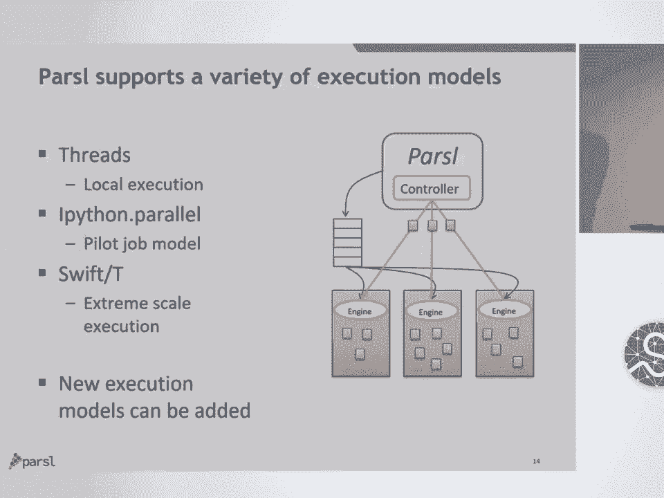

接下来，我们将详细探讨Parsl的几个核心特性和优势，这些特性使其成为一个强大而灵活的工具。

### 1. 纯Python与易用性

Parsl是纯Python库，可以通过 `pip` 直接安装。用户只需在现有函数上添加装饰器，即可将其转换为并行App。Parsl会自动处理Python对象的序列化和传输，用户无需大幅修改现有代码。

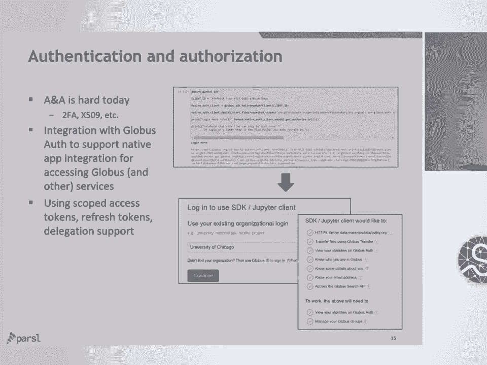

### 2. 执行提供者无关性

Parsl脚本与底层计算资源解耦。通过配置文件，同一脚本可以运行在多种环境上：
*   **本地线程**
*   **集群调度器**（如SLURM, PBS, Condor）
*   **云资源**（如AWS Batch, Google Cloud）
*   **超级计算机**（通过Pilot作业或Swift/T模型）

Parsl团队还提取了与调度器通信的代码，发布为独立的 **LibSubmit** 库，方便他人使用。

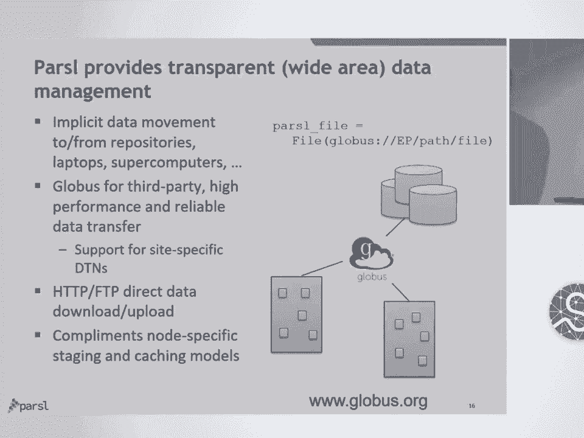

### 3. 灵活的配置与资源映射

用户通过一个配置文件来定义执行资源。一个配置可以包含多个“执行器”，例如同时使用一个远程集群执行器和一个本地线程执行器。

用户可以在App定义时通过装饰器参数指定其偏好的执行资源类型（如GPU、CPU或线程）。这有助于将任务调度到合适的硬件上，或通过“协同定位”提示来减少任务间大量数据的传输开销。

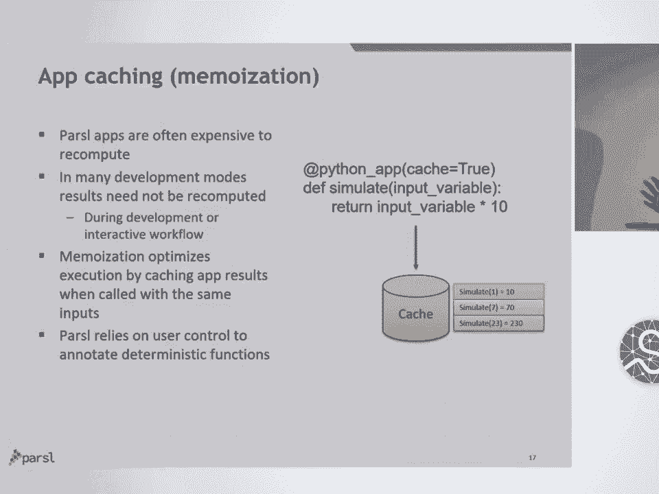

### 4. 扩展Jupyter Notebooks

Parsl能很好地与Jupyter Notebook集成。用户可以在Notebook中像平常一样编写代码，用Parsl装饰器标记需要并行化的函数，然后直接从Notebook内部将任务提交到远程大型计算资源。Parsl还支持在Notebook中可视化动态的任务执行图。

### 5. 多种执行模型

Parsl支持多种任务执行模式，以适应不同规模和特点的计算资源：
*   **线程执行器**：在单机多线程上运行任务。
*   **Pilot作业模型**：先向集群队列提交一个“领航作业”，该作业申请一批计算节点并部署工作进程，然后Parsl将大量小任务直接派发给这些工作进程，避免了为每个小任务单独排队。
*   **Swift/T极端规模模型**：一种去中心化的MPI作业调度模型，适用于需要填满整台大型超级计算机（如petascale级）的场景，能够实现极高的任务吞吐率。

### 6. 集成的认证与授权

为了简化访问大型计算资源的复杂性，Parsl集成了 **Globus Auth**（一种基于OAuth 2的认证授权系统）。这有助于管理访问远程资源和服务的令牌，减少用户处理双因素认证、X.509证书等繁琐步骤。

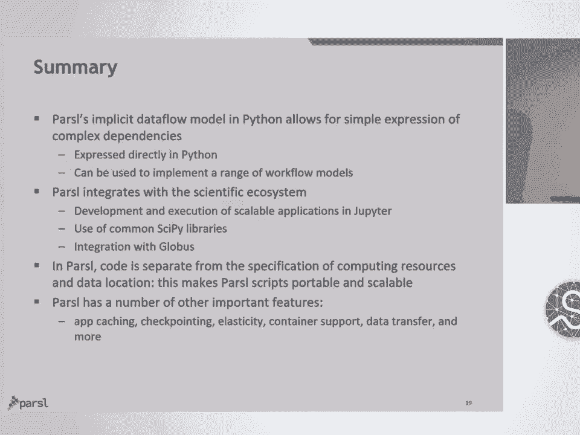

### 7. 透明的广域数据管理

Parsl抽象了数据位置。用户可以定义一个 `parsl.File` 对象，它可以是本地文件、通过Globus访问的远程文件，或是HTTP/FTP资源。Parsl会在任务执行时自动、透明地将所需的数据从存储地传输到计算资源，任务完成后也可将结果传输回来。这打破了计算任务对特定机器上特定数据的依赖。

### 8. 应用缓存与检查点

为了避免重复计算和应对意外失败，Parsl提供了 **应用缓存**（类似函数记忆化）功能。启用缓存后，Parsl会记录函数调用的参数和结果。当相同的调用再次发生时，直接返回缓存的结果，而不是重新执行可能耗时很长的任务。这对于交互式开发（防止误操作重复提交）和构建容错的工作流（支持从检查点重启）非常有用。

---

## 生产级应用案例

Parsl已被用于多个领域的生产级科学应用中，例如：
*   **机器学习**：预测电子在材料中的阻止本领。
*   **生物信息学**：基因组分析工作流。
*   **材料科学**：与阿贡国家实验室APS光源相关的分析。
*   **天体物理学**：作为大型综合巡天望远镜（LSST）暗能量巡天项目科学分析工作流的基础框架，旨在让更广泛的用户群体能够运行和扩展这些分析。

---

## 总结

本节课我们一起学习了Parsl，一个强大的Python并行脚本库。我们来回顾一下核心要点：

1.  **核心理念**：Parsl提供了一个基于Python的隐式数据流编程模型，让用户能够以直观、简洁的方式表达复杂的并行应用，无需学习新语言。
2.  **关键优势**：
    *   **执行与数据位置无关**：脚本高度可移植，不锁定特定计算或数据资源。
    *   **与科学生态集成**：紧密集成Python、Jupyter、Globus等现代科学计算工具。
    *   **支持多样式工作流**：适用于交互式计算、机器学习、传统HPC/HTC等多种模式。
3.  **丰富功能**：除了课程中详细讲解的特性，Parsl还支持弹性伸缩、容器化、检查点等高级功能。

Parsl通过降低分布式并行计算的门槛，使研究人员能更专注于科学问题本身，而非底层计算设施的复杂性。

---
**相关资源**
*   项目网站：<https://parsl-project.org/>
*   代码仓库：<https://github.com/Parsl/parsl>
*   尝试Parsl：可通过网站提供的Binder链接在线体验。

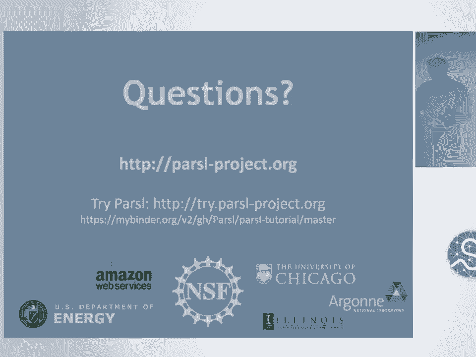

*感谢美国国家科学基金会（NSF）、能源部（DOE）以及相关机构的支持。*