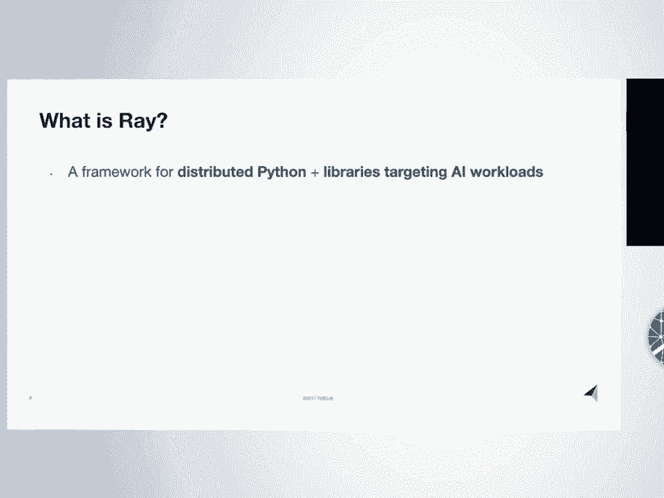
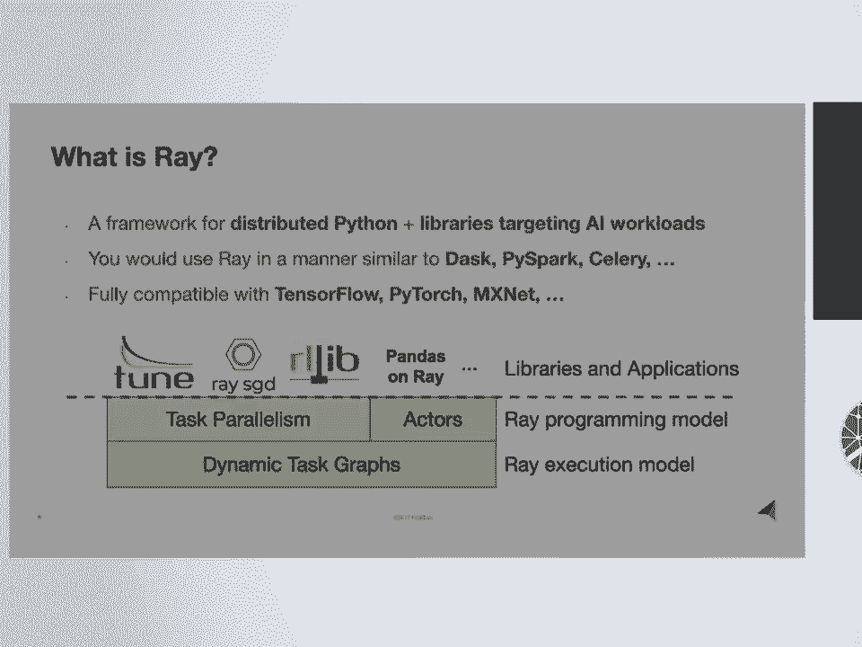
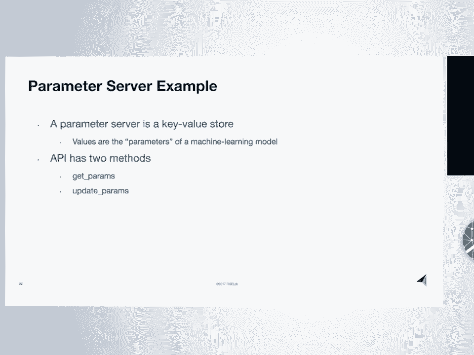
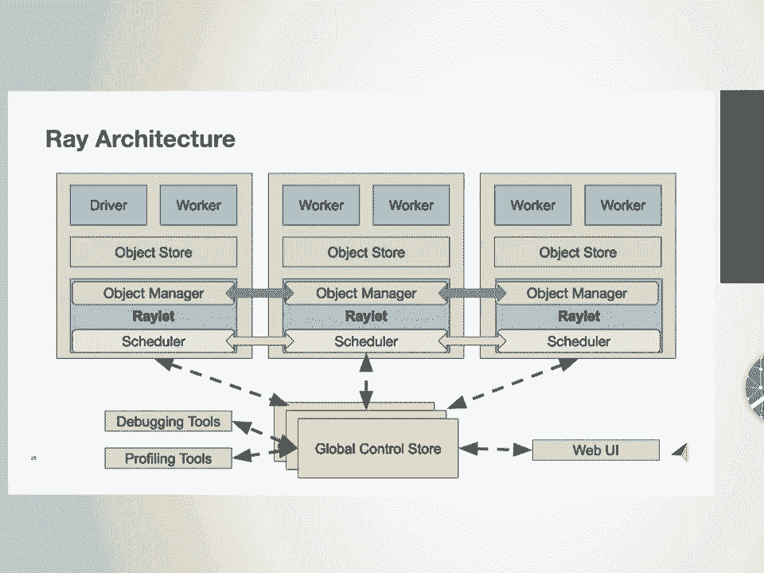
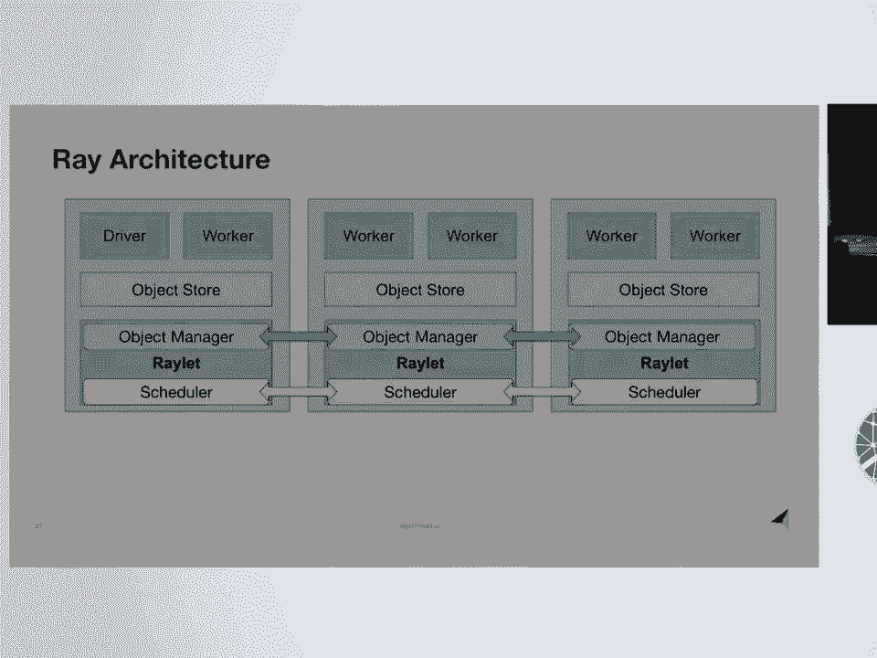
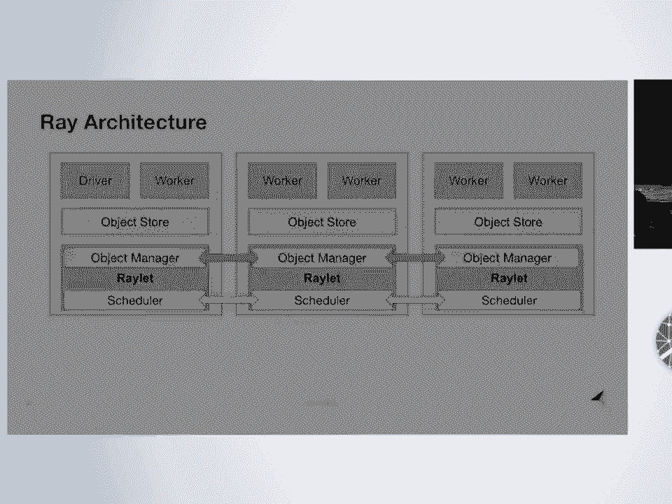
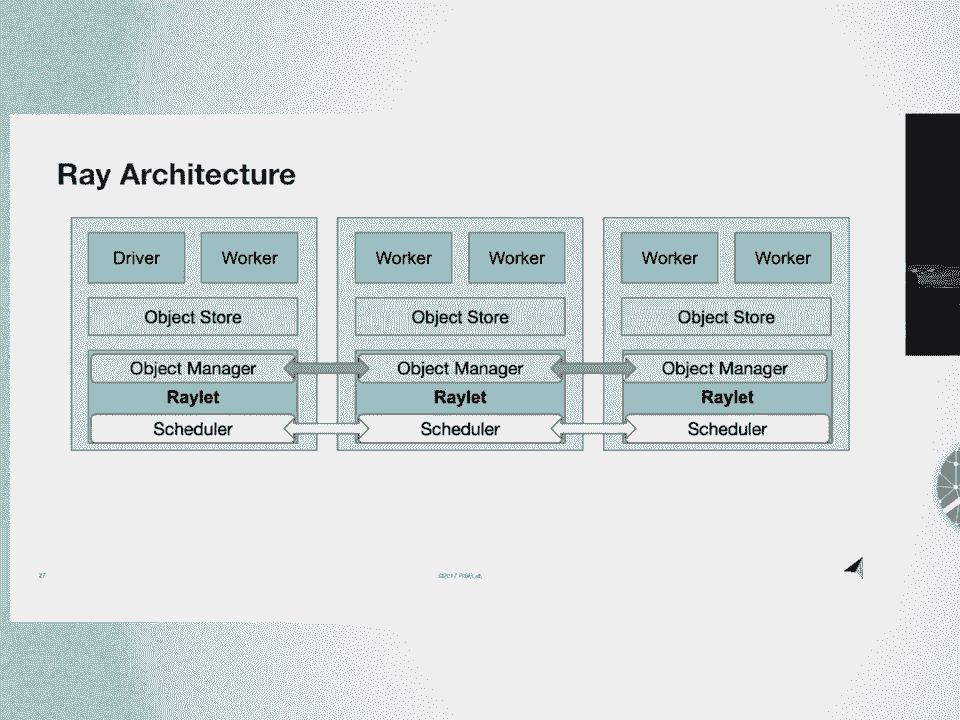
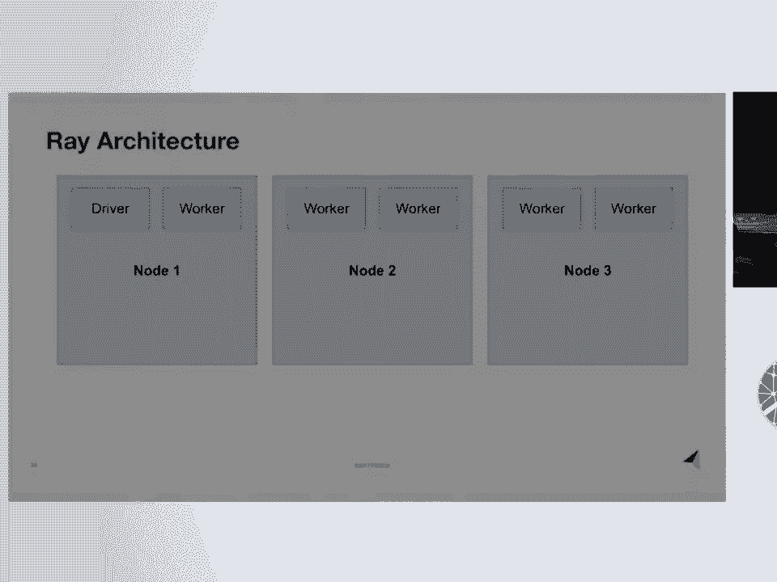

# 26：Ray - 一个用于AI的分布式执行框架 🚀

## 概述

在本节课中，我们将要学习 Ray，这是一个由加州大学伯克利分校开发的通用并行与分布式 Python 框架。Ray 特别针对机器学习工作负载，旨在解决研究和实践中遇到的痛点。我们将了解 Ray 的核心概念、API 以及它如何与现有生态系统集成。



---

## Ray 是什么？



Ray 是一个用于执行并行和分布式 Python 的通用框架，并附带一系列针对机器学习工作负载的库。这里的机器学习工作负载包括超参数搜索、强化学习和分布式训练等。

Ray 的使用方式类似于 Dask、PySpark 或 Celery。它是一个执行引擎，负责调度和执行任务。在机器学习生态系统中，Ray 与 TensorFlow 和 PyTorch 等深度学习框架完全兼容。典型的应用会同时使用 Ray 和 TensorFlow，用 TensorFlow 定义神经网络，然后用 Ray 来分发和调度计算。

以下是 Ray 不同层次的示意图：


---

## 为什么需要构建新系统？

上一节我们介绍了 Ray 的基本定位，本节中我们来看看其诞生的背景。答案是，我们今天面临着一种新的工作负载。今天的机器学习代表了与以往批处理数据分析不同的工作负载类型，例如 DeepMind 的 AlphaGo 或 OpenAI 的 DOTA。这些应用对性能有新的、通常非常苛刻的要求。

机器学习应用非常多样化。为了全面支持它们，需要一个非常通用的系统。仅仅处理机器学习训练是不够的，还必须处理模型服务、数据处理、流数据等。

在与 DeepMind、OpenAI 或 Facebook AI 等机构交流时，我们反复看到的模式是：现有系统无法满足这类应用的需求。因此，他们经常为每个应用构建自己的基础设施或工具，以获得所需的灵活性或性能。这表明，需要一个能够高效支持这类应用的通用系统。

---

## Ray 项目现状

在深入探讨 Ray 的工作原理之前，需要说明它是一个开源项目。我们的目标是将其发展为一个开源项目。它还是一个相对年轻的项目，但发展迅速，贡献者数量不断增加。大约一年前我们发布了第一个版本，现在刚刚发布了 0.5 版本。在不同规模的公司中，生产用例也在增长。

我们来到这里的原因之一是寻找新的用例以及新的贡献或合作方式。如果这个项目要成功，它需要与 Python 生态系统和开源生态系统的其他部分无缝集成。

---

## Ray API 详解

现在让我们详细了解一下 Ray 的 API。以下是两个 Python 函数示例：

```python
import ray

@ray.remote
def function_a():
    return 1

@ray.remote
def function_b():
    return 2

@ray.remote
def function_c(a, b):
    return a + b
```

细节并不重要，它们只是示例函数。当我添加 `@ray.remote` 装饰器时，现在我可以使用 `.remote()` 来调用这些函数。这样做会立即以非阻塞方式返回一个 future，并创建一个由后端调度和执行的任务。

你可以看到正在创建一个依赖关系图。第三个任务 `function_c` 依赖于前两个任务，因为前两个任务的 future 作为参数传递给了第三个任务。前三行都是非阻塞的。然后，如果你想阻塞并等待计算完成并检索结果，可以调用 `ray.get()`。



这就是 API 中任务并行部分的样子。这已经非常强大，你可以用它做很多事情。

但是，仅凭我目前描述的内容，你无法拥有在多个任务之间共享的可变状态。这对于机器学习应用很重要，例如神经网络的权重、模拟器的状态或与现实世界交互的封装。

我们通过**参与者（Actor）抽象**来处理这个问题。以下是一个常规的 Python 类：

```python
@ray.remote
class Counter:
    def __init__(self):
        self.value = 0

    def increment(self):
        self.value += 1
        return self.value
```

它只是一个从零开始计数的计数器。当我们用 `@ray.remote` 装饰它时，现在实例化其中一个计数器对象会在集群中的某个位置创建一个新的进程（一个新的参与者）。然后，对参与者句柄的方法调用（这些 `c.inc` 调用）会转换为任务，并在参与者进程上**串行**调度和执行。

方法调用可以来自创建参与者的进程，也可以来自其他进程甚至其他应用程序，但它们都在参与者进程上执行。同样，这些方法调用返回 future，我们可以用 `ray.get()` 检索它们。

以下是这两个脚本的两个动态任务图。我将它们作为 API 的两个独立部分来介绍，但实际上它们非常统一，因为它们共享这个动态任务图抽象，你可以在任务中使用参与者，反之亦然。

---

## 实践示例：构建参数服务器

现在，我将快速举例说明如何使用 Ray 做一些有趣的事情，比如构建一个参数服务器并进行分布式训练。

对于那些不熟悉参数服务器术语的人来说，它基本上是一个键值存储，其中的值是机器学习模型的参数（可以是神经网络、线性模型等）。参数服务器抽象主要提供两种方法：一种是获取最新参数，另一种是更新参数。

现在我将展示如何在 Python 中使用 Ray 实现这一点。

以下是实现步骤：

首先，导入必要的模块并初始化 Ray。

```python
import ray
import time
import numpy as np

ray.init()
```

接下来，定义一个参数服务器类。

```python
@ray.remote
class ParameterServer:
    def __init__(self, dim):
        # 初始化参数为零向量
        self.params = np.zeros(dim)

    def get_params(self):
        return self.params

    def update_params(self, grad):
        # 将梯度加到参数上（这里是一个简单的更新规则）
        self.params += grad
```

要将其转换为 Ray 参与者，可以添加 `@ray.remote` 装饰器。现在实例化它会创建一个新的进程。可以通过 `ps.get_params.remote()` 调用其方法，这会返回一个 future。调用 `ray.get()` 可以实际获取值。

现在，假设我想启动一些计算梯度并更新这些参数的工作进程。我可以用另一个参与者或远程函数来实现。

定义一个与参数服务器交互的 Python 函数：

```python
@ray.remote
def worker(ps, iterations=100):
    for _ in range(iterations):
        # 1. 获取最新参数
        params = ray.get(ps.get_params.remote())
        # 2. 计算梯度更新（此处为模拟）
        grad = np.random.randn(*params.shape) * 0.1
        # 模拟计算时间
        time.sleep(0.01)
        # 3. 更新参数
        ps.update_params.remote(grad)
```

定义了这个与参数服务器交互的工作进程后，我可以启动几个工作进程：



```python
# 创建参数服务器
ps = ParameterServer.remote(10)


# 启动两个工作进程
worker_tasks = [worker.remote(ps) for _ in range(2)]
```

这启动了这些工作进程任务，它们正在训练并与参数服务器交互。现在，如果我回到参数服务器并获取参数，可以看到它们正在后台更新。

我们在这里所做的是：启动了一个参数服务器进程，然后启动了两个工作进程任务，它们获取参数服务器句柄，并在获取参数和更新参数之间迭代。然后我们启动了这两个工作进程，让它们在后台运行并更新参数。

这之所以强大，是因为参数服务器通常是作为一个独立的系统实现和发布的，类似于数据库或键值存储。而在这里，我们能够用十几行 Python 代码实现一个参数服务器。因为我们自己实现了它，所以它的可配置性更高。

---

## Ray 架构简介

上一节我们通过示例了解了 Ray 的 API，本节中我们来看看其后台架构。每个灰色框代表一台物理机器，这里有三台机器。与许多 Python 库一样，后端主要用 C++ 编写，并有一个薄的 Python API。

这里的 worker 是执行任务的 Python 进程。driver 也是一个 Python 进程，这是运行你的脚本的应用程序。你可以在同一个集群中运行多个驱动程序和多个应用程序。

在每台机器上，都有一个共享内存对象存储。这是作为 Apache Arrow 的一部分正在开发的东西。它对于我们能够获得的性能至关重要，因为它允许同一台机器上的所有工作进程访问相同的数据，而无需反序列化或创建副本。

我们有一个对象管理器，负责在机器之间流式传输对象。每台机器还有一个调度器。我们采用分布式调度方法，因为对于需要每秒数百万任务的高任务吞吐量的应用，集中式调度器往往会成为瓶颈。

另一个我想强调的部分是我们的全局控制存储。这是一个分片的内存键值存储数据库，用于保存系统的控制状态和元数据（例如任务规范和任务依赖关系），可用于在机器故障时重建丢失的对象等。这对于构建调试和分析工具也非常重要，因为系统的控制状态存在于数据库中，你可以在运行时或事后查询该数据库以了解情况。

这就是架构的大致情况。

---

## 高级库与生态系统

上一节介绍了 Ray 的核心 API 和架构，本节中我们来看看构建在该核心系统之上的高级库。

其中之一是 **Pandas on Ray**，它是 Modin 项目的一部分。该项目的目标是通过仅更改一行代码（即导入语句）来加速你的 Pandas 工作负载。

我们还在强化学习和超参数调优方面拥有最先进的实现库。如果你有超参数调优或强化学习应用，我建议你查看这些库。

另一项非常初步的工作是，我们正在开发一个用于分布式训练的库。这基本上是使用 Ray 后端来实现一个快速的全归约操作，其性能可与 MPI 全归约相媲美，但建立在 Ray API 之上。这正被用来在 Ray 之上构建一个易于使用的分布式训练库。目前这还是一项非常初步的工作。





这些是我们正在开发的一些库，我们希望继续充实这个生态系统，涵盖机器学习流程的各个方面，从数据接收到模型服务。

---



## 与其他开源项目的关系



现在我想谈谈 Ray 与其他开源项目和开源生态系统的关系。

我们大量使用 **Apache Arrow**。Arrow 一直对我们能够获得的性能至关重要。Arrow 是我们用来存储数据的底层数据序列化格式。这使我们能够实现几个最初作为 Ray 一部分开发的组件，现在已贡献给 Arrow，并由更大的人群在 Arrow 中开发，也被其他项目用作独立的项目。

这包括我们用来在同一台机器的多个工作进程之间通过共享内存访问数据的共享内存对象存储。另一个是我们的零拷贝序列化库，它将任意 Python 对象映射到 Arrow 格式并从中映射出来。这意味着，如果你有一个字符串到 NumPy 数组（如神经网络权重）的字典等，你可以将它们放入对象存储中，使用 Arrow 序列化它们，然后在另一个进程中即时取出。

另一个我想提到的是，我们也初步支持 Java。如果你是一名 Java 开发人员，并且有兴趣通过 Java 尝试 Ray，你应该查看一下。这是一个外部贡献，稍后 Arrow 将实现 Python 和 Java 之间更多的互操作性，因为底层数据布局是语言无关的。

---

## 总结与问答

本节课中我们一起学习了 Ray，一个用于并行和分布式 Python 的通用框架。我们非常关心机器学习和 AI 工作负载，这些工作负载真正推动了我们的性能要求和设计决策。它是一个令人兴奋的开源项目，我们正在寻找新的合作方式、新的用例，并希望得到大家的反馈。

---

## 问答环节

以下是演讲后观众提出的一些问题及其解答：

**问题 1：关于动态协程**
*问：你提到了可以创建动态任务图。那么，在多大程度上可以创建动态协程？例如，让协程调用其他 Ray 协程？*
答：你当然可以从另一个远程函数或参与者方法内部调用远程函数或参与者方法。我不知道这是否正是你的意思。关于创建循环回自身的动态图，你可以让一个远程函数递归地调用自身。例如，你可以递归地实现阶乘。是的，有这种能力。

**问题 2：关于故障处理**
*问：你提到了故障转移，但没有详细说明。能否简要解释一下，当其中一个节点宕机时，你们对故障的想法？对于有状态的参与者，你们会怎么做？*
答：处理机器故障非常重要，不仅因为硬件故障，还因为如果你想使用更便宜的 Spot 实例或可抢占实例，或者想自动扩展集群。我们处理常规任务故障的方式是，如果未来需要，就重新运行创建丢失对象的任务。这是一种基于血统的容错，类似于 Spark 的做法。对于参与者，我们目前的做法类似，但由于它们是有状态的，你基本上必须重新创建参与者，然后从头重新运行方法。这当然是不可行的。因此，你可以在不同点检查点参与者状态，然后从检查点重新加载，并从该点重新运行任务。然而，这是我们正在探索的。我们正在试验不同的方法。例如，如果你有一个大型集群，每台机器上都有许多 GPU，并且你想进行某种分布式训练，你可能会为每个 GPU 创建一个参与者。然后，如果你的机器发生故障，并且你想继续运行应用程序，你可能希望应用程序适应故障，只是减少参与者的数量。我们正在考虑的一种处理方式基本上是在应用程序中引发异常，并让应用程序以它想要的任何方式处理。这是我们仍在试验的事情。

**问题 3：关于死锁预防**
*问：Ray 是否有内置的死锁预防或风险预防，还是必须在设置系统后进行外部编程？*
答：有几种可能想象到导致死锁的方式。例如，两个参与者互相调用对方的方法，然后各自阻塞等待结果？另一种情况是资源分配冲突。如果一项任务创建新任务，然后在等待结果时阻塞，那么可能会发生死锁。例如，当我执行 `g` 时，它创建一个任务在某个工作进程上执行。然后它创建一个新任务 `f`，该任务将在另一个工作进程上开始执行，而 `g` 在 `f` 返回之前不会返回。如果你想象持续这样做一段时间，你所有的工作进程都可能被占用。因此，当一个工作进程在 `ray.get` 中阻塞时，它会释放其资源，这就是我们处理这种情况的方式。

**问题 4：关于与 TensorFlow 的兼容性**
*问：我的印象是 TensorFlow 本质上是分布式的，但你提到 Ray 与 TensorFlow 兼容。请澄清一下。*
答：是的，TensorFlow 确实内置了对分布式训练的支持，但不是通用的分布式计算。这是基本的答案。实际上，即使在此基础上，也有很多可以改进的地方。例如，Uber 构建了 Horovod，它建立在 TensorFlow 之上，但以带外方式进行分布式计算。有很多你想做的事情，用分布式 TensorFlow 并不容易做到。

**问题 5：关于性能开销**
*问：工作进程间跨通信的性能损失是多少？*
答：使用多进程会有开销。目前，从调用任务开始，到它被调度（例如在同一台机器上），结果存储在对象存储中，然后你检索这些结果，现在涉及多个不同的进程，大约需要 300 或 400 微秒。我认为这里有很大的改进空间。目前，在另一台机器上调度某些东西并取回结果更像是一毫秒。但我确实认为有很大的改进空间。