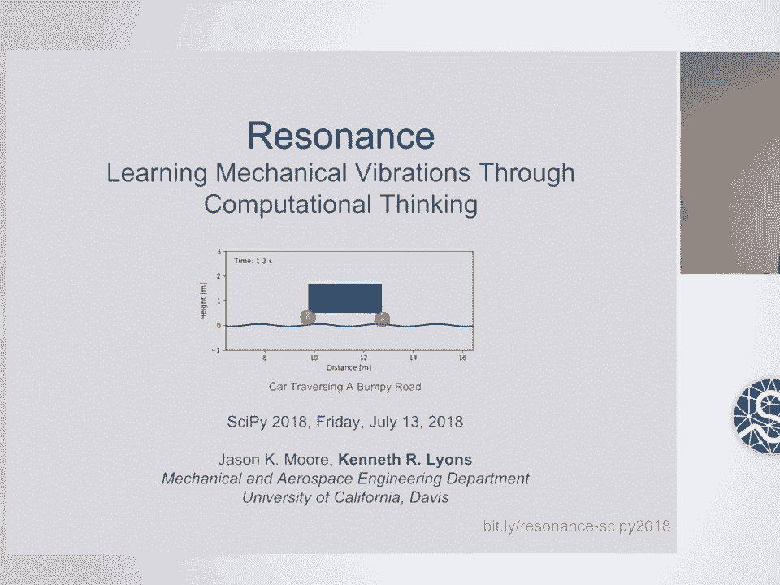
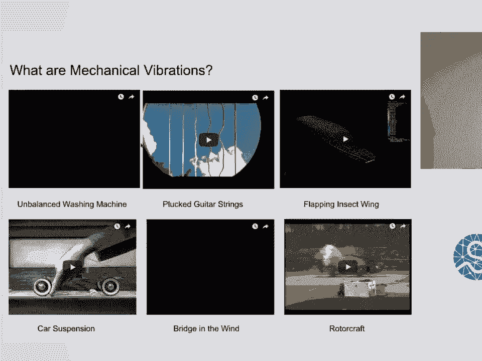
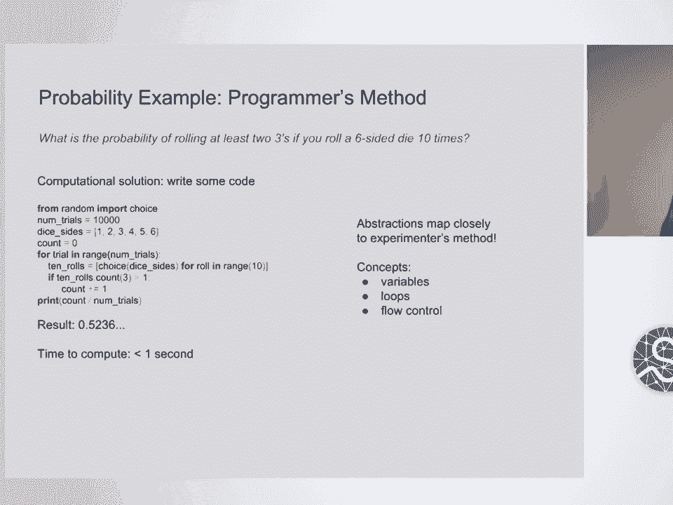
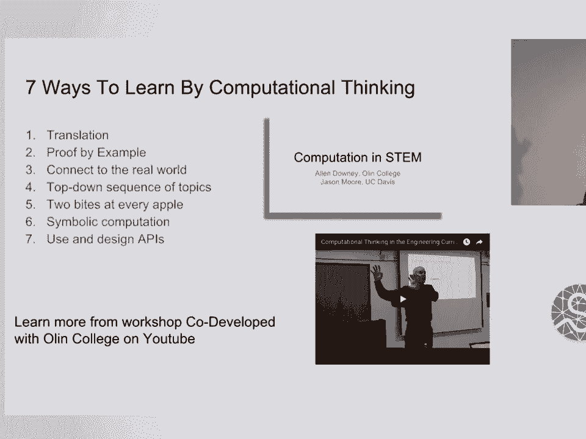
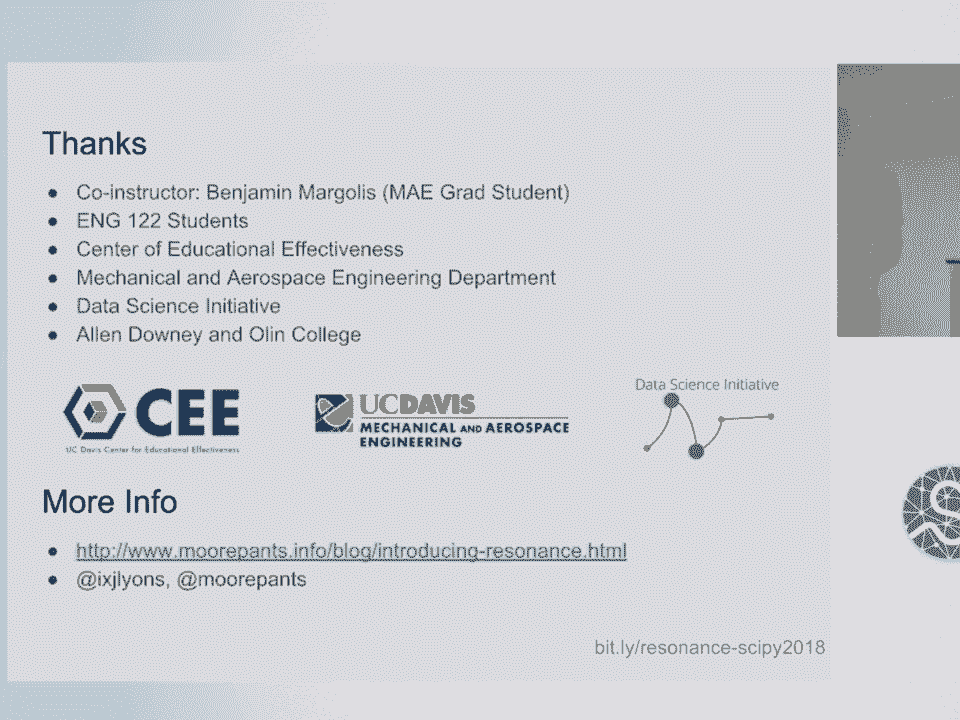

# 27：通过计算学习机械振动 🎓





在本节课中，我们将学习如何将计算思维和Python编程整合到本科工程课程“机械振动导论”中。我们将探讨课程的设计理念、使用的工具（如Jupyter Notebook和自定义库Resonance），以及如何通过实践项目帮助学生理解建模、测量和分析的全过程。

## 课程概述与目标 🎯

上一节我们介绍了课程背景，本节中我们来看看课程的核心目标。传统的工程教育侧重于对已有模型的分析，而本课程旨在让学生更全面地体验工程实践。

我们希望学生在完成课程后能够做到以下三点：
1.  **对真实世界系统进行建模**：能够从实际物理系统中抽象出数学模型。
2.  **对系统进行测量**：能够理解并使用传感器获取数据。
3.  **进行模拟与分析**：能够运行仿真，并将结果与实测数据对比，以验证模型。

设计环节在工程课程中常常被忽视，而计算方法为引入设计思维提供了有趣途径，例如通过调整模型参数来观察系统行为的变化。

## 什么是计算思维？💡

上一节我们明确了课程目标，本节中我们来看看实现这些目标的关键方法：计算思维。计算思维可以被视为在工程学中使用的另一种“语言”。

我们可以用自然语言描述系统，也可以用精确的数学语言建模。同样，我们也可以用编程语言来模拟系统行为。以下是一个概率问题的例子，展示了不同思维方式：

**问题**：投掷10个骰子，得到至少两个3点的概率是多少？

*   **实验方法**：反复投掷骰子并记录结果，用频率近似概率。
*   **数学方法**：利用二项分布的概率质量函数进行理论计算。这需要较多的先验知识。
*   **计算方法**：编写代码来模拟实验过程。这种方法更直观，且计算机能快速执行。

```python
# 模拟投掷10个骰子，计算至少出现两个3点的概率
import numpy as np



num_trials = 100000
success_count = 0



for _ in range(num_trials):
    rolls = np.random.randint(1, 7, size=10)  # 模拟一次投掷10个骰子
    if np.sum(rolls == 3) >= 2:  # 检查3点的数量是否大于等于2
        success_count += 1

probability = success_count / num_trials
print(f"模拟得到的概率约为: {probability}")
```

计算方法并非要取代数学建模，而是提供另一种解决问题的视角和工具。

## 课程设计与实施 🛠️

了解了计算思维后，本节中我们来看看课程的具体设计。我们彻底重构了这门课，没有遵循标准教材，而是创建了基于Jupyter Notebook的互动式教材。

课程的核心设计原则如下：
*   **在实践中学习**：采用翻转课堂模式，学生在课内外通过完成Notebook进行学习。
*   **围绕真实系统**：每个Notebook都围绕一个真实的振动系统（如汽车、飞机机翼）展开分析。
*   **互动式教材**：我们编写了包含代码、文本、公式和图形的Notebook作为主要学习材料。

课程的第一天不再是传统的微分方程测验，而是通过一个包含互动示例的完整Notebook，让学生体验课程内容，激发学习兴趣。

## Resonance 软件库介绍 📚

上一节介绍了课程材料，本节中我们来看看支持这些材料的核心软件工具：Resonance库。这个自定义Python库旨在让学生像操作真实物理对象一样与系统交互。

以下是Resonance库的主要设计准则和功能：

**核心对象：System类**
`System` 类代表一个真实世界系统（如一辆汽车）。学生无需自己创建类，只需使用和配置现有的系统对象。

```python
from resonance.linear_systems import SingleDoFLinearSystem

# 1. 创建一个单自由度质量-弹簧-阻尼系统
sys = SingleDoFLinearSystem()

# 2. 设置系统常数（参数）
sys.constants['m'] = 1.0  # 质量 (kg)
sys.constants['k'] = 10.0 # 弹簧刚度 (N/m)
sys.constants['c'] = 0.1  # 阻尼系数 (Ns/m)

# 3. 设置初始条件（坐标）
sys.coordinates['x'] = 0.1  # 初始位移 (m)
sys.coordinates['v'] = 0.0  # 初始速度 (m/s)

# 4. 模拟系统的自由响应
traj = sys.free_response(5)  # 模拟5秒

# 5. 绘制位移随时间变化的曲线
traj.plot(y='x')
```

**为系统添加“传感器”（测量）**
学生可以定义测量函数，并将其“附加”到系统上，就像安装传感器一样。

```python
# 定义一个计算动能的函数
def kinetic_energy(m, v):
    return 0.5 * m * v**2

# 将该测量添加到系统中
sys.add_measurement('KE', kinetic_energy)

# 再次运行模拟，结果中将包含动能数据
traj_with_KE = sys.free_response(5)
traj_with_KE.plot(y='KE')  # 绘制动能曲线
```

**生成系统运动动画**
通过创建配置图函数，可以可视化系统的运动状态，帮助学生直观理解。

**从能量方程推导运动方程**
利用SymPy进行符号运算，可以从系统的动能和势能表达式自动推导出拉格朗日方程，并将其转换为可供数值积分器使用的函数。

## 评估方式与学生反馈 📊

上一节我们介绍了教学工具，本节中我们来看看如何评估学生的学习成果。我们采用了多种评估方式，重点是实践和应用能力。

以下是主要的课程评估方法：

**每周作业**
作业以稍开放的问题形式布置，学生需要探索计算解决方案，并提交包含代码、分析和说明的完整Notebook。

**设计项目（取代期末考试）**
课程以一项设计项目结束。例如，给定一个简支梁桥模型和车辆模型，要求学生设计一个悬架系统，使车辆能以特定速度过桥并抑制有害振动。该项目产生了许多有趣且多样的解决方案。

**技术基础设施**
我们使用Jupyter Hub为学生提供即用型编程环境，避免了复杂的软件安装问题。同时，使用Nbgrader工具来管理和评分Notebook作业。

## 挑战与收获 🌟

在课程实施过程中，我们遇到了一些挑战，也获得了宝贵的经验。

**主要挑战**
学生入学时的编程经验和意愿差异很大。让所有学生，特别是那些对编程热情不高的机械工程学生，在一定时间内达到能够独立进行模拟分析的水平，是一个持续的挑战。

**积极收获**
尽管有挑战，但课程取得了显著成效：
*   学生能够为设计问题创造出有趣的解决方案和代码。
*   许多学生在课程结束时对编程表现出更高的热情。
*   通过互动和实践，学生加深了对振动系统建模、测量和分析全流程的理解。

## 总结 🎉



本节课中，我们一起学习了如何将计算思维深度整合到“机械振动导论”课程中。我们探讨了以真实系统为中心、基于Jupyter Notebook和自定义Resonance库的教学方法。这种方法不仅教授振动理论，更让学生通过建模、测量、仿真和设计的完整循环，体验了工程实践的核心过程。尽管在平衡学生编程水平差异方面存在挑战，但课程成功激发了学生的兴趣，并培养了他们运用计算工具解决复杂工程问题的能力。