# 29：Python 在近期引力波天文学突破中的作用 🚀

在本节课中，我们将学习引力波天文学的基本概念，了解LIGO等设施如何探测这些宇宙涟漪，并重点探讨Python编程语言在整个科学发现流程中扮演的关键角色。

## 引力波简介 🌌

上一节我们概述了课程内容，本节中我们来看看什么是引力波。

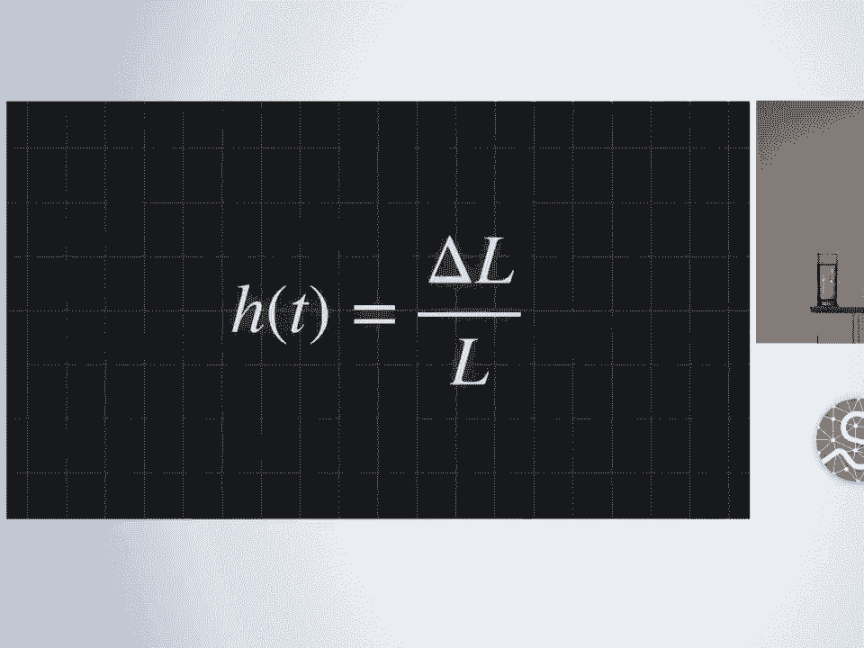

爱因斯坦在大约100年前提出了广义相对论。该理论是现代我们理解时空的基础框架。简而言之，爱因斯坦的广义相对论指出，大质量物体会导致时空结构弯曲。这种弯曲决定了物体的运动方式。因此，质量、能量密度和几何结构之间存在相互作用。

该理论的一个推论是预言了引力波的存在。引力波是时空中的涟漪。如果你有一个坐标网格来标示空间中两点之间的距离，当引力波经过时，它会在一个方向上挤压时空，在另一个方向上拉伸时空，反之亦然。

引力波在很多方面与光相似。它们以光速传播，具有两种偏振模式，但也存在一些重大差异。首先，引力波是时空度规的行进扰动。因此，振荡的不是电磁场，而是应变，即单位长度的变化。此外，与光不同，引力波是四极辐射，而非偶极辐射。

爱因斯坦曾确信我们永远无法探测到引力波。他在1916年写道：“显然，在所有可想象的情况下，引力辐射的振幅实际上都具有一个可以忽略不计的值。”他一度相信引力波是真实的物理效应，但确信它们太微弱，我们永远无法探测到，并且与我们的现实完全无关。

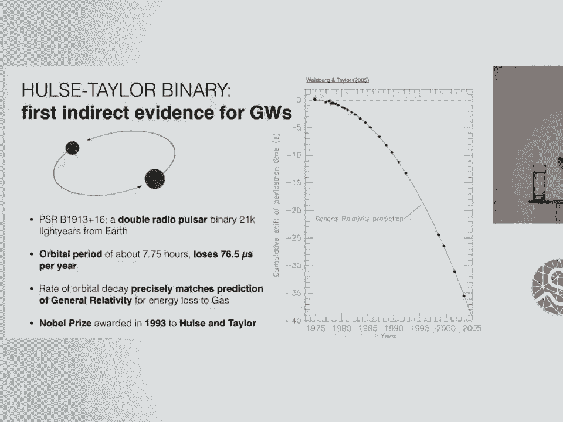

## 探测引力波的挑战 🔬

上一节我们介绍了引力波的理论概念，本节中我们来看看探测它们所面临的巨大挑战。

这张幻灯片展示了两个构思拙劣的引力波发生器，用以说明人造引力波发射器的想法无法实现。左边这个是加州理工学院理论天体物理会议室里的一个恶搞装置。它有一对在小底座上旋转的重物。如果你计算它产生的应变量，大约是 `10^-50`。右边是NASA戈达德太空飞行中心的离心机。这不是为了产生引力波而设置的，而是为了测试这些SUV的侧翻稳定性。如果你计算它的引力波发射量，大约是 `10^-46`。

然而，自然界可以做得更好。最好的引力波源基本上也是一个离心机。你需要两个质量体相互绕转，它们需要以接近光速的速度运动，并且质量必须非常大。因此，自然界中能想象到的最佳引力波源是由两个致密天体组成的双星系统，例如两颗中子星或两个黑洞。如果你计算一个在不太遥远的星系中的此类源在地球上产生的引力波强度，得到的应变约为 `10^-21`。

实际上，我们几十年前就知道引力波是真实存在的。长期以来，最有力的证据来自脉冲双星。这是赫尔斯-泰勒脉冲双星，由两颗中子星组成。我们实际上看到了两颗中子星的射电脉冲，当这些波束穿过我们的视线时。因为这些射电脉冲以非常规律的频率到达，我们可以将它们用作非常精确的时钟来测量双星的轨道。因此，我们可以判断这个轨道周期约为7.75小时的双星，每年损失76.5微秒。其损失速率与因能量和角动量以引力波形式损失所预测的完全一致。赫尔斯-泰勒于1993年因证明这一点而获得诺贝尔奖。

现在，借助LIGO，我们希望直接探测这些引力波。我们通过激光干涉测量法来实现。这是一个迈克尔逊干涉仪。一束激光照射到分束器上，然后反射到两个不同方向的两面镜子上。随后在分束器处重新组合，并到达探测器（即白色平板）。根据两臂长度的差异，你可能会得到完美的相长干涉，从而在探测器输出端看到光；或者得到完美的相消干涉，从而看不到光。因此，你可以使用激光干涉测量法来非常精确地测量长度差异，精度远小于你所使用光的波长。

## LIGO：探测宇宙的涟漪 📡

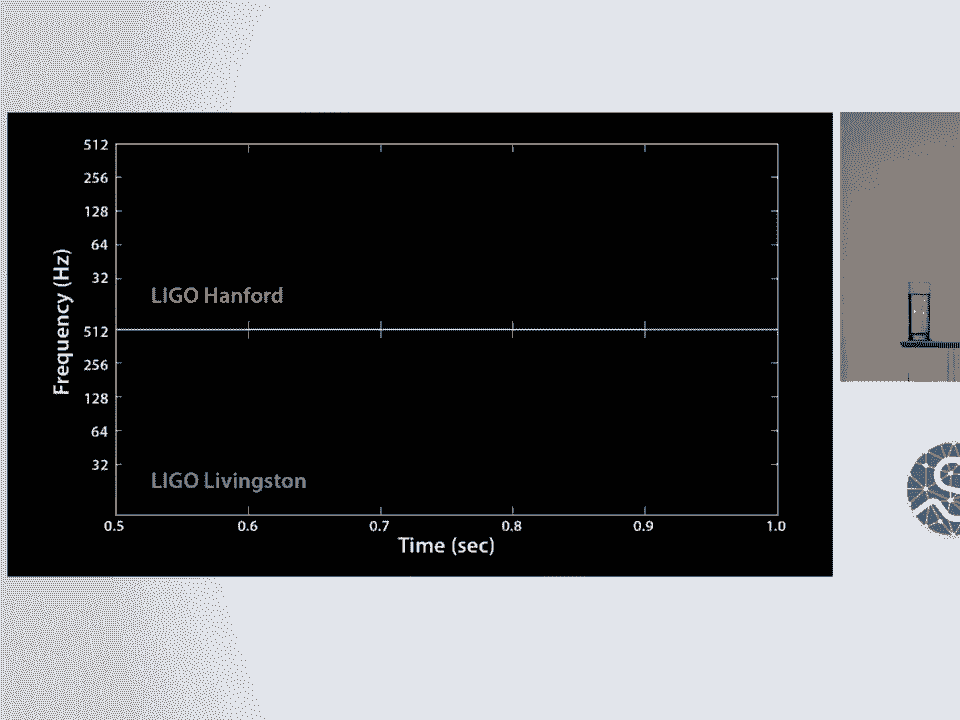

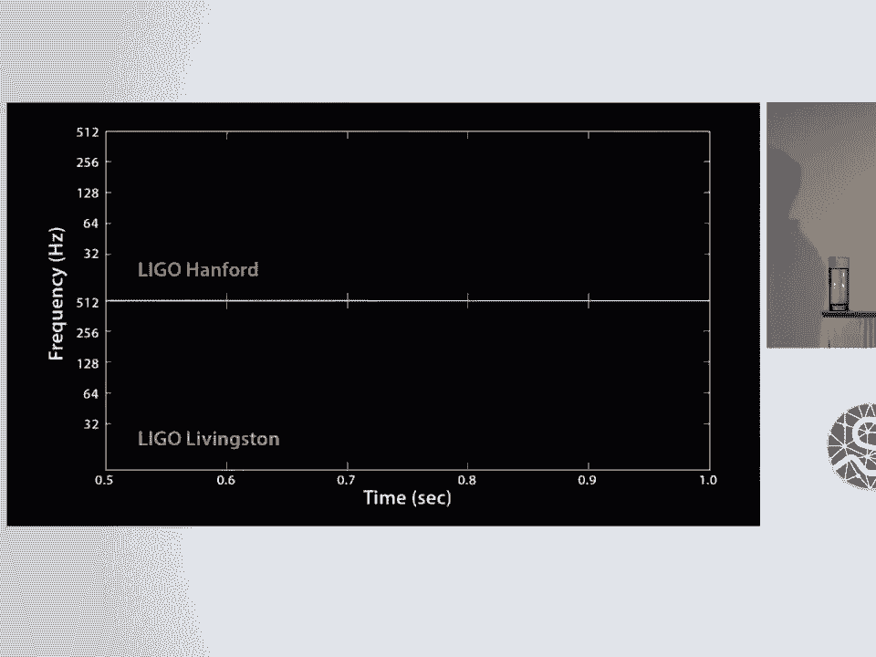

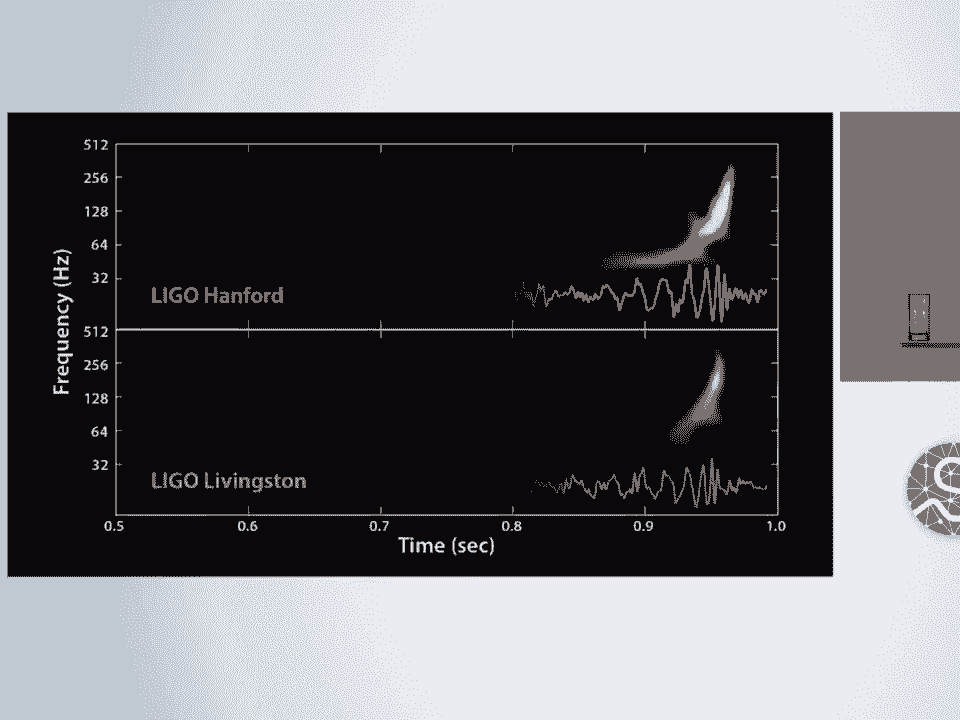

上一节我们了解了探测引力波的基本原理，本节中我们深入看看LIGO探测器本身。

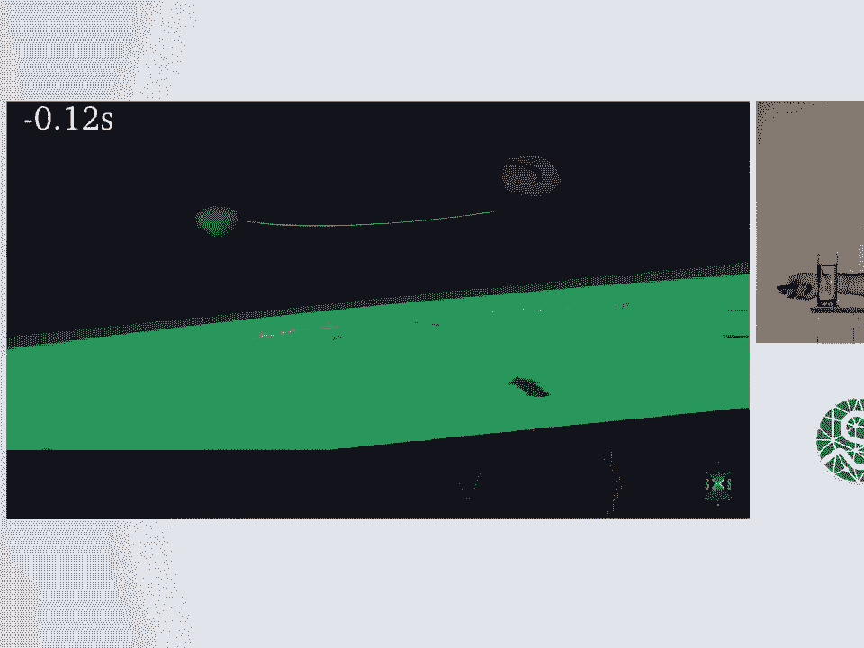

由于这些引力波极其微弱，我们必须采取许多非常规措施才能使它们可探测。我们做的第一件非常规之事是使我们的探测器变得巨大。这是位于路易斯安那州利文斯顿的LIGO利文斯顿观测站。图片底部是顶点站，里面装有高功率激光器、分束器、读出光学器件。向两个方向延伸四公里处是带有末端镜的端站。

因为这些探测器也极其敏感，它们会拾取来自地震活动和人为地面运动的地面振动，并且对各种环境影响都很敏感。我们必须将它们放在条件恶劣的地方。例如，这个探测器位于路易斯安那州的一个伐木保留地。我们实际上在这里遇到了鳄鱼带来的巨大问题。另一个是我参观过的两个探测器中的另一个，也是我最喜欢的——位于华盛顿州的LIGO汉福德观测站。它位于汉福德核保留地，我们在二战期间在那里匆忙制造了许多核武器材料，当时处理得不太干净。所以这是一片令人惊叹的荒凉核废土。有时我们会在数据中看到突发的毛刺，因为核基地正在进行拆除清理工作，以处理曼哈顿计划期间进行的那些疯狂科学实验的遗留物。我们还得出去清理这些光束管上的风滚草以保持畅通。

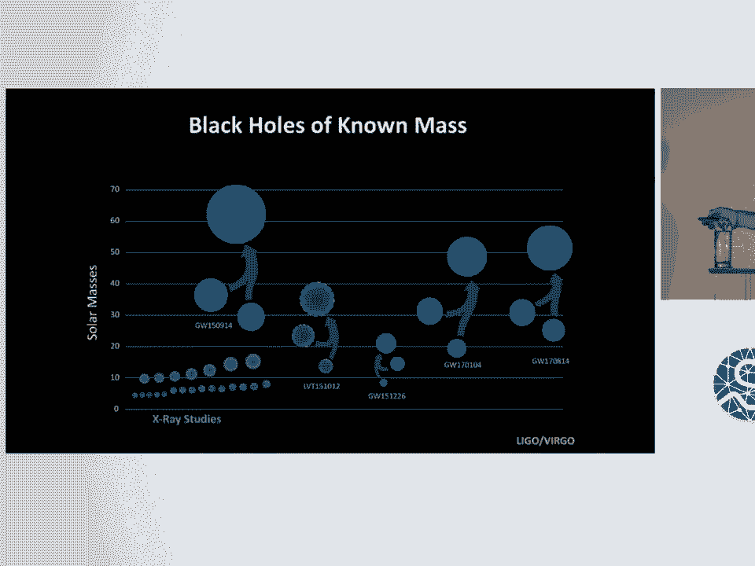

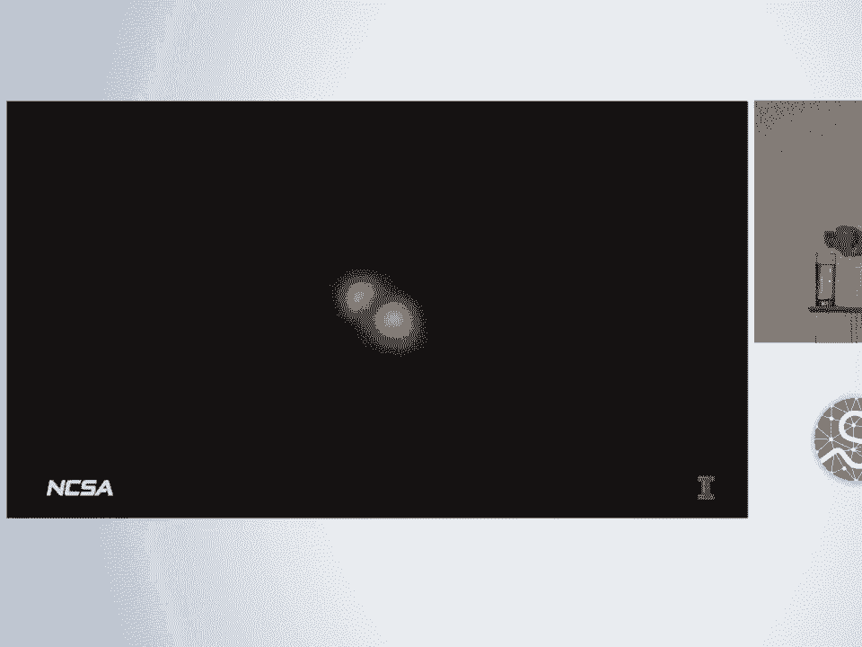

我们现在拥有这个全球引力波观测站网络。LIGO代表激光干涉引力波天文台。如前所述，我们试图感知 `10^-21` 量级的长度分数变化。对于我们四公里的臂长，这相当于测量 `2 * 10^-16` 厘米的长度变化，大约是质子半径的五百分之一。按比例来说，这就像测量从这里到最近恒星的距离，精度达到一根人类头发的宽度。

除了使这些探测器变得巨大之外，我们还必须采用各种疯狂的技术来实现这一点。因此，末端的这些镜子（右上角的照片是其中一个末端镜的照片）必须是40公斤重的玻璃块，悬挂在由玻璃线制成的摆锤上。然后这个摆锤又悬挂在另一个摆锤上，如此层层悬挂，所有这些摆锤也都受到主动控制以进一步抑制地面运动。我们必须向系统中注入巨大的激光功率，因为我们的噪声源之一就是光子计数噪声。因此，我们使用20瓦的激光器，将其注入这些实际上是谐振腔的臂中，光在出来之前会在里面往返数百次。因此，我们将臂中存储的功率提升到数百千瓦。由于有大量功率施加在这些镜子上，它们会发生热变形，为了保持正确的形状，我们实际上必须用完全不同的激光系统从后面加热它们，以抵消这种热变形。

最终结果是，我们确实对引力波有了一定的灵敏度。

## 首次探测：黑洞合并 🔊

上一节我们介绍了LIGO探测器的精密设计，本节中我们来看看它取得的第一个里程碑式成果。

这是我们在2015年9月14日记录到的来自双黑洞合并的第一个信号。我将为你播放它。你会看到一个频谱图。水平轴是时间，垂直轴是频率，你将听到经过白化处理和带通滤波后的信号，以使信号的天体物理部分更明显。

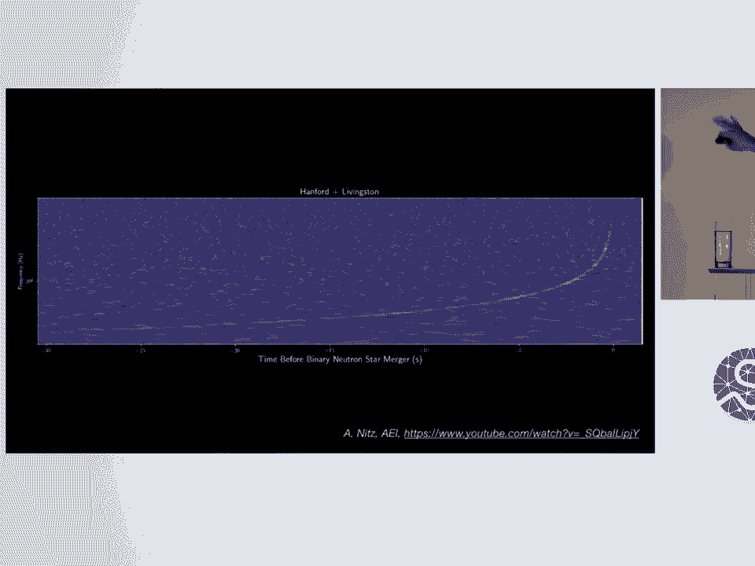

（此处描述音频：你听到那声敲击了吗？就是它。）

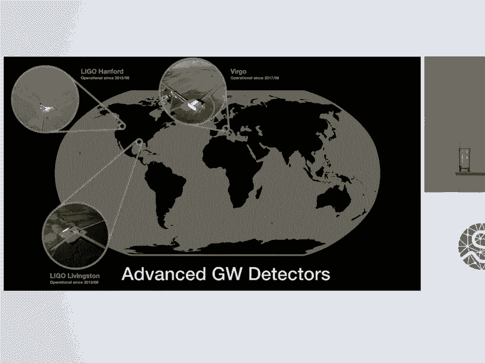

这个频率上升的“啁啾”声就是双黑洞合并的信号。发生的事情是，两个黑洞相互绕转。随着它们越来越近，它们发射的引力波越来越强。这是一个失控效应。因此，引力波信号的振幅和频率不断上升，直到合并发生。然后这些黑洞最终合并，形成一个单一的黑洞，随后会“铃宕”并稳定成一个漂亮的球对称残余黑洞。

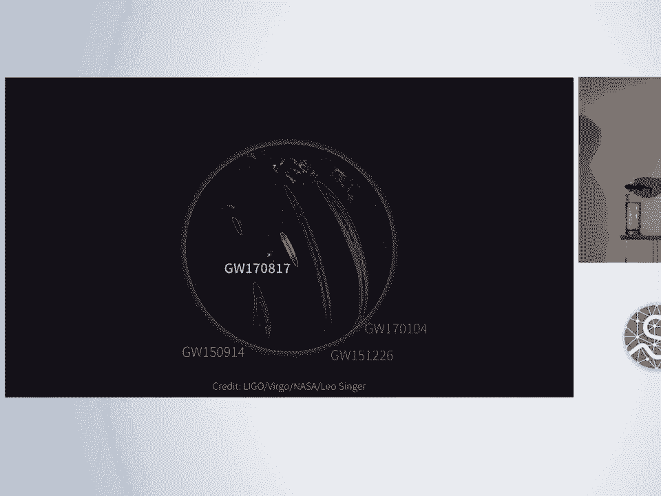

自那以后，我们探测到了更多的黑洞。我们汇编了一个我们通过引力波探测到的双黑洞合并的“恶棍画廊”。左下角紫色的这些，是我们使用更常规手段探测到的黑洞。即使用X射线望远镜观察一个从伴星吸积物质的黑洞。我们可以观察该吸积的X射线发射，并用它来确定致密天体的质量。因此，所有这些黑洞的质量可能在5到10个太阳质量之间。我们用LIGO探测到的黑洞质量要高得多。迄今为止最重的一个是第一个。它是一个29太阳质量和36太阳质量黑洞的合并。我相信，最终的残余物大约是62太阳质量。因此，我们从有史以来观测到的两个最重的恒星级黑洞开始，制造出了一个更重的黑洞。

## 中子星合并与多信使天文学 💫

上一节我们探讨了黑洞合并，本节中我们来看看更引人入胜的中子星合并。

我认为更有趣的是中子星合并，因为当你将物质引入系统时，就可以得到光。这里有两个中子星在双星中绕转，在它们物理上靠得非常近之前，看起来很像双黑洞合并。但当它们靠近时，两颗中子星开始由于潮汐力而相互拉扯，形成一个短暂的吸积盘。这种吸积流将成为驱动一系列不同类型电磁辐射的中心引擎。

最酷的后果是核合成。其运作方式是，我们取两个非常致密、富含中子的天体，将它们拉开，从而得到大量热且富含中子的物质，并在此过程中合成许多重元素。然后这些重元素会衰变，并作为放射性热源，产生一种我们称为“千新星”的信号特征。

这里主导的核物理过程称为R过程或快中子俘获过程。之所以称为“快”，是因为你将中子俘获到种子核上的速度比这些中子发生β衰变的速度还要快。这张图表有点像元素周期表，但它是原子核的图表。水平轴是中子数，垂直轴是质子数。沿着对角线或接近对角线的是所谓的稳定谷。这些是稳定的原子核。在中子星合并中，或者在某种程度上，在热核炸弹爆炸中，你会迅速形成非常富含中子的元素。你会形成富含中子的重元素，因此你会向右、向右上角移动很远，然后衰变回稳定状态。你通过β衰变回到稳定状态。但你得到了这种特征性的三峰丰度结构，因为存在一些“幻数”中子数，能提供更高的核稳定性。这有点类似于化学中，原子价层中具有特定数量的电子会带来更高的化学稳定性。因此，在这些幻中子数附近，你会得到原子丰度的堆积。

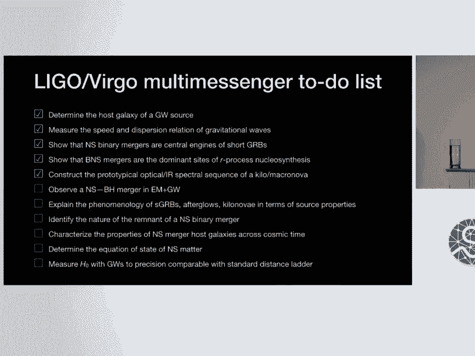

这个过程基本上产生了元素周期表上的重元素。因此，这里用黄色突出显示的每个元素都是由快中子俘获过程产生的。这包括像金、银和铂这样的珠宝元素。因此，一些大众媒体喜欢称这些中子星合并为“bling-novae”（闪耀新星）。

这真是一个非常酷的科学相互关联性的例证，因为在去年之前，我们并不真正知道宇宙中这些重元素是在哪里产生的。长期以来，我们认为它们是在超新星中产生的，但这不太对。因此，中子星合并是另一个非常有希望的候选者。

## 历史性事件：GW170817 📅

上一节我们了解了中子星合并的理论意义，本节中我们回顾那个改变一切的具体事件。

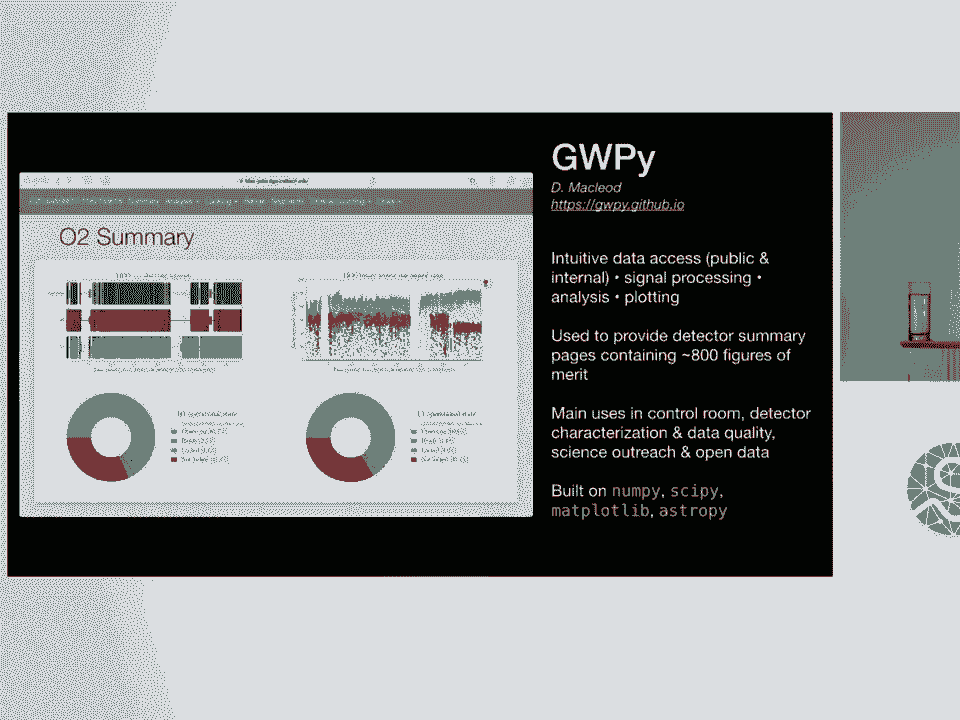

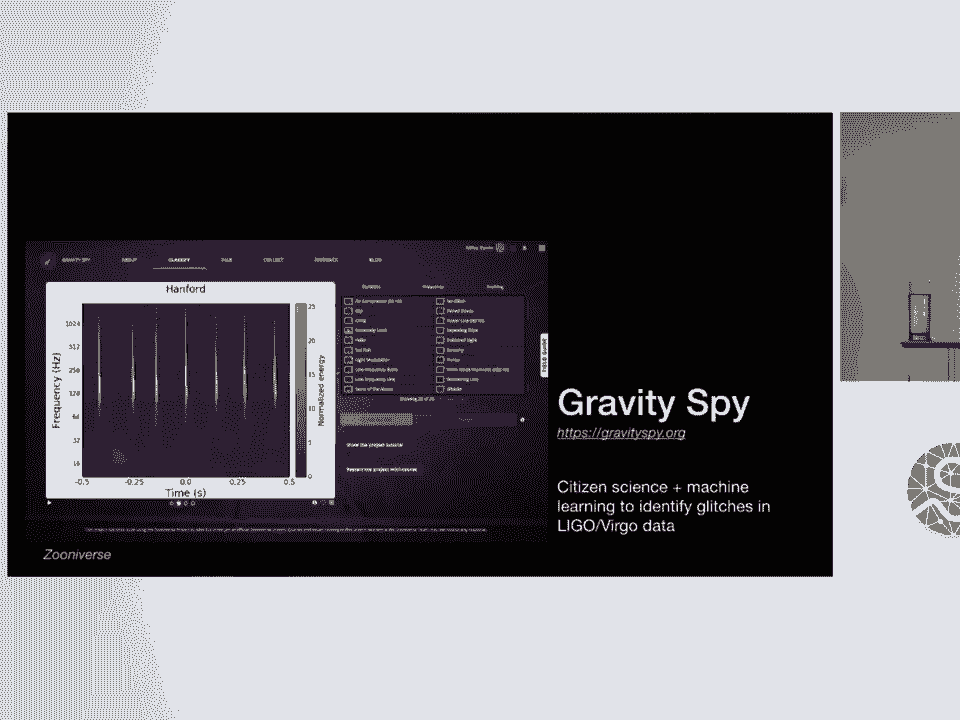

这是我们在2017年8月17日，也就是我生日后的第二天记录到的信号。这需要一点时间，因为这是一个双中子星合并。系统越轻，它在我们的灵敏频带内停留的时间就越长，频率演化得越慢，最终频率也越高。双黑洞合并在大约350赫兹处结束，而这个会持续更久。仅从这个啁啾的长度，你甚至可以从它在时频平面上留下的轨迹判断出质量是多少。

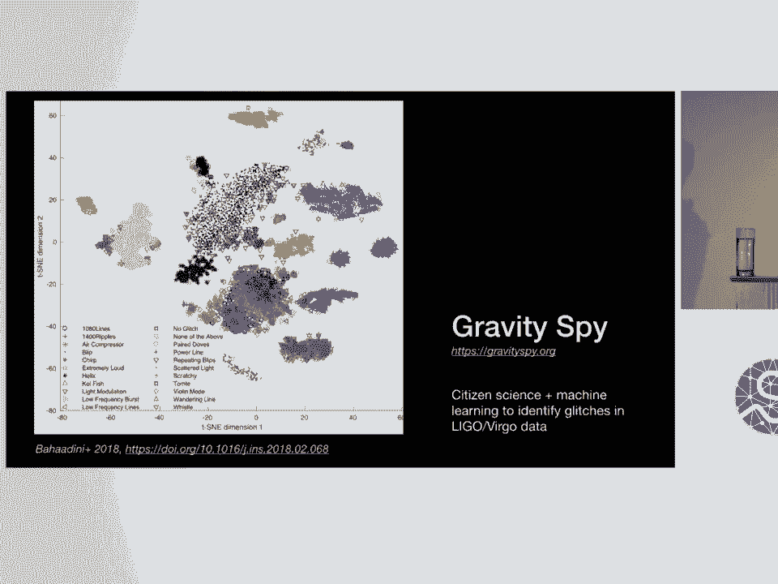

这是首次探测到的双中子星合并。我们最初在LIGO汉福德探测到它，可以非常清楚地看到这个啁啾轨迹。啁啾在利文斯顿也可见，但数据中也有一个巨大的毛刺。我们的探测器由于环境噪声源以及各个子系统的仪器问题而毛刺非常多。这个毛刺是由光电二极管饱和引起的。这是我们考虑过的科学质量数据中见过的最严重的毛刺之一。我们能够对该毛刺建模并将其去除，然后在下面我们也看到了那个完美的啁啾。

这已经够酷了，但更棒的是，我们的意大利合作设施Advanced Virgo，刚刚在几周前以其高级配置上线。因此，我们首次拥有了一个由三个具有天体物理灵敏度的引力波探测器组成的全球分散网络。这使我们能够利用额外的基线非常非常准确地进行定位。

以下是截至当时我们探测到的双黑洞的定位区域。而这是GW170817的定位区域。双黑洞的定位区域覆盖了大约1000平方度的天区，而GW170817只有30平方度。因此，如果你试图寻找某些可见光信号，你肯定更愿意处理像后者这样的区域，而不是前者。我们所有人都对此感到非常高兴。基本上，全世界所有的天文学家在接下来的一个月里都进入了高速运转状态。

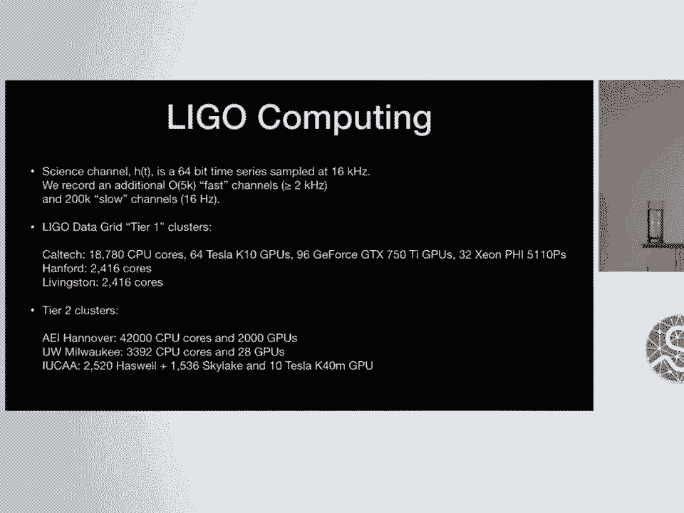

甚至还有一个巧合的短伽马射线暴。伽马射线暴是强烈的硬电磁辐射爆发。已知其中一半与某种大质量恒星的坍缩和死亡有关。而另一半被认为是由这些双中子星合并引起的。费米和INTEGRAL卫星同时探测到了一个短伽马射线暴，这在那一刻证明，至少有一些短伽马射线暴与双中子星合并有关。

更棒的是。因为这个源定位得非常好，我们实际上可以采取多种不同的方法来寻找其对应体。我们可以使用视场非常宽的望远镜，简单地平铺整个绿色区域。或者，我们可以挑选出单个星系，用视场很小但非常灵敏的望远镜观察每一个，检查该星系中是否出现了任何新天体。两种技术都被采用了。大约有六个团队几乎同时宣布在我们定位区域内发现了一个明亮、快速演化的光学暂现源。一个位置与一个星系重合，该星系的距离与我们用LIGO测量的距离一致。

这就是那个星系，NGC 4993。左边显示的是该暂现源的光学图像。右边显示的是光谱。这个源开始时非常蓝，在四天的时间里逐渐变暗、变红，达到峰值后开始下降。它的演化速度比任何已知类型的超新星都要快得多。光谱看起来与我们已知的任何其他类型的暂现源都不同，但这些光谱的行为和这些宽峰与千新星的预测惊人地吻合。因此，这现在是千新星的观测原型。

需要补充的是，它也在X射线和射电波段被探测到。X射线和射电辐射对于理解该事件外流的整体特性以及理解几何结构极为重要，但X射线和射电本身就可以成为整个演讲甚至整个会议的主题。实际上，直到今天你仍然可以在X射线和射电波段探测到它。

## 未解之谜与未来展望 🔭

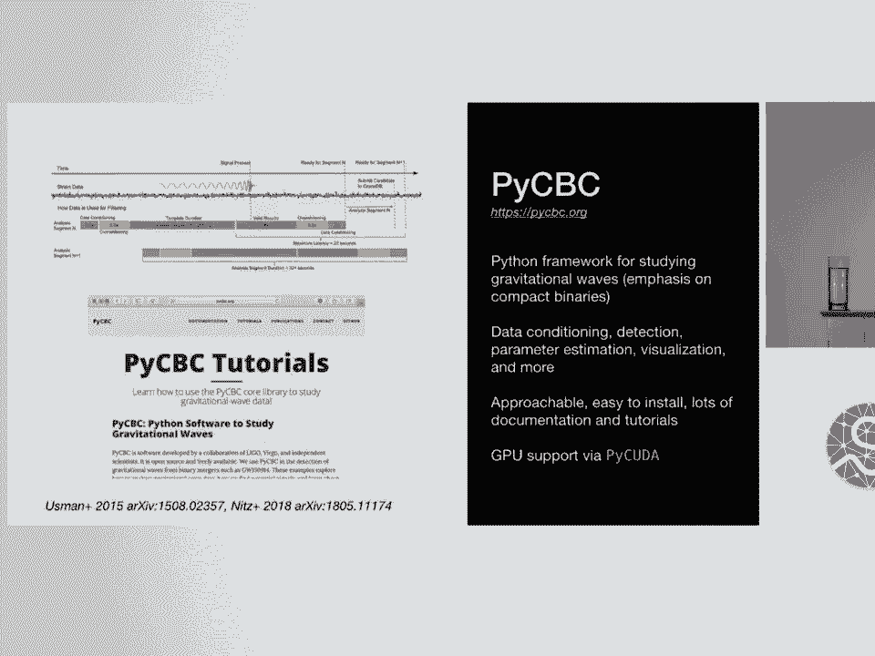

上一节我们庆祝了GW170817的巨大成功，但本节中我们必须承认，我们远未解决这个领域的所有问题。

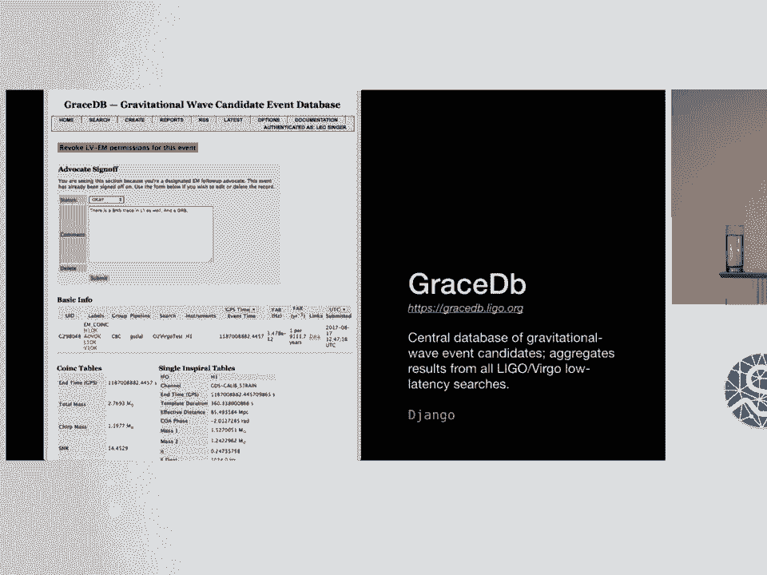

我们做了一些真正有影响力的事情。首先，我们确定了一个引力波源的宿主星系。我们测量了引力波的速度，并通过观察引力波和伽马射线暴之间的时间延迟，验证了它确实与光速相同。我们证明了双中子星合并确实是短伽马射线暴的中心引擎。我们证明了双中子星合并是宇宙中R过程核合成的主要场所。并且我们构建了千新星的观测原型。

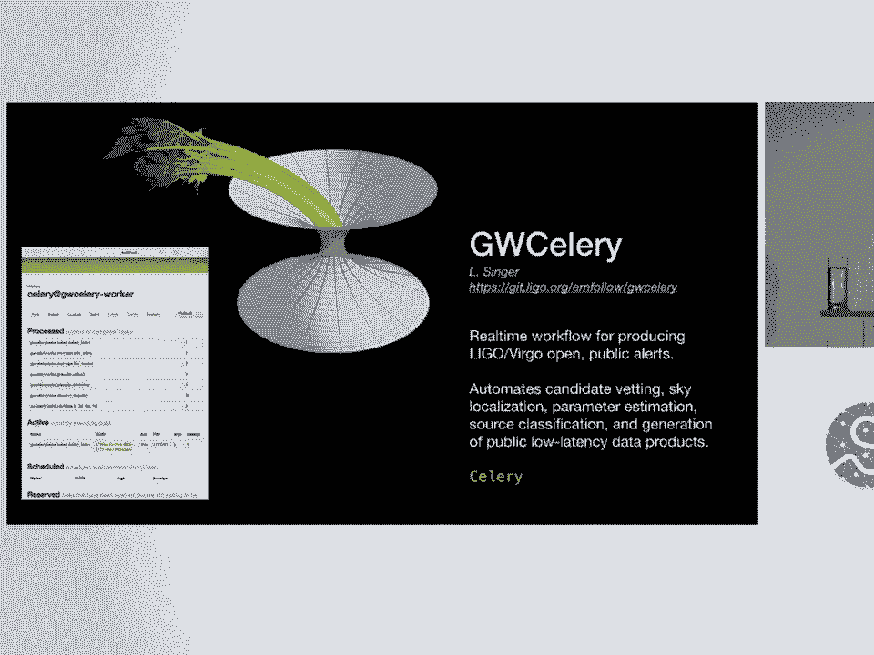

但还有很多事情要做。我们希望能从一颗中子星与一个黑洞的合并中学到很多东西。这是我们希望在LIGO未来几次观测运行中实现的目标。我们希望理解现象学，并理解是什么决定了我们在电磁信号中看到的特征。我们希望确定当两颗中子星碰撞时，留下的天体性质是什么。是另一颗重中子星？是一个黑洞？是一颗旋转一段时间然后坍缩的中子星？我们不知道。我们希望描述这些源在不同宇宙时期的宿主星系特性。我们希望确定中子星是由什么构成的，即核密度下物质的物态方程。我们希望使用引力波测量描述宇宙膨胀速率的哈勃常数。

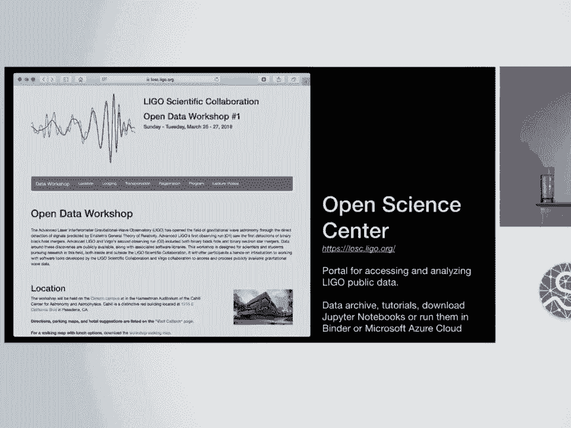

## Python 在 LIGO 工作流中的核心作用 🐍

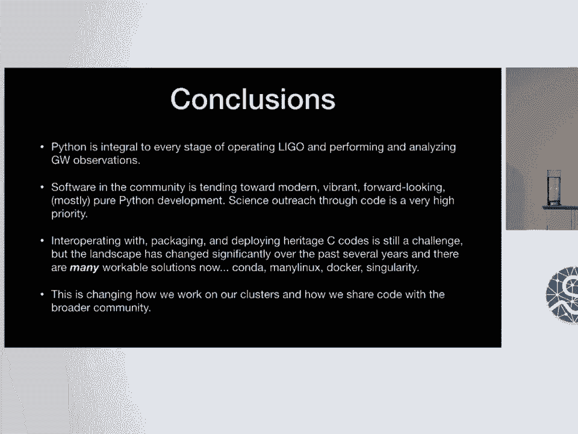

上一节我们展望了引力波天文学的未解之谜，本节中我们将焦点转向本课程的核心：Python 在这个庞大项目中的无处不在的应用。

现在我要转换话题，我已经涵盖了我想要讨论的所有科学内容。我想向你们展示Python在我们项目中的一些用途。

这是LIGO汉福德控制室的照片。我相信这张照片来自首次锁定。锁定意味着让探测器的臂、让激光光在探测器的每个臂腔中谐振，然后让臂腔彼此谐振。这些是达到天体物理灵敏度所需经历的步骤。在这张照片中，那位穿黑色背心的女士正在看的那个看起来有点偏蓝的屏幕，显示的是我们用来控制干涉仪的图形用户界面。它叫做EPICS，是一个由阿贡国家实验室开发的实验控制软件包，其用户界面看起来像是90年代初的东西。但在大型物理实验中这很常见。

现在，这是实际与底层硬件通信的部分，硬件包括在FPGA和各种模块中实现的数百万个滤波器。但整个系统的实际自动化是使用Guardian完成的，它是一个分布式层次结构的状态机自动机，用于实际锁定探测器并自动化不同操作状态之间的转换。它是用Python构建的。对于每个小子系统，它使用NetworkX表示状态转换图。每个小工作进程都使用多进程在一个严格管理的子进程中运行，并通过一些Python绑定通过EPICS与硬件通信。因此，LIGO是由Python控制的。

接下来，在控制室中，我们运行探测器，现在我们想查看数据，看看它是否合理。为此，我们使用一个名为GWPy的工具。这是一个用于访问数据（包括公开数据和内部未发表数据）、进行基本信号处理技术和分析以及绘图的软件包。它用于在控制室进行许多快速查看调查，也用于生成我们的探测器摘要页面，这些页面是大约800个不同品质因数的实时集合，我们用它来查看所有不同子系统的健康状况。主要用途是在控制室，也用于探测器表征和数据质量，以及科学推广和开放数据。正如你所料，它严重依赖NumPy、SciPy、Matplotlib和AstroPy。

接下来是Gravity Spy。这对本次会议的许多人来说可能更有趣。Gravity Spy是一个结合了公民科学和机器学习的项目，用于识别和分类LIGO和Virgo数据中的毛刺。我们有一个包含所有不同类型毛刺的“动物园”。我们知道其中一些毛刺的原因，而另一些则不知道。我们希望通过识别一些辅助仪器通道来消除毛刺，这些通道可以作为见证，预测科学数据何时将受到某种类型毛刺的影响。但这只对某些类型的毛刺有效。因此，这里的想法是，人们可以登录Zooniverse，志愿根据不同的形态对毛刺进行分类。然后我们使用这些分类来训练机器学习算法。我们希望在我们的下一次观测运行中在线部署这些机器学习算法。这只是使用t-SNE算法创建的LIGO数据中毛刺空间的降维表示。

我们已经运行了探测器。我们查看了数据。我们对其进行了后处理。我们知道可以分析它了，接下来我们做什么？接下来，数据将发送到我们的计算集群。我们有我们的科学通道，即HFT，我们在每个探测器中测量的应变。这是一个以16千赫兹采样的64位双精度浮点时间序列。收集一年的数据，大约是4太字节。没什么大不了的。你可以把它装进手提箱里的一两个SSD中。但我们还记录了大约5000个所谓的快速通道，这些通道与辅助传感器或控制回路相关，采样率为2千赫兹或更高。然后还有大约20万个慢速通道，采样率大约在16赫兹到64赫兹之间。

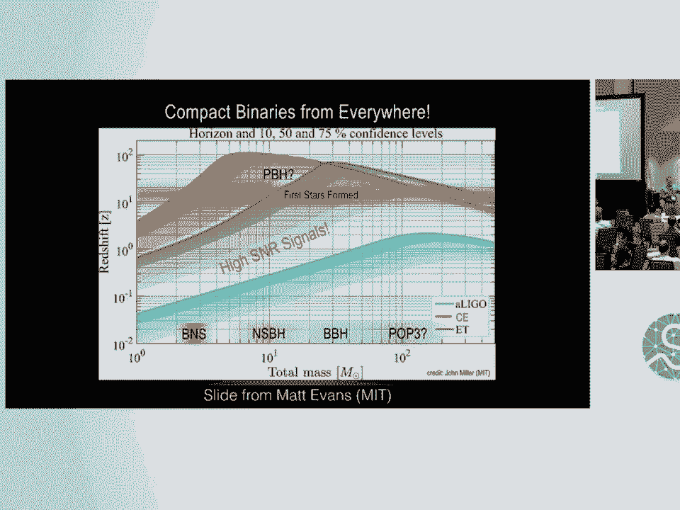

因此，根据你对数据做什么分析，你可能只需要科学通道HFT，或者可能还需要一些这些辅助通道。但你将在我们的一个一级LIGO数据网格集群上进行该分析。有三个一级站点。最大的是加州理工学院，由18,000个CPU核心和一堆GPU以及一些Xeon Phi处理器组成。我们在每个站点都有集群，每个集群大约有2,500个核心。然后我们还有二级站点，由LIGO科学合作组织的成员机构运营