# 30：缺失数据的安全处理指南 🛡️

在本课程中，我们将学习如何处理数据集中普遍存在的缺失值问题。缺失数据会严重破坏你的分析和模型结果，引入难以察觉的偏差。我们将探讨缺失数据的不同类型、常见但错误的处理方法，并学习一套科学、安全的处理流程。

---

## 引言：无处不在的缺失数据

大家好，我是 Dylan Niederhut。我的代名词是 he/him。我在一家名为 Enthant 的公司担任培训师，帮助公司使用 Python 改进工作流程，以实现可重复性、可验证性等目标。我也是 SciPy 会议论文集的编辑之一。

在本次互动性较强的演讲中，我会不时提出问题。首先，我想了解一个基线情况：在座有多少人讨厌举手？[笑声] 看来今天会很有趣。

---

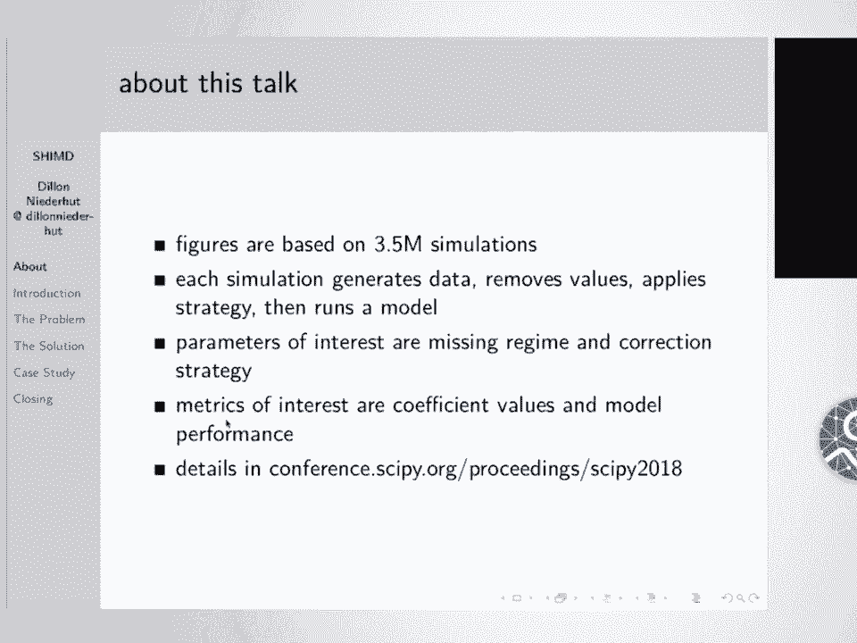

## 缺失数据的破坏性影响

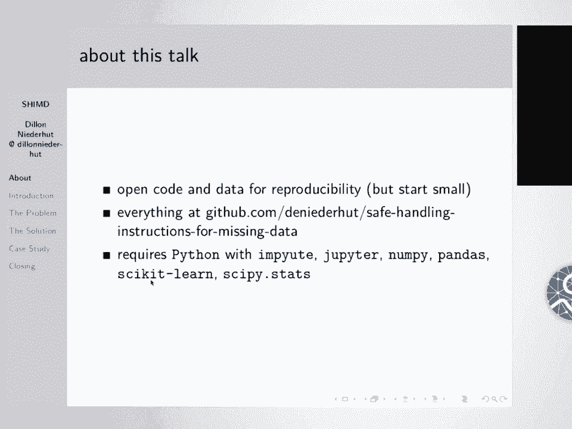

上一节我们进行了简单的互动，本节中我们来看看缺失数据为何如此危险。

我们经常看到这样的表格：数据大部分完整，但中间夹杂着 `NaN`（非数字）值。这种情况几乎人人都会遇到。甚至在我们周二 Panjis 教程现场编造的数据中，也出现了缺失值。因此，缺失数据是常态，而非例外。

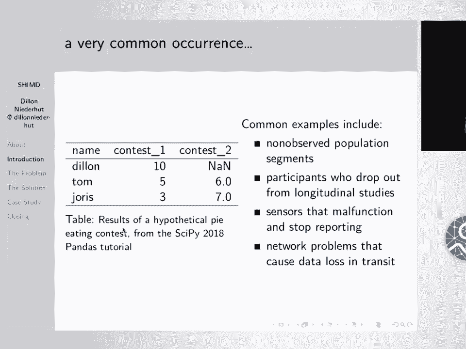

这些潜入表格的 `NaN` 值正在破坏你的研究、分析和结果。

请看左侧图表，这是一个简单的线性关系 `y = x + 噪声`。当我们用足够多的数据拟合模型时，噪声会相互抵消，我们最终能得到围绕真实斜率（系数为1）波动的估计值。

而在右侧图表中，我们在相同的数据中人为加入了一些 `NaN` 值并重新拟合模型。结果，所有拟合线的斜率都系统地低估了真实值。这不是随机误差，而是**偏差**。缺失数据的问题就在于它会引入偏差。

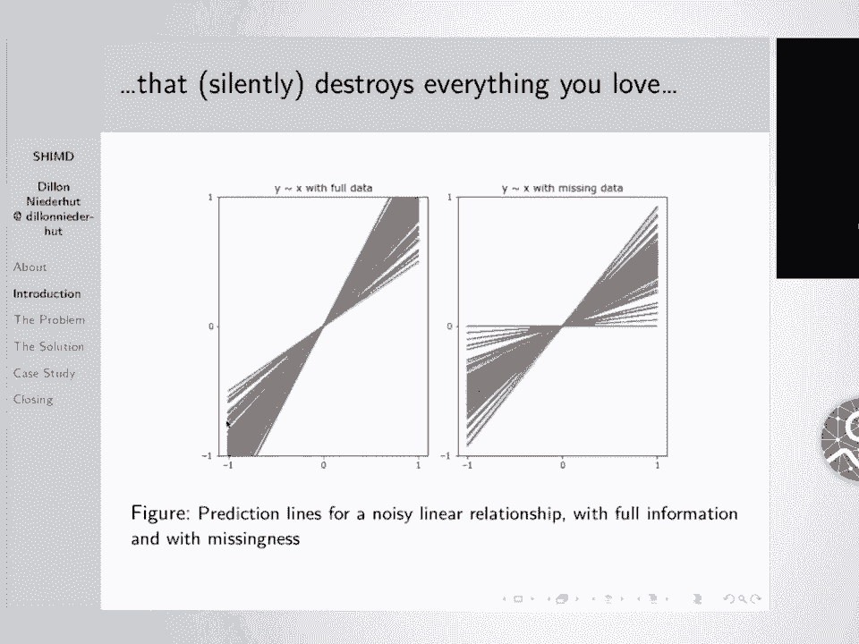

---

## 缺失数据的三种机制

为了理解偏差如何产生，我们需要了解数据缺失的机制。想象一个“数据恶魔”在你看数据之前，随机或根据某些规则移除了一些值。

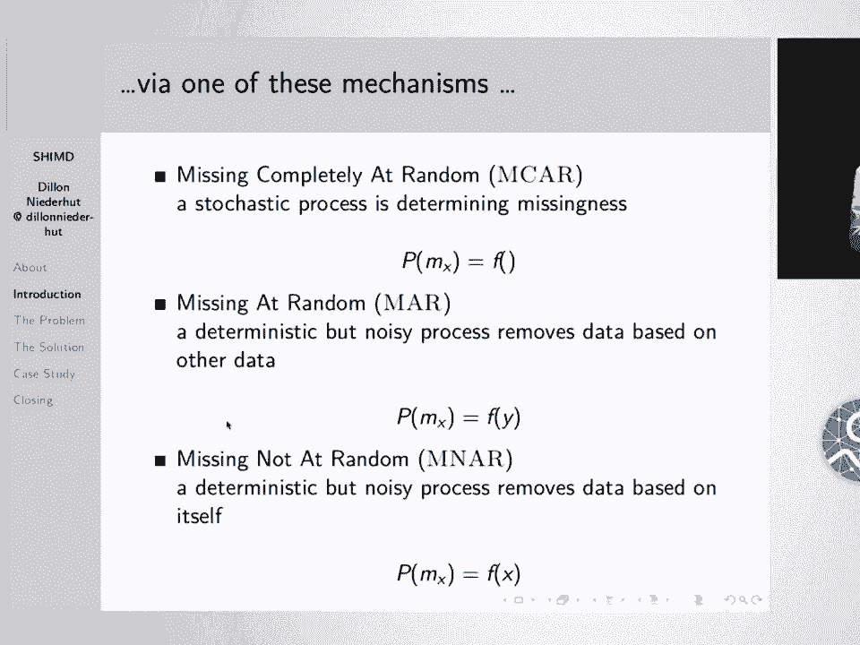

以下是三种缺失机制：

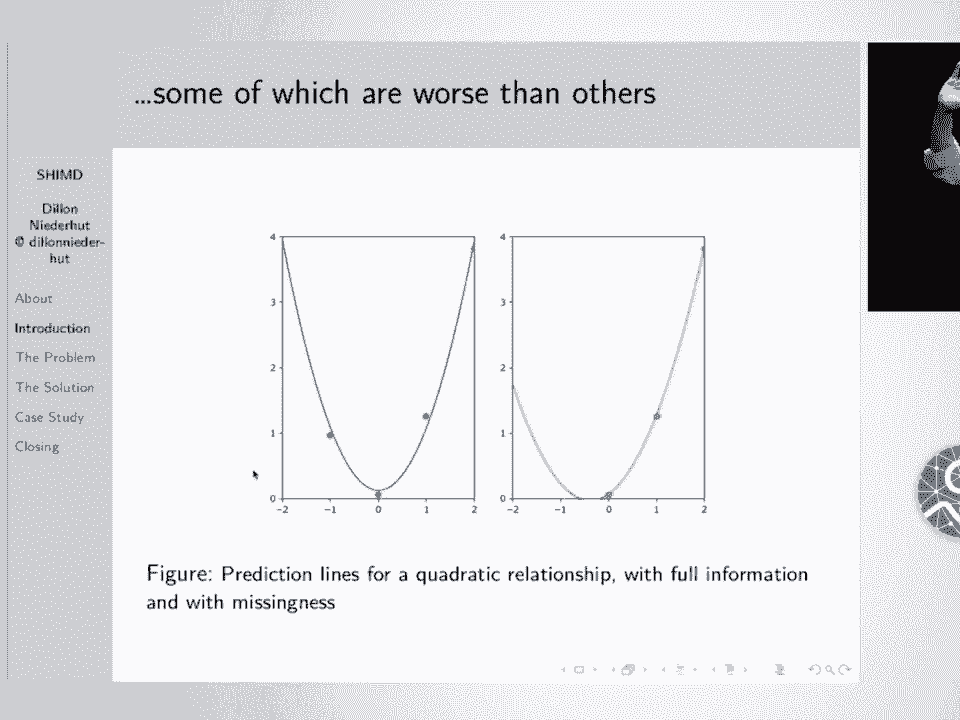

1.  **完全随机缺失**：数据缺失是完全随机的过程，就像掷骰子决定。这通常缩写为 **MCAR**。这是唯一一种最不容易引入偏差的情况，但在现实中几乎无法保证。
2.  **随机缺失**：数据缺失依赖于已观测到的其他变量。例如，基于“今天是周五”这一事实移除周五收集的数据。这里的“随机”是统计学意义上的，指“可预测的确定性函数加噪声”。这缩写为 **MAR**，是最常见的缺失类型，会引入中等程度的偏差。
3.  **非随机缺失**：数据缺失依赖于数据本身未观测到的值。例如，温度计总是在高温时失灵。这缩写为 **MNAR**，会引入严重的偏差。

在实践中，除非是电脑比特损坏，否则我们很少见到完全随机的缺失。真实世界中的数据总是存在相关性，因此绝大多数缺失都属于 **MAR** 类型。

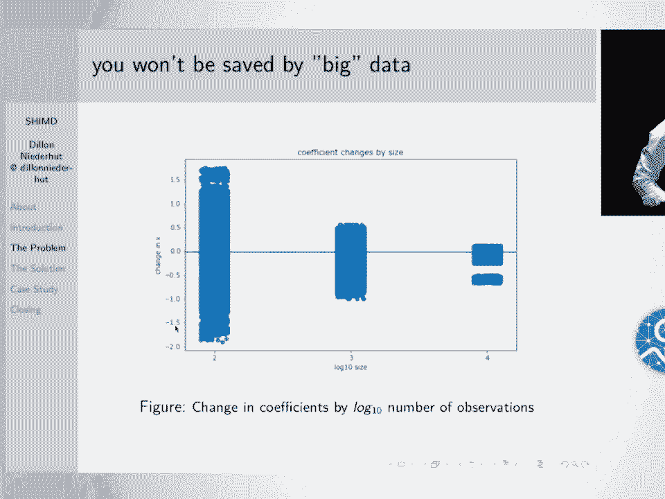

---

## 常见错误处理方法及其危害

既然缺失数据如此普遍，人们提出了各种处理方法。但遗憾的是，许多常见做法都是错误的。

以下是几种需要避免的方法：

*   **收集更多数据**：如果缺失机制存在偏差，收集更多数据只会让你更确信一个错误的结果。这就像食物中毒后，吃更多有毒食物并不能解决问题。
*   **直接删除缺失行**：这被称为**成列删除**。只有在数据为 **MCAR** 时，这种方法才不会引入偏差。但在更常见的 **MAR** 情况下，它会引入巨大且难以预测的偏差。更糟糕的是，一个特征缺失数据，会导致你对其他完全观测的特征的系数估计也产生偏差。
*   **使用列均值填充**：无论你的数据以何种机制缺失，使用均值填充**总是**会引入偏差。即使在最理想的情况下（特征完全独立），结果也很糟糕。

---

## 安全处理缺失数据的正确流程

上一节我们了解了哪些方法不可取，本节中我们来看看一套科学、安全的处理流程。

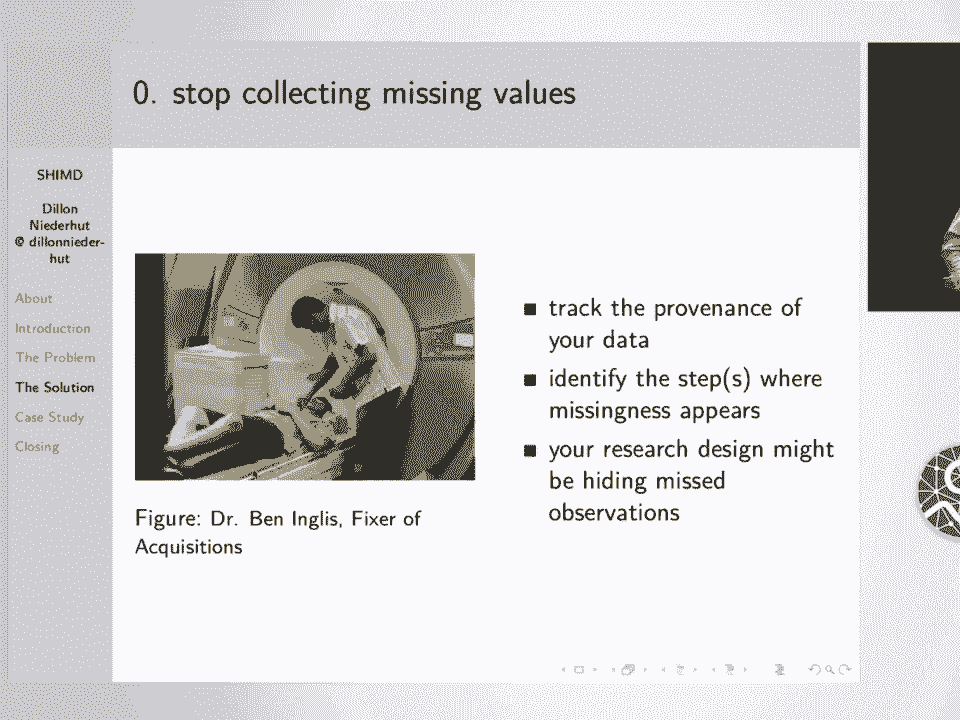

以下是处理缺失数据的推荐步骤：

1.  **步骤零：预防与设计**
    *   最理想的方式是从源头避免缺失。许多缺失是研究设计本身的副作用。在数据采集阶段就进行优化，远比事后统计弥补要容易。
    *   即便如此，缺失仍会发生。因此，在研究开始时就应计划应对缺失。**追踪数据来源**，保留原始记录，以便在需要时回溯和恢复。

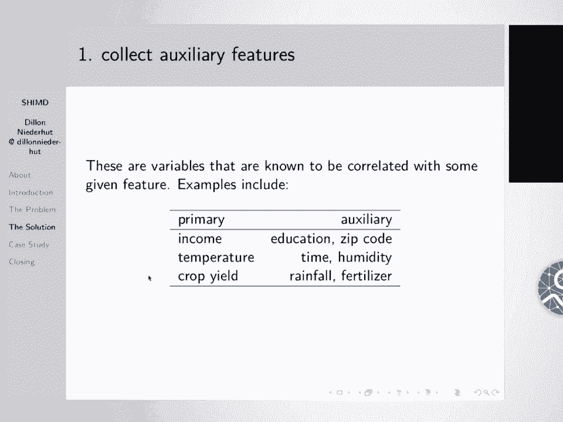

2.  **收集辅助特征**
    *   收集一些你**不打算**用于最终预测模型，但与目标变量强相关的变量。例如，如果收入数据容易缺失，可以收集邮编、教育水平等与收入强相关的信息。这些辅助特征能极大帮助后续的填补步骤。

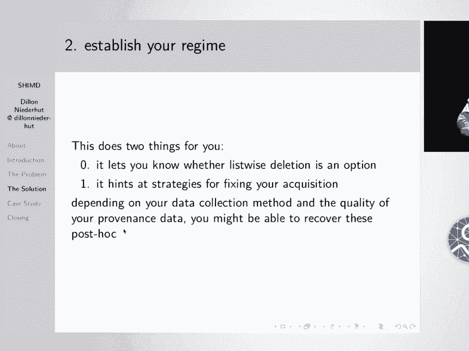

3.  **确定缺失机制**
    *   分析你的数据，尝试确定缺失属于 **MCAR**、**MAR** 还是 **MNAR**。这决定了你是否能安全地使用成列删除，并帮助你理解缺失原因，甚至可能指导你重新收集部分数据。

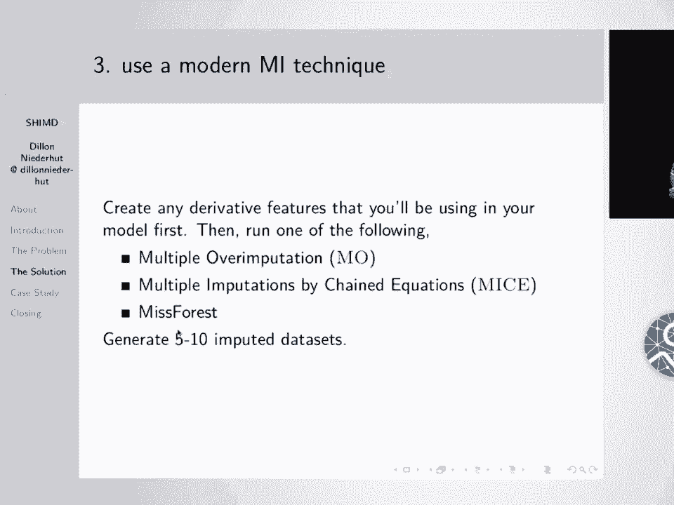

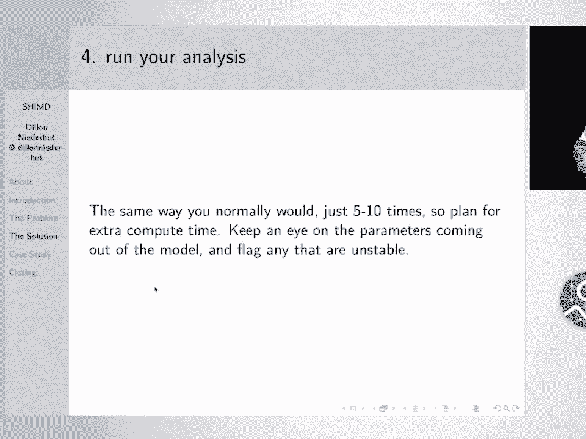

4.  **使用现代多重填补技术**
    *   不要使用单一值（如均值）填补。应该使用**多重填补**技术，为每个缺失值生成多个合理的可能值，从而创建多个完整的数据集。
    *   常用算法包括：
        *   **MICE**：通过链式方程进行多重填补。
        *   **MissForest**：使用随机森林进行填补。
    *   在填补**之前**，生成所有你计划在最终模型中使用的衍生特征（例如，分类变量的虚拟编码、时间序列的滞后项）。

5.  **进行分析**
    *   对每个通过多重填补生成的完整数据集，独立运行你的分析模型（如回归、分类）。这意味着你需要将整个分析流程运行 5 到 10 遍，请为此预留额外的计算时间。

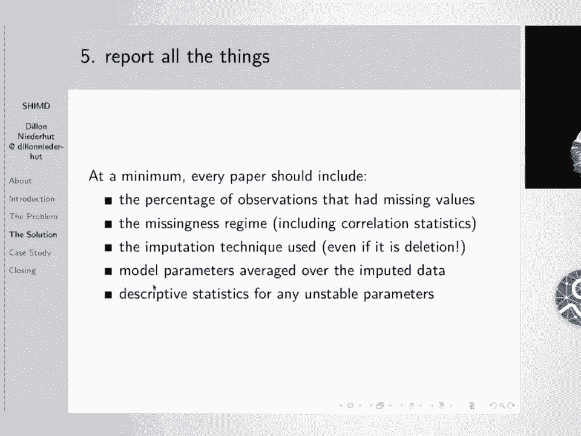

6.  **合并结果并完整报告**
    *   将多个数据集的分析结果（如模型系数、R²）进行合并（例如取平均）。
    *   在论文中必须完整报告：
        *   有多少记录存在缺失值。
        *   你判断的缺失机制是什么。
        *   你使用了哪种填补技术（避免使用均值填补！）。
        *   合并后的模型参数估计值。
        *   如果某个参数在不同填补数据集间波动很大，也需要报告，这表明该结果不稳定。

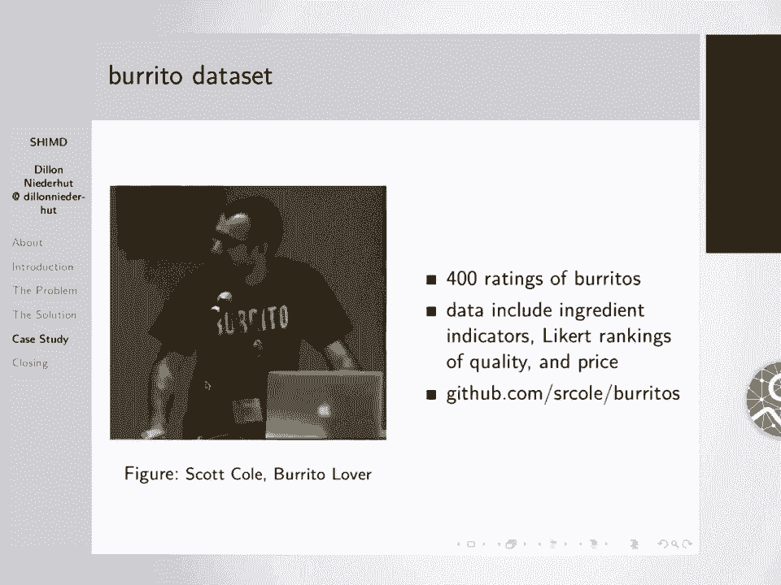

---

## 实例分析：墨西哥卷饼评级

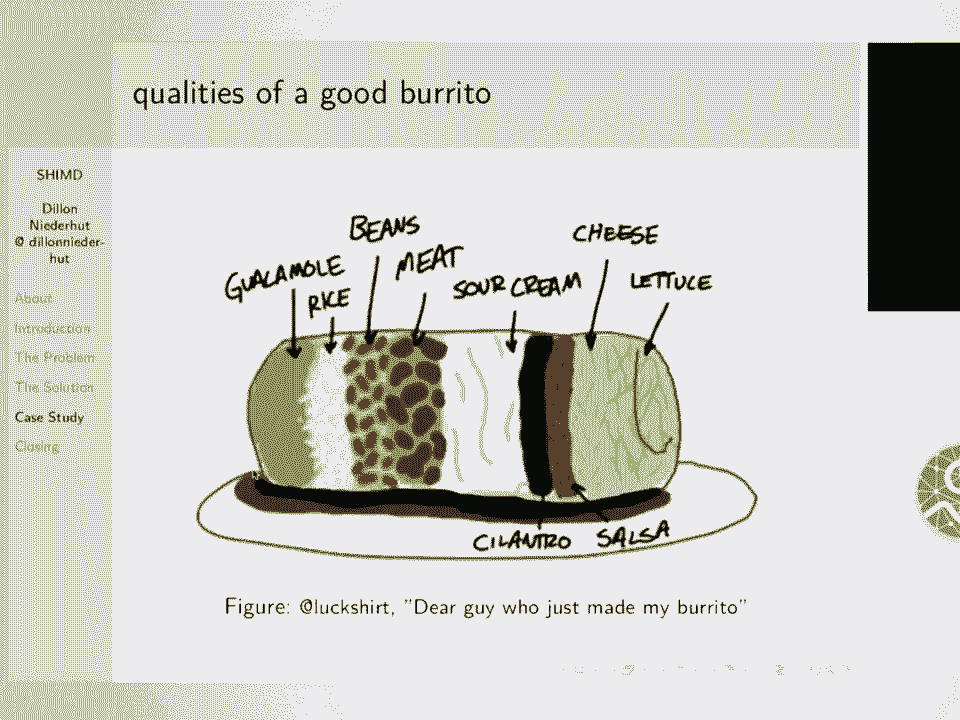

让我们通过一个真实世界的趣味数据集来实践上述流程。这个数据集包含了约400条对圣地亚哥墨西哥卷饼的评级。

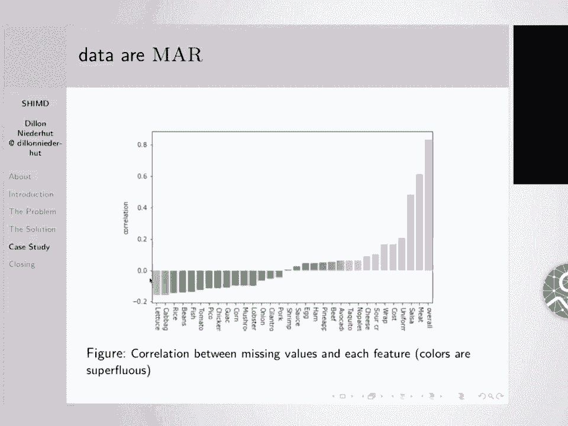

我们的目标是：找出卷饼的哪些成分决定了它的好坏（总体评分）。

如果直接分析清洗后的数据（约200条完整记录），因子分析显示决定卷饼质量的主要因素包括：肉类质量、价格、莎莎酱质量等。

现在，我们模拟一个 **MAR** 场景：假设人们在吃到特别美味的卷饼时，过于兴奋而忘记给“肉类质量”打分。因此，我们人为地移除了一些高分卷饼的“肉类质量”数据。

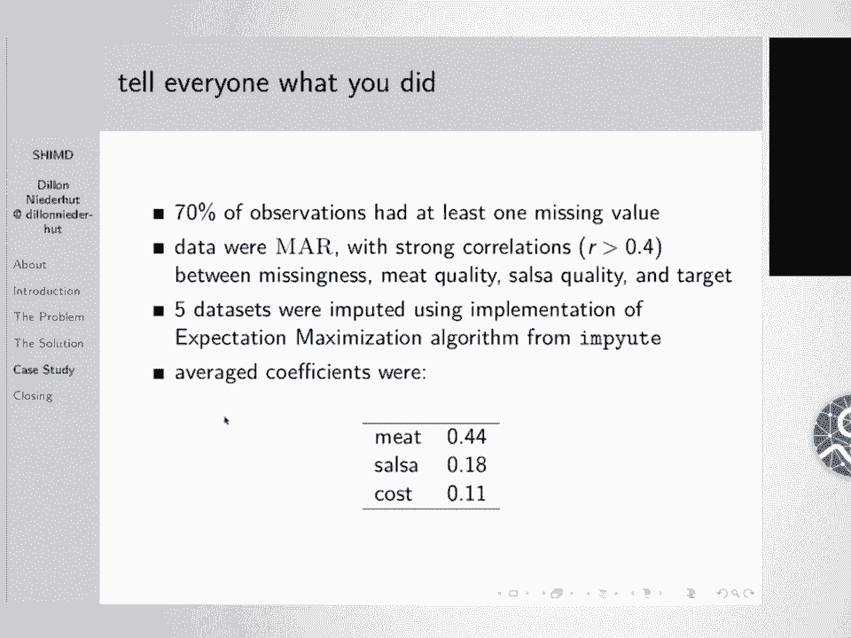

分析显示，缺失值与“肉类质量”、“莎莎酱质量”以及我们的目标变量“总体评分”高度相关。这证实了是 **MAR**，因此不能使用成列删除。

我们对比三种处理方法的效果：
*   **多重填补**：模型性能（R²）虽有所下降，但真实模型的性能仍在可能范围内。
*   **均值填补**：结果与真实数据集相去甚远，甚至可能错误地凸显其他不重要的特征（如酸奶油）。
*   **成列删除**：结果极差，此时模型的预测能力几乎和直接猜测平均值没什么区别。

这个例子清晰地表明，采用正确的多重填补方法至关重要。

---

## 总结与未来展望

本节课中我们一起学习了缺失数据处理的核心理念与安全流程。

我们首先认识到缺失数据会引入偏差，破坏模型。然后，我们了解了三种缺失机制：**MCAR**、**MAR** 和 **MNAR**。接着，我们摒弃了“收集更多数据”、“删除行”和“均值填补”这些常见但错误的方法。最后，我们掌握了一套六步安全处理流程：从预防设计、收集辅助特征、确定缺失机制，到使用**多重填补**技术进行分析，并完整报告结果。

对于 Python 社区的未来，我们希望看到：
1.  拥有更多 Python 化的现代多重填补算法库（目前这类库多在 R 或 C++ 中）。
2.  这些库应具备与 **Pandas** 的一流互操作性。
3.  建立强大的社区标准，推广缺失数据处理的最佳实践。

处理缺失数据是一项严谨的科学工作。正确的方法虽然需要更多步骤，但能保护你的研究免受偏差侵蚀，确保结论的可靠性。