# 31：使用 Dask 进行可扩展的机器学习 🚀

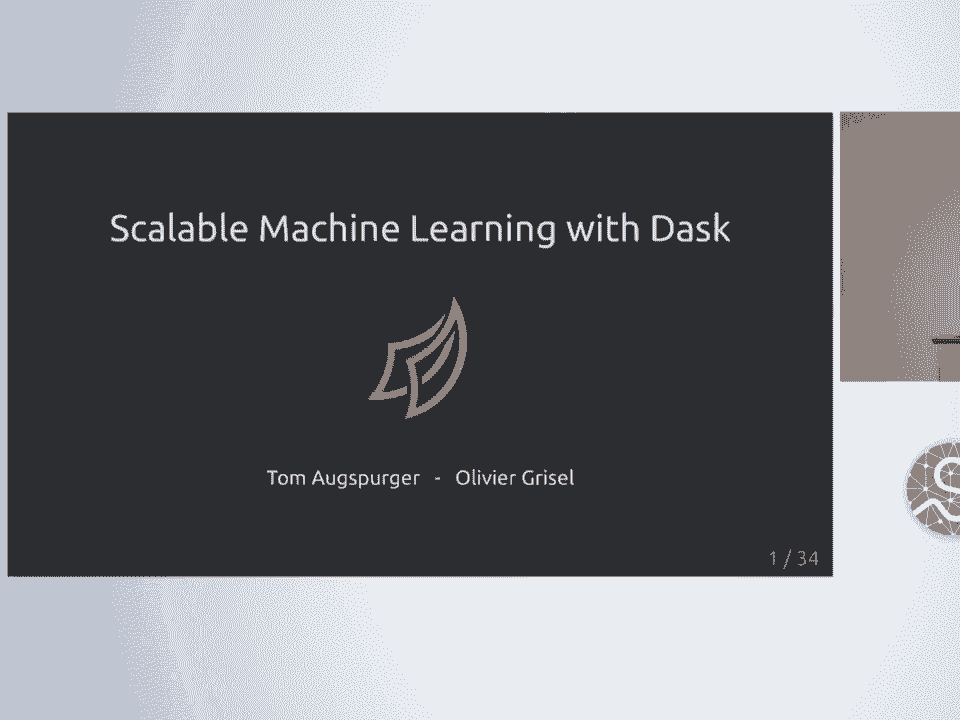

在本节课中，我们将学习如何利用 Dask 框架来扩展 Python 的机器学习工作流，使其能够处理更大的数据集和更复杂的计算任务。我们将探讨 Dask 的核心概念、其与 scikit-learn 的集成方式，以及如何通过分布式计算来突破单机内存和计算能力的限制。

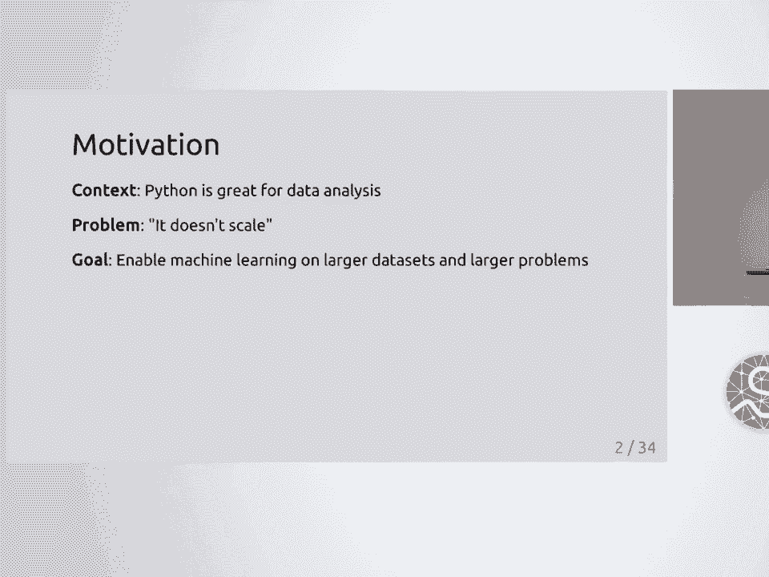

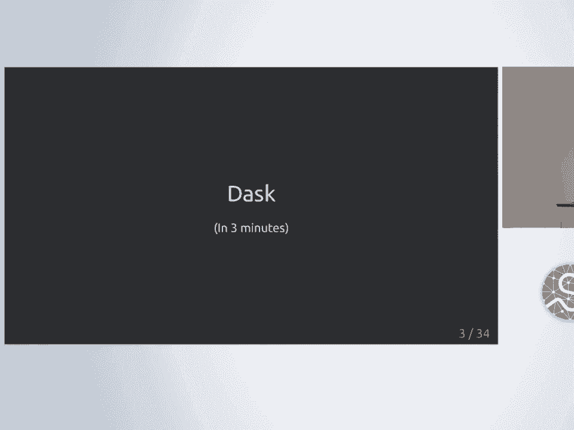

---

## Dask 简介 🧩

上一节我们介绍了课程目标，本节中我们来看看实现这些目标的核心工具——Dask。

Dask 是一个纯 Python 的高层 API，其设计理念与 NumPy 和 Pandas 等工具一脉相承，因此对数据科学家非常友好。在某些情况下，它甚至可以成为你源代码中的“即插即用”式替代品。Dask 使得处理无法装入单机内存的超大数据集成为可能，甚至可以利用集群中的多台机器。

为了实现这一点，Dask 管理着一个**调度器**，它负责在多个线程、进程或集群机器上并行运行任务（即独立的函数调用块）。它更像是一个编排器，为数据科学家提供了便利的 Python API。

例如，如果你是一个 Pandas 用户，可以读取 Parquet 文件到 DataFrame 并进行分组操作。在分组操作后，你可以对特定列进行聚合求和，然后对结果排序以提取前 10 个结果（例如，交易金额最高的雇主）。

以下是 Pandas 与 Dask DataFrame 的主要区别：
*   **导入语句**：使用 `import dask.dataframe as dd` 而非 `import pandas as pd`。
*   **数据加载**：可以读取多个文件，而不仅是一个。
*   **延迟计算**：最终得到的是一个延迟结果，尚未实际计算。它只是一个如何在集群上执行该操作的计划。你需要调用 `.compute()` 方法才能获取一个常规的、位于客户端程序内存中的 Pandas DataFrame。

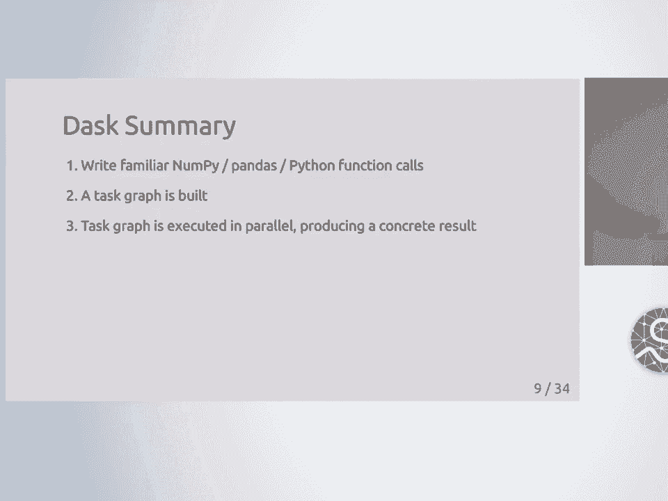

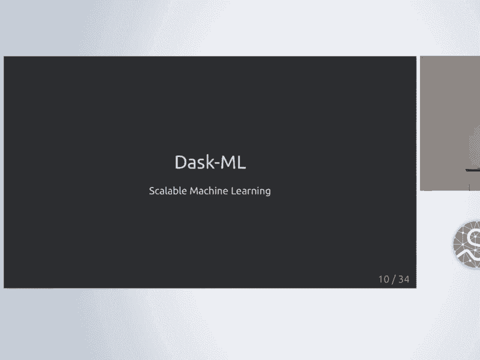

当执行上述操作时，Dask 会构建一个**计算图**。这是一个对各个子任务及其如何并行运行、如何同步以得到最终结果的符号化描述。结果并非立即计算，你可以延迟执行，并将执行过程发送到集群。Dask 调度器会识别该操作图中的并行部分，并在并行资源（CPU 或机器）上运行它们。

在实践中，对于更大的计算图（例如某个线性代数运算），你可以看到红色部分代表正在计算或保留在内存中的中间结果，蓝色部分代表不再需要、可以被垃圾回收的中间结果。这个计算图可以扩展到多台机器上。

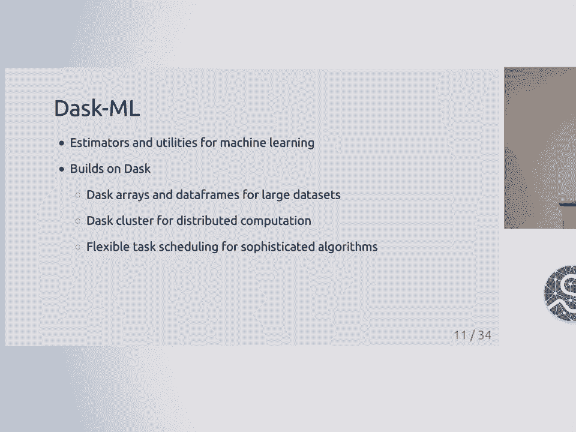

**总结**：你编写熟悉的 NumPy、Pandas 或 Python 函数调用，并用一点 Dask 特定的 API 将它们串联起来。执行时，会生成一个计算图，该图由 Dask 调度器并行执行。最终，你可以将具体结果存储到硬盘或收集回客户端应用程序。

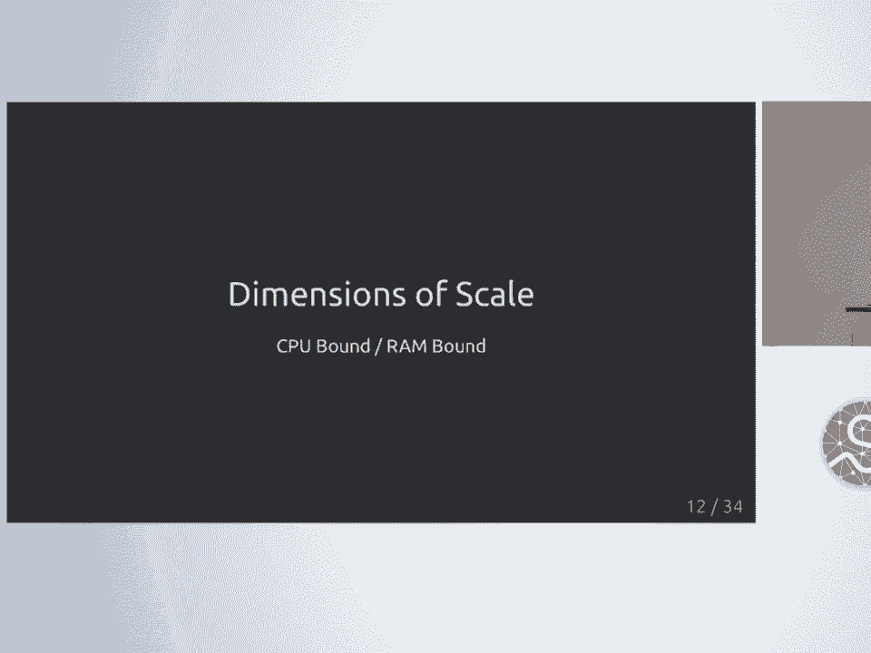

---

## Dask-ML 的目标 🎯

上一节我们了解了 Dask 的基础，本节中我们来看看专门为机器学习构建的 Dask-ML。

Dask-ML 试图在 Dask 之上构建，以简化机器学习工作流的扩展。它提供了机器学习的**估计器**和**工具**。这些工具建立在 Dask 之上，其中一些可以使用 Dask 特定的数据结构（如 Dask 数组或 Dask DataFrame）来处理无法装入内存的数据集。同时，它们也利用 Dask 来利用集群中的多个 CPU 进行分布式计算，当你的主要工作负载受 CPU 限制时尤其有用。

此外，Dask-ML 还为复杂的算法提供了灵活的任务调度。例如，对于迭代算法，你可以灵活地不预先定义整个计算图，而是发送一些计算，获取中间结果，判断是否收敛，然后根据需要异步地提交新的计算。这对于**超参数搜索**等场景也很有用。

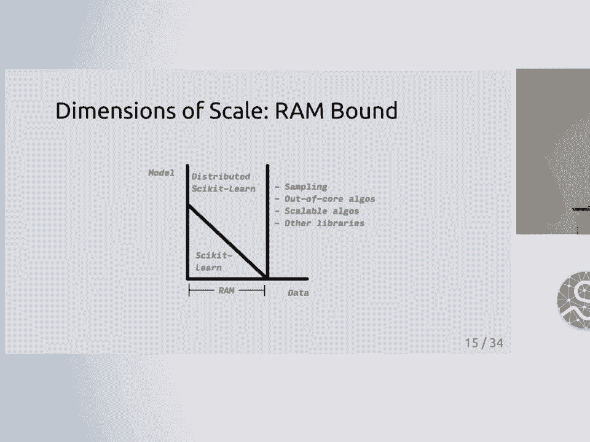

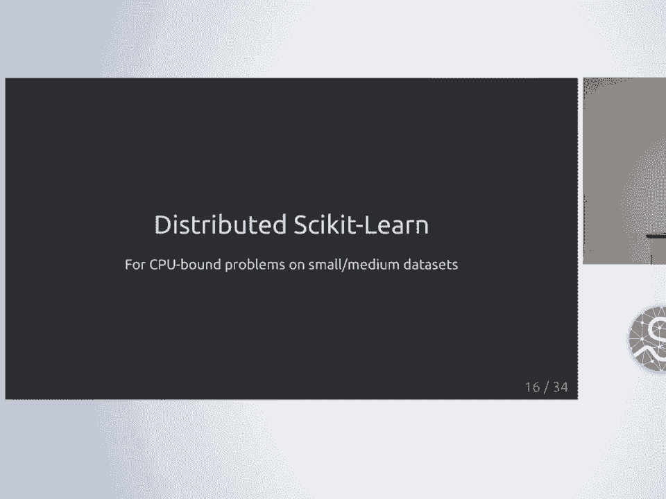

---

## 扩展机器学习工作流的两个维度 📈

扩展机器学习工作流有两个不同的维度：一是受 **CPU 限制**的任务，二是受 **RAM（内存）限制**的任务。本质上，一个是计算轴，另一个是数据轴。

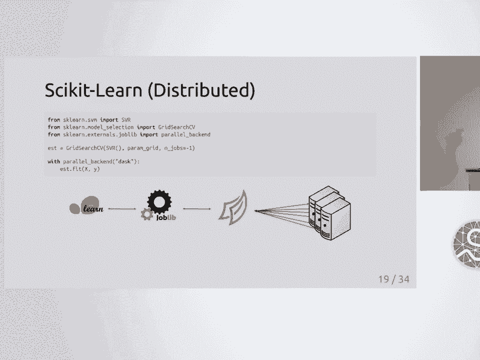

如果你在单机上使用 scikit-learn，可能会受到以下限制：
1.  **模型复杂度**：例如，进行大型网格搜索可能需要单 CPU 数小时的计算。
2.  **内存容量**：因为 scikit-learn 主要使用 NumPy 作为数据结构，大多数算法期望整个数据集都位于内存中。

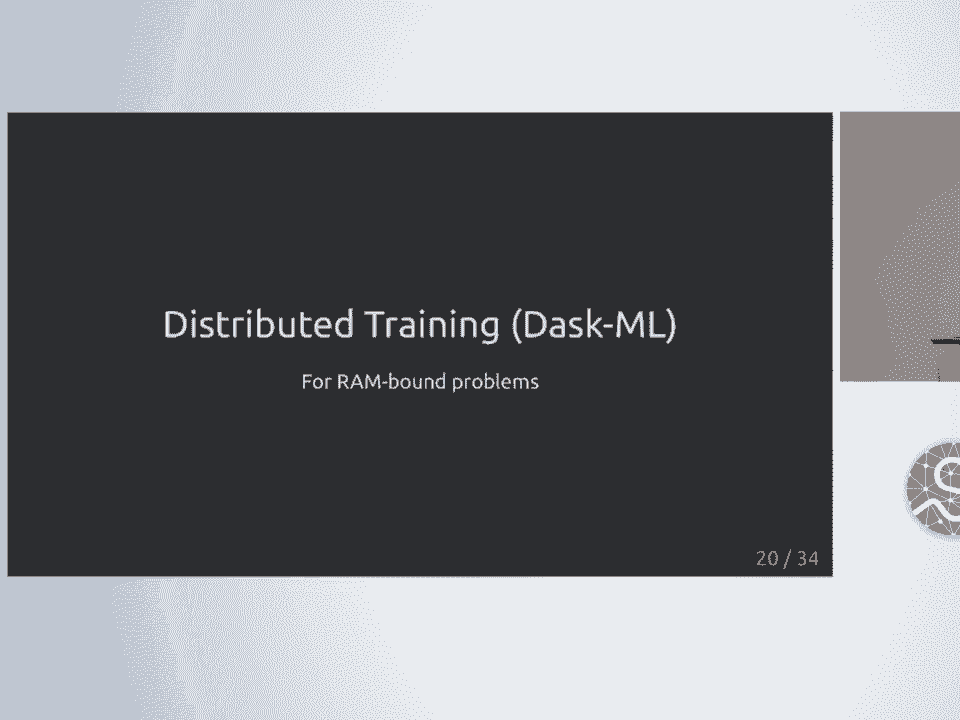

通常，数据集越大，计算时间也越长，因此你也可能受到计算能力的限制。这就形成了一个三角关系。

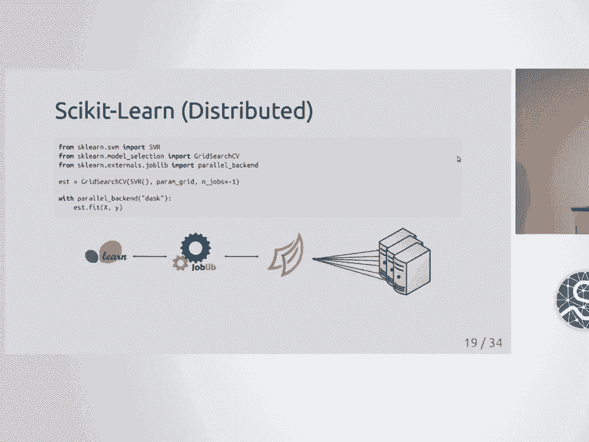

以下是两种主要的扩展方案：

**方案一：计算扩展（数据可装入单机内存）**
如果你的数据足够小，可以装入单节点内存，你可以利用多台机器，在这些机器上复制相同的训练数据集，但在不同的机器上运行独立的模型。例如，进行网格搜索或集成决策树（如随机森林）时，这些是**令人尴尬的并行**任务。为此，你可以利用所谓的“分布式 scikit-learn”，这本质上是将 scikit-learn 内置的 `joblib` 并行引擎与 Dask 分布式系统集成。这是第一种集成选项。

**方案二：数据扩展（数据无法装入单机内存）**
第一种选择是对数据进行**子采样**，使其能装入单节点，看看是否可行，因为有时这就足够了。如果不行，则可以利用 Dask 数组或 Dask DataFrame 实现**核外算法**。或者，你也可以使用 Dask 原语实现可扩展算法，或者重用外部库（如 XGBoost），并使用 Dask 作为编排器，以便轻松地将分布式 XGBoost 集成到运行在集群上的标准 Python 流水线中。

接下来，我们将更详细地探讨每种选项。

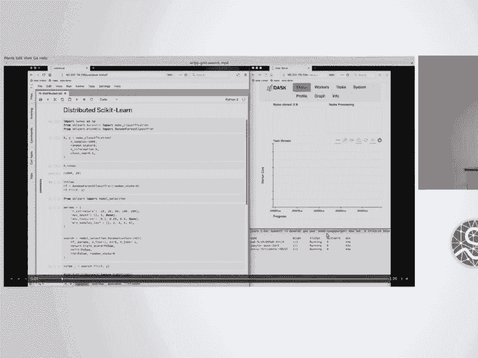

---


## 方案一：扩展 CPU 密集型任务（中小型数据集）💻

上一节我们概述了两种扩展路径，本节我们首先关注第一种：针对可装入单机内存的中小型数据集的 CPU 密集型操作。

传统的做法是使用 scikit-learn，并通过 Dask 来实现扩展。Dask 提供集群计算调度器，我们将数据加载到集群每个工作节点的内存中的一个 NumPy 数组中，而 scikit-learn 则提供估计器的数学逻辑。

在单机上使用 scikit-learn 进行超参数搜索的典型方式如下（这是一个令人尴尬的并行任务）：
```python
# 传统单机 scikit-learn 方式
from sklearn.model_selection import GridSearchCV
from sklearn.ensemble import RandomForestClassifier

param_grid = {'n_estimators': [10, 50, 100], 'max_depth': [None, 10, 20]}
grid_search = GridSearchCV(estimator=RandomForestClassifier(),
                           param_grid=param_grid,
                           cv=5,
                           n_jobs=-1) # 使用尽可能多的 CPU 核心
grid_search.fit(X, y)
```
当你调用 `fit` 时，scikit-learn 会调用 `joblib`，根据任务类型使用进程或线程在单机的多个 CPU 核心上并行运行。

在 `joblib` 的最新版本中，我们引入了断开默认的基于线程或进程的并行机制，转而与 Dask 调度器通信以在机器集群上运行的能力。要实现这一点，你只需要使用 `parallel_backend` 上下文管理器。

以下是修改后的代码：
```python
# 使用 Dask 作为后端的分布式 scikit-learn
from sklearn.externals.joblib import parallel_backend

with parallel_backend('dask'):
    grid_search.fit(X, y)
```
你只需添加这一行代码，即可将此次调用置于分布式调度器的上下文中运行，其余代码保持不变，因为它内部仍然使用 `joblib`，这只是连接层。

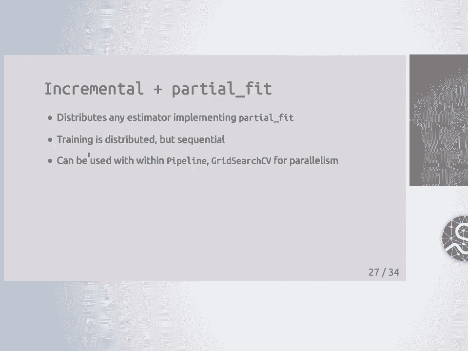

**演示概要**：在一个运行于 Kubernetes 集群上的 Jupyter Notebook 中，我们可以配置 Dask 与 Kubernetes 集群通信以添加额外的工作节点。当执行网格搜索时，`joblib` 分发工作，Dask 会与 Kubernetes 通信动态分配更多计算资源以尽快完成工作。计算完成后，所有资源都会被释放，避免在交互式数据分析中浪费集群资源。

---

## 方案二：扩展到更大的数据量（数据无法装入单机内存）🗃️

上一节我们探讨了计算扩展，本节我们来看看第二个扩展轴：如何处理无法装入单机内存的更大数据量。

首先，你需要判断是否真的需要处理全部数据。有时，对数据进行采样（例如 10%，然后 20%），用交叉验证拟合两个模型，可能会发现准确率的提升非常缓慢。因此，如果数据不合适，使用集群的计算资源可能是完全无用的。首先使用学习曲线进行此类合理性检查。

其次，训练是否需要所有数据？有时，只有推理步骤成本很高，因为你可能只有有限数量的带标签训练数据，却有大量未标记数据需要分类（例如，在天文图像中检测特殊事件）。在这种情况下，真正需要扩展的是 `predict` 函数（推理步骤）。这是一个非常令人尴尬的并行任务，Dask-ML 提供了一种简单的方法来包装任何 scikit-learn 估计器以并行化 `predict` 函数。

但如果确实需要进行分布式训练，你有两个选择：
1.  **包装支持增量学习的 scikit-learn 模型**：使用具有 `partial_fit` 方法的 scikit-learn 模型进行增量学习。Dask-ML 提供了一个高层 API 来包装 scikit-learn 模型，使其能够在分布在集群内存中的 Dask 数组上运行。即使模型是顺序的，这种方式也使其能够扩展到核外计算。
2.  **重新实现可扩展算法**：Dask-ML 也正在重新实现越来越多的估计器，以直接内部利用 Dask 的并行机制。但这有时需要重新设计算法，因为我们不能再假设所有数据都在单个节点的内存中。

要使用第一种策略（包装具有 `partial_fit` 方法的 scikit-learn 模型），每个估计器将一次在一个数据块（小批量）上进行训练，然后可以释放该块，模型参数将以这种方式逐步更新。Dask 集合已经是分块的，其底层是分块的 NumPy 数组数据结构（Dask 数组的后端）。因此，我们可以很自然地将这两个概念结合起来。

在单机上手动进行核外循环的 scikit-learn 代码如下：
```python
# 手动核外循环
from sklearn.linear_model import SGDClassifier
import numpy as np

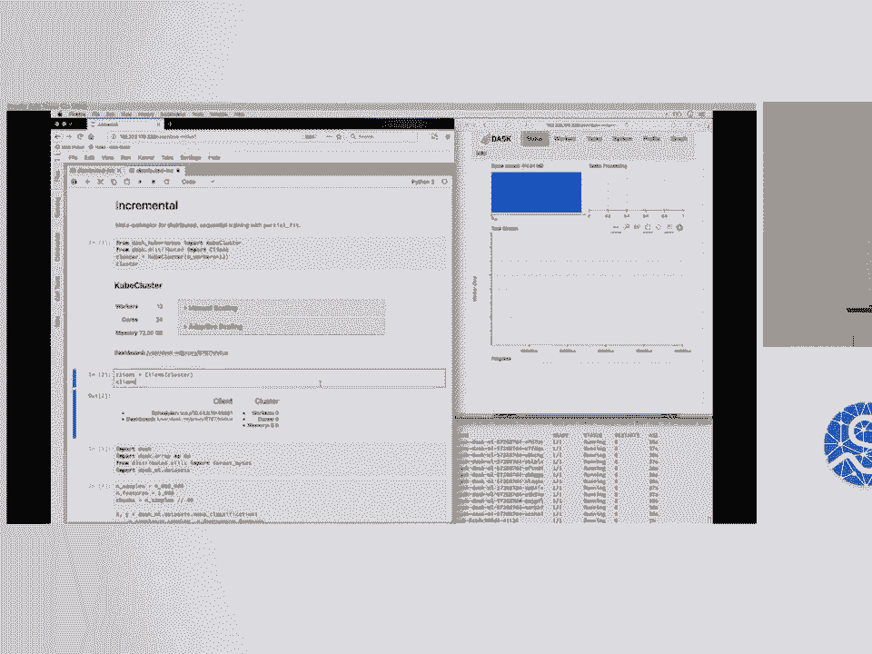

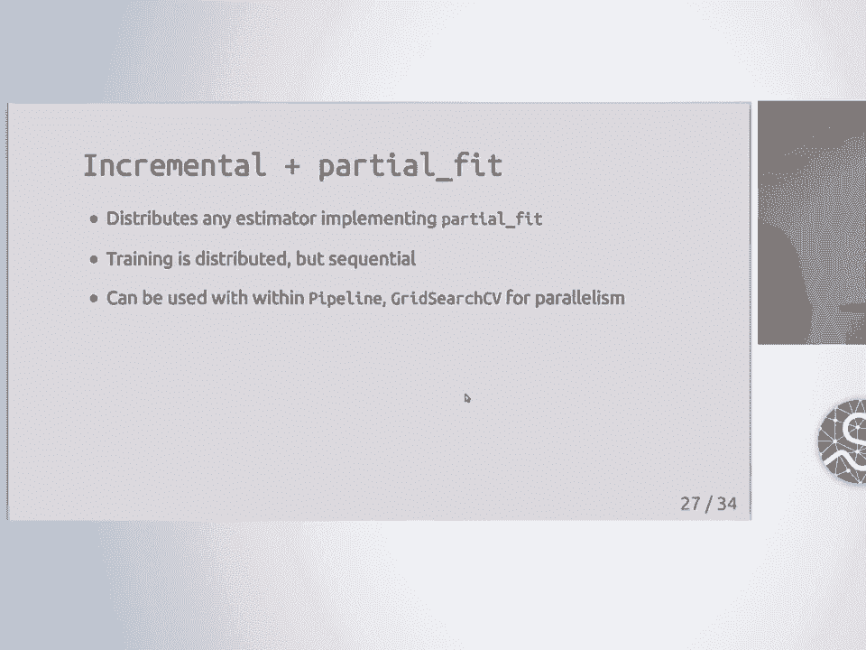

class DataStream:
    def __init__(self, data, chunk_size):
        self.data = data
        self.chunk_size = chunk_size
        self.n_chunks = len(data) // chunk_size
    def __iter__(self):
        for i in range(self.n_chunks):
            yield self.data[i*self.chunk_size:(i+1)*self.chunk_size]

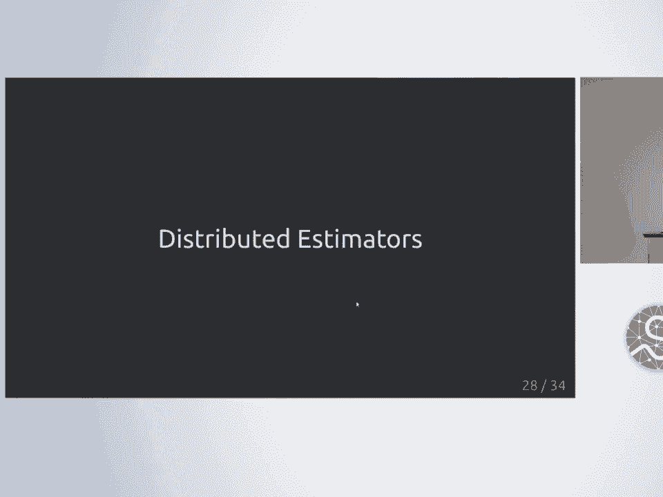

model = SGDClassifier()
for X_chunk, y_chunk in zip(DataStream(X, 1000), DataStream(y, 1000)):
    model.partial_fit(X_chunk, y_chunk, classes=np.unique(y))
```
你可以手动调用 `partial_fit` 循环，对于每个数据块，递增地更新模型状态，直到遍历完所有数据，Python 的垃圾回收器会释放不再需要的过去数据块。

而使用 Dask-ML，你可以将 scikit-learn 估计器包装到 `Incremental` 元估计器中，然后像往常一样调用 `fit`。但这里的 `X_big` 和 `y_big` 实际上是 Dask 数组，它们可能无法装入单个节点，而是分区存储在集群多个节点的内存中，甚至如果内存装不下，可以存储在磁盘上。
```python
# 使用 Dask-ML Incremental 包装器
from dask_ml.wrappers import Incremental
from sklearn.linear_model import SGDClassifier

model = SGDClassifier()
wrapped_model = Incremental(model, scoring='accuracy')
wrapped_model.fit(X_big, y_big, classes=np.unique(y_big))
```

**演示概要**：在连接到 Kubernetes 集群的 Jupyter 会话中，我们使用 Dask 生成一个指定大小的假分类问题数据集，并将其分配在工作节点上。总共有 32 GB 的 RAM 分布在集群的不同节点上。我们定义一个具有 `partial_fit` 方法的 `SGDClassifier`，用 Dask-ML 的 `Incremental` 包装器包装它，然后对分布在集群内存中的 `X` 和 `y` 调用 `fit`。在诊断页面上，可以看到计算图任务依赖关系，以及代表 `partial_fit` 调用的红点在不同数据块间移动。模型（体积很小）在工作节点间移动，有时会有红色的数据传输，因为 `X` 块和 `y` 块最初可能没有分配在同一个节点上。计算完成后，所有 Kubernetes Pod 都会被终止，资源被垃圾回收，释放给集群上的其他用户。

---

## Dask-ML 中的分布式估计器 ⚙️

除了包装现有模型，Dask-ML 也提供了一些完全重构的分布式估计器，它们内部使用 Dask 原语并在 `fit` 方法中利用分布式计算。

典型的用例包括：
*   **广义线性模型**：例如逻辑回归和线性回归，它们使用 Dask 优化的并行算法（如 ADMM 和 LBFGS），能够充分利用集群上的 CPU。但请注意，根据数据形状和结构，有时顺序算法（如 SAGA）可能比分布式算法收敛得快得多，后者会消耗更多能量和 CPU。因此，请明智选择算法。
*   **K-Means 聚类**：具有可以并行运行的特定初始化方案（K-Means++ 的并行变体）。这种策略在 Spark 中也有实现。
*   **标准预处理**：如分位数转换器、标准缩放器、鲁棒缩放器，这些可以自然地实现令人尴尬的并行，并且即使在数据无法装入内存时也能在 Dask 数组上工作。
*   **计算密集型步骤**：如 PCA，其线性代数运算（如 SVD）已使用随机 SVD 重新实现，以在集群上分布式运行。这建立在 Dask 的线性代数子模块中，并包装为 Dask-ML 估计器。
*   **XGBoost 包装器**：XGBoost 可以配置为在集群上运行，但配置所有节点、工作器相互通信并从 Python 调用可能非常复杂。Dask-ML 提供了一个高层包装器，你只需指定想在 Dask 集群上运行，它会自动启动 XGBoost 工作器，这是进行大规模梯度提升树的一种非常高效的方式。

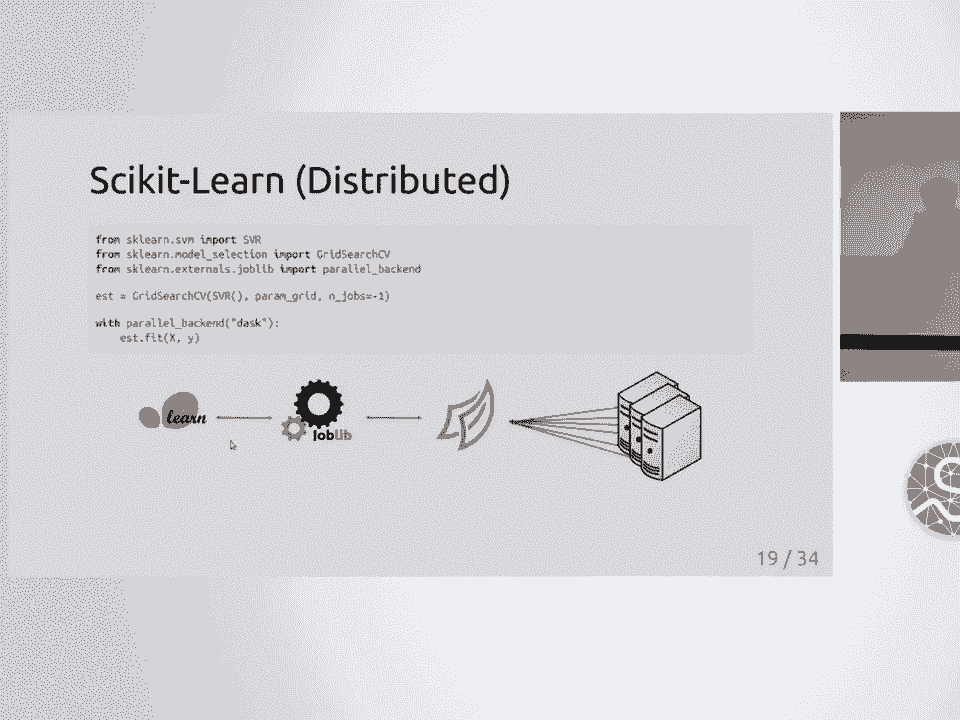

---

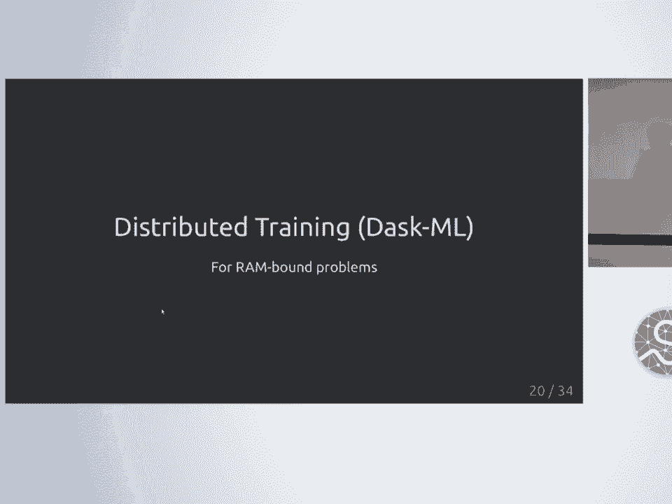

## 集群部署说明 ☁️

在演示中，我们使用了一个基于 **Pangeo 项目**配置的小型测试集群，这是一个使用 Dask、Jupyter Hub 和 Xarray 的可扩展分析地球科学平台。我们使用了 Dask-Kubernetes 连接器，它能够根据 Dask 调度器中的队列自适应地调度和部署额外的 Pod。

同样类型的操作也可以在传统的学术 HPC 集群上运行，例如使用 SLURM、PBS 或 SGE。目前正在开发中，这种自适应供应额外工作节点的功能也正在集成到这些系统中。

最后，也有可能在 Hadoop 集群上运行，基本上使用 YARN 应用程序管理器来调度工作节点。目前是静态的（需要指定工作节点数量），但未来也会实现动态扩展。

**自适应扩展**非常重要，因为在使用 Jupyter Hub 进行交互式探索时，大部分时间你都在编写代码或绘制结果图，在此期间实际上不需要资源，因此可以释放它们。一旦启动一个可并行的计算密集型步骤，它将动态地重新配置集群的大部分可用资源，以尽快运行该步骤，减少分析延迟，获取结果，然后释放资源，以便其他数据科学家即使在你的工作负载不是很并行的情况下，也能在同一集群上运行。这使得与不同用户共享集群成为可能，而不会因为你知道工作节点中确切有多少内存而导致内存耗尽。

---

## 总结 📝

本节课我们一起学习了如何使用 Dask 扩展 Python 机器学习工作流。我们首先介绍了 Dask 作为并行计算框架的核心概念，它通过构建计算图来调度任务在集群上并行执行。接着，我们探讨了 Dask-ML 的目标，即在此之上简化机器学习流程的扩展。

我们深入分析了扩展机器学习工作流的两个关键维度：**计算扩展**（针对 CPU 密集型任务和可装入内存的数据集）和**数据扩展**（针对无法装入单机内存的大数据集）。对于计算扩展，我们学习了如何通过 `joblib` 的 `parallel_backend` 将 scikit-learn 的并行任务无缝分发到 Dask 集群。对于数据扩展，我们介绍了两种策略：一是利用 Dask-ML 的 `Incremental` 包装器对支持增量学习的 scikit-learn 模型进行核外训练；二是使用 Dask-ML 原生实现的分布式估计算器。

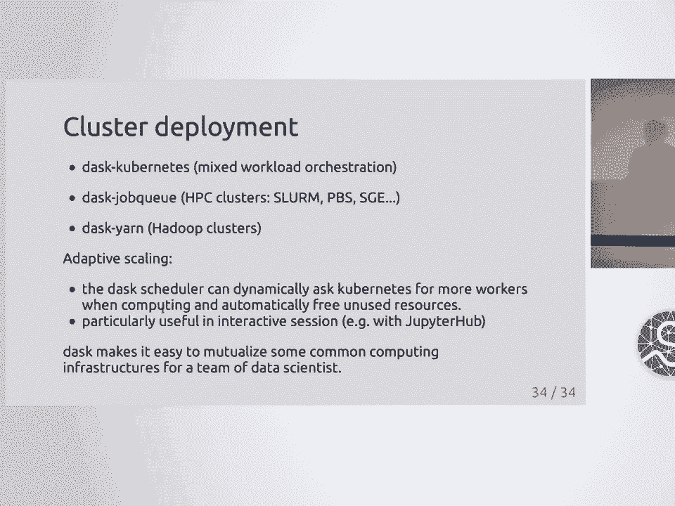

此外，我们还简要了解了 Dask-ML 中提供的其他分布式估计器（如线性模型、K-Means、预处理工具、PCA 和 XGBoost 包装器）以及集群部署和自适应扩展的重要性。通过结合这些工具和策略，数据科学家可以有效地利用分布式计算资源，处理更大规模的数据和更复杂的模型，同时保持 Python 数据科学生态系统的易用性和灵活性。