# 32：scikit-learn 与表格数据：弥合差距 🧩

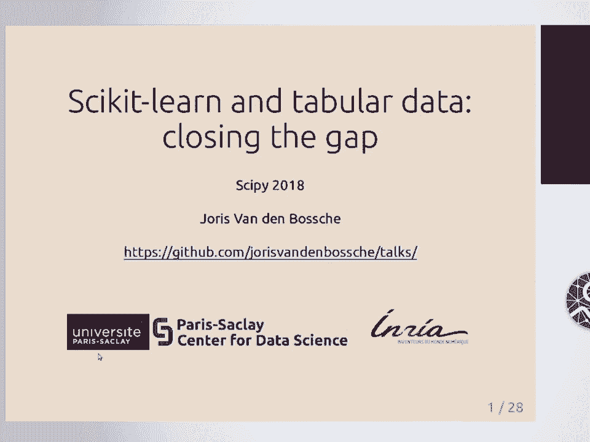

在本课程中，我们将学习如何更有效地将 scikit-learn 机器学习库与 pandas 表格数据结合使用。我们将探讨传统方法的局限性，并介绍 scikit-learn 0.20 版本及一些外部包带来的新功能，以构建更健壮、更便捷的数据处理管道。

---

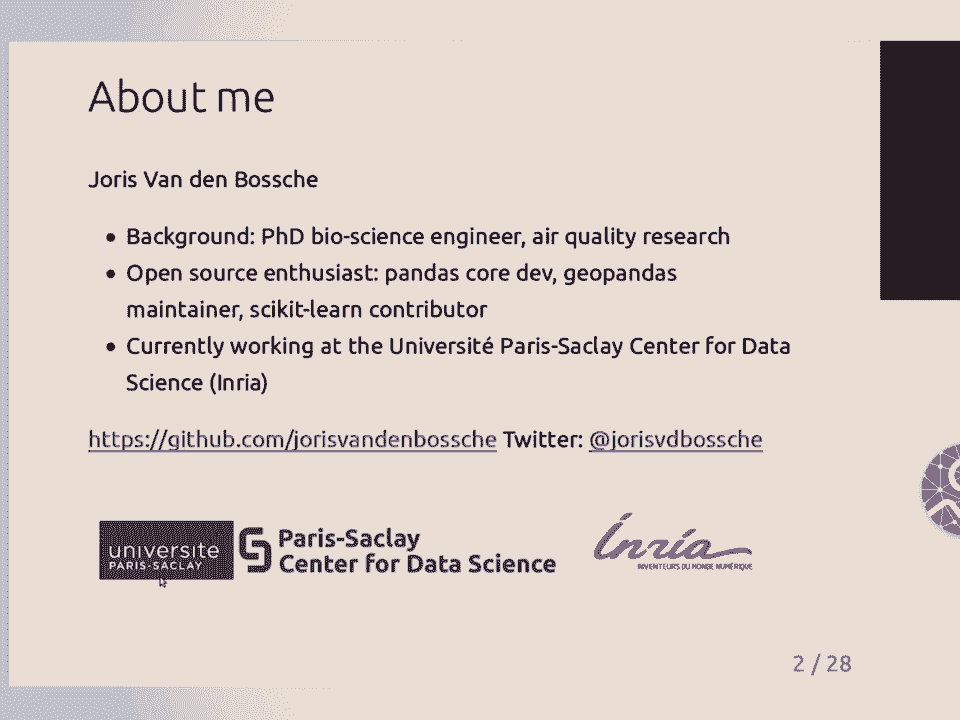

我叫 Joris van den Bossche。这个名字发音有些困难，这很正常。

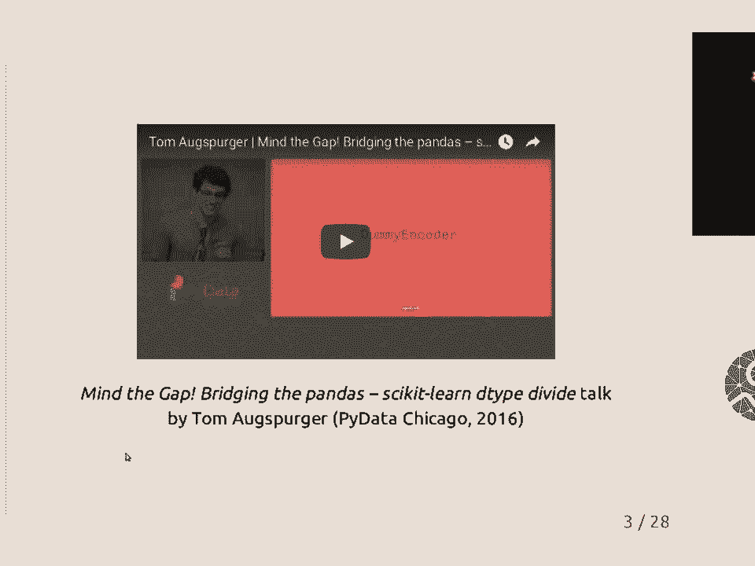

我来自比利时，是 pandas 的核心开发者，目前就职于法国巴黎大学的数据科学实验室。这份工作使我在过去一年里也能为 scikit-learn 项目做出贡献，而我的演讲正是关于这些贡献。

如果你在周三的全体会议上看到了 scikit-learn 的更新，那么 Andy Mueller 已经提到了我将要谈论的大部分内容。所以，我的演讲基本上是他五分钟更新的扩展总结。

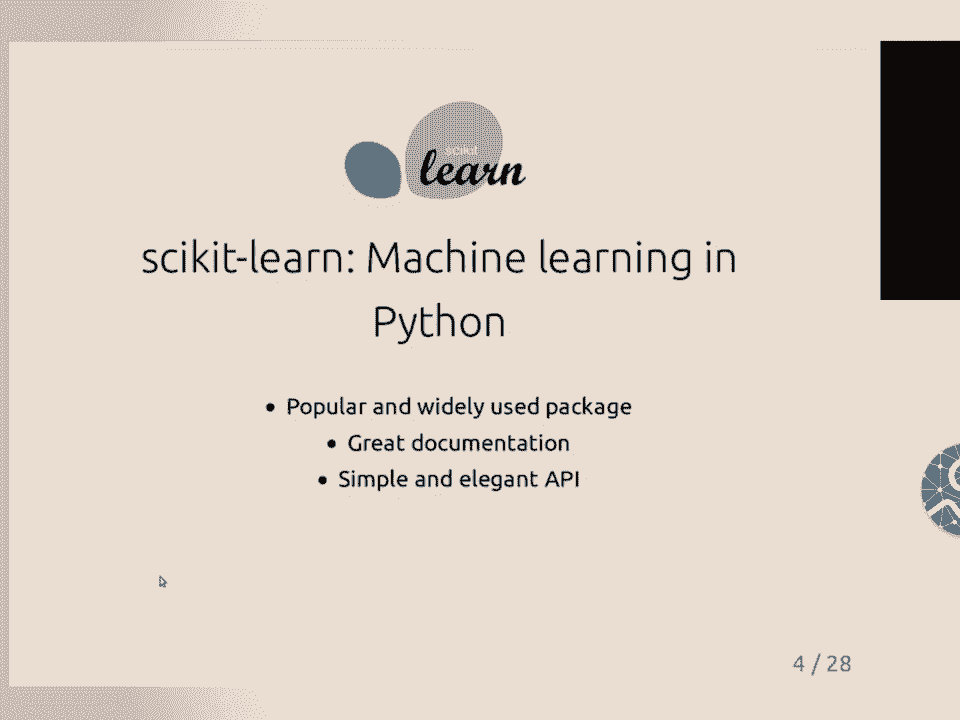

## 回顾 scikit-learn 的核心优势 🎯

在深入探讨困难之前，我们先退一步看看 scikit-learn 本身。scikit-learn 是一个极其流行、被广泛使用的 Python 机器学习库。它的优势在于拥有出色的文档，以及一个**简单、优雅且一致的 API**。我们将重点讨论最后一个方面。

### 一致的 API 模式

在 scikit-learn 中，模型的典型使用模式是 `fit` 和 `predict`。例如，使用随机森林分类器：

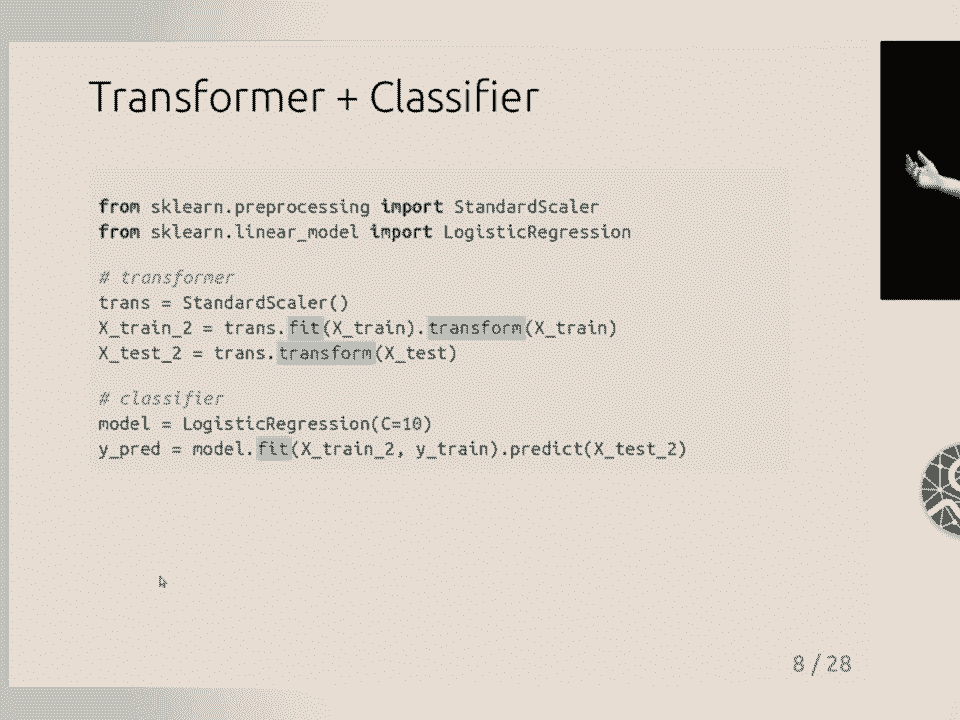

```python
from sklearn.ensemble import RandomForestClassifier
model = RandomForestClassifier()
model.fit(X_train, y_train)
predictions = model.predict(X_test)
```

这种 API 在整个库中保持一致。你可以轻松地将 `RandomForestClassifier` 替换为 `LogisticRegression`，而代码结构保持不变。

### 转换器与管道

除了预测，我们经常需要转换数据。scikit-learn 引入了**转换器**的概念，例如 `StandardScaler`。其 API 是 `fit` 和 `transform`：

```python
from sklearn.preprocessing import StandardScaler
scaler = StandardScaler()
scaler.fit(X_train)
X_train_scaled = scaler.transform(X_train)
X_test_scaled = scaler.transform(X_test)
```

在实践中，预处理和模型训练通常结合在一起。手动操作步骤繁琐，因此 scikit-learn 提供了 **`Pipeline`** 对象来自动化这一过程：

```python
from sklearn.pipeline import Pipeline
pipeline = Pipeline([
    (‘scaler‘, StandardScaler()),
    (‘classifier‘, LogisticRegression())
])
pipeline.fit(X_train, y_train)
predictions = pipeline.predict(X_test)
```

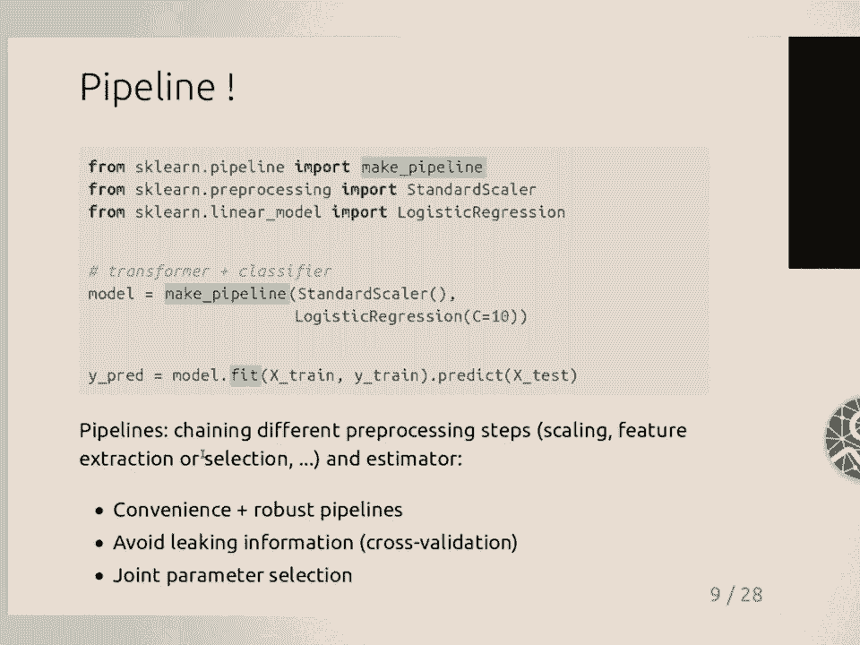

**管道** 可以链接多个预处理步骤（如缩放、特征提取、特征选择）与最终的估计器。它使代码更简洁，能确保预处理在训练数据和测试数据上一致执行，并且在交叉验证中防止信息泄露。它还能与网格搜索结合，优化管道中任何步骤的参数。

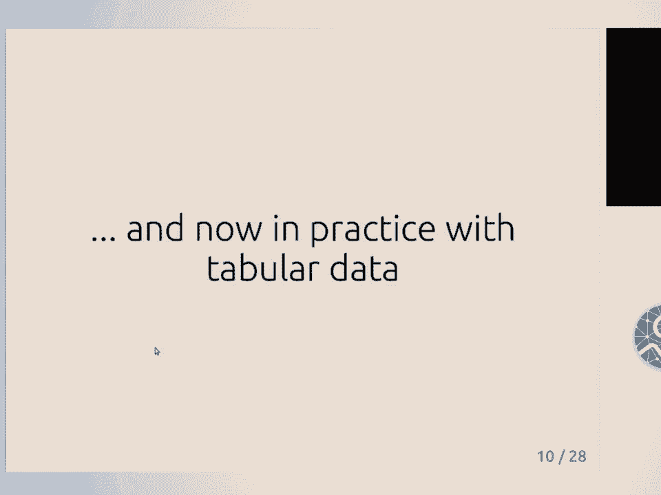

然而，在实际处理表格数据时，使用管道并不容易。

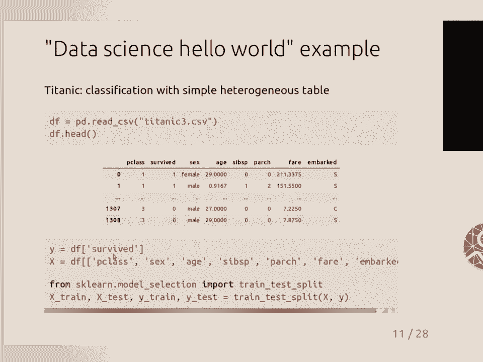

## 处理表格数据时的挑战 📊

许多人的数据是**表格型、异构的**，即 pandas DataFrame 包含数值列和分类列。使用管道对象处理这类数据存在困难。

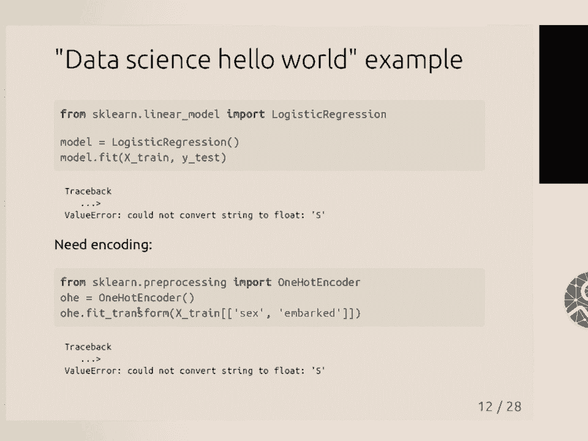

### 一个基础示例：泰坦尼克数据集

我们以泰坦尼克数据集为例。它包含数值列（如年龄、票价）和分类列（如性别、船舱等级）。我们想用 scikit-learn 预测乘客是否幸存。

**天真的尝试**是直接将逻辑回归应用于原始数据，但这会失败，因为逻辑回归期望数值输入矩阵。


**下一步尝试**是使用 scikit-learn 的 `OneHotEncoder` 对分类列进行编码。但不幸的是，旧版本的 `OneHotEncoder` 无法直接处理字符串数据。

因此，用户不得不寻找各种变通方法，例如结合 `LabelEncoder` 和 `OneHotEncoder`，或者退而使用 pandas：

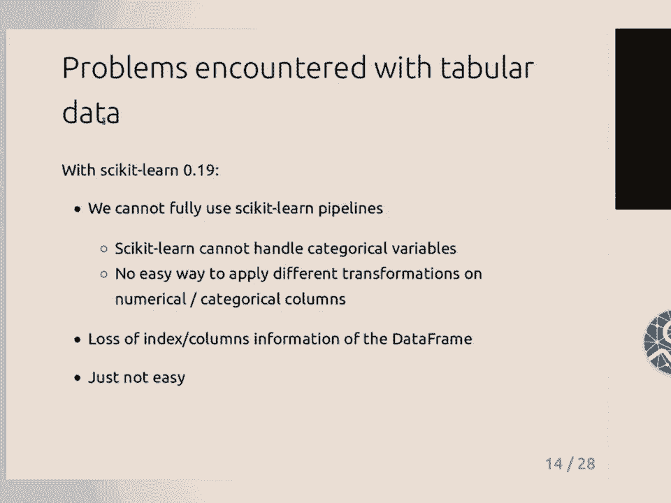

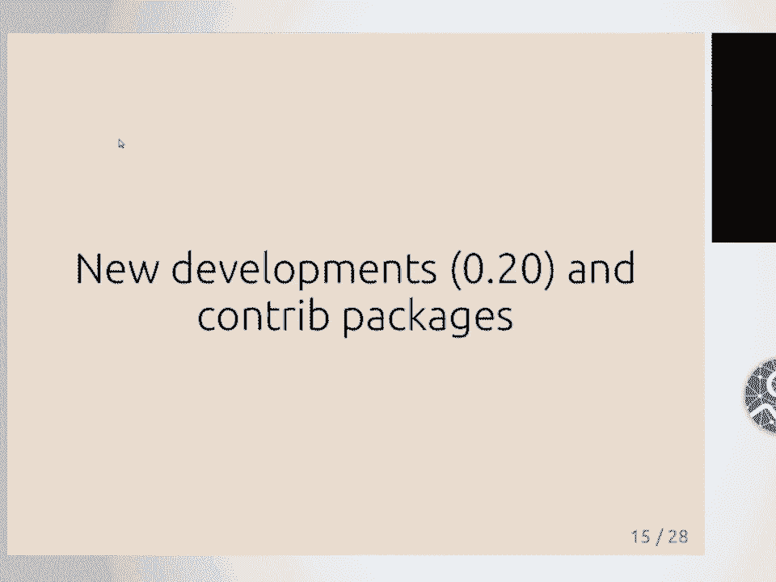

```python
import pandas as pd
# 使用 pandas 进行缺失值填充和独热编码
df_filled = df.fillna(...)
df_encoded = pd.get_dummies(df_filled, columns=[‘Sex‘, ‘Embarked‘])
```

`pd.get_dummies` 功能强大且易用。但问题是，这些变通方法阻碍了**管道**的正确使用，而管道的重要性我们之前已经强调过。

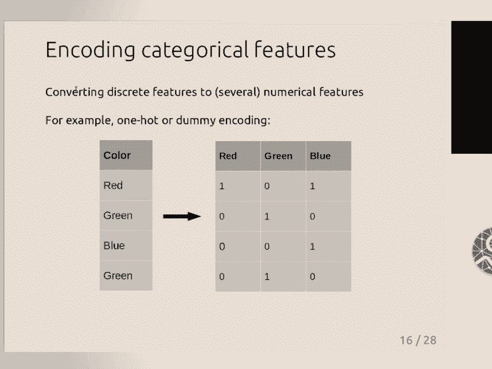

### 现有问题总结

使用当前版本的 scikit-learn，我们无法充分利用管道，因为：
1.  scikit-learn 不能很好地处理分类列。
2.  不易对不同的特征应用不同的转换。
3.  我们会丢失 DataFrame 的许多信息（如行标签、列标签）。

这使得两者结合使用并不容易。

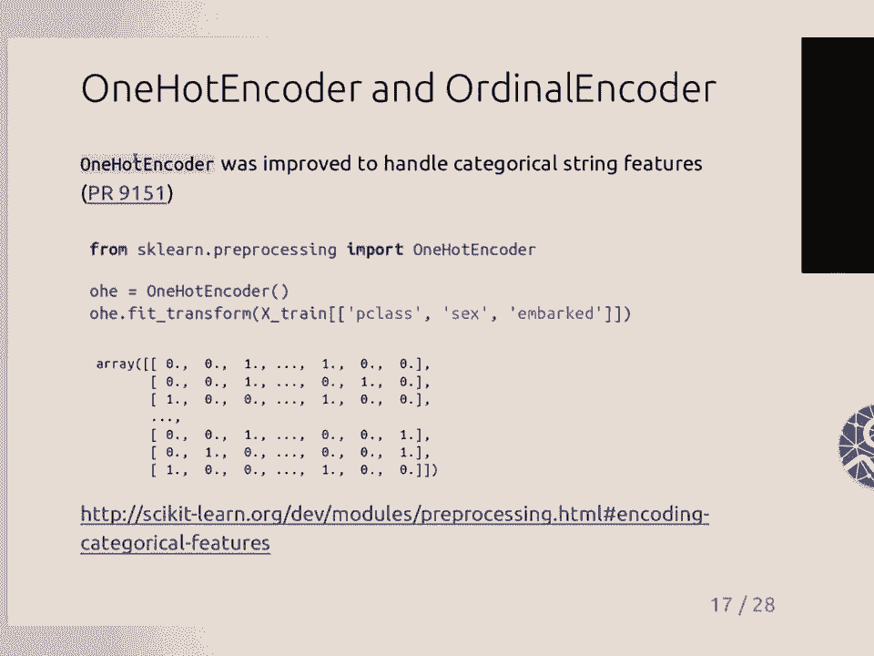

## 弥合差距的新进展 🛠️

接下来，我将介绍 scikit-learn 的新发展以及一些外部包，它们试图让这一切变得更容易。

### 1. 处理分类变量

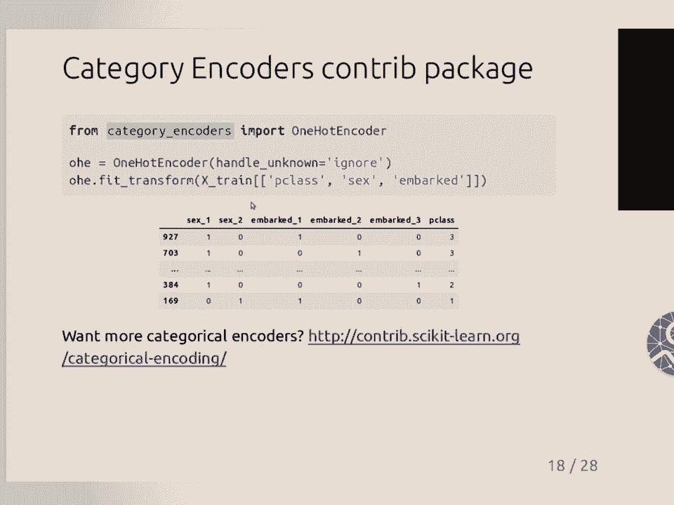

首先需要处理的是分类变量。我们需要将离散特征（如字符串形式的颜色）转换为数值特征。最常用的方法之一是**独热编码**，它将单列转换为多列的 0/1 指示器。

scikit-learn 的 `OneHotEncoder` 现在（0.20版本）终于可以**正确处理字符串分类特征**了。

```python
from sklearn.preprocessing import OneHotEncoder
encoder = OneHotEncoder()
# 假设 `categorical_cols` 是分类列名的列表
X_encoded = encoder.fit_transform(df[categorical_cols])
```

此外，还新增了 `OrdinalEncoder`，它可以将分类特征转换为单列的整数编码（0, 1, 2...）。

**外部包推荐：`category_encoders`**
这个贡献包早已提供了能处理字符串的独热编码器。除了与 scikit-learn 改进版类似的功能外，它还能输出 DataFrame，并且提供了更多编码方式，如 `BinaryEncoder`、`TargetEncoder` 等。

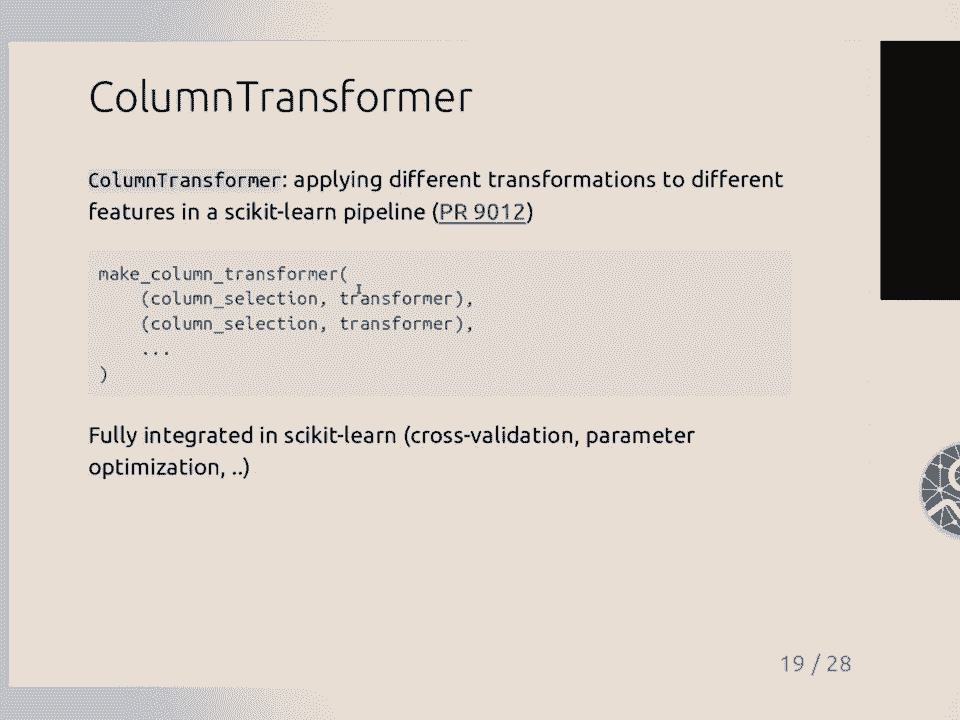

处理分类特征已经变得更好了，但我们仍然需要明确指定哪些列要传递给编码器。为了能将其放入完整的管道中，我们需要更强大的工具。

### 2. 列转换器

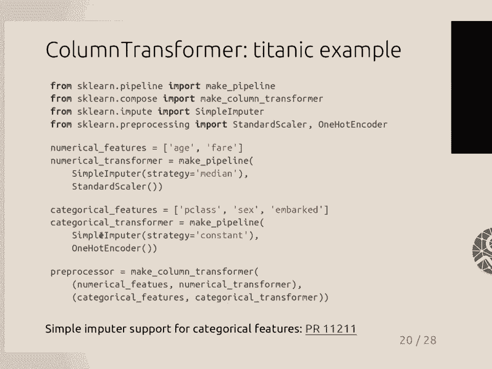

我们引入了 **`ColumnTransformer`**。它的作用是：对指定的列应用特定的转换器。

`make_column_transformer` 函数允许你进行列选择。列选择可以是列名列表、整数索引列表、布尔掩码，甚至是一个能根据数据返回选择结果的函数。转换器可以是任何遵循 scikit-learn API 的转换器，也可以是一个转换器管道。它完全集成在 scikit-learn 生态中，支持交叉验证和参数优化。

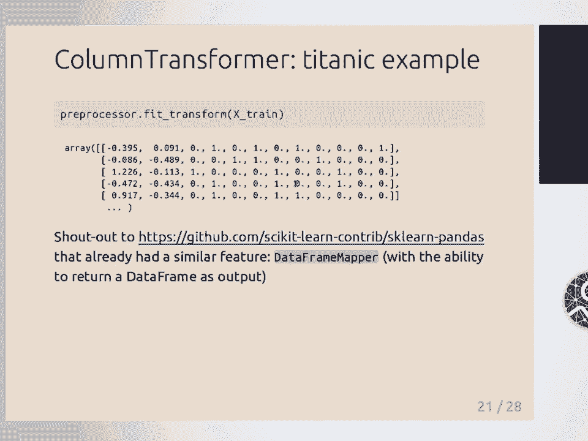

### 构建完整的泰坦尼克数据处理管道

现在，我们可以为泰坦尼克数据集构建一个完整的预处理流程：

```python
from sklearn.compose import make_column_transformer
from sklearn.impute import SimpleImputer
from sklearn.preprocessing import StandardScaler, OneHotEncoder

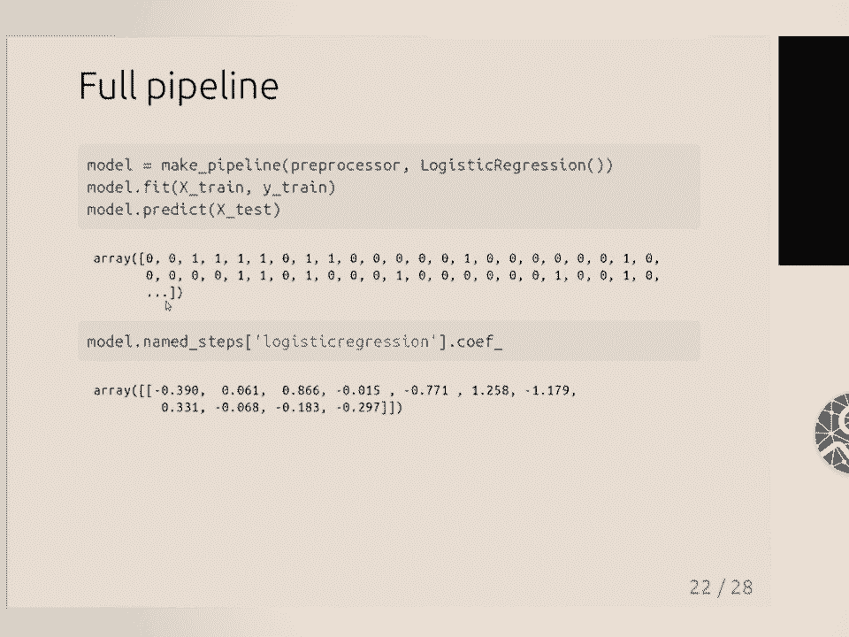

numeric_features = [‘Age‘, ‘Fare‘]
categorical_features = [‘Sex‘, ‘Embarked‘, ‘Pclass‘]

preprocessor = make_column_transformer(
    (SimpleImputer(strategy=‘median‘), StandardScaler()), numeric_features),
    (SimpleImputer(strategy=‘most_frequent‘), OneHotEncoder()), categorical_features)
)
```

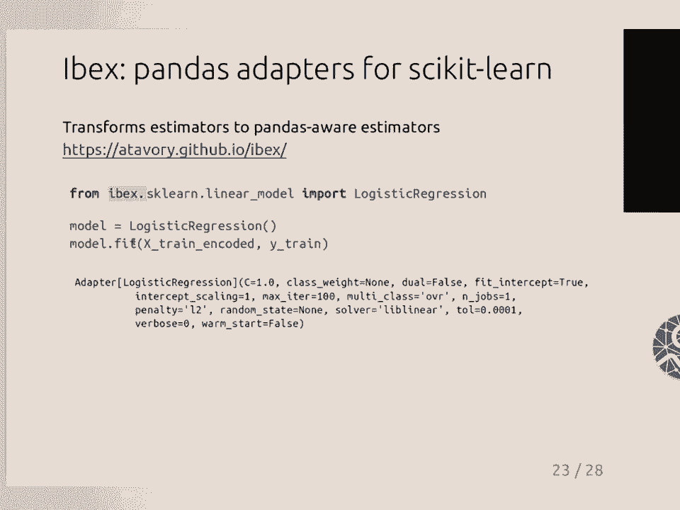

**注意**：`SimpleImputer` 也得到了改进，现在也支持分类特征。

现在，这个预处理器可以转换我们的数据，将标准化后的数值特征和独热编码后的分类特征组合输出。然后，我们可以将其放入一个完整的管道中：

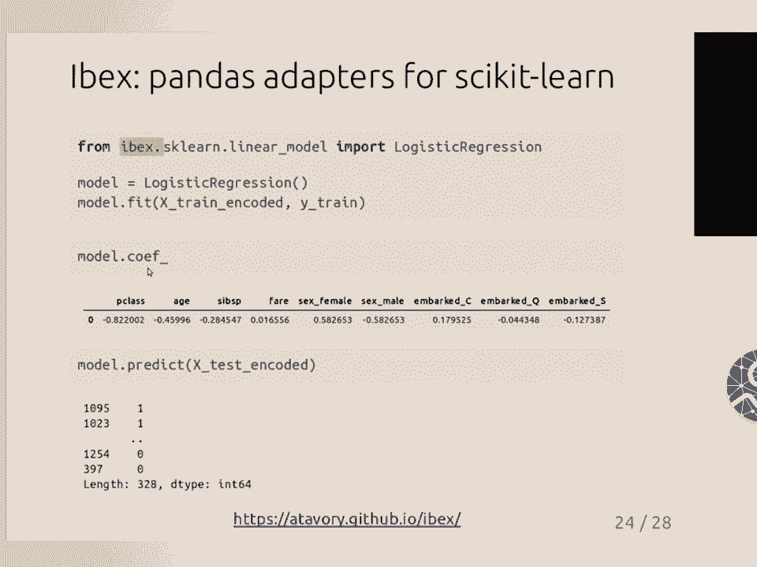

```python
from sklearn.pipeline import Pipeline
from sklearn.linear_model import LogisticRegression

pipeline = Pipeline([
    (‘preprocessor‘, preprocessor),
    (‘classifier‘, LogisticRegression())
])

pipeline.fit(X_train, y_train)
predictions = pipeline.predict(X_test)
```

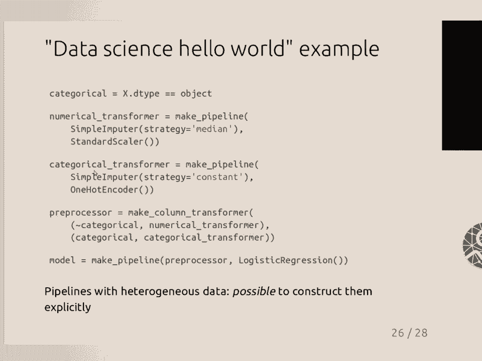

我们现在可以基于表格数据创建一个完整的管道。但需要注意的是，我们仍然丢失了原始数据的索引和列名信息。例如，很难直接将模型系数映射回原始特征。

### 3. 保持 DataFrame 信息：`ibex` 包

有一个名为 **`ibex`** 的包试图解决这个问题。它动态地适配 scikit-learn 对象，使其感知 pandas 数据结构。它会捕获输入，跟踪列和索引，并在返回结果时重新包装它们。

其 API 如下所示：

```python
# 从 ibex 导入，而不是直接从 sklearn 导入
from ibex.sklearn.linear_model import LogisticRegression
from ibex.sklearn.preprocessing import StandardScaler

model = LogisticRegression()
model.fit(X_train, y_train) # X_train 是一个 DataFrame
print(model.coef_) # 系数输出会保留列名
predictions = model.predict(X_test) # 预测输出会保留行索引
```

**请注意**：`ibex` 目前还很新，与 `ColumnTransformer` 的集成可能还不完善，但随着 scikit-learn 新版本的发布，这种情况有望改善。

## 总结与展望 📈

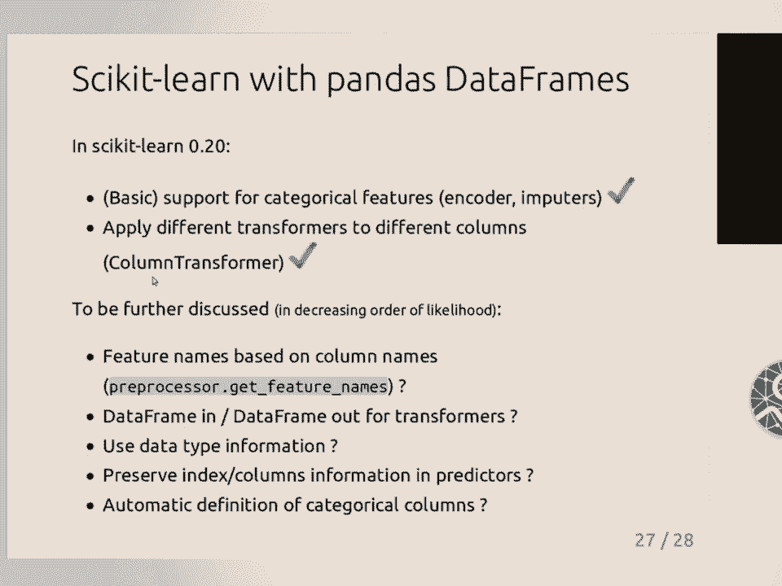

让我们回到最初的例子：一个基本的表格数据集，需要进行一些预处理并进行预测。

随着 scikit-learn 0.20 版本即将发布的新功能，我们现在可以构建一个管道来完成这个任务。scikit-learn 常说“让简单的事情简单，复杂的事情可能”。现在，构建这样的管道至少是**可能**的了，并且可以非常明确地处理数据集中不同的列和特征。

**主要进展**：
*   **基础分类特征支持**：已在 scikit-learn 主分支中。
*   **列转换器**：已在主分支中，用于应用不同的转换器。

**未来可能的改进方向**：
1.  **更好的特征名称支持**：在列转换器和编码器中更好地跟踪特征名称。
2.  **输出 DataFrame**：让转换器（如缩放器）也能输出 DataFrame。
3.  **更好地利用数据类型信息**：例如，如果 pandas DataFrame 的列是分类 dtype，`OneHotEncoder` 可以自动识别。
4.  **更自动化的分类列检测**：像 R 语言中那样，模型默认能同时处理数值和分类特征。但这需要谨慎设计，以保持 scikit-learn 明确、不“魔法”的 API 哲学。

总而言之，scikit-learn 的下一个版本在使其更容易直接处理表格数据方面，迈出了一大步。

---

**致谢**：感谢 scikit-learn 社区，为这个项目做贡献非常愉快。也感谢我的雇主让我能从事这项工作。

**Q&A 环节要点**：
*   `OneHotEncoder` 目前还没有添加选项来删除其中一列以避免多重共线性，但这是一个开放的议题，欢迎贡献。
*   关于聚类算法中传入邻接结构并获取索引标签的问题，建议咨询更熟悉该模块的开发者。
*   关于将 pandas 功能集成到 scikit-learn 的决策过程，这是一个在社区内经过长期讨论、逐步形成共识的过程，旨在平衡功能性与对 numpy 的兼容性。

---

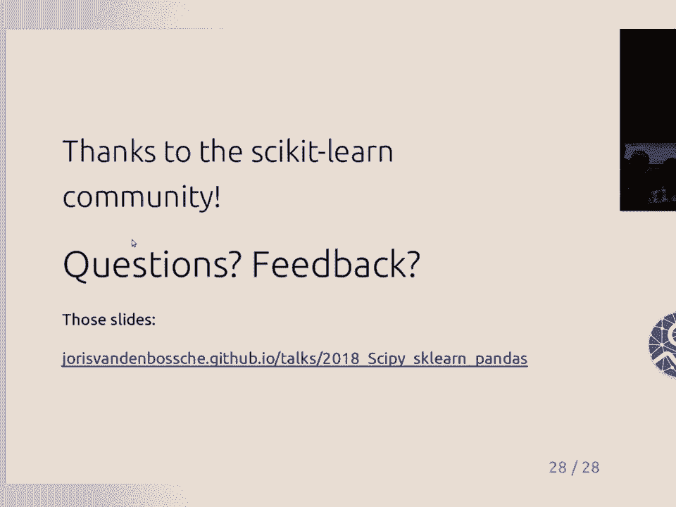

本节课中，我们一起学习了 scikit-learn 处理表格数据时遇到的挑战，并详细介绍了通过 `OneHotEncoder` 改进、`ColumnTransformer` 以及 `ibex` 等工具来构建强大、可维护的机器学习管道的方法。这些进展使得在保持 scikit-learn 优雅 API 的同时，处理真实的异构数据变得更加可行。