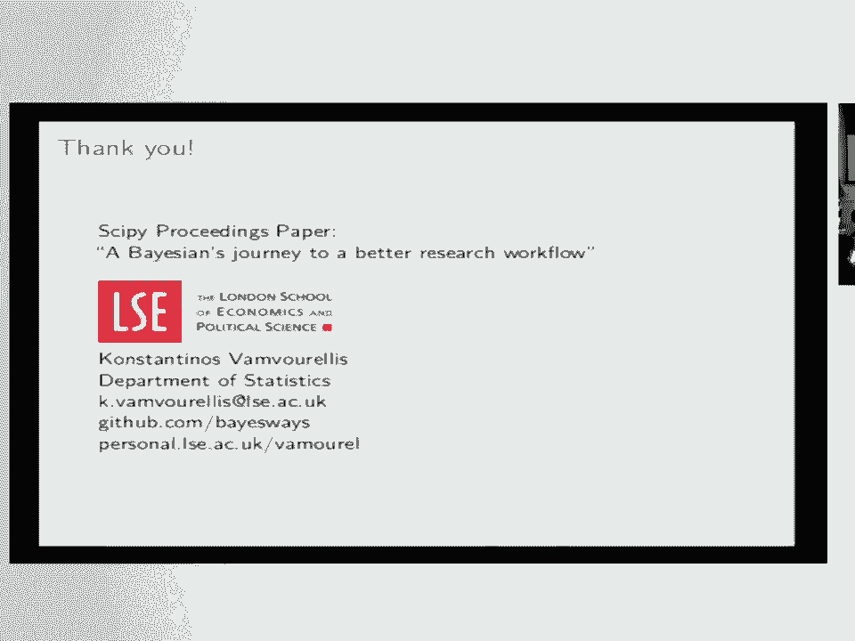

# 33：贝叶斯统计与Stan入门教程 🧪📊

在本课程中，我们将学习如何应用贝叶斯统计方法，特别是使用Stan工具，来分析临床试验数据，以评估药物是否应被批准。我们将从贝叶斯推断的基本概念开始，逐步深入到实际案例的应用。

---

## 概述

贝叶斯推断是一种统计方法，它通过结合先验知识和观测数据来更新对未知参数的信念。在药物审批的背景下，这种方法能提供关于治疗效果和不确定性的全面视图。

---

## 贝叶斯推断基础

上一节我们概述了课程内容，本节中我们来看看贝叶斯推断的核心思想。

### 什么是推断？

假设观测数据 **D** 是由一个带有参数 **θ** 的模型生成的。数据生成是正向过程，而推断则是反向过程：即根据观测到的数据 **D** 来确定与之兼容的参数 **θ**。

### 似然函数与先验分布

似然函数 `P(D|θ)` 表达了所选数据模型。贝叶斯方法的特点在于，通过引入关于参数的先验知识来修正这个似然函数。例如，如果你知道所有参数值必须大于18，这种范围知识就被编码到所谓的**先验分布** `P(θ)` 中。

### 后验分布

通过贝叶斯定理，我们将先验和似然结合，得到**后验分布** `P(θ|D)`。这就是贝叶斯分析的核心结果。

**贝叶斯定理公式：**
`P(θ|D) ∝ P(D|θ) * P(θ)`

后验分布是一个完整的概率分布，我们可以用它来计算感兴趣量的期望值。

### 数值计算

后验分布中的积分通常难以直接计算。在实践中，我们使用诸如**哈密顿蒙特卡洛（HMC）** 的算法来近似这些积分，从而从后验中抽取样本。

---

## 临床试验数据建模案例

理解了贝叶斯推断的基础后，本节我们将探索一个具体的应用案例：如何对临床试验数据进行建模。

我们关注的核心问题是：如何共同建模多种效应（例如疗效和不良反应）并理解它们的后验分布？

### 数据结构

数据通常包含两组受试者：**治疗组**和**对照组**。我们可能关注连续变量（如血糖水平）和二元变量（如是否出现恶心、消化不良）。

### 建模方法

一种简单的方法是分别对对照组数据 **Y_C** 和治疗组数据 **Y_T** 进行建模。参数 **θ** 是一个向量，包含：
*   **μ**: 总体均值效应
*   **σ**: 方差
*   **ρ**: 不同效应之间的相关性

贝叶斯推断的强大之处在于，它可以同时得到所有感兴趣变量的完整后验联合分布，这在使用简单模型时很难实现。

---

## 使用Stan实现贝叶斯模型

上一节我们讨论了建模思路，本节中我们来看看如何用Stan工具将其实现。

Stan是一个用于贝叶斯统计推断的专用编程语言。它自动化了后验分布计算这一复杂过程。

### 工作流程

以下是使用Stan进行贝叶斯分析的关键步骤：

1.  **定义模型成分**：你需要明确指定**似然函数** `P(D|θ)` 和**先验分布** `P(θ)`。
2.  **编写Stan代码**：用Stan语言描述上述模型成分。
3.  **输入数据**：将你的数据（如临床试验数据矩阵）传递给Stan。
4.  **获取后验样本**：Stan运行采样算法（如HMC），返回来自后验分布 `P(θ|D)` 的样本。

### 示例：模型成分定义

在糖尿病药物试验案例中：
*   **数据 `Y`**：临床试验观测结果矩阵。
*   **参数 `θ`**：`(μ, σ, ρ)`。
*   **似然 `P(Y|θ)`**：一个描述数据如何依赖于参数的函数（例如，多元正态分布用于连续变量，伯努利分布用于二元变量）。
*   **先验 `P(θ)`**：为每个参数单独设定分布。例如，`σ` 可能使用半柯西分布，相关性矩阵 `ρ` 可以使用Stan内置的LKJ先验。

**关键点**：你只需向Stan提供似然和先验的数学描述，它便会处理复杂的计算。

---

## 结果解读与药物审批决策

得到后验分布样本后，我们如何利用它来回答“此药是否应被批准”的问题呢？

### 预测新患者效应

我们可以利用后验分布，预测一个新患者在治疗和对照条件下的可能结果。这需要将参数的不确定性一直传递到对个体的最终预测中。

### 结果可视化

通过绘制后验分布的图表，我们可以直观比较治疗组和对照组：
*   对于连续变量（如血糖），可以观察均值差异的分布。
*   对于二元不良反应（如恶心），可以观察发生**概率**的完整分布。

### 为决策提供信息

贝叶斯模型提供了全面的信息图谱：
*   它量化了所有效应（主要疗效和不良反应）的不确定性。
*   它捕捉了不同效应之间的相关性。
*   它将先验知识（来自以往研究）整合到当前分析中。

虽然最终批准权在监管机构手中，但贝叶斯分析能提供更透明、更全面的证据基础，帮助监管机构在了解全部信息和不确定性的情况下做出更明智的决策。

---

## 可重复性计算研究实践

除了具体的分析方法，确保研究过程本身是**可重复的**也至关重要。这意味着其他人可以使用相同的数据和方法复现你的结果。

以下是实现可重复计算研究的三个关键实践：

1.  **项目组织**：建立清晰的文件和文件夹结构。
2.  **文档化**：包括良好的命名约定和传统的书面说明。
3.  **自动化**：将数据分析步骤（从加载数据到最终结果）串联成处理流水线，并通过脚本自动运行。

这些实践使研究过程更高效，成果更易于审计、改进和扩展。

---

## 工具与资源

在Python生态中，有两个主流的贝叶斯推断工具：
*   **Stan**：一个独立的概率编程语言，通过`PyStan`等接口与Python交互。
*   **PyMC3**：一个原生的Python概率编程库。

两者都有活跃的社区和丰富的学习资源，例如Stan提供了详尽的用户手册和案例研究库。

---

## 总结

在本课程中，我们一起学习了：
1.  **贝叶斯推断的核心原理**，即通过先验和似然得到后验分布。
2.  **如何对临床试验数据建立贝叶斯模型**，以同时评估多种效应。
3.  **使用Stan工具**实现模型并获取后验分布样本的实践流程。
4.  **如何解读后验结果**，为复杂的药物审批决策提供更丰富的信息。
5.  **可重复性研究**的重要性及基本实践方法。

贝叶斯方法为量化不确定性、整合先验知识和构建可解释的复杂模型提供了强大框架，是在药物开发等高风险决策领域进行数据分析的有力工具。