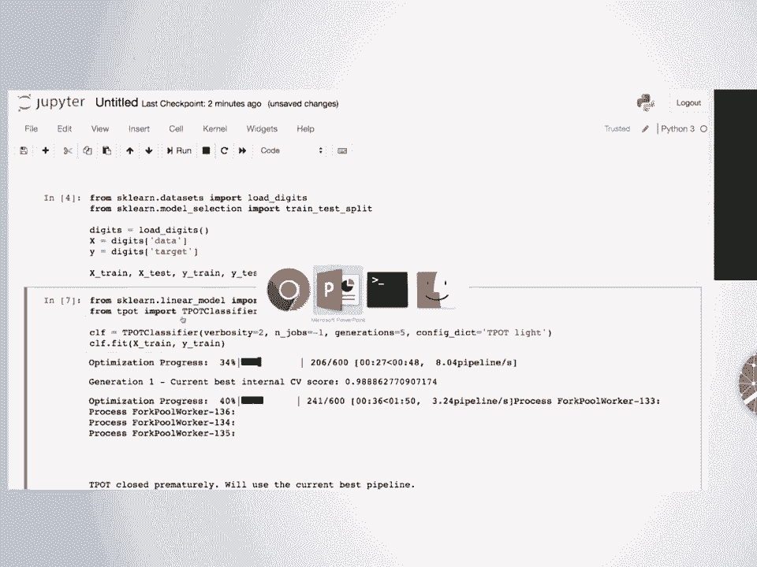
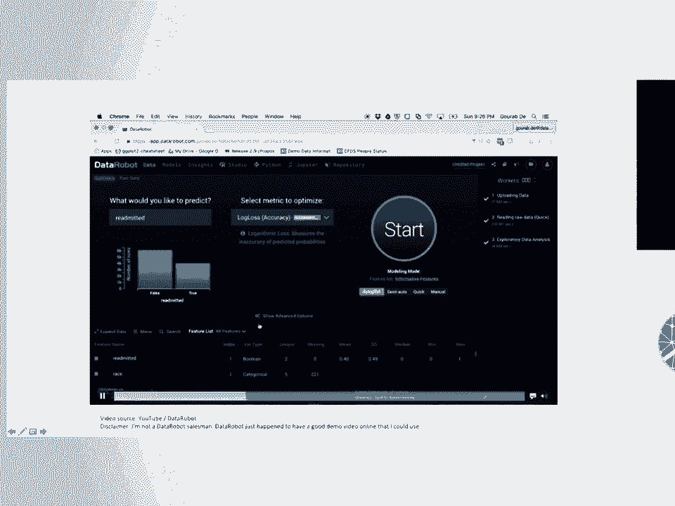
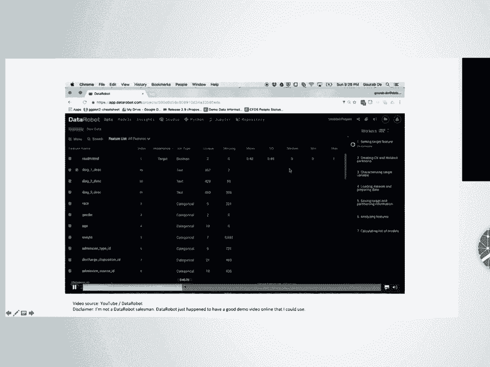
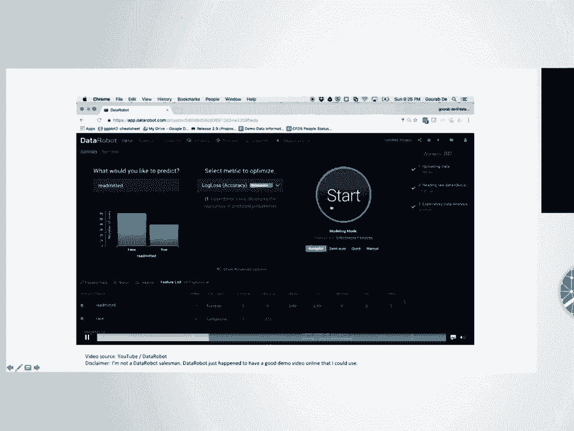
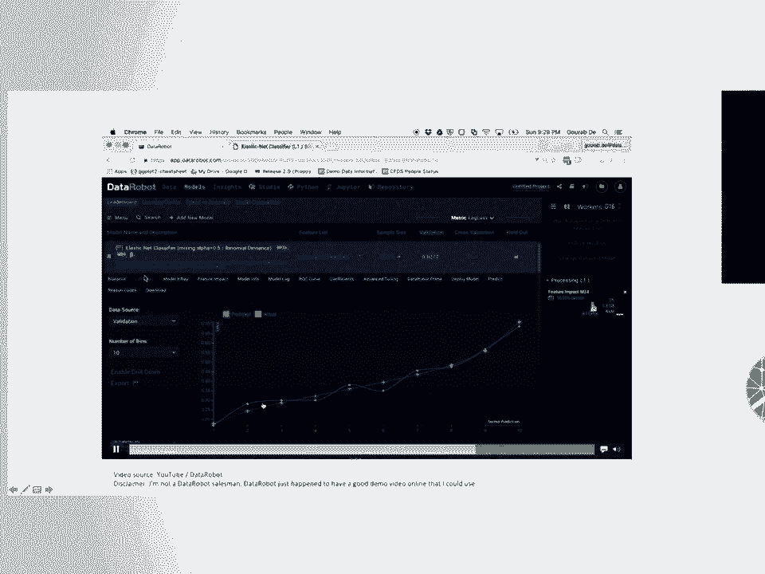
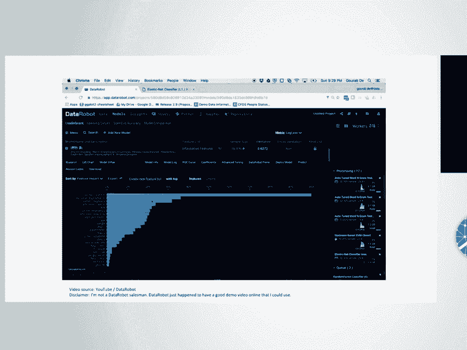
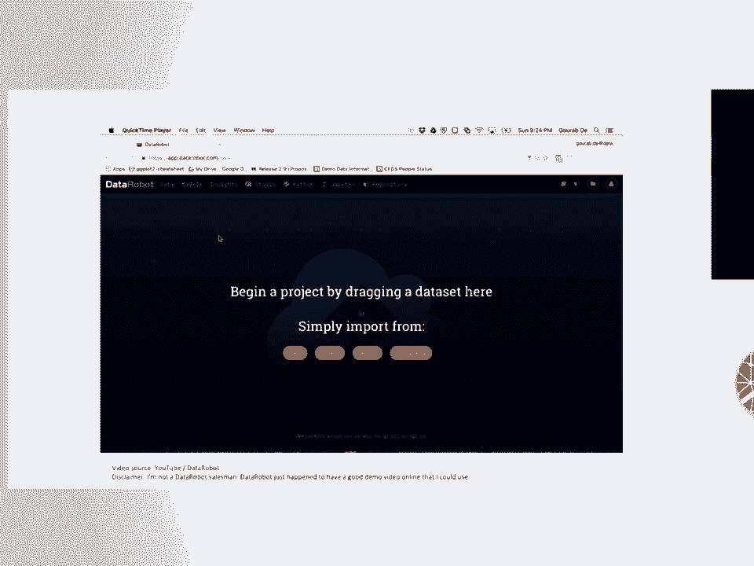
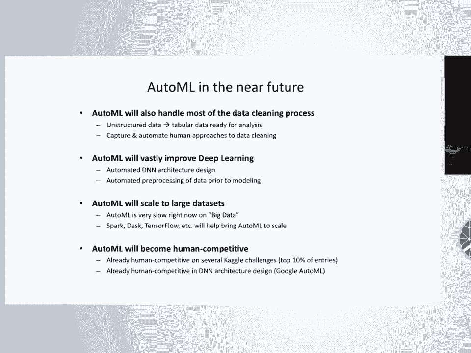

# 34：自动化机器学习的过去、现在与未来 🤖

在本节课中，我们将要学习一个名为“自动化机器学习”的新兴领域。我们将探讨它的定义、核心优势、工作原理、现有工具以及未来发展方向。

## 概述

自动化机器学习旨在将机器学习算法应用于数据集的整个流程自动化。它不仅仅是一个流行词汇，更是一种旨在提升数据科学家和机器学习工程师工作效率的强大工具。

## 什么是自动化机器学习？

上一节我们介绍了课程主题，本节中我们来看看自动化机器学习的核心定义。

简单来说，自动化机器学习的目标是**自动化应用机器学习算法到数据集的整个过程**。但这背后包含的意义远不止于此。

传统的机器学习流程远比“给算法数据，然后魔法发生”要复杂。它通常包括以下繁琐且迭代的步骤：

以下是典型的机器学习工作流步骤：
1.  **数据清洗与整理**：处理原始、混乱的数据，确保其格式正确且可靠。
2.  **特征工程**：进行特征选择、预处理和构建，将数据集转换为更适合机器学习的形式。
3.  **模型选择与调参**：选择机器学习模型并调整其超参数，同时也要调整前序步骤中的参数。
4.  **验证与迭代**：训练模型后进行评估，如果效果不佳，则需要返回前面的步骤进行调整，并重复此过程。

自动化机器学习的目标，就是**将上述整个工作流程自动化**。你向一个自动化机器学习系统提供原始或半原始数据，并指定验证方式，它就会系统地尝试不同的数据分析方法，自动寻找最优的解决方案。

## 为什么需要自动化机器学习？

了解了自动化机器学习的定义后，本节我们来看看它为何如此重要和有用。

自动化机器学习的兴起源于技术行业日益增长的需求。数据科学领域正在飞速发展，涌入大量可能缺乏多年经验的新从业者。自动化机器学习旨在围绕这些工作流程构建技术和工具，帮助他们提高生产力。

更重要的是，自动化机器学习能带来切实的性能提升和效率优化。

**1. 超参数调优至关重要**
一项研究比较了使用`scikit-learn`默认参数与调优后参数的模型性能。结果显示，**平均而言，仅通过调整算法参数就能带来约5%的准确率提升**。这明确告诉我们：默认参数几乎总是不理想的，进行调优是值得的。

**2. 没有“放之四海而皆准”的最佳算法**
另一项实验让多种调优后的算法在大量数据集上“竞技”。虽然像梯度提升树、随机森林这样的集成方法在大多数问题上表现优异，但**没有任何一种算法能在所有问题上都最好**。即使是简单的朴素贝叶斯，也在少数特定问题上优于强大的梯度提升树。因此，针对具体问题尝试多种算法非常重要。自动化机器学习系统没有人类的主观偏见，可以客观地为你尝试不同算法。

**3. 节省大量时间**
一项对数据科学家的调查显示，**60%的受访者认为清洗和组织数据是他们工作中最耗时的部分**。自动化机器学习可以接管部分甚至全部的数据清洗和预处理工作，让从业者能更专注于更高价值的任务。

综上所述，自动化机器学习的核心定位是**生产力工具**。它就像当年的`scikit-learn`一样，旨在将从业者从重复、繁琐的劳动中解放出来，而不是取代他们。

## 自动化机器学习的发展历程

在理解了其价值后，本节我们来回顾一下自动化机器学习是如何演变至今的。

**早期（1990年代）**：早期的自动化机器学习主要聚焦于**参数调优**。你选择一个机器学习算法，系统（通常使用网格搜索或随机搜索）为你调整该算法的参数。有些高级系统会提供一个模型列表进行有限的模型选择。但按今天的标准，这只能算作超参数调优，而非完整的自动化机器学习。

**现代**：现代的自动化机器学习目标更加宏大。它旨在优化**整个机器学习分析流程**，包括数据清洗、预处理、模型选择以及所有环节的参数调优。这使得搜索空间变得极其庞大和复杂。

例如，一个复杂的分析流程可能涉及生成多项式特征、应用PCA、进行特征选择，最后输入随机森林。优化这样的流程意味着要调整大量参数和步骤组合。

因此，简单的网格搜索或随机搜索已不再适用。现代自动化机器学习依赖于更智能的优化技术，例如：
*   **元学习**
*   **贝叶斯优化**
*   **遗传编程**
*   **多臂老虎机方法**

这些技术的核心思想是：通过采样来探索解决方案空间，然后根据已获得的结果（如模型性能）来智能地猜测下一步应该尝试哪些配置，从而更高效地找到最优解。

## 实践：自动化机器学习工具演示

理论介绍完毕，本节我们通过一个实际演示来看看自动化机器学习工具如何工作。

我们将使用一个名为`TPOT`的自动化机器学习库，它完全兼容`scikit-learn`的生态系统。

首先，我们来看一个传统的手动机器学习流程示例：

```python
# 1. 加载数据（以手写数字数据集为例）
from sklearn.datasets import load_digits
from sklearn.model_selection import train_test_split
from sklearn.linear_model import LogisticRegression

digits = load_digits()
X = digits.data
y = digits.target

# 2. 划分训练集和测试集
X_train, X_test, y_train, y_test = train_test_split(X, y, stratify=y)

# 3. 选择模型、训练并评估
model = LogisticRegression()
model.fit(X_train, y_train)
accuracy = model.score(X_test, y_test)
print(f"手动逻辑回归准确率: {accuracy:.4f}")
```


现在，我们使用`TPOT`来自动化这个过程：

```python
# 1. 导入TPOT
from tpot import TPOTClassifier

# 2. 创建TPOT分类器，并设置一些参数以加快演示速度
automl = TPOTClassifier(generations=3, population_size=10, verbosity=2, n_jobs=-1, config_dict='TPOT light')

# 3. 像使用普通scikit-learn模型一样进行拟合
automl.fit(X_train, y_train)

# 4. 评估最佳找到的管道
best_accuracy = automl.score(X_test, y_test)
print(f"TPOT找到的最佳管道准确率: {best_accuracy:.4f}")

# 5. 可以导出找到的最佳管道代码
automl.export('best_pipeline.py')
```

`TPOT`会接管从数据预处理到模型选择与调优的所有步骤。它从一个随机的管道组合开始，通过遗传编程等优化方法，不断评估和进化这些管道，最终为你提供一个性能更优的完整机器学习流程。在演示中，它通常能在短时间内显著提升基础模型的准确率。

## 现有的自动化机器学习工具

经过演示，你可能想了解更多可用工具。以下是当前一些主流的自动化机器学习工具：




**开源工具：**
*   **Auto-Sklearn**：基于`scikit-learn`构建的早期知名工具。
*   **TPOT**：使用遗传编程优化机器学习管道的工具（即演示所用工具）。
*   **H2O AutoML**：功能强大，提供多种语言接口和优秀的Web界面。
*   **AutoKeras**：专注于深度学习架构搜索的自动化工具。









**商业工具：**
*   **DataRobot**
*   **Google Cloud AutoML**
*   **Azure Automated ML**





这些工具大多致力于提供简单易用的接口，让用户能够快速将自动化机器学习集成到现有工作流中。

## 未来展望与总结

在本节课的最后，我们简要展望一下自动化机器学习的未来。

自动化机器学习仍在快速发展中，未来的方向包括：
1.  **更深入的数据处理**：更好地自动化处理非结构化、更杂乱的数据清洗任务。
2.  **神经网络架构搜索**：将自动化机器学习应用于深度学习，自动设计神经网络结构（如Google AutoML的方向）。
3.  **处理更大规模数据**：借助像`Dask`这样的并行计算框架，将自动化机器学习扩展到海量数据集。
4.  **提升竞争力**：通过在Kaggle等竞赛中与人类专家同台竞技，不断推动其性能边界。

**总结**

本节课中，我们一起学习了自动化机器学习的核心概念。我们了解到：
*   自动化机器学习旨在**自动化完整的机器学习应用流程**。
*   它是一个强大的**生产力工具**，能通过自动调优和算法选择提升模型性能，并节省数据准备时间。
*   其技术从简单的参数调优，发展到使用智能优化方法搜索复杂管道。
*   已有许多成熟的开源和商业工具（如`TPOT`、`H2O AutoML`）可供使用。
*   它并非为了取代数据科学家，而是作为助手，帮助从业者更高效、更全面地探索机器学习解决方案。



自动化机器学习正在让机器学习的应用变得更加高效和普及，是每一位数据科学实践者值得了解和掌握的重要领域。