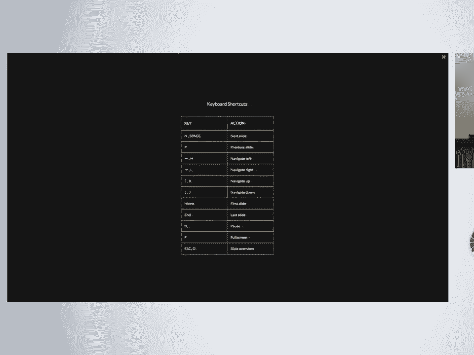
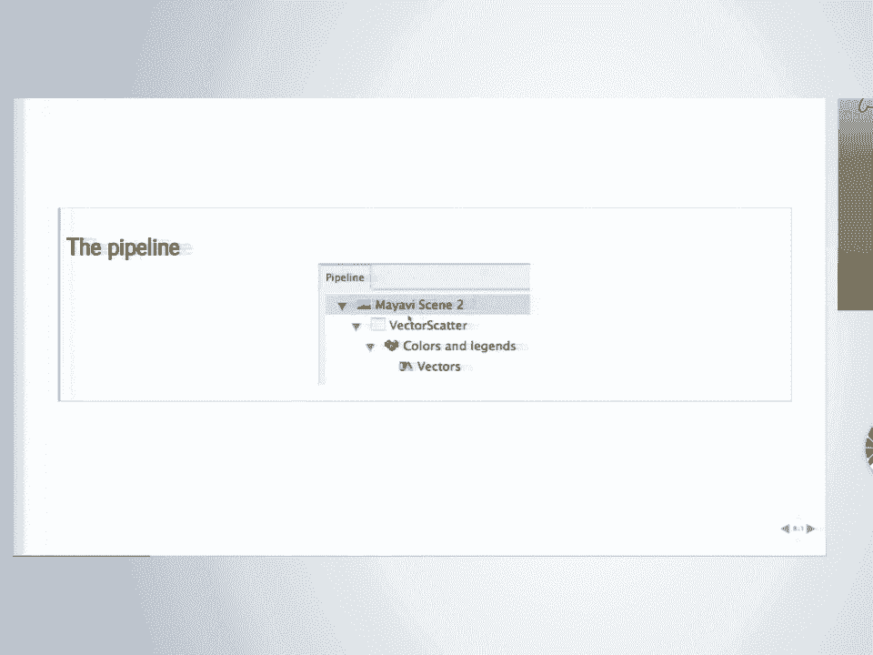
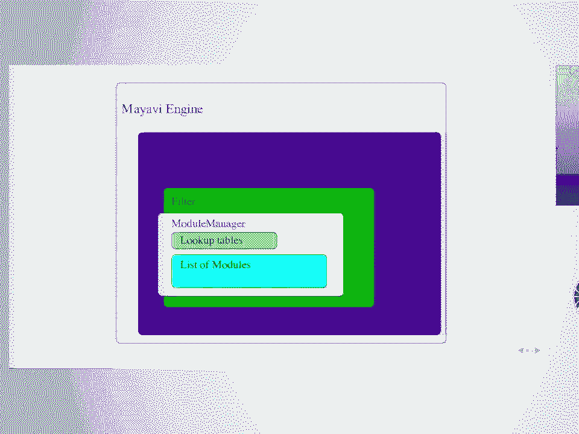
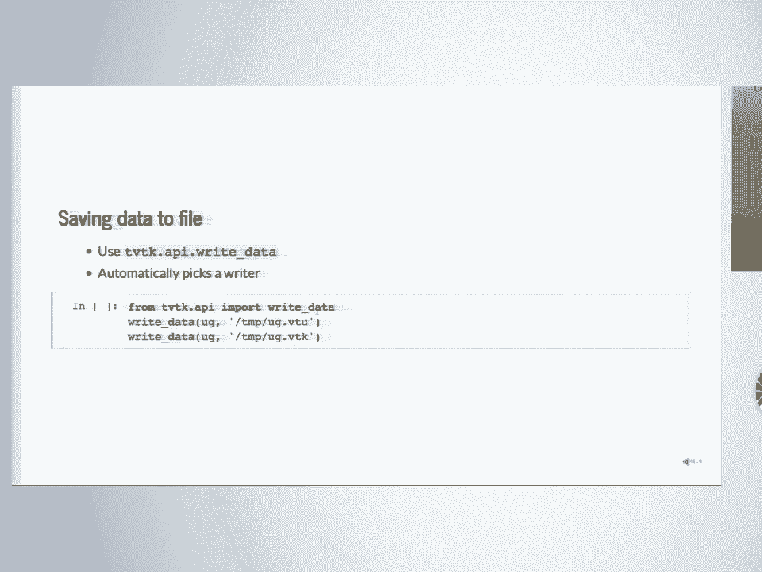
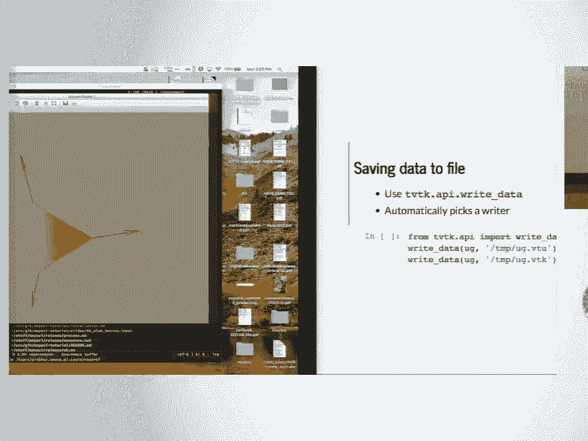
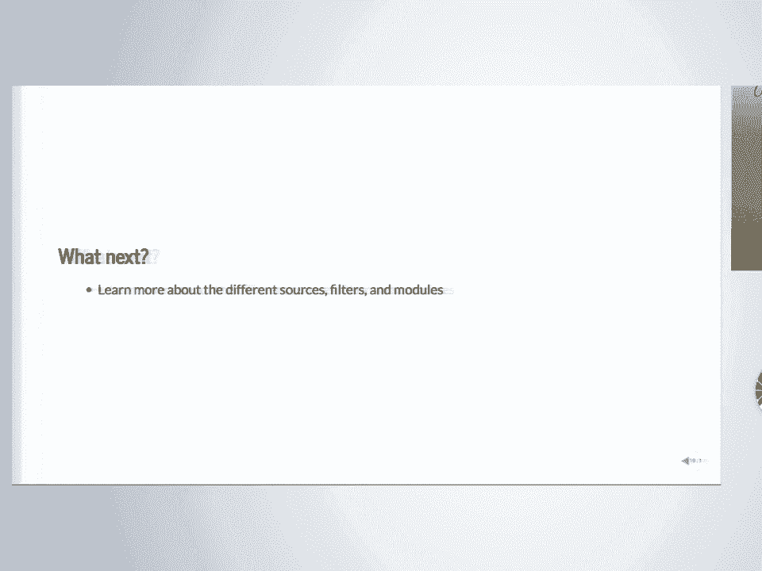

# 35：使用 Mayavi 进行 3D 可视化 📘

## 概述
在本节课中，我们将学习如何使用 Mayavi 库进行 3D 数据可视化。Mayavi 是一个强大的 Python 工具，它构建在 VTK 之上，提供了从简单脚本到复杂交互式应用程序的多种使用方式。我们将从基础开始，逐步探索其核心功能。

---

## 🎬 第一部分：Mayavi 简介

大家好，欢迎来到这个关于使用 Mayavi 进行 3D 可视化的教程。

我的名字是 Prabhu Ramachandran。我来自印度，所以我的口音可能有点奇怪。

我说话有点快，所以如果你听不懂，请告诉我慢一点，或者我会尽量说得更清楚。我会尽力清晰地发音。

我们有两个慷慨的朋友同意帮忙。我原本打算一个人做这个教程。

Matt 可能刚刚出去了。抱歉。还有 Hannah 在后面。她也会帮忙，Matt 一回来我就会介绍他。

这个研讨会主要是动手实践，但我会先用 10 分钟给大家一个关于 Mayavi 的广泛介绍。

但在开始之前，我希望你们已经安装了材料，并且安装了 Mayavi。它通常是一个很难安装的包。传统上它是最难安装的包之一，但现在变得容易一些了。所以我希望安装过程不太困难。

如果你在安装过程中遇到问题，现在是一个举手或让我们知道的好时机，有人会下来帮助你。

好的。所以我会用前 10 分钟简要介绍 Mayavi。

然后当我想人群进来，房间安静下来后，我会让你们互相介绍。

好的，所以前 10 分钟的主题是告诉你 Mayavi 是什么，因为我不想只是浏览幻灯片，做一堆事情而不给你一个概述和视角，让你知道能用 Mayavi 做什么。

Mayavi 的一个特点是它有很多功能。

Mayavi 也给你一个可以像普通可视化应用程序一样运行的应用程序。

如果你运行它，它叫做 `mayavi2`。我们稍后会讲到这个，但它基本上会给你一个完整的用户界面，就像你在屏幕上看到的那样。




左边是一个完整的 UI。你可以点击按钮，操作视图，你所做的一切几乎会立即反映在右边的面板上，也就是你的 3D 可视化。

你还会有一个嵌入的 Python 会话，可以用来在应用程序上实时编写可视化脚本。

但这还不是全部。大多数时候，使用 Python 进行数据分析和研究工作的 Python 用户最终会使用所谓的 Python 的 `mlab` 接口，这是一个完全可脚本化的 Python 接口，如果你启动 Python，这只是一个快速演示。我们会做很多这样的事情，所以在前 10 分钟你不需要输入任何东西。

基本上，你可以输入这三行来生成数据，然后用这里的一行代码，你最终会得到一个看起来像那样的图。

所以它有点像 matplotlib 的接口，你可以快速获取数据，绘制它，并立即得到可以查看和操作的东西。但你可以做得更多。

你也可以构建自己的定制 UI。现在，这些都不是 Web UI，因为它们不是那种可以很好地嵌入到 Jupyter 笔记本中的东西，但它们是完整的桌面对话框。所以你无法在远程机器上这样做，但如果你在自己的机器上就可以。你可以构建一个定制的 UI，这段代码大约有 100 行。

我不知道你们中是否有人认出了那里看到的表面。通风口被困在那里。是的，谢谢。所以基本上，那些是右边的方程。所以你可以实际调整这些方程，并实时查看矢量场。

所以你可以用 Mayavi 相当容易地构建这样的 UI。所以它不仅仅是一个应用程序，也不仅仅是像 `plot` 那样一行代码就能完成的东西。你可以用不多的代码构建一个完整的对话框。那个问题的答案是什么？抱歉。哦，所以这是抱歉。这是洛伦兹吸引子。

所以这些是控制该系统的方程。它是一组三个微分方程。我们稍后会将其作为一个例子来看。本质上，那里可视化的是矢量场。那是为该特定矢量场绘制的流线。这就是你看到的。

我们会花很多时间，你知道，稍后探索类似的东西。但这里的关键点是，这个对话框也是完全交互式的。你可以点击那些东西并拖动它。这是 Mayavi 中可用的一个标准示例。如果你愿意，稍后可以玩一下。

你也可以构建一个完整的应用程序，嵌入你想要的 Mayavi 的各个部分。例如，这在 Enthought 被大量使用，用于他们的许多可视化工具。他们使用这样的工具，并将其构建到他们的应用程序中。

所以你也可以在你的应用程序中嵌入 Mayavi。最后，这是一个相当新的功能，你可以在一定程度上在 Jupyter 笔记本中嵌入交互式绘图。但这有点不稳定，因为如果你的数据非常大，它可能无法正常工作。而且由于各种原因，它没有提供普通 Mayavi 应用程序（桌面应用程序）的所有功能。但你可以用那些代码行将其嵌入到笔记本中，并与之交互。它不仅仅是一张图片。你实际上可以点击、拖动、旋转它等等。

所以这在 Mayavi 中是可用的，但效果可能因你试图可视化的内容和方式而异。

现在，Mayavi 是一个相当古老的包。它始于 2001 年，是我博士期间的拖延项目。在 2004 年和 2005 年，当我更多地了解了第一次犯的各种错误后，它被完全重写了。

然后有几个人做出了贡献。我不知道你们中有多少人知道 Gaël Varoquaux，他是 Scikit-learn 的联合创始人之一。所以实际上他在 2007 年到 2012 年间是 Mayavi 的主要贡献者，直到他忙于 Scikit-learn。我猜。然后 Enthought 的几个人贡献了修复。当然，我感谢 Enthought 和 NIT Bombay 对 Mayavi 的支持。

所以 Mayavi 的一些关键特性是，它基本上与 NumPy 无缝集成。它是完全可脚本化的。它有一个 UI。所以很多包基本上要么强迫你通过脚本做所有事情，要么有一个 UI。Mayavi 允许你两者都做。希望到研讨会结束时，你会理解如何两者都做。

它在 GitHub 上可用，在底层，Mayavi 使用 VTK。所以它本身不做任何繁重的图形工作。它基本上将所有事情都交给这个叫做 VTK 的库。VTK 是一个庞大的可视化库。可能是最大的开源可视化库之一。它是一个维护得非常好、非常成熟的库。它是用 C++ 实现的，但它有 Python 包装器，并且从今年开始也可以通过 pip 安装。

所以本质上，Mayavi 所做的是在 VTK 之上放置一个 UI。所以如果你真的想，你可以深入 VTK，或者你可以使用我们提供的更高级别的 Mayavi。

现在它支持各种数据集。所以它不仅仅是纯脚本。如果你有数据文件，我们从 VTK 暴露出来的所有内容都是可用的。有些还没有暴露出来。我很乐意接受拉取请求。或者我们可以就此进行冲刺。所以基本上它支持像多边形数据、结构化网格、非结构化网格这样的东西。它支持各种各样的可视化算法。所以它不仅仅局限于 UI 上暴露的少数东西。你几乎可以做任何你想做的事情。它支持标量可视化、矢量可视化和一些张量可视化。我们将在本教程的过程中用几个例子来涵盖每一个。

它还做一点体绘制。所以如果你需要这个，你也可以用 Mayavi 来做。

Mayavi 的一个非常强大的特性，我稍后会演示，是你可以做所谓的自动脚本记录。所以假设你设置了一个可视化，现在想配置它。但你不想每次都在 UI 上做。所以在探索时通常很容易。你可以直接在 UI 上点击，点击一些按钮，然后发现这个看起来不错。所以有时你想知道如何用脚本做到这一点。事实证明，你可以用 Mayavi 打开一个按钮，开始进行 UI 交互，它实际上会输出你需要执行的 Python 代码，以精确复制你所做的。所以这是学习如何编写脚本的好方法。这是使用应用程序的好方法，也是为应用程序编写脚本的好方法。所以这也是学习 Mayavi 的好方法。所以这是一个我将在课程后半部分尝试演示的特性。

你也可以将 Mayavi 嵌入到 WX Python 以及 QT 中。我们支持 QT4、QT5、PySide、PySide2 和 WX Python 3。这就是为什么它是一个难以安装的包，因为你可以看到有多少种方式可能出错。

Mayavi 应用程序还支持强大的命令行选项，这意味着你可以，如果你只是知道，我想可视化这个数据文件，那里有一个小数据文件。我想快速绘制这个的等值面，用这个，这个，这个。你可以在命令行上启动，而不需要启动 Python 或类似的东西。

它还有一些初步的离屏支持，所以这意味着如果你想进行批处理之类的事情，你可以做到，但设置起来有点工作，因为你必须确保你的 VTK 和其余构建配置得完全正确。但你可以使用 Mayavi 来驱动这些可视化。

总而言之，架构看起来像这样。底层是 Python。有 NumPy。有 VTK。有一个叫做 traits 的包，它促进了 Mayavi 提供的 UI 和反应性。而这个 traits 将我们连接到 WX Python 和 QT。实际上，这不仅仅是 QT4，还有 QT5。坐在这个上面的是 Mayavi 提供的一层，叫做 TVTK。它叫做 Traited VTK，它为你提供了那个接口。构建在那之上的是 Mayavi 基础设施的其余部分。所以本质上，Mayavi 坐在这些强大的构建块之上，允许你通过与这些强大的底层工具对话来非常简单地做事。好的，这就是它的构造方式。只是给你一个关于 Mayavi 内部如何设置的心理模型。

好的，所以关于 Mayavi 是什么的废话就到这里。我们将从 `mlab` 开始，这是简单的接口，如何开始可视化东西。然后我们将看动画，一些简单的动画。假设你有一个图，你想快速动画化那些数据。你如何用 Mayavi 做到这一点？然后我们将更深入地了解 Mayavi 管道。我会向你解释那是什么意思。我会向你解释你应该如何解释这些管道。

然后我们将继续学习制作你自己的数据集。所以很多时候，我们提供的简单可视化对你的数据来说不够，你想制作你自己的，在这种情况下，理解如何自己制作这些数据集会有所帮助。我们将通过一系列例子来指导你，我们将获取 numpy 数组，然后制作可视化，你自己会看到可视化。所以希望你可以使用这些作为模板来构建和可视化你自己的数据。最后，有一个，稍微的设置。我想那是 0，7，ipi，和 b，它基本上暴露了我们在 UI 上暴露的大约 15 或 20 个过滤器。我们在 UI 上暴露了大约 10 个模块，我向你解释了这些是什么。我会用你可以运行的例子来展示其中的大部分。我鼓励你在那些情况下跟着输入。

好的，所以在我们继续下一步之前，当我们真正开始输入时，我希望我们做一个简短的介绍，向你的邻居介绍自己。所以我先来。我是 Prabhu。我旁边没有人。但我不想让你大声做这个。我会给你两分钟。找到你左边的人，向他们介绍自己。因为这次会议的部分目的是让你认识一群 SIPI 的人，并结交一生的朋友。我就是这样找到了很多好朋友。所以先认识你左边的人。请自我介绍。所以我希望你认识你左边的人，他们的名字，也许左边第一个或第二个，以及他们右边的人，也许后面的人。我不会就此考你。没关系。但我希望如果你遇到问题，如果你卡住了，如果你有疑问，你不必只问我。你也可以问你旁边的朋友，不仅是为了这个会议，也许也是为了接下来的会议。你也可以举手，Hannah 和。好的，所以 Matt 在这里。所以 Matt 在后面。所以再次，如果你有问题，他会帮助你。好的，谢谢。让我们开始吧。

我们将从使用 `mlab` 开始，这是 Mayavi 基础设施之上的一个小部分。

---

## 📝 第二部分：MLAB 基础

### 概述
在本节中，我们将开始使用 `mlab`，这是 Mayavi 的一个简单易用的接口。我们将学习如何创建基本的 3D 图，并理解其工作原理。

### 设置环境
首先，我们需要设置环境。无论你使用 Jupyter 控制台还是 Jupyter 笔记本，第一步都是确保正确配置。

以下是设置步骤：
1.  在 Jupyter 笔记本中，首先执行 `%gui qt` 以允许弹出 QT 窗口。
2.  然后导入 Mayavi 的 `mlab` 模块。

```python
%gui qt
from mayavi import mlab
```

**注意**：有时先导入 `mlab` 再执行 `%gui qt` 可能有助于解决 QT 库的导入问题。如果遇到问题，可以尝试调整顺序。

### 测试安装
导入后，我们可以测试 Mayavi 是否正常工作。

```python
mlab.test_contour3d()
```

执行上述代码应该会弹出一个 3D 窗口，显示一个等值面图。你可以使用鼠标与场景交互：
*   **左键拖动**：旋转相机。
*   **Shift + 左键拖动**：平移相机。
*   **Ctrl + 左键拖动**：缩放。

### 基本绘图：零维数据（点）
现在，让我们开始绘制一些数据。我们将从零维数据开始，即一组在三维空间中的点。

以下是创建和绘制点的步骤：
1.  使用 `numpy` 生成一些示例数据。
2.  使用 `mlab.points3d` 函数绘制这些点。

```python
import numpy as np

# 生成示例数据
t = np.linspace(0, 4 * np.pi, 20)
x = np.sin(2 * t)
y = np.cos(t)
z = np.cos(2 * t)

# 绘制点
mlab.points3d(x, y, z)
mlab.show()
```

**代码解释**：
*   `np.linspace(0, 4 * np.pi, 20)` 生成从 0 到 4π 的 20 个等间距点。
*   `mlab.points3d(x, y, z)` 在三维空间中绘制这些点。





### 一维数据（线）
接下来，我们看看如何绘制一维数据，即连接点的线。

使用 `mlab.plot3d` 函数可以绘制线：

```python
# 使用相同的数据绘制线
mlab.clf()  # 清除之前的图形
mlab.plot3d(x, y, z, tube_radius=0.025)
mlab.show()
```

**代码解释**：
*   `mlab.clf()` 清除当前图形。
*   `mlab.plot3d(x, y, z, tube_radius=0.025)` 绘制连接点的线，并指定线的半径。

### 二维数据（曲面）
对于二维数据，我们可以绘制曲面。Mayavi 提供了几种绘制曲面的方法，包括 `mlab.surf` 和 `mlab.mesh`。

以下是使用 `mlab.surf` 绘制曲面的示例：

```python
# 生成二维网格数据
x, y = np.mgrid[-3:3:100j, -3:3:100j]
z = np.sin(x**2 + y**2)

# 绘制曲面
mlab.clf()
mlab.surf(x, y, z, warp_scale='auto')
mlab.show()
```

**代码解释**：
*   `np.mgrid[-3:3:100j, -3:3:100j]` 生成一个 100x100 的网格。
*   `mlab.surf(x, y, z, warp_scale='auto')` 绘制曲面，并自动调整缩放。

### 三维数据（体绘制）
对于三维数据，我们可以使用体绘制技术，如等值面。

以下是绘制等值面的示例：

```python
# 生成三维网格数据
x, y, z = np.mgrid[-5:5:64j, -5:5:64j, -5:5:64j]
scalars = x**2 + y**2 + z**2

# 绘制等值面
mlab.clf()
mlab.contour3d(scalars, contours=5)
mlab.show()
```

**代码解释**：
*   `np.mgrid[-5:5:64j, -5:5:64j, -5:5:64j]` 生成一个 64x64x64 的三维网格。
*   `mlab.contour3d(scalars, contours=5)` 绘制标量场的等值面，指定 5 个等值线。

### 矢量数据可视化
除了标量数据，Mayavi 还可以可视化矢量数据，如矢量场。

以下是使用 `mlab.quiver3d` 绘制矢量场的示例：

```python
# 生成矢量场数据
x, y, z = np.mgrid[-2:2:10j, -2:2:10j, -2:2:10j]
u = np.sin(x) * y
v = np.cos(y) * z
w = np.sin(z) * x

# 绘制矢量场
mlab.clf()
mlab.quiver3d(x, y, z, u, v, w)
mlab.show()
```

**代码解释**：
*   `mlab.quiver3d(x, y, z, u, v, w)` 在三维空间中绘制矢量场，其中 `(u, v, w)` 是矢量分量。

### 流线可视化
对于矢量场，我们还可以绘制流线，以显示场的流动模式。

以下是绘制流线的示例：

```python
# 绘制流线
mlab.clf()
mlab.flow(x, y, z, u, v, w)
mlab.show()
```

**代码解释**：
*   `mlab.flow(x, y, z, u, v, w)` 绘制矢量场的流线。

---

## 🎞️ 第三部分：动画与交互

### 概述
在本节中，我们将学习如何使用 Mayavi 创建动画和交互式可视化。这将使我们能够动态展示数据变化，并增强用户体验。

### 基本动画
Mayavi 允许我们通过更新数据源来创建简单的动画。以下是一个示例，展示如何动画化一个曲面：

```python
import numpy as np
import time
from mayavi import mlab

# 生成初始数据
x, y = np.mgrid[-3:3:100j, -3:3:100j]
z = np.sin(x**2 + y**2)

# 绘制初始曲面
s = mlab.surf(x, y, z, warp_scale='auto')

# 动画循环
for i in range(10):
    # 更新曲面的高度
    s.mlab_source.scalars = np.sin(x**2 + y**2 + i * 0.5)
    time.sleep(0.1)  # 暂停以创建动画效果
    mlab.process_ui_events()  # 处理 UI 事件以更新显示
```

**代码解释**：
*   `s.mlab_source.scalars` 用于更新曲面的标量数据。
*   `mlab.process_ui_events()` 确保 UI 在动画过程中保持响应。

### 使用生成器创建动画
对于更复杂的动画，我们可以使用生成器函数，并结合 `mlab.animate` 装饰器。





以下是使用生成器创建动画的示例：

```python
from mayavi import mlab
import numpy as np



@mlab.animate(delay=100)
def animate():
    x, y = np.mgrid[-3:3:100