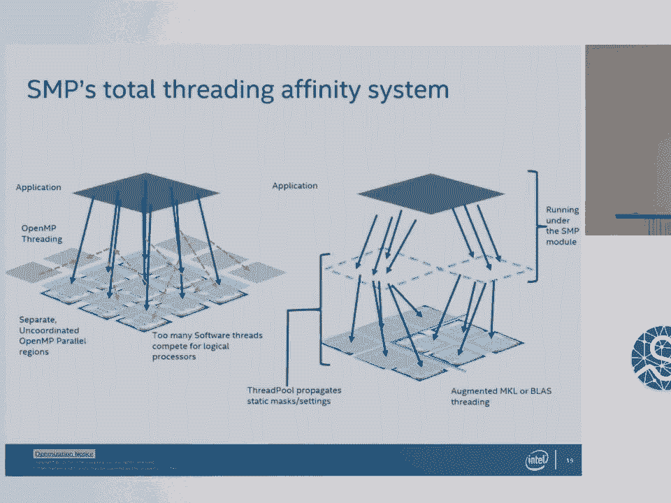
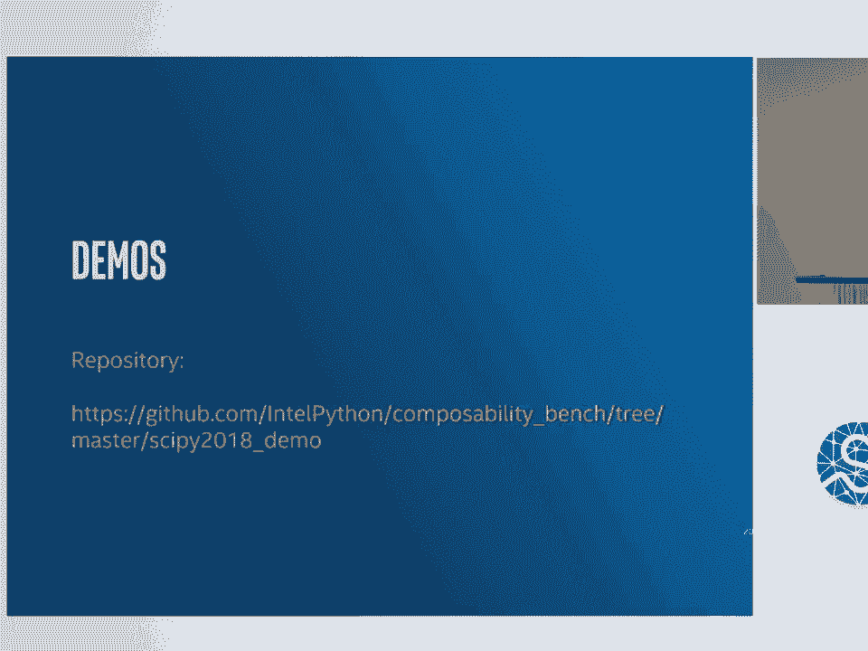
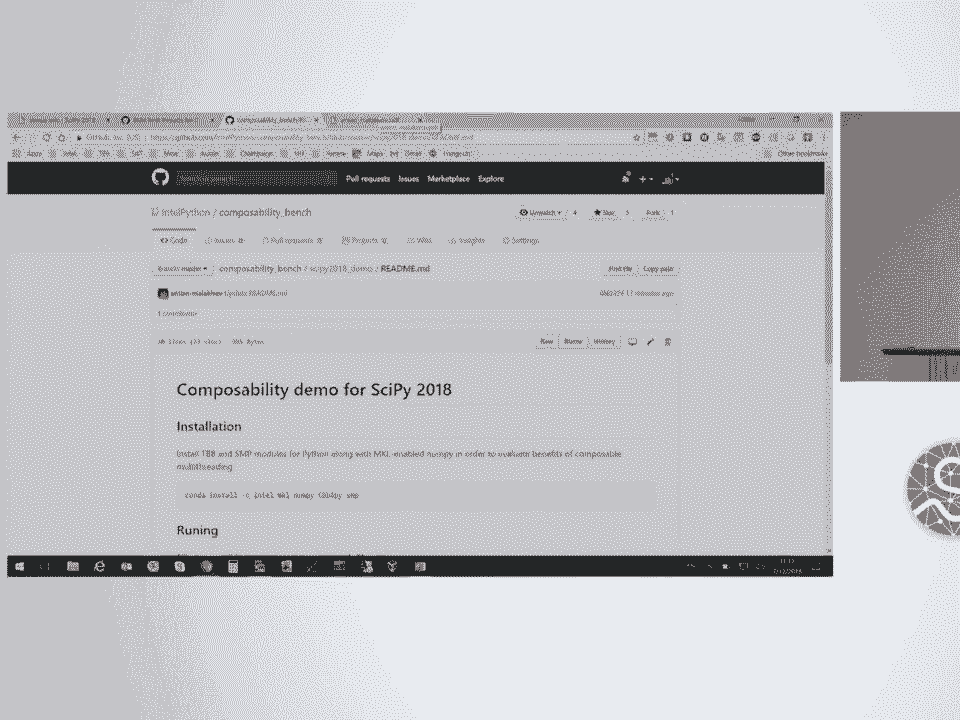
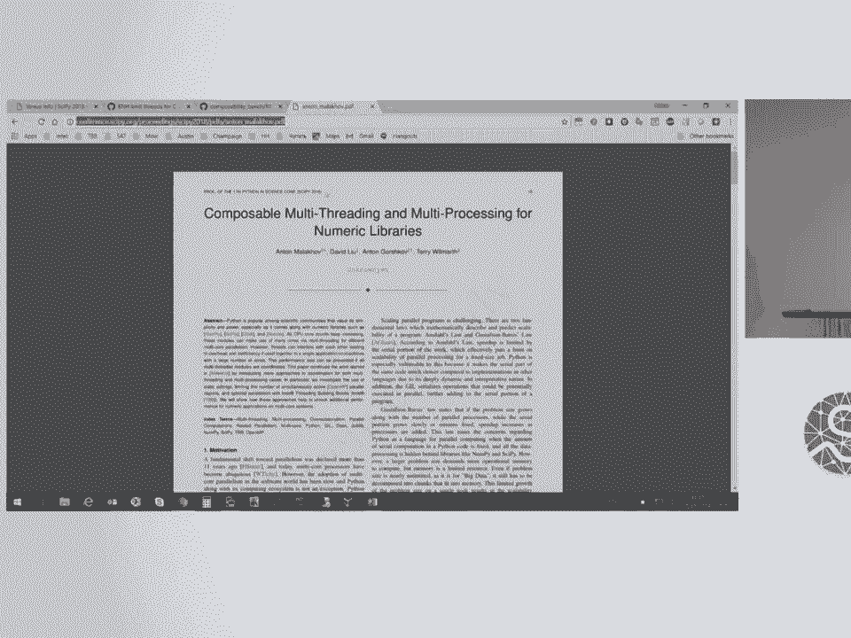
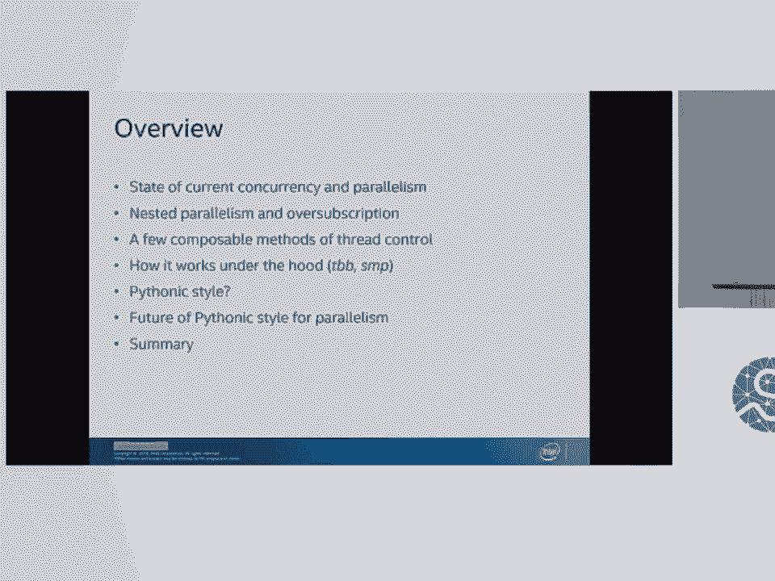
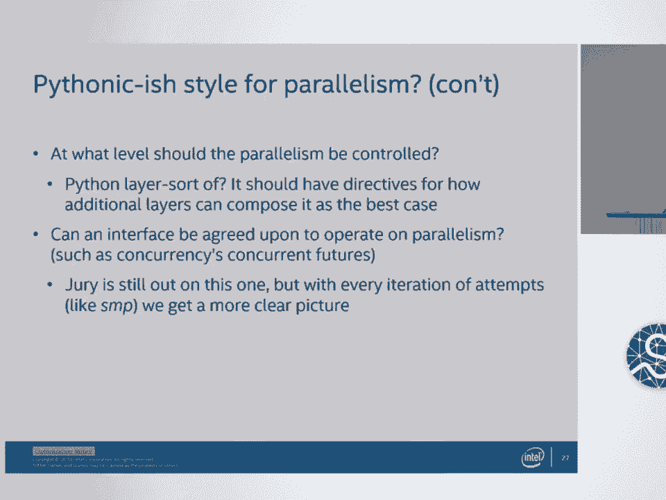
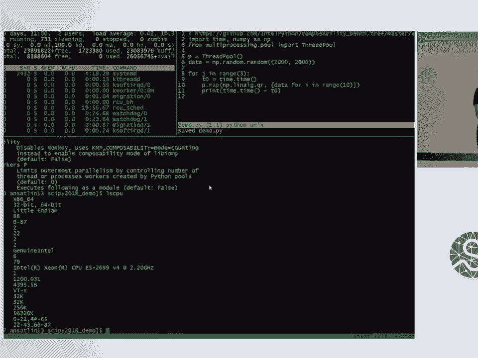
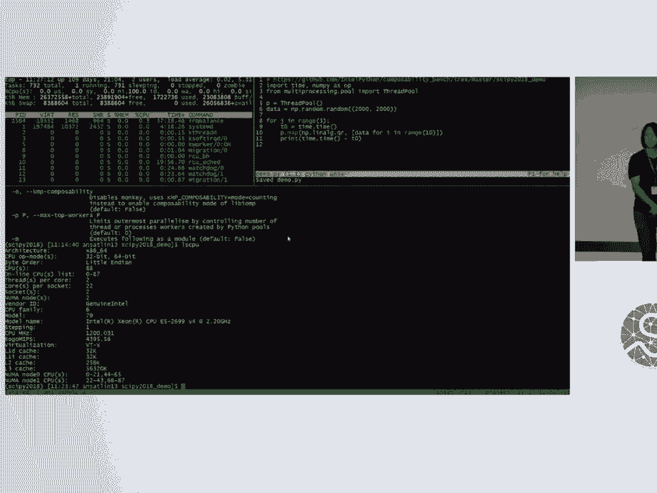
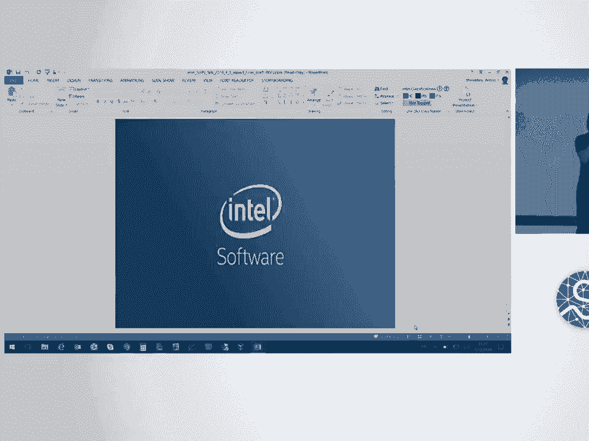

# 36：Python 中的多线程与多进程管理 🧵⚙️

在本节课中，我们将学习 Python 并发与并行编程的现状，特别是如何应对嵌套并行和资源过载问题。我们将探讨两种解决方案，并通过实际演示来理解它们的工作原理。

## 概述

Python 在并发和并行编程领域拥有丰富的包和框架。这些工具大多能很好地与全局解释器锁协同工作，或通过分布式、向量化技术绕过它。随着核心数量的增加，嵌套并行和资源过载成为可能且常见的问题。

## Python 并发与并行的现状

以下是 Python 生态系统中一些关键的并发与并行框架发展历程：

*   **2008年**: `multiprocessing`
*   **2010年**: `concurrent.futures`
*   **2012年**: `asyncio`
*   **2014年**: `joblib`, `dask`
*   **2015年**: `ray`
*   **2016年**: `numba`, `cython`
*   **2017年**: `numpy-expression`

与其他生态系统相比，Python 在这个领域提供了非常好的选择。大多数框架都能与全局解释器锁良好协作，或者在特定领域（如科学计算）依赖高性能的 C 语言实现来利用底层并行性。

## 全局解释器锁的作用

全局解释器锁常被诟病，但它也提供了重要的保障：

*   **可预测的行为**
*   **Python 对象访问的读写安全**
*   **确保引用计数不会出错**
*   **简化了扩展模块的开发**

因此，全局解释器锁在开发和框架使用中并非根本性问题，因为有许多方法可以绕过它。

## 绕过全局解释器锁的方法

绕过全局解释器锁是更符合 Python 风格的做法。主要方法包括：

1.  **向量化框架**: 如 `numpy` 和 `scipy`，它们将计算分发到底层的 BLAS 实现（如 MKL 或 OpenBLAS），在 C 语言层面应用并行性。
2.  **多进程框架**: Python 提供了良好的抽象，可以将任务分离到独立的进程中执行。

然而，当组合多个抽象流程时，尤其是在多进程和多线程混合使用的情况下，问题会变得复杂。

## 并行编程的领域划分

我们可以将并行编程划分为三个主要领域：

*   **应用级并行**: 如 `multiprocessing`, `concurrent.futures`
*   **数据并行**: 如 `numpy`, `scipy`, `numba`, `cython`
*   **单线程并发**: 如 `asyncio` 等异步框架

许多包都分布在这些领域的交叉部分。例如，Dask 就涵盖了所有这些领域。

## 嵌套并行与资源过载问题

上一节我们介绍了并行编程的不同领域，本节我们来看看当在这些领域之间组合并行时会出现的问题。





当在不同层级的并行之间进行组合时，可能会出现嵌套并行和资源过载。例如，一个多进程池中调用了线程池，而线程池中的任务又调用了 NumPy，NumPy 自身可能还会产生线程。这会导致线程数量激增，超出预期。





以下是资源过载带来的问题：

*   **操作系统线程切换的直接开销**
*   **CPU 缓存变冷**
*   **整体性能下降**



许多机器学习框架都实现了这种多层可组合并行，并遇到了这些问题。

## 可组合线程控制方法

为了解决嵌套并行和资源过载问题，Intel 开发了两种可组合性模型：

### 1. TBB4Py

`TBB4Py` 是一个免费的 C 扩展包，随 Intel Distribution for Python 提供。它通过动态任务调度来管理嵌套并行。

**核心机制**:
*   通过猴子补丁动态替换线程池。
*   使用 Intel Threading Building Blocks 进行动态任务调度。
*   在协调的池上动态映射任务，以避免产生过多线程。

**调用方式**:
```python
# 通过命令行参数或导入包来启用
import tbb4py
# ... 然后运行你的正常脚本
```

### 2. SMP (Static Multi-Processing)

`SMP` 是一个纯 Python 包，通过粗粒度的静态设置来管理嵌套并行。

**核心机制**:
*   从多进程层级获取设置，并将这些设置传递到后续可能创建更多线程的进程中。
*   使用环境变量和 OpenMP 设置来静态分配资源，避免线程过多。
*   在 SMP 模块下运行时，会调整 MKL 或其他库的线程设置以符合整体资源分配。

## 解决方案对比演示

现在，让我们通过一个演示来看看这两种解决方案的实际效果。演示展示了一个包含嵌套并行的简单程序：一个线程池并行执行多次线性代数 QR 分解。

**未使用解决方案时**:
程序运行缓慢，耗时约 40 秒，因为发生了资源过载。



**使用 SMP 后**:
程序运行速度显著加快，展示了通过控制资源分配来避免过载的效果。

## 符合 Python 风格的并行

一个核心问题是：如何以符合 Python 风格的方式实现并行？我们提出以下几个评判标准：

*   **代码改动少**
*   **不改变现有行为**
*   **属于 Python 标准库（理想情况）**
*   **可从 Python 层直接编写**
*   **接口易于理解**
*   **保持在 Python 层编写**


根据这些标准评估：
*   `TBB4Py`: 满足其中四项。它不在标准库中，也不能直接从 Python 层编写。
*   `SMP`: 表现稍好，是纯 Python 实现，可以半直接从 Python 层编写，但同样不在标准库中。



## 关于未来的思考

我们还需要思考几个问题：

1.  **对纯 Python 实现的硬性要求是否现实？** 可能不是必须的，但强烈推荐。
2.  **通过猴子补丁修改 Python 代码是否合适？** 目前这似乎已成为一种常态。
3.  **应该在哪个层级控制并行？** Python 层似乎是个好主意，但需要为如何组合附加层制定规范。
4.  **能否就操作并行的接口达成一致？** 这仍需社区探讨。`concurrent.futures` 在这方面做了很好的示范。

## 总结

本节课中，我们一起学习了 Python 并发与并行的现状、嵌套并行与资源过载的挑战，以及 `TBB4Py` 和 `SMP` 这两种解决方案。





`TBB4Py` 和 `SMP` 试图通过增强我们使用多线程和多进程的方式来应对“Python风格”的挑战。它们尽量不改变底层代码，并尝试在 Python 层和 C 层保持多进程和多线程的平衡，将领域特定的工作留给框架。


拥有更多可增强的线程行为非常有用，但这意味着框架开发者和用户将承担更多责任。Python 在数值计算领域的线程框架已经非常丰富，在非数值计算领域也有可能，但可能需要对数据类型做出一些妥协。

整个生态系统已经达到了一个拥有大量优秀框架的临界点，我们期待未来能看到更多创新。