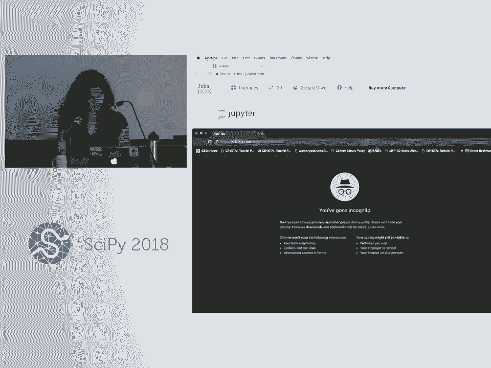
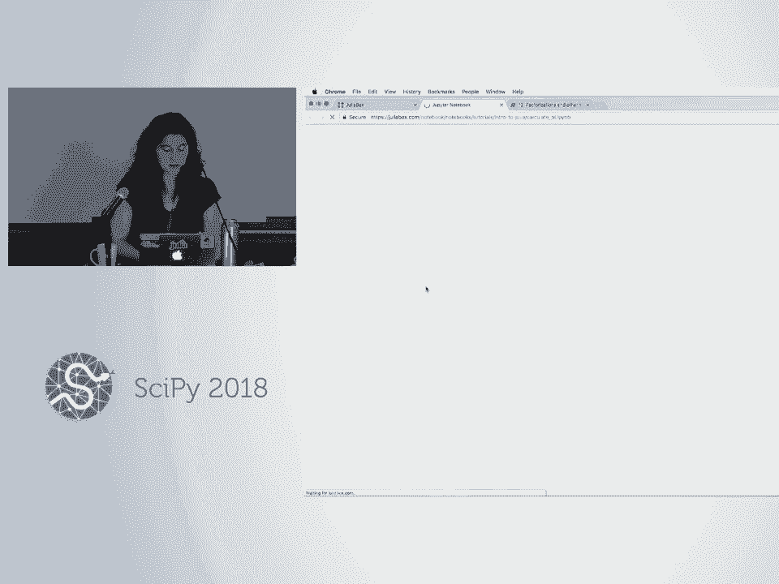

# 37：Julia 语言入门教程 (初学者级别) 🚀

## 概述

在本课程中，我们将学习 Julia 语言的基础知识。Julia 是一种高性能、高生产力和高通用性的编程语言，旨在解决“两种语言问题”。我们将从语法基础开始，逐步深入到函数、性能、设计范式等核心概念，并通过 Jupyter Notebook 进行实践操作。

---

## 1. 为什么需要 Julia？🤔

在开始教程之前，我们先通过一些幻灯片来介绍 Julia 语言，并探讨学习这门新语言的动机。

首先，我是 Jane Harriman，在 Julia Computing 工作，同时也是材料物理学的研究生。我主要作为 Julia 的用户，而非开发者。而 Sasha Vivei 来自斯坦福大学和 Julia 项目，是语言的核心开发者之一，他将帮助我们解答更深层次的开发或设计哲学问题。

我几年前开始接触 Julia，当时是一名 Python 用户，现在在研究中也仍会使用 Python。实际上，我是在研究生阶段才开始自学编程的，距离写出第一个 `for` 循环只有几年时间。我会在介绍语言的同时，分享我从 Python 转向 Julia 的经历。

首先，我想了解一下今天在座的各位。你们主要是 Python 用户吗？有没有人以其他语言作为主要开发语言？你们在使用什么语言？好的。那么，你们来自哪些行业或领域？很多人是工程师吗？物理科学领域呢？生命科学？很好，经济学？数学？还有哪些我没提到的领域？你们从事什么？地理学。好的，很好。有多少人之前尝试过或接触过 Julia 语言？很好，很高兴看到你们在接触过这门语言后还来到这里。这是个好迹象。是的，你们在初步尝试后觉得它很有吸引力，这很好。

那么，在我们深入 Julia Box 上的笔记本之前，我想和你们探讨几个问题：为什么我们需要另一门语言？这门语言最初为何被开发？然后，我们将讨论 Julia 的实际应用，最后再深入教程本身。

第一个问题是：为什么我们需要一门新语言？这里展示的是不同编程语言的“周期表”，根据它们可能带来的特性或特征进行了颜色编码。问题是，既然已经有这么多现有的语言，为什么还要设计 Julia？Julia 填补了什么空白？其理念是，即使有这么多现有语言，我们仍然面临所谓的“两种语言问题”。对于那些不熟悉的人来说，这个“两种语言问题”源于编程语言性能与生产力之间的经典鸿沟。

传统上，我们在低级语言（如 C 或 Fortran）和高级语言（如 Python 或 MATLAB）之间进行权衡。低级语言能生成非常高效的机器码，但程序员上手和运行需要更长时间。另一方面，高级语言更容易让程序员上手和工作，提高生产力，但生成的机器码运行速度不如低级语言快。因此，传统上我们被迫在编写高效代码和高效编写代码之间进行权衡。

然而，这种权衡并非真正的二分法，因为我们需要考虑的第三个变量是编程语言的通用性。如果我们使用领域特定语言或特殊库（例如 NumPy），确实可以相对容易地生成快速或高效的代码。但当我们使用这些领域特定语言或特殊库时，所选工具的范围会受到限制。因此，我们真正的权衡是在性能、生产力和通用性这三者之间，当我们选择编程工具时。

这就导致了“两种语言问题”，即我们通常需要先用一种语言快速构建原型并使其运行起来。在有了可工作的原型之后，人们通常会将其代码翻译成传统的低级语言，以获得他们真正需要的、能够大规模运行的速度。

Julia 就是为了解决这个“两种语言问题”而设计的。Julia 的口号是：看起来像 Python，感觉像 Lisp，运行起来像 C 或 Fortran。这里的理念是，Julia 被设计成一种高级语言，同时提供强大的功能、通用性和表达上的便捷性。

当我说 Julia 提供生产力、通用性和性能时，我将详细解释 Julia 如何提供这些特性。

我们可以从性能开始讨论。今天教程中我们将做一个名为“Julia 很快”的笔记本。这是一个基准测试笔记本，我们将查看 `sum` 函数的不同实现。我们将查看 Python 和 Julia 中内置的 `sum` 函数版本，同时也会查看用 C、Julia 和 Python 使用相同算法手写的 `sum` 实现。

`sum` 函数接收一个向量，然后将该向量的所有元素相加。当我们在 C 语言中手写实现时，我们会看到，对一个包含 1000 万个元素的向量求和大约需要 10 毫秒。在 Python 中使用相同的手写实现，我们大约需要 500 毫秒。而在 Julia 中，我们又回到了大约 10 毫秒的水平。

这个基准测试示例的目的是让我们了解，当你在 Julia 中编写自定义代码时，只需“开箱即用”地自己实现某些功能，就能感受到 Julia 能多接近 C 语言的速度。

在讨论了性能之后，接下来我想展示的是生产力。展示 Julia 生产力的一种方式是看 Julia 代码与 Python 代码有多相似。我们将并排查看 Python 和 Julia 中 `sum` 函数的这两个实现。我们看到它们并没有太大不同。这里，这两个实现之间的所有差异都用粗体标出。我们看到有几个不同的必需关键字，比如在 Python 中我们有 `def` 关键字和几个必需的冒号，而在 Julia 中我们有 `function` 和 `end` 关键字。除此之外，我们可以用几乎相同的方式表达自己，同时在 Julia 中获得巨大的速度提升。

正是这种基于如此小的语法变化而产生的性能差异，让我作为一名 Python 用户对开始学习 Julia 感到非常兴奋。当时我在研究生研究中使用 Python。而 Sasha 实际上是从 C 和 MATLAB 背景转向 Julia 的。这就是他遇到的“两种语言问题”的体现。他最近接触 Julia 并对这门语言感到非常兴奋，于是向我极力推荐。在某个时刻，他把我用 Python 写的一段代码翻译成了 Julia。我看到的是，尽管表面上他只对我的代码做了少数语法上的微小改动，但他写的代码运行速度却快了一个数量级以上。看到只需如此微小的修改就能获得如此巨大的速度提升，这确实让我对学习一门新语言感到兴奋。

我们所说的 Julia 提供的第三个特性是通用性。我的意思是，Julia 足够通用和强大，以至于 Julia 本身大部分都是用 Julia 编写的。我们还说，在 Julia 中工作感觉就像在 Lisp 中工作一样。我们的意思是，Julia 提供了元编程功能，比如使用宏，并且 Julia 的设计范式是多分派。哦，我前面已经提到过这一点了。Julia 的大部分是用 Julia 编写的。关于这一点很酷的是，Julia 大部分用 Julia 编写这一事实意味着，语言的用户和开发者之间的界限开始变得模糊。因此，我们语言和包生态系统最重要的贡献者中，有很多人是作为用户接触这门语言的，通常是其他研究生。这是一个非常典型的故事。他们发现，一旦他们足够了解这门语言，能够用 Julia 编写自己的代码，他们也就有足够的能力去深入了解底层，开始调整性能或修改语言功能以更好地满足他们的需求。这就是他们通常逐渐深入这门语言的方式。因此，这里的重点是，与那些底层用 C 实现的语言相比，这里没有显著的学习曲线。

那么，实际使用 Julia 是什么样子呢？我非常喜欢谈论的一个 Julia 应用是 Celeste 项目。Celeste 项目使用了斯隆数字巡天调查的数据，该调查旨在收集 35% 可见天空的数据。在生成这个数据集的过程中，产生了 178 TB 的数据。我总是忘记这些前缀的含义。Tera 是 10^14。所以这是一个 1.78 × 10^14 字节的数据集。从规模感来说，如果你想将所有数据存储在 DVD 上，需要超过 25,000 张 DVD。如果你想非常愚蠢地将这些数据存储在纸上，我根据网上找到的信息做了粗略估算，需要超过 150,000 辆皮卡才能存储这么多打印在纸上的数据。所以这是一个相对较大的数据集。

在它存在的最初大约 10 年里，并没有对它做太多处理。没有一个系统性的方法来遍历整个数据集，尝试对巡天调查中收集到数据的那些天体进行分类。但后来，一组研究人员聚集在一起，形成了 Celeste 研究项目。这汇集了来自麻省理工学院、加州大学伯克利分校、劳伦斯伯克利国家实验室以及 Julia Computing 等不同背景的人员，他们来自统计学、物理科学和计算机科学领域。他们决定完全用 Julia 编写软件，在超级计算机上运行。因此，结合 Julia 软件的力量和超级计算机的硬件能力，他们能够从这个数据集中对 1.88 亿颗恒星和星系进行分类。他们能够在不到 15 分钟内完成整个计算。在进行这个计算的过程中，Julia 实际上成为继 C 和 Fortran 之后第三个加入 Petaflop 俱乐部的语言，每秒超过 1.5 petaflops。这个计算使用了超过 100 万个线程和 9,000 个节点。这让我们对 Julia 在下一代机器上并行化或分布式计算的能力有了一个规模感或认识。

这个项目本身令人印象深刻，但自然的问题是：Julia 在这里究竟带来了什么？如果没有 Julia，这个项目会是什么样子？因为我们说 Julia 被设计用来解决“两种语言问题”，也许你首先想到的答案是：如果 Julia 不是首选语言，也许项目中会使用两种不同的语言。也许在需要从一种语言翻译到另一种语言时，会存在某种自然的冗余或低效。虽然这是事实，但在这个项目中使用 Julia 的影响实际上比这更深远。因为在汇集了来自不同背景的研究人员（再次强调，来自物理科学、统计学和计算机科学）的团队中，在这种多样化环境中的“两种语言问题”通常表现为团队会分裂成两个子团队：例如，一个由领域科学家组成的团队，他们会在高级语言中完成所需软件的首次实现或原型；然后另一个子团队会在他们完成后，将代码翻译成低级语言。因此，“两种语言问题”在这种环境中的表现可能是，一个团队完成工作后将接力棒交给另一个子团队。但事实上，从一开始每个人都在使用 Julia 工作，这意味着每个人都在同一个代码库中工作，这使得团队能够真正作为一个团队运作，更紧密地合作，更快速地迭代，从而使科学和科学的实现能够共同发展。

除了学术界，我们开始看到 Julia 在工业界的各个领域被采用。现在，随着语言 1.0 版本即将发布（将在 8 月发布），我们看到语言的采用率开始呈现指数级增长。这些统计数据是几个月前的，但现在下载量已远远超过 200 万次。因此，我们希望你们对这门语言的兴趣能在本教程之后继续下去。如果你们在今天之后想寻找更多资源来学习 Julia，我们在 Slack、Discord 和 GitHub 上都有非常活跃的社区，那里有很多友好的人可以回答你们的问题。我也在这里提供了我的邮箱，并且这里有我的名片和 Julia 笔记本电脑贴纸。所以，如果你们在今天之后有任何问题，如果我不能回答，我可能会指引你们去找能回答的人。如果需要额外的帮助，请不要犹豫联系我。

这样，我们就可以开始深入教程本身了。今天让你们登录的链接是这个：`juliabox.com/up/aipro/aipro500k`。或者，如果你能登录 `juliabox.com`，但 `juliabox.com` 会在一个半小时后超时，你需要重新登录，而登录这里应该会给你一个完整的四小时会话，这样你就可以完成教程而无需多次登录。大多数人已经登录了吗？还有谁还没登录？如果你在教程中有 Jupyter 笔记本，并且你已经登录了，那么你就不需要在这里登录了。是的，如果你没有在本地安装语言或教程，那么你可以在线获取所有这些。

是的，你可以使用 GitHub、LinkedIn 或 Google 登录，选择对你最方便的方式。快速切换出演示者模式。

这些是你看到的三个登录选项，它们对你来说正常吗？哦，好的，谢谢，我之前没遇到过这种情况。你好了吗？好的。

一旦你登录，就会看到这个教程子目录，我们今天要使用的是这个“Julia 入门教程”。所以，前 13 个编号的笔记本（技术上来说是 13 个）是我将以演示者风格为你们讲解的，然后我们还有一些练习，让你们在我们完成演示后自己动手，更熟悉地使用这门语言。对于一开始可能错过的人，Sasha 将主要负责回答问题，如果你需要任何额外帮助，他会过来。如果有什么问题对广大听众有益，我也很乐意尽我所能回答。这样，我们就可以开始了。

那么，你们中有多少人熟悉 Jupyter 笔记本，在 Python 中使用过它们？好的，看来很多人。有没有人以前没见过 Jupyter 笔记本？好的，很好。那样的话，是的，这个笔记本的目的真的只是向你们展示如何在 Jupyter 笔记本中工作。在这个笔记本中，我只是展示当你运行一个给定的单元格时，你会得到最后一行的任何输出，你可以用分号抑制输出。这里有几个更特定于 Julia 的事情：如果你在 Julia 中对任何你不熟悉的函数前面加上问号（无论是在这样的 Jupyter 笔记本中还是在 REPL 中），那么与该函数绑定的任何文档字符串都会打印到标准输出。同样，如果你在任何 shell 命令前加上分号（无论是在 Jupyter 笔记本中还是在 REPL 中），你将能够在一种 shell 模式下工作。这里我列出了当前工作目录中的所有文件，并询问当前工作目录的名称。这只是为了让我们熟悉这个环境，但既然你们大多数人都见过 Jupyter 笔记本，我们可以直接深入第一个笔记本，这是我们第一个更特定于 Julia 的笔记本，同时也给你们一个关于这里笔记本结构的高级概述。实际上，前六个关于语言的笔记本（笔记本 1 到 6）旨在给你们一个语言语法的高级概览。然后我们开始更多地讨论 Julia 的特定功能，例如，在后面的笔记本（9 到 12）中，我们会讨论一些关于性能、语言设计范式以及特殊的线性代数功能。我们还有笔记本 7 和 8 作为插曲，讨论如何将包引入你的环境以及如何进行一些基本的绘图。

我们将从笔记本 2 到 6 开始，快速浏览语言语法。那么，这里的第一个笔记本“入门”，我将展示如何在 Julia 中打印、如何赋值变量、如何注释，然后快速查看基本数学的语法。

首先，在 Julia 中最常见的打印方式是使用这个 `println` 函数。在 Julia 中赋值变量时，就像在 Python 中一样，我们不需要在声明变量时指定变量的类型。例如，我们看到 `my_answer = 42` 是 `Int64`，`my_pi` 是一个浮点数，然后我将一个字符串赋值给了笑脸猫表情符号。一旦我们给一个变量赋值了，将该变量重新赋值为另一个不同类型的值是没有问题的，就像动态或高级语言一样。所以，笑脸猫表情符号曾经是一个字符串，现在笑脸猫表情符号是一个整数。用表情符号编程是 Julia 相当通用的一个好例子。在 Julia 中，我可以将数字或任何我喜欢的值赋值给我们的樱桃表情符号，然后我可以创建像这样的真语句，我们看到笑脸猫表情符号加上一个皱眉脸变成了一个笑脸。是的。是的。所以我真的很不擅长这个，你应该做的是输入反斜杠，然后例如，如果你输入 `smiley cat` 并按 Tab 键，但我似乎总是不太擅长按 Tab 键的合适时间，好像只有 50% 的时间对我有效。应该发生的是，你按 Tab 键，然后会出现一些东西，然后应该有一个下拉菜单让你选择笑脸。这对你有效吗？是的。是的。是的。当我当众演示时，我似乎永远无法让它工作。我想我可能正好输错了字符，然后总是有人向我解释怎么做，并为我做，然后它就工作了。但如果它对你有用，那么我想说明是有效的。嗯。那应该对我有效，但是……我很高兴说明有效。说明是有效的，所以如果你输入反斜杠，然后例如 `smile` 或 `smiley cat`，你可以输入表情符号。我只是做不到，因为我的手指不灵活。看，是的，你会在这一点上按 Tab 键。哦，好的。所以实际上是按两次 Tab 键。对。好的。谢谢。是的。好的。那么，对于 Julia 中的注释，我们可以使用井号或磅符号进行单行注释。如果你想进行多行注释，你可以使用两个井号和等号，然后将你的注释夹在这些井号之间。

对于基本数学运算，语法看起来会非常熟悉，除了求幂时我们使用插入符号 `^`，而不是我们在 Python 中使用的双星号 `**`。在每个笔记本的最后，我都有几个基本的练习让你们完成，目的是让你们立即开始在 Julia 中执行代码。我请志愿者为我回答问题。

首先，如果我想查找 `convert` 函数的文档，在 Julia 中我该如何查找该函数的文档？是的，问号。所以如果我输入 `?convert`，我们会得到文档。这告诉我的是，要将 `x` 转换为类型 `T` 的值，我将我想要得到的类型作为第一个输入参数传递，然后将我想要转换的值作为第二个输入参数传递。那么，这里我们的下一个练习是，我们从一个名为 `days` 的变量开始，它的值是 `365`，并给自己一些额外的单元格。这是一个整数，但如果我想把它转换成浮点数，我该如何使用 `convert` 来实现？我该输入什么？是的，我想这里我们应该指定 `Float64`，然后我们会得到那个转换。谢谢。然后最后一个练习只是玩玩当我们尝试将一个包含 `"1"` 的字符串转换为整数时会发生什么，我们会得到一个错误，所以这没有做我们可能想做的事。如果你真的想从字符串中提取一个数字，你可以使用 `parse` 命令。我要指出的一点是，这与后面的一个练习有关。这开始与下一个笔记本重叠了，但如果 `1` 被括在单引号里，那么它将是一个字符而不是字符串，如果我尝试在这里进行转换，将现在括在单引号里的 `1` 转换为整数，我得到的是它的 ASCII 表示，但我们稍后会看到更多相关内容。

对第一个笔记本有什么问题吗？好的，很好，我们去笔记本二。

哦，是的。哦，不，但通常如果你试图查找名称不正确的东西的文档，它会给你建议。所以也许这与你的问题有关。哦，好的。哦，有一种方法可以找出答案。好的。好的，是的，很好，谢谢。

好的，那么我们去笔记本二，关于字符串。这个笔记本的目的是展示如何在 Julia 中创建字符串，以及如何插值和连接它们。

首先，在 Julia 中获取字符串的第一种方法是将一些文本括在一对双引号内。第二种方法是将文本括在三组双引号内。我们将看到的这两种字符串之间的一个区别是，在第二种类型中，我们可以添加一些额外的格式。例如，如果我在这里添加一堆换行符，Julia 可以识别出我想要这些换行符，这是第二种字符串中的格式，所以我只是在这里的字符串中添加了一堆 `\n`。此外，在第一种字符串类型中，我们无法在字符串内部使用引号，因为字符串实际在哪里结束是模糊的，而在第二种字符串类型中我们没有这种模糊性，所以我们可以在 `errors` 这个词周围使用引号。然后，我在上一个笔记本中开始展示的是，我们不能在 Julia 中使用单引号创建字符串。所以，单引号括住一个字符会给我们一个 `Char` 类型，如果我们尝试将多个字符括在单引号内，我们会得到一个错误。所以，如果你来自 Python 背景，这可能是需要注意的一个区别。

然后，对于 Julia 中的字符串插值，我们首先创建几个变量：一个用于我的名字，两个用于我的手指和脚趾数量。要在字符串中插入这些变量或其他变量，我们只需在字符串