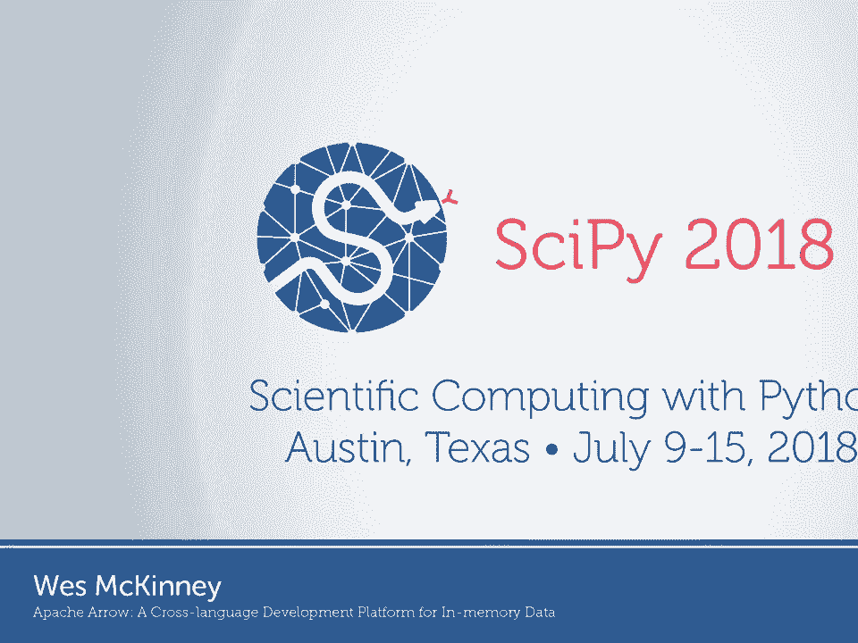
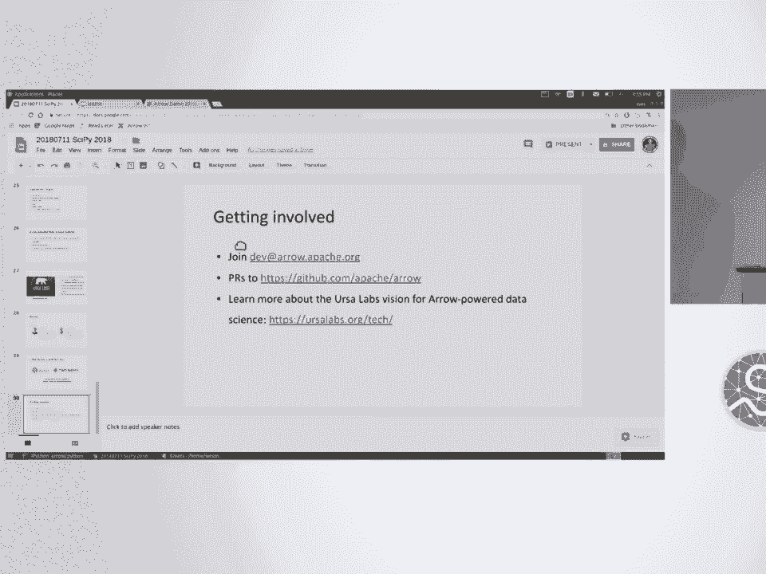
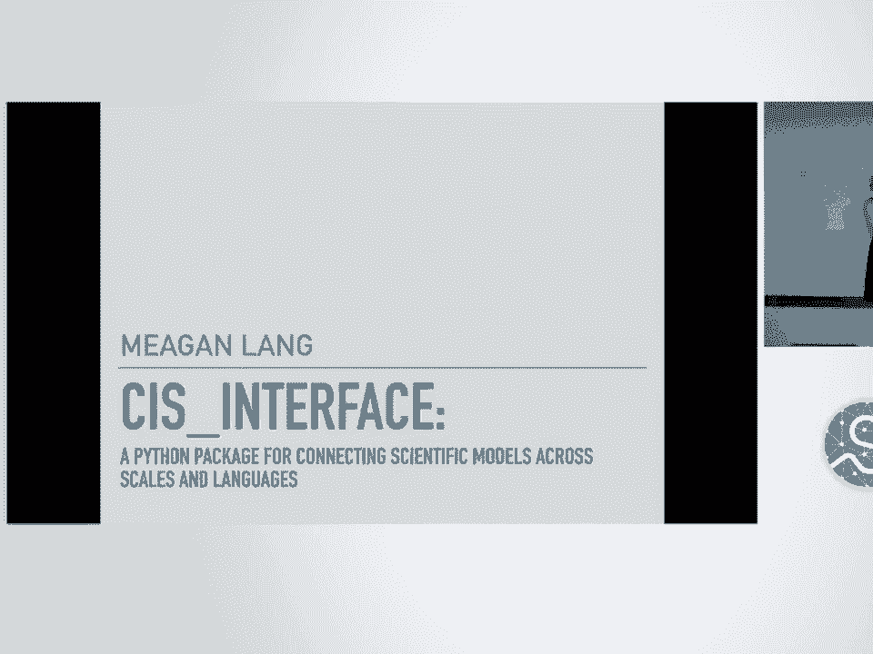

# 39：Apache Arrow - 跨语言开发平台 🚀

## 概述

在本节课中，我们将学习 Apache Arrow 项目。这是一个旨在为数据分析定义开放标准的跨语言开发平台。我们将探讨为什么需要开放标准，以及 Arrow 如何解决数据科学生态系统中的互操作性和性能问题。

---

## 为什么需要开放标准？🤔

上一节我们概述了课程内容，本节中我们来看看开放标准的重要性。

开放标准使架构更简单，避免重复设计软件或接口。在联邦式生态系统中，开放标准能减少碎片化，使系统间互操作更简单。此外，使用开放标准还能促进代码复用，减少需要解决的问题。

以下是几个常见的开放标准示例：
*   **人类可读的结构化数据**：如 XML 和 JSON。
*   **SQL**：一种标准查询语言，尽管不同数据库实现略有差异。
*   **二进制数据存储**：科学计算中使用的多种格式。
*   **大数据列式存储格式**：主要用于日志数据分析。
*   **通用序列化协议**：如 Google 的 Protocol Buffers 和 Hadoop 生态系统的 Avro。

---

## 内存数据表示标准 📊

上一节我们讨论了开放标准，本节中我们来看看内存数据表示标准。

处理内存数据是另一个重要问题。Python 科学计算生态系统的存在，很大程度上是因为我们围绕 **NDArray**（在某些社区也称为张量）概念联合起来。NumPy 实现了 **跨步 NDArray 模型**，其设计深受 Fortran 和 APL 的影响。

标准化内存格式能带来以下好处：
*   **零开销共享**：通过指针交换或元数据转换，可以在库之间传递数据而无需内存复制。
*   **进程间无复制共享**：如果设计巧妙，可以在进程间共享数据而无需复制。
*   **算法复用**：能够复用大量现有算法。
*   **存储和 I/O 子系统复用**：如果知道如何从文件读取数据，有时可以将该代码适配到其他应用。

---

## 数据框、表格与列式数据 🗂️

上一节我们了解了内存数据表示，本节中我们来看看数据框和表格。

这引出了关于数据框和表格的讨论。Pandas 内部是 NumPy 数组的复杂组合，多年来我们不得不开发自己专有的方式来表示数据框。尽管使用了 NumPy 数组，但其内部结构并非供用户直接查看。

纵观整个生态系统，**表格数据缺乏开放标准**。SQL 数据库、大数据系统、Pandas、R、Julia 等都有自己的内存格式。虽然语义上都称为数据框或表格，但数据在计算机内存中的字节表示方式不同。

以下是关注列式数据的原因：
*   **内存访问模式**：查询操作通常涉及对数据框或表格的某一列的所有元素进行操作。列式存储使得只需访问与分析相关的列，并且访问时所有值在内存中彼此相邻。
*   **性能提升**：这可以减少缓存未命中，在实践中可能带来 10 倍或 100 倍的性能提升，即使算法的时间复杂度相同。
*   **SIMD 指令**：以连续方式排列数据可以使用 SIMD 指令。
*   **向量化**：数据库中的常见技术，通过消除算法中的分支，使 CPU 效率更高。
*   **列式压缩**：许多分析数据库采用列式压缩技术，以更小的空间表示更多数据，并编写专用算法进行计算以获得更好性能。

---

## Apache Arrow 项目的目标 🎯

上一节我们探讨了列式数据的优势，本节中我们来看看 Apache Arrow 项目的目标。

许多人经历过这个问题。Arrow 项目最初的想法是定义一个**语言无关的、列式表格/数据框的开放标准**。目标是能够在 Java、C++、JavaScript 等语言中使用它，使语言能够移动大量数据并直接在该数据上执行计算，无需额外转换。

仅仅为这个“野兽”构建规范是不够的，还需要库和工具来实际使用它。在过去的两年半里，该项目已发展成为一个用于构建数据处理系统的开发平台。

从架构上看，我们拥有这些不可移植的数据框，无法复用数据和算法。我们希望有一种标准化的方式来表示数据框，以便共享数据和代码。

以 Pandas 或分析数据库的架构为例，它们是高度垂直集成的系统，组件本质上不可分割，内部结构对用户来说是个黑盒。如果想复用 Pandas 内部的代码，将非常困难。

构建 Arrow 项目的目标是**解构这些垂直集成的技术栈**。我们希望系统的组件（如内存格式、计算工具、I/O 和数据访问层）拥有公共 API。前端则保持无关性，由不同系统构建不同的前端，这是一件好事。

---

## 项目进展与应用 🌟

上一节我们介绍了 Arrow 的目标，本节中我们来看看项目的进展和应用。

项目启动约两年半，始于约 25 位开源项目领导者。我们将其设立在 Apache 软件基金会，以化解参与公司间的竞争问题。目前，我们已接近 200 位贡献者，在 8 种编程语言中提供了一定程度的支持。仅 Python 库每月安装量就超过 10 万次。

Arrow 项目催生了许多很酷的应用：
*   **Dremio**：开发了一个 LLVM 编译器，生成 C++ 原生 Arrow 函数，并通过 JNI 从 Java 调用，实现数据零复制。
*   **Ray**：构建了一个共享内存对象存储（Plasma），并捐赠给 Arrow 项目，用于零拷贝存储和读取张量或 NDArray。
*   **GPU 数据框**：NVIDIA 等公司使用 Arrow 构建 GPU 数据框，实现零拷贝工作流，让数据直接留在 NVIDIA GPU 上。

Arrow 有多种用例：
*   作为分析查询处理的运行时格式。
*   用于数据交换。
*   构建流式客户端-服务器消息系统。
*   构建文件格式，帮助访问磁盘上的大型数据集。

---

## 未来工作与总结 🚀

上一节我们看到了 Arrow 的广泛应用，本节中我们来看看未来的计划和课程的总结。

项目计划进行大量工作以提高开发人员生产力并扩展开发平台的范围。我们将构建计算函数库（包括 LLVM 项目 GANDIVA 和非 LLVM 内核），并大力构建数据摄取和访问层（如 Parquet、ORC 支持，以及通过 Turbodbc 进行 ODBC 数据库访问）。

我的目标是在未来 5 到 10 年内，为基于 Arrow 的数据科学系统奠定基础，拥有可在多种编程语言（Julia、R、Python、Ruby、Java）中使用的公共库和运行时。为此，我创立了 Ursa Labs 组织，并得到了 RStudio、Hadley Wickham 以及 Two Sigma 的支持。

## 总结

本节课中，我们一起学习了 Apache Arrow 项目。我们探讨了开放标准的重要性，以及现有数据框/表格生态系统中缺乏标准导致的问题。我们深入了解了 Arrow 的目标：创建一个语言无关的列式数据标准，以促进零拷贝数据共享和算法复用。我们还回顾了项目的进展、令人兴奋的应用案例以及未来的发展方向。通过合作构建可复用的库和可移植的系统，我们可以极大地提高生产力和成功率。