# 40：SciPy 2018 视频专辑 - 80种方式环游世界：Cartopy 入门教程 🗺️

在本课程中，我们将学习地图投影的基础知识，并介绍如何使用 Python 的 Cartopy 库及其生态系统中的工具进行地理空间数据处理和可视化。

---


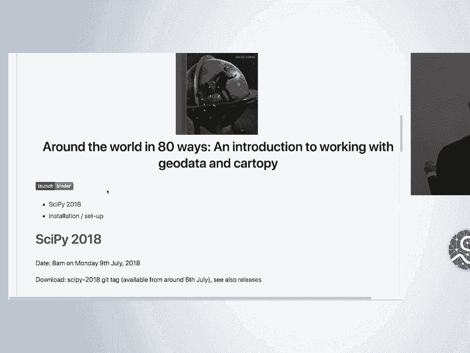

## 概述

本教程旨在提供关于 Cartopy 的背景知识，同时也会涉及一些地理空间术语。Cartopy 并非孤立存在，它是更广泛生态系统的一部分。我们将学习如何协同使用这些工具来完成强大的地理空间任务。

---

## 地图投影基础 🌍

上一节我们介绍了本课程的目标，本节中我们来看看地图投影的基本概念。

地球并非平面，尽管有些人坚持相反的观点。地图投影之所以必要，正是因为地球不是平的。然而，我们使用的大多数媒介（如纸张、屏幕）都是二维的。因此，我们需要投影。

地图投影是一种系统性的变换，它将球体或椭球体表面上的经纬度位置转换为平面上的位置。

所有地图投影都存在一个问题：为了将球面映射到平面，必须在某处进行切割。无论怎么做，都会扭曲底层表示的某些属性。这些扭曲可能涉及面积、形状、方向、距离和比例尺。所有投影都会在某些方面造成扭曲。

因此，理解地图投影以及何时使用特定投影，是为了保留对你重要的属性。

地图投影有很多种，有几种方法可以对它们进行分类。主要可以通过投影的形成方式（表面分类）或它们保留的度量属性来分类。

### 表面分类

主要有三种类型的表面分类，用于将球面映射到平面：

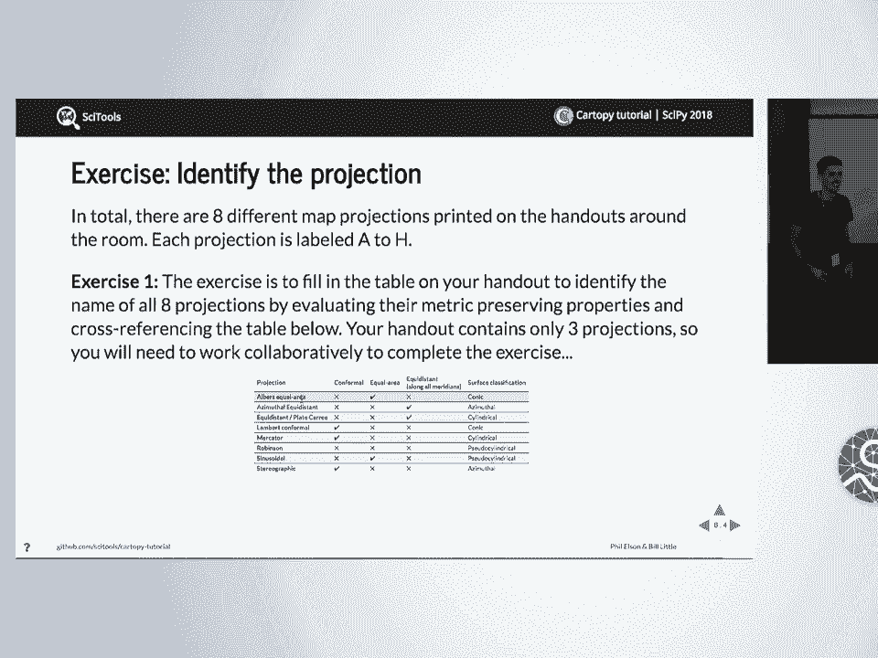

*   **圆柱投影**：顾名思义，构造一个圆柱体，并将经纬度映射到圆柱体上。其特点是经线和纬线是直的且相互垂直。
*   **方位投影**：将一个平面放置在球体顶部并向外投影。其特点是纬线是完整的圆。通常，方位投影有一个或两个中心点，从这些中心点出发的所有大圆都是直线。
*   **圆锥投影**：其特点是经线是直线（不平行），纬线是圆弧（非完整圆）。这通常导致投影的顶部和底部有明显的弯曲。

然而，只有少数投影能完全符合这些类别。之后，还会出现伪圆柱、伪方位等投影，或者各种随机组合的投影。

### 按保留属性分类

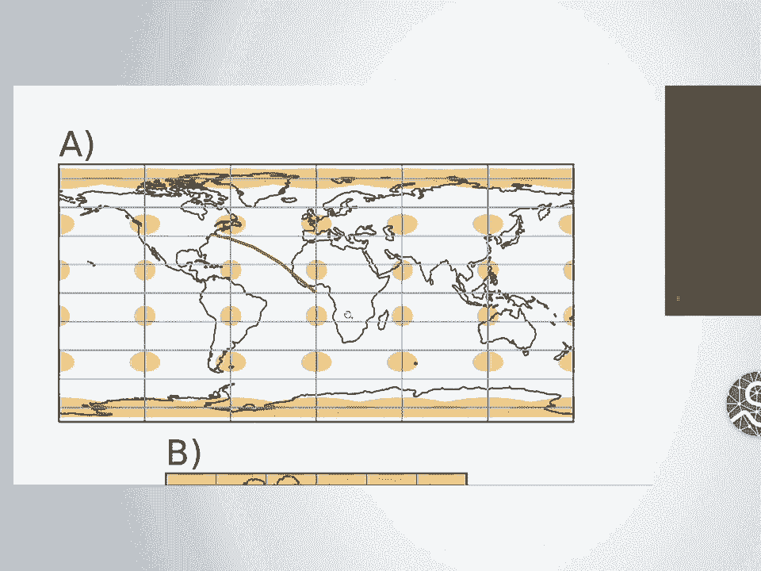


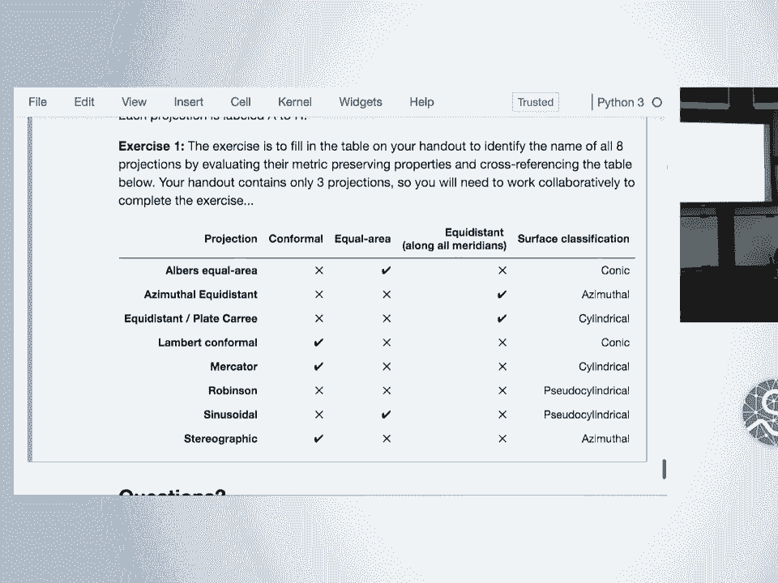

将球面投影到平面时，会损失一些行为，无论是距离、形状、比例尺等。有些投影旨在保留特定的属性。

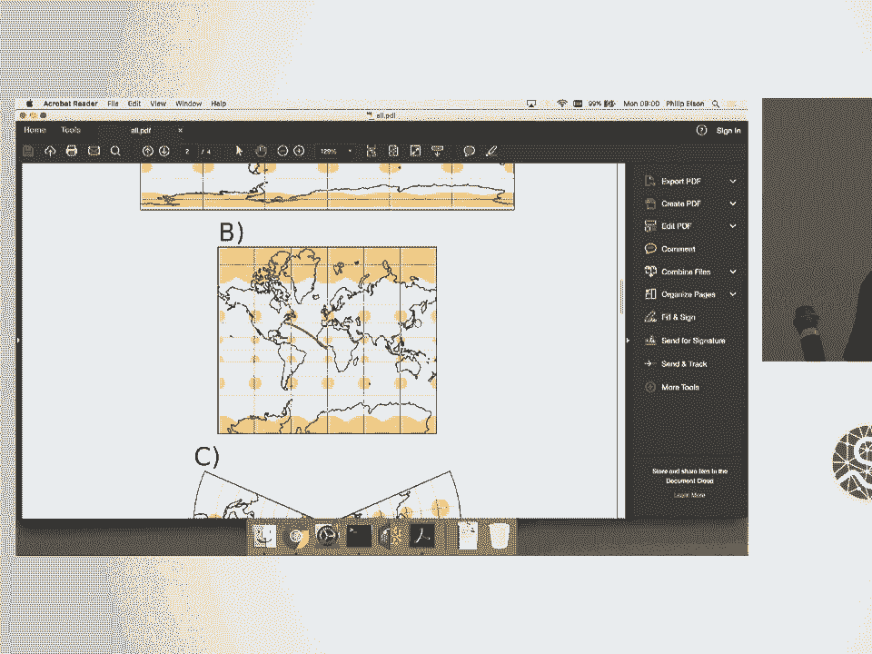

*   **等角投影**：保留形状。如果你关心国家边界或其他轮廓的形状，可能会选择等角投影，但这可能会以牺牲其他度量（如距离或面积）为代价。例如，墨卡托投影和横轴墨卡托投影在任何地方都保留形状。
*   **等距投影**：保留距离。如果你关心投影上点之间的距离测量，可能会选择等距投影，但这可能会在其他方面有所妥协。等距投影保留标准点或线之间的距离。
*   **等积投影**：保留面积。如果你出于某种原因关心面积，可以选择等积投影。同样，这可能会最小化其他度量的扭曲。

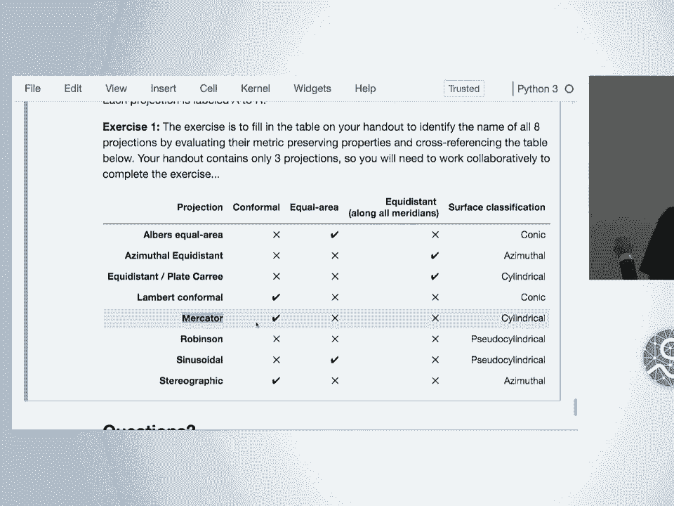

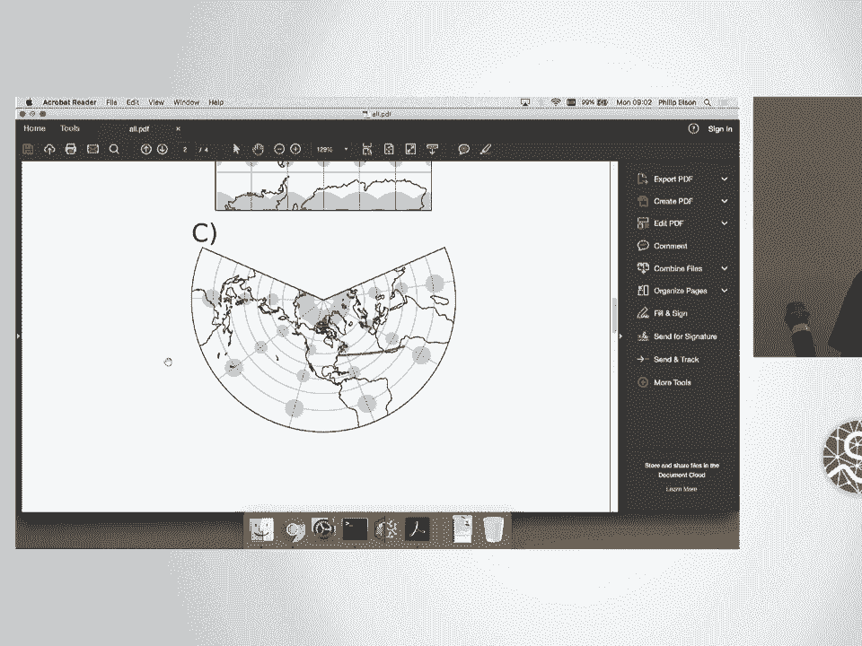

当然，正如 Phil 所说，没有投影能完美地符合所有这些分类。总会有妥协，有些投影可能无法覆盖所有方面，但足以以一种可理解的方式展示你的数据。

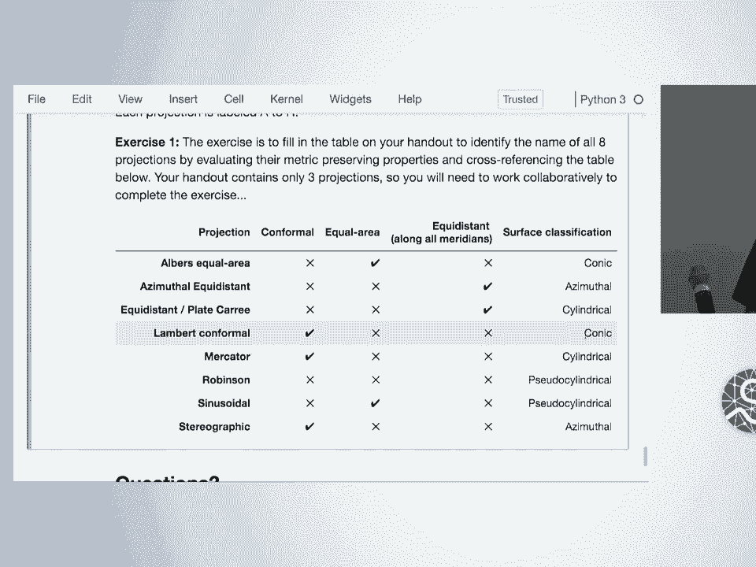

### 使用 Tissot 指示器

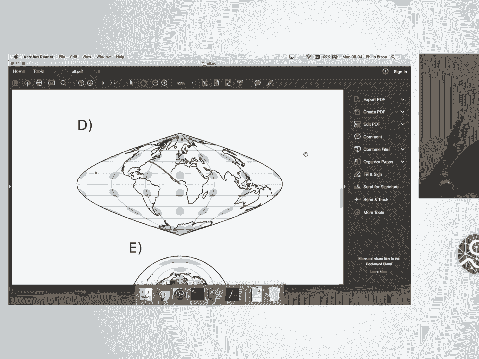

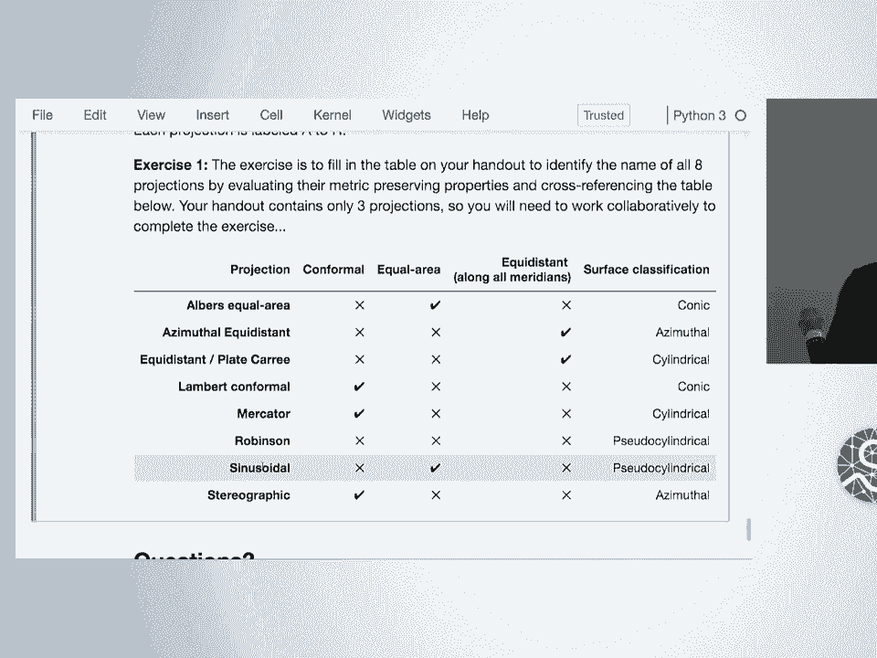

Tissot 指示器是一种可视化投影扭曲程度的方法。它在你选择的投影上绘制一系列圆圈，这些圆圈会根据投影的不同而发生扭曲。通过观察这些圆圈的形状和大小变化，可以推断投影的属性。

以下是使用 Tissot 指示器判断投影类型的一些启发式方法：

*   **等角投影**：球面上的圆圈在投影后仍保持为圆形。
*   **等积投影**：球面上面积恒定的圆圈在投影后面积大致相同（形状可能被拉伸）。
*   **等距投影**：距离沿经线保留。在投影中，观察经线和纬线，沿经线的距离是相同的，不会被拉伸。

另一个有用的启发是观察格陵兰岛和非洲的相对大小。如果格陵兰岛看起来被拉伸得很大，那么它就不是等积投影。

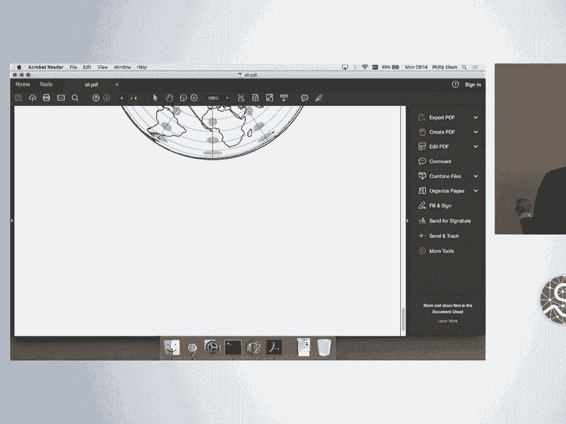


---

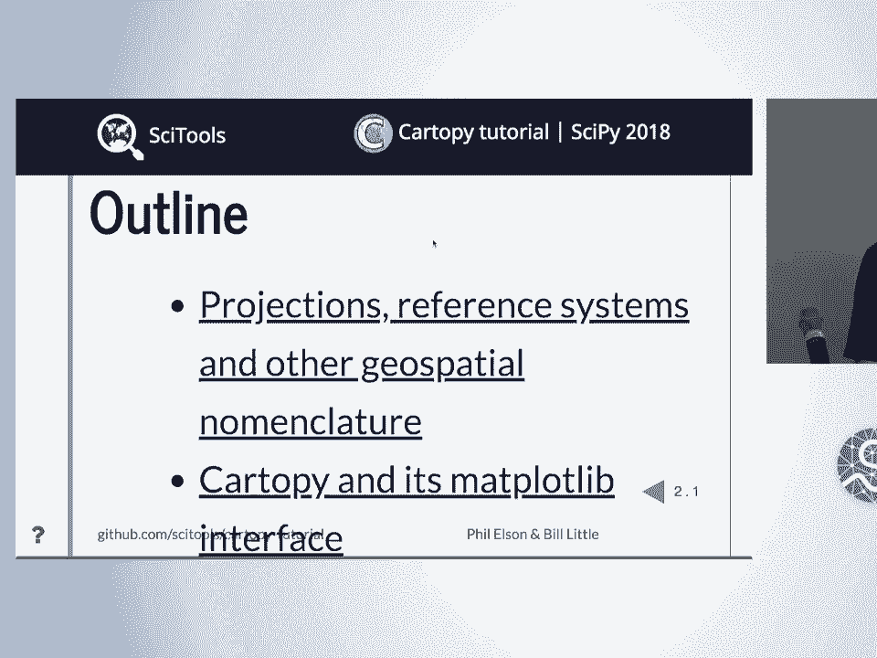

## 互动练习：识别投影属性 🧩

为了巩固对投影属性的理解，我们将进行一个互动练习。你需要与周围的同学合作，共同完成一个表格。

你手上有一些投影图像（标记为 A 到 H），但每个人只有其中的三到四张。你的任务是填写一个表格，为每个投影判断它是否是等角的、等积的、等距的，并确定其表面分类类型（如圆柱、方位、圆锥等）。

你需要与邻居交流，获取他们手上的投影图像信息，共同完成整个表格。

**投影 A 的分析示例**：
让我们以投影 A 为例，共同分析其属性。

*   **是否为等角投影？** 不是。因为图像中的圆圈（Tissot 指示器）不再是圆形，发生了明显的拉伸。
*   **是否为等积投影？** 不是。圆圈的面积看起来明显不同（例如，靠近极点的圆圈比赤道附近的大得多）。
*   **是否为等距投影？** 是（沿经线）。观察沿同一经线上圆圈的高度或平行线之间的间距，它们看起来大致相同。
*   **表面分类类型？** 圆柱投影。因为地图呈矩形，且经线和纬线是直的并以直角相交。

根据表格对照，这符合“等距圆柱投影”的特征。

---

## Cartopy 与 Matplotlib 的接口 🐍

上一节我们通过练习熟悉了投影属性，本节中我们来看看 Cartopy 的核心接口及其与 Matplotlib 的集成。

Cartopy 的一个优点是它与 Matplotlib 深度集成。如果你使用 Matplotlib，Cartopy 并非其上的一个包装器，而是无缝衔接，因此在使用 Cartopy 时不应感到意外。

Cartopy 提供了丰富的文档，包括图库示例、教程和投影列表，帮助你理解 Cartopy 和 Matplotlib 如何协同工作。

### 核心概念：GeoAxes

在 Matplotlib 中，绘图的“货币”是坐标轴（Axes）。但标准的 Axes 不理解地理空间信息。Cartopy 的关键在于它理解 Matplotlib 的语言，并返回一个类似坐标轴的对象，但它具有绘制地图所需的智能。这个对象就是 `GeoAxes`。

`GeoAxes` 是 `Axes` 的子类，因此你拥有所有标准的 Axes 行为，外加一系列专门用于地理空间绘图的新方法。

### 创建第一个地图

以下是如何使用 Cartopy 创建一个简单地图的步骤：

1.  **导入 Cartopy 的坐标参考系统模块**：
    ```python
    import cartopy.crs as ccrs
    ```
2.  **实例化一个投影对象**（例如，普拉特卡雷投影）：
    ```python
    proj = ccrs.PlateCarree()
    ```
3.  **使用 Matplotlib 创建图形和坐标轴，并通过 `projection` 参数指定投影**：
    ```python
    import matplotlib.pyplot as plt
    fig = plt.figure()
    ax = plt.axes(projection=proj)
    ```
    此时，`ax` 是一个 `GeoAxes` 对象。
4.  **使用 `GeoAxes` 的方法添加地理特征**，例如海岸线：
    ```python
    ax.coastlines()
    plt.show()
    ```

### GeoAxes 的实用方法

`GeoAxes` 提供了一些非常实用的方法，用于常见的地图绘制任务：

*   `coastlines()`: 添加海岸线。
*   `gridlines()`: 绘制经纬网（格网线）。
*   `stock_img()`: 添加一个低分辨率的全球自然地球图像作为背景。
*   `add_geometries(geometries, crs, **kwargs)`: 直接添加 Shapely 几何对象到地图上，Cartopy 会为你投影它们。
*   `set_global()`: 将地图缩放到投影允许的最大范围。
*   `set_extent(extent)`: 设置地图的边界框（范围）以进行缩放。

这些方法（除了 `imshow` 被重载外）都是 `GeoAxes` 新增的，使得地理空间绘图更加便捷。

### 添加自定义数据

你可以使用标准 Matplotlib 方法（如 `plot`, `scatter`, `imshow`）或 Cartopy 增强的方法向 `GeoAxes` 添加数据。关键点在于指定数据的坐标参考系统。

**示例：添加图像和几何形状**

```python
import matplotlib.image as mpimg
import fiona
from shapely.geometry import shape

# 1. 加载图像（栅格数据）
img = mpimg.imread('path/to/image.png')
# 2. 加载形状文件（矢量数据）
with fiona.open('path/to/states.shp') as source:
    geometries = [shape(feat['geometry']) for feat in source]

# 创建地图
proj = ccrs.PlateCarree()
fig = plt.figure()
ax = plt.axes(projection=proj)

# 添加图像，并指定其原始坐标系统（例如 PlateCarree）
ax.imshow(img, extent=[-180, 180, -90, 90], transform=ccrs.PlateCarree(), origin='upper')

# 添加几何形状，并指定其坐标系统
ax.add_geometries(geometries, crs=ccrs.PlateCarree(), edgecolor='black', facecolor='none')

plt.show()
```

**关键参数：`transform`**

代码中的 `transform` 参数至关重要。它指定了你所添加**数据**的坐标参考系统（CRS），而不是地图的目标投影。地图的目标投影是在创建 `GeoAxes` 时通过 `projection` 参数设定的。

Cartopy 的设计目的是为你重新投影数据。在大多数情况下，当你添加数据时，Cartopy 会自动处理极点、日期变更线交叉和边界等问题。

---

## 处理线条：大圆与恒向线 🌐

上一节我们介绍了如何添加数据，本节中我们深入探讨一下线条的绘制，特别是大圆与恒向线的区别。

在球面上，两点之间可以绘制多种线条。在投影空间中，两点之间也有多种绘制线条的方式。我们讨论两种最常见的：

1.  **大圆（最短路径）**：球面上两点之间的最短距离。在大多数投影中，这条路径显示为曲线。
2.  **恒向线（直线）**：在特定投影（如普拉特卡雷投影）的坐标空间中，两点之间的直线。这通常不是最短路径。

### 代码示例

```python
import numpy as np

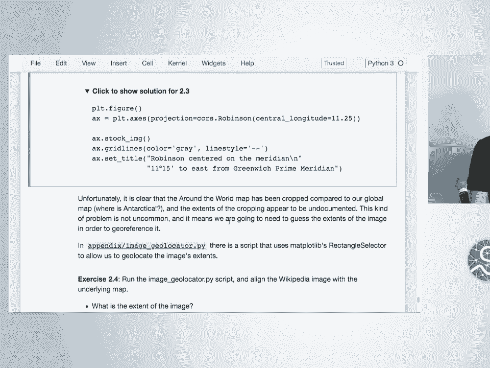

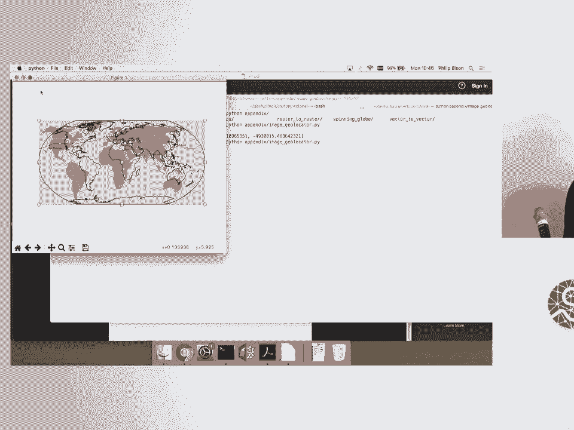

# 定义两个城市的坐标
london_lon, london_lat = -0.1275, 51.5072
new_york_lon, new_york_lat = -74.0059, 40.7128

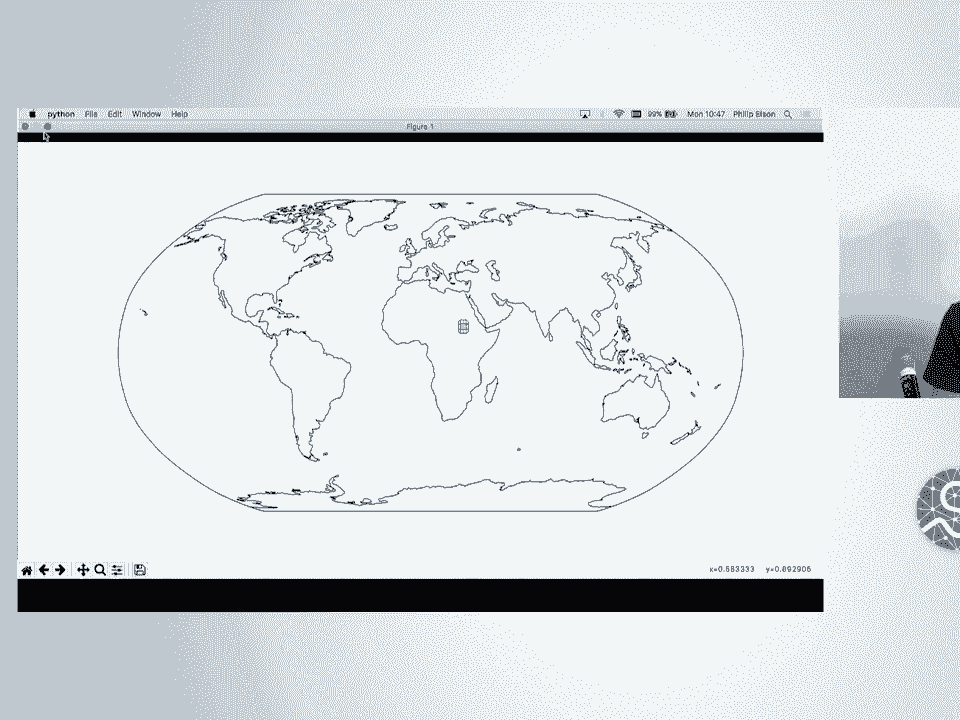

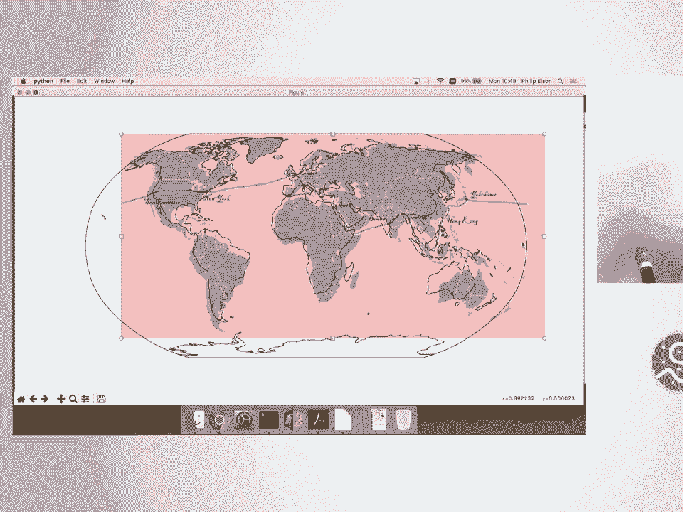

# 创建地图
proj = ccrs.PlateCarree()
fig = plt.figure()
ax = plt.axes(projection=proj)
ax.coastlines()

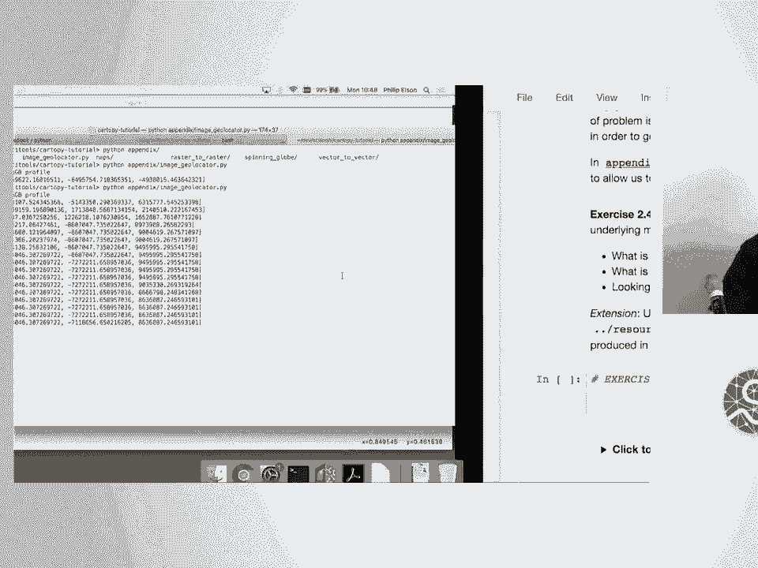

# 绘制恒向线（在 PlateCarree 投影中的直线）
ax.plot([london_lon, new_york_lon], [london_lat, new_york_lat],
         transform=ccrs.PlateCarree(), label='Rhumb Line', color='blue')

# 绘制大圆（球面上的最短路径）
ax.plot([london_lon, new_york_lon], [london_lat, new_york_lat],
         transform=ccrs.Geodetic(), label='Great Circle', color='red')

plt.legend()
plt.show()
```

**解释**：
*   `transform=ccrs.PlateCarree()`：告诉 Cartopy 这些坐标是在普拉特卡雷投影（经纬度直接映射为直角坐标）中给出的，因此两点之间的线段应绘制为该投影中的直线。
*   `transform=ccrs.Geodetic()`：告诉 Cartopy 这些坐标是地理坐标（经纬度），连接两点的线段应表示为球面上的大圆（最短路径）。Cartopy 会自动计算并在当前投影中绘制这条曲线。

### 在方位投影中观察大圆

方位投影有一个特性：从投影中心出发的大圆是直线。因此，如果我们创建一个以纽约为中心的立体方位投影，那么从纽约出发到伦敦的大圆路径将显示为直线。

```python
# 创建以纽约为中心的立体方位投影
center_lon, center_lat = new_york_lon, new_york_lat
proj = ccrs.Stereographic(central_longitude=center_lon, central_latitude=center_lat)

fig = plt.figure()
ax = plt.axes(projection=proj)
ax.set_extent([-120, -60, 20, 60], crs=ccrs.PlateCarree()) # 设置视图范围
ax.gridlines()
ax.stock_img()
ax.add_feature(cfeature.STATES)

# 绘制线条（使用与之前相同的代码，但地图投影变了）
ax.plot([london_lon, new_york_lon], [london_lat, new_york_lat],
         transform=ccrs.PlateCarree(), label='PlateCarree Line', color='blue')
ax.plot([london_lon, new_york_lon], [london_lat, new_york_lat],
         transform=ccrs.Geodetic(), label='Great Circle', color='red')
plt.legend()
plt.show()
```

在这个新投影中，红色的“大圆”线变成了直线（因为从中心纽约出发），而蓝色的“普拉特卡雷”线则变成了曲线。这展示了数据（线条）保持不变，但根据地图投影的不同，其视觉呈现方式发生了变化。

### 控制投影精度

自动重投影的一个潜在缺点是性能开销和对插值精度的控制有限。例如，大圆路径在投影中是由许多小直线段近似表示的。Cartopy 使用一个阈值来决定需要多少线段。

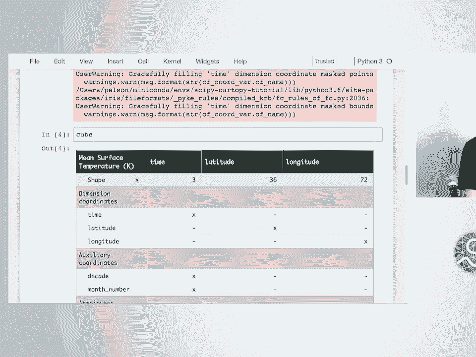

你可以通过子类化投影并调整 `threshold` 参数来提高精度：

```python
class HighResStereographic(ccrs.Stereographic):
    @property
    def threshold(self):
        return 1e3  # 降低阈值，提高精度

proj = HighResStereographic(central_longitude=center_lon, central_latitude=center_lat)
# ... 然后像之前一样使用这个投影
```

这会使得曲线看起来更平滑。

---

## 实践：绘制菲利斯·福格的路线 ✈️

现在，让我们应用所学知识，绘制 Jules Verne 小说《八十天环游地球》中主人公菲利斯·福格的路线。

我们已知他途经的主要城市及其坐标。目标是绘制一条连接这些城市的大圆路线。

```python
# 城市坐标字典
places = {
    'London': (-0.1275, 51.5072),
    'Suez': (32.5498, 29.9831),
    'Bombay': (72.8777, 19.0760),
    'Calcutta': (88.3639, 22.5726),
    'Hong Kong': (114.1095, 22.3964),
    'Yokohama': (139.6380, 35.4437),
    'San Francisco': (-122.4194, 37.7749),
    'New York': (-74.0059, 40.7128),
}

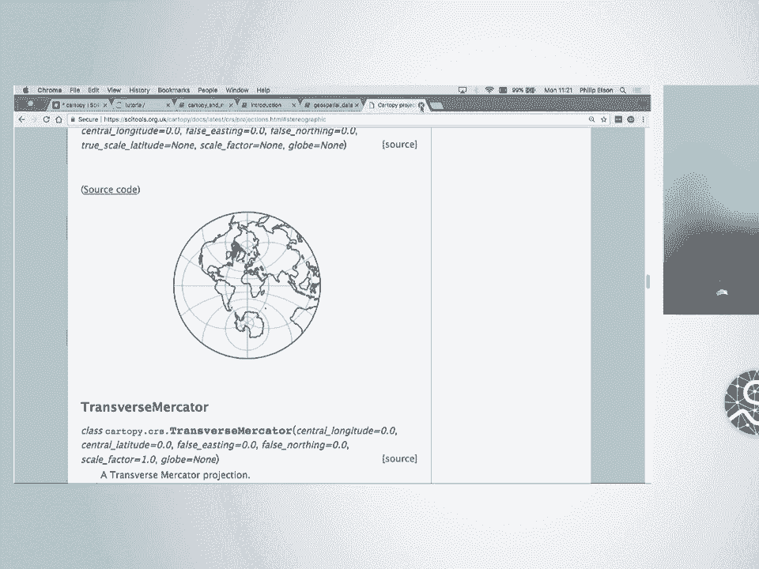

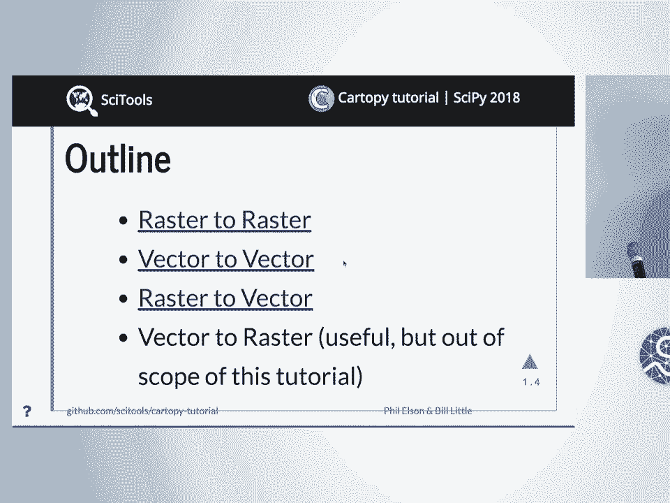

# 提取经纬度列表
route = ['London', 'Suez', 'Bombay', 'Calcutta', 'Hong Kong', 'Yokohama', 'San Francisco', 'New York']
lons = [places[city][0] for city in route]
lats = [places[city][1] for city in route]

# 创建地图
proj = ccrs.PlateCarree()
fig = plt.figure(figsize=(12, 6))
ax = plt.axes(projection=proj)

# 添加背景和海岸线
ax.stock_img()
ax.coastlines()
ax.set_title("Phileas Fogg's Route Around the World (Great Circle)")

# 绘制大圆路线
ax.plot(lons, lats, transform=ccrs.Geodetic(),
         color='orange', linewidth=2, marker='o')

plt.show()
```

**注意**：你可能会发现路线在太平洋区域（跨越国际日期变更线）出现不希望的“环绕”现象。这是因为 Cartopy 的某些启发式方法将闭合的线段误判为多边形。在实际应用中，可能需要更精细地处理分段绘制或使用其他方法来避免此问题。

---

## 地理配准与图像叠加 🖼️

有时，我们有一张地图图片（栅格数据），需要将其与地理坐标对齐，以便在其上叠加其他数据。这个过程称为地理配准。

在本教程中，我们有一张来自维基百科的、描绘福格路线的罗宾逊投影地图图片。我们的目标是：
1.  确定图片的投影（我们猜测是罗宾逊投影）。
2.  确定图片在地图投影坐标系中的范围（边界框）。
3.  使用 Cartopy 加载该图片，并使用正确的范围和变换将其显示在罗宾逊投影地图上。

### 步骤简述

1.  **确定投影**：通过视觉对比，我们确定图片使用的是罗宾逊投影，并且其中央子午线可能有所偏移。
2.  **地理配准工具**：我们使用了一个简单的交互式脚本（`image_geolocator.py`），允许用户拖动、缩放图片，使其与 Cartopy 绘制的底图对齐。对齐过程中，脚本会实时输出图片在当前投影（罗宾逊投影）坐标系中的范围（`[xmin, xmax, ymin, ymax]`）。
3.  **加载并显示图片**：获得范围后，我们可以使用 `imshow` 并指定 `transform` 参数来正确显示图片。

```python
import matplotlib.image as mpimg

# 之前通过地理配准工具获得的范围（单位：罗宾逊投影坐标）
extent = [-169.5, 191.5, -75.0, 91.0]  # xmin, xmax, ymin, ymax

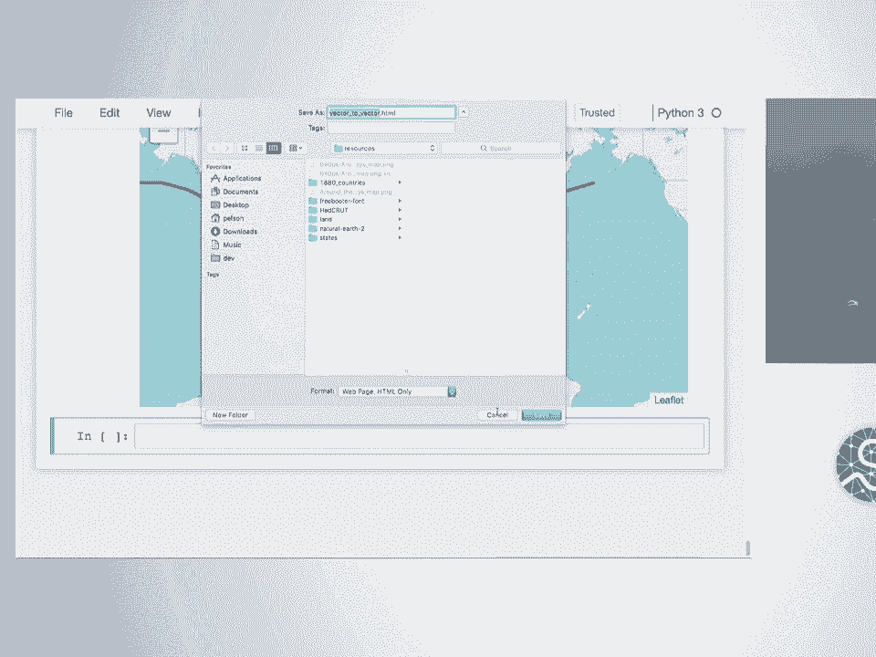

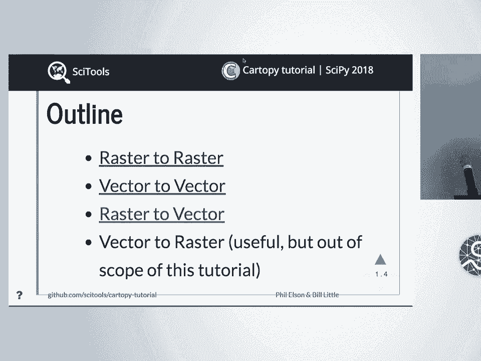

# 创建罗宾逊投影地图（中央子午线偏移与图片一致）
proj = ccrs.Robinson(central_longitude=11.25)
fig = plt.figure()
ax = plt.axes(projection=proj)
ax.gridlines()
ax.coastlines()

# 加载图片
img = mpimg.imread('path/to/wiki_route_image.png')

# 显示图片，关键是指定其坐标系统（transform）和范围（extent）
ax.imshow(img, extent=extent, transform=proj, origin='upper', alpha=0.7)

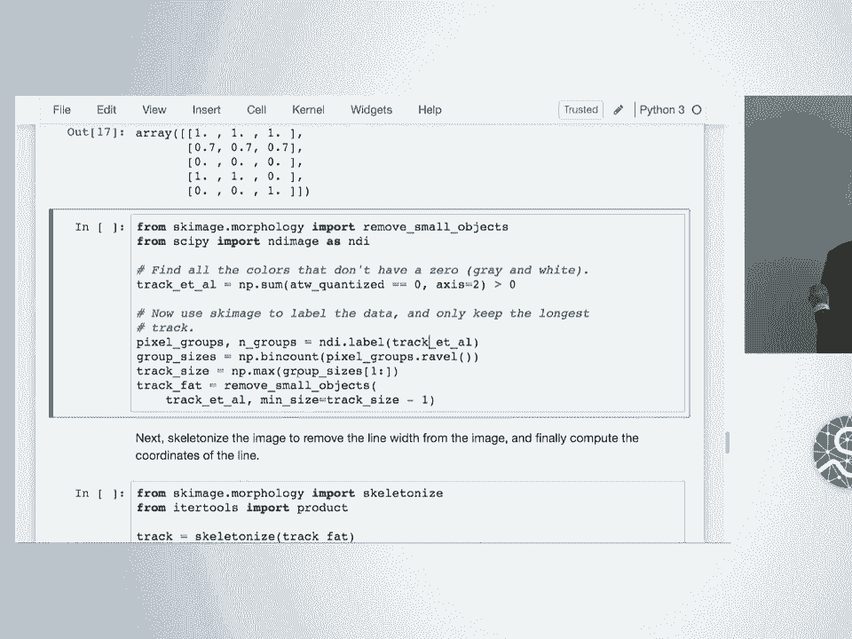

plt.show()
```

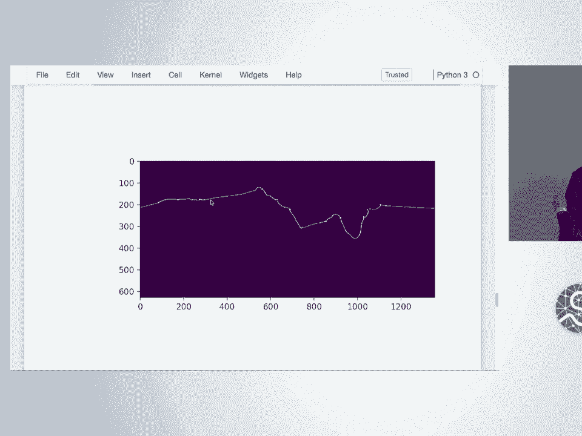

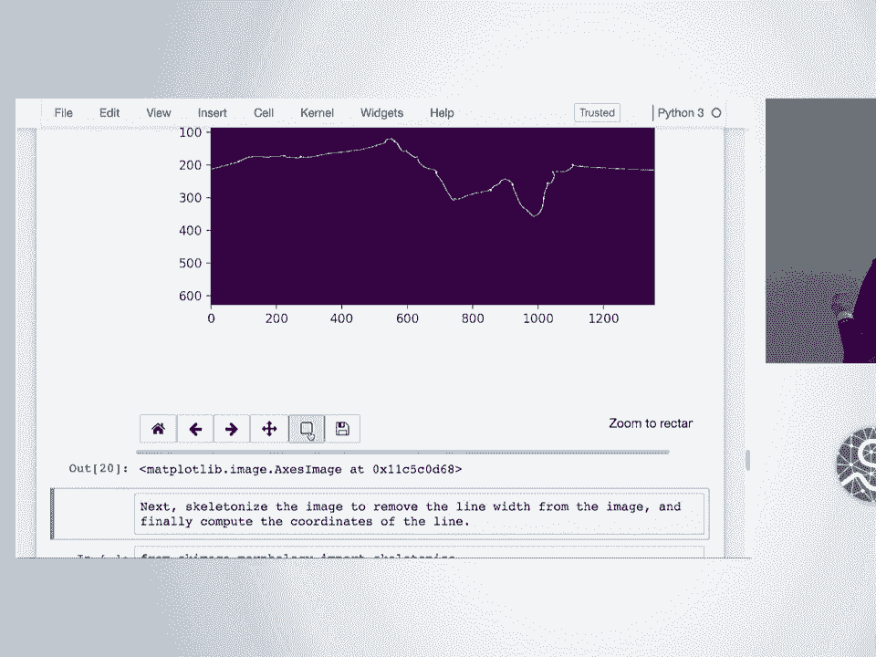

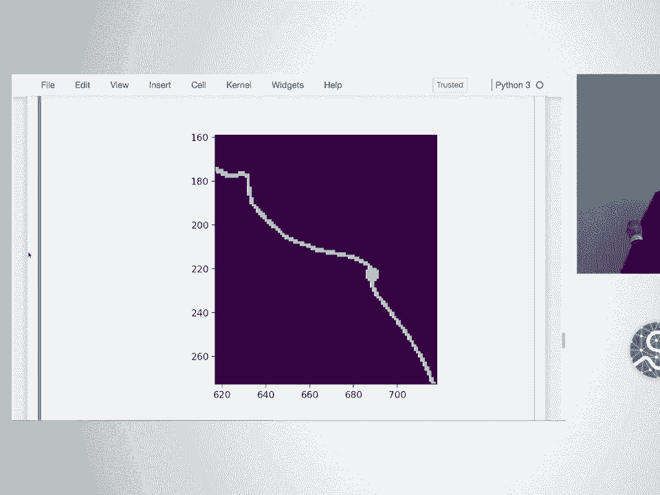

现在，这张维基百科图片就正确地叠加在了我们的罗宾逊投影地图上。我们可以进一步在其上叠加温度数据或其他矢量数据。

---

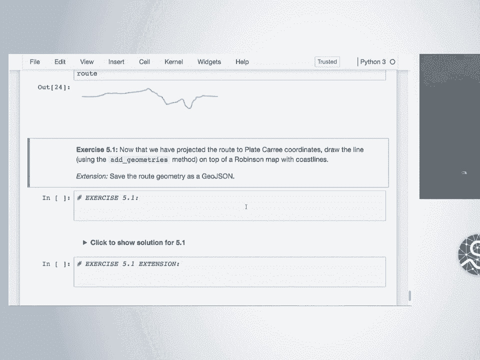

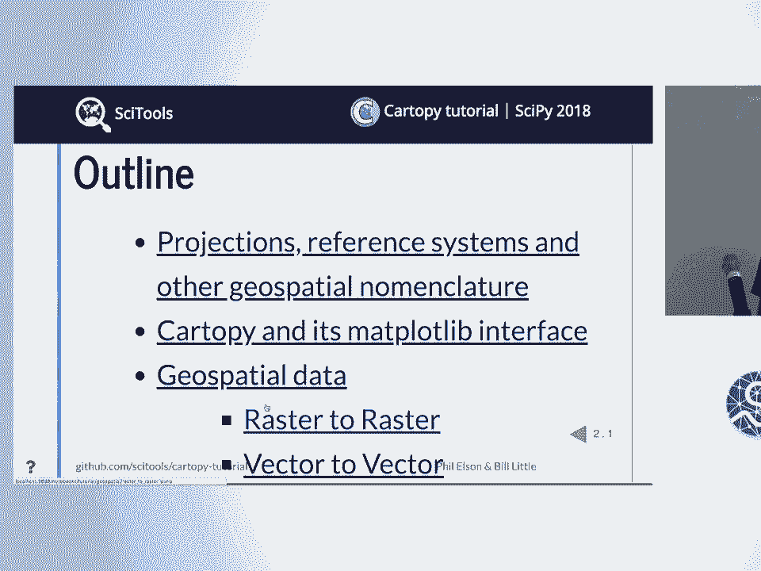

## 栅格数据处理与 Iris 🌡️

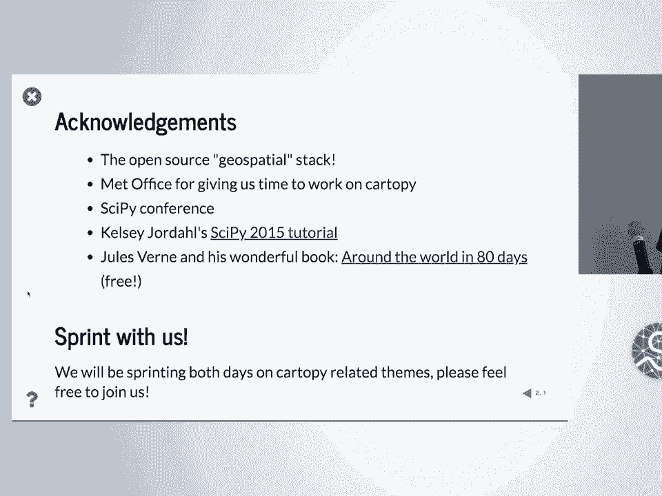

上一节我们处理了静态图片，本节中我们来看看如何处理科学栅格数据（如气候数据），并使用