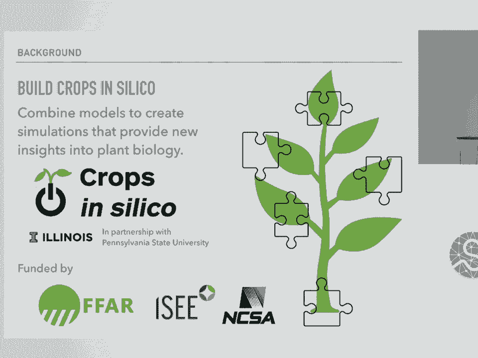
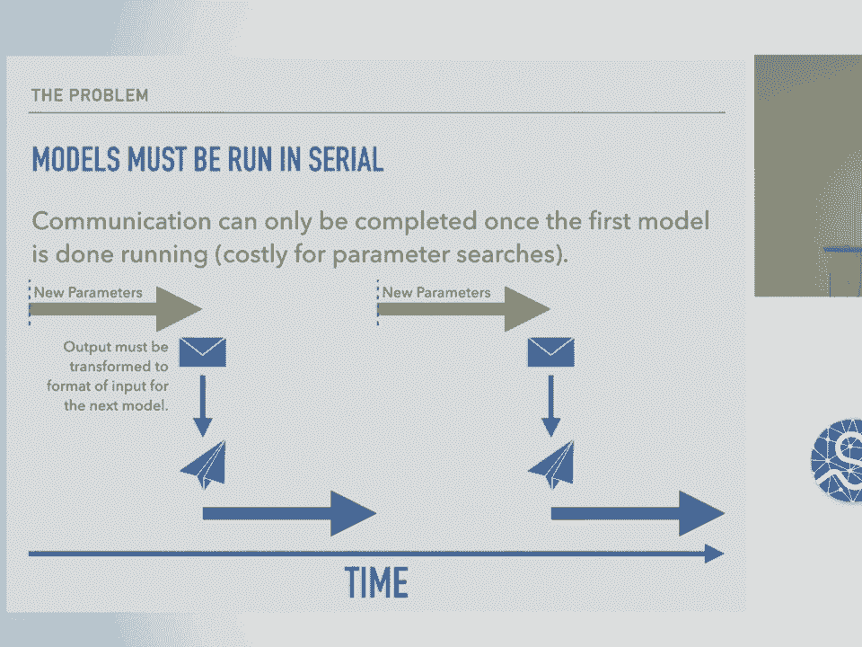
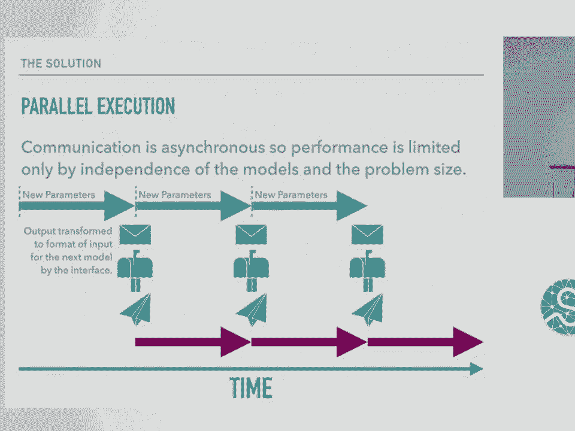
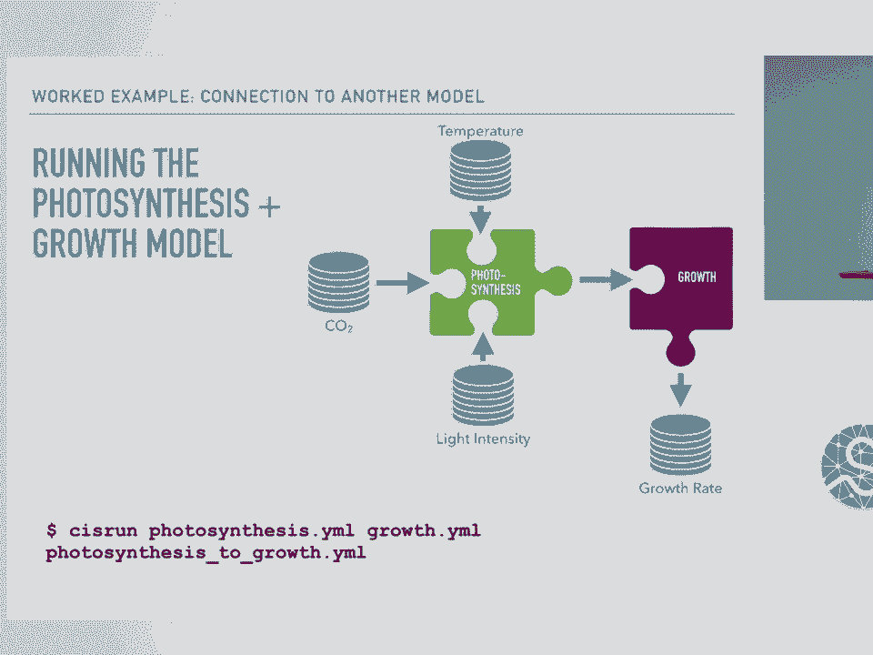
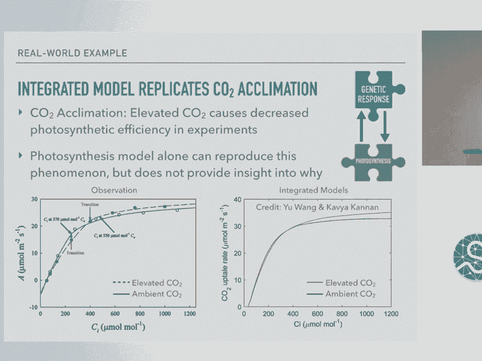
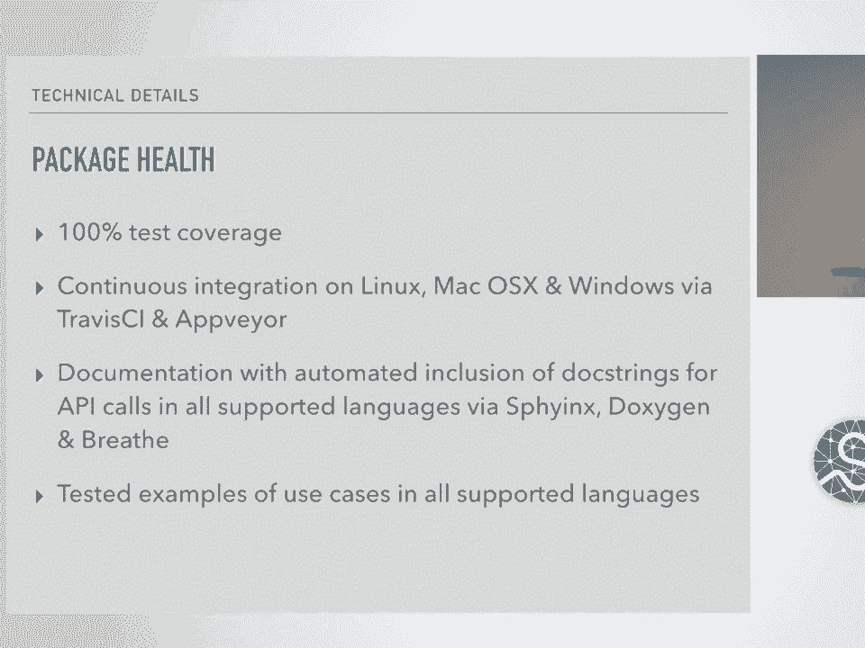
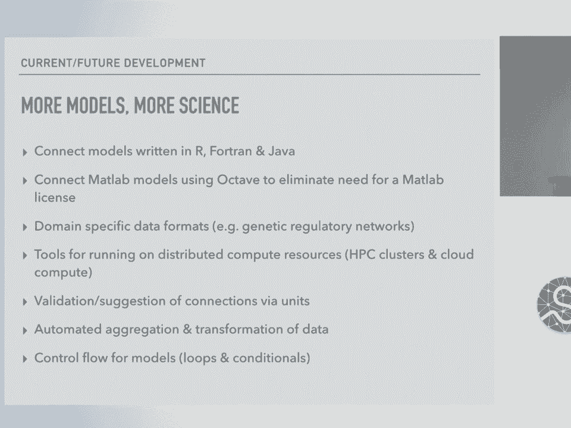
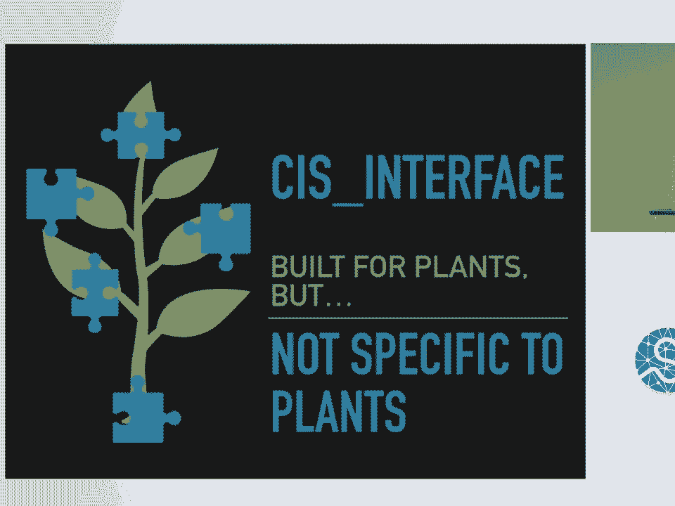
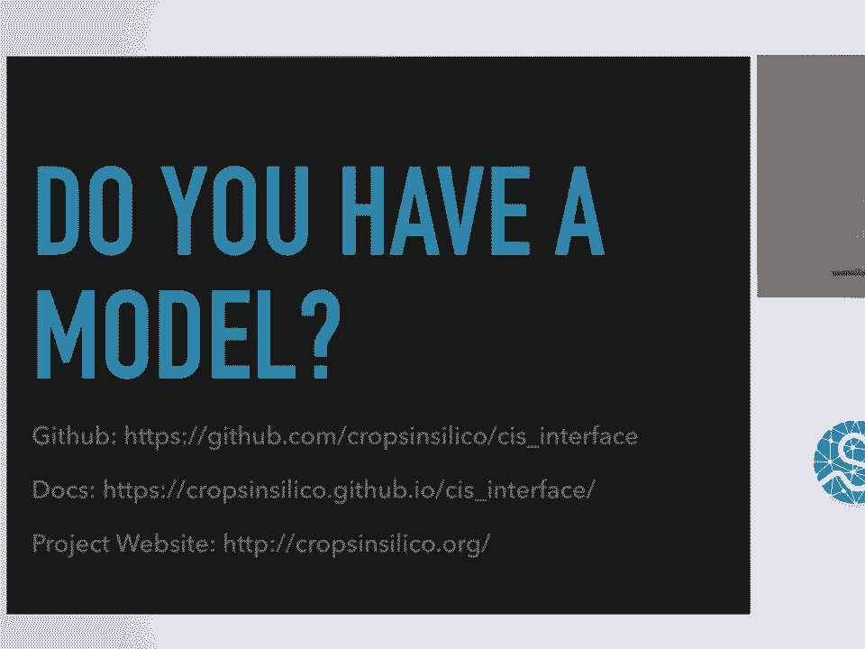

# 41：跨尺度与语言连接科学模型 🧬


在本节课中，我们将要学习一个名为 **CIS Interface** 的 Python 包。这个工具旨在解决一个关键问题：如何将用不同编程语言编写、在不同尺度上运行的科学模型连接起来，使它们能够协同工作。我们将从问题背景出发，了解其工作原理，并通过一个简单示例展示其使用方法。

## 背景：为什么需要 CIS Interface？

上一节我们介绍了课程主题，本节中我们来看看创建这个包的背景原因。

作物生物学家面临一个共同挑战：确保在气候变化下仍有足够的粮食。环境因素如温度、二氧化碳浓度和可用水量都会影响作物产量。科学家们希望通过干预措施（如新作物基因、田间管理等）来维持产量。

目前，作物生物学界已有大量计算模型，分别模拟植物的不同部分（基因、分子、植株、根系等）。然而，这些模型都是为特定问题独立开发的，缺乏一个整合的、能模拟整个作物的方法。



因此，伊利诺伊大学与宾夕法尼亚州立大学合作的 **Crops in Silico** 项目应运而生。该项目旨在建立一个社区，帮助作物科学家整合各自的模型，共同构建一个“硅基作物”，以探索保障粮食安全的策略。


## 核心挑战：模型兼容性问题

尽管这些模型在科学层面是互补的，但将它们组合起来却面临巨大困难。

这些模型在开发时并未考虑彼此协作，因此存在严重的兼容性问题。它们通常使用完全不同的编程语言编写，这使得模型间通信变得异常困难。这就像试图将来自不同拼图的碎片强行拼合在一起。

在没有 CIS Interface 的情况下，科学家们只有两种选择：
1.  **重写模型**：将一个或两个模型用同一种语言重写，以实现直接交互。但这非常耗时，且对可能缺乏正规编程训练的领域科学家来说负担过重。
2.  **串行运行与手动转换**：先运行一个模型，将其输出手动转换为另一个模型接受的格式，再运行第二个模型。这同样需要编写转换代码，且数据格式通常非常专业、难以理解。更重要的是，这种方式只能串行运行模型，在进行参数搜索等计算密集型任务时效率极低。

## 解决方案：CIS Interface 简介




为了解决上述问题，我们开发了 CIS Interface 包。

CIS Interface 的设计目标明确：
*   **跨语言通信**：允许不同编程语言编写的模型进行通信。
*   **并行运行**：允许模型并行运行，以充分利用计算资源。
*   **自动数据转换**：自动处理模型间的数据格式转换，减轻科学家负担。

在通信方面，CIS Interface 为每种支持的编程语言（目前包括 Python、MATLAB、C 和 C++）提供了原生 API。科学家只需在原有源代码中添加简单的发送（`send`）和接收（`receive`）调用，修改极小。这个 API 是灵活的，无论连接什么模型或文件，调用方式都一致。

在运行方式上，CIS Interface 实现了模型的并行运行。当一个模型完成一组参数的计算后，接口会自动处理数据转换并传递给下一个模型，同时第一个模型可以立即开始处理下一组参数。这大大提高了计算效率。

## CIS Interface 工作原理概述



CIS Interface 的运行基于 YAML 配置文件。

以下是其工作流程：
1.  **模型描述**：科学家通过 **模型 YAML 文件** 声明模型的属性，如名称、编程语言、源代码位置以及输入/输出通道。
2.  **连接描述**：通过 **连接 YAML 文件** 声明模型之间、或模型与文件之间应该如何连接。
3.  **执行**：CIS Interface 读取这些 YAML 文件，在新的进程中启动各个模型，并使用线程进行异步协调，管理模型间的并行通信。


## 实战示例：连接一个简单模型

让我们通过一个具体例子，看看如何将一个现有模型转换为使用 CIS Interface。

假设我们有一个光合作用模型（`photosynthesis.py`），它从三个文件（温度、二氧化碳、光强）读取输入，计算光合作用速率，并将结果输出到一个文件。

我们的目标是将其改造成可通过 CIS Interface 进行通信的模型。

### 第一步：创建模型 YAML 文件

首先，我们需要创建一个描述该模型的 YAML 文件。

```yaml
name: photosynthesis
language: python
code: photosynthesis.py
inputs:
  - name: temperature
  - name: CO2
  - name: light_intensity
outputs:
  - name: photosynthesis_rate
```

这个文件定义了模型的基本信息及其输入/输出通道。每个模型只需编写一次这样的文件，就可以在任意多的集成网络中复用。

### 第二步：修改模型源代码

接下来，我们需要在模型的 Python 源代码中添加 CIS Interface 的 API 调用。

**原始代码可能类似这样：**
```python
# photosynthesis.py (原始版本)
import sys

def calculate_photosynthesis(temp, co2, light):
    # 简化的计算函数
    return temp * co2 * light

if __name__ == "__main__":
    # 从命令行参数获取文件名
    temp_file, co2_file, light_file, output_file = sys.argv[1:5]
    # 从文件读取数据
    temp = float(open(temp_file).read())
    co2 = float(open(co2_file).read())
    light = float(open(light_file).read())
    # 计算
    rate = calculate_photosynthesis(temp, co2, light)
    # 输出到文件
    with open(output_file, 'w') as f:
        f.write(str(rate))
```

**使用 CIS Interface 改造后的代码：**
```python
# photosynthesis.py (使用 CIS Interface)
import sys
# 1. 导入 CIS Interface API
from cis_interface import CisInput, CisOutput




def calculate_photosynthesis(temp, co2, light):
    return temp * co2 * light

if __name__ == "__main__":
    # 2. 声明输入/输出通道（名称与模型YAML中对应）
    temp_channel = CisInput('temperature')
    co2_channel = CisInput('CO2')
    light_channel = CisInput('light_intensity')
    rate_channel = CisOutput('photosynthesis_rate', '%f') # 指定输出格式为浮点数

    # 3. 从通道接收数据（替代从文件读取）
    flag, temp = temp_channel.recv()
    flag, co2 = co2_channel.recv()
    flag, light = light_channel.recv()

    # 4. 调用相同的计算函数
    rate = calculate_photosynthesis(temp, co2, light)

    # 5. 将结果发送到输出通道（替代写入文件）
    flag = rate_channel.send(rate)
```

主要改动包括：导入 API、用通道对象替代硬编码的文件名、使用 `recv()` 方法接收数据、使用 `send()` 方法发送数据。

### 第三步：创建连接 YAML 文件

最后，我们需要创建一个连接 YAML 文件，来指定模型的各个通道具体连接到何处（文件或其他模型）。




在这个例子中，我们将所有通道连接到文件。

```yaml
connections:
  - input: temperature.txt
    output: photosynthesis.temperature
  - input: CO2.txt
    output: photosynthesis.CO2
  - input: light_intensity.txt
    output: photosynthesis.light_intensity
  - input: photosynthesis.photosynthesis_rate
    output: photosynthesis_rate.txt
```

这个文件指明了数据流：从三个输入文本文件流向光合作用模型的对应输入通道，再从该模型的输出通道流向一个输出文本文件。

### 运行集成模型

在命令行中，使用以下命令运行整个集成网络：
```bash
cis run photosynthesis_model.yaml connections.yaml
```
你将看到模型的打印输出，并生成结果文件 `photosynthesis_rate.txt`。




## 进阶示例：连接两个不同语言的模型

CIS Interface 的强大之处在于可以轻松连接不同语言的模型。假设我们还有一个用 MATLAB 编写的生长模型，我们希望光合作用模型的输出能作为生长模型的输入。

我们只需使用之前创建的光合作用模型 YAML 文件，再为 MATLAB 生长模型创建一个新的模型 YAML，然后修改连接 YAML 文件即可。

**生长模型的连接 YAML 片段如下：**
```yaml
connections:
  # 光合作用模型的输入仍来自文件
  - input: temperature.txt
    output: photosynthesis.temperature
  - input: CO2.txt
    output: photosynthesis.CO2
  - input: light_intensity.txt
    output: photosynthesis.light_intensity
  # 关键变化：光合作用的输出连接到生长模型的输入
  - input: photosynthesis.photosynthesis_rate
    output: growth.growth_photo_rate
  # 生长模型的输出连接到文件
  - input: growth.growth_rate
    output: growth_rate.txt
```

然后使用命令同时运行两个模型：
```bash
cis run photosynthesis_model.yaml growth_model.yaml new_connections.yaml
```


这样，两个模型就会并行运行，并通过 CIS Interface 自动交换数据。

## 实际应用与科学价值

CIS Interface 并非只是理论工具，它已在真实科研项目中发挥作用。



在伊利诺伊大学的 Crops in Silico 项目中，已有 9 个模型正在被连接。其中一个成功的连接整合了“基因对 CO2 的响应模型”和“光合作用代谢物模型”。这次整合不仅复现了实验中观察到的“CO2 驯化”现象（即高 CO2 下光合效率意外降低），还识别出两个可能调控光合作用的新候选基因，取得了新的科学发现。



## 技术细节与包信息

以下是关于 CIS Interface 包的一些关键技术信息：

*   **开源与安装**：完全开源，可在 GitHub 获取。可通过 `pip` 安装，正在筹备加入 CondaForge。
*   **支持的语言与格式**：支持 Python, MATLAB, C, C++。支持读写 CSV/制表符分隔表格、Python pickle、OBJ/PLY 3D 结构、MATLAB 文件等格式。
*   **通信机制**：底层支持多种通信方法（如 System V IPC 消息队列、ZeroMQ、RabbitMQ），但对用户透明，通过配置文件选择。
*   **单位支持**：支持使用 Pint（未来计划转向 `unyt`）进行单位管理。
*   **跨平台**：支持 Python 2.7, 3.4-3.6，在 Linux, Mac, Windows 上运行。
*   **代码健康度**：拥有 100% 测试覆盖率，使用 Travis CI 和 AppVeyor 进行多平台持续集成，并提供了完整的文档和跨语言示例。

## 未来发展方向

CIS Interface 的未来计划主要集中在提升易用性和扩展能力：

*   **可视化界面**：开发图形用户界面（GUI），让用户可以通过拖拽方式直观地连接模型并自动生成 YAML 配置文件，降低使用门槛。
*   **扩展语言支持**：计划根据社区反馈，增加对 Fortran、Java 等语言的支持，并探索使用 Octave 来运行 MATLAB 模型以规避许可证限制。
*   **高级功能**：计划支持更多领域特定数据格式、在 HPC 集群和云计算环境上运行、利用单位验证来防止错误的数据连接，以及增加自动数据聚合、转换和流程控制（如循环和条件判断）功能。

## 总结与邀请

本节课中我们一起学习了 CIS Interface 这个用于连接跨语言、跨尺度科学模型的强大工具。



我们了解了它产生的背景——解决作物建模中的集成难题，学习了其通过 YAML 配置和轻量级 API 调用来实现模型并行通信与自动数据转换的核心机制，并通过示例实践了其使用方法。最后，我们也看到了它的实际科学价值和发展蓝图。


需要强调的是，虽然 CIS Interface 源于作物生物学，但其设计是通用的，**适用于任何需要集成异构模型的科学领域**。如果你是一位领域科学家，拥有希望与其他模型集成的代码，我们邀请你尝试 CIS Interface，并通过 GitHub 或项目网站获取更多资源和参与社区建设。