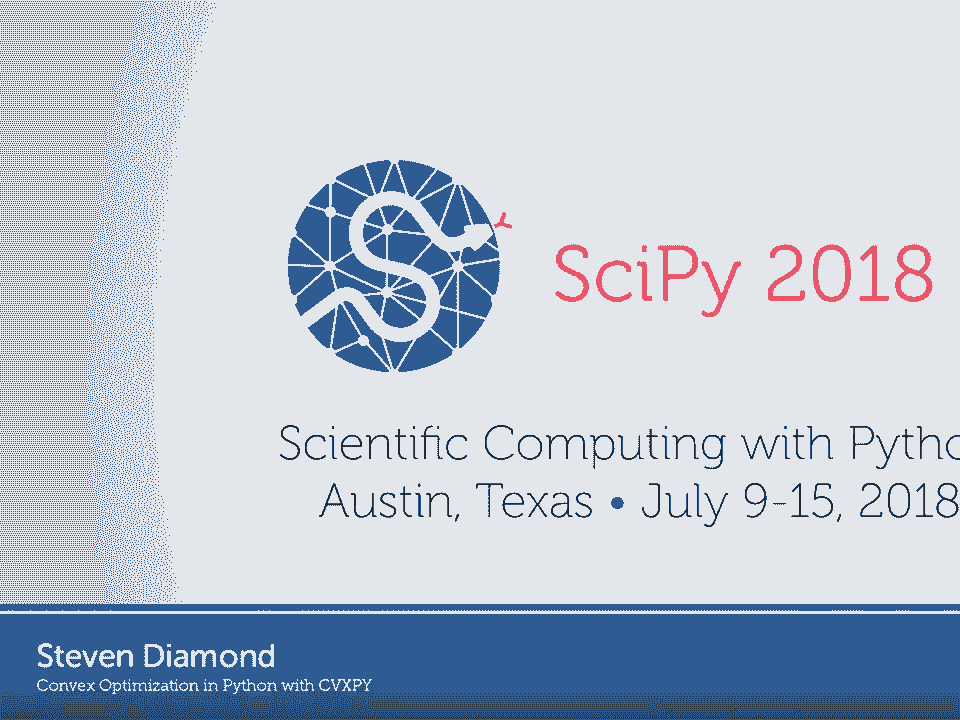
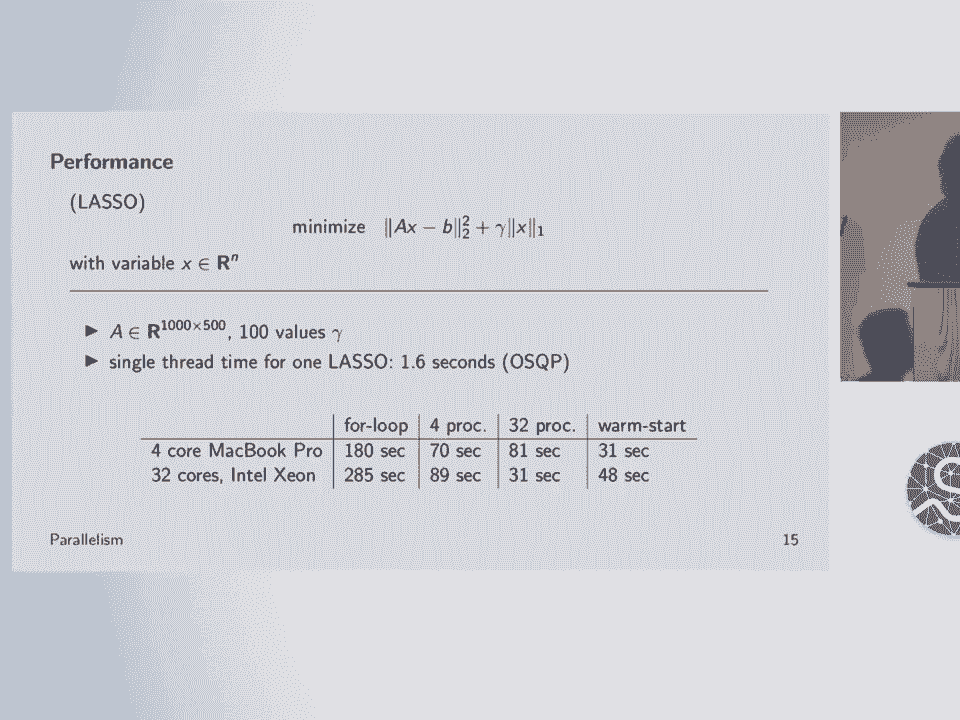
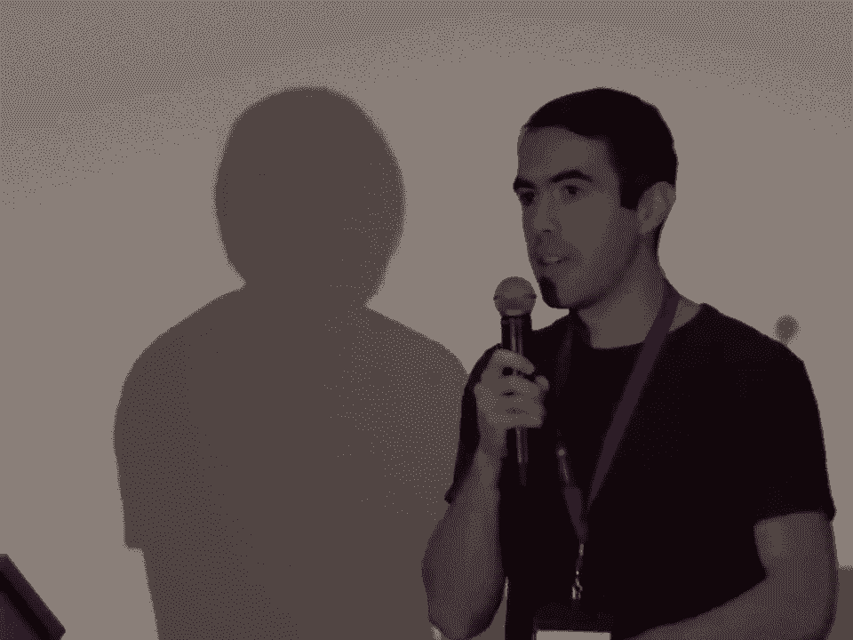

# 42：使用 CVXPY 在 Python 中进行凸优化 🚀



在本节课中，我们将学习什么是凸优化，以及如何使用 Python 库 CVXPY 来轻松地建模和求解凸优化问题。我们将从基本概念开始，逐步深入到实际应用示例。

## 概述

凸优化是一类特殊的数学优化问题，它在机器学习、控制、金融和工程等众多领域有着广泛的应用。本节课将介绍凸优化的基本形式、优势，并重点讲解如何使用 CVXPY 这一建模语言来高效地解决此类问题。

## 什么是凸优化？📈

上一节我们介绍了课程目标，本节中我们来看看凸优化的具体定义。

一个凸优化问题具有以下标准形式。你需要求解一个决策变量 **X**。你有一个目标函数 **f0(X)** 需要最小化。你有一系列不等式约束，形式为 **fi(X) ≤ 0**。此外，还有线性等式约束 **A*X = b**。最关键的限制是，所有这些函数 **f0** 到 **fm** 都必须是凸函数。

凸性有一个正式的定义，但直观上理解，它意味着函数具有“向上弯曲”的形状，就像抛物线一样。这是一个受限制的优化问题类别，但事实证明它非常有用。

凸优化之所以重要，原因有很多。首先，它有非常优雅的理论来解释如何分析这些问题，有高效的求解算法，并能保证找到问题的最优解。其次，针对这类问题，已经开发出了大量高质量、稳健的求解软件。

一个有趣的事实是，尽管这是一个受限的类别，但它几乎适用于我们研究过的所有领域，包括机器学习、统计学、控制（例如 SpaceX 火箭着陆）、信号与图像处理、网络、工程设计和金融等。

## 如何求解凸优化问题？🔧

求解凸优化问题主要有三种方法。

第一种是使用针对特定标准形式开发的求解器软件。以下是几种常见的标准形式：
*   **线性规划**：目标函数和约束均为线性。
*   **二次规划**：目标函数为二次，约束为线性。
*   **二阶锥规划**：一种更专业的形式。

许多实际问题可以被转化为这些标准形式，从而利用这些高度优化的求解器。

第二种方法是为你特定的问题编写自定义求解器。如果你的问题规模非常大，或者具有标准求解器无法利用的特殊结构，或者有实时性要求，这种方法可能是值得的。但这显然需要更多的工作量。

第三种方法，也是本节课重点介绍的方法，是使用**建模语言**。这种方法结合了前两种方法的优点。你无需担心如何将问题映射到某种标准形式（这个过程可能非常繁琐且容易出错），建模语言会自动完成这个转换，就像编译器将高级语言翻译成机器码一样。

## 凸优化建模语言与 DCP 🌲

上一节我们介绍了求解凸问题的不同方法，本节中我们来看看建模语言的核心机制。

凸优化建模语言（如 CVXPY）主要有两个功能：一是验证问题的凸性，二是将问题转换为标准形式。

凸性验证通过一种称为** disciplined convex programming** 的规则系统来实现，这类似于编程中的类型检查。其基本原理是将目标函数和约束视为表达式树，然后使用一套简单的规则来确定树中每个节点的曲率（凸性）。如果无法确定曲率，则意味着表达式不符合 DCP 规则，就像出现了类型错误。

在 DCP 框架下，表达式由变量、常数和参数作为叶子节点，并通过一个预定义的函数库组合而成。用户不能自定义函数，只能使用库中提供的、已知其凸性属性的函数。这保证了系统的有效性和可靠性。

如果你想了解更多关于 DCP 的规则，可以访问 `dcp.stanford.edu`。

## 介绍 CVXPY 🐍

现在让我们聚焦到 CVXPY 本身。CVXPY 是一个用 Python 编写的现代凸优化建模语言。它使用 DCP 规则来验证凸性，并会分析表达式的符号等属性。

CVXPY 是开源的，并且它本身**不是一个求解器**，而是一个建模框架。它可以连接许多不同的求解器，包括多个开源求解器。它支持一些有趣的功能，例如**参数**，这是一种可以在构建问题后修改的符号常量，非常有用。

CVXPY 能够与普通的 Python 代码无缝协作，这是在 Python 环境中相比 MATLAB 等平台的一大优势。它已被广泛应用于研究、课程和工业界。

CVXPY 默认附带三个开源求解器：ECOS、SCS 和 OSQP。不同的求解器有不同的优缺点，适用于不同类型的问题。支持多种求解器并允许用户接入自己的求解器是 CVXPY 的设计理念之一。

## CVXPY 代码示例 💻

以下是使用 CVXPY 表达一个凸优化问题的代码示例。该问题是一个带有约束的 Lasso 回归变体。

```python
import cvxpy as cp
import numpy as np

# 定义变量
m, n = 20, 10
A = np.random.randn(m, n)
b = np.random.randn(m)

x = cp.Variable(n)          # 定义决策变量 x
cost = cp.sum_squares(A @ x - b) + 0.1 * cp.norm(x, 1)  # 目标函数：最小二乘 + L1 正则项
objective = cp.Minimize(cost)  # 声明最小化目标
constraints = [cp.sum(x) == 0, cp.norm(x, ‘inf‘) <= 1]  # 约束：和为0，无穷范数<=1
problem = cp.Problem(objective, constraints)  # 构建问题
result = problem.solve()  # 求解问题
print(x.value)  # 打印最优解
```

请注意代码与数学公式的相似性。我们声明变量，使用 CVXPY 预定义的函数（如 `sum_squares`, `norm`）和重载的运算符（如 `@`, `+`, `<=`）来构建表达式树。然后形成目标、约束，并构建问题对象。

最关键的一步是 `problem.solve()`。你不需要指定使用哪种算法，也不需要设置学习率等超参数。你只需调用 `.solve()`，它就会工作。这是凸优化的主要优势：你可以专注于**要解决什么问题**，而不是**如何解决它**。对于许多非凸问题，方法和结果常常纠缠不清，而凸优化避免了这种复杂性。

## 与 Python 代码结合使用 🔄

CVXPY 可以轻松地与普通 Python 代码结合。以下是一个使用参数和循环来生成正则化路径（trade-off curve）的例子。

```python
import cvxpy as cp
import numpy as np

# 定义问题和参数
m, n = 20, 10
A = np.random.randn(m, n)
b = np.random.randn(m)
x = cp.Variable(n)
gamma = cp.Parameter(nonneg=True)  # 定义非负参数
cost = cp.sum_squares(A @ x - b) + gamma * cp.norm(x, 1)
problem = cp.Problem(cp.Minimize(cost))

# 遍历不同的 gamma 值
gamma_vals = np.logspace(-4, 2, 100)
solutions = []
for val in gamma_vals:
    gamma.value = val  # 更新参数值
    problem.solve()
    solutions.append(x.value.copy())
```

你还可以利用 Python 的并行库（如 `multiprocessing`）来并行求解多个参数值的问题，从而加速计算。

## 应用实例：投资组合优化 📊

让我们看一个实际的例子：投资组合优化。假设你有一笔资金要投资于多种资产，你希望最大化预期收益，同时控制风险。

问题可以建模如下：
*   **变量 w**：资产配置权重向量（投资于每种资产的比例）。
*   **目标**：最大化 **μ^T w - γ * (w^T Σ w)**，其中 **μ** 是预期收益向量，**Σ** 是收益的协方差矩阵（衡量风险），**γ** 是风险厌恶参数。
*   **约束**：权重之和为 1（全部投资），并且可以要求权重非负（不允许卖空）。

使用 CVXPY 可以轻松建模并求解。通过变化 **γ** 的值，可以得到一条“有效前沿”曲线，展示了风险与收益之间的最佳权衡。在模拟中，优化后的投资组合（绿色曲线）相比只持有单一资产（红色圆点）在相同风险下能获得更高收益，或在相同收益下承担更低风险。

## 应用实例：电力系统管理 ⚡

另一个复杂例子是电力系统管理。系统中包含发电机、负载（用电设备）、储能电池、输电线路等设备。每个设备都有其成本函数和运行约束（如发电/用电上下限）。

我们可以为每个设备建立凸优化模型，然后将它们通过代表电网节点的“网络”连接起来。网络约束确保每个节点的功率收支平衡（流入等于流出）。将所有这些设备的成本和约束汇总，形成一个大的凸优化问题，调用 `.solve()` 即可得到最优的发电/用电/储能计划。

这种方法还可以计算出“节点边际电价”，即电网中不同位置的电能价格。通过对象导向的编程方式，我们可以创建 `Generator`、`Load`、`Storage` 等类，每个类自动构建其自身的优化模型部分，使系统建模非常清晰。



## 总结与资源 📚


本节课中我们一起学习了凸优化的基本概念及其广泛的应用领域。我们重点介绍了 CVXPY 这一强大的 Python 建模工具，它通过 DCP 规则自动验证凸性并将问题转换为标准形式，让用户能够以近乎数学公式的方式直观地描述问题，并通过简单的 `.solve()` 方法获得可靠解。

我们通过投资组合优化和电力系统管理两个实例，展示了 CVXPY 解决实际问题的能力。

如果你想深入学习，可以访问以下资源：
*   **CVXPY 官网**：`cvxpy.org`，上面有详细的教程和示例。
*   **DCP 规则网站**：`dcp.stanford.edu`。
*   **GitHub**：CVXPY 及其相关生态包。



CVXPY 使得凸优化变得简单易用，无论你是学者、工程师还是学生，都可以尝试用它来解决你遇到的优化问题。