# 43：使用统计距离进行异常检测 🎯

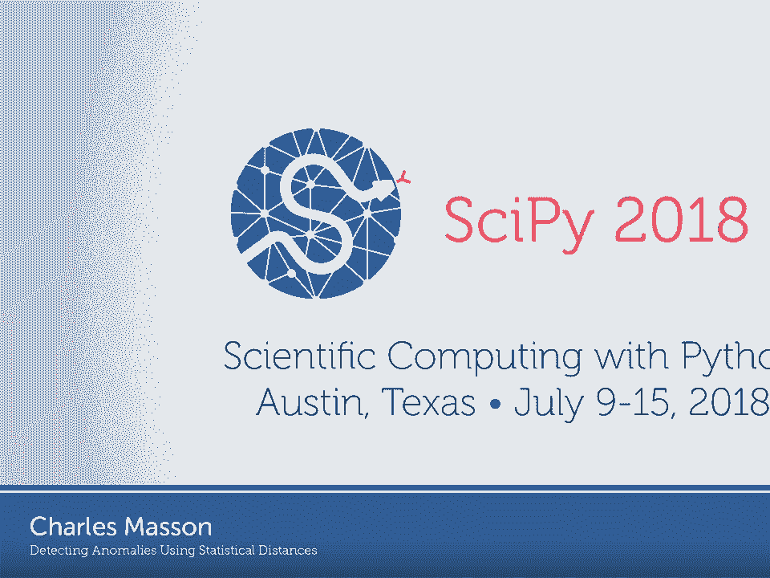

在本课程中，我们将学习如何使用统计距离来检测数据中的异常。我们将从简单的样本统计量方法入手，探讨其局限性，然后引入更强大的统计距离概念，特别是柯尔莫哥洛夫-斯米尔诺夫距离、推土机距离和瓦瑟斯坦距离，并了解它们在SciPy库中的实现。

## 概述

异常检测是监控和数据科学中的核心任务。传统的基于单一统计量（如均值、最大值）的方法存在局限。本课程将介绍如何利用统计距离，即衡量两个概率分布之间差异的度量，来更全面、更定量地识别异常。

## 从样本统计量到统计距离

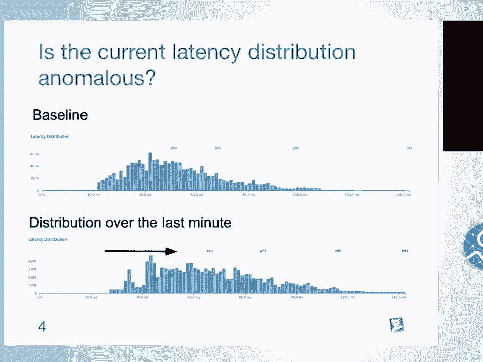

上一节我们提到了使用均值或百分位数等单一统计量进行异常检测的局限性。它们可能无法捕捉到分布形状的细微变化。本节中，我们来看看如何利用整个分布的信息。

一个直观的想法是同时使用多个样本统计量，但这需要设计复杂的合并准则。另一种更系统的解决方案是使用**统计距离**。

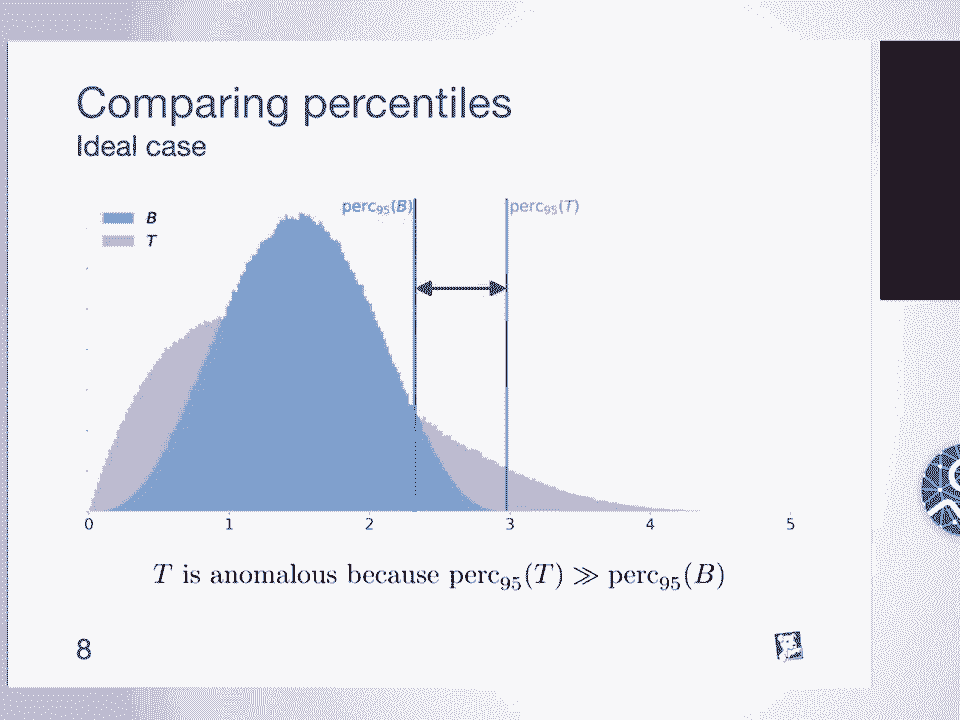

简而言之，统计距离是衡量两个统计对象（如概率分布）之间差异的度量。

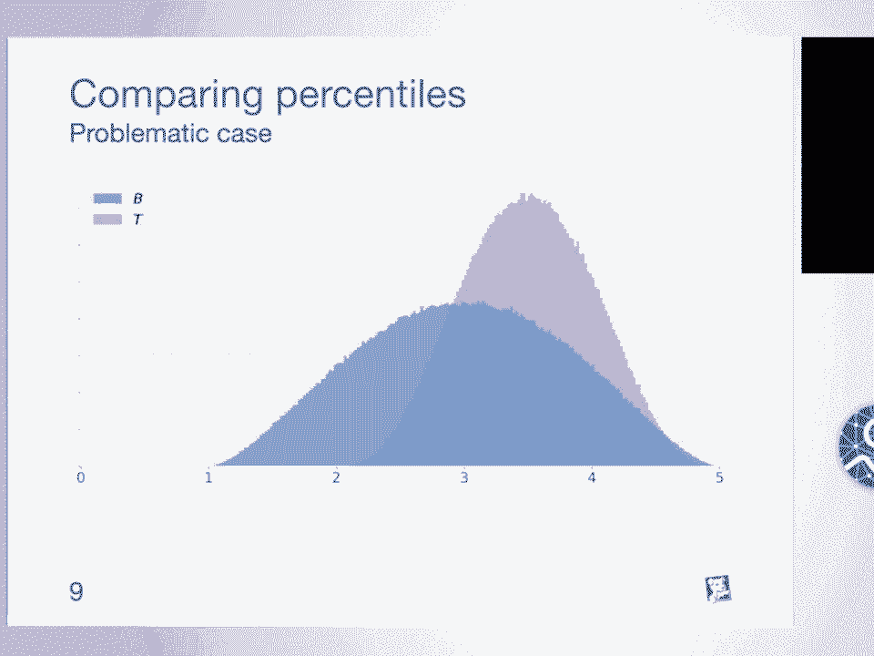

## 柯尔莫哥洛夫-斯米尔诺夫距离

一个广为人知的统计距离是**柯尔莫哥洛夫-斯米尔诺夫距离**，它常用于检验一个样本是否来自某个参考分布，或两个样本是否来自同一分布。

其计算方法是：绘制两个分布的累积分布函数，然后计算两个CDF之间绝对差值的最大值。

$$
D_{KS} = \sup_x |F_1(x) - F_2(x)|
$$

这个值介于0和1之间。在假设检验中，我们会将其与一个临界值比较，以决定是否拒绝“两个分布相同”的原假设。我们可以利用这一点来判断测试分布是否异常：如果拒绝原假设，则视为异常。

KS距离的优点是它是一个真正的**距离度量**，满足非负性、对称性和三角不等式。这意味着我们可以将分布视为度量空间中的点，从而应用各种算法（如离群点检测、聚类）。

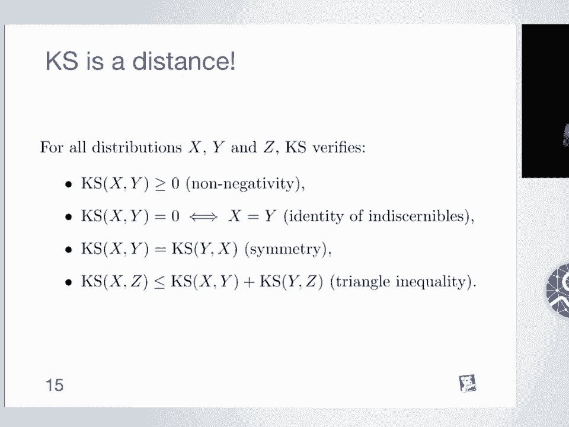

然而，KS距离在检测某些类型的异常时可能不够敏感。例如，当两个均匀分布完全不重叠时，KS距离达到最大值1，之后便无法区分它们分离的“远近”程度。

## 推土机距离与瓦瑟斯坦距离

为了解决KS距离的不足，我们需要一个能更好捕捉分布“移动”成本的度量。这就是**推土机距离**（Earth Mover‘s Distance）或**瓦瑟斯坦距离**（Wasserstein Distance）的思想。

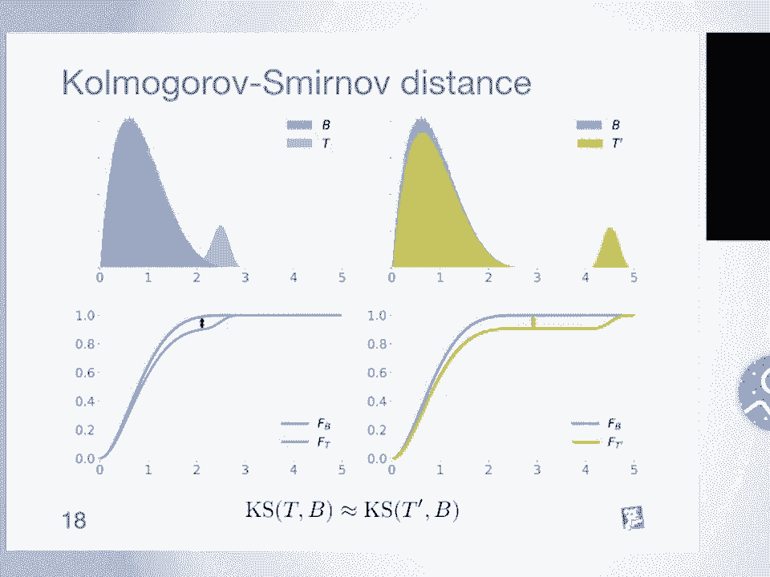

我们可以想象两个分布是两堆土，我们的目标是通过移动泥土，将一堆土变成另一堆土的形状。**推土机距离**定义为完成这个转变所需的最小“工作量”，其中工作量是移动的土方量乘以移动的距离。

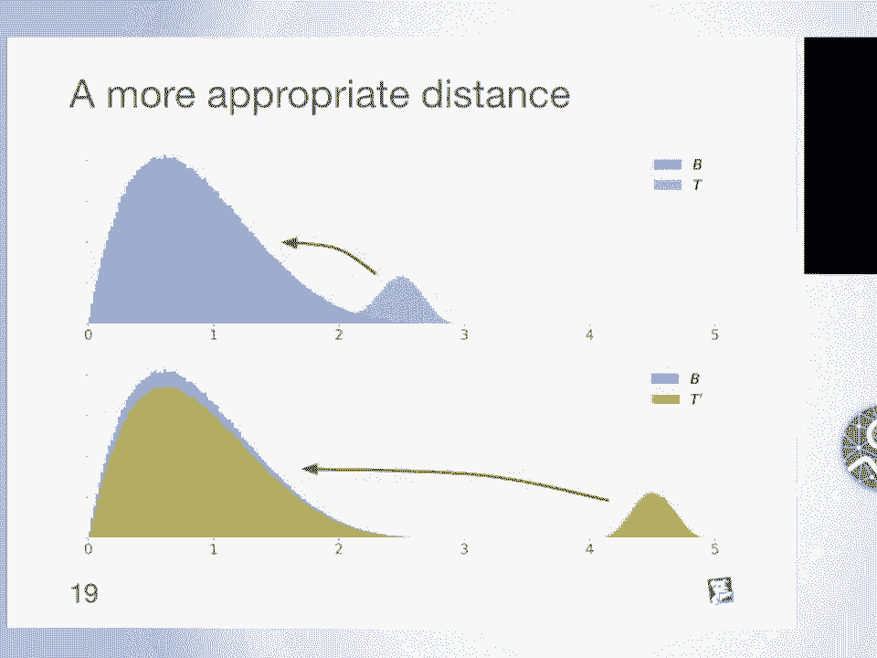

在一维情况下，瓦瑟斯坦距离有一个非常简洁的计算方式：它等于两个分布的累积分布函数之间区域的面积。

$$
W_1 = \int_{-\infty}^{\infty} |F_1(x) - F_2(x)| dx
$$

这使得它易于计算，并且直观上，如果分布的“土堆”需要移动更远才能匹配，这个面积就会更大。因此，对于之前KS距离无法区分的案例，瓦瑟斯坦距离能给出更有区分度的结果。

## 更一般的距离族：p-瓦瑟斯坦距离

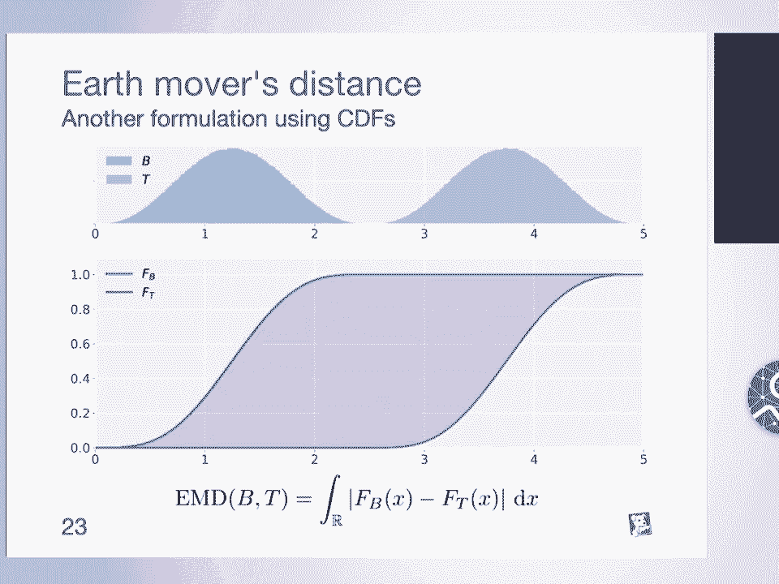

瓦瑟斯坦距离可以进一步推广。如果我们不是取CDF之差的绝对值，而是取其p次方，就得到了**p-瓦瑟斯坦距离**族。

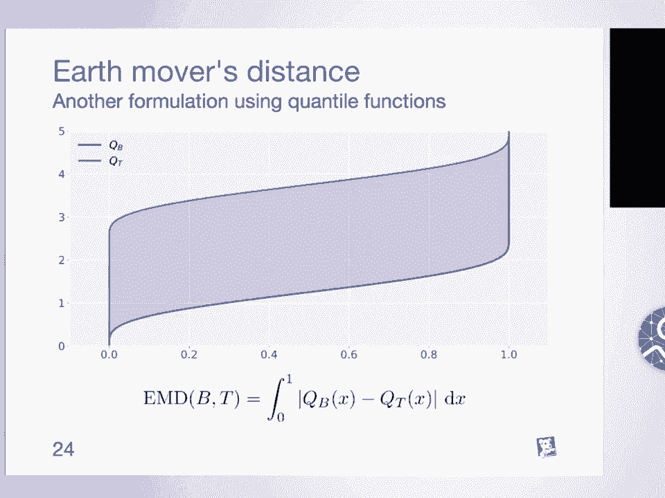

$$
W_p = \left( \int_{0}^{1} |F_1^{-1}(q) - F_2^{-1}(q)|^p dq \right)^{1/p}
$$

其中 $F^{-1}$ 是分位数函数。当 $p=1$ 时，就是标准的推土机距离。当 $p=2$ 时，我们得到**克拉默-冯·米塞斯距离**，它与克拉默-冯·米塞斯检验有关。

这些不同的p值让我们可以调整对“大差异”的惩罚程度。p越大，对分布尾部差异越敏感。

## 在SciPy中的实现与应用

理论需要付诸实践。我们需要计算实际数据（如数据样本、直方图）之间的距离，而非理论分布。

在SciPy中，`scipy.stats` 模块已经实现了这些距离。柯尔莫哥洛夫-斯米尔诺夫距离早已存在，而瓦瑟斯坦距离和克拉默-冯·米塞斯距离也在近期被加入。

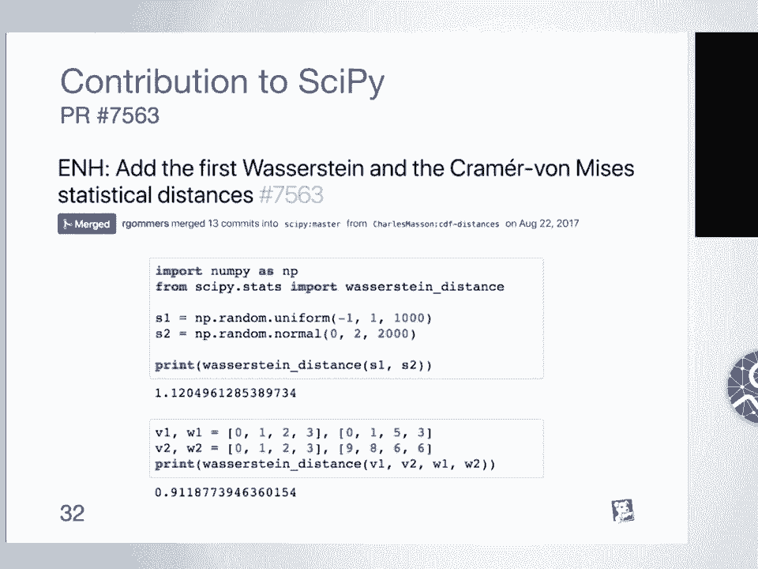

以下是如何使用它们的示例：

```python
import numpy as np
from scipy import stats

# 生成两个样本
sample1 = np.random.uniform(0, 1, 1000)
sample2 = np.random.normal(0.5, 0.1, 1000)

# 计算KS距离
ks_dist = stats.ks_2samp(sample1, sample2).statistic

# 计算1-瓦瑟斯坦距离（推土机距离）
wasserstein_dist = stats.wasserstein_distance(sample1, sample2)

# 计算克拉默-冯·米塞斯距离（p=2的瓦瑟斯坦距离的一种）
# 注意：可能需要通过积分CDF差值的平方来计算
# 或者使用自定义函数，因为scipy.stats的`cramervonmises_2samp`是用于检验的
```

这些函数也支持带权重的数据，例如直方图。

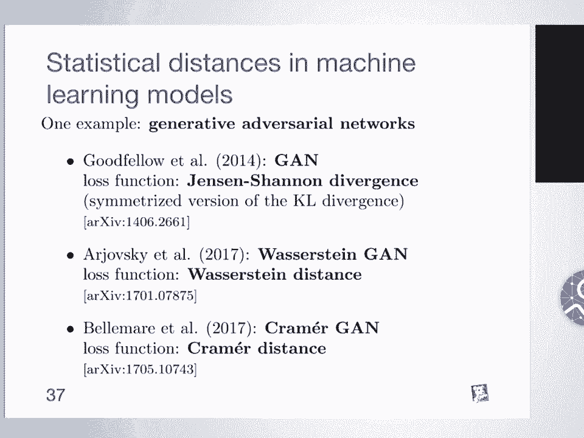

## 统计距离的广阔世界

我们主要讨论了一维空间中的距离，但统计距离的概念远不止于此。

*   **多维空间**：许多统计距离可以定义在多维甚至度量空间中，应用于图像识别、模式匹配等领域。例如，推土机距离可用于比较两张图片的颜色分布。
*   **散度**：还有一类更弱的度量叫**散度**，它只要求非负性和同一性。一个重要的例子是**KL散度**，它被广泛应用于机器学习中。事实上，最大似然估计等价于最小化KL散度。
*   **在生成模型中的应用**：统计距离在现代机器学习中至关重要。例如，生成对抗网络最初的损失函数基于JS散度，但后来研究者发现使用**瓦瑟斯坦距离**作为损失函数能解决训练不稳定、模式崩溃等问题，从而催生了WGAN。随后，进一步改进的**对偶散度**也被引入。

## 总结

本节课我们一起学习了如何使用统计距离进行异常检测。

1.  我们首先认识到单一样本统计量的局限性。
2.  然后引入了**统计距离**的概念，并以**柯尔莫哥洛夫-斯米尔诺夫距离**为例，它提供了分布差异的定量度量。
3.  为了更细致地捕捉分布形态变化，我们学习了**推土机距离/瓦瑟斯坦距离**，它通过“移动土方”的最小成本来定义差异。
4.  我们进一步了解了更一般的**p-瓦瑟斯坦距离**族，以及**克拉默-冯·米塞斯距离**。
5.  接着，我们看到了这些距离如何在SciPy库中实现，并应用于实际数据样本和直方图。
6.  最后，我们展望了统计距离更广阔的应用场景，包括多维空间、散度以及在尖端机器学习模型（如GANs）中的关键作用。

统计距离为我们提供了一套强大而灵活的工具，能够深入到数据分布的本质去度量差异，是进行高级异常检测和数据分析的基石。