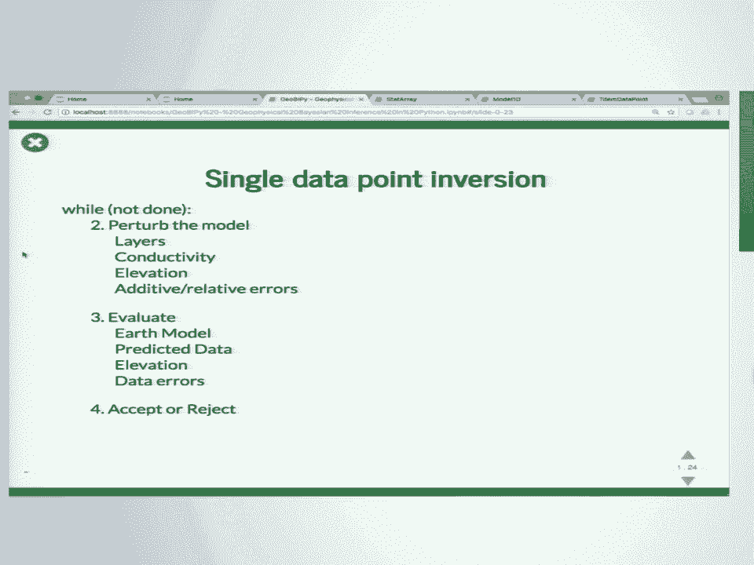
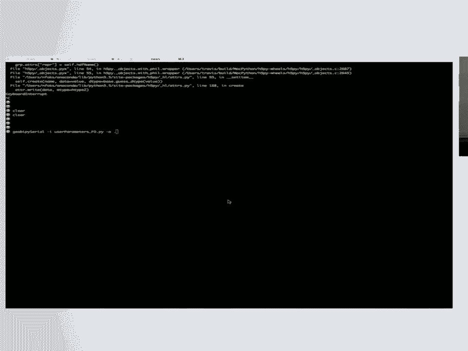
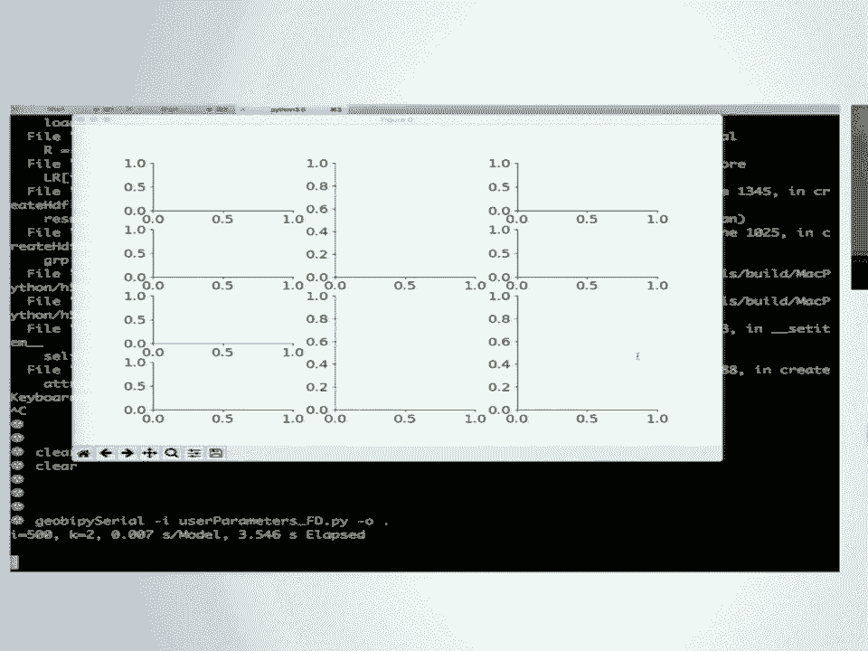
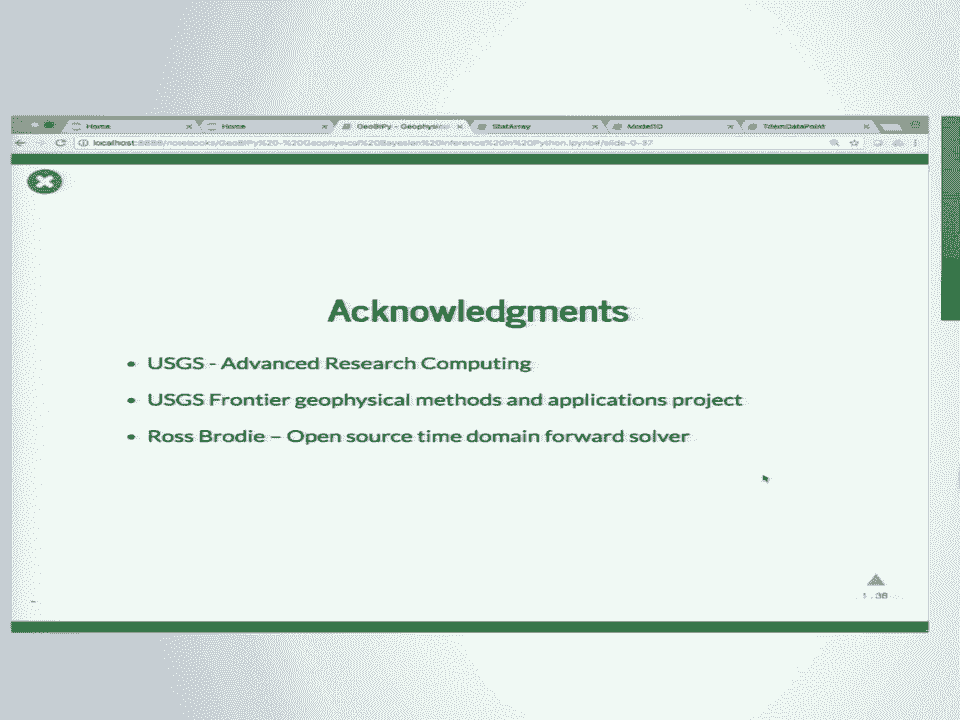

# 44：GeoBIPy - Python 中的地球物理贝叶斯推断 🧭

在本节课中，我们将学习一个名为 GeoBIPy 的 Python 软件包。它用于处理地球物理数据，特别是电磁数据，并采用贝叶斯方法进行反演。我们将了解其设计动机、核心构建模块、并行算法以及如何高效处理大规模数据。

---

## 概述

GeoBIPy 是一个用于地球物理数据贝叶斯反演的开源 Python 框架。它由美国地质调查局（USGS）的团队开发，旨在将原有的 MATLAB 代码迁移到 Python，并实现并行化和可扩展性。该软件采用面向对象设计，利用 MPI 进行大规模并行计算，并使用 HDF5 进行高效的文件读写。

---

## 背景与动机

上一节我们介绍了课程概述，本节中我们来看看开发 GeoBIPy 的背景和动机。

项目合作者 Brooke Minzley 之前编写了大量的 MATLAB 代码用于地球物理反演。这些代码是过程式的，分散在许多函数中。他的新需求是：
*   将代码从 MATLAB 迁移到 Python。
*   实现代码的并行化与可扩展性。
*   采用面向对象的编程范式。
*   避免支付软件许可费用。
*   解决高性能计算（HPC）中常见的文件 I/O 瓶颈问题。

---

## 地球物理电磁法简介

在深入技术细节之前，我们需要了解一些基础地球物理概念。

电磁法是地球物理勘探的一种方法。如下图所示，一架直升机拖曳着两个大型线圈：一个发射器和一个接收器。



发射器线圈通电后产生电磁场，激发地下介质的电导率属性，进而产生次级信号。接收器线圈测量这个感应电压。通过飞机或直升机携带系统进行大面积测量，单个数据集可能包含数万到数千万个数据点。这种方法广泛应用于地下水建模、永冻层研究、污染羽流探测和关键矿产资源勘查。

---

## 地球物理建模与反演

上一节我们了解了数据采集，本节中我们来看看如何利用这些数据推断地下结构。

地球物理建模与反演是一个“从数据到模型”的过程。
*   **正演建模**：已知地下物理结构（模型），通过物理方程（如积分方程、偏微分方程）计算合成数据。
*   **反演问题**：实际情况是我们不知道地下结构。我们通过飞机测量获得带有不确定性的地球物理数据，目标是利用物理原理、数学和优化方法，从数据中估计最可能的地下模型及其不确定性。

在贝叶斯框架下，这个过程会通过大量（数十万到数百万次）随机采样反复进行，最终不仅得到最可能的地下模型，还能获得所有模型参数的不确定性信息。

---

## GeoBIPy 框架介绍

基于贝叶斯反演的需求，GeoBIPy 应运而生。

GeoBIPy 代表“Geophysical Bayesian Inference in Python”。它的核心特点是：
*   采用**随机跨维马尔可夫链蒙特卡洛（Transdimensional MCMC）**方法，允许反演过程中模型的维度（如地层数量）发生变化。
*   **面向对象**设计。
*   使用 **MPI** 和 **mpi4py** 实现大规模并行。
*   利用 **HDF5** 和 **h5py** 的并行功能进行快速文件读写。

该软件是免费开源的，项目地址为：`github.com/usgs/geobipy`。文档齐全，并提供了大量 Jupyter Notebook 示例来指导用户如何使用各个类。

---

## 核心构建模块

了解了整体框架后，我们深入其核心构建模块。

### StatArray：基础数据类

最基本的构建块是 `StatArray` 类。它扩展了 NumPy 数组，为其附加了名称和单位，便于绘图和保存元数据。

```python
import geobipy
x = geobipy.StatArray(5, name='Conductivity', units='S/m')
```

在贝叶斯框架中，我们需要为待求解的参数附加**先验分布**和**建议分布**。

```python
x.set_prior('normal', mean=4.0, variance=1.0)  # 设置先验分布
x.set_proposal('uniform', min=2.0, max=6.0)    # 设置建议分布
```
`set_prior` 用于评估当前值在先验分布下的概率，`set_proposal` 用于根据建议分布生成新的随机提议值。

### Model1D：一维层状地球模型

我们用 `StatArray` 来构建表示一维层状地球的模型类 `Model1D`。它包含了层数、每层厚度、界面深度以及每层的物性值（如电导率）。

```python
# 假设参数（电导率）已定义为 StatArray
parameters = geobipy.StatArray(...)
thicknesses = geobipy.StatArray([10.0, 10.0, 10.0], name='Thickness', units='m')
model = geobipy.Model1D(parameters=parameters, thicknesses=thicknesses)
```

### 模型的扰动（Perturbation）




MCMC 算法的核心是能够对模型进行随机“扰动”。对于一维层状模型，扰动包括：
1.  **Birth**：增加一个层/界面。
2.  **Death**：删除一个层/界面。
3.  **Change**：改变一个界面的深度。
4.  **No Change**：保持不变。

每个操作都对应一个发生概率。在改变模型结构后，会使用随机牛顿法（利用负对数后验的 Hessian 矩阵和梯度信息）来智能地更新各层的电导率值。



```python
# 使模型可扰动，并设置各操作的概率
model.make_perturbable(birth_prob=0.3, death_prob=0.3, change_prob=0.3, no_change_prob=0.1)
# 执行一次扰动
new_model = model.perturb()
```

### 地球物理数据点

GeoBIPy 有专门的类来表示单个地球物理数据点，例如时间域或频率域电磁数据。数据通常从 ASCII 文件读入，同时需要一个系统文件来描述采集参数（如频率、线圈间距）。

```python
# 读取数据集并获取第一个数据点
data = geobipy.TimeDomainData.read_ascii('data_file.txt', 'system_file.txt')
data_point = data[0]
```

数据点类知道如何进行正演模拟和计算灵敏度。灵敏度矩阵是数据对电导率的偏导数，在反演中至关重要。

```python
# 使用之前定义的 model 进行正演计算合成数据
synthetic_data = data_point.forward(model)
# 计算灵敏度矩阵
sensitivity_matrix = data_point.sensitivity(model)
```

---

## 单点反演算法流程

有了模型和数据点，单个数据点的反演算法流程如下：
1.  **扰动模型**：随机改变层数、电导率、直升机采集高程、数据误差估计等。
2.  **评估**：计算扰动后模型对应的后验概率。
3.  **接受/拒绝**：根据 Metropolis-Hastings 等准则决定是否接受这次扰动。
    *   如果拒绝，则回退到之前的模型。
    *   如果接受，则保留新模型。
4.  重复步骤 1-3，进行数万到数十万次迭代，形成一条马尔可夫链。

---

## 演示与可视化

理论需要实践验证，本节我们通过一个演示看看反演过程。

可以通过命令行工具运行反演。以下命令运行一个串行版本，进行 100,000 次迭代。

```bash
geobipy_serial user_input.py ./output_dir
```

在反演过程中，软件会生成交互式图表，动态显示：
*   **后验分布**：如模型层数的概率分布。
*   **最优模型**：当前最可能的模型（图中黄色线）。
*   **误差直方图**：附加误差和相对误差的分布。
*   **命中图（Hit Map）**：显示地下不同深度和电阻率区域被采样到的频率，反映了解的空间分布和不确定性。


这种交互式演示对于在大型并行计算前，先用少量数据点调试和确定先验参数非常有用。

---

## 大规模并行处理

单个数据点的反演可以演示原理，但实际数据量巨大，必须并行处理。

由于每个数据点的反演相互独立，这是一个**令人尴尬的并行（Embarrassingly Parallel）**问题，非常适合并行化。
*   **内存需求低**：每个核心通常只需不到 512 MB。
*   **通信极少**：采用主-从（Master-Worker）模式。
    1.  主进程创建所有数据点的随机列表。
    2.  主进程向每个工作进程发送一个数据点索引。
    3.  工作进程独立反演该数据点，将结果写入文件。
    4.  工作进程向主进程请求下一个数据点。

### 并行 I/O 与 HDF5

并行计算中，结果写入往往是最大瓶颈。如果每个核心写入一个独立的 ASCII 文件，对于千万级数据点将产生千万个文件，这会给文件系统和管理带来灾难。

**HDF5** 格式解决了这个问题：
*   **二进制格式**：读写速度快。
*   **并行写入**：支持多进程同时写入单个文件。
*   **高效索引**：其头文件采用平衡二叉树结构，可以快速访问文件中任意部分的数据。

在 GeoBIPy 中，我们预先在 HDF5 文件中为所有数据点的各种结果（如直方图、命中图）分配好空间。每个工作进程完成后，将结果写入文件中对应的预定位置，避免了写冲突。

---

## 结果成图与解释

处理完数据后，我们需要将结果可视化以进行地质解释。

GeoBIPy 提供了绘图类。例如，`LineResults` 类可以处理一条测线上的所有反演结果。

```python
line_results = geobipy.LineResults('results.h5', system_path='system.txt', axis='northing')
line_results.plot()
```

生成的图像如下图所示：
*   **Y轴**：深度或高程。
*   **X轴**：测点位置（如北坐标）。
*   **上部**：每个反演点处随深度变化的平均电导率。
*   **下部**：每个反演点处随深度变化的最可能电导率。
*   **颜色与透明度**：高电阻率显示为黄色，高电导率显示为蓝色。透明度与参数恢复的置信度相关，置信度低的区域更透明。


此外，还可以绘制每个数据点最优模型的层数图，或从界面深度直方图中提取可能的地下界面，甚至将整个三维数据体导出为 VTK 格式进行三维可视化。

---

## 性能优化

为了处理海量数据，性能至关重要。GeoBIPy 的核心计算部分均采用高性能代码实现：
1.  **向量化**：所有计算均使用 NumPy，避免 Python 循环。
2.  **底层重写**：将关键的频率域正演模拟器从纯 Python 重写为 NumPy，获得了 10 倍加速。进而重写为 Fortran，将每次模拟时间从 7 毫秒降至 4 毫秒。
3.  **减少内存开销**：避免 NumPy 广播产生的额外内存占用。

**计时统计示例**：
*   在一个包含 45,000 个数据点的案例中，使用 2,016 个核心，平均每个点耗时 24 分钟，总时间 12 小时。串行运行预计快 1,500 倍。
*   在一个包含 670,000 个数据点的大型案例中，使用 2,016 个核心，耗时 62 小时。若串行运行，则需要约 14 年，并行带来了近 2,000 倍的加速。

---

## 总结与展望

本节课中我们一起学习了 GeoBIPy，一个高效的地球物理贝叶斯反演 Python 框架。

**总结如下**：
*   GeoBIPy 利用随机跨维 MCMC 方法进行反演，能同时估计模型及其不确定性。
*   其面向对象设计和基于 MPI/HDF5 的并行 I/O 架构，使其能够高效处理多达数百万数据点的大规模问题。
*   通过性能优化（NumPy、Fortran），核心计算速度极快。
*   软件开源，文档完善，并提供了丰富的示例 Notebook。

**未来展望**：
*   **扩展数据类型**：框架可扩展至其他地球物理数据，如地面时域电磁、大地电磁、核磁共振、地震、激发极化等。
*   **增强功能**：计划引入并行回火、测点间通信以加入横向约束、结合钻孔数据提供硬约束等高级功能。

GeoBIPy 为地球物理贝叶斯反演提供了一个强大、可扩展的现代化工具，并致力于成为一个更通用的地球物理数据分析框架。



---